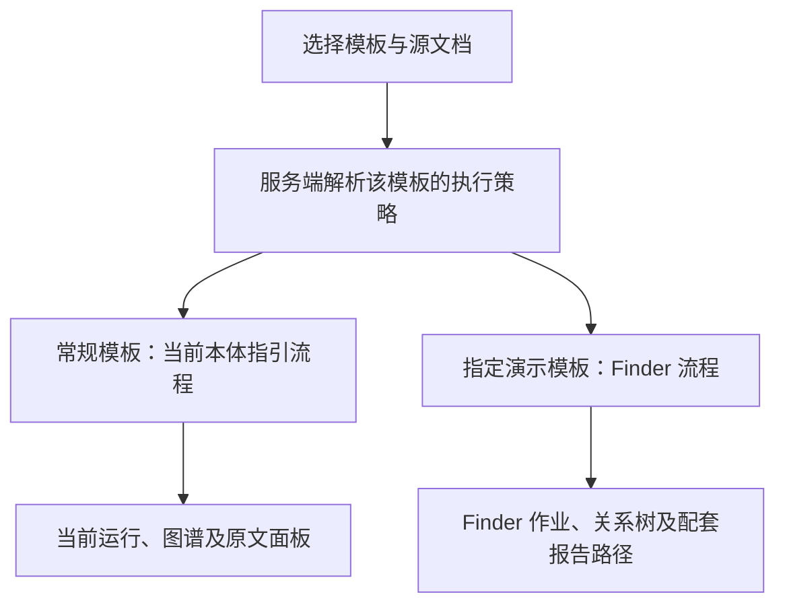

# Finder 双模式演示可行性分析

日期：2026-09-14。性质：代码调查与方案建议，尚未实施双模式。

后续范围已明确：用户选择当前应用内隔离移植 Finder，仅恢复指定模板的图谱、属性和原文展示。具体方案见[模板级 Finder 图谱演示实施方案](模板级Finder图谱演示实施方案-20260914.md)；下文保留不同范围的可行性比较，旧报告恢复不纳入本期。

## 1. 结论与分析范围

**可行，但当前没有可直接启用的 Finder 开关。建议在模板业务入口显式分流，保留当前本体指引内核的独立性。** 仅恢复 Finder 关系图谱属于中等范围改造；恢复旧版模板编辑、覆盖检查、风险计算和报告输出涉及更大范围，不能以“恢复一个抽取函数”估算。

用户给定的 Finder 基线为 `b6f9bd4e55822e20dce0a2ef0fa8f6d9fdd472c1`（2026-08-25）；它是当前 `HEAD=50b30b4` 的祖先。分析同时核对了当前工作区已有的未提交修复，未修改这些内容。两提交之间全仓库差异为 954 个文件；该数字说明版本跨度，不代表本需求要修改的文件数。

尚未获得指定模板 ID/修订、配套原件及演示截止时间。本文分别分析“展示真实 Finder 抽取图谱”和“从抽取到旧报告完整演示”，不默认某个已有 HRS5592 模板就是本次目标。未查询实际数据库，因此代码中的模板常量、迁移逻辑不代表目标环境的数据现状。

旧 Finder 本身也使用文档结构和本体。两种模式的实际区别是：旧模式按业务 Finder、Profile、执行注解和外部档案补充取数；当前模式通过文档结构、原文证据和本体约束执行通用识别与核验。

## 2. 已核验的实现差异

| 边界 | Finder 基线 | 当前实现及影响 |
|---|---|---|
| 识别入口 | `_compute_annotation` 执行分类、NER 和 Finder 关系后处理 | 模板源图谱使用 `TemplateDocumentRuns → DocumentAnalysisApplication → OntologyGuidedExecutor` |
| 分派依据 | 文档根类、本体关系菜单、Profile、`extractionMethod` 及部分目标类型专用策略 | 模板路径用于识别优先排序；没有模板级 Finder 模式字段 |
| Finder 实现 | `relation_extractor.py` 有具体策略、递归关系组装 | 同名文件现为 generic evidence runner 的兼容入口，不能通过旧函数名调用到基线算法 |
| 执行配置 | TTL 中的 `extractionMethod/Pattern/Profile/Anchor` | 当前本体加载器明确拒绝这些注解，旧 Profile 和分类模块已删除 |
| 默认源上传 | 创建 `ExtractionJob` 并标注 | 仍自动派发标注，但实际调用通用 runner；它与模板侧新图谱运行是两个执行域 |
| 图谱结果 | 嵌套 `relationships`、属性、`source_ref` | 当前新图具有独立运行身份、断言/证明状态、coverage 和 run-owned 原文引用，结果不能直接互换 |
| 模板编辑 | V1 Slot 模板及对应覆盖/预览 | V1 页面只读，V2 使用新输出编辑器；格式版本不是算法模式 |
| 报告执行 | 关系富化、旧风险规则、覆盖检查、旧产文模块 | 旧 URL 也进入 V2 `ReportRunService`，读取作业的证据/已发布事实快照；不直接消费新图或旧 Finder 字典 |

主要当前代码依据：

- [模板源运行桥接](../backend/app/services/document_analysis/template_runs.py)：`create` 固定模板 hash、源作业及优先路径；`latest` 当前按 owner、模板、源作业检索，未区分算法模式。
- [文档运行应用边界](../backend/app/services/document_analysis/application.py)：`origin` 进入请求哈希；[执行入口](../backend/app/services/document_analysis/execution.py) 的 `_recognition_fingerprint` 也包含 `origin`，执行器明确为 `OntologyGuidedExecutor`。
- [关系抽取兼容入口](../backend/app/services/extraction/relation_extractor.py)、[执行注解拒绝逻辑](../backend/app/services/extraction/retired_config.py)、[本体引擎](../backend/app/services/ontology_engine.py)。
- [默认源上传](../backend/app/api/ast_templates.py) 的 `upload_default_source` 创建 `mode=template_default` 作业并调用 `_enqueue_annotation`；[标注实现](../backend/app/api/extraction.py) 已改为通用 runner。
- [模板编辑页](../frontend/src/app/(dashboard)/settings/ast-templates/[templateId]/page.tsx)、[模板源侧栏](../frontend/src/components/extraction/template-slot-editor.tsx)、[新运行 Hook](../frontend/src/components/analysis/use-template-document-run.ts)。
- [旧报告 URL 兼容层](../backend/app/services/reporting/legacy_facade.py)、[报告运行服务](../backend/app/services/reporting/report_run_service.py) 的 `start`、`_require_report_source`。

历史依据均来自用户给定提交，可用 `git show <基线提交>:<路径>` 定位：

- `backend/app/api/extraction.py:348`：旧 `_compute_annotation`；约 427 行执行 Finder 后处理。
- `backend/app/services/extraction/relation_extractor.py:1265`：策略表；1407 行 `extract_relationships` 不接收模板 ID。
- `backend/app/services/reporting/risk_report_generator.py:499`：`_enriched_edges` 依赖设备档案富化、APS 设备解析及模板驱动的小组关系。

## 3. 建议的分流边界

分流位置应在模板应用服务与相关上传/执行入口，不进入 `ontology_guided` 共享识别核心。报告模式必须随演示范围明确：选择 Finder 抽取，并不会自动使 V1 报告兼容 V2。

### 3.1 最小配置

若本期只是少量固定演示模板，可使用一份服务端配置，将**确切模板 ID/修订映射到 Finder 基线配置**，其余模板默认当前模式。服务端把解析结果返回页面，并在创建任务时固定它；不要只在浏览器保存模式。这个方案无需为了演示新增模板数据库列或通用策略平台。

若需要在模板管理界面持续编辑模式，则增加独立的 `AstTemplate.recognition_mode` 元字段及迁移，并同步 API 与前端类型。两种存储方式择一作为权威选择来源，不同时维护可相互覆盖的开关。

建议值可为 `ontology_guided` 与 `finder_legacy`；这些是拟议名称，当前没有实现。不要复用以下字段：

- `schema_version`：表达 V1/V2 报告协议。
- `iri_pattern`：用于文档类型匹配。
- `source_config.mode=template_default`：表达作业业务用途。
- `demo_profile`：表达当前固定数据的静态批记录演示。

直接往 V2 `schema_json` 塞未声明的模式字段也不可行，当前模板模型禁止未知字段。模板模式属于执行选择，不需要改变其输出绑定语义。

### 3.2 执行与结果

1. 模板默认源上传、显式识别、重新识别和对应读取入口采用同一模式判定。Finder 模板不能先自动运行当前通用标注，再由另一按钮运行 Finder。
2. 创建执行时固定模板修订、模式和 Finder 配置版本。当前模式可复用既有 `origin`；进程内 Finder 若复用标注执行域，可利用 `AnnotationExecution.options` 保存本次选择。独立旧实例则固定其自己的作业与基线环境，不需要伪造新内核运行。
3. 不同模式使用各自的执行状态和结果缓存；不能把新模式断点交给 Finder，也不能将 Finder 结果标成新内核已核验断言。模式变化只影响新执行。
4. 原标注缓存和执行头以 `job_id` 为粒度，模板修订可能共享源作业。需要为 Finder 创建独立作业引用原件副本，或明确拒绝共享作业的模式冲突，不能只给同一份缓存追加模式标签就允许并发覆盖。
5. 当前模式保持已有暂停/继续行为；Finder 按实际恢复的任务能力呈现控制项，不为演示新增完整的新内核控制协议。打开、刷新和切换展示不启动模型任务；执行失败也不自动换另一模式。
6. 页面展示本次使用的模式，并按其结果形状选择图谱/原文面板。模式标识服务于演示者识别当前流程，无需暴露内部组件名称。

## 4. 三种落地方式及选择

| 方式 | 对当前版本的接入 | 适用范围 | 主要代价 |
|---|---|---|---|
| A. 进程内隔离移植 Finder | 当前应用按模板调用独立 Finder 模块及配置提供者 | 同一应用真实识别，重点为指定模板的关系树与属性 | 恢复被删除依赖，适配解析结果、配置、缓存和面板；需逐模板回归 |
| B. 当前入口连接隔离基线实例 | 当前模板入口定向进入基线演示流程，非指定模板继续当前应用 | 演示时间紧，需尽量复现旧版模板、识别、覆盖及报告 | 多一个受限演示实例和独立数据；入口可统一，旧演示页面不必与新编辑器完全一致 |
| C. Finder 输出接入当前 V2 报告 | 在 A 的基础上转换成当前证据、身份、审核/发布与报告输入契约 | 明确要求同一套新报告界面和语义消费两种来源 | 适配范围最大，旧关系缺少的证明与状态不能靠字段映射补齐 |

**以近期演示保真为优先，若包含旧版完整报告，建议 B；若要求同一后端且只需恢复图谱效果，建议 A。** 用户若要求同一编辑器和同一报告管线，应按 C 的工作范围评估。B 代表统一入口下两个运行版本，不应宣称已经实现单一后端内的双引擎。

A 的最小依赖是指定模板实际触达的 Finder、Profile 读取与必要外部档案。当前 `DocStructure` 仍保留若干旧接口，可尝试复用，但解析算法已改变，接口相同不能证明输出相同；必须用原演示文档验证章节、表格和坐标。无需恢复整个旧本体引擎，也无需逆向执行迁移。

B 必须使用独立数据库、OWL 工作存储、上传与报告目录；旧应用不能连接当前业务库。其旧配置与原件来自明确的演示基线，而不是让旧启动逻辑重新播种当前环境。这些隔离直接用于避免两个版本修改同一状态，不涉及建设容灾或历史回放平台。

## 5. 影响演示效果的实际风险

### 5.1 旧代码并不包含全部演示数据

Git 提交可以恢复代码和受版本控制的配置，但不能保证恢复当时数据库中的模板修订、上传原件、规则编辑结果、外部主数据、模型权重和开关。旧链路含 NER/LLM 环节，不能笼统承诺“Finder 完全不调用模型”。恢复前应固定目标模板及其配套材料，以关键关系、属性和报告内容验收，而不是比较候选数量。

若原模板已迁移成 V2，不能仅把算法改为 Finder 就还原旧 Slot 语义；应使用独立旧模板副本，或明确进行当前报告契约适配。

### 5.2 不能把旧配置和数据直接并回当前环境

当前本体加载器会拒绝旧执行注解。旧风险报告还依赖已删除的设备富化、APS 和小组补充逻辑，当前默认规则不再提供相同 `risk_assessment` 执行。当前 [0027 迁移](../backend/alembic/versions/0027_report_output_semantics.py) 还增加了已发布规则不可原位修改的数据库门禁。因此恢复旧 TTL、让旧应用共享新数据库或仅恢复旧 seed 都不可靠。

### 5.3 Finder 图谱与当前事实资格不同

旧 Finder 的 `_extract_sub_relationships` 注释明确说明部分策略全文扫描、与父实例无关；多主体时可能把相同端点挂到多个父对象。设备/车间等结果也可能来自演示档案补充。它们可以支持标明模式的旧效果演示，但不能直接获得当前新图的系统核验状态、人工确认状态或已发布事实资格。

当前报告只从其指定作业与证据快照消费数据，新文档图谱也没有现成的直接产文连接。无论选哪种模式，图谱可见都不能作为“报告已兼容”的验收依据。

### 5.4 现有静态演示是另一项能力

[StaticDemoProfile](../backend/app/services/reporting/template_v2.py) 和 [batch_demo](../backend/app/services/reporting/batch_demo.py) 读取固定 `hrs5592.json` 等数据，并校验指定原件的身份和 hash；普通识别入口会拒绝带该配置的模板。它适合既有固定批记录展示，不执行真实 Finder，不能据此认为当前已支持用户要求的双模式，也不应直接把这个字段扩充成算法选择器。

## 6. 实施与验收建议

先固定模板 ID/修订、输入文档、需要展示的关系/属性及报告章节，明确接受“旧演示页面”还是要求完全使用当前页面，再选择 A/B/C。后续代码实施按仓库 Spec Kit 流程登记这个新增的模板级执行选择；本文不自动实施其中计划。

该需求明确改变了此前“所有生产入口零 Finder”的目标。实施时应把演示例外写入对应规范与退役检查范围，保留常规路径的去 Finder 约束；不能直接删除退役测试来让旧模块重新导入。当前 [退役测试](../backend/tests/test_reporting/test_retired_execution.py) 和 [共享内核边界测试](../backend/tests/test_extraction/test_ontology_guided_boundaries.py) 是需要核对的直接依据。

验收至少覆盖：

1. 指定模板执行真实 Finder，并与固定基线的关键关系、属性及原文位置对照；完整报告范围还要检查覆盖、风险条目、表格与下载内容。
2. 非指定模板仍执行当前内核；Finder 路径未被默认源上传、重试或直接 API 调用绕过。
3. 两模板共用同一原件、切换模板模式、重复点击和刷新时，不重复派发、不读错模式结果、不覆盖彼此状态；已有 owner 与角色边界按实际复用契约保持。
4. 新模式暂停/继续不受影响；Finder 展示的控制能力与实现一致，失败不会被静默换成另一模式成功。
5. 独立演示数据不写入当前本体/业务库；需要进入当前报告时另验身份、来源、证据资格和发布契约。

当前可给出的工作量判断是：A 为中等范围，C 及进程内完整旧报告恢复为较大范围；B 的代码适配通常较少，但取决于旧模板、原件和环境是否齐全。没有目标材料及一次端到端试跑，不能给出可靠工期或保证旧效果已复现。

## 7. 本次验证边界

已完成工作区差异、提交祖先关系、主要调用链、前端入口、退役配置/测试和报告协议的静态核对，并检查本文引用。此次仅新增本文；未修改运行代码、模板、TTL、数据库或用户已有改动，未启动服务或执行模型。未运行功能测试或真实演示，所有双模式行为均为建议方案，尚未实现或部署。
