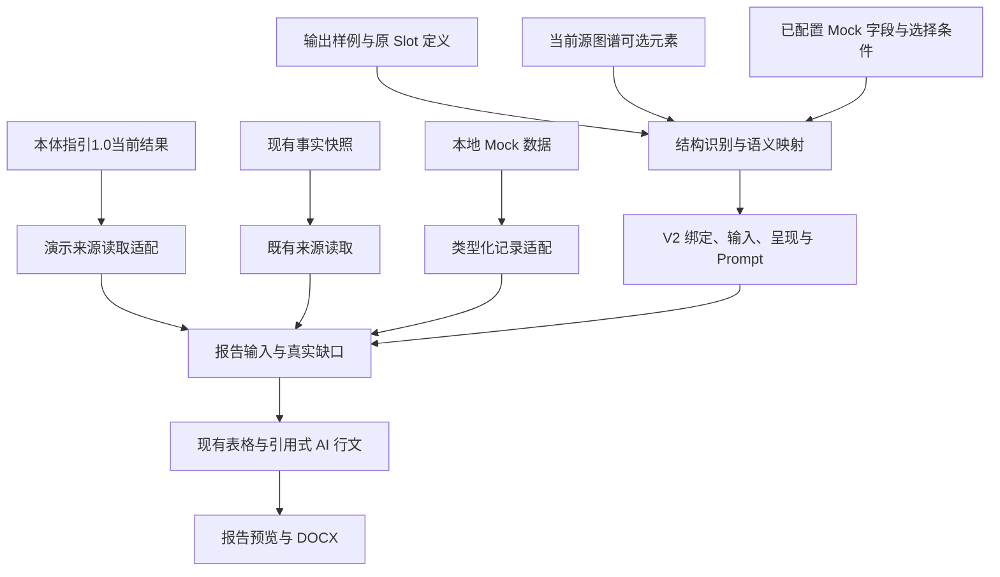

# Slot 语义与本体指引1.0报告结果兼容方案

日期：2026-09-14。状态：**已实施并部署；指定模板 v2.5 已完成真实输入、AI 行文和 DOCX 验证**。验证详情见[实施记录](../specs/025-template-finder-demo/validation.md#slot-报告兼容实施与真实验收--2026-09-14)。

对应用户问题：AST 模板自动分析没有把原 Slot 的语义与源文档图谱、外部 Mock 对应起来，AI 行文不能输出，报告预览显示“报告结构 0%”。涉及此前指定模板 `14d6e8a3-4aea-43d9-814a-db1d31a3dee5` 及其后续修订；实施时核实：原 v2.3 没有章节，后续 v2.4 的 27 个内容项均无输入；两份已有报告的 coverage 为空。当前兼容修订为 `121dae54-2b00-4b5a-ae49-e71e5a70acf9`（v2.5）。

## 1. 结论与范围

可以兼容。采用 **保留 Slot 作者语义、转换为 V2 执行定义、补齐本体指引1.0与 Mock 输入适配、复用现有报告渲染** 的方案。

V2 将 Slot 拆成数据绑定、输入变量、呈现方式是内部职责划分；用户仍应能在一个内容项中配置“写什么、依据什么、怎样写”。完整转换必须覆盖数据选择、字段类型、必填/缺失策略、重复范围和行文规则，不能只把标题转换为 `OutputUnit`。

原[模板级 Finder 图谱演示方案](模板级Finder图谱演示实施方案-20260914.md)的已实现范围是图谱、属性和原文展示，明确没有接入报告生成。此前恢复的 AI 自动分析入口只产生结构草稿，**不等于恢复旧 Slot 的可执行语义**。本补充方案针对当前提出的报告结果兼容需求，扩展指定模板的演示预览与 DOCX 生成；不将既有工程验证追认为报告端到端验收。

模板协议版本 V1/V2 与识别引擎仍是两个维度：V1 定义转为 V2 修订后执行；本体指引1.0与当前引擎在来源读取处区分。报告中心沿用同一套生成操作，展示实际模板修订和输入来源。

## 2. 实施前的断点及可核验依据

| 环节 | 实际实现 | 对报告的影响 |
|---|---|---|
| 自动分析结果落地 | [materializeTemplateStructure](../frontend/src/lib/reporting-v2.ts) 为候选创建 `bindings: []`、`inputs: []`、`render.nodes: []`，模式为 `composed` | 得到章节和空内容项，没有数据取值或 AI 行文配置 |
| 分析输入与返回值 | [output-template-editor](../frontend/src/components/reporting/output-template-editor.tsx) 发送输出样例及其 IR，仅使用返回的 `sections`，不转换 `coverage` | 没有把章节/内容项与实际源图谱、Mock 字段关联 |
| 本体指引1.0报告入口 | 同一编辑器在 `finder_legacy` 下明确显示“报告生成不使用该引擎的展示结果” | 图谱识别完成不会使报告输入就绪 |
| 文档取值 | [report_run_service](../backend/app/services/reporting/report_run_service.py) 通过 `FactCommitService.published_snapshot()` 读取既有事实快照，并校验源角色、主体等 | 不读取 Finder 的 `latest.json`；也不能因当前引擎图谱已展示，就假定其运行制品已进入此链路 |
| 外部数据取值 | `record_refs` 经 [contract_registry](../backend/app/services/reporting/contract_registry.py) 加载版本记录，再由 [binding_resolver](../backend/app/services/reporting/binding_resolver.py) 校验契约、主体、时间和状态 | [mock_sources](../backend/app/api/mock_sources.py) 中的设备、车间、排产、评估组和审批组接口不是自动可用的报告记录 |
| AI 行文 | [narrative_renderer](../backend/app/services/reporting/narrative_renderer.py) 要求 `assisted`、Prompt 策略、授权输入/声明引用；自由文本必须匹配 `allowed_texts` | 只接上模型或旧 Prompt 仍不能恢复旧输出；需要转换措辞和引用规则 |
| 报告结构百分比 | [summarizeCoverage](../frontend/src/lib/report-preview.ts) 统计有效要求的满足比例，不统计章节或图谱节点数 | 图谱有内容与报告覆盖率大于 0 没有自动对应关系 |

补充事实：此前指定模板的真实结构分析返回 1 章节、6 分组、27 内容项，但唯一章节超过语义调用预算，结果为 `incomplete / section_budget_exceeded`。该次没有保存模板，也没有生成报告。准确记录见 [025 验证记录](../specs/025-template-finder-demo/validation.md)。

覆盖率函数无快照时返回“待检查”；有快照时按有效要求计算；有效要求为空则还取决于 `material_status`。因此需要查看发生问题的修订及运行输入中的具体缺口，不能把用户看到的 0% 一概解释为没有章节、没有调用模型或图谱识别失败。

## 3. Slot 语义如何保留

编辑界面以“内容项（Slot）”作为入口，集中显示内容目标、关联图谱/外部数据、当前取值、必填与缺失行为、行文要求、输出形式。现有 Binding/Input/Render 放入同一内容项的详细配置；持久化仍以 V2 为权威，不维护另一套可独立执行的 Slot 数据。

| 原定义或行为 | V2 转换规则 | 不能省略的约束 |
|---|---|---|
| 章节 `coverage` 中的本体关系 | 转为源槽位、完整类/谓词 IRI、带主体范围的关系路径绑定 | 不使用类名片段或全图同名匹配代替路径；本体菜单中合法不代表源文档中事实成立 |
| Slot `coverage_refs` | 仅引用该 Slot 选择的章节绑定及必要属性投影；空列表按原语义继承本章节覆盖 | 不能默认消费整个文档图谱；旧短名键有歧义时标为待配置 |
| Slot Prompt / 继承的章节 Prompt | 保留写作目标，拆成授权输入引用、必要引用、适用条件及允许的措辞；生成 `assisted` 配置 | Slot 自身 Prompt 优先；模板样例中的产品、人员、数值不能成为实际报告输入 |
| 属性/文本取值 | 转为有类型的 `InputDefinition` 和显示属性/原文摘录投影 | 说明单值或集合、单位及缺失处理；不能把实体整块自由文本当作已完成字段映射 |
| 必填、缺失提示、条件 | 对应输入要求、激活条件和呈现缺失行为 | 不把未知写成否定、不把空列表解释为“无风险” |
| 设备/风险等重复表格 | 对应集合输入、稳定行身份、列引用与重复范围 | 同一行属性须属于同一对象，避免分别排序后按数组下标拼接 |
| 外部事实源 | 指向限定 Mock 提供方、选择条件与字段契约 | 只有提供方名称没有数据加载实现，不算兼容完成 |
| 规则/计算结果 | 指向现有已定义规则、计算或声明输出 | 源文件中的历史风险等级只能作为“原文记载”；不能冒充本次计算结果 |
| 手工项、常量、签署区域 | 对应表单、静态文本或既有工作流输入 | 人员名单不是签名；模板中示例结论不是业务常量 |

现有 [template_migration.py](../backend/app/services/reporting/template_migration.py) 可以复用稳定标识、原定义保留、迁移映射和未解决项机制。但其已知语义主要绑定特定基线模板 ID/hash；通用迁移仍产生 `migration_issues`，旧 Prompt 不会直接执行。本次已保留通用旧定义的 coverage、Prompt 继承和必填意图；不完整覆盖、复杂范围及缺失策略要求进一步配置。目标 v2.4 没有旧 Slot 定义，本次按样例结构重新关联实际字段，不能将本次验收视为任意 V1 模板均可自动迁移。

## 4. 输入和结果的最小兼容路径

### 4.1 本体指引1.0结果

在报告服务的来源组装处增加一个限定的 Finder 演示读取适配，复用当前 Finder 服务对模板、源文档、用户、execution 和过期状态的校验。客户端提供公开源标识和当前 execution 引用，不能上传替代图谱，也不能传内部 Finder 作业作为报告源。

来源包显式区分既有已发布事实与 Finder 演示结果；同一 V2 逻辑路径在解析时分派到对应读取器。现有 `FactsBinding` 不能直接把 Finder 树传给 `FactSelector`：需要独立的有限路径选择与属性投影，再返回现有类型化值、缺失状态和来源引用。保留事实读取器的既有行为，不将 Finder 节点伪造成已提交的 assertions。

演示输入保留文档、当前 execution、对象局部身份、属性和值的出处。图谱树父子边只有 Finder 解释时，仍标为演示取值路径，不升级为已证明的组成或归属事实。缺少明确主体时返回歧义；用于正式结论的前提不能仅由这种展示关系满足。

`iri: null` 的原文列不能自动转成本体属性。目标模板确需呈现时，使用明确的 Profile 字段键和原文列类型作为演示记录，保留“原文记载”来源；没有稳定字段键的展示数据需先补齐受限映射，不能按中文标签猜测。

只复用现有报告输入包保存本次生成实际用到的值和引用，不为兼容新增图谱历史库、执行回放或第二套报告服务。刷新当前预览应检查最新 execution；已生成报告保留原有输入语义，不被新识别结果悄悄替换。

### 4.2 外部 Mock

复用现有本地 Mock 数据访问逻辑，按本模板需要提供设备档案、排产、生产区域、评估组和审批组的有限映射。报告服务在显式“刷新覆盖率/生成报告”时读取，AI 不自行调用接口。

可复用 V2 的 `context` 绑定对 **parameter 契约**的支持，以及现有记录投影、过滤和按键连接。业务 Mock 不应塞进只允许生成时间、文件名、语言、时区的 `context` 契约。真实签署/审批结果仍使用 `workflow`；Mock 名单只是名单。

需补齐模板中的记录来源关联：记录槽位对应哪个本地提供方、允许哪些字段、主体/时间/设备筛选来自哪些输入。界面选择和自动映射生成这些配置，预览按配置自动加载，不要求用户手写目前的 `record_refs` JSON。具体字段须同时进入后端 schema、编译检查、前端类型和调用方；本次已实现为 `record_sources` 契约、有限 Mock 提供方与 Slot 配置界面。

现有 `ContractRegistry.load_record()` 对真实版本记录有审核状态要求。演示 Mock 使用显式区分的服务端加载分支，类型正确且成功读取可以表示“演示材料可用”，但不能生成虚假的审核记录或把工作流 `pending_review` 改成已审核。其 `mock` 来源标识随输入进入报告，并限定于演示草稿。正常 `record_refs` 继续现有校验。

设备按明确设备编号关联；排产同时使用设备、时间窗口和适用产品；小组使用明确小组类型和成员身份。禁止仅按名称连接、把全部排产当成目标产品排产，或用接口第一条记录补缺失。跨提供方同字段冲突应显示两种来源，不能静默覆盖原文。

### 4.3 同一份模板的两种引擎

源文档的逻辑选择保存在模板里，实际来源由该修订的引擎配置和显式选择的源决定。切换引擎不能清空 Binding/Input/Render，不能自动执行识别或沿用另一引擎的运行引用。重新解析同一组输入后，只更新取值、出处和缺口。

只有 Finder 特定原文列、且当前引擎没有等价语义时，保留原定义并标明该来源不支持，不能悄悄改成另一属性或返回空值假装兼容。新修订目前不继承引擎设置；保存后必须展示新修订的有效引擎并提示变化，避免“保存 AST 后仍以为使用1.0”的错觉。本方案不把修订身份和引擎设置混进模板内容 hash。

## 5. 自动分析与 AI 行文的完成标准

自动分析分为两个有结果的步骤，界面明确区分“结构已生成”和“语义已绑定”：

1. 依据输出样例 IR 生成章节、分组、内容项及样例位置。
2. 依据章节目标、原 Slot 配置、当前源图谱允许的路径/字段及 Mock 字段契约，提出并校验 Binding/Input/Render/Prompt 映射；展示每项实际取值或缺口后写入草稿，沿用显式保存。

输出样例负责布局与写作目标，业务源文件负责事实，Mock 负责外部记录。三者在请求中区分角色。返回的 `coverage` 只能用于候选语义范围，不能独自证明每个内容项已经完成字段和呈现配置。

已有内容项不得被分析结果重建为空。对尚未配置的项补齐，对人工修改项保留并展示建议；修改期间迟到的结果不能覆盖当前草稿。已绑定项在重新分析或切换引擎时保持稳定引用。

当前按整章发起模型调用，样例只有一个过大的章节时会跳过语义分析。应按已有 IR 的分组/表格/内容项，在现有预算内拆分，保留完整字段边界；无法处理的部分明确未完成，不能截断后宣称全部绑定。

AI 行文复用 `assisted`：将 Slot 写作要求转换为 Prompt，配置 `input_refs`、`required_refs`、适用 `claim_refs` 和策略。指定演示模板先迁移实际需要的无事实措辞到 `allowed_texts`，产品、数值、人员和业务判断保留为输入或声明引用，表格直接用类型化列渲染。

这能兼容“相同事实与写作目的”的报告输出，**不保证与旧自由生成文本逐字相同**。当前渲染器拒绝任意新生成文本；仅恢复旧 Prompt 无法获得旧式自由改写。若目标段落需要超出上述表达能力的开放式行文，应单独列出具体例子与缺口，不能通过关闭引用校验来假装已经兼容。

Finder 与 Mock 产生的报告在页面、历史列表和 DOCX 中标为“演示草稿”。复用现有草稿用途/发布策略，并由服务端检查来源，防止进入正式签署发布；不能仅凭隐藏前端按钮约束。这里的区分只用于准确表达本次演示数据性质，不新增审批流程。

## 6. 预览如何显示真实进度

保留“报告结构”树，但把其百分比明确标为“输入要求满足率”；结构存在与数据齐备分开表达。每个内容项可展开看到：

- 尚未配置数据来源或输入字段。
- 已绑定，源识别尚未完成、结果过期或字段缺失。
- 外部 Mock 未选择、筛选无匹配或类型不符。
- 数据可用，尚未配置呈现或 AI Prompt 引用。
- 输入已齐备；生成完成，或模型/渲染失败。

不通过删除必填要求、把所有输入改为可选、把空结构判成100%或伪造数据来修复0%。生成成功也不等于材料齐备：允许现有草稿输出带明确缺失提示，但不能把提示输出当成业务要求已满足。

预览与导出消费同一次解析的输入；覆盖率按实际启用的要求计算，表格与正文引用可回到源文档或 Mock 记录。无需另建独立覆盖率系统。

## 7. 实施顺序与验收

| 顺序 | 工作及主要位置 | 可交付结果 |
|---|---|---|
| 1 | 读取目标修订、旧 Slot/coverage/Prompt、默认源和现有失败报告输入；扩展 `template_migration.py` 的目标映射 | 逐内容项清单：目标、完整来源选择、字段、必填、呈现、未解决项；没有旧定义的项按样例与实际数据重新提出建议 |
| 2 | `report_run_service.py`、`binding_resolver.py` 及 Finder 服务的有限读取适配；Mock 提供方与记录契约 | 图谱标量、表格集合和外部记录真实进入类型化输入；来源性质明确 |
| 3 | `slot_suggester.py`、V2 编辑器、前后端契约 | AI 分析生成可执行语义建议；原 Slot 作者体验可操作，人工配置不丢失 |
| 4 | `narrative_renderer.py` 的既有配置、预览/报告中心与既有输出器 | 目标段落实际生成，设备/小组表实际填充，预览和 DOCX 一致，覆盖率显示真实缺口 |

本方案的限定扩展已同步到 025 的 spec/plan/tasks 和 report-compatibility 契约。历史的“只展示、不生成报告”验收保持原义；本次新增指定模板演示报告例外。

验收使用指定模板及其真实原件，不以接口200或结构项数量代替：

1. 产品/批量等实际适用标量、设备明细、评估组或审批组 Mock 名单，以及至少一个包含这些输入的 AI 段落，分别建立可核对的输入—输出样例。未适用的类别不为凑案例新增。
2. 生成结果能回到真实原文/Mock 来源；表格同一行不串对象，数值单位和条件不丢失；源中记载的风险与本次规则计算结果区分。
3. 修改一条隔离测试 Mock 记录、缺失一个必填属性或移除一个匹配源后，显式刷新使对应值和缺口变化；模型不得补造。测试不得改写共享演示数据。
4. 目标模板语义可编译，实际模型生成和 DOCX 导出通过；报告中的内容不只是标题、空段落或占位提示。需要开放式行文而未覆盖的段落单独列出。
5. 切换引擎后语义定义保留，取值和来源按当前引擎重新校验；正常报告输入与正式发布流程保持既有行为。

## 8. 本次实施结果

- 保存兼容修订 **v2.5**：`121dae54-2b00-4b5a-ae49-e71e5a70acf9`。原 v2.3/v2.4 保留；新修订显式启用本体指引1.0。27 个原结构项经两张设备表表头合并成为 19 项，再新增两个明确标注 Mock 的小组名单，共 21 项。附件、批准人及评估人/日期等原项未被名单替代。
- 使用原件 `原料药 HRS-5678 临床备样生产信息 - 冲突测试.docx`，当前 Finder execution 为 `47d8d2b2-2059-477a-8593-e57e55862612`。产品、剂型、给药途径、上下限及用途进入真实类型化输入；上下限分别保留 `1.50 kg`、`12.00 kg`，不推断区间包含性。
- 设备按候选编号与 Mock 设备编号连接，原文规格与 Mock 规格独立显示。两张车间表分别 12、5 行，含各自匹配项与归属待确认项。原文重复发生位置保留，无法确定归属的候选在两表均有缺口提示，不计作已确定车间设备；缺失材质或位置不补造。
- `Qwen3.6-35B-A3B` 实际生成产品/生产计划、工艺两个段落。模型仅选择允许的文字和输入引用，必要引用全部通过检查。修复本地模型无法解析递归/过大数组输出语法的问题；请求失败有独立错误码。
- 最终报告 run：`08ddd47e71624050a0b21fd0c9618d55`，第 2 次尝试完成，DOCX 38,658 字节。两张设备表与评估组 5 人、审批组 3 人均核对通过；文档有演示标识和真实待补项。
- 输入要求满足 **42/58（72%）**；其中必填满足 **11/27**，16 项仍未满足。主要为未配置的附件、回顾日期/情况、QA 意见、结论、签署等，以及设备档案字段/归属缺口。`execution_status=completed`、`material_status=incomplete`，不将草稿生成完成解释为材料齐备。
- 自动语义建议仍须审阅：实际模型曾建议将“附件”关联评估组，这项建议已撤销；两张设备表采用核对后的显式编号连接。复杂跨源关联沿用详细配置，未宣称任何模板都能无人审阅地自动映射。

部署沿用既有挂载环境，未新建数据库表、改写共享 Mock 或提交业务事实。工程、浏览器和部署结果详见验证记录；未执行专用 PostgreSQL 并发测试及生产镜像重建。
