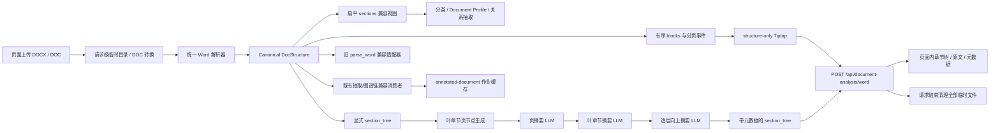
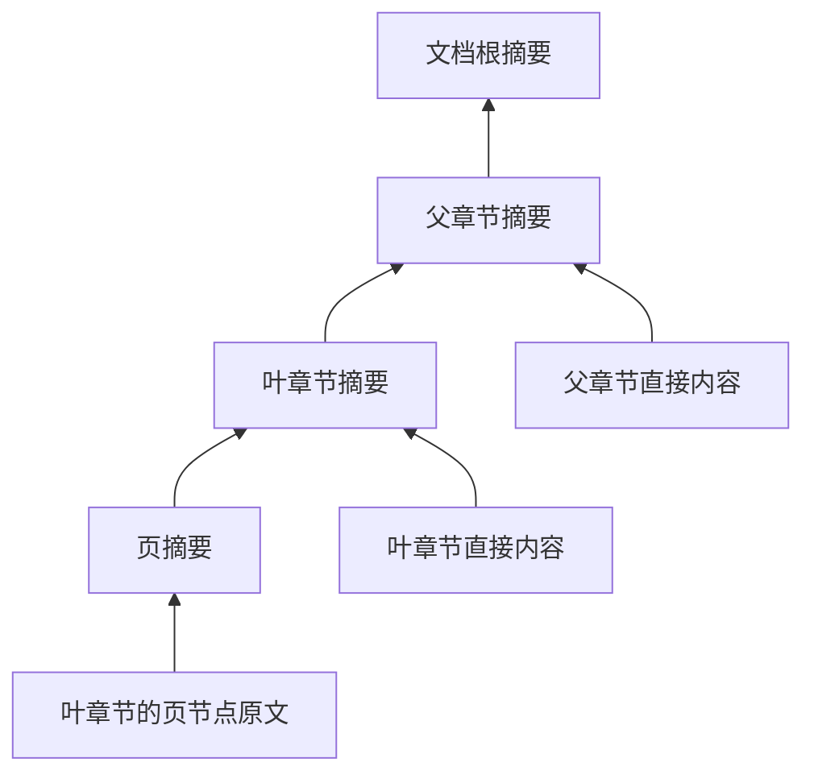

# Word 章节树与分层摘要能力设计方案

## 1. 文档信息

| 项目 | 内容 |
|---|---|
| 目标 | 基于现有标题 `level + 文档顺序` 构建显式章节树，统一旧 Word 解析入口，并使用 LLM 为章节层和叶章节页节点生成内容摘要元数据 |
| 适用格式 | `.docx`；遗留 `.doc` 继续沿用现有转换链路，转换后进入统一解析器 |
| 兼容原则 | 保留现有 `DocStructure.sections` 扁平视图和 `parse_word()` 返回契约，新增树视图，不直接破坏现有调用方 |
| LLM 范围 | 只生成派生摘要元数据，不参与实体、属性、关系识别，不作为知识图谱事实来源 |
| 设计状态 | 已实现（018-word-chapter-tree；Docling 仍为后续候选） |

## 2. 背景与现状

当前 Word 解析存在三种相关能力：

1. `backend/app/services/extraction/docx_structure.py`
   - 可以识别 1～6 级标题。
   - 标题来源包括 Word 大纲级别、Heading/标题样式、TOC/目录样式、字号、编号和加粗语义标题。
   - 输出 `DocStructure.sections: list[DocSection]`，章节按文档顺序保存，每个章节携带 `level`。
   - 表格已经通过标题栈保存 `section_path`。
   - 没有显式 `parent/children` 章节树。

2. `backend/app/services/extraction/document_annotator.py`
   - 生成供前端展示的 Tiptap/ProseMirror JSON。
   - 标题以扁平 `heading(level)` 节点输出。
   - 已能识别手动分页、`pageBreakBefore`、分页型分节符和 `lastRenderedPageBreak`。
   - 分页信息尚未进入 `DocStructure` 章节模型。

3. `backend/app/services/extraction/parser.py::parse_word()`
   - 是遗留连接器抽取入口。
   - 单独再次打开 Word，只返回表格行和段落列表。
   - 不使用统一标题推断、章节路径和分页能力。

因此，当前系统具备构造树所需的主要信号，但仍存在以下问题：

- 同一文档存在不同解析入口，结构判定可能漂移。
- 章节父子关系需要调用方根据 `level + 顺序` 临时推断。
- 章节、表格、段落和分页缺少统一的块级来源坐标。
- 没有章节层摘要和叶章节页摘要。
- 标注 API、关系抽取和旧连接器可能重复读取同一个 DOCX。

## 3. 目标与非目标

### 3.1 目标

1. 基于现有 `level + 顺序` 构建稳定、显式、可序列化的章节树。
2. 保留扁平章节视图，确保现有分类、Document Profile 和关系抽取逻辑兼容。
3. 将旧 `parse_word()` 改为统一解析器的兼容适配器。
4. 建立段落、表格、章节、页节点之间的来源坐标关系。
5. 为文档根节点和每个章节节点附加 `layer_metadata`。
6. 为每个叶章节附加 `pages[]`，每个页节点携带 `page_metadata`。
7. 使用现有本地 OpenAI-compatible LLM 客户端，按页、按章节层级自底向上生成摘要。
8. LLM 不可用、超时或部分失败时，树结构仍可正常返回。
9. 在 `/analysis?tab=document` 提供直接上传、即时返回、刷新即清空的无状态分析工具。

### 3.2 非目标

- 不使用 LLM 判断标题层级或修正章节树；树结构必须是确定性的。
- 不将摘要文本写入实体三元组、关系边或本体属性。
- 不在第一期实现 Word 渲染引擎级别的精确自动分页。
- 不改变现有 NER、分类、Document Profile 和关系抽取业务语义。
- 不在第一期新增数据库表；即时分析不创建作业、不读写标注缓存或持久文件。
- 不处理 OCR、图片文字、文本框和复杂浮动对象中的章节结构。

## 4. 总体架构



核心原则是“一次确定性解析，多种只读视图”：

- `DocStructure` 是 Word 结构的唯一事实源。
- 扁平章节、显式树、旧列表和 Tiptap 都从同一 IR 派生。
- LLM 只消费已经确定的树和文本块，不能修改树结构。
- 即时文档分析与抽取/图谱链共享解析能力，但不共享作业、状态、缓存或事实数据。

## 5. 统一 Word IR 设计

### 5.1 DocStructure 扩展

保留现有字段并新增：

```python
@dataclass
class DocStructure:
    title: str
    sections: list[DocSection]          # 保留：扁平兼容视图
    tables: list[DocTable]
    paragraphs: list[str]
    headings: list[str]
    source_filename: str | None
    warnings: list[str]

    blocks: list[WordBlock]             # 新增：Word body 原始顺序
    section_tree: ChapterNode           # 新增：显式树，含 document 根节点
    pagination: PaginationMetadata      # 新增：分页模式与可信度
    parser_version: int                 # 新增：结构缓存失效依据
```

### 5.2 WordBlock

`blocks` 必须保留段落、表格和分页事件在 Word body 中的真实顺序。

```python
WordBlock = ParagraphBlock | TableBlock | PageBreakBlock

@dataclass
class ParagraphBlock:
    block_id: str                       # paragraph:{paragraph_index}:{fragment_index}
    paragraph_index: int
    fragment_index: int                 # 段内分页时从 0 递增
    text: str
    style_name: str | None
    heading_level: int
    section_node_id: str | None
    physical_page_number: int | None

@dataclass
class TableBlock:
    block_id: str                       # table:{table_index}
    table_index: int
    section_node_id: str | None
    physical_page_number: int | None

@dataclass
class PageBreakBlock:
    block_id: str
    source: Literal[
        "manual", "pageBreakBefore", "section", "lastRendered"
    ]
    physical_page_number_after: int | None
```

段内存在分页符时，段落在 `blocks` 中拆成多个 `ParagraphBlock`，但现有 `paragraphs` 和 `DocSection.paras` 仍保留原来的整段文本，避免破坏现有抽取坐标。

### 5.3 显式章节树

树包含一个虚拟文档根节点。标题前的正文属于根节点的直接内容。

```python
@dataclass
class ChapterNode:
    node_id: str
    node_type: Literal["document", "section"]
    heading: str
    level: int                          # document 根为 0，章节为 1～6
    path: list[str]
    heading_index: int | None

    direct_block_ids: list[str]         # 只含本章直接内容，不含子章
    paragraph_indices: list[int]
    table_indices: list[int]

    layer_metadata: LayerMetadata
    pages: list[PageNode]               # 仅叶章节允许非空
    children: list[ChapterNode]
```

节点 ID 使用文档内稳定坐标生成：

- 文档根：`document`
- 章节：`section:{heading_index}`
- 同一标题重复出现不会冲突，因为 `heading_index` 不同。
- 后续如需跨文档版本稳定标识，可增加 `semantic_id`，但不能替代来源坐标 ID。

### 5.4 构树算法

输入是按文档顺序排列的 `DocSection(level, heading_index)`：

```text
root(level=0)
stack = [root]

for section in sections:
    if section.level == 0:
        merge section content into root
        continue

    while stack.top.level >= section.level:
        stack.pop()

    parent = stack.top
    parent.children.append(section_node)
    stack.push(section_node)
```

规则：

1. 同级标题互为兄弟。
2. 更深级标题成为最近一个低级别标题的子节点。
3. 标题级别跳跃，如 `H1 → H3`，直接把 H3 挂到最近 H1 下，不生成虚假 H2。
4. 标题级别回退，如 `H4 → H2`，持续弹栈直到找到低于 H2 的父节点。
5. 标题前正文归文档根节点。
6. 表格根据现有 `heading_index/section_path` 归属最近活动章节。
7. 章节节点保存直接内容；父节点的完整内容范围通过递归子树计算，不复制正文。

示例：

```text
文档根
├── 1 产品信息                 level=1
│   ├── 1.1 基本性质           level=2
│   └── 1.2 毒理信息           level=2
│       └── 1.2.1 重复给药     level=3
└── 2 工艺信息                 level=1
    ├── 2.1 工艺描述           level=2
    └── 2.2 设备需求           level=2
```

## 6. 页节点设计

### 6.1 DOCX 分页约束

DOCX 主要保存内容和排版规则，并不保证保存最终渲染后的每一页边界。第一期分页只能使用以下信号：

1. 手动分页符 `w:br w:type="page"`。
2. 段前分页 `pageBreakBefore`，包括样式继承值。
3. `nextPage/evenPage/oddPage` 分节符。
4. Word 可选写入的 `w:lastRenderedPageBreak`。
5. 表格首行单元格中的显式分页符。

不允许根据字数、行数或字体大小猜测自动分页。没有分页标记时，叶章节生成一个虚拟页节点，并明确标记分页可信度。

### 6.2 PaginationMetadata

```python
@dataclass
class PaginationMetadata:
    mode: Literal[
        "rendered_markers",             # 含 lastRenderedPageBreak
        "explicit_markers",             # 只有手动/分节分页
        "single_page_fallback",          # 没有可用分页信号
    ]
    physical_page_numbers_available: bool
    is_estimated: bool
    warning: str | None
```

### 6.3 PageNode

页节点表示“某个叶章节在一个物理页中的内容片段”。当同一个物理页包含两个叶章节时，两个叶章节各自拥有一个页节点，物理页码相同，但内容范围不同。

```python
@dataclass
class PageNode:
    node_id: str                         # section:{heading_index}:page:{ordinal}
    node_type: Literal["page"]
    ordinal_in_leaf: int                 # 在当前叶章节内从 1 递增
    physical_page_number: int | None
    break_source: str | None
    block_ids: list[str]
    paragraph_indices: list[int]
    table_indices: list[int]
    page_metadata: PageMetadata
```

只有叶章节挂 `pages[]`。非叶章节通过子章节组织内容，不再重复挂页节点，避免同一页在父子层重复膨胀。

## 7. 摘要元数据契约

### 7.1 LayerMetadata

父章节的 `content_summary` 表示整个章节子树摘要。生成时明确区分当前节点的直接内容与子章节摘要，但对外只保留一个凝练的子树摘要。

```python
@dataclass
class LayerMetadata:
    content_summary: str | None
    summary_scope: Literal["subtree"]
    summary_status: Literal[
        "pending", "completed", "partial", "disabled", "failed"
    ]
    summary_source: Literal[
        "llm", "extractive_fallback", "empty", "none"
    ]
    summary_model: str | None
    prompt_version: str
    content_hash: str
    generated_at: str | None

    direct_paragraph_count: int
    direct_table_count: int
    descendant_section_count: int
    leaf_count: int
    page_count: int
```

### 7.2 PageMetadata

```python
@dataclass
class PageMetadata:
    content_summary: str | None
    summary_scope: Literal["page_segment"]
    summary_status: Literal[
        "pending", "completed", "disabled", "failed"
    ]
    summary_source: Literal[
        "llm", "extractive_fallback", "empty", "none"
    ]
    summary_model: str | None
    prompt_version: str
    content_hash: str
    generated_at: str | None

    paragraph_count: int
    table_count: int
    character_count: int
```

除摘要外，计数、路径、哈希等元数据均由程序确定性生成，LLM 只能返回 `node_id + content_summary`。

## 8. LLM 分层摘要设计

### 8.1 调用基础设施

复用：

- `backend/app/services/llm/local_client.py::get_local_llm()`
- `backend/app/services/llm/local_client.py::chat_with_schema()`

当前 OpenAI Python SDK 的 `chat.completions.create()` 支持：

- `response_format` JSON Schema 结构化输出。
- 自定义 `base_url`，适配 Ollama、vLLM、llama.cpp 等 OpenAI-compatible 服务。
- 单请求 `timeout`。
- `extra_body`，可继续透传 Qwen 的 `enable_thinking=False`。

需要给 `chat_with_schema()` 增加可选的单请求超时参数，避免沿用客户端 15 分钟总超时处理短摘要任务。

### 8.2 生成顺序

摘要采用严格的自底向上流程：



执行步骤：

1. 生成所有叶章节页节点摘要。
2. 生成所有最深层章节摘要。
   - 叶章节输入：直接内容摘要材料 + 页摘要。
   - 非叶章节输入：直接内容 + 直接子章节摘要。
3. 按 `level` 从深到浅逐层处理。
4. 最后生成文档根摘要。

父节点不重新输入整个后代原文，只使用：

- 当前节点直接内容；
- 直接子节点已经生成的摘要；
- 必要的表头和表格行摘要材料。

这样可以控制上下文长度，并保证父摘要的层级语义明确。

### 8.3 批处理策略

禁止每个节点单独调用一次 LLM。按“节点类型 + 层级”批量生成：

- 页节点分批。
- 同一深度的章节节点分批。
- 文档根单独处理。

建议初始配置：

```python
llm_word_tree_summary_enabled = True
word_tree_summary_timeout_s = 120
word_tree_summary_max_input_chars_per_node = 6_000
word_tree_summary_max_batch_chars = 24_000
word_tree_summary_max_nodes_per_batch = 20
word_tree_summary_max_output_chars = 300
word_tree_summary_prompt_version = "word-tree-summary-v1"
```

功能总开关与 `local_llm_enabled` 同时满足才调用模型：

```text
llm_word_tree_summary_enabled AND local_llm_enabled
```

### 8.4 结构化输出

请求中的每个节点由服务端分配 ID，LLM 不得修改路径、层级和来源坐标。

```json
{
  "summaries": [
    {
      "node_id": "section:42",
      "content_summary": "本节说明原料药的理化性质、剂型及高致敏属性。"
    }
  ]
}
```

JSON Schema：

```json
{
  "type": "object",
  "properties": {
    "summaries": {
      "type": "array",
      "items": {
        "type": "object",
        "properties": {
          "node_id": {"type": "string"},
          "content_summary": {"type": "string"}
        },
        "required": ["node_id", "content_summary"],
        "additionalProperties": false
      }
    }
  },
  "required": ["summaries"],
  "additionalProperties": false
}
```

服务端必须执行以下校验：

1. 只接受本批次存在的 `node_id`。
2. 丢弃重复和未知 ID。
3. 对摘要去首尾空白并限制最大长度。
4. 缺失节点单独降级，不使整批失败。
5. LLM 返回的任何额外字段均不进入元数据。

### 8.5 Prompt 约束

系统 Prompt 应明确：

- 只概括提供的内容，不补充外部知识。
- 不推断原文未给出的结论、数值、主体或因果关系。
- 保留药品、设备、工艺、风险等关键名称和编号。
- 父章节摘要需概括子章节主题，不逐条重复。
- 输出简洁中文，建议 80～300 字。
- 只输出符合 JSON Schema 的对象。

输入中区分：

```text
[节点 ID]
[章节路径]
[当前章节直接内容]
[表格标题/表头/有限行]
[直接子章节摘要]
[页摘要，仅叶章节]
```

### 8.6 失败与降级

| 场景 | 行为 |
|---|---|
| 功能关闭 | 不调用 LLM；`summary_status=disabled` |
| 本地 LLM 不可用 | 返回完整树；生成抽取式短摘要；`summary_source=extractive_fallback` |
| 某一批超时 | 仅该批节点降级，其余层继续 |
| 部分节点缺失 | 缺失节点降级，父节点仍可使用已有子摘要和降级摘要 |
| 返回 JSON 非法 | 使用 `chat_with_schema()` 现有 Prompt JSON 回退；仍失败则节点降级 |
| 节点无正文和表格 | `summary_source=empty`，使用“本章节未包含可提取的正文内容”或空摘要 |

抽取式降级只做确定性压缩，例如清理空白后截取前若干完整句，不生成新事实。

## 9. 摘要安全边界

章节摘要属于派生元数据，必须遵循以下隔离规则：

1. 不传入 `document_classifier.classify()`。
2. 不传入 Document Profile 的 `section_kv/table_rows` 抽取。
3. 不传入 `extract_relationships()` 作为原文证据。
4. 不写入 `triples`、`relationships` 或 `ExtractionCandidate`。
5. 前端必须将其标记为 AI 生成摘要。
6. 所有事实追溯仍指向原段落、表格和页节点的来源坐标。
7. 日志不打印原始章节全文或完整模型响应，只记录节点数、耗时和错误类型。

## 10. 旧 Word 入口统一方案

### 10.1 统一入口

以 `parse_docx_structure()` 作为确定性解析唯一入口；它返回扩展后的 `DocStructure`。

```python
structure = parse_docx_structure(file_path, source_filename=...)
```

### 10.2 parse_word 兼容适配

保留 `parser.py::parse_word()` 函数名和返回类型，但内部不再直接调用 `docx.Document()`：

```python
def parse_word(file_path, column_mapping=None):
    structure = parse_docx_structure(file_path)
    return to_legacy_sections(structure, column_mapping)
```

`to_legacy_sections()` 负责：

- 从统一表格 IR 生成旧 `{"type": "table_row"}`。
- 继续执行确定性 `column_mapping`。
- 从 `ParagraphBlock` 生成旧 `{"type": "paragraph", "content", "style"}`。
- 第一阶段保持旧行为中的“表格行在前、段落在后”顺序，避免连接器回归。

新增代码禁止直接调用旧 `parse_word()`；新调用方统一使用 `parse_docx_structure()`。

### 10.3 其他调用方

| 调用方 | 调整 |
|---|---|
| `pipeline.py` | 暂时继续调用 `parse_word()`，实际已通过适配器进入统一 IR；后续可直接使用 `DocStructure` |
| `document_classifier.py` | 保持消费 `DocStructure` |
| `document_profile.py` | 保持消费扁平 `sections`，需要层级范围时可改用树 |
| `relation_extractor.py` | 增加可选 `structure` 参数，API 已解析时不再重复打开 DOCX |
| `document_annotator.py` | 接收可选 `structure/blocks`，标题和分页直接使用统一 IR |
| `slot_suggester.py`、`llm_gap_filler.py` | 逐步改为从显式树序列化结构化文本 |

## 11. 服务编排与 API

### 11.1 新增摘要服务

建议新增：

```text
backend/app/services/extraction/word_tree_summarizer.py
```

主要接口：

```python
def summarize_word_tree(
    structure: DocStructure,
    client,
    *,
    progress_fn=None,
) -> ChapterNode:
    ...
```

函数允许原位附加元数据或返回深拷贝，但必须保证：

- 不修改树的 `node_id/heading/level/path/children`。
- 不修改扁平 `sections`。
- 不修改原始段落和表格内容。

### 11.2 标注文档流程

`_compute_annotation()` 调整为：

```text
1. parse_docx_structure() 一次
2. 文档分类
3. annotate_word(..., structure=structure)
4. extract_relationships(..., structure=structure)
5. summarize_word_tree(structure, get_local_llm())
6. 响应中加入 section_tree + pagination
7. 写入标注缓存
```

摘要阶段建议增加进度事件：

```text
annotation_stage=summarizing
pct=70～90
```

### 11.3 无状态即时分析 API

`/analysis?tab=document` 只调用：

```http
POST /api/document-analysis/word
Content-Type: multipart/form-data
file=<.doc 或 .docx>
```

服务端在 `TemporaryDirectory` 中流式保存上传文件，`.doc` 通过现有 `ensure_docx_async` 转换；随后只执行一次 `parse_docx_structure()`，并调用：

```python
annotate_word(
    docx_path,
    engine=None,
    structure_only=True,
    rich_style=True,
    structure=structure,
)
```

再附加可选的分层摘要。响应包含 `filename/content/warnings/section_tree/pagination/parser_version/summary_prompt_version`。它不包含 `job_id/status/doc_class/triples/relationships`，不创建 ExtractionJob、候选、标注缓存或图谱事实；请求退出时源文件、转换产物和临时目录全部清理。

### 11.4 既有标注文档兼容契约

扩展现有：

```http
GET /api/extraction/jobs/{job_id}/annotated-document
```

新增可选字段，旧前端不受影响：

```json
{
  "source_type": "word",
  "filename": "CMC报告.docx",
  "content": {"type": "doc", "content": []},
  "section_tree": {
    "node_id": "document",
    "node_type": "document",
    "heading": "CMC报告",
    "level": 0,
    "path": [],
    "layer_metadata": {
      "content_summary": "报告覆盖产品性质、工艺、设备及风险控制信息。",
      "summary_status": "completed",
      "summary_source": "llm"
    },
    "pages": [],
    "children": [
      {
        "node_id": "section:42",
        "node_type": "section",
        "heading": "产品的基本性质",
        "level": 1,
        "path": ["产品的基本性质"],
        "is_leaf": true,
        "layer_metadata": {
          "content_summary": "本节说明产品剂型、性状及高致敏属性。",
          "summary_status": "completed",
          "summary_source": "llm"
        },
        "pages": [
          {
            "node_id": "section:42:page:1",
            "node_type": "page",
            "ordinal_in_leaf": 1,
            "physical_page_number": 3,
            "page_metadata": {
              "content_summary": "本页列出产品剂型和主要理化属性。",
              "summary_status": "completed",
              "summary_source": "llm"
            }
          }
        ],
        "children": []
      }
    ]
  },
  "pagination": {
    "mode": "rendered_markers",
    "physical_page_numbers_available": true,
    "is_estimated": false
  },
  "triples": [],
  "relationships": []
}
```

`AnnotatedDocument` 增加可选 `section_tree` 和 `pagination` 类型，供既有抽取/图谱消费者继续使用；旧前端仍可忽略新增字段。`/analysis?tab=document` 不调用该作业接口。

### 11.5 抽取链缓存

现有 `{job_id}.annotated.json` 可直接保存树和摘要，不新增数据库迁移；此缓存不属于、也不得被即时文档分析页面使用。

需要：

1. 提升 `_ANNOTATOR_VERSION`，使旧缓存自动重算。
2. 每个摘要节点保存：
   - `content_hash`
   - `prompt_version`
   - `summary_model`
3. `content_hash` 输入至少包含：
   - 规范化直接内容；
   - 直接子节点摘要哈希；
   - 页节点内容哈希；
   - 解析器版本。
4. 普通读取优先返回缓存。
5. `refresh=1` 强制重新解析；是否强制重新生成摘要可增加独立参数：
   - `refresh_structure=1`
   - `refresh_summary=1`

第一期可以继续复用现有单一 `refresh=1`，后续再拆分。

## 12. 配置与可观测性

### 12.1 配置

在 `backend/app/config.py` 增加 Word 树摘要配置；模型地址和 API Key 继续复用现有本地 LLM 配置。

### 12.2 指标与日志

建议记录：

- `word_parse_duration_ms`
- `word_tree_node_count`
- `word_tree_max_depth`
- `word_page_node_count`
- `word_pagination_mode`
- `word_summary_batch_count`
- `word_summary_success_count`
- `word_summary_fallback_count`
- `word_summary_duration_ms`
- `word_summary_input_chars`

日志不得包含章节原文、API Key 或完整 LLM 响应。

## 13. 代码改动范围

| 文件 | 主要改动 |
|---|---|
| `backend/app/services/extraction/docx_structure.py` | 扩展 canonical IR、构建显式树、统一分页事件、生成 blocks |
| `backend/app/services/extraction/parser.py` | `parse_word()` 改为统一 IR 的旧契约适配器 |
| `backend/app/services/extraction/document_annotator.py` | 消费统一 heading/page/block 结果，避免结构规则重复 |
| `backend/app/services/extraction/relation_extractor.py` | 接收已解析 `DocStructure`，避免重复解析 |
| `backend/app/services/extraction/word_tree_summarizer.py` | 新增页摘要和逐层摘要服务 |
| `backend/app/services/llm/local_client.py` | 增加摘要调用的单请求 timeout 参数 |
| `backend/app/api/extraction.py` | 编排解析、标注、关系抽取和摘要，响应加入树并升级缓存版本 |
| `backend/app/config.py` | 新增摘要开关、批大小、输入长度、超时和 Prompt 版本配置 |
| `frontend/src/lib/api.ts` | 新增章节树和页节点 TypeScript 类型 |

## 14. 测试方案

### 14.1 章节树单元测试

新增 `test_word_section_tree.py`：

- `H1 → H2 → H3 → H2 → H1` 父子关系正确。
- 标题级别跳跃不创建虚假节点。
- 重复标题具有不同稳定 ID。
- 标题前正文归文档根。
- 空章节保留。
- 表格归属最近章节。
- TOC、大纲级别、字号和加粗标题继续使用现有统一推断。
- 扁平 `sections` 与树的先序遍历一致。

### 14.2 页节点测试

扩展 `test_page_breaks.py`：

- 手动分页。
- 段前分页和样式继承。
- 分页型/连续型分节符。
- `lastRenderedPageBreak`。
- 表格前分页。
- 段内多次分页。
- 无分页标记时生成单页降级节点。
- 一个物理页包含多个叶章节时，各叶节点内容范围不串章。

### 14.3 LLM 摘要测试

新增 `test_word_tree_summarizer.py`，使用 mock OpenAI-compatible client：

- 页摘要先于叶章节摘要。
- 章节按深度自底向上生成。
- 父节点 Prompt 只包含直接内容和直接子节点摘要。
- 同一层按批调用，不出现逐节点 N+1 调用。
- 未知 `node_id` 被丢弃。
- 部分 ID 缺失时仅对应节点降级。
- JSON Schema 不支持时走现有 Prompt JSON 回退。
- LLM 关闭、不可用、超时、非法 JSON 均返回完整树。
- 摘要不会进入 triples/relationships。
- 内容哈希不变时命中缓存，内容变化时失效。

### 14.4 兼容测试

现有测试必须继续通过：

- `test_docx_structure.py`
- `test_parse_word_mapping.py`
- `test_word_formatting.py`
- `test_page_breaks.py`
- `test_document_profile.py`
- `test_relation_extraction.py`
- `test_document_annotator.py`

重点验证旧 `parse_word()` 的表头映射、段落 `style` 字段和返回结构不变。

### 14.5 API 测试

- 既有 Word 抽取作业返回 `section_tree` 和 `pagination`；即时分析通过独立 POST 响应返回相同结构字段。
- Excel 作业不返回章节树，或字段为 `null`。
- 旧缓存版本触发重算。
- 源文件已清理时仍可返回已有树缓存。
- LLM 摘要失败不使 `/annotated-document` 返回 5xx。
- `refresh=1` 能重算树和摘要。

## 15. 验收标准

1. 任意识别出的 Word 标题都能在显式树中找到唯一节点。
2. 树的先序遍历与现有扁平 `sections` 标题顺序一致。
3. 每个章节节点都有 `layer_metadata`。
4. LLM 可用时，每个非空章节节点都有非空 `content_summary`。
5. 每个叶章节至少有一个页节点，每个页节点都有 `page_metadata`。
6. 分页不可靠时必须显式标记 fallback/estimated，不伪造精确页码。
7. 父章节摘要由直接内容和子摘要自底向上生成。
8. LLM 故障时仍返回完整树，且不影响分类、NER 和关系抽取。
9. 旧 `parse_word()` 不再独立解析 DOCX，现有返回契约和测试保持兼容。
10. 同一次标注计算中，DOCX 的确定性结构只解析一次。
11. 摘要不进入知识图谱事实、候选审核或关系证据。
12. 全部既有 Word 解析、标注和关系抽取回归测试通过。

## 16. 实施阶段

### 阶段一：统一 IR 与显式树

- 扩展 `DocStructure` 和块模型。
- 实现确定性构树。
- 将分页事件移入统一解析层。
- 保留扁平视图。

### 阶段二：统一旧入口

- 实现 `to_legacy_sections()`。
- `parse_word()` 改为兼容适配器。
- 消除 API 内分类和关系抽取之间的重复结构解析。

### 阶段三：LLM 摘要

- 实现页摘要。
- 实现逐层自底向上章节摘要。
- 增加批处理、超时、哈希和降级。

### 阶段四：API 与缓存

- 标注文档响应增加章节树。
- 升级缓存版本。
- 增加前端类型和 AI 摘要标识。

### 阶段五：回归与性能验证

- 跑完整 Word 相关测试。
- 使用真实企业 DOCX 验证标题、表格、分页和摘要质量。
- 记录解析耗时、LLM 批次数和降级率。

## 17. 关键决策摘要

| 决策 | 结论 |
|---|---|
| 是否替换现有 flat sections | 否，新增树并保留兼容视图 |
| 树由谁构建 | 确定性程序，根据 `level + 顺序` 构建 |
| LLM 是否决定树结构 | 否 |
| 父章节摘要范围 | 当前节点直接内容 + 直接子节点摘要，表示整棵子树 |
| 页节点挂载位置 | 只挂在叶章节下 |
| 无可靠分页时 | 创建虚拟单页节点并标记 fallback，不猜测自动分页 |
| LLM 调用粒度 | 页节点分批；章节按深度分批；自底向上 |
| LLM 失败影响 | 仅摘要降级，解析、分类、NER、关系抽取继续 |
| 摘要是否作为事实 | 否，只是派生展示元数据 |
| 旧 parse_word | 保留函数契约，内部委托统一解析器 |

## 18. `/analysis` 文档分析 Tab 前端方案

### 18.1 页面位置与入口

页面位于现有 `/analysis` 路由内，不新增一级导航。在当前“应用分析”页面增加第三个 Tab：

```typescript
type Tab = "reasoning" | "graph" | "document";

const TABS = [
  { key: "reasoning", label: "推理" },
  { key: "graph", label: "图谱查询" },
  { key: "document", label: "文档分析" },
];
```

默认 Tab 继续保持“推理”，避免改变现有用户的进入行为。文档分析的 URL 只表示工具入口：

```text
/analysis?tab=document
```

页面内直接选择或拖放 `.doc/.docx`，不从抽取任务、报告或 Word 标注抽屉恢复文件。历史 `job_id/node_id` 参数进入该 Tab 时被清理。

### 18.2 URL 状态管理

`/analysis` 当前是 Client Component。增加 URL 状态后，使用 Next.js App Router 的：

```typescript
import {
  usePathname,
  useRouter,
  useSearchParams,
} from "next/navigation";
```

设计规则：

1. 只有 `tab` 是 URL 状态；文件、响应和当前节点只保存在组件本地状态。
2. Tab 切换使用受控 `Tabs value/onValueChange`，不再只使用 `defaultValue`。
3. `job_id/node_id` 不再是文档工具契约；切入文档 Tab 时删除历史参数。
4. 点击章节树节点只调用本地 `setSelectedNodeId`，不更新 URL。
5. 页面刷新、关闭或点击清空后，文件、响应和选择状态不可恢复。
6. `useSearchParams()` 仍只用于受控 Tab，并置于 `Suspense` 边界内。

建议将页面拆分为：

```text
app/(dashboard)/analysis/page.tsx                 # 页面壳 + Suspense
components/analysis/analysis-tabs.tsx             # URL 受控 Tabs
components/analysis/document-analysis-panel.tsx   # 文档分析主面板
```

### 18.3 页面布局

桌面端使用“章节树—原文—元数据”三栏结构：

```text
┌──────────────────────────────────────────────────────────────────────────────┐
│ 文档分析  [当前临时文件] [分页可信度] [摘要状态] [重新分析] [选择其他] │
├──────────────────┬────────────────────────────────┬──────────────────────────┤
│ 章节树           │ 原始 Word 文档                │ 节点元数据               │
│                  │                                │                          │
│ ▾ CMC 报告       │ ┌────────────────────────────┐ │ 路径：产品信息 / 毒理    │
│   ▾ 产品信息 H1  │ │ 产品信息                   │ │ 层级：H2                │
│     基本性质 H2  │ │ ……                         │ │ 摘要状态：AI 已生成      │
│   ▾ 毒理信息 H1  │ │ 毒理信息  ← 高亮并滚动     │ │                          │
│     重复给药 H2  │ │ ……                         │ │ 内容摘要                 │
│       第 3 页    │ │                            │ │ ……                       │
│       第 4 页    │ └────────────────────────────┘ │                          │
│                  │                                │ 来源坐标 / 计数 / 模型   │
└──────────────────┴────────────────────────────────┴──────────────────────────┘
```

建议桌面端列宽：

```css
grid-template-columns:
  minmax(260px, 320px)
  minmax(520px, 1fr)
  minmax(300px, 380px);
```

三栏独立滚动，页面本身不随超长 Word 内容无限增高：

```text
可用高度 = 100dvh - 应用 Header - 页面标题 - Tab/工具栏
```

响应式规则：

- `xl` 及以上：三栏同时显示。
- `lg`：左侧章节树 + 中间原文；元数据以右侧 Sheet 打开。
- 小于 `lg`：原文为主视图，章节树和元数据分别通过 Sheet 打开。
- 移动端仍保留“定位原文”能力，不将 Word 页面压缩成不可读的三列。

## 19. 文档分析页面组件设计

### 19.1 DocumentAnalysisPanel

职责：

- 提供 `.doc/.docx` 拖放与文件选择，并在选择后立即调用无状态 API。
- 在组件内保存 File、当前响应、加载/错误状态和节点选择；刷新即清空。
- 不读取 ExtractionJob、AnnotatedDocument、分类或图谱结果。
- 将树选择转换为 `WordViewer` 原文定位对象。
- 组织三栏布局、空状态、加载状态和错误状态。

建议状态模型：

```typescript
interface DocumentAnalysisState {
  sourceFile: File | null;
  analysis: WordDocumentAnalysis | null;
  selectedNodeId: string | null;
  loading: boolean;
  error: string | null;
}
```

不重复保存 `selectedNode` 对象；通过 `node_id -> node` 索引表派生，避免请求刷新后持有旧对象。

### 19.2 DocumentAnalysisToolbar

工具栏包含：

1. 当前本地文件名与大小。
2. 分页模式与可信度提示。
3. 摘要总体状态：完成、部分降级、未启用、生成失败。
4. “重新分析”当前内存文件。
5. “选择其他文件”。
6. “清空”本地文件与结果。

初始态是上传区域而不是文档选择器，并明确说明不会创建作业、分类、实体、三元组、关系、缓存或图谱写入。

### 19.3 DocumentChapterTree

优先复用现有 `frontend/src/components/tree-view.tsx`，新增文档树适配层，不在业务组件中重复实现展开/选中逻辑。

```typescript
interface DocumentTreeItem extends TreeDataItem {
  id: string;
  kind: "document" | "section" | "page";
  rawNode: ChapterNode | PageNode;
}
```

后端的 `ChapterNode.children` 和叶章节 `pages` 映射为展示树。单页叶章节直接作为
可选叶节点；仅当 `pages.length > 1` 时才附加页片段，避免每个章节末端都重复出现
无导航价值的“第 N 页”：

```text
document
└── section
    ├── child section
    └── page                       # 只在跨页叶章节下展示
```

树行展示规则：

| 节点 | 图标 | 主文本 | 辅助信息 |
|---|---|---|---|
| document | `FileText` | 文档标题 | 章节总数 |
| section | `FolderTree/Heading` | 章节标题 | `H1`～`H6` Badge、摘要状态点 |
| page | `File` | `第 N 页` 或 `章节页 N` | 分页来源、摘要状态点 |

物理页码不可用时，不显示容易误导的“第 N 页”，而显示“章节页 N”。

树交互：

- 单击章节：选中节点、更新 URL、原文滚动到标题，并高亮章节范围。
- 单击跨页章节的页节点：选中页、更新 URL、原文滚动到该页片段第一个块，并高亮页片段。
- 选中深层节点时自动展开祖先链；现有 `TreeView` 已具备该能力。
- 文档切换后默认选中文档根。
- Enter/Space 执行选择；方向键支持树导航。
- 当前节点使用 `aria-current="location"`，树容器提供清晰的 `aria-label`。

若实际文档树超过 1,000 个展示节点，应在后续版本引入虚拟化；第一期通过折叠节点和按需展开控制 DOM 数量，不新增前端依赖。

### 19.4 DocumentMetadataPanel

右栏根据节点类型切换展示内容。

文档/章节节点：

- 节点类型、标题、层级。
- 完整章节路径 Breadcrumb。
- AI 内容摘要。
- 摘要状态、来源、模型、Prompt 版本和生成时间。
- 直接段落数、直接表格数。
- 子章节数、后代章节数、叶节点数、页节点数。
- `heading_index`、章节来源范围。
- `content_hash`，默认折叠在“技术信息”区域。

页节点：

- 叶章节路径。
- 章节内页序号。
- 物理页码，可用时显示。
- 分页来源和可信度。
- 页内容摘要。
- 段落数、表格数和字符数。
- 起止 block、段落索引和表格索引。

摘要卡片必须显示“AI 生成”或“抽取式降级”标识：

| `summary_source` | 展示 |
|---|---|
| `llm` | AI 生成 |
| `extractive_fallback` | 自动摘录 |
| `empty` | 无可摘要内容 |
| `none` | 未生成 |

操作：

- “定位原文”：重复触发当前定位，便于用户在手动滚动后返回。
- “复制摘要”。
- “复制章节路径”。
- 第一阶段不支持页面内编辑摘要，避免把派生元数据误当成人工事实。

### 19.5 DocumentOriginalPane

中栏复用现有 `WordViewer`，保留 Word 样式、表格、分页和实体标注展示。

中栏顶部显示：

- 当前节点 Breadcrumb。
- 当前定位类型：章节或页。
- “清除高亮”。
- 可选缩放控制。

节点切换只更新定位高亮，不重新设置 Tiptap 文档内容，不触发完整编辑器重建。

## 20. 章节树与原文联动契约

### 20.1 为什么不能只按标题文本定位

现有 `Outline` 和部分 `WordViewer` 路径会使用标题文本匹配。章节树页面不能只使用该策略，因为：

- 同一文档可能有重复标题，如多个“工艺描述”。
- 标题文本可能同时出现在目录和正文。
- 页节点需要定位一组段落和表格，而不是一个关键词。
- 标题或正文中可能存在格式拆分，纯文本匹配容易误定位。

因此，树联动必须优先使用稳定的结构坐标。

### 20.2 ChapterNode 来源范围扩展

在第 5 节 `ChapterNode` 中补充：

```python
@dataclass
class SourceRange:
    anchor_block_id: str | None           # 章节标题块
    start_block_id: str | None            # 章节子树第一个块
    end_block_id: str | None              # 章节子树最后一个块，闭区间
    heading_index: int | None

@dataclass
class ChapterNode:
    # ...已有字段
    source_range: SourceRange
```

页节点已有 `block_ids`；为了避免超长 ID 数组，也可同时增加：

```python
source_range: SourceRange
```

页节点范围只覆盖该叶章节在当前页中的内容，不覆盖同页其他章节。

### 20.3 Tiptap 来源属性

统一 Word IR 向 Tiptap 输出时，为顶层节点增加来源属性：

```json
{
  "type": "heading",
  "attrs": {
    "sourceBlockId": "paragraph:42:0",
    "sourceParagraphIndex": 42,
    "sectionNodeId": "section:42",
    "physicalPageNumber": 3
  }
}
```

表格节点增加：

```json
{
  "type": "table",
  "attrs": {
    "sourceBlockId": "table:7",
    "sourceTableIndex": 7,
    "sectionNodeId": "section:42",
    "physicalPageNumber": 3
  }
}
```

对应 DOM 属性：

```text
data-source-block-id
data-source-paragraph-index
data-source-table-index
data-section-node-id
data-physical-page-number
```

这些属性仅用于定位和审计，不改变显示样式。

前端可将 `WordViewer` 中现有负责 `sourceParagraphIndex` 的全局属性扩展重命名为 `SourceCoordinates`，注册到 `paragraph/heading/table` 三类节点；表格的 `sourceTableIndex/sourceBlockId` 必须显式注册，否则 Tiptap 会丢弃后端 JSON 中未声明的 attrs。

### 20.4 WordViewer 定位接口

保留现有关系证据使用的 `highlightRef`，新增章节树专用定位属性：

```typescript
export interface DocumentLocation {
  kind: "document" | "section" | "page";
  nodeId: string;
  anchorBlockId?: string | null;
  startBlockId?: string | null;
  endBlockId?: string | null;
  blockIds?: string[];
}

interface WordViewerProps {
  content: Record<string, unknown>;
  highlightRef?: string | null;          // 保留：关系证据定位
  activeLocation?: DocumentLocation | null; // 新增：章节树定位
  onVisibleLocationChange?: (location: {
    sectionNodeId?: string;
    physicalPageNumber?: number;
  }) => void;
}
```

优先级：

1. `activeLocation` 用于文档分析页面的章节范围定位。
2. `highlightRef` 用于关系证据的单点定位。
3. 两者同时存在时，章节范围使用浅色背景，关系证据使用更强的描边，不互相清除。

### 20.5 定位算法

章节节点：

1. 按 `anchorBlockId` 找到唯一标题 DOM。
2. 调用 `scrollIntoView({behavior: "smooth", block: "start"})`。
3. 标题使用主高亮。
4. 从 `startBlockId` 到 `endBlockId` 的同级顶层 DOM 使用浅色范围高亮。

页节点：

1. 优先按 `blockIds` 选择精确 DOM 集合。
2. `blockIds` 过多时使用 `startBlockId/endBlockId` 范围。
3. 滚动到第一个命中块。
4. 整个页片段使用页范围高亮。

降级顺序：

```text
block_id 范围
→ paragraph_index/table_index
→ heading_index
→ 唯一标题文本
→ 显示“无法定位原文”提示，不静默跳到错误位置
```

选择文档根时滚动到原文顶部并清除章节范围高亮。

### 20.6 可选的反向联动

第一期必需能力是“树节点 → 原文”。可选开启“跟随原文滚动”：

- `WordViewer` 使用 `IntersectionObserver` 观察带 `data-section-node-id` 的顶层块。
- 原文滚动停止 150～250ms 后，选中当前最接近视口顶部的章节节点。
- 反向联动只更新树的本地选中态；默认不持续改写 URL，避免滚动产生大量路由更新。
- 用户点击树后的平滑滚动期间设置 `navigationOrigin="tree"`，暂时抑制 Observer 回写，避免树与原文循环抢占。
- “跟随原文滚动”默认关闭，用户主动开启后生效。

## 21. 前端数据类型与数据加载

### 21.1 TypeScript 契约

在 `frontend/src/lib/api.ts` 增加：

```typescript
export type SummaryStatus =
  | "pending"
  | "completed"
  | "partial"
  | "disabled"
  | "failed";

export type SummarySource =
  | "llm"
  | "extractive_fallback"
  | "empty"
  | "none";

export interface SourceRange {
  anchor_block_id: string | null;
  start_block_id: string | null;
  end_block_id: string | null;
  heading_index: number | null;
}

export interface LayerMetadata {
  content_summary: string | null;
  summary_scope: "subtree";
  summary_status: SummaryStatus;
  summary_source: SummarySource;
  summary_model: string | null;
  prompt_version: string;
  content_hash: string;
  generated_at: string | null;
  direct_paragraph_count: number;
  direct_table_count: number;
  descendant_section_count: number;
  leaf_count: number;
  page_count: number;
}

export interface PageMetadata {
  content_summary: string | null;
  summary_scope: "page_segment";
  summary_status: SummaryStatus;
  summary_source: SummarySource;
  summary_model: string | null;
  prompt_version: string;
  content_hash: string;
  generated_at: string | null;
  paragraph_count: number;
  table_count: number;
  character_count: number;
}

export interface WordPageNode {
  node_id: string;
  node_type: "page";
  ordinal_in_leaf: number;
  physical_page_number: number | null;
  break_source: string | null;
  block_ids: string[];
  paragraph_indices: number[];
  table_indices: number[];
  source_range: SourceRange;
  page_metadata: PageMetadata;
}

export interface WordChapterNode {
  node_id: string;
  node_type: "document" | "section";
  heading: string;
  level: number;
  path: string[];
  heading_index: number | null;
  is_leaf: boolean;
  source_range: SourceRange;
  layer_metadata: LayerMetadata;
  pages: WordPageNode[];
  children: WordChapterNode[];
}

export interface WordPaginationMetadata {
  mode:
    | "rendered_markers"
    | "explicit_markers"
    | "single_page_fallback";
  physical_page_numbers_available: boolean;
  is_estimated: boolean;
  warning: string | null;
}
```

扩展：

```typescript
export interface AnnotatedDocument {
  // ...已有字段
  section_tree?: WordChapterNode | null;
  pagination?: WordPaginationMetadata | null;
}
```

### 21.2 即时上传 API

新增前端契约：

```typescript
interface WordDocumentAnalysis {
  filename: string;
  content: Record<string, unknown>;
  warnings: string[];
  section_tree: WordChapterNode;
  pagination: WordPaginationMetadata;
  parser_version: number;
  summary_prompt_version: string;
}

analyzeWordDocument(file: File): Promise<WordDocumentAnalysis>
```

直接构造 multipart 请求，不进入 React Query 全局缓存：

```typescript
const form = new FormData();
form.append("file", file);
await fetchAPI("/api/document-analysis/word", { method: "POST", body: form });
```

规则：

- 每次文件选择只发起一次即时上传请求；不轮询作业状态。
- 树节点选择不发起请求。
- “重新分析”重新上传当前内存 File；“清空”立即丢弃本地结果。
- `section_tree` 转换为 TreeView 数据和 `nodeById` 索引均使用 `useMemo()`。
- `WordViewer.content` 引用在节点选择期间保持不变，避免 Tiptap `setContent()`。

## 22. 页面状态与异常处理

| 状态 | 页面行为 |
|---|---|
| 未上传文档 | 展示 `.doc/.docx` 拖放/选择入口和无状态说明 |
| 当前请求分析中 | 展示当前文件名和即时解析加载态，不出现“作业处理中” |
| 分析完成 | 展示工具栏与树—原文—元数据三栏 |
| 摘要功能关闭 | 展示确定性结构元数据，摘要区标记“未启用” |
| 摘要部分失败 | 成功节点正常展示；失败节点显示自动摘录或失败原因 |
| 文档只有正文、无标题 | 文档根作为唯一节点，并挂载页节点 |
| 页面刷新/关闭/清空 | 丢弃 File、响应和节点选择，回到上传态 |
| 原文定位坐标失效 | 不做模糊错误跳转；元数据仍显示并提示无法定位 |
| API 失败 | 三栏区域显示错误态和重试按钮，不影响其他分析 Tab |

本期接口同步返回结构与摘要元数据；摘要失败只降级元数据，不把成功的结构分析变成失败响应。

## 23. 前端性能与可访问性

### 23.1 性能

- 一次文档请求同时取得 Tiptap 原文和章节树，避免双请求内容漂移。
- 节点选择只进行 DOM 定位与 CSS class 更新。
- `nodeById`、TreeView adapter 和统计值通过 `useMemo()` 生成。
- 定位查询限定在 `WordViewer` 自身容器内。
- 范围高亮保存首尾索引，不在 React state 中复制正文内容。
- `IntersectionObserver` 仅在“跟随原文滚动”开启时创建。
- 切换文档时销毁旧 Observer、清理高亮和选中节点。

### 23.2 可访问性

- Tab、树、工具栏和元数据区域均提供可读标签。
- 摘要状态不只依赖颜色，同时提供文字和图标。
- 树行可键盘访问，焦点样式与选中样式分离。
- 平滑滚动尊重 `prefers-reduced-motion`。
- 高亮颜色满足正文对比度要求，不遮盖实体标注和链接。
- 元数据键值使用语义化 `dl/dt/dd`。

## 24. 前端代码改动范围

| 文件 | 主要改动 |
|---|---|
| `frontend/src/app/(dashboard)/analysis/page.tsx` | 增加 Suspense 页面壳或接入 URL 受控 Tabs |
| `frontend/src/components/analysis/analysis-tabs.tsx` | 新增可选：拆分现有 Tabs 与 URL 状态逻辑 |
| `frontend/src/components/analysis/document-analysis-panel.tsx` | 新增无状态上传、三栏主页面和本地状态编排 |
| `frontend/src/components/analysis/document-chapter-tree.tsx` | 新增章节/页树适配与节点行渲染 |
| `frontend/src/components/analysis/document-metadata-panel.tsx` | 新增层元数据和页元数据展示 |
| `frontend/src/components/tree-view.tsx` | 导出 TreeDataItem 类型，并补充受控选中与文档树键盘语义；保留现有调用兼容 |
| `frontend/src/components/extraction/word-viewer.tsx` | 增加 `activeLocation`、范围高亮和可选反向联动 |
| `frontend/src/lib/api.ts` | 增加章节树、页节点、摘要元数据、分页类型和 multipart 即时分析函数 |

后端配套补充：

| 文件 | 主要改动 |
|---|---|
| `backend/app/services/extraction/docx_structure.py` | 为章节和页节点生成 `source_range` |
| `backend/app/services/extraction/document_annotator.py` | Tiptap 顶层节点输出 block、section、table、page 来源属性 |
| `backend/app/api/document_analysis.py` | 请求级临时上传、structure-only 原文、摘要和无状态响应 |
| `backend/app/api/extraction.py` | 标注文档响应返回树、分页和摘要状态 |

## 25. 前端测试与验收

### 25.1 组件测试

文档树：

- 后端章节和页节点正确映射到 TreeView。
- 重复标题使用 `node_id` 区分。
- 本地 `selectedNodeId` 选择会展开祖先并滚动树节点到可见区域。
- 物理页码缺失时显示“章节页 N”。
- LLM、降级、失败和禁用状态展示正确。

元数据面板：

- 章节节点展示 `layer_metadata`。
- 页节点展示 `page_metadata`。
- 摘要来源具有明确文字标识。
- 技术字段默认折叠但可查看。

WordViewer 联动：

- 章节点击准确滚动到唯一 `anchorBlockId`。
- 重复标题不会跳到错误章节。
- 章节范围高亮从 start 到 end。
- 页节点只高亮本叶章节的页片段。
- 表格块可通过 `sourceTableIndex/sourceBlockId` 定位。
- 文档根清除范围高亮并回到顶部。
- 关系 `highlightRef` 与章节 `activeLocation` 样式可同时存在。
- 无效 block ID 按既定顺序降级，最终失败时给出提示。

URL 状态：

- `?tab=document` 直接打开文档分析。
- 历史 `job_id/node_id` 被清理且不会触发作业请求。
- 文件和节点选择不进入 URL；刷新后回到上传态。

### 25.2 构建检查

至少运行：

```bash
npm run lint
npm run build
```

若项目引入前端组件测试基础设施，再补充 React Testing Library；在此之前，关键纯函数如树适配、节点索引和来源范围转换应抽成无 UI 依赖函数，便于单元测试。

### 25.3 前端验收标准

1. `/analysis` 出现“文档分析”Tab，原有“推理”和“图谱查询”行为不变。
2. 用户可以直接拖放或选择 `.doc/.docx` 并自动开始即时分析。
3. 页面能展示显式章节树，叶章节下能展示页节点。
4. 选择章节节点后，原文准确滚动到对应标题，并显示章节范围高亮。
5. 选择页节点后，原文准确滚动并高亮该叶章节的页内容片段。
6. 重复章节标题仍能通过结构坐标准确定位。
7. 右侧能分别展示章节层元数据和页节点元数据。
8. AI 摘要、自动摘录、未启用和失败状态具有明确标识。
9. URL 只保存当前 Tab；文档和节点为临时状态，刷新即清空。
10. LLM 摘要失败不影响章节树和原文查看。
11. 分页不可靠时页面明确提示，不展示伪造的精确页码。
12. 桌面端三栏独立滚动，小屏幕使用 Sheet，原文保持可读。
13. 节点选择不重新请求文档、不重建 Tiptap 编辑器。
14. 分析不创建 ExtractionJob、缓存或图谱数据，服务端请求结束清理临时文件。
15. 前端 lint 和 production build 通过。

## 26. 前端实施顺序

### P0：可用闭环

1. `/analysis` 增加 URL 受控“文档分析”Tab。
2. 增加无状态 Word 上传 API 和页面内 File/响应状态。
3. 实现章节树和元数据面板。
4. 后端/Tiptap 补充 block 来源坐标。
5. 实现“章节树节点 → 原文”的精确定位。
6. 处理加载、空、失败和 LLM 降级状态。

### P1：体验完善

1. 增加页节点范围高亮。
2. 增加重新分析、选择其他文件、清空、复制摘要和复制路径。
3. 增加小屏 Sheet 布局。

### P2：增强能力

1. 可选“跟随原文滚动”反向联动。
2. 超大章节树虚拟化。
3. 增加章节搜索和仅显示摘要异常节点过滤。
4. 支持摘要人工确认后的独立版本管理；确认前仍不得进入知识图谱事实层。
