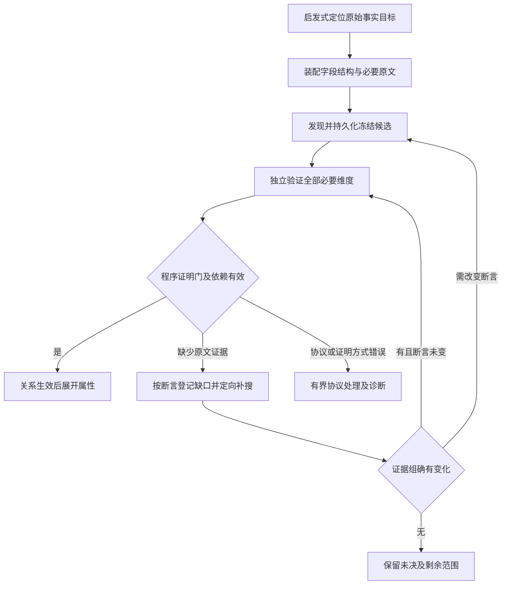

# 关系谱图识别新内核的性能优化方案

设计日期：2026-09-09；工程实施记录：2026-09-10；启发式检索方案修订：2026-09-10。

已有实施状态：第1–5步工程改造及模板公平开关已实施，通过工程与状态回放验证；batch4/8/16
真实实验及单组新方案8任务模板诊断已完成。模板诊断预算耗尽，完整识别未完成且发现
否定候选的实体类型疑点；质量门未通过，条件并行未开启。后续已按用户授权
[部署至本机当前实例](../specs/022-semantic-graph-closure/performance-deployment.md)。

本次修订状态：用户已确认“类似关键词搜索，先启发式定位，结果为空或不理想再扩搜”。
本文将其细化为**启发式优先、语义检索按需、识别结果驱动扩搜**的增量方案，重点见第8节；
第4.4节补充状态读写放大的后续治理，第10节列出实施顺序和契约同步项。
后续已按用户要求增加默认关闭的共享内核实验策略和本机验证入口，实施边界见第8.11节；
真实运行与未达节点见[启发式验证记录](../specs/022-semantic-graph-closure/heuristic-validation.md)。
该实验不代表H01–H06全部实施；生产接入、持久恢复和后续增量状态治理仍待完成。

本次进一步依据[跨记录实证](../specs/022-semantic-graph-closure/joint-evidence-validation.md)，
将证据聚合、属性协议、证明方式菜单细化为第8.14–8.19节的修复设计，并同步第10节。
本轮只修订本文；新增契约、接口名、参数和验收门均为待实施设计，不表示已修改核心或完成新测试。

适用范围：报告模板关系图谱面板及其共享的 `DocumentAnalysisRun → OntologyGuidedExecutor` 新内核。

第3–7节的原有小节保留2026-09-09的工程设计及验收要求，第4.4节另标新增设计；不能将原有瓶颈描述当作部署后的现状。
2026-09-10已按Spec Kit在022增量实施，
实际改动、测量口径和未完成项见[性能验证](../specs/022-semantic-graph-closure/performance-validation.md)，
接口与新旧恢复契约见[performance.md](../specs/022-semantic-graph-closure/contracts/performance.md)。
已记录的138版新格式回放，其恢复载荷及公开投影等价。按用户后续指令，验收仅测试新方案的
正确性、稳定性和实际运行情况，暂不比较相对原方案的性能提升，体感由用户主观评价。
下文历史设计的相对性能建议不作为本次验收门槛，也不据此声称线上或整轮性能达标。

## 1. 总体策略与实施优先级

已有工程优化优先解决面板、状态、等待、分词和队列开销。后续优先级调整为：
**固定当前证据 → 修复证明方式菜单与属性协议 → 按断言补证和有界重验 → 启发式扩搜及分支推进 → 增量状态与真实质量验收**。
有限并行继续后置，不用并发放大尚未解决的重复工作。

新的主要目标是减少不必要的精排、识别和保存，同时让产品、路线、清洗等独立分支更早产出有效结果。
全文记录全集用于覆盖记账，当前候选集合用于决定实际派发；不再把两者当成同一条待执行队列。

所有优化都应保留三个约束：

- 独立验证和原文证明不变。
- 覆盖分母和未完成状态真实。
- 暂停恢复不能重复提交或丢失费用。

| 工作范围 | 状态与后续优先级 | 本文位置 |
|---|---|---|
| 基线与费用分项 | 持续保留；新增同源证据及自适应检索验收 | 第2节、第8.10节 |
| 面板读取、不可变块、协调器、批量分词、惰性队列 | 已有工程实施，保留原设计和兼容要求 | 第3–7节 |
| 启发式准入、结果反馈、逐级扩搜 | 新增P0；先减少进入昂贵流程的工作 | 第8.1–8.6节 |
| 按需语义排序、分支公平与属性推进 | 新增P0；与检索状态机一起落地 | 第8.3、第8.7节 |
| 增量块保存、批量读取、恢复检查点 | 新增P0；可与检索核心并行开发 | 第4.4节、第8.8节 |
| 模型名称/类型/桥接协议和真实验收 | P0质量门；不能用工程提速代替 | 第8.9–8.10节 |
| 证明方式菜单与属性字段映射 | 当前修复P0；先消除已实证的协议阻断和表格错列 | 第8.16–8.17节 |
| 证据组、缺口工单与冻结候选重验 | 当前修复P0；与预算、依赖和恢复一起交付 | 第8.14–8.15、第8.18–8.19节 |
| 精排batch和单运行双任务 | 后置条件项，首版保持batch4、识别在途1 | 第8.3节、第9节 |

本文新增策略会改变搜索范围的激活、执行顺序和阶段停止条件，属于行为变更，不能声称与旧策略完全等价。
原文证明、语义资格、覆盖守恒和累计费用仍是共同不变量；实施前须按第10节同步相关规范。

## 2. 第 0 步：固定性能与质量验收基线

先固定验收基线，避免把少做任务或缓存命中误认为提速。

2026-09-09原设计核对的运行是 `58fcc303-c20b-4a47-9390-aad12c83b701`。该运行启动约 23 分 20 秒后被人工暂停，只检查了 11／3,444 个主体—谓词—记录机会。它是共享新内核的证据，不是模板新面板的端到端验收。当时查询中带 `origin.template_id` 的新内核运行数量为 0；该数量只描述历史查询时点，后续模板实测见第2.3节。

### 2.1 验收输入

使用三类输入分别验收：

- **已有运行回放**：复用上述暂停运行及保存结果，比较序列化、读取、恢复和调度，不重复调用模型，不改写原运行及冻结制品。
- **真实模板文档**：使用模板迁移方案指定的原件，固定本体、模板版本、模型身份、排序策略及预算。
- **规模测试输入**：构造大队列和共享节点图，只验证工程复杂度，不冒充真实识别质量评测。

计时至少拆成：解析与元数据、分词、嵌入、精排、持久化确认等待、主模型排队、主模型执行、图谱提交、接口读取、浏览器渲染。

### 2.2 2026-09-09历史建议（不作为本次验收门槛）

以下保留原设计的建议与历史观测，便于解释工程改造动机；本次修订的验收采用第8.10节，不要求这些相对提升比例。

| 指标 | 历史观测 | 原建议目标 |
|---|---|---|
| 同规模图谱读取的内部数据量 | 约 16.9 MB | 降低至少 90% |
| 小图服务层读取 | 三次约 477–556 ms | 热态中位数 ≤100 ms，另测 P95 |
| 同一段回放累计状态体积 | 约 756.8 MB | 第一阶段降低至少 80% |
| 精排确认等待 | 可被长识别请求拖延 | 不再随主模型调用时长增长 |
| 新锚点定位 | 重取全文、可能重挂载 | 同文档不重取全文、不重挂载 |
| 状态与结果正确性 | 现有运行契约 | 候选、证明、覆盖、费用与恢复结果一致 |

756.8 MB 是 `ranking_state`、`graph` 和 `recognition_checkpoint` 各版本的累计 JSON 逻辑体积，不是实际磁盘占用或 WAL 写入量。三次读取是服务函数计时，不包含 HTTP 和浏览器，也不能作为 P95。

真实模型运行应同时报告首条有效关系时间、模板路径完成时间、总覆盖和成本。没有完整执行结果时，继续标记未完成。

### 2.3 本次修订采用的同源证据与根因

HRS-5592供外版原件SHA-256为
`2c1174bf616f30dd28c655fef4261c167762de807c8ad79e148fb8ef18e16436`。
[静态演示数据](../backend/app/services/reporting/demo/hrs5592.json)与
[8任务真实模板诊断](../specs/022-semantic-graph-closure/performance-validation.md)绑定同一原件。
诊断保存的实际结果为：

| 项目 | 已记录结果及含义 |
|---|---|
| 根层计划 | 287条记录 × 12个根谓词＝3444个逻辑机会；不是已发生的模型调用数 |
| 实际执行 | 8次任务派发、7个不同记录机会；原始批次均为根`describes`，未进入属性任务 |
| 耗时与完成度 | 1610.79秒，任务预算耗尽；有效肯定关系0，全文未完成 |
| 模型工作 | discovery 8次、verification 3次；另有74次嵌入和65次精排请求（其中1次失败） |
| 保存与查询 | 排序保存141次、累计1001.68秒；任务提交8次、累计181.47秒；725315次SELECT |
| 语义失败 | 4条肯定候选未过门；11条可疑否定候选将化学描述句当实体并枚举类型；另有核验上下文超限 |

保存、SQL与模型计时有重叠，不能相加作为总耗时。该轮代码冻结早于最后写锁修复；
后续工程测试和部署没有重跑整轮真实模型，不能把历史数值当作最终代码的新实测。
更早一轮曾得到有效的产品描述关系，故本表也不表示内核始终无法识别任何关系。

常规运行路径已经具备关键词检索、缓存向量、语义粗召回和精排，问题是它们尚未控制实际工作准入；
后续默认关闭的实验路径在第8.11节另行记录：

- [retrieval.py](../backend/app/services/extraction/ontology_guided/retrieval.py)对每个主体—谓词保留完整记录全集，只按词面、章节和摘要拆分优先/兜底阶段。
- [semantic_retrieval.py](../backend/app/services/extraction/ontology_guided/semantic_retrieval.py)将多路召回组成候选池，并用探索或尾部记录补足池；低相关不代表无需精排。
- [semantic_reranker.py](../backend/app/services/extraction/ontology_guided/semantic_reranker.py)从剩余全集继续建池；已有向量缓存，但普通语义任务须等当前池完成精排并提交后才能按排名执行。
- [executor.py](../backend/app/services/extraction/ontology_guided/executor.py)只有在有效肯定关系成立后才展开对象菜单。产品关系失败会推迟产品属性；放宽可达门不能替代修复主体和类型理解。
- [state_artifacts.py](../backend/app/services/document_analysis/state_artifacts.py)已有不可变块，却仍逐次遍历完整状态，并逐块查询引用；减少重复写字节不等于消除SQL和编码放大。

静态演示只读取预置图谱，且按唯一实体统计的670项属性中432项无本体属性IRI。
它可以帮助核对原文整理与层级展示，不能作为自动识别精度、制作耗时或正式金标；静态答案不得进入检索或模型输入。

## 3. 第 1 步：精简面板读取、刷新和原文定位

将面板读取与执行内部状态分开，同时收敛刷新和原文定位。

原设计观察到 [graph_response()](../backend/app/services/document_analysis/application.py) 为生成约 30 KB 响应，需要加载完整排序缓存和检索计划；后续已实施紧凑读取，下文保留其设计边界。

### 3.1 紧凑的公共读取制品

建议增加两个紧凑的读取制品，继续复用现有运行域：

| 读取制品 | 保存内容 | 更新时间 |
|---|---|---|
| 公共图谱基础数据 | 节点、边、属性、覆盖、失效信息、证据引用、冻结谓词菜单 | 图谱批次提交时 |
| 排序摘要 | 状态、成本、当前轮次、失败原因和必要统计 | 排序状态持久化时 |

公共图谱保留生成不同投影所需的信息，沿用现有有效性过滤；不必第一版就保存所有投影副本。完整排序记录、模型观察和恢复状态按需读取。

具体实施要求：

- 图谱读取不加载 embedding、完整检索计划和恢复队列。
- 使用图谱版本、排序摘要版本及运行状态组合判断响应是否变化。暂停原因、预算开关变化时，即使图没变，也必须更新。
- 缓存命中和返回 304 前仍检查归属、删除与过期状态。
- 旧运行保留兼容读取；普通 GET 不触发制品回填或模型执行。

### 3.2 刷新和查询生命周期

前端同步调整 [use-template-document-run.ts](../frontend/src/components/analysis/use-template-document-run.ts)：

- SSE 正常时由事件驱动刷新，合并短时间内连续事件。
- 图谱版本变化才读取图谱；仅排序或状态变化时更新对应摘要。
- SSE 断开时启用退避轮询，连接恢复后关闭重复轮询。
- 面板隐藏时停止展示查询；返回时先同步最新状态。
- 保留取消信号与版本校验，防止切换文档后旧响应覆盖新文档。

### 3.3 原文定位与图谱树

原文请求拆成“文档内容”和“锚点位置”：文档按运行与结构版本缓存，点击证据只取定位信息。阅读器身份由文档版本决定，不能因 `selection_ref` 改变而重建。

图谱树同时建立实体、出边、属性和覆盖索引；折叠分支按展开状态挂载，共享节点显示引用并允许跳转，避免按所有路径复制子树。改造位置见 [template-document-graph-panel.tsx](../frontend/src/components/analysis/template-document-graph-panel.tsx)。

### 3.4 验收

验收重点是：响应投影等价、隐藏时请求停止、乱序响应隔离、同文档连续定位不闪跳，以及共享节点图的组件数量不再随路径数爆炸。

## 4. 第 2 步：不可变制品引用与轻量检查点

拆分大对象，从产生快照的位置消除复制和保存放大。

原设计针对 [RankingService.snapshot()](../backend/app/services/extraction/ontology_guided/semantic_reranker.py) 复制整个缓存的问题，同时调整内存状态和持久化格式；仅在数据库写入前删除几个字段不足以解决。已有实现后的剩余问题见第4.4节。

### 4.1 状态分层

建议拆为四层：

| 数据层 | 建议表示 |
|---|---|
| 原文视图、向量缓存、冻结检索计划 | 不可变块，新增内容只保存一次 |
| 已完成排序轮次、任务结果 | 独立不可变记录 |
| 预扣、派发回执、覆盖变化、依赖失效 | 小型追加记录或版本化状态 |
| 检查点 | 精确版本引用、哈希、执行代际、提交水位及必要小状态 |

第一版沿用现有 PostgreSQL 制品体系，先解决重复保存，避免同时引入新的外部存储。暂不改变向量精度或采用有损量化。

检查点必须引用明确的 `artifact_id + content_hash + schema_version`，恢复时不能取“最新缓存”。已提交状态可以只读共享，新增结果放入局部增量；跨线程不得共享可变状态。

### 4.2 原子提交与恢复边界

第一阶段仍然每项任务提交可恢复检查点，只是检查点变小。候选与证明版本、图谱、检查点和批次回执继续原子提交。不能先改成“每十项任务保存一次”，否则崩溃后可能出现图谱已经推进、恢复水位落后的情况。

现有提交和恢复入口见 [execution.py](../backend/app/services/document_analysis/execution.py) 中的 `_persist_recognition_batch()` 与 `_restore_recognition_checkpoint()`。

此外必须同步处理：

- 新引用的所有权、哈希和完整性检查。
- 制品引用索引及保留清理规则，避免仍被检查点引用的数据遭到删除。
- 新旧检查点格式的独立解析。
- 缓存键对模型、输入、预处理、数值配置和权限范围的绑定。
- 共享核心与仓储边界：`ontology_guided` 输出状态，`document_analysis` 负责持久化。

首版只做运行内复用。跨运行缓存应后置设计，不能直接按文本哈希共享语义结果。

### 4.3 验收

验收除了体积下降，还必须证明恢复后的排序结果、候选和证明版本、覆盖、未决项及累计费用一致。

### 4.4 新增：消除逐块查询与全量编码

第4.1–4.3节的不可变块方案已有工程实现。本次补充以下待实施改造，处理第2.3节暴露的剩余开销：

1. **从状态产生处输出增量。** 检索轮次、准入记录、覆盖变化和新增向量分别提交增量及父版本引用；
   连续写者保留已提交块目录，仅编码变化的叶块及其祖先，不在每个模型批次重新遍历历史向量和完整计划。
   不把现有展示事件当成完整恢复日志；先定义增量记录和检查点的恢复契约。
2. **批量读取与写入。** 对本次所需的块引用按批查询，批量写入不存在的新块及运行引用；
   冷恢复按引用层分批取块，逐项核验归属、哈希和水位，避免每块两次查询。
   初始数据库批大小建议128，属于待冻结实验参数；缺块或引用越权必须失败，不能用缓存补造成功。
   写入前的存在性检查和新增块保存仍在执行锁/fence内完成，等待锁后重验租约；唯一键竞争整批处理，不跨事务部分提交。
3. **维持原子边界。** 每个已完成识别任务仍原子保存候选、证明、覆盖、扩搜反馈和检查点。
   预算启用时，每次模型请求前的预扣仍必须持久完成；派发确认、执行权和恢复回执边界始终保留，不能延迟到多个请求之后。
   排序预算可按既有控制显式关闭，但旧账不清零，调用与可获得费用继续记录，缺测不记为零。
   纯检索事件可随同一个已提交准入批次合并写入，前提是派发前能恢复其精确来源和选择顺序。
4. **有界恢复与回收。** 检索增量链每32次提交或累计1MiB时建立基线（建议初值）；检查点冻结基线和尾部引用。
   冷恢复校验基线及有界尾部；增量合并、清理和失败回滚都不得删除仍被历史检查点引用的块。
5. **缓存只在已确认边界推进。** 提交成功后才更新写者缓存；失败、失租、删除、换代或head不匹配即失效。
   文档、IR、元数据、视图/规范化策略、模型/tokenizer及权限域纳入对应缓存键，首版仍限运行内复用。

验收除记录真实保存耗时、编码CPU、SQL数和字节数外，还应证明：固定增量的热提交不随历史缓存量线性增长；
块引用查询按批次增长而非逐块往返；冷恢复的增量重放不超过冻结上限。
使用专用PostgreSQL库验证原子提交、丢失确认、同水位重放、并发失租和清理后的恢复；SQLite通过不能替代这些验收。

## 5. 第 3 步：协调器持续处理确认与重试预算修正

让协调器持续工作，先解除等待，再考虑增加识别并发。

### 5.1 保留唯一写者

建议保留单运行协调器作为事件、图谱和检查点的唯一写者，把阻塞的识别调用放入受控工作线程；此阶段仍只允许一个识别任务在途。

工作流程调整为：

1. 协调器选任务并冻结主体版本、原文上下文和依赖身份。
2. 工作线程准备调用时，向协调器请求预扣。
3. 协调器核验执行权，提交预扣，成功后返回确认。
4. 工作线程调用模型；协调器继续处理精排确认、心跳和控制请求。
5. 结果返回后，协调器重新检查依赖有效性，再原子提交批次。

这样可以保留现有提交次序，减少新增并发写者争抢版本的问题。现有确认机制见 [ranking_execution.py](../backend/app/services/extraction/ontology_guided/ranking_execution.py)。

原设计要求将识别的 `before_model` 回调所执行的账本修改和持久化交回协调器；此边界已有工程实现。工作线程不能携带共享数据库 Session，也不能直接修改图、队列或费用账本。

### 5.2 失败与控制语义

失败与控制语义必须明确：

- 提交失败或失去租约：唤醒等待者并停止新派发。
- 暂停：停止接新任务，按合法批次边界保存已完成结果。
- 取消：使用模型客户端的协作取消，不能只取消 future。
- 迟到结果：重新核验执行代际、主体版本和证明依赖。
- 已派发但完成情况未知：保留不确定状态与费用，不能当作确定未派发释放额度。

### 5.3 重试预算

同时修正精排预算：正常的发现、反证双意图各有一个基础机会；技术重试使用单独且有限的配额，所有调用仍受运行和槽位总预算约束。

这里的记录预算作用于权限范围、主体—谓词槽位和记录的组合，不是同一原文记录跨所有谓词共用两次额度。

例如每个意图允许一次重试时，单记录槽位最多四次尝试，这是新策略建议，不能自动套用到历史运行。暂停恢复不重置累计额度，实际派发和不确定派发的费用继续保留。

### 5.4 验收

本阶段要用专用 PostgreSQL 测试库覆盖预扣、确认丢失、暂停、失租、迟到结果和重复 worker 竞争。验收应证明确认延迟不再被几十秒的识别调用阻塞，而不是只看 GPU 利用率。

## 6. 第 4 步：分词批处理、缓存和队列索引

优先实施保持结果等价的分词、缓存和队列优化。

原设计中分词逐条经过调度、IPC 和记录；后续已增加内部批量精确分词及缓存。其要求是对同一运行中的唯一文本批量处理，缓存键包含分词器身份、特殊 token 策略、完整输入和权限范围。

若有 `U` 条未缓存文本、批大小为 `B`，分词请求数可由约 `U` 降到 `ceil(U/B)`。这是减少调用开销，不减少实际 token 计量，也不能用字符数估算替代精确分词。

同批可完成：

- 按文档、IR、元数据和视图策略版本复用检索视图。
- 建立记录到字段组的索引，减少重复全文扫描。
- 将记录位置查找改为一次建表，消除每槽位的重复线性搜索。
- 将 `peek_task()` 改为纯选择操作，只读取必要调度状态，不复制整个队列。

核心验收是“结果等价”：逐条 token 数相同；任务身份、派发次序、公平轮转和恢复次序相同；任何相关版本变化都正确失效缓存。队列优化入口见 [scheduler.py](../backend/app/services/extraction/ontology_guided/scheduler.py)。

## 7. 第 5 步：惰性任务前沿与有界恢复

采用惰性任务前沿，控制规划与恢复规模。

在状态格式稳定后，保留完整的逻辑覆盖集合，但只实例化近期需要执行的任务。

例如，一万个识别机会可以表示为：

- 冻结的主体—谓词槽位。
- 每槽位完整记录顺序。
- 覆盖变化。
- 调度游标。
- 当前精排池与有界待执行窗口。

这样无需提前创建一万个包含大量重复字段的任务对象，启动、复制、存储和恢复成本都能降低。

验收不能只看队列变小。尚未实例化的机会仍必须计入未尝试覆盖；窗口为空时还要检查逻辑剩余范围、重试和未展开前沿。相同输入和结果回放下，应获得等价的派发及覆盖结果。

新增的完整增量记录与周期基线设计见第4.4节，并须给恢复重放设置上限。现有进度事件并不是完整恢复日志，不能直接用它替代检查点。

## 8. 第 6 步修订：启发式优先与反馈扩搜

本节为新增目标设计，部分已通过第8.11节实验实现；生产工作包仍未完成。
将“全文逐谓词排队、精排后逐条核验”改为：
**当前合法关系/属性目标 → 低成本定位 → 读取必要上下文 → 发现与独立核验 → 按缺口选择下一步**。
关键词查询可以快速检查全文索引，但全文命中不会自动变成模型任务；语义模型只在需要时启动。

### 8.1 输入、输出与复用边界

每个检索槽位输入为：冻结文档/IR/元数据、当前有效主体及版本、单跳本体谓词及目标类型、
模板路径优先级、已读来源、当前候选缺口和剩余预算。根层只有文档身份；文件名不能当作已证明产品提及。
对象未通过有效入边前不展开二跳菜单；对象类型的说明和字段标签可用于寻找该对象，不能提前生成其属性任务。

每轮输出为：有序的原始record ID、命中理由、检索范围、必要上下文引用、准入来源、
未处理游标、下一动作及理由。召回输出只是线索，必须回到原文才能产生候选。

第8.11节已有启发式实验复用单主体—单谓词—单目标记录的RecognitionTask和两次独立模型调用；
第8.15.4节拟增加复用既有发现的独立重验入口，首次提议仍保持两阶段。
同一字段组的检索和上下文可以共用，但每项关系/属性仍独立绑定目标与证明。
暂不引入多谓词混合判定协议，不因提速合并不同主体或共享其核验结论。

### 8.2 先建共享索引，再作启发式定位

在已有RecordIndex及字段组索引上，一次构建运行内只读检索索引，包含：

- 正文词项、章节路径、表题、表头、字段标签及其原始record ID。
- 连续字段组、完整表格及有结构依据的续表、父子章节和明确交叉引用的定位信息。
- 从当前本体菜单标签、定义、已登记别名与有版本的检索词表得到的查询词。
  不从静态演示或评测参考取得期望对象、属性值；首版也不增加隐式模型扩词调用。

搜索视图可做大小写、空白、标点等规范化；引用仍使用不可变原文，不能用规范化文本直接生成坐标。
中文标签可采用确定性短语匹配和词项索引，规则及优先级进入检索版本。
已有摘要只作定位辅助；摘要不存在或尚未生成时，不为启发式检索额外启动摘要模型。

查询优先使用“当前主体有效提及＋谓词含义＋目标类型/字段角色”。例如：

| 目标 | 初始线索 | 命中后的读取单位 |
|---|---|---|
| 文档描述的产品 | 项目名称、产品介绍、产品基本性质 | 完整主体字段组及相关介绍段落 |
| 合成路线 | 工艺描述、合成路线、制备工艺 | 命名整体的章节背景及相关工艺记录 |
| 使用设备/物料 | 设备/物料清单、名称、规格、型号 | 表头、完整相关表格及续表 |
| 已到达产品的分子量 | 当前产品提及、分子量及登记同义词 | 产品名称、数值、单位、竞争主体所在字段组 |

这些是查询构造示例，不是写死HRS-5592答案或通过字符串规则直接生成事实。

### 8.3 扩搜阶梯与建议初值

搜索阶段与原有phase1/phase2覆盖分类分开记录；升级搜索不重分旧覆盖，不刷新任务或重试额度。
每阶段先读当前页，反馈要求更多候选时才激活后续页；大量有效命中应沿当前游标继续，不必先升级模型。

| 阶段 | 执行内容 | 进入后续阶段的条件 |
|---|---|---|
| H0：局部启发式 | 用标题/表头索引确定优先章节，在其中搜索直接字段和有效主体提及 | 无命中、当前候选均不成立，或核验指出需要外部来源 |
| H1：扩大词面与上下文 | 检索登记别名和同义字段，扩大到其他章节；补字段组、续表和明确引用 | 仍没有可用对象/值，或术语差异、跨段表达导致证据不足 |
| H2：按需语义检索 | 先在相关范围计算语义相似度，必要时扩大到全文；仅对选中候选作小池精排 | 当前语义候选仍不足、存在未解决的跨范围缺口 |
| H3：补充探索 | 按章节和原文位置从尚未检查的全集分批准入，优先尾部/不同来源 | 逐页继续，直至当前目标满足、范围耗尽或预算停止 |

启发式命中少且清晰时，直接进入既有发现/独立核验，不先加载embedding或reranker。
命中过多而区分度低时，先加入主体、类型和字段角色收窄查询，仍不理想再进入H2；不机械扩大范围。
H0/H1无肯定结果且有剩余范围和预算时，必须实际推进补搜，不能停在“保留了后续计划”。

以下为首轮实验参数建议，不是已上线配置或效果承诺；统一冻结在新检索政策中：

| 参数 | 建议初值与边界 |
|---|---|
| 每槽位准入页 | 8条起步，补搜页16、32条；是分页大小，不是关系数量上限 |
| H2精排池 | 16条起步，按需扩到32、64条；不足不以无关尾部记录凑数 |
| 每槽位每轮H3探索 | 最多1个补查页、上限32条；按缺口触发，不要求做满；下一轮沿剩余游标继续 |
| 语义模型batch / 主识别在途 | 沿用4 / 1；不同时引入批次和并发因素 |
| 永久剔除阈值 | 不设；低相似度保留为未检查，分数不当作正确概率 |
| 上下文与模型预算 | 沿用冻结的精确token、调用、超时和累计重试上限；扩搜不刷新 |

准入页和语义池是两个层次：例如16条候选完整精排提交后，首批只准入前8条，剩余8条保留同一epoch游标。
补页先消费已提交的排序尾部；除依赖变化需要重验外，不因准入页用完就重新评分同一池。

必要的主体、表头、条件和反证来源不受候选页Top-K裁剪，但仍受完整输入token预算约束。
过长表格按目标行分页，保留必需上下文；若某条证明仍装不下，标记未完成，不能截断竞争主体或反证以通过。

启发式阶段没有启动语义模型是正常执行模式；一旦进入H2，已冻结的整池失败/暂停政策仍适用。
新模式允许不依赖语义epoch的启发式准入批次独立提交；已启动的语义池仍须完整评分、原子提交，
不得使用部分分数提前派发依赖该池排名的任务。记录向量复用现有缓存，新增查询按需编码，不按关系重建全文向量。

### 8.4 “结果不理想”必须映射到具体动作

由确定性控制器结合检索结果、TaskOutcome和结构化验证理由决定动作，不让模型自由扩大范围或修改预算。
反馈至少绑定task/candidate/subject版本、已读来源、缺失证明维度、原因、下一范围和游标。

| 反馈 | 动作与禁止混淆的状态 |
|---|---|
| 零命中/没有候选 | 换词、扩章节或进入下一搜索阶段；不产生否定事实，也不把未验证记录记成examined |
| 命中多而无关 | 加主体/角色约束，必要时语义精排；不靠填满候选池维持吞吐数字 |
| 主体归属、类型或谓词证明缺失 | 先补字段组、命名整体背景、已知主体或明确引用；有实质新证据后重新核验 |
| 当前候选明确unsupported | 结束该候选的当前尝试，继续其他候选/范围；相同输入不反复抽样直到通过 |
| 有效实体已到达但缺属性 | 按其合法菜单定向查缺项，不继续无差别扫描根describes |
| 多值关系仅找到部分 | 沿同一清单、编号序列和续表游标补齐，再检查相关章节；第一项不是全集 |
| 否定、条件、竞争owner或冲突 | 优先补足适用范围及反证；晚到冲突使相关旧资格和后继依赖失效并按需重开 |
| 模型超时、不可用、协议/解析失败 | 技术重试、暂停或失败按既有政策处理；不能当成语义无结果而扩大全文搜索 |
| 上下文超过预算 | 拆分互相独立的候选/验证目标，保留每项完整必要证据；仍超限则未完成 |
| 预算耗尽或软暂停 | 停止新调用，当前授权协调器在合法边界提交已完成批次，保留未知派发费用与未检查范围 |
| 取消或失租 | 立即停止后续派发，保留已提交结果与账目；旧worker不得再写，未提交迟到结果按既有取消/所有权政策处理 |

名称改写、别名变化、检索计划重建和暂停恢复均不得创建新的免费重验额度。
同一语义目标取得新上下文时追加新尝试/证明版本，继承原claim lineage预算；仅排序变化不重做已完整提交任务。

### 8.5 检索范围、准入与覆盖分开

为每个已到达的主体—谓词保留完整记录全集U；可用共享全集引用和稀疏覆盖变化，避免复制12份大载荷。
新增准入状态只覆盖本轮待执行窗口，不替换RecallLedger：

- `deferred`：仍在U内但本轮尚未准入；包含低分、尚未检索和暂未展开的剩余记录。
- `ready/in_flight`：已按持久准入批次等待或正在执行；不因被关键词检索、读取或精排而成为已检。
- 已提交结果继续使用原有`unattempted / attempted_incomplete / examined`及独立语义状态。

覆盖始终满足`planned = unattempted + attempted_incomplete + examined`。
准入是另一维度，不能与这三个计数相加；检查一个目标时读取的其他上下文不自动获得该记录所有谓词的覆盖。
新实体有效到达后才增加其直接菜单义务；未知的后继实体数量不能预先作为可信全文分母。
页面分别显示逻辑范围、当前待执行数、实际已检数及未到达/未展开分支，不能用准入页大小计算全文完成百分比。

### 8.6 阶段结束、全文完成与继续检索

每个槽位记录阶段结果，建议区分`needs_search`、`local_goal_satisfied`、`search_exhausted`和`blocked`；
它们是拟新增的检索状态，不是现有语义判定或运行成功状态。

以`search_pass`记录一次有界自动检索轮次，冻结其页配额，保存pass ID、各槽位已用配额和游标。
它不是新运行、新scope或新claim lineage。达到本轮H3页上限但目标仍缺失时继续保留`needs_search`，
只暂缓本轮进一步探索；不能标记目标满足。新主体义务继续入账，未获本轮机会的前沿显式留存。

`local_goal_satisfied`要求当前明确搜索目标已有合格证明、已知必要上下文和条件/反证检查完成，
且已识别的清单/字段组边界处理完整。不能仅按分数、候选数、一次肯定或连续几轮无新增判定。
同一属性出现冲突值必须保留未决；没有可核验清单边界的多值关系只能记录已有部分。
模板只提供字段/路径需求及优先级；满足模板需求也不等于覆盖文档的全部事实。

默认仍是`document_graph`范围，不将未召回记录暗改为范围外。快速阶段完成后有两种明确后续：

- 某槽位目标已满足：暂缓其普通剩余范围，推进其他根关系、有效子主体和缺失属性，仍保留补充探索机会。
- 所有当前可执行槽位均满足局部目标或用完本轮探索配额，且无在途任务、待提交结果及本轮应执行补验，
  但U仍有未检查项：建议首版沿用可恢复的`paused`，新增非错误理由
  `adaptive_search_saturated`，保持`completion=incomplete`、图谱`partial`、`error=null`。
  面板显示“本阶段已结束，全文仍有未检查范围”，不能显示完整识别成功。

`search_exhausted`仅表示该槽位完整U已经实际检查耗尽；词面无命中、语义池用完或本轮配额用完都不满足此条件。
即使检查耗尽，也不能自动生成“目标不存在”的否定事实。
只有必要计划实际完成、没有技术未完成或被上限截断的前沿时，才允许`in_scope_complete`；语义未决仍另行展示。
当前执行器会将一般incomplete收束为失败，实施时须新增上述明确分支，不能仅返回空队列交给旧收尾逻辑。

新增策略建议提供持久的“继续检索”控制：在当前所有者、运行revision和幂等键核验后进入新pass并激活下一批剩余范围，
保留同一冻结扩搜规则和累计预算；不是重新创建检索计划。预算允许且仍有范围时至少推进一页，不能因旧局部目标已满足立即再次暂停。
一般暂停恢复沿用当前pass及游标，不能自动重新开始H0；技术失败、排序暂停及技术未完成不能被阶段饱和原因覆盖。
若更换预算上限、语义模型或检索政策，则依现有指纹规则新建运行；GET、刷新和Tab切换均不触发继续。
该控制及暂停理由属于待同步的API契约，见第10节；不是本文已经提供的新接口。

### 8.7 分支公平与更早的属性结果

调度器只从已提交准入窗口选择识别任务，另以低成本检索轮转为尚无窗口的独立槽位准备候选。
不能因第一个谓词正在准备语义池，使其他启发式槽位一直没有执行机会。

初始建议采用“关键路径/已到达主体缺项4次，其他就绪槽位1次”的轮转配额；各组内部按
主体、关系/属性、谓词和章节轮转。它不是给某个槽位连续占用4次；无优先组时直接轮转普通组。
重试单独排队，每次重试后让一个独立就绪槽位先执行；按实际派发计数，暂停恢复不刷新轮次。
有限就绪集合必须得到可计算的等待上界，等待年龄随新增槽位保留，防止不断发现子实体饿死根分支。

补充探索槽位在正在执行的pass内获得保底准入机会；首阶段无肯定且有预算时优先激活真实补搜。
仅用完某个槽位的配额不能暂停其他可执行槽位；全体达到第8.6节边界后允许有意的partial暂停，deferred范围保留待继续。
非错误阶段暂停、预算或控制请求，以及既有技术失败、持久化失败和执行权丢失可停止自动派发。原022“前两次必分别检查phase1/phase2”
与新的反馈阶梯不一致，须版本化替换为上述公平/补搜契约；旧模式保持原规则。

### 8.8 状态、缓存与恢复

新增的检索状态和事件由共享核心输出，`document_analysis`负责持久化；不另建执行域。
拟增加的逻辑制品如下，名称属于设计，不表示文件或schema已存在：

| 制品 | 最少内容 |
|---|---|
| SearchPolicy | 版本、查询规则、候选页/池大小、扩搜与停止规则、公平配额、语义启用/失败政策 |
| SlotSearchState | 主体/谓词版本、U引用、查询版本、H阶段、pass及配额、范围、游标、阶段结果及缺口 |
| AdmissionBatch | 有序record ID、选择理由、上下文依赖、heuristic或semantic来源、后者精确epoch引用 |
| SearchFeedback | 精确目标、已读来源、结果原因、待补证据、扩搜动作及前后revision |
| 检索摘要 | 各阶段已准入/未准入数量、扩搜原因和成本；不含完整向量或内部大状态 |

文档、IR、本体、元数据、主体证明、查询/规范化/视图策略和权限变化按依赖分别使缓存或资格失效。
纯排名变化只失效检索顺序；主体证明失效须暂停相关派发并重验，不能沿用旧合格主体授权。
查询与准入缓存不得跨运行或用户仅按文本hash复用；新证据不能借旧引用权限支持不同谓词。

准入批次必须先持久，再派发它的任务。任务结果、反馈、下一状态与图谱检查点在同一提交边界保存；
请求预扣/确认沿用现有独立持久边界。恢复读取精确水位，已提交任务不重做，已派发未知费用保留，
未提交本地搜索可确定性重算，但不能重复调用已提交语义epoch或刷新预算。
扩搜、继续检索、晚到冲突重开均追加事件，事件绑定原来的语义目标和重验额度。

### 8.9 挂接质量的必要配套

减少搜索工作不会自动修复模型错误。首轮实现同时核对以下协议边界：

- 向发现/验证模型明确传递当前谓词允许的桥接类别，避免模型判supported但返回不允许的类别。
- 实体名称、类型证明和属性描述分开；“属于肿瘤药产品”“处于Ⅰ期临床”等不能直接成为产品名称。
  类型被否定不能转换为“文档不描述该对象”，肿瘤适应症不能直接推出细胞毒性。
- 主体字段与当前属性记录的双端证明、条件/反证和有效路径要求保留。补上下文必须明确哪些来源只作绑定、
  哪些是当前目标的事实来源；扩搜找到新目标记录时创建对应任务，不能把背景窗口变成任意事实输入。
- 对原料药/制剂等类型解释张力先记录冻结本体定义与模型理由，单独做领域复核；本次性能方案不修改TTL，
  不放宽ProofGate或把无IRI的静态字段当作已对齐属性。

这些改动如涉及模型请求文本或响应schema，须冻结协议版本并增加真实失败反例；不得仅凭提示词更详细宣称质量提高。

### 8.10 验收：绝对成本、真实质量与未完成范围

仅测试新方案，不以相对旧方案的提速比例作为门槛。历史第2.3节数字用于定位瓶颈，不能与输入、预算不同的新运行直接相除。
验收分三层，均使用独立运行身份和目录，不改写历史冻结目录：

1. **确定性流程与故障回放。** 受控模型仅检验策略、状态、费用和权限，不作为识别质量分数。
2. **真实HRS-5592诊断。** 固定同一原件、本体、模板路径、模型及预算，核验产品关系、真实属性、整体路线、
   清洗关系、清单完整性和证据。静态图谱不进入识别输入，不能直接作为正式金标。
3. **独立质量门。** 至少三个真实新运行及符合既有评测协议的专家参考；HRS-5592已用于开发诊断，不能独自承担保留集。
   未经批准的参考仅作诊断，正式precision/recall、完整路径和质量发布门保持待验。

| 必验场景 | 可执行判据 |
|---|---|
| 首批明确命中 | 受测槽位的H0/H1路径到首条有效关系前embedding/rerank请求为0；发现与独立验证仍真实发生；其他槽位H2费用另计 |
| 首批空或全拒绝、证据在尾页 | 有后续不同原文记录的实际补搜和核验事件；不能以空队列、零候选或低分停止 |
| 首页超过8条有效清单记录 | 页限制不截掉第9条及以后；完整表格、续表和编号缺口有处理记录 |
| 少量有效语义候选 | 不凑满16/32/64；实际池、查询和每次调用可核对，精排失败不使用部分结果 |
| 多主体数值与晚到反证 | 产品不取得中间体数值；旧肯定资格和后继依赖按冲突失效 |
| 宽泛describes失败 | 其他根关系、已到达子主体及属性有有界执行机会；名称/类型错误候选不被放行 |
| 只有局部结果、仍有未查范围 | 可恢复阶段暂停且completion仍incomplete；“继续检索”不清预算、不重新跑首批 |
| 某槽位先耗尽pass配额 | 其他就绪槽位继续；缺失目标仍needs_search；全体阶段结束后继续操作推进新页 |
| 同输入重复/崩溃/失租 | 提交任务、语义epoch及费用不重复；新准入与图谱水位一致，未知派发费用不丢失 |
| 跨用户、删除、GET及缓存 | 不泄露旧来源，不隐式检索；权限或依赖变化后旧准入不可继续使用 |
| 大状态、固定新增量 | 热提交查询/编码随新增量及引用批次增长；冷恢复尾部有界；专库并发与清理检查通过 |

真实运行必须报告：首条有效关系、首个有效属性、关键路径完成时间；各H阶段调用/token、
词面搜索/嵌入/精排/主模型时间；准入数、已检数、技术未完成、语义未决和剩余覆盖；
扩搜次数与原因、持久化时间/字节、SQL数、冷启动与缓存命中情况。重叠计时分开标注。
检索Recall@K按原始记录及等价证据集计算，并检查必要上下文是否齐全；事实precision/recall、
实体归属和多跳路径另评，不能用高召回、真实引文或非空图代替正确挂接。
若要设秒级SLO，须在实施前按固定硬件、负载和输入预登记；本文不虚构首关系耗时或总耗时承诺。

### 8.11 2026-09-10共享内核实验实现

用户进一步授权以指定HRS-5592原件、当前CMCReport本体和本机LLM构建验证测试。
本轮新增共享核心的`heuristic_search.py`，通过`OntologyGuidedExecutor.heuristic_policy`
显式启用；默认`None`保持原路径。实验入口为
[`benchmark_heuristic_document_run.py`](../backend/scripts/benchmark_heuristic_document_run.py)，
协议与识别外参考分别见[验证预登记](../specs/022-semantic-graph-closure/heuristic-validation-plan.md)
和[独立诊断参考](../specs/022-semantic-graph-closure/heuristic-independent-review.md)。

已实现和纳入此次冻结的行为：

- 一次规范化原文/结构索引；以本体标签、合法对象字段和登记词面变体定位H0/H1。
  候选记录按页准入，完整菜单及每槽287条记录的覆盖全集保留；命中不等于已检查。
- 无有效输出才请求H2；单池16条上限、batch4、不以无关尾部补满，整池提交后才准入。
  必要原文仍由正式上下文装配器决定。H2后可进入H3有界补查，不把补查上限当全文结束。
- 有槽位等待语义补搜时，最多先完成8次其他就绪任务，再允许其启动补搜；
  主识别仍在途1，复用既有根/子主体、关系/属性、谓词轮转，未实现建议的4:1关键路径配额。
- 发现、独立核验、证明门、反证/依赖重验及累计模型费用继续走正式核心。
  技术失败不能当作空结果扩搜；任务耗尽时deferred范围也记预算停止。
- 默认排序政策序列化及hash保持兼容；小池开关为显式实验身份。
  实验快照只供审计；任何恢复输入都在模型调用前拒绝，不能恢复到旧政策或重置费用。

本轮仍逐主体—谓词—记录识别，不包含按一段原文联合提取多个谓词的新协议。
细分归属/条件冲突的定向扩上下文只复用既有证据重验；动态词表学习、完整pass覆盖义务、
持久“继续检索”、生产状态增量写入和模板页面接入不在此次实现内。
离线观察器保存JSON和独立SQLite调度记录，不能用其耗时证明线上PostgreSQL状态瓶颈已解决。
性能、系统证明门通过与业务核对分别验收；原文属性冲突和本体类型契约张力不得靠调整本体消除。

### 8.12 首轮实测后的优先修正项

[本机冻结实验](../specs/022-semantic-graph-closure/heuristic-validation.md)已完成48任务、
73次主模型请求，识别耗时1244.01秒。首任务0.59秒、首批系统关系69.82秒；最终
7条系统有效关系、0属性，业务核对确认有错误拆分和未完成的字段归属，全文未完成。
95项工程测试通过不能替代这些真实质量结论。

以下保留r1后的修正清单；后续r2已进一步定位协议阻断，当前实施顺序以第8.19节为准。
各项仍需分别冻结新版本及原件反例回归：

1. **先修查询词形和候选范围。**将“含清洗方法”拆出“清洗方法”等检索变体；
   IRI驼峰词与登记别名保留版本。`F4`等短代码保留边界并结合字段角色，防止命中分子式。
   完整上下文继续读取，但不因碰到“规格”或同表字段就把整表每行都变成目标任务。
   验收包括清洗表11行及“清洁方法暂未明确”限定语的同时召回，而不是只检查正向命中。
2. **分开实体关系和字面量属性的核验协议。**属性按datatype、值边界、字段角色、
   主体归属及来源验证；`xsd:string`不能要求命中对象实体类或具有独立实体名称。
   显式提供可选owner字段引用组并要求模型返回对应证明，程序继续验证其源权限及绑定。
   保留反例：分类/临床阶段句不能生成新产品，肿瘤药不推出细胞毒药。
3. **抑制错误实体的后续展开，并落实关键字段优先。**先完成名称/类型/同一主体的
   语义核验，再展开子菜单；依据本体或模板需求为已到达主体的projectName、分子式、
   分子量等缺项提供明确轮转机会。参考值不得进入输入，其他槽位仍保留覆盖和保底。
   本轮已有H2池在339.14秒准入、到609.05秒才首次检查，候选准备快不等于业务路径推进快。
4. **再削减重复输入和全量状态写入。**本轮主模型预填充734.74秒、生成310.88秒；
   继续评估复用原文上下文和按字段组处理任务，但必须保持每条断言独立证明。
   实验JSON累计写1.939GB/53.35秒提示状态放大仍在；生产收益仍需H05专用存储路径实测。

这些是本轮诊断后的待实施项，未在正在测量的运行中改提示、改词表、调预算或改本体。

### 8.13 跨记录互补证据的实证与修正约束

后续按用户要求进行了[跨记录证据定向实验](../specs/022-semantic-graph-closure/joint-evidence-validation.md)，
协议见[预登记](../specs/022-semantic-graph-closure/joint-evidence-validation-plan.md)。
实验只改变登记的原文证据范围，保持本机模型、发现/独立验证提示、引用权限及证明门。
`current`包含现有表头、字段组及主体/入边来源；`joint`再加互补片段，新增来源仍为
`fact_eligible=false`。这是手动选择来源的因果诊断，尚未实现自动分组或未决重验。

实证支持“证据不足会阻断关系，关系未有效则属性不展开”的机制，但不能把全部漏识别
归因于单记录粒度。产品名称记录从未决变为系统通过，补充简介实际进入证明，同时耗时
从44.74秒增至156.63秒，发现候选从1个增至9个；同一提及又按类型拆成不同节点，
产品/API类型张力尚在。设备两组均可识别，联合组增加直接操作证据但耗时更高。
已有完整计划原文的案例还受到“局部实体必须有独立名称”误判及证明方式不兼容的影响。

另外三处结果通过原始响应离线回放得到确认：生产计划joint、路线joint、设备编号current
的模型语义判断全部为supported，仍因证明方式不合法被程序拒绝。设备属性还存在表头
错列，产品属性直接被field_role未决挡住；本轮appearance的主体共指已通过，不能沿用
r1的归属失败解释它。下面据此将修复落实到输入、状态、程序校验和验收。

### 8.14 修复总览与范围

保留单主体、单谓词、单事实目标记录的任务边界，将**事实目标、辅助证据、语义断言**
分开管理。首次发现和独立验证仍为两次模型调用；以后只有证据变化且断言内容不变时，
才允许复用冻结候选、单独重新验证。模型判断、程序校验和当前有效路径仍分别记账。

| 修复项 | 当前失败点 | 具体产出 | 完成条件 |
|---|---|---|---|
| 证据聚合 | 新记录被单独检查，未回到旧未决断言；完整未决没有正向补证唤醒 | 缺口工单、版本化证据组、冻结断言、按缺口搜索与重验入口 | A有名称、B有角色时能联合证明；重复B不再调用；错误owner不拼接 |
| 属性协议 | 共用实体化提示；模型输入丢失单元格映射；field_role只引用值端点 | 独立属性schema、原文列/字段映射、FieldRoleClaim及owner证明 | 属性只检查值、角色、主体、谓词与适用性；错列及缺引用仍不能通过 |
| 证明方式菜单 | 发现schema列出下游不允许的bridge_kind，验证无法修正冻结选择 | 同一政策生成提示、枚举、返回校验及ProofGate检查清单 | 新请求不能合法返回adjacent_only等伪证明，合法枚举也须有真实证据 |

下列逻辑对象和方法名均为**拟新增或拟扩展**，不是现有接口。优先放在共享核心中，
由现有运行仓储保存；不另建图谱识别引擎、向量库、通用实体消歧平台或业务事实提交路径。
原料药与制剂的本体解释问题仍单列复核；不得改变TTL以使这些修复看似通过。

无候选的情况不进入“冻结候选已存在”分支，而按第8.15.1节保留有依据的检索工作项。

### 8.15 证据聚合：以待证明断言组织补搜

#### 8.15.1 最小数据契约

| 对象 | 必须保存的内容 | 不能据此获得的资格 |
|---|---|---|
| `EvidenceWorkItem` | work_id、原claim_lineage、主体及版本、精确谓词、原target_record_id、可空的frozen_assertion_ref、命中来源、missing_facets、搜索阶段/游标、预算引用 | 工单不是实体、图边或已验证属性任务 |
| `FrozenAssertion` | 端点逐字锚及原事实权限、关系对象类型或属性原值、方向、极性、条件锚、适用范围、bridge_kind、原发现调用引用、本体/协议版本及内容hash | 不继承发现阶段verdict；不是有效事实 |
| `EvidenceGroup` | group_id/revision、work_id、原事实目标范围、binding_refs、counterevidence_refs、字段结构引用、主体/入边依赖、补入原因、来源内容hash、已核验revision | 来源进入组不等于主体相同或谓词成立 |

已有候选时，分组键绑定“本运行及文档版本、当前主体、谓词、端点物理锚、局部角色、
极性与适用范围”。同一任务的多个候选可以有不同证据组，但共享原lineage的请求额度。
同名、同表、同报告或相似度高只能使来源成为待检查材料，不能直接合并不同端点。

当前空proposal返回`no_candidate_observed`，不是“已找到实体但未决”。没有候选时，
`frozen_assertion_ref=null`：只有找到真实名称/字段/引用锚，才建立原目标的活动工单；
保存线索和缺口，不补造对象、类型或bridge。仅有尚未满足的目标路径时，只保存槽位级
定位状态，不逐空record建工单。已有端点线索但无合法类型/证明方式时仍保持断言为空，
补证后再发现。每槽位活动工单建议最多4个，其余只留分页游标，按第8.7节公平推进。
该上限只约束待派发、搜索中和核验中的工单；awaiting_evidence或已结束工单持久保留但
退出活动窗口，让后续来源可进入。再次唤醒复用原工单身份和额度，不当作新的免费任务。
其他空记录保留原执行结果及检索游标，避免把3444个逻辑机会换成3444个昂贵补证工单。
补入B后仍对原目标A重新发现；若B本身承载另一个新对象或值，必须登记B的独立目标任务。

#### 8.15.2 按缺口选证据，避免再次扩大整份菜单

`missing_facets`从实际验证维度、引用校验和gate issues生成，优先使用结构化原因；
模型可附搜索提示，但不能自行授予范围或修改预算。无明确理由时标`unknown`，不猜作主体缺失。

| 缺口 | 初始补搜 | 进入模型前保留的证明材料 |
|---|---|---|
| endpoint_missing / no_candidate | 同义字段、名称字段、明确交叉引用及剩余章节 | 原目标仍可提议的端点范围；新端点另建目标 |
| type | 当前提及的介绍、定义、用途/阶段及明确类型否定 | 名称锚与独立类型来源；不要求名称含完整类型定义 |
| field_role | 当前单元格表头链、同一字段组标签、单位和脚注 | 由IR计算的列/字段映射，不按E编号猜列序 |
| subject_binding | 行主体、完整owner字段、已验证主体来源、显式指代链 | 归属两端及连接它们的原文，包含竞争owner和范围 |
| predicate_entailment | 明确动作句、角色表、局部计划内容、整体过程正文 | 实际谓词断言，不能仅返回标题或端点共现 |
| applicability / counterevidence | 限定语、否定、变更说明、相关批次/材料范围 | 已知必要条件和反证全文，不能只取其中肯定子串 |
| policy_blocked / protocol_invalid | 核对冻结菜单、响应字段及具体gate issue | 进入有界协议处理；不据此启动全文语义补搜 |

使用第8.2节共享索引先定位字段组、相关章节及显式引用；无合适材料时才按H1/H2/H3
扩大。类型等语义缺口不能由词面命中直接判定补齐，来源准入后仍须独立核验。
相同source/查询可复用检索结果和向量；不同主体或谓词不得共享已有verdict。

按物理来源ID、跨度、原文hash、用途/权限去重；表格逻辑行保留合并单元格、表头、
父表和脚注闭包。同一来源被多个逻辑行引用只发送必要的一份原文，再提供结构映射。
必需条件和反证不受补证页大小截断；完整输入超token预算则未完成，不裁掉反证换取通过。

#### 8.15.3 证据变化唤醒旧断言

工单执行状态与语义结果分开：`needs_search → searching → evidence_updated → queued`
进入新尝试；尝试后保留supported/unsupported/undetermined/not_checked。无新增材料保留
`awaiting_evidence`及游标，预算停止标`budget_exhausted`；这些不是全文否定或完成状态。
当前候选unsupported结束本次尝试，只有实质新证据才可按同一预算重开，不能反复抽样求肯定。

证据组revision只在原文集合、权限、字段映射或必要依赖变化时增长。另计算
`evidence_content_hash`：规范输入包含文档/IR版本、规范物理锚及原文hash、fact/binding/
counter权限与必读标记、实际字段映射、owner/条件范围和精确依赖revision；排除task_id、
新生成的context/field_binding ID、排序分数、来源排列、查询别名和运行时刻。
纯别名与排列变化hash不变；相同文字的权限、owner或适用条件变化必须改变hash。
**不能只比较当前context_hash判断新增证据**：当前context payload含target身份，
改task本身就可能改变hash，却没有补入新原文。

同一协调器将本轮找到的互补来源合并后只唤醒一次。核验派发键包含
`work_id + frozen_assertion_revision + evidence_group_revision + mode + protocol/policy_version`；
重新发现另用有界`rediscovery_generation + reason`区分，同证据下合法改变断言仍能核验。
工单及原费用lineage保持稳定，不能伪造证据revision解锁；重复事件不再入队。
验证在途时出现新材料，先追加下一证据revision；旧响应只记录在原revision上，不能覆盖
新head。若新材料影响条件、否定或owner，按第8.18节先处理当前资格，再安排有界核验。

#### 8.15.4 拆出冻结候选的重验入口

拟将`LocalModelRecognitionAdapter.inspect()`内部阶段拆为可复用的
`discover(...)`和`verify_existing(frozen_assertion, new_context, predicate_policy)`，
`inspect()`保留首次两阶段编排。当前提议只存在于局部变量，必须先保存完整FrozenAssertion
及原发现请求引用，才能提供该能力；不能从最终GraphEdge反推已经丢失的发现条件。

| 情况 | 调用方式 | 必须保持的边界 |
|---|---|---|
| 第一次检查或原先无候选 | discovery；有合法候选后独立verification | 仍是两次不同请求，不用发现理由代替核验 |
| 仅新增辅助证据，冻结断言不变 | 只执行一次新的verification | 原端点、类型/值、方向、极性、条件、适用范围和bridge_kind均不变 |
| 必须改变上述任一断言字段 | 回到有界discovery，保存新断言版本，再独立verification | 不在返回后自动换类型、去条件或把非法bridge改名 |
| 只有排序/别名变化，无新证据 | 不调用模型 | 保留已有结果和未查游标 |

每次verification重新判断**全部必要维度**，不是只重查上次失败项；生成新的target、
decision和proof，保留原claim lineage及所有旧版本。辅助B始终`fact_eligible=false`。
合法模型响应可以拒绝冻结候选并报告缺口，不能在verification中偷偷增加或改变候选。

#### 8.15.5 控制类型分支及父子任务

同一物理提及先保留一个候选提及组，类型假设在组内管理。相同名称锚的父类/子类都被
支持时，不因类型不同创建两个业务实体：依据冻结本体及独立类型证明选择合法主类型，
保留其他类型判断来源。若无唯一、可证明的主类型则保持type_ambiguous，不任选一种展开。
跨记录身份合并仍需明确共指证据；不以该优化引入全文同名合并。

当前entity_id包含class和端点锚；若实施同提及统一身份，必须增加身份政策版本，限定
新运行，提及身份不随class变化，保存主类型变更及节点revision，不能重写历史实体ID。
主类型改变时，按精确依赖暂停或失效旧类型授权的菜单、在途子任务及属性证明；
重新编译合法菜单并核验，不自动迁移旧资格，也不重置槽位/lineage预算。首期只处理同一物理锚下
相容类型分支，复杂别名、多个独立提及或不相容类型保留待核验，不扩成通用消歧工程。
否定类型留作类型诊断/反证，不构造`negated describes`；普通关系明确被否定时仍保留
原关系否定语义。不得由“非青霉素”推导“非β内酰胺”。

父关系未有效前只缓存索引中的属性来源线索，不执行属性发现/验证、不扩大可信子菜单。
父关系通过现有有效路径门后，再将相关线索映射到实际类型的合法属性目标并优先调度。
无需等所有属性齐全才建立父关系，也不能让缓存的值绕过属性的独立证明。

### 8.16 属性协议：把原文值、字段角色与主体绑定拆清

#### 8.16.1 关系与属性使用独立的请求及响应结构

当前PropertyProposal虽禁止对象字段，ModelProposal、ModelVerification及系统提示仍共用
实体类型/角色要求；本轮应分开到真实发送的schema和提示，而不只补一句“属性忽略类型”。

| 内容 | 关系任务 | 属性任务 |
|---|---|---|
| 发现请求 | 主体、精确关系、合法对象类型、对象提及规则、证明方式菜单 | 主体、精确属性及定义、datatype/单位/基数约束、字段映射、证明方式菜单；不发送allowed_object_classes |
| 发现提议 | object_quote、object_class_iri、极性、条件、bridge_kind | value_quote、按证明方式要求的field_binding_id、极性、条件、bridge_kind；不含对象类型/名称或type_verdict |
| 独立验证 | 对象类型、对象角色、主体归属、谓词、证明方式、适用性及反证 | 值的字段角色、主体归属、谓词、证明方式、适用性及反证；不含type_verdict/type_support |
| 程序值检查 | 对象类在冻结合法范围，类型证明有效 | 值存在性、原文边界、冻结datatype/单位与基数约束；不要求对象实体类 |

发现阶段不要求模型提供核验verdict，不继承带默认undetermined的共用实体字段。
验证为每个必要维度返回`verdict + support_refs + reason_code`；缺证据时显式未决并给出
missing_facets，字段缺失或引用越权属于协议/技术错误。不得以reason里写了“支持”替代结构化证明。

属性各维度最终仍映射现有`SemanticDecision`/`PredicateEvidence`及`ValueObservation`，
不建立第二种事实证明系统。ProofGate必须按任务类型明确要求检查集，不能只因删除type
字段就允许其他证明缺项：属性至少要求field_role、predicate_entailment、bridge_entailment、
applicability；非文档根另要求local_coreference。关系还要求type；有已知条件/反证时
必须完整引用并核验。文档根只免原文主体提及，不免谓词和值/对象证明。

`N/A/—/未知`沿现有存在性规则保留占位语义；布尔“否”是有效值。原值及引用不可改写，
规范化另存，按冻结datatype及单位规则处理，不以数字正则猜属性。约束缺失/冲突标记
constraint_unresolved；不得为通过私选本体多重约束中的一个，或把设备编号规范化成型号。

#### 8.16.2 向模型提供由IR生成的字段映射

当前`request.fragments`仅有evidence_id/text/purpose/fact_eligible，原文anchor里的
table_path、row_index、column_index等没有进入模型视图。新增紧凑`field_bindings`：

| 字段 | 服务端来源及用途 |
|---|---|
| field_binding_id / record_view_ref | 本次原文结构映射的稳定引用；模型只能选择已给ID |
| target_value_refs / label_refs | 当前值单元格或字段值、其真实列头/字段标签链的引用 |
| table_path、row/column、源格与合并跨度 | 从IR/TableIndex计算，不接受模型提交坐标 |
| owner_candidate_refs / subject_source_refs | 当前行/表单的owner字段与已经验证的主体来源，仍是待核验的归属候选 |
| scope_refs / note_refs / reference_links | 工序、材料、批次、续表、脚注和显式指代的原文引用 |
| mapping_status | structural_candidate / ambiguous / incomplete；只说明结构可用性，不说明事实成立 |

多层表头发送完整表头链；合并单元格沿真实grid保留来源；连续字段组保留标签—值关系。
跨页续表必须有结构或明确引用依据，不能按外观相似拼表。关系的`role_mapped_table`
同样使用此映射，避免只修属性而让设备/物料关系继续猜列。

模型返回field_binding_id及字段角色证明后，程序核对：值来自目标、标签来自实际同列/同字段、
单位和脚注适用、行owner与scope匹配。无法确定表头时保留ambiguous，不猜测列序。
E1/E2只标识来源，不表示前后相邻、列号或业务角色。
role_mapped_table必须引用有效field_binding_id，owned_field_group必须引用完整字段组映射；
值引用必须属于该映射的target_value_refs，不能只检查“值和标签同在目标行”。仅独立叙述句的
explicit_assertion可无字段ID；已存在可解析字段映射时仍必须核对它，不能把表头加数据格
改称explicit_assertion来绕过错列检查。

例如r2原件IR的`table:9`、`row_index=1`有如下映射（列索引从0开始）：

| column_index | 原文表头 | 原文值 | 应核验的角色 |
|---|---|---|---|
| 1 | 设备名称 | 1000L反应釜 | 行主体候选，须连接已验证设备 |
| 2 | 设备编号 | RE64615/RE64215 | equipmentID的原值，不自动拆成两个实体 |
| 3 | 规格型号 | 1000L | modelSpecification的原值 |
| 5 | 物料最小/最大搅拌体积/L | 225/500 | 体积范围，不得作为规格型号 |

这张表用于原件诊断及验收；实现从IR逐项计算映射，不写死表号、设备值或任务E别名。

复用并扩展已有`FieldRoleClaim`的span_refs、header_refs、record_view_ref、owner_ref及
ontology_slot_ref，必要时增加字段映射/范围引用。模型必须返回field_role_support，
程序据真实值和标签原文建立field_role decision；不能继续仅用endpoint_anchor充作完整角色证明。
叙述句没有表头时引用表达属性角色的完整断言，不强迫它伪造字段ID或表头。

#### 8.16.3 跨字段owner证明与原子引用

允许三种可验证的归属路径：目标记录自身明确点名主体；同一完整表单的owner字段；
具有逐步原文连接的显式指代链。每条路径均需引用已验证主体、对应owner/连接来源和
当前属性断言，比较竞争主体及材料/工序/批次范围。名称匹配只召回owner候选，不构成通过条件。

P33项目名与P36性状可以通过完整同一字段组绑定；远处A14的性状不能因同报告而挂给HRS-5592。
跨记录owner若不属于现有连续字段组，应保存显式绑定证明及依赖，由独立验证判定，
不能把远处来源直接塞进`owner_field_refs`模拟既有例外。owner证据失效时相关属性必须失效。
主体名用于归属而非默认condition；只有原文表达适用限制时才填写condition_support。

同步升级`TaskCitationProtocol`：新field_role/owner/范围证明数组进入闭合引用映射，
field_binding_id限制为本次结构引用；FactQuote仍只允许当前target，BindingProof只允许
当前可见的完整来源，条件保留逐字跨度。跨格/跨段拼接、ID越权、省略原文或编造坐标均拒绝。
新字段不能绕过`_SUPPORTS/_PROOFS`等引用解码路径；旧协议解码规则按冻结版本保留。
上述显式指代链仅用于local_coreference和owner依赖证明；属性谓词仍须使用第8.17节
三种合法方式之一。不能把owner链升级为属性谓词的resolved_reference_chain证明。

### 8.17 证明方式菜单：请求、校验和门控同源

#### 8.17.1 从实际政策编译任务菜单

增加任务级`ProofMenu`，绑定精确predicate IRI、任务kind、主体种类、registry版本及policy hash。
由`PredicatePolicyRegistry`返回允许方式和必要检查集，再与本次可用结构取交集；
不是另写一份独立词表，也不能根据模型返回的简称选择政策。

| 当前谓词政策 | 当前允许的方式 | 新协议的提示及检查重点 |
|---|---|---|
| describes | explicit_assertion、document_subject_description | 文档主题关系仍需真实对象提及及类型支持；程序根身份不代替谓词证明 |
| hasActiveIngredient | explicit_assertion、role_mapped_table、resolved_reference_chain | 必须证明实际组成关系、方向与层级；共现不够 |
| 一般关系，如hasProductionPlan/hasSynthesisRoute | explicit_assertion、role_mapped_table、resolved_reference_chain | 完整计划/实际操作可作为局部实体提及，不要求预存实例或独立编号；整体路线须有正文证明 |
| 属性 | explicit_assertion、owned_field_group、role_mapped_table | 分别提供明确断言、完整owner字段组或正确列映射，不要求值成为实体 |

表中是当前政策的受控投影，不新增或放宽bridge语义。本次只有对应表格结构可用时才
提供role_mapped_table，有完整字段组时才提供owned_field_group，有可回放指代路径时才
提供resolved_reference_chain；explicit_assertion仍可用于真实叙述句。结构存在只使方式
可选，模型仍须独立证明它成立。菜单为空时报告proof_context_missing，不生成伪证明。

same_document、same_name、adjacent_only、path_reachability只保留为检索线索，
从新发现schema的bridge_kind枚举中移除。`document_subject_description`不因主体是根
就自动对所有根关系开放。若将来扩展政策，必须另行定义证明义务、版本和反例，本轮不靠扩容政策放行r2结果。

#### 8.17.2 四道一致性检查

1. 编译请求时向模型发送方式ID、中文含义、必要原文角色及不成立的例子，同时把真实
   JSON schema的enum限制为该任务菜单；不能只在自然语言提示中劝模型不要选某项。
2. 发现返回后按同一menu hash进行服务端校验；未知或禁用枚举记
   `bridge_kind_not_in_task_menu`，保留原始响应和费用，不进入独立核验或业务图。
3. 冻结候选保存bridge_kind及policy ref，独立验证必须返回对应bridge_entailment及
   原文支持，不可修改方式。枚举合法但原文只是相邻/共现时，仍必须拒绝或未决。
4. ProofGate同时核对冻结registry政策、当前任务交集菜单及menu hash，再核验完整必要
   检查集、来源权限、角色、方向、适用性与依赖；verify_existing也必须经过该门，不能因
   省去发现而省去菜单校验。菜单/映射变化进入新target身份，原`retrieval_hint_is_not_predicate_proof`
   等拒绝规则继续保留。

合法的无候选/缺证据响应可用空proposals与结构化缺口，不强迫模型为了符合enum而
把所有情况选成explicit_assertion。候选已冻结但bridge错误时，verification只报告不支持；
需要换方式必须按第8.15.4节重新提议和独立核验，绝不在应用结果时直接替换字符串。

例如P26可用其实际计划正文证明hasProductionPlan；设备编号可用真实“设备编号”列与
同一行主体证明equipmentID。r2虽然模型判断支持，也不能直接把其旧错误bridge改成
explicit_assertion或role_mapped_table后重算通过：必须形成新版本并获得新独立核验。

### 8.18 预算、恢复、反证与可解释诊断

#### 8.18.1 首轮参数与费用边界

以下为新协议实验的**建议初值**，不是修改现有运行额度。准备时冻结，实测后按质量与
成本调整；新旧实验使用共同预算才能比较成本，不向r1/r2旧运行回填新政策。

| 项目 | 初值与停止条件 |
|---|---|
| 每次补证自主准入 | 最多4个不同逻辑记录，去重后一次更新证据组；必要表头/条件/反证闭包不受此数裁剪 |
| 每槽位活动工单 | 最多4个；未准入项保留游标，不能算已检查；仅路径缺口不逐record生成工单 |
| 正向补证重验 | 每work最多1次；无新增证据不消耗这次语义重验机会，但检索成本照记 |
| 迟到反证重验 | 沿用最多2次边界，与正向重验和技术重试共用累计总额度 |
| 每原lineage主请求总额 | 新政策建议8次；首次两阶段、重新提议、重验及技术失败全部计入，额度不足保持未完成 |
| 同一提及每轮类型候选 | 最多2个；其他类型假设显式deferred，保留游标与未决标记，不冒充全部类型已检查 |
| 并发及上下文 | 主识别在途1；精确计算含schema的完整输入token，必要上下文超限不截断 |
| 调度公平 | 一次补证/重验之后，至少让一个独立就绪槽位执行；保留第8.7节轮转及等待年龄 |

run、主体—谓词槽位、原lineage分层记账；同一请求以唯一reservation只扣一次，
lineage分支和类型假设共享额度。首期run与原lineage执行冻结硬预算；槽位累计用于
公平与审计，不另引入未定义的硬额度，全部槽位仍受run总任务/调用预算约束。别名变化、
补证来自B、重新提议、节点revision变化、暂停恢复均不能重建免费额度。
独立新端点可以有自己的语义任务，但仍服从同一槽位及run预算；费用共享不表示实体已合并。

#### 8.18.2 原子提交、覆盖与恢复

共享核心产生工单/证据/候选事件，由现有document_analysis仓储以不可变增量保存，
checkpoint新增明确schema版本及相应引用，禁止每次补证重写整个原文和所有历史proof。
首次discovery先保存工单/上下文，再持久请求预扣、执行发现，返回合法提议后保存
FrozenAssertion；verification则先保存冻结断言及证据revision，再预扣和调用模型。
两阶段分别保存请求及结果；工单反馈、candidate/proof head、依赖及下一前沿在各自
合法提交边界原子发布，不要求首次发现前存在尚未生成的FrozenAssertion。

恢复读取同一运行的精确版本和已提交水位，重建相同派发键；不得只恢复图而丢失待补证工单。
已完成发现但尚未验证时继续使用原FrozenAssertion，不重新发现；费用已预扣但响应未知时
保留未知支出，按已有技术恢复规则处理，不退款后免费重发。迟到worker须校验owner/fence、
work、冻结断言和证据revision，不能覆盖新head；模型结果可作为旧版本审计保留。

完整记录全集U不变，保留`planned = unattempted + attempted_incomplete + examined`。
A重验不重复增加examined，B只作背景读取不算B已完成事实检查。原记录已完整检查的
历史不能因后来重验技术失败而抹掉；另以`latest_verification_status`记录新证据revision
尚未核完，并使完成度保持incomplete。报表分列首次检查、attempts、rechecks和模型费用。

#### 8.18.3 新反证与公开原因

正向补证订阅与当前`process_conflicts`分开接入。检索得到的疑似反证只登记需复核来源，
不自动作为否定事实；若该来源涉及已接受断言的极性、条件或owner，先标记证据闭包待
复核并暂停受影响的有效投影和依赖子任务。独立核验确认冲突后，沿`DependencyIndex`
传播失效及原文原因。
新证据必需但装不下时保持资格待复核，不能丢弃它继续使用旧肯定结论。

父关系恢复后不无条件复活旧属性；校验每个子证明的精确依赖，失效的证明必须重验。
仅某条证明来源失效时，完整独立替代证明继续按既有OR规则判断，不能删除另一条仍有效路径。
反证针对同一断言及适用范围时，所有受影响证明均进入待复核，不能用另一条旧证明绕过该反证。

新增诊断至少包含`work_id/candidate_id/target_id`、evidence revision、stage、
missing_facets、gate issues、menu/policy版本、来源引用及下一动作；典型原因包括
field_binding_missing、field_column_mismatch、owner_unproved、type_ambiguous、
bridge_kind_not_in_task_menu、required_evidence_over_budget、no_new_evidence、parent_not_effective。
这些是拟新增诊断码，不应全部折叠成candidate_undetermined，也不把技术失败标成原文没有事实。
公共面板按权限用“缺主体归属证明”“字段与列头不一致”等业务含义展示，技术细节留在审计展开项。

### 8.19 实施顺序及验收门

| 阶段 | 主要改动落点 | 产出及进入下一阶段的条件 |
|---|---|---|
| R0：契约与回归夹具 | 021/022 spec、plan、tasks、contracts；r2源引用和新合成反例 | 固定新协议、数据/状态、预算和质量判据；旧冻结原件/输出不改写 |
| R1：证明菜单同源 | verification.py、model_adapter.py、task_citations.py | ProofMenu和检查集、真实schema enum、返回校验；新菜单不能合法生成禁用bridge，合法伪证明仍拒绝 |
| R2：属性协议与字段绑定 | model_adapter.py、task_citations.py、records.py、context_records.py、context.py、contracts.py | 独立属性schema、真实表头/字段映射、FieldRoleClaim与owner依赖；原文值可到正确主体，反例零误挂 |
| R3：证据工单与重验 | 新evidence_work.py/evidence_groups.py（建议名）、executor.py、scheduler.py、dependencies.py | 保存无候选线索及FrozenAssertion；补证唤醒、verify_existing、同提及类型分支、共享预算与覆盖 |
| R4：持久恢复及展示 | document_analysis执行/仓储、state_artifacts.py、API/schema及必要前端诊断 | 与R3一起形成可恢复交付，事务/失租/重复事件/跨用户验收通过后才接在线运行 |
| R5：真实验证 | 共享executor、隔离评测入口及022实测记录 | 按下表和分阶段实测完成；质量未达则保留未完成，不以非空图验收 |

R1与R2共享引用/schema契约，先约定字段再分工。R3与R4不能以“先内存实现、生产恢复以后再补”
的方式上线；离线实验可先行，但必须显式标注不接受恢复。保持共享核心边界测试，
在线代码不导入app.evaluation，新增文件名不得当作现已存在的模块引用。

| 验收面 | 可执行判据 |
|---|---|
| 跨记录正反例 | A有名称但不足、B有角色但无目标端点，A+B可通过；B重复送达零新增请求；同名异主体/异批次不能拼接；无proposal不生成伪实体 |
| 独立重验 | 未改变断言的补证只新增一次verification，全部必要维度重判；改变端点/类型/极性/条件/bridge须新发现及新目标，旧证明不可沿用；相同证据下新断言不被旧派发键误去重 |
| 属性来源 | 表头换序、多级表头、合并格、同名设备和错误owner均覆盖；编号不得作型号，A14性状不得挂产品，文档日期不得作计划日期 |
| 实际属性协议 | 检查真实发送请求的完整schema（含所有$defs）及提示，无实体type/allowed_object_classes要求；伪造其他维度全supported但缺field_role、bridge、非根local_coreference或必要引用仍不得通过 |
| 缺证据及反证 | 禁用桥接在请求和返回都被限制；合法桥接但只有共现仍不通过；反证必须进入结构化引用，否定/条件不投影成无条件肯定 |
| 错误否定与条件 | P42类型否定不生成negated describes，非青霉素不推出非β内酰胺；设备名不得充当condition，把无条件型号错误变为conditional |
| 类型/局部实体 | 计划正文无需预存实例或唯一编号；同物理提及的相容类型不重复建实体；API/DrugProduct未解决时明确未决，不强行计正例 |
| 覆盖、费用及恢复 | 首次检查与重验分开；跨记录/别名/主类型变更/暂停不重置费用；在发现后、预扣后、核验后注入崩溃，无重复已提交调用、无迟到覆盖或跨用户来源；空记录不放大活动工单 |
| 父子路径 | 父无效时属性仅保留线索；父通过后正常调度；迟到反证使依赖子项失效，替代证明和恢复按精确版本处理 |

真实验证分两步进行，均用用户指定HRS-5592原件、冻结CMCReport本体与同一本机模型：

1. **定向协议验收**：从原文建立固定任务，验证设备关系→equipmentID/modelSpecification、
   生产计划→plannedProductionDate/plannedBatchCount；必须得到正确原值、字段角色及主体证明。
   日期错配等反例应得到实际检查；若父关系仍不成立，记未执行，不能沿用r2的10个被阻塞
   子任务宣称反例通过。隔离属性契约测试可使用明确标注的受控主体，但不能冒充实际根路径成功。
2. **共享执行器验收**：使用自动启发式定位、证据工单和实际父子调度，不再手工注入r2来源。
   明确报告根路径、正确关系首达、正确属性首达、覆盖、候选数、输入token、重验/发现/
   核验/保存/等待耗时，以及未展开分支。路线必须区分整体、步骤和属性，不能用标题计完整路径。

每组至少3个独立新运行，固定源、本体、模型、协议、参考及共同预算并记录服务负载/缓存；
不挑最好一次。先验收必要正例与零误挂反例，再评估绝对首达时间和调用数。
相同证据零重复调用、未改变断言无需重复discovery是确定性成本门；单轮总秒数不作
统计提速结论。现阶段不预设“少于某秒”作为未经基线支持的保证；以更早取得经核对的
关系/属性及实际成本报告验收，不能用少执行或更早停止当提速。
完整质量门仍需专家批准参考及独立文档，HRS-5592开发诊断不能代替保留集。

## 9. 第 7 步：有条件的单运行有限并行

只有在资源监控证明有余量时，才试单运行并行识别。

先从一个在途任务增加到两个，优先选择依赖明确、不会相互改变主体身份或证明的任务。同一任务中的发现与独立验证仍保持顺序。

派发前冻结依赖并预扣；结果提交由协调器串行完成。初版按派发顺序提交，接受可能的队首等待，以控制恢复和结果一致性的复杂度。不能仅凭“来自不同记录”就认为任务互不影响。

如果 GPU 已饱和、共享服务排队上升，或者取消、过期结果处理成本增加，就维持单任务执行。是否上线由吞吐、首结果时间、排队 P95、额外费用及显存共同决定，不预设并发一定提速。

## 10. 发布、兼容和回退

### 10.1 待实施工作包与文件归属

沿用022增量流程，先同步需求和契约，再实现与验证；本文不将设计清单标记为已完成任务。
H02–H04已有第8.11节限定的实验实现，尚无工作包完成生产交付；主内核、运行仓储和前端
仍需按以下职责补齐契约、恢复、质量协议和联合验收：

| 工作包 | 依赖 | 主要入口与具体产出 |
|---|---|---|
| H01：政策与契约 | 前置，对应R0 | 021/022的spec、plan、tasks、数据模型及contracts；冻结启发式政策、准入/反馈/停止语义，以及ProofMenu、属性协议、工单/冻结断言/证据组、预算与身份版本 |
| H02：共享索引与启发式准入 | H01 | `records.py`、`retrieval.py`、`retrieval_query.py`、`context_records.py`；共享词项/结构索引、查询规则、候选分页及完整上下文定位 |
| H03：反馈、扩搜与按需语义 | H02 | `semantic_retrieval.py`、`semantic_reranker.py`、`ranking_execution.py`及核心`contracts.py`；H阶梯、稀疏准入窗口、不补满语义池、持久扩搜事件 |
| H04：公平执行与质量协议 | R1/R2仅依赖H01；完整调度依赖H03 | `executor.py`、`scheduler.py`、`lazy_frontier.py`、`model_adapter.py`、`task_citations.py`、`verification.py`、`contracts.py`；同源证明菜单、属性字段/owner证明、补证工单与冻结重验、类型分支及父子门，细分为R1–R3 |
| H05：增量状态与运行控制 | H01后可与H02–H04并行；与R3一起验收 | `state_artifacts.py`、`execution.py`、`run_store.py`；增量/基线、批量块访问、工单/断言/证据revision及费用预扣落盘、原子恢复、阶段暂停与幂等继续，对应R4 |
| H06：公共展示与联合验收 | H04、H05 | 运行`application.py`、API/schema、前端`api.ts`、共享run hook与图谱面板；覆盖/待补验/缺口及依赖状态、继续操作、第8.10及8.19节验收，对应R4/R5 |

核心相对路径均位于[ontology_guided](../backend/app/services/extraction/ontology_guided/)；仓储入口位于
[document_analysis](../backend/app/services/document_analysis/)。查询规则或状态机若拆文件，应在实施plan中明确，
不能将本文的逻辑制品名误认为现有模块。首版不引入新外部存储、运行期外网服务或新的模型权重。
H编号用于职责划分，当前修复的执行顺序以第8.19节R0–R5为准；菜单与属性协议不必等完整扩搜实现后才修。

### 10.2 实施前必须同步的契约差异

| 本次设计变化 | 当前依据与同步要求 |
|---|---|
| 启发式准入无需等待语义池 | 022 FR-004/FR-011及ranking契约要求依赖排名的任务等待整池提交；新增显式`heuristic-first-v1`政策与准入来源，保留已启动语义池的提交/失败屏障 |
| 候选池按需且不强制填满 | 022 FR-003及pool配额契约需支持小池和不足额，明确必要证据及探索准入；不得用少量已评分项伪装完整旧池 |
| 扩搜时机和公平轮转改变 | 021 FR-021–FR-024、022 User Story 2/FR-005；保留完整U、实际补搜和有界公平，替换新模式中固定前两次phase轮转规则 |
| 阶段满足但全文仍未检查 | 021 FR-010/FR-054–FR-055/SC-004、RunProgress及运行收尾；保持document_graph和完整覆盖门，定义非错误暂停，不扩充“成功”的含义 |
| 新增继续检索控制 | 运行API/schema和控制契约需冻结revision、owner、幂等键、准入扩展与预算规则；操作只推进已有政策，不能暗改指纹或重置额度 |
| 增量状态、反馈与恢复 | 021 FR-056/FR-059、022 FR-007/FR-010及数据模型/检查点；检索依赖与证明依赖分开，新增版本独立解析，事件和费用不丢失 |
| 模型请求中的名称/类型/桥接约束 | 022 FR-008和发现/独立验证契约；更改提示或schema须冻结协议，原文权限和有效路径要求不变 |
| 首次两阶段与冻结候选重验 | 021/022发现—独立验证契约须明确：首次提议仍两次不同请求；符合8.15.4时引用已提交发现，仅新增一次verification。断言任何内容改变均重新提议，核验重新检查全部必需维度 |
| 证据聚合及正向唤醒 | 022数据模型、执行/冲突/上下文契约增加EvidenceWorkItem、FrozenAssertion、EvidenceGroup及内容hash；空proposal与未决候选分开，辅助来源无新端点权限；无新证据不重验，去重键包含断言及证据版本 |
| 属性字段及引用协议 | 共享contracts、模型schema和TaskCitationProtocol同步删除属性type字段；扩展FieldRoleClaim及字段映射、owner/条件来源；明确每种任务必需的SemanticDecision检查集，缺项不能靠默认值补齐 |
| 谓词证明菜单同源 | PredicatePolicyRegistry、实际JSON schema枚举、返回校验与ProofGate共用冻结ProofMenu；非法方式不自动改名，合法方式仍须通过原文语义及结构检查 |
| 身份、预算及依赖 | 新运行采用版本化同提及身份策略，主类型变化不自动迁移证明；原lineage/槽位/run费用不因候选分支、补证或恢复重置，替代证明与反证按精确适用范围处理 |
| 覆盖与待补验状态 | U及既有覆盖守恒不变；新增revision未完成核验单独记账并阻止宣称完成，不能重验一次就增加一次examined；运行/公共进度显式区分原文已检、语义未决和补验未完成 |

需求依据见[021规范](../specs/021-ontology-guided-doc-graph/spec.md)、
[022规范](../specs/022-semantic-graph-closure/spec.md)、[排序契约](../specs/022-semantic-graph-closure/contracts/ranking.md)
及[性能契约](../specs/022-semantic-graph-closure/contracts/performance.md)。
此表仍是生产接入前的待同步项；r1/r2独立实验预登记不替代活动接口和完整恢复契约。
本轮只更新优化方案，不表示021/022活动规范、接口或实现已完成这些修订；R0须先同步再开发。

### 10.3 新旧运行兼容与上线次序

先部署兼容新旧格式的读取和恢复能力，再让新运行启用新格式。历史运行与冻结评测制品保留原样；不要在读取时隐式迁移。

新政策、搜索词表版本、页/池大小、反馈与停止规则、公平配额、模型协议及预算上限都纳入运行指纹。
本次另冻结adapter、citation、context/字段映射、predicate policy/ProofMenu、身份政策、
证据组及checkpoint schema版本；完整版本组合与内容hash进入请求/恢复校验，不能只保存一个功能开关。
旧运行继续其原冻结策略、属性schema及排序暂停语义，不能在恢复时自动启用新菜单或启发式绕行；
新增政策用独立新运行验证。旧代码不能解码新格式时明确阻止恢复，不默默忽略新增字段。

每个工作包先做无需真实模型的回放与故障测试，再做独立目录中的新方案真实运行。
按第8.10及8.19节完成工程、同源业务诊断和独立质量门后，再按实际授权范围部署；本轮仅修订文档，不实施或部署修复。

回退时，关闭新功能只阻止后续运行采用新策略；已经使用新格式的运行仍需要兼容的 reader／writer，不能直接交给旧代码。涉及执行器切换时，按运行状态完成暂停和交接。

实施时应同步更新 022 的计划、契约和验收记录，不扩大本体或业务范围。本文中的设计与建议验收目标不得当作已实现功能、测试通过记录或部署结果。

## 11. 技术约束与参考

2026-09-09原方案记录了通过Context7核对轮询与会话约束，当时仓库锁定版本为
TanStack Query 5.101.0、SQLAlchemy 2.0.51，参考其官方v5／2.0系列文档。
启发式设计依据当前业务代码和冻结实测制品；后续本机实验通过Context7核对了SQLAlchemy 2.0
的Engine共享及每线程独立Session要求，未重新查询TanStack Query文档。

- [TanStack Query：Important Defaults](https://tanstack.com/query/latest/docs/framework/react/guides/important-defaults)：`refetchInterval` 独立于 `staleTime`；调整缓存陈旧时间不能替代显式的轮询管理。
- [SQLAlchemy 2.0：Session 并发约束](https://docs.sqlalchemy.org/en/20/orm/session_basics.html#is-the-session-thread-safe-is-asyncsession-safe-to-share-in-concurrent-tasks)：并发线程使用独立 Session；模型工作线程不能共享协调器的 Session 或持久化对象。
- [模板关系图谱正式迁移到共享新内核](../specs/022-semantic-graph-closure/kernel-panel-migration.md)：模板路径、原文证明、运行域隔离与真实验收要求。
- [排序超时、预算暂停与停止原因一致性](../specs/022-semantic-graph-closure/ranking-pause-followup.md)：历史精排确认等待与预算恢复问题的证据及修复边界。
