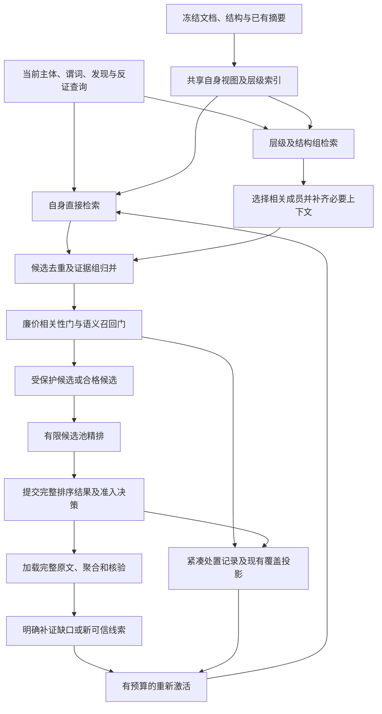

# 剪枝和增强语义检索视图方案

日期：2026-09-11。状态：已实现并部署 v4 工程路径；本机按进一步授权开启 trial 低分剪枝，质量状态为待专家校准，见第 10.2 节。独立样本、专家校准、真实模型质量/性能仍待验。具体证据见[实施验收记录](../specs/022-semantic-graph-closure/adaptive-retrieval-validation.md)。

本文汇总语义搜索剪枝、候选层级上下文增强两轮讨论，作为[关系谱图识别新内核的性能优化方案](关系谱图识别新内核的性能优化方案.md)的专题补充。最初讨论阶段的“当前实现”保留为问题基线；后续工程实施与启用范围以第 10 节及部署记录为准。

评审指出的六项阻断涉及冻结行为与新策略的冲突，不能通过只改排序函数解决。本轮同步[规格](../specs/022-semantic-graph-closure/spec.md)、[增量契约](../specs/022-semantic-graph-closure/contracts/incremental-performance.md)与[自适应检索契约](../specs/022-semantic-graph-closure/contracts/adaptive-retrieval.md)。后续用户已明确授权实施，并认可人工专家审核。状态/准入/恢复契约已用代码和受控测试闭合，交付可审阅的关闭态实现；P0 的独立样本及校准材料未齐备，不宣称整体 P0 或质量门通过，也不启用线上剪枝。

## 1. 目标与基本判断

通过增强粗召对主体、字段和跨节点证据的定位能力，减少无效扩搜；再对当前任务明显低相关的候选进行可恢复剪枝，减少精排、识别和独立核验成本。核心顺序是：**先补足判断相关性所需的上下文，再剪枝，最后用完整原文证明事实。**

需要区分两个判断：

- “当前片段不能独立证明关系”：可能缺少主体、对象、字段角色、条件或共指，需要聚合证据。
- “当前片段对当前关系或属性没有可识别的贡献”：适合暂缓精排和识别，但语义低相关本身不足以证明全文不存在该事实。

验收目标包括有效证据组召回、正确关系与属性、完整路径和首次有效结果的耗时。候选数量减少、队列清空、排序命中增加，都不能单独证明优化成功。

本方案保持本体、证据权限、事实核验、执行所有权、预算和覆盖守恒不变量；搜索准入、继续规则和快照按 v4 版本化修改。不得把目标行为静默套用到旧运行，不从文档结构直接推导业务关系，不将识别结果自动提交为业务事实。

## 2. 当前实现与瓶颈依据

### 2.1 已有能力及缺口

| 入口 | 当前能力 | 本方案要补充的部分 |
| --- | --- | --- |
| [retrieval_views.py](../backend/app/services/extraction/ontology_guided/retrieval_views.py) | 检索视图包含原文、标题路径、表头、父表上下文、注释及字段组上下文；所属章节摘要形成独立信号 | 统一自身、层级和结构组视图，控制兄弟展开及命中来源 |
| [heuristic_search.py](../backend/app/services/extraction/ontology_guided/heuristic_search.py) | 原文与结构启发式；可找到同字段组及同表格记录；H3 恢复未准入项的探索资格，随后有界按页处理，默认一页最多 32 条 | 在 H0/H1/H2/H3 共用检索处置，避免软剪枝项未经触发重新获得 H3 资格 |
| [context_records.py](../backend/app/services/extraction/ontology_guided/context_records.py) | 识别阶段补充字段组，以及受条件限制的相关兄弟标题和首条记录 | 将适用于定位的线索前移到粗召，保留原有事实权限边界 |
| [semantic_retrieval.py](../backend/app/services/extraction/ontology_guided/semantic_retrieval.py) | 结构、摘要、dense 通道排序；默认补足候选池，必要时从原文顺序补齐 | 在配额选择前设置相关性门，允许候选池不满 |
| [semantic_reranker.py](../backend/app/services/extraction/ontology_guided/semantic_reranker.py) | 发现与反证分别精排，保存原始分数，再融合相对名次；完整池提交 | 复用原始分数产生独立准入决策，保留完整精排结果与费用 |
| [executor.py](../backend/app/services/extraction/ontology_guided/executor.py) | 已提交排序进入启发式搜索，再创建识别任务 | 创建任务前应用统一准入结果，支持证据组去重及恢复 |

工作区已有 `heuristic-first-v3`，H2 每轮新增池上限为 8、16、32、64，当前批完整评分和提交后才消费。但首次 dense 召回仍可能为全部合格视图计算向量，小批次尚未等同于相关性淘汰。相关基础约束见[在线增量保存与有界扩搜契约](../specs/022-semantic-graph-closure/contracts/incremental-performance.md)。

`select_candidate_pool()` 的默认补满，以及 dense 通道本身包含大量低分记录，会使“相对排在前面”被当作“值得识别”。只关闭 `fill_pool` 不足以解决问题，必须先过滤再应用配额。

### 2.2 已有实测能说明什么

[HRS-1597 耗时分析](报告中心HRS1597新内核运行耗时分析-20260911.md)记录：104 次已结束发现/核验请求累计输入 521656 tokens，服务端输入处理约 1924.424 秒，占这些请求累计时长的 75.33%。因此，减少无关候选进入大模型、减少重复上下文，有明确的优化价值。

该历史运行的五个有效语义排序批次均为 64 条记录、发现和反证共 128 对精排，最后才向队列准入 8 条；对应槽位截至采样的支持产出为零。这说明当时批次成本与产出不匹配，不能据此认定全部候选都无关或全文没有相关事实。

上述数据属于历史运行，不能作为新增小批策略、剪枝或视图增强的效果证据。新方案需以固定输入和新运行身份另行验证。

### 2.3 评审后的冲突定位

| 阻断 | 核验结果 | 本次明确的修改边界 |
| --- | --- | --- |
| 一个 supported 后停止扩搜 | `next_admission()` 在新增支持产出后停为 `local_results_only`；`test_h2_success_defers_unchecked_tail` 冻结 v3 行为 | 保留旧测试，v4 新增多值、反证、列表缺口和剩余相关证据的继续规则，见第 6.3 节 |
| 全拒后 `prepare_next_epoch=None` 无推进 | 排序 `used` 已排除全部 committed epoch 成员；executor 只对非 None 结果 commit/accept | 这是引入子集准入后的活性缺口，不据此声称当前正常路径已经卡死；v4 引入有类型结果和有限步状态推进 |
| deferred 承担四种含义 | 未 admitted 同时用于候选范围、H2 轮次、停止条件和统计 | 拆六类处置及四种调用集合，覆盖账本保持独立 |
| 规格和增量契约冲突 | FR-003 配额补位、SC-002 低分实际检查与旧阶段规则不能自动适用新剪枝 | 在原条款处说明旧版适用范围，新增 v4 要求及契约，不只追加专题原则 |
| 覆盖与公开状态 | `planned = examined + incomplete + unattempted` 是硬校验；公开 schema 暂无剪枝计数 | `soft_pruned ⊆ unattempted`；扩充已有饱和原因和诊断，见第 7.4 节 |
| 旧快照严格相等 | v1 不写恢复体，v2/v3 形状被冻结；restore 比较整个 snapshot，策略存在白名单 | 新增 `heuristic-first-v4` 和独立恢复 schema，旧形状与旧测试保持原样 |

两项表述纠正：正常路径已有跨 committed epoch 防重复评分，新增风险在未进入 epoch 的前置门结果和未来子集准入；H3 当前是无条件恢复探索资格后按页执行，并非无限重新准入。

`adaptive_search_saturated` 已存在于 executor，在线执行在证据修复域已将它映射为 paused，前端也已有中文解释。本方案复用并补齐其判据，不新造同名终态。当前仍有软剪枝项时不能达到完整覆盖；这些项重新激活并完成检查后，完整覆盖仍可达。

## 3. 总体流程与证据边界

门全拒、无新增候选和视图不可用也要提交明确结果并推进状态，详见第 6.2 节；上图只展示主要数据流，不以产生 epoch 作为唯一完成准备的方式。

权限、原文范围、主体版本和完全重复任务等确定性检查，在付费调用前执行。相关性门依赖必要上下文，不能先按单节点缺少主体或谓词将其排除。

父级、兄弟、摘要和语义相似度均是检索线索。事实成立仍须核验主体归属、对象角色、关系方向、实体层级、极性和条件。同名、相邻、同表格或图连通不能单独证明实体身份及业务关系。

父级未命中时保留子节点的自身检索入口，避免父级摘要遗漏造成整棵子树漏检。根层 `describes` 等跨节点关系采用保守策略；不能要求先证明该关系，才允许召回证明它所需的对象来源。

## 4. 增强候选检索视图

### 4.1 上下文组成

| 信息层 | 内容 | 使用方式与限制 |
| --- | --- | --- |
| 自身 | 原文、直接字段名称、已有局部摘要 | 独立检索，保护编号、短值和没有父级摘要的片段；章节摘要须标明章节来源 |
| 祖先 | 标题路径、最近父级说明、表格名称 | 优先有区分度的近层信息，避免每条记录重复整份报告摘要 |
| 文档结构关系 | 表格、行、列、字段组、合并单元格、明确引用 | 解释物理结构和候选角色；结构归属不自动等于业务 owner 已证明 |
| 兄弟成员 | 同组字段标签、相关短值、明确承接的段落 | 按当前任务选择，优先同一物理归属，禁止默认拼接全部兄弟全文 |
| 已有图谱上下文 | 已核验主体名称、类型、相关来源和必要关系路径 | 主要放在查询侧，绑定精确版本与证明依赖，不将待证明关系当既有事实 |

“生成的层级关系”需记录来源：解析得到的层级是结构线索，模型生成的层级或摘要是派生线索，已核验图谱关系是带证明依赖的查询上下文。三者不能使用同一信任标记。模型派生信息不能单独触发永久排除。

### 4.2 自身、上下文、结构组三种视图

- **自身视图**：保留直接字段标签及原文的独立信号，避免公共父级或兄弟文本淹没自身内容。
- **上下文视图**：加入简短层级路径、父级说明、字段角色和有限兄弟信息，帮助识别省略的主体和内容类型。
- **结构组视图**：按字段组、表格或章节检索范围，命中后再选择有贡献的成员。组级高分用于引导展开，不自动赋予所有成员相同高分。

粗召可以使用有长度预算的检索描述；现有完整原文视图和引用仍独立保留。短描述中的摘要或省略不能替代核验证据，也不能借用现有 `complete` 标记声称未截断。预算、遗漏引用和原文加载方式必须可追踪。

各通道分别保留得分和来源，再进行候选融合与去重。不预设“上下文必然比自身更可靠”；通过消融评估决定融合权重、组内展开额度和上下文预算。

### 4.3 兄弟选择和命中归属

锚点级命中归属丢失是跨 H0–H2 的现存审计缺口：H2 的 `structure_text` 混合原文与 `field_group_context`，observations 只保存 record/channel 级命中及分数；H0/H1 也将 source/context/structure 命中压平成 term 列表。准确描述是“不能还原具体来源锚点”，不能据现有记录断言模型已把兄弟命中记成自身命中。

展开优先级为：同字段组或同一物理归属、明确引用与承接、相关兄弟标题，最后才是普通邻近节点。表格存在多设备、跨行合并 owner 或备选关系时，保留原始范围和条件，不能直接按行号认定实体身份。

词面检索若命中兄弟成员 B，候选成员 A 应保留 B 的锚点、角色和通道。dense/精排只可保证输入来源可回放，不得伪造整体语义分数的锚点贡献解释。B 可成为独立候选或与 A 组成证据组，但不能把 B 的属性挂到 A 所代表的实体上。旧制品缺失归属时明确标记未采集。

同一组经多个成员命中时，合并检索候选和来源引用；是否复用识别任务还须匹配主体、谓词、证据范围、待证明断言及版本，不能仅凭同组或同名去重。

示意：清洗步骤短句缺少设备名称，同组“设备名称/编号”和“清洗方法”表头能帮助粗召。最终挂接仍需原文 owner 证明。清洗方法字段含多段动作时，核验加载完整方法范围；不能只取一段动作冒充整套方法。

### 4.4 组到 record/task 的映射

结构组使用独立 `group_view_id`，绑定文档/IR/分组策略、稳定有序成员和角色引用。组级评分保存为视图或门结果，不能将 group ID 填入 record 级 `RetrievalPlan`、RecallLedger、`RankingEpoch` 或 `RecognitionTask`。

组命中后先进行有界成员展开，冻结组到成员的选择映射和未展开范围，再按真实 record ID 构建精排池。重叠组按 record 去重，保留所有命中来源，不把组分数复制为每个成员的自身分数。

同一 `(plan, record)` 的首次识别去重，补充来源通过冻结上下文引用加入；已形成断言后的新增来源走既有补证/重验版本。作为 context/binding 读取的成员不获 coverage，也不能未经准入或证据协议授权提出新事实。详细身份与权限见自适应检索契约第 5 节。

## 5. 剪枝规则与阈值

### 5.1 决策单位与处置分类

决策针对“主体及版本 + 谓词 + 检索意图 + 候选证据组 + 来源及策略依赖”。剪枝不删除原文节点，不直接删除图谱实体，也不改变其他主体或谓词对该来源的检索资格。

| 处置 | 适用情况 | 后续行为 |
| --- | --- | --- |
| 明确排除 | 越权来源、主体失效、相同依赖下已完成的完全重复任务 | 停止该任务工作；重复项引用已有结果，保留审计与费用 |
| 绑定排除 | 某个具体端点绑定违反已证实的物理角色或本体约束 | 排除该绑定，保留原文对其他角色、反证或任务的作用 |
| 可恢复软剪枝 | 主体关联、谓词/字段关联和语义关联均弱，且无保护或补证理由 | 当前依赖不变时暂缓付费处理，等待有理由的重新激活 |
| 保留或补证 | 可信主体来源、直接字段、必要归属/共指、完整方法、条件或反证 | 保留相关来源，根据缺口聚合并按预算处理 |

未知类型不等于类型不相容，未出现关系词不等于关系不存在，技术失败也不属于低相关。最终事实否定继续走原有语义核验契约。

### 5.2 三道成本门

| 成本门 | 输入与判断 | 输出 |
| --- | --- | --- |
| 廉价相关性门 | 复用结构、字段、可信主体和词法线索；必要上下文不足时先标记缺口 | 保留、待补证、软剪枝或确定性任务排除 |
| 语义召回门 | 对合格视图的自身/上下文/组级信号评估；发现和反证分别考虑 | 有限精排池、暂缓成员及来源理由 |
| 精排准入门 | 复用已完成的原始精排分数、证据组贡献和保护规则 | 可以创建识别任务的候选子集及其补证范围 |

不为每个候选新增一次大模型相关性分类。廉价前置门主要节省下游成本，是否节省向量化取决于缓存和构建位置；全局视图已预计算时不能重复计算这部分收益。

软剪枝应满足多路低相关且无保护理由，不能用任一单项低分作为充分条件。受保护片段可以绕过相关性淘汰，但仍受预算、来源权限、事实核验和公平调度约束；保护集合超出批次时有序续处理，不静默丢弃，也不无限扩大单次输入。

### 5.3 阈值和候选池

RRF 融合相对名次，即使候选全部无关也有第一名。不得把 RRF 分数当事实概率或通用相关性阈值；原始精排分数也需校准，不能直接套用未经验证的余弦或精排阈值。

校准按具体模型版本、视图版本、谓词族和意图区分。根层宽关系保持更高召回要求；具有明确字段角色与物理 owner 来源的属性，可以更积极地过滤无关项。未校准策略先以影子方式记录，不能静默启用激进阈值。

池容量是上限，组展开后的实际 record 池另计；合格记录只有三条就处理三条。相关性过滤应先于配额补充，不能通过 dense 尾部、通道补满或原文尾部绕过。必要反证和明确条件保留独立入口，正向匹配低分不能覆盖反证命中。零条通过必须消费有类型的空结果，不能停在 needs_semantic 等待不存在的 epoch。

### 5.4 不可精排视图的处置

当前超 token 预算视图标记 `not_rerankable`，保留原文全集及普通探索资格。新版分别判断自身、上下文和结构组视图；一个视图超限不淘汰其他可用视图。

缺少精排分数不得填零、判低相关或触发软剪枝。短视图可用于定位，但不能宣称截断部分不相关；必要上下文未覆盖时保留保护或缺口。全部视图不可用时返回 `view_unavailable`，走已有确定性/完整原文路径，或在协议无法满足时明确技术暂停，不构造语义否定。

## 6. 证据聚合、扩搜与调度

### 6.1 以贡献判断证据组

判断候选是否能提供主体、对象、谓词/字段角色、归属/共指、条件或反证中的任一部分。缺少完整三元组的片段仍可能有价值；不能因单记录核验未成功就丢弃整个证据组。

例如“报告描述药物产品”可能依赖分开的产品名称、产品角色和生产信息。粗召保留这些互补来源，识别按现有协议冻结候选并补齐证明。层级检索只负责找到来源，不自动生成 `describes` 边。

已有明确属性来源继续获得既有有限优先份额，普通关系、重试和探索保留公平性。v4 必须显式修改当前“一条支持即停”的规则，见第 6.3 节；这不是已有代码已满足的原则。

### 6.2 搜索处置、空结果与活性

v4 按当前槽位 generation 区分六类处置：未评估 `unevaluated`、已有门/精排结果待处置 `evaluated_pending_disposition`、软剪枝 `soft_pruned`、有触发可重激活 `reactivatable`、已准入 `admitted`、当前依赖已耗尽 `dependency_exhausted`。处置解释、合法转换和覆盖关系以自适应契约第 2 节为准。

`deferred_record_ids` 在旧版保留原义；新版不得继续以该字段驱动四种行为。候选范围改读未完成门评估集合，已有结果先从待处置集合消费，H3 读取受控探索集合，停止和统计读取独立处置/覆盖投影。依赖不变时，前置门拒绝项即使没有 epoch，也不会再次参与相同付费评估。

v4 准备接口使用有类型结果：

| 结果 | 处理 |
| --- | --- |
| `gate_completed` | 非空前置门通过集持久化为 next_stage_ready，继续下一道门；不直接创建 H2 识别任务 |
| `ranked` | 保留完整 epoch，派生并提交小决策；准入子集为空也消费该结果 |
| `filtered_empty` | 提交门评估及处置；无须伪造空 epoch；选新范围、有限探索或饱和 |
| `no_new_candidates` | 检查已评分待处置及可重激活项，再推进探索或停止；不能原地等待 |
| `view_unavailable` | 使用其他视图/确定性路径，或按必要技术阻塞处理 |
| `disabled` / `blocked` | 分别按明确关闭和技术/预算/失效契约处理，不混同零相关 |

同步和异步 executor 都处理上述结果，owner 负责持久化完成结果，私有准备线程不接管数据库提交。兼容层接到旧 `None` 时解析其原因，不能将其当作待完成任务。每次结果必须推进处置、游标、阶段或明确阻塞/饱和。各门共享冻结的 `expansion_attempt_id`，只有完整 ranked 或该轮完整前置全拒消费一次轮次；中间水位、技术分支和重放不重复计轮。8/16/32/64 是新增工作上限，不能为“走完四轮”制造空 epoch。

### 6.3 支持结果后的继续规则与重新激活

v1/v2/v3 保留现有成功后暂停及测试；v4 不以 supported 数量作为槽位完成条件。先处理已准入页、明确列表剩余成员、必要反证和补证；多值或基数未知时继续相关候选，存在列表/编号缺口时扩搜。单值本体约束也不能免除竞争值和反证检查。

没有可行动候选、在途或待应用结果时才判断饱和；预算不足和技术失败保持各自原因。普通关系、明确属性和重试仍有有界执行机会，不能为追求完整性无限展开。

统一处置作用于 H0/H1/H2/H3，历史已评分池复用原结果；H3 不再因“尚未 admitted”自动恢复软剪枝项的资格。

重新激活应绑定以下原因之一：

- 新的可信名称、编号、主体来源或明确归属/引用出现。
- 证据组形成具体缺口，需要寻找另一端、字段角色或条件。
- 原文、摘要、主体证明、本体、查询或策略依赖发生变化。
- 有限探索抽样发现同类候选被误剪，需要调整检索范围。
- 用户明确继续搜索，在新预算内处理暂缓范围。

“无支持产出”需进一步区分：缺证据则补证，协议错误则修复或按契约重试，技术失败按技术状态处理，低相关才扩大检索范围。不能仅因没有产出机械地重复 8/16/32/64 全部轮次。

探索保持固定预算和稳定顺序，不因恢复刷新额度。显式继续只在剩余或另行授权的预算内推进，不能重置已发生费用。达到预算、暂缓池无触发条件或只得到局部结果时，明确报告剩余未核验范围，不能以空队列宣称全文质量完成。

## 7. 数据契约、缓存与恢复

以下为已在[自适应检索契约](../specs/022-semantic-graph-closure/contracts/adaptive-retrieval.md)定义的目标数据与版本边界，不代表当前公共接口已经实现。

### 7.1 检索上下文与准入记录

| 概念 | 必要信息 |
| --- | --- |
| 共享视图与组映射 | 独立不可变制品；复用原文/结构/摘要引用和 hash，记录成员、角色、来源及遗漏范围 |
| 现有 observations | 继续承载原始精排/通道分数、排名、保护理由、视图状态，不另复制到决策 |
| 小 `AdmissionDecision` | 精确 evaluation/epoch 引用、准入有序子集、处置原因分组、依赖及政策 hash、幂等 ID/hash；必要时引用冻结组展开映射 |
| 最小 `GateEvaluation` | 补齐 epoch 前的被评估范围、输入/输出 hash、阶段/视图状态、缓存出处、已有付费回执引用和耗时；不复制正文与向量 |
| 搜索处置投影 | 从准入历史、决策及稀疏变化重建六类当前处置；不持久化六份完整 record 列表 |

小决策从 observations 派生，不成为平行的全文/得分账本。前置门决策区分 `next_stage` 与 `recognition` 目标，通过前门的 record 只能成为下一门候选；H2 识别准入必须引用完整 committed epoch。已有核验记录在新查询 generation 保留准入/覆盖，新来源走补证工作，不重建首次覆盖。

检索处置与现有 `coverage_state`、`execution_state`、`semantic_outcomes` 分开。`soft_pruned ⊆ unattempted`，不是第四个可相加覆盖状态；软剪枝不写入 `unsupported`，读取兄弟上下文也不代表该兄弟已完成独立检查。冻结的原文全集及 RecallLedger 守恒继续成立。

### 7.2 完整排序池与准入子集分开

当前 `RankingEpoch` 要求 `record_ids` 与 `ordered_record_ids` 覆盖同一个完整唯一池。不能在提交后直接删除低分记录来表达剪枝，否则会破坏审计、费用归属和恢复。

当前 `accept_semantic()` 只接收 ID 列表、epoch 字符串和 `committed` 布尔，不能核验子集确实属于该 epoch。因此 v4 接口必须接收真实 committed epoch 与小决策（或等价的已验证不可变引用），校验同 run/plan/主体/谓词/查询/权限/版本依赖、完整 pool hash、准入有序子集及 decision ID/hash；同 ID 不同内容拒绝，同一决策重放幂等。

前置门无 epoch 走独立结果接口，校验门的完整范围、阶段、通过集及 hash，不能假冒 epoch。H0/H1 和配置明确的确定性探索仍按其冻结准入来源处理，技术失败不能伪装成启发式绕过。

持久化顺序为：预扣 → 模型回执/完整门结果或 epoch → 小决策 → 搜索状态与准入事件 → 派发。门使用 embedding 后即使全拒且没有 epoch，也须保存评估范围、真实输入 hash、cache hit/出处及费用回执；缓存命中不新计模型费用，跨查询引用同一请求不重复计费。

覆盖“排序已提交但决策未提交”“决策已提交但任务检查点未提交”“前门通过但后门尚未开始”三种恢复边界：分别重建小决策、回放幂等准入、恢复下一阶段水位，均不得重评已完成部分。未知响应保留预扣和请求身份。主体失效仍保留已发生费用和回执。

### 7.3 共享构建、失效和降级

静态文档结构和视图按冻结输入共享构建，复用已有摘要，不在每个主体/谓词查询中额外调用摘要模型。公共祖先及结构组共享存储，通过引用组装，避免成倍复制原文。

静态检索缓存至少绑定文档及 IR、摘要、视图政策、嵌入模型和访问范围；动态查询绑定主体精确版本、本体、谓词、可信提及与证明依赖。图谱增加关系只使相关查询和决策失效，不应重新向量化整篇文档。

决策和新增视图引用接入现有增量状态保存，不在每次检查点复制完整兄弟正文和全部分数历史。缓存命中仍校验权限和来源范围，防止跨文档、跨运行或跨用户复用错误内容。

摘要缺失或层级不完整时保留自身原文通道并记录缺口。预算不足不得静默删除必要否定或条件；完整来源无法加载时保留未决。模型、存储或恢复失败按现有技术失败契约处理，不能转换为低相关或成功空结果。

### 7.4 覆盖、公开诊断与饱和暂停

始终保留 `planned = examined + incomplete + unattempted`。当前 `records_soft_pruned` 必须小于等于 `records_unattempted`；这些诊断是未尝试范围的细分，不能在进度条或总数中再加一次。

复用现有 `adaptive_search_saturated` 和 paused 路径，补齐条件：当前 generation 无在途/待应用结果，无可行动候选、激活或可立即处理补证；其他槽位仍就绪时继续调度。当前有未尝试软剪枝项时 `completion=incomplete`，不能以饱和表示事实完整。重新激活后满足全部覆盖条件，`in_scope_complete` 仍可达。

公开可选 `retrieval_diagnostics`，含 schema/policy 版本、当前软剪枝/待处置/可重激活/依赖耗尽计数、原因和搜索状态，按运行和主体/谓词提供相同口径。单位为槽位-record 机会；历史累计事件另标累计。旧运行缺字段显示未采集，不补造零剪枝，不泄露私有原文和模型输入。

实施链路包含内核 `contracts.py`/`ledger.py`/`executor.py`、后端公共 schema、`application.py`/`public_projection.py`/执行 progress 映射、前端 `api.ts`/`document-analysis.ts` 与实际进度和图谱覆盖组件。不能只改内部字段而遗漏公开投影。

### 7.5 v4 快照和旧运行兼容

新增 `heuristic-first-v4` 白名单与运行工厂分支，仅 v4 写 `resume_state.schema_version=1`、阶段水位和处置引用。v1 保留不写 resume_state 且不支持恢复的行为；v2/v3 保留原序列化形状和严格相等校验，不增加默认键，不通过删键/补键让旧测试勉强通过。

新政策及 observation/enhanced/enforce 模式进入冻结指纹。视图、模型、阈值或查询规则更新需明确版本；未知版本拒绝恢复，不静默迁移在途运行。读取兼容性、部署和运行迁移分别验收。

## 8. 实施分解

下表保留实施与验收要求；代码、工程验证和真实质量的进度分别见第 10 节。按后续授权，线上默认 `enhanced`：启用 v4、增强视图和组级召回，但禁止携带剪枝校准，不按低分淘汰。`observation` 保持 v3 候选、请求、支持后停止等行为，`enforce` 的开发配置只允许隔离测试，线上必须使用专家审核的校准制品。未知或未校准谓词不执行相关性淘汰，不能以受控测试阈值充当生产阈值。

| 阶段 | 工作内容 | 主要落点 | 完成条件 |
| --- | --- | --- | --- |
| P0：契约闭合与基线 | 关闭下表全部设计检查项，版本化原规格，登记样本/预算/指标和预期回放 | 022 spec/plan/tasks/quickstart、新自适应契约及原增量契约 | 逐项可追踪；不能用“已补文档”代替基线、参数和样本验收 |
| P1：处置、观测和准入基础 | P0 后实现 v4 六状态、结果分支、小决策、版本恢复及公开诊断；按旧/新模式隔离，先影子验证 | 检索/executor/内核 contracts/ledger、状态存储、后端 schema/投影、前端类型和覆盖 UI | 空结果有限步推进，费用与覆盖守恒；真正剪枝需后续对应配置校准与质量门 |
| P2：基础上下文增强 | 复用标题路径、表头、字段组；增加自身/上下文独立信号及命中归属 | `retrieval_views.py`、`records.py`、`retrieval_query.py` | 固定候选及 token 预算下评估召回；自身直接入口始终可用 |
| P3：结构组与兄弟粗召 | 组级索引、受控展开、来源角色、跨节点证据组去重与预算 | `heuristic_search.py`、`context_records.py`、现有证据组/上下文模块 | 互补证据进入候选，普通兄弟不被无条件赋高分或错误挂接 |
| P4：校准与前置剪枝 | 按最终模型/视图/谓词族/意图重采影子数据并校准，加入廉价和语义前置门、触发式扩搜 | 检索模块、状态与调度入口 | 不复用已失效视图的阈值；通过质量与恢复门后启用，计入门自身开销 |
| P5：全文对照与交付 | 本机模型对照、回归、故障恢复及发布说明 | 评测工具、定向测试、新结果目录 | 报告事实质量、关键节点耗时、覆盖缺口和可部署范围 |

实施先后与运行时顺序需要区分：先建立可回放的准入与影子机制，再增强视图和校准阈值；实际运行时，必要上下文补充仍先于相关性淘汰。优先复用现有模块，避免同时引入新数据库、独立向量服务或逐候选大模型分类器。

P0 退出检查与具体任务见 [AR 任务清单](../specs/022-semantic-graph-closure/tasks.md)，至少关闭以下设计项：

| 检查项 | 必须明确的结果 |
| --- | --- |
| 搜索状态 | 六类互斥当前处置、按门阶段候选集合及 deferred 各调用者替换 |
| 活性 | 全拒、非空前门、无新增候选、None、异步完成和技术阻塞的推进及有限轮次 |
| 准入与映射 | 小决策 schema/幂等 hash、accept 精确校验、组到 record/task 映射和事实权限 |
| 恢复 | v4 白名单/独立 schema、水位和依赖 hash；v1/v2/v3 原形状及分版本测试 |
| 费用与状态体积 | pre-gate 评估与回执、决策屏障、缓存计费归属、增量引用和恢复成本 |
| 覆盖与公开诊断 | 当前 soft_pruned 子集、饱和与暂停条件、全链路 schema/前端计数 |
| 继续与不可评分 | not_rerankable 多视图、supported 后多值/反证及列表缺口规则 |
| 原条款同步 | FR-003/FR-005/SC-002 和增量契约显式按版本分流，旧测试保留 |
| 样本和参数 | 暴露样本、未暴露保留集、专家参考、至少三个真实新运行、校准版本及预登记预算 |

工程任务已经按实际代码与测试更新，P0 的样本材料项及整体退出仍未勾选。旧版回归与 v4 新场景分开，未修改旧版成功停搜断言。

## 9. 验证方案与验收口径

### 9.1 固定输入和消融对照

HRS-1597 和 HRS-5592 均已参与开发诊断或实验，属于开发暴露样本。它们可承担 CMCReport 本体闭包下的本机模型诊断、回归或明确声明的开发校准，不能因新建运行或输出目录就升级为独立保留集。冻结原件 hash、解析/摘要制品、本体 hash、模型及精排配置、策略、参考答案与预算；参考答案只进入评分，不进入查询、视图、分组或阈值运行时输入。

显式继承父方案第 8.10 节：至少三个真实新运行及符合既有评测协议的专家参考，另需未暴露文档承担独立质量门；三个新 run 不能代替独立文档。保留集不足或参考未批准时，正式质量门保持待验，暴露样本结果只作诊断。历史冻结评测不重写。

P1 在旧视图上采集的影子数据只适用于相同模型、视图、查询和归属版本；P2/P3 改变输入后必须重采对应配置的数据，不能直接用于 P4 阈值校准。阈值和融合权重在校准集确定，保留集只验收，失败后再调参须重新界定保留集。

| 组别 | 配置 | 要回答的问题 |
| --- | --- | --- |
| A | 当前小批策略与现有检索视图 | 现状成本和质量基线是什么 |
| B | A + 对该视图单独校准的准入剪枝 | 单独剪枝能节省多少，误剪哪些证据；不是 P0 前的观测原型 |
| C | A + 祖先/字段角色增强 | 基础上下文能否修复粗召漏检 |
| D | C + 受控兄弟与结构组 | 跨节点证据收益是否超过展开成本 |
| E | D + 经校准的三道成本门 | 联合策略能否更早得到正确关系和属性 |

先在影子模式记录拟剪枝项并继续原流程，核查其后续事实贡献；影子模式本身不提供在线提速证据。另行离线审查未产生事实的抽样项，避免将原流程漏识别误当成剪枝正确。之后执行真正启用策略的等预算对照，并分别说明冷缓存与热缓存条件。

### 9.2 关键耗时与质量指标

| 维度 | 指标 |
| --- | --- |
| 视图与粗召 | 索引构建、上下文组装、分词/嵌入、词法/dense/组级召回耗时，缓存命中与 token 数 |
| 剪枝与展开 | 各门耗时，池大小，兄弟展开数，重复候选数，暂缓及重新激活数和原因 |
| 精排与识别 | 精排对数/请求数、识别及独立核验请求数、输入/输出 tokens、模型及排队耗时 |
| 状态开销 | 增量保存、周期基线、恢复耗时和写入量，不能以新增账本抵消模型节省 |
| 首次有效结果 | 正确一级关系、正确属性、完整路径的首达时间，以及最终是否仍有效 |
| 最终质量 | 有效证据组召回、关系/属性 precision 与 recall、完整路径、错误主体挂接、否定与条件保留 |
| 完成范围 | 保持三项覆盖守恒；软剪枝等以子集诊断展示，未决/技术失败/未评分另列，不重复相加 |

并行任务的累计请求耗时与墙钟时间分开，使用请求/任务/运行身份及重叠区间归因，不简单相加。语义候选命中率提高只有在证据和事实指标支持时才算质量收益。

对照用于归因，继承父方案的绝对成本和真实质量口径，不单以相对提速比例验收。新决策引用、GateEvaluation 和锚点审计自身的序列化、SQL、基线及恢复成本也要计入，不能以新增账本抵消节省。

### 9.3 必须覆盖的反例和恢复检查

- 父级摘要遗漏关键属性，但子节点自身明确命中。
- 兄弟成员有匹配值，当前成员属于另一主体；必须保留命中来源并阻止错挂。
- 跨节点片段各自证据不足，组合后才能证明根层关系。
- 清洗方法多段、备选设备、否定、适用条件和脚注完整保留。
- 公共父级摘要使大量无关子节点相似；组级命中不能扩散成全组高优先。
- 正向检索低分但反证命中，以及未知类型、缺摘要、超预算、模型异常。
- 剪枝项不会在 H3 无触发恢复资格；前门非空后继续下一门，前后门全拒、used 已覆盖全部剩余项及 None 均有限步推进。
- 一条支持后仍检查必要多值/清单尾项和反证；v3 原成功停搜测试继续通过，v4 使用独立用例。
- 同决策重放幂等、跨 epoch 子集/同 ID 改 hash 拒绝；前置门全拒无 epoch 仍有费用和输入回放。
- 一个视图不可精排时其他视图可用；全无分数不能填零软剪枝；旧快照保持原形状，v4 未知 schema 拒绝恢复。
- 排序/准入/任务检查点之间中断后的精确恢复、失效主体取消、跨运行/用户隔离。
- 已有属性优先、普通分支公平、费用单调和增量保存边界不回归。

在冻结参考集上，新增错误主体挂接、丢失必要否定/条件或关键路径证据误剪应阻止默认启用。总体 precision/recall 容差、首达及总耗时改进目标在 P0 预先登记；结果揭晓后不放宽标准。工程测试通过不能替代本机模型全文质量验收，单机样本结果也不能直接外推所有文档。

## 10. 交付状态

- [x] 保存两轮讨论，并按评审补充版本冲突、状态机、映射、准入/费用及恢复设计。
- [x] 同步专题规格、计划、任务、quickstart 和版本化契约的书面要求。
- [ ] 关闭 P0 退出清单，完成固定基线、冻结参数、校准及未暴露参考集准备。
- [x] 实现隔离 v4 可回放准入、增强视图、受控兄弟/结构组召回和校准门；初次交付默认关闭，后续授权默认增强检索。
- [x] 完成定向工程回归、v3/观察模式等价、空池跨槽位活性和崩溃恢复验证；命令见实施记录。
- [ ] 完成最终配置的影子数据采集、专家校准及本机模型对照评测。
- [x] 按后续授权部署默认增强检索，记录生效策略与旧运行恢复。
- [ ] 达到独立质量与性能门后启用经过校准的主动剪枝。

后续实施记录须分别标注“代码完成”“工程验证”“真实模型验证”“已部署”，不能用本设计中的目标、示意或历史实测代替本次结果。

### 10.1 当前落地与明确限制

- `adaptive_retrieval.py` 定义小决策、完整门评估和校准制品；`adaptive_search.py` 维护稀疏处置、门阶段水位和 v4 快照。完整 epoch 不删除低分成员，识别只准入已提交决策的有序子集。
- 前门全拒、已评分无新池、视图不可用均有结果分支，空结果不占住唯一语义等待位置。已提交门按依赖复用；同一次扩搜的多道门不重复计轮。
- 廉价门保存词面锚点和保护/缺口，**首版不以无关键词直接剪枝**。实际相关性淘汰发生在校准后的双意图语义门与精排门；这意味着首次冷向量化仍可能覆盖全部合格视图，增强视图也会增加向量输入，尚不能宣称冷启动提速。
- 自身、上下文、结构组独立保存信号。组按原文顺序最多展开 8 个成员（可冻结调整），重叠组按 record 去重；其余成员仍有自身/上下文入口。语义组命中保护互补成员，原文作为 `retrieval_group_binding` 加载且 `fact_eligible=false`。
- 上下文超限回落到完整自身视图，同时保留上下文缺口保护；全部不可用走有界原文探索。缺分不填零、不写 unsupported。发现一个 supported 只提升已有事实状态，v4 继续有界多值及反证搜索。
- 校准文件同时绑定模型、查询版本、视图参数 hash、谓词清单、自身/上下文/组/精排的双意图阈值与专家制品 hash。开发阈值只在 `evaluation_only=true` 的隔离入口使用；无阈值的增强视图测量也仅允许该入口。
- 复用存储 v3 的增量屏障。历史门/决策载荷不可变共享；视图与组原文清单单独按 hash 共用，不在每条决策复制正文。公开诊断仅有计数，当前软剪枝仍是 unattempted 子集，旧运行缺字段显示“未采集”。

### 10.2 人工专家审核

允许由人工专家形成参考。工具 `python -m app.evaluation.adaptive_expert_review` 根据冻结 IR、本体及可选图/排序制品生成审核包，列出**全部原文记录**；专家需核对归属、方向、实体层级、否定条件、遗漏和完整路径，再填写引用、审阅人、时间与标注版本。仅审阅已输出结果不能评估漏召回。

`validate` 校验制品身份、原文范围、逐记录审阅完整性及批准记录，不代替专家判断事实。参考沿用 `ontology-guided-reference-v1`，仅进入独立评分，运行时不加载审核包。HRS-1597/HRS-5592 原件 hash 被登记为开发暴露，不接受改标为 holdout；仍需未暴露材料与至少三个真实新运行。

### 10.1 默认开启的范围（2026-09-11 后续授权）

代码与 Compose 默认 `DOCUMENT_ANALYSIS_ADAPTIVE_RETRIEVAL_MODE=enhanced`，证据修复前置开关默认 true。`enhanced` 激活 v4 有界继续、多视图与结构组召回、处置和费用审计，不执行未经校准的低分剪枝；这是实际新搜索路径，区别于保持 v3 行为的 `observation`。

`enforce` 仍需有效校准文件；`disabled` 可关闭自适应策略，若同时关闭证据修复，须一起设置，避免新任务因前置配置冲突被拒绝。每个新运行冻结模式；旧运行恢复不因默认值变化而升级。

本次上线授权不构成专家质量签字或性能达标。部署及检查证据见[部署记录](../specs/022-semantic-graph-closure/adaptive-retrieval-deployment.md)。

### 10.2 显式低分剪枝试运行（2026-09-11）

用户进一步要求开启低分剪枝，新增 `trial`，本机持久配置改为此模式。阈值文件标为 development，专家审核文件明确 pending；正式 enforce 的已审核校准门不放宽。当前试运行只在完整精排后、双意图 raw logit 均 < -8 且无原文/上下文/互补结构组保护时软剪枝，dense 前门不淘汰。该阈值是待验证的保守初始规则，原始分数不是概率。

单记录结构组没有互补成员，trial 不因其自身向量正分额外保护；原文命中及多记录组保护仍有效，旧模式不变。公开诊断展示“剪枝试运行，待专家校准”。新运行冻结此模式，已有运行不自动迁移。

本机 12 个合成查询对的分数冒烟用时 70.84 秒（含加载），3 个明显无关文本双意图分数约 -11，相关、否定及条件样例均未触发 -8 阈值。这是分数与接线验证，不是最终增强视图全文校准或性能达标证据。详细配置和部署记录见[低分剪枝启用记录](../specs/022-semantic-graph-closure/pruning-trial-deployment.md)。
