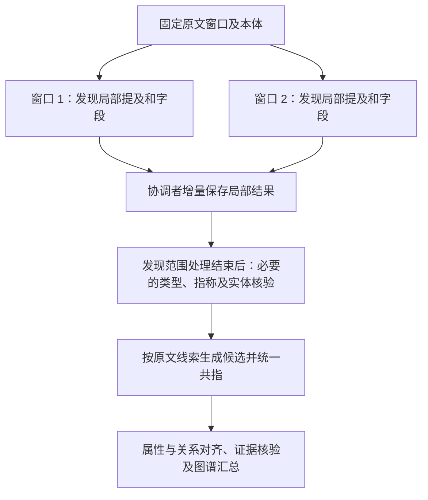
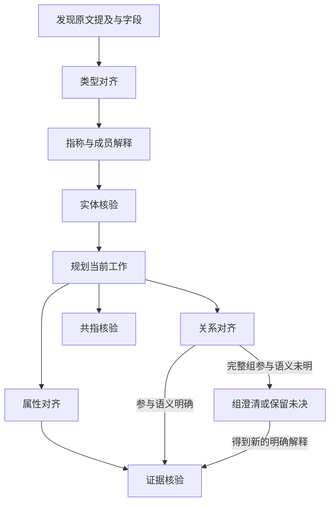

# 图谱分析双批次并行依赖设计核验

日期：2026-10-01。范围：确认单文档并行边界；按最新讨论，优先两个阅读窗口局部抽取并行，
跨窗口身份交由后续共指处理。GPT 请求并行的提交约束另行保留。

本次是代码调查、合成验证和设计修订，未实现或启用并行，未修改活动运行。
下文分别标注现有行为和建议约束；建议约束不是已通过的并行验收结果。

后续可编码方案已独立整理为
[阅读窗口并行与后置共指重构方案](图谱分析阅读窗口并行与后置共指重构方案-20261001.md)。
具体实现范围、数据契约、任务和验收以该独立方案为准；本文保留依赖调查及前期设计依据。

## 1. 核验结论

当前工作项已有稳定 ID、语义依赖指纹、变更失效、采信门控和已付费回答复用机制，
但模型调用与业务应用尚未解耦，也没有覆盖并行交错的统一提交前检查。
因此不能仅把 `active_batch` 改为列表，或将现有处理函数放进线程池。

并行设计应区分三件事：

- **输入因果依赖**：B 必须使用 A 生成的断言或解释时，A 提交后才能准备 B；只等待 B，
  其他输入已就绪的批次仍可调用。
- **输出更新冲突**：两批可能更新同一断言、字段观察或竞争关系组，不阻止 LLM 并行调用；
  回答由单一协调者依据当前状态串行合并和提交。
- **回答适用性**：提交前检查回答依赖的语义输入是否仍有效；仅共享输出目标或进度变化
  不构成失效，相关证据、端点语义等改变则需要重新核验。

按最新讨论，首轮建议改为**两个阅读窗口的局部结构抽取并行**：各窗口只依赖自己的原文、
预先附带的标题/表头等只读上下文和固定本体，保存局部提及、字段、归属候选及原文线索，
不等待其他窗口的实体发现、身份判断或关系结果。跨窗口身份交给后续共指分析。
这替代此前“只在同一窗口的 drain_work 中并行”的范围建议，具体边界见第 1.3 节。

首版先并行发现和局部结果保存；沿用必要的类型/指称核验后，再统一共指和处理跨窗口关系。
暂不同时引入窗口内多路请求并行，两个窗口共享总计两个 GPT 在途槽位，避免并发度相乘。
一个窗口完成局部抽取即可补入下一个，无需等待另一窗口完成整个图谱流程。

### 1.1 “批次”的含义

当前批次是一次已准备的、属于某个阶段的 GPT 请求，可包含多个工作目标；
不是把一块文档的发现、对齐、核验全部包在其中的完整处理链。

在当前实现及后续关系处理阶段，关系对齐 A 生成候选，`review_for()` 创建核验工作，再由另一次请求 B 核验，
属于真实的跨批次依赖。两条处理链 `A1 → B1` 与 `A2 → B2` 可交错推进：
A1、A2 同时调用；A1 提交后，B1 可占用空出的槽位，与尚未结束的 A2 并行。
如果 A2 随后改变 B1 实际依赖的证据，B1 的回答在提交时须重新检查适用性。

同一工作项也不一定只对应一个批次：过大的属性菜单会拆成多次 GPT 请求。
组的参与与时间判断则已经合并在同一次证据核验请求中，见第 3 节。

### 1.2 与 UI“阅读批次”的关系

本文后续“批次”均指 GPT 请求批次；UI 的“阅读批次”对应原文阅读窗口 `Window`。
两者是不同的粒度，后续沟通分别称“阅读窗口”和“GPT 请求批次”。

| 概念 | 划分依据 | 与处理流程的关系 |
|---|---|---|
| 阅读窗口（UI“阅读批次”） | 原文段落、表格及上下文预算，可继续拆成子窗口 | 组织发现、类型/指称处理、规划及相关工作消费 |
| 工作项 `work` | 具体属性对齐、关系对齐或证据核验目标 | 一个请求可处理多个工作项；一个属性工作也可拆成多个菜单请求 |
| GPT 请求批次 | 某阶段的一份冻结请求及目标集合 | 在某个阅读窗口的处理过程中，通常会先后产生多次请求 |

UI 的 `windows_total` 包含拆分后的父子窗口；`windows_discovered` 实际统计
`discovery_attempted` 为真的窗口，`windows_reviewed` 统计 `phase == done` 的窗口。
这些数字都不是 GPT 请求数；UI 另有“已完成调用”指标。窗口已处理也不表示所有候选均已采信。

对应关系通常是一窗口多请求，但不是严格的原文归属树：工作请求可引用其他窗口发现的实体
和证据，后续输入变化可重新激活已有工作；所有窗口结束后还可消费剩余工作。

最新建议选择两个 UI 阅读批次的**局部抽取部分**并行；不把两个窗口从发现到最终关系采信
的完整流程直接并行。以下局部/全局分工用于移除抽取阶段的跨窗口语义依赖。

代码依据：[UI 进度字段](../frontend/src/components/analysis/source-harness-panel.tsx)、
[窗口调度及计数](../backend/app/services/document_harness/controller.py)。

### 1.3 阅读窗口局部抽取并行，身份统一后置



这里的阶段汇合是为了让后续处理看到已保存的局部结果，不是每两个窗口之间设等待屏障。
任一窗口完成即可补位；尚待拆分的子窗口仍属于发现范围，未完成范围继续按现有契约标明。
首版不在发现过程中反复启动跨窗口共指，不要求共指给出所有实体的确定身份才能处理关系；
未决提及保持独立，依赖未决身份的推断不得采信。

局部阶段的输入输出约束：

- 输入不带其他窗口运行中生成的 `known_mentions`、实体字段合集或已经做出的共指结论。
  标题、表头和限定引导语可作为预先固定的原文上下文共享，不能因隔离结果而删除必要原文。
- 保存窗口中有原文定位的实体提及、字段标签/原值/缺失标记、局部归属候选与证据。
  此时的“属性”首先指原字段；合法谓词对齐和事实采信仍保留各自检查，抽取完成不等于属性已采信。
- 局部关系线索、别名/编号和跨段引用线索只记录原文内容、位置和局部端点，暂不解析其他窗口
  的目标。共享线索依赖可以后置，供后续处理使用的原文依据不能丢弃。
- 属于文档本身的字段仍指向已知文档根，不让每个窗口创建一份文档实体；协调者增量合并字段
  关联。共享根记录只影响提交合并，不要求发现阶段等待其他窗口。
- 相同物理原文锚点和角色因窗口重叠被重复读取，沿用稳定原文身份做去重及字段/证据合并；
  不同位置的同名提及保持独立，交给后续共指。同一锚点存在冲突解释时保留未决，不能后写覆盖。
- 不为每个窗口复制全图或建立第二份权威状态。局部结果沿用现有提及/字段和窗口关联保存，
  模型线程仅返回局部增量，协调者按当前状态应用。

共享实体的后置处理：

- 共指回答“两个原文提及是否指向同一实体”，依据别名声明、作用域内编号或明确引用等原文证明；
  同名、同类型或同报告共现本身不能证明身份一致。证据不足时保留分开的提及。
- 共指前仍需满足现有类型、局部指称及实体有效性要求；不能把未经这些检查的原始发现直接交给
  现有 `candidate_pairs()` 并期待全部被处理。
- 当前共指只消费已生成的、有线索的 `coreference_review` 工作；必须在局部结果收齐后统一解析
  保留的引用线索并生成候选，不能仅移动最后的展示归并函数，也不引入全实体两两比较。
- 沿用“提及是权威原始结果、共指决定统一身份”的分层。当前 `project_coreferences()` 统一展示
  节点而不改写原始事实端点；后续需要统一身份的处理应使用有效共指映射，同时保留原提及证据。
- 共指不自动完成字段归属、数值冲突解决或关系证明。不同提及的字段保留各自来源；原文中的
  条件、否定和成员语义继续由属性/关系处理核对，不能因身份统一就推定新的事实。

当前实现需要解耦的位置（尚未实施）：

| 位置 | 当前耦合 | 本方案要求 |
|---|---|---|
| `discover()` | 从全局实体取可见 `known_mentions` | 局部请求只由固定窗口输入构造 |
| `register_discovery()` | 复用全局提及、追加共享字段/文档根并立即推进后续阶段 | 返回局部结果，由协调者合并；发现完成与后续图谱处理分开 |
| `plan_work()` | 扫描全局实体、解析引用并生成关系/共指工作 | 移到局部发现结束后的全局处理，不在窗口模型线程中执行 |
| `candidate_pairs()` / `project_coreferences()` | 依赖已核验提及与已生成候选；后者只做投影 | 先生成候选并运行共指，再按有效身份汇总；保留提及与证明 |
| `active_window_id` / `active_batch` / `advance()` | 单窗口、单请求游标；父窗口等待子窗口全流程结束 | 一个当前恢复入口描述两个在途局部请求，各自推进发现；父子拆分按发现依赖推进 |
| UI 阅读进度 | `windows_reviewed` 当前表示窗口全流程 done | 局部结果已保存不能直接冒充原有“已处理”；区分发现进度和后续工作完成 |

依据：[发现及窗口阶段](../backend/app/services/document_harness/controller.py)、
[工作规划](../backend/app/services/document_harness/work_execution.py)、
[共指候选、核验与投影](../backend/app/services/document_harness/coreference.py)。

## 2. 现有依赖从哪里来

| 机制 | 当前用途 | 并行时不能据此推断的结论 |
|---|---|---|
| `work_id` | 按业务目标定位同一工作项；关系任务包含原文区域 | 工作 ID 不同不代表输出行不同 |
| `dependencies` | 定位实体、字段、原文引用，建立失效索引 | 当前结构没有列出完整写入目标和派生写入 |
| `dependency_hash` | 判断已处理工作是否因语义输入变化需要重做 | 不等于完整的模型输入校验或批次冲突描述 |
| `assertion_dependency_hash` | 复用断言的语义证明 | 与工作依赖指纹覆盖字段不同，不能互相替代 |
| `call_key` | 标识冻结的 stage/payload/schema/policy，关联精确请求及回答 | 不证明当前业务状态仍允许应用该回答 |
| `acceptance()` | 依据当前端点状态决定能否采信 | 采信状态变化不应自动引起重复语义调用 |
| `invalidate_changes()` | 更新受影响工作，撤销过期事实的采信 | 已派发请求返回后仍须检查，不能依赖先前失效就自动安全 |

代码依据：
[工作身份及依赖](../backend/app/services/document_harness/work.py)、
[工作执行与失效](../backend/app/services/document_harness/work_execution.py)、
[断言证明与门控](../backend/app/services/document_harness/evidence_gate.py)、
[批次准备及回答保存](../backend/app/services/document_harness/runtime.py)。

## 3. 阶段顺序与局部依赖

本节描述当前代码的阶段关系。采用第 1.3 节的新边界时，先完成各窗口局部发现，再进入
必要的实体处理和统一共指/关系处理；以下因果依赖仍需保留，但不是要求窗口整链串行。



这是当前窗口的阶段及数据依赖示意，不表示每条箭头都是全窗口等待屏障。
属性/关系对齐和证据核验的顺序按具体目标判断；也不要求所有端点都已 accepted
才允许提出关系假设。实际准入继续采用本体预检和现有门控，最终采信须满足当前端点条件。

- 核验某条断言前，该断言及其证据必须已提交；不能根据预期的对齐回答提前核验。
  不依赖该断言的其他批次无需等待。
- unknown 组的澄清可改变组 ID、删除旧组、重绑多个工作的 `output_ids`，
  其结果提交之前不得处理依赖这些目标的核验。
- 组的参与判断与时间判断当前属于同一个完整工作项，并在同一次 `evidence_review`
  请求内分别返回结论；保持这项组装规则，不限制其他批次并行。
- 属性菜单分片当前逐片调用、累计 `processed_predicate_iris` 和 `output_ids`，
  但这是现有执行方式，不是各片天然有语义依赖。若各片使用相同的固定主体/字段上下文，
  菜单预先划分且互不重叠、不使用前片输出，LLM 可并行调用。协调者按当前进度合并，
  仅在全部必需分片完成后将父工作标记 done；不能把整个工作已在途当作禁止另一独立分片的理由。
  若后片实际需要前片的判断来构造输入，则只对该依赖保持先后顺序。
- `planning` 会生成线索、调整候选准入和激活工作；本方案将它后置，局部发现线程不执行全局规划。
- 共指的在线核验保存提及对判断，展示阶段才计算一致的归并结果，并不直接重写所有事实端点。
  本方案在局部结果收齐后统一执行，不把共指依赖带回窗口发现请求。

## 4. 调用准入与提交合并分别判断

以下是 GPT 请求层的通用约束。首版应用于两个窗口的局部发现请求；后续属性/关系/核验
请求的分析保留供后续采用，不表示首版同时启用这些阶段的并行。

### 4.1 LLM 调用准入

满足以下条件即可进入空闲调用槽位：

- 该请求实际需要的前置输出已经提交，能构造完整输入。
- 请求的原文、本体、策略、语义输入、目标及别名绑定已固定。
- 未重复派发同一目标的同一语义输入/菜单范围；独立菜单分片可分别登记。
- 未暂停，且当前在途 GPT 请求少于两个。

不再把读写集合或写写集合互不相交作为调用的硬条件。冻结请求允许模型读取准备时的输入；
另一批随后修改相关状态时，由提交检查处理。若 B 所需候选尚未生成，则输入不完整，
仍必须等待 A。不能用“调用与提交解耦”消除真正的输入因果依赖。

### 4.2 提交检查与合并范围

协调者每次读取当前权威状态，先检查回答是否仍适用，再合并本批结果。
检查对象包括具体记录和语义查询范围，例如组成员、相关线索与断言证据集合；
另一批新增相关内容也可能影响原判断。无需为此建立通用读写锁平台。

| 批次 | 主要语义输入 | 提交时须合并或重新计算的内容 |
|---|---|---|
| 属性对齐 | 主体语义、字段标签/原值/缺失标记/归属、身份绑定、当前菜单 | 原工作及菜单进度；主体与原字段对应的潜在属性断言和核验工作；同窗口同字段的观察记录 |
| 关系对齐 | 两端或完整成员组、相关线索、原文与补充上下文、本体谓词 | 原工作；可能合并到的关系断言、证据、核验/组澄清工作；关系组的一致性处理 |
| 证据核验 | 完整断言及证据、字段、端点语义、相关线索、原文及本体 | 原工作和断言证明；同组的采信/时间状态；竞争组的状态；类型疑点观察 |
| 组澄清（首轮串行） | 整组语义及扩展证据 | 新旧组 ID、证据合并、旧核验工作、所有相关 output_ids 的重绑 |
| 共指核验（首轮串行） | 提及对的名称、位置、类型、身份字段和原文依据 | 提及对判断及对应工作；展示按当前全部判断重算 |

模型返回前往往不能知道最终输出 ID；提交时须按实际输出身份和当前状态处理：

- 跨区域关系对齐可以并行调用。输出落到同一断言时，合并证据并更新唯一对应核验工作，
  不能用旧行覆盖另一批已提交的内容；最终极性和条件仍依据模型输出及业务校验确定。
- 同一原字段在不同主体下的对齐可以并行调用。提交时合并同窗口同字段观察的子结果，
  属性菜单进度与输出绑定取当前结果的并集。
- 竞争组可以并行核验，提交时按当前全部相关解释执行组一致性；后提交者不能靠覆盖
  先提交者来获胜，两个冲突解释不得同时采信。
- 已存在断言的核验可以与补充关系对齐重叠调用；如果后者实际改变了核验依赖的语义证据，
  则撤销过期采信或阻止旧回答应用，按当前输入重新核验。共享断言 ID 本身不使回答失效。
  已知必须纳入某项新证据的核验应等待该证据，避免明知输入不完整仍支付调用成本。
- `metrics`、展示缓存及游标由协调者串行维护，不将这些技术汇总当作“所有模型调用都冲突”
  的理由，也不允许工作线程各自覆盖它们。

## 5. 已确认的实现缺口

### 5.1 不同工作项会合并到相同断言

`work_id()` 的关系键包含 `region_id`，`align_relations()` 的断言键不包含它。
来自不同区域的相同关系因此可以产生两个工作项，但更新同一断言和同一核验工作。
仅按不同 work、window、region 推定可以各自覆盖整行，会丢失另一批的更新。

合成验证：两个不同 region 的工作 ID 不同，执行后只产生一个关系断言和一个核验工作。
这是现有的正常证据合并行为，应保留；提交逻辑必须识别它，不必因此阻止模型调用并行。

### 5.2 工作依赖指纹尚未覆盖所有模型语义输入

`dependency_hash()` 对原字段目前取 `value/value_evidence/evidence`，
而 `entity_input()` 还把 `label/missing` 等内容传给模型。
工作指纹也未检查原字段是否仍归属当前主体。合成验证中，改变字段标签、缺失标记，
或移除主体的该字段归属，指纹都保持不变。

批次提交保护必须以实际使用的语义输入为依据，涵盖这些字段及相关集合；
不能仅比较目前的 `work.dependency_hash` 字符串。无关字段继续排除，避免全图变化引起全量重做。
端点仅有采信状态变化仍保持为单独门控，不能为了并行破坏既有“复用语义证明、重算采信”的契约。
精确请求哈希与语义依赖检查各有职责，不以重建整个请求的字节相等替代上述区分。

### 5.3 当前恢复检查不是并行提交保护

`drain_work()` 在恢复已有批次前检查 target 的依赖；`prepare_batch()` 也在准备时检查。
但模型返回后的 handler 仍使用调用前捕获的 row 来生成 changes，
`Engine.commit()` 没有统一的“返回后、写入前”依赖核验。

合成交错验证：在关系模型回调返回前提交一条新的否定线索，工作指纹先正确变化；
随后旧回答仍创建了候选，并把该工作的指纹覆盖回旧值、标记 done。
该实验没有生成 accepted 事实，也不表示线上串行路径已发生这种交错；
它证明把当前 handler 直接改成并行是不安全的，不能据此推导为禁止 LLM 调用重叠。

### 5.4 业务提交有超出直接目标的副作用

`enforce_group_consistency()` 会把竞争参与解释一起降为 unresolved；
`interpret_group()` 可重绑其他工作的输出；`record_field_alignment()` 会合并观察中的多个结果。
这些行为都必须在协调者提交时依据当前状态处理，不能以“各自只处理自己的 work”推定安全；
也不能仅凭存在这些副作用，将调用阶段一律串行。

## 6. 提交与恢复的建议约束

第 1.3 节规定首版阶段范围；下列菜单及关系条款只在执行相应工作时适用，不扩大首版并行范围。

1. 协调者在有空闲槽位时完成预检、选批次并冻结输入，逐个原子登记批次及目标/菜单范围，
   避免重复派发相同工作范围；不要求凑齐两个批次。一个当前恢复入口记录当前在途批次的
   小型描述；请求与回答继续使用独立账本，不保存两份整图快照。
2. 调用层只执行冻结的 GPT 请求并返回回答，不持有可写 Engine、不共用数据库 Session。
   批次各自保留 alias/source 绑定，不能借用另一个批次的临时 E/S/C 编号。
3. 回答先按现有契约保存并记账；不因另一批尚未完成而丢失已经得到的回答。
4. 协调者串行应用，每次在现有 fence 下重新检查目标/菜单归属和完整语义依赖。
   共享输出目标不是拒绝条件；检查通过后，依据当前状态合并结果、执行失效/组一致性
   及采信门控，检查和写入在同一提交事务内。
   不能预先在旧状态上计算整个 changes，等拿到写权限后直接覆盖。
5. 若相关语义依赖改变，保留原付费回答及成本，旧回答不产生业务变更，也不把新工作标为 done；
   重新预检当前工作。若只有采信门控变化，按当前门控决定最终状态，复用仍有效的语义判断。
   另一分片仅推进已处理菜单、增加输出绑定时，合并这些进度，不使本片回答失效。
6. 成功提交业务变更、记录该批次完成的工作范围以及移除其恢复项保持原子性。
   同一工作的所有必需分片完成后才标记 done；清理 A 时不得清理 B 的入口。
7. 任一局部发现批次完成提交即可调度下一个就绪窗口或必要的发现续步，无需等待另一在途批次。
   全局处理按第 1.3 节后置；以后若启用图谱工作并行，有因果依赖的下游工作在前置提交后即可派发。
8. 暂停时停止新派发，保存已开始请求的回答；继续时复用已保存的有效回答。
   一批技术失败时仍保存另一批已经获得的回答，按既有失败/继续契约处理，不新增自动恢复体系。

## 7. 两批并行前的验收口径

下列是待实现的验收条件，不能用本次串行测试通过替代：

首版阅读窗口并行必须验证：

| 情形 | 必须验证的行为 |
|---|---|
| 两窗口局部发现、完成顺序互换 | 请求真实重叠；一窗口结果不进入另一在途请求；固定回答下保存结果一致 |
| 一窗口完成、另一仍在请求 | 立即补入下一个窗口，不等待前两窗口配对结束或全图谱处理完毕 |
| 重叠原文、相同锚点、文档根字段 | 确定性去重、增量合并，无丢失；冲突不被后写覆盖 |
| 不同窗口出现同名实体 | 局部提及保持独立；有充分共指证明后才统一身份 |
| 引用目标晚于引用线索出现 | 局部线索保留，全局处理能生成对应共指/关系工作，不依赖窗口完成顺序 |
| 原始候选尚未核验、共指未决或属性值冲突 | 完成必要核验；未决不强并，属性冲突不因身份合并而消失 |
| 发现拆分、暂停/继续和一个请求失败 | 父子发现可推进；另一请求回答保存，继续时不重复应用已保存局部结果 |
| 局部发现结束、后续关系尚未完成 | UI 不将原文已发现或已保存局部结果标成全图分析完成 |

以下为后续图谱工作采用请求并行时的验收边界，本次不因此扩张实施范围：

| 情形 | 必须验证的行为 |
|---|---|
| 两个输入就绪、语义互不影响的批次 | 存在真实请求时间重叠；固定回答下两种完成顺序的业务结果一致 |
| A 生成 B 所需断言，另有在途 C | A 提交前不准备 B；A 提交后可立即调用 B，不等待 C |
| 两批共享只读原文或实体 | 不因纯读共享被一律串行 |
| 不同区域汇聚同一关系 | LLM 请求可以重叠，提交串行合并；证据不丢失，保留唯一对应核验工作 |
| 同一原字段不同主体 | LLM 请求可以重叠，合并 observation 子结果，不用旧观察行覆盖 |
| 同一工作独立属性菜单分片 | 请求重叠且范围不重复；完成顺序不影响菜单/输出并集，全部完成才标记 done |
| 一批新增证据，另一批核验旧断言 | 旧回答不能覆盖更新后的断言或工作状态 |
| 字段标签、缺失、归属或相关组成员变化 | 相应输入保护能发现变化；不依赖偶然改变全局版本 |
| 端点仅采信状态变化 | 当前门控立即生效，不重复支付语义调用 |
| 竞争组核验 | 允许请求重叠；任一提交顺序下冲突解释不同时被采信 |
| 组 R/T、组解释重绑 | R/T 同请求分别判断，组不拆边；新解释提交后才核验对应目标 |
| 不同批次使用相同临时别名 | 按各自绑定还原，不串接实体、字段或证据 |
| 一批失败、另一批成功；暂停/继续 | 已保存回答不丢失、不重复应用和计费，独立恢复项不被误清空 |

提交原子性和多连接竞争使用专用可销毁 PostgreSQL 测试库验证；合成回调不能代替这一验收。
本轮没有运行并行模型 A/B，也没有对活动业务数据库做写入。

## 8. 本次验证记录

首次依赖核验已执行（本次调用/提交解耦的文档修订未重新运行）：

```bash
cd backend
.venv/bin/python -m pytest -p no:cacheprovider -q \
  tests/test_document_harness/test_work.py \
  tests/test_document_harness/test_work_evidence.py \
  tests/test_document_harness/test_work_recovery.py \
  tests/test_document_harness/test_evidence_gate.py --tb=short
```

结果：82 passed，4 条既有 warning。覆盖现有工作失效、门控复用、组核验、付费结果恢复等行为。

另用现有合成 fixture、临时 DOCX 和假模型回调验证第 5.1—5.3 节的三个边界。
本机脚本和输出分别为 `/tmp/harness-batch-dependency-review-20261001/probe.py`、
`/tmp/harness-batch-dependency-review-20261001/results.json`；未调用真实模型或访问业务库。
复现命令：在 `backend/` 执行
`PYTHONPATH=.:tests/test_document_harness .venv/bin/python /tmp/harness-batch-dependency-review-20261001/probe.py`。
这些临时产物不是长期验收资产；实施并行时应将对应行为转为正式回归用例。
