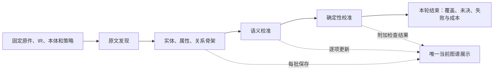

# 图谱分析四阶段顺序重构方案

日期：2026-10-02。状态：工程实现、隔离回归及专用 PostgreSQL 验收已完成；真实模型质量验收和部署尚未完成。
实际验证记录见 [validation-four-stages.md](../specs/035-independent-document-harness/validation-four-stages.md)。
下文第 2 节保留设计时基线，第 14 节说明原文档交付范围。

需求与验收：[035 spec](../specs/035-independent-document-harness/spec.md)。接口契约：
[four-stages.md](../specs/035-independent-document-harness/contracts/four-stages.md)。
任务与验证入口：[tasks](../specs/035-independent-document-harness/tasks.md)、
[quickstart](../specs/035-independent-document-harness/quickstart.md)。

## 1. 目标、范围与固定决定

将独立文档 Harness 的业务处理顺序替换为：

**原文发现 → 实体、属性、关系骨架 → 语义校准 → 确定性校准。**

直接目标是先得到带原文证据、可展示的候选图谱，再消解局部和跨段歧义；
编号分组、共指、单位换算和 SHACL 不再成为生成全篇属性与关系的前置条件。

固定决定如下，编码不再自行选择另一套流程：

1. 四阶段是运行的业务阶段；上传、解析为准备工作，`done` 为结束标记。
2. 复用当前 `DocumentIR`、冻结本体、分区当前状态、唯一展示缓存、调用账本和暂停/继续。
   不新增历史图副本、执行快照、数据库表、任务中间件或自动恢复平台。
3. 原文提及仍是权威实体端点；共指只产生有证据的身份决定和展示投影。
   局部成员细分可改变当前端点，但不能将同号、同名或图连通当作合并证据。
4. 原文发现沿用最多两个模型请求并行，后面三个阶段首版串行；不扩张既有候选配额。
5. 骨架阶段保存候选，不提前宣布事实成立；语义核对与确定性表示检查分别报告。
6. 局部语义未决不阻断无关项。完整模型回答中的局部逻辑错误保存为该项处理失败，
   其他项继续处理；技术失败不能改写成“证据不足”或成功。
7. 仅面向新建运行，直接替换执行契约。旧运行不转换、不补跑、不删除，旧结果不作为新流程验收输入。
8. 本次只重构图谱分析。保留已有人工解释入口及权限，不自动提交业务事实，不修改权威 TTL。

Constitution Check（设计前/后）：在既有 035 内修订需求、澄清、计划、契约和任务后再编码；
不写 T-Box，不增加外网或第三方依赖。SHACL 使用已有 `shacl` extra 中锁定的 pySHACL 0.31.0；
共享纯工具时保留独立 Harness 与旧识别协议的依赖边界。无需宪章豁免。

## 2. 已核验的基线与需要替换的门槛

以下是写作时源码事实，不能当作目标已经实现：

| 源码落点 | 当前行为 | 本次目标 |
|---|---|---|
| `controller.Engine.run()` | `reading → entities → coreference → graph → done` | 四业务阶段；骨架先于所有深入核对 |
| `type_alignment()/advance()` | 类型对齐后进入编号指称核对，再实体核验 | 类型提议服务骨架；编号和实体核验进入语义阶段 |
| `work_execution.plan_graph_work()` | 全局共指处理后才规划属性和关系；未采信主体的属性 waiting | 候选主体即可建骨架；最终采信门槛只用于语义核对 |
| `observations.value_components()` | `confirmed=False` 不提供范围端点 | 原值保存不依赖采信；端点选择与数值规范化分阶段 |
| `referents.run_referent_alignment()` | 完整性异常可抛至运行层 | 局部任务保存失败，保留骨架，隔离到受影响端点 |
| `coreference.project_coreferences()` | 保留原始提及、断言端点，再投影合并 | 继续复用；展示不能凭合并代替事实证明 |
| `evidence_gate.precheck_assertion()` | 来源、结构、本体、规则证明、语义核对混合分流 | 拆出即时结构检查、语义准入与后置确定性检查 |
| `projection/accounting` | 当前实体、断言、work、成本增量计数及最新缓存 | 增加四阶段进度和检查结果，保留差量更新 |
| `schemas.document_harness` / 前端 | `predicate_iri` 的可空规则不一致；phase 是旧顺序 | 同步可空候选谓词、四阶段、检查结果和语义时间次序 |

服务域标识 `application.ENGINE` 和公开 `HarnessGraph.protocol` 当前均为 `document-harness-v2`；
模型消息协议 `protocols.PROTOCOL` 当前为 `document-harness-v6`，两者用途不同。
本次保留服务域标识，模型消息协议递增为 `document-harness-v7`，
`execution_policy.flow` 由 `local_reading` 替换为 `four_stage`。
`require_current_flow()` 只接受新协议和新 flow，不建立协议转换器。
创建时命中旧 request_key、读取旧 graph 缓存或继续旧运行，都在公开 schema 解码前返回
HARNESS_NEW_RUN_REQUIRED（409），不把缺少新字段的旧缓存返回成 500。
原件和历史记录保留，旧 flow 的拒绝不删除业务数据；新建分析使用新 request_key。

此前调查运行 `9292d88c-9242-438e-a22a-02d856b07877` 的已保存快照显示：
1661 个实体含根、737 条关系线索、0 属性、0 关系、0 关系组；
在编号分组阶段因 `partition_omits_group_mention` 失败。
该结果仅用于说明需要消除的阻断模式，不把它改造成新流程恢复任务。

源码依据：
[controller](../backend/app/services/document_harness/controller.py)、
[work_execution](../backend/app/services/document_harness/work_execution.py)、
[referents](../backend/app/services/document_harness/referents.py)、
[observations](../backend/app/services/document_harness/observations.py)、
[evidence_gate](../backend/app/services/document_harness/evidence_gate.py)、
[公开 schema](../backend/app/schemas/document_harness.py)。

## 3. 四阶段目标与不可跨越的边界



| 阶段 / `phase` | 目标与允许操作 | 输入 | 输出 | 禁止的前置要求 |
|---|---|---|---|---|
| 原文发现 / `discovery` | 找到物理提及、完整原字段、关系表达、引用线索；保存否定、条件及时间表达 | 当前窗口原文、必要原文上下文、冻结阅读指引 | entities、fields、hints、reference_cues、窗口覆盖 | 不要求确认类型、拆编号、合并身份、单位换算或 SHACL |
| 图谱骨架 / `skeleton` | 将原文字段与线索物化为候选属性/关系，并提出合法类型和谓词 | 全部已保存提及与原字段；局部线索；冻结本体卡 | 可展示的候选实体、属性、关系和完整对象组；待定项有原文和原因 | 不要求实体 accepted、共指完成、编号分组完成或数值规范化 |
| 语义校准 / `semantic` | 判断原文指称与类型、编号归属、共指、属性归属、关系方向、极性、条件、参与和时间 | 候选骨架、相关原文及本体定义；已有有界来源反馈 | 有证据的 accepted/rejected/unresolved；共指决定；必要局部端点细分 | 不以编号相同、SHACL 通过或图连通证明事实 |
| 确定性校准 / `deterministic` | 对已确定语义执行编号表示/键检查、类型表示检查、单位换算和固定 SHACL 表示检查 | 当前语义结果、原值与精确值证据、冻结表示约束 | 各检查结论、规范值、换算结果或明确不可规范化原因 | 不调用模型，不猜单位、身份或顺序，不用检查失败改写原文事实 |

即时基础检查贯穿四阶段：JSON 结构、局部 ID 范围、来源权限、引文逐字定位、引用端点存在、
所选 IRI 在冻结目录内。这些是保存合法候选的条件，不是深入语义核验。
本体 domain/range 在骨架阶段只基于候选类型筛选菜单；候选类型未确认时不能据此删除原文线索。
类型的真实成立和谓词在实际端点上的适用性在语义阶段核对。

每个阶段“收束”表示在当前原文、策略和预算下已处理所有可执行工作，
不是所有候选均通过、原文已穷尽或图谱已连通。

## 4. 当前数据、ID 与状态契约

### 4.1 沿用的存储分区

沿用 `harness:input/windows/window_entities/entities/fields/hints/reference_cues/work/
type_work/referent_work/coreferences/observations/cursor/metrics/display`。
`type_work`、`referent_work` 是当前任务中间结果，付费输入/输出仍独立在现有 requests/results 账本；
不将账本重新塞进权威业务状态。确定性结果直接存入所属实体或断言行的 `calibration`，不增加第二份图。

| 对象 | 新增或改变的最小字段 | 含义 |
|---|---|---|
| entities | `parent_mention_id: str|null`；`refined_member_ids: list[str]`；`verification`；`calibration` | 默认 parent=null、members=[]；局部细分引用、独立语义结果和表示检查 |
| properties | `predicate_iri: str|null`；`source_unit_evidence: refs[]`；`verification`；`calibration` | 空谓词表示未完成对齐；单位证据独立于原值证据 |
| relations | `predicate_iri: str|null`；`verification`；`calibration` | 空谓词候选可展示但不能采信 |
| relation_groups | 同 relations；`ordered_object_ids: list[str]|null` | 成员集合与获证的执行顺序分别保存 |
| work | `phase`；`retryable: bool` | 骨架、语义、确定性任务隔离；局部技术失败的继续边界 |
| windows | `skeleton_step` 替换 `entity_phase` | `type_alignment/property_alignment/relation_alignment/done` |

`verification` 沿用 method、semantic_verdict、dependency_hash 等既有字段；实体也使用该结构。
`source_verdict` 如作为最终状态门控所需的原文判断可保留，但不得再复制一份完整语义结果对象。
`calibration` 的固定结构见第 8 节。
校准尚未执行或依赖变化时 calibration=null；确定性任务执行后以本次 input_hash 写回整个小型结果。

候选属性/关系没有对齐 IRI 时 `predicate_iri=null`，`label` 保留原字段或关系表达，
`reason` 说明待对齐原因。禁止为占位生成虚构 IRI。无法确定任何候选主体的原字段仍在 observations，
不得默认挂到文档根；需要对象尚未发现的引用仍在 reference_cues，不能创建虚构端点。

### 4.2 稳定 ID 与单一权威状态

1. 物理提及和字段 ID 沿用原文定位及角色构成的 identity；同文不同位置不按值去重。
2. 骨架候选属性 ID 基于提及、field_id、组件及首次映射槽位；关系 ID 基于来源线索、
   原提及端点及首次映射槽位。首次尚未映射的槽位用固定内部标记 `unmapped`，它不是本体 IRI。
3. 后续给同一候选补入谓词或改变校准状态时保持 ID；同一原文确有多种属性/关系候选时各有稳定槽位。
   不用规范化数值、置信度、批次名、阶段或窗口改名生成新的断言身份。
4. 合法成员细分创建新提及 ID（parent、分组选择、member 原位置），并写入原提及的 refined_member_ids。
   原提及保留原文和细分引用，状态 unresolved、reason=`refined_into_members`，
   退出后续身份核对；默认图中显示为可展开的原提及说明，而非重复实体事实。
5. 不保存骨架/语义/规范图三个全量对象。当前实体/断言行原位更新，display 只缓存最新公开投影。

阶段是执行分类，不是候选状态。`state` 沿用 candidate/accepted/rejected/unresolved：

- discovery/skeleton 的新业务候选只能是 candidate；用户选择的文档根例外。
- semantic 的逐项核对决定 accepted/rejected/unresolved；未知或遗漏不变成否定事实。
- deterministic 不仅凭 SHACL、数字或编号比较改变 semantic 的结论。
- 规范值只在相应确定性检查通过后可用于数值展示/消费；否则保留原值和检查问题。

`fact_count` 继续表示非根实体与断言的语义采信数量，不表示确定性检查全部通过。
UI 明示这一口径；calibration 检查计数独立统计。

### 4.3 断言依赖与失效

复用 `WorkIndex.affected()` 和 dependency_hash。Work ID 增加 phase 维度，
防止骨架已处理的 alignment 任务挡住语义阶段必要的局部重对齐。
同阶段、同输入、同依赖仍复用当前工作和已付费回答。

语义指纹包含原提及/实际端点、候选类型、field_id/值引用、谓词、成员及参与/时间/条件，
不含“已采信”布尔量和展示 canonical ID。仅实体采信状态改变时可重做门控，不能重复模型证明。
确定性指纹只包含实际语义结果、原值/单位证据、datatype、冻结单位声明、检查策略及工具版本。

端点细分、归属、谓词、条件或成员语义变化时：

1. 在同一业务提交中更新当前行，清除受影响断言的 verification/calibration，置回 candidate。
2. 只创建受影响项的 semantic alignment/review；完成后进入 deterministic。
3. 共指只改变展示 ID 时不复制/迁移原始断言，不触发整图重识别。
4. 本轮不返回全文发现，也不通过反复阶段循环耗尽所有弱候选。

## 5. 阶段一：原文发现

### 5.1 输入和输出

复用 `reading.decode_local_discovery()/merge_local_discovery()`、`Discovery` 和当前 draft/query/refine 续步。
输入为固定主区间、必要原文标题/表头上下文、根卡和召回阅读卡；不读取其他窗口的动态图谱。

输出必须保存：提及位置与角色、完整原值和精确值引用、候选字段归属、原文关系表达、
指代/跨段引用，以及否定、条件、顺序/同时/选项的原文线索。
时间线索通过带原文依据的 relation_hints/reference_cues 保存，
不在该阶段生成“紧邻下一步”或并行的最终结论。

现有一次有界本地查询可继续作为发现召回；结果不证明身份。
本阶段禁止启动 referent_candidates/selection、entity_review、coreference_review、数值规范化和 SHACL。
模型不要求把每个斜杠编号细分成多个物理设备；难以划分时保存完整可定位提及和原字段。

### 5.2 转出与失败

叶窗口均已保存为 complete/incomplete，且无在途、待应用或未处理技术失败时进入 skeleton。
阅读未完整仍沿用 processed/complete 字符覆盖及 stop_reason，不把它改成全文完成。
原文字段/引文错位保留现有观察与有界拆分规则；技术传输失败仍按现有重试上限执行并真实失败。

## 6. 阶段二：实体、属性、关系骨架

### 6.1 先物化，再对齐

进入本阶段先将所有有候选主体的原字段和已有真实端点的显式关系线索物化为草案：

```text
materialize_skeleton(state, catalog, delta) -> Changes
  提及已存在 + 有非缺失原字段 -> predicate=null 的 property 草案
  两端已存在 + 有可定位关系表达 -> predicate=null 的 relation/group 草案
  仅共现/同名/类型兼容 -> 不建关系
```

立即提交并更新唯一 display；这一步不调用模型、不合并提及、不做单位或编号解释。
对已有关系组保留完整对象集合，不能为尽早展示而展开为每个成员均成立的肯定边。

随后按窗口归属顺序执行：类型提议 → 该窗口属性谓词对齐 → 关系谓词对齐。
一个窗口的对齐结果提交后才处理下一个窗口；不等待全部提及被核验。
最后做一次跨窗口显式引用的候选补全，消费完整提及索引；本步骤只解析候选目标，不决定共指。

### 6.2 编码规则

- `type_alignment()` 保留目录分片、联合候选比较、完整原文和类型输入 hash；
  去掉内部对 referent_alignment/entity_review 的推进，调用方负责 skeleton_step。
- `plan_graph_work()` 拆为 `materialize_skeleton()` 和 `plan_skeleton_work(delta)`，
  后者仅规划 property_alignment/relation_alignment，不附带证据核对任务。
- `align_properties()` 移除“主体必须 accepted”、validate_bound_property 和数值换算的前置门槛。
  当前候选类型有合法属性菜单即可提出候选；无类型/无匹配菜单时保留 null 谓词草案。
- `align_relations()` 允许候选端点进入有原文依据的工作，原文线索 protected 及弱配额沿用。
  类型不明确时只按明确关系表达召回冻结目录的谓词，不枚举所有实体和所有谓词。
- 骨架写入后不调用 `review_for()`，不产生 evidence_review/group_interpretation/coreference_review。
  模型提议的 polarity/conditions/participation/timing 仅为待核对值。
- `property_value()` 改为只选精确原文字段内 whole/span/lower/upper 片段。
  lower/upper 在此仅代表候选角色：保存完整原字段和相应精确子片段；
  不依赖 accepted、不换算、不用 float 重写原串。无无歧义端点定位时只保留 whole/null 候选和理由。
- `PropertyMapping` 增加必填可空 `unit_quote: Quote|null`，仅提出来自原值/表头/明确单位字段的单位引用；
  程序定位后保存原文 source_unit/source_unit_evidence，骨架阶段不确认其归属。
  没有单位依据时 null，禁止抄 canonicalUnit 作为来源单位。
- 未识别谓词、不合法类型提议保留观察或 null 草案，不丢失原字段/原线索；
  已确认是模板噪声的结论属于 semantic，不由 skeleton 擅自拒绝实体。

### 6.3 时间与文档根

原文明示的“下一步”可提出本体中已存在的 `nextStep` 候选；
一般“先于”只能提出当前合法的对应谓词，不能自动升级为“紧邻下一步”。
谓词来自冻结卡，不将实例样例或具体设备编号写入通用提示词。

骨架不按上传文档归属、图连通需求或章节邻接补造根边。
根路径不是关系成立或骨架阶段完成的条件；“未连接”必须附当前阶段及校准进度解释。

## 7. 阶段三：语义校准

### 7.1 固定子步骤

阶段内按以下顺序收束，复用现有处理函数而非另建全图核对协议：

| `semantic_step` | 工作 | 转出条件 |
|---|---|---|
| `referents` | 按本体身份属性及实际原文核对局部编号边界、单/多对象、编号归属；必要局部细分 | 每组处理过或明确未决/失败；无在途 |
| `entities` | 核对所有当前提及的存在、指称角色与候选类型；含新细分成员 | 每项有独立结论或明确失败 |
| `coreference` | 解析已保存引用；核对跨窗口简称/别名/作用域编号/指代 | 原文支持的有界候选已处理 |
| `assertions` | 处理局部重绑定后的必要属性/关系对齐、对象组解释、独立证据核对及时间核对 | 无可执行语义任务；未决、剪枝及失败显式保留 |

原文已有清楚单位、数量或编号含义时作为语义输入直接阅读，不先要求确定性工具通过。
属性证据核对输入包含 unit_quote 所指原文和完整值/表头上下文；
accepted 判断必须核对单位归属，未获证单位不能传给确定性换算。
语义阶段无需等待所有实体 accepted 才创建/处理无关断言；仅最终采信某条断言时核对其实际端点。
实体无合法类型时仍保留真实提及；该类型依赖的断言最终 unresolved，不能为使图连通强选类型。

### 7.2 编号分组及局部失败

`run_referent_alignment()` 改为按单个 task_id 应用；控制器循环各组，不让一组异常抛断全篇。
优先用每处提及及字段的局部原文生成组，不把整段所有同号提及强行装成一组。
多次编号出现的发生位置保持独立，后续是否同设备由共指判断。

现有 ReferentCandidates.expressions 固定最多 12、partition.members 固定最多 6；
这些容量不能作为真实提及数量的语义上限。stage_schema 按本次 identifier_span_ids 数量
为 expressions、members、member.expression_ids 生成有界上限，完整备选方案仍最多 4 个。
没有编号片段时 expressions/partitions 仅允许空数组，仍可按既有一次扩展申请新原文片段；
扩展后用新目录重建 Schema。静态 Pydantic 消息也须与生成上限一致，不能 Schema 允许 13 项而解码仍拒绝第 7 项。
逐组检查完整输入及输出预算；可分开的独立原文组按物理位置分别处理，
不可再分的真实歧义组超预算时局部 failed/retryable=false，reason=referent_group_budget_exceeded。
不能截断片段/成员或要求每个方案只覆盖部分输入以便塞进固定容量。

语义协议输出完整方案；程序验证引文、表达归属、成员不重叠及每个方案的覆盖。
覆盖检查必须与原文引用检查分开：`references_cover()` 继续严格检查原文区间，
但不能要求两个独立编号把中间斜杠/分隔符也作为各自编号的一部分引用。
`validate_partitions()` 的待覆盖原子片段取本次 expressions 中不再包含其它更小编号表达的最小区间，
而不是当前实现取的最外层区间。对每个 partition 检查各原子片段被其成员表达覆盖：
整体编号可以覆盖内部原子片段，独立编号方案也可逐个覆盖；遗漏任一发生位置仍不通过。
同时检查输入各待分组提及与成员表达的位置对应，不能通过先删掉 expressions 中的一次提及绕过完整性。
全部来源/跨度/属性仍按冻结目录和原文核对，不能为通过分组而放宽精确引文要求。
已有 `new_spans` 扩展最多一次；有效 JSON 分组发生覆盖遗漏或成员重叠时，
允许一次带具体遗漏位置/冲突片段的修正，复用现有 proposal_feedback；不按同号替模型补成员。

修正次数是当前任务状态的一部分，暂停继续不重置。
首次非法方案从当前 proposal 移出到 correction feedback，付费原答仍独立留在账本。
允许局部修正的原因码固定为：`partition_omits_group_mention`、
`overlapping_members_in_same_partition`、`expression_assigned_to_multiple_members`。
其他局部成员协议检查错误直接按局部失败处理，不扩大自动纠错范围。

次数用尽仍非法：该任务 `failed/retryable=false`，保留 reason_code、定位及原骨架；
受影响提及/断言 unresolved 并指出依赖该失败；继续处理其他分组、语义任务和确定性任务。
本轮结束统一报告局部处理失败，不把 malformed 输出当成正常语义未决。
模型完整输出中 verdict=unresolved 是正常未决，不属于技术失败。
其它候选属性/关系的完整回答出现局部越界引用或结构矛盾时同样隔离到对应 work；
无有效候选的原字段/原线索继续可见。不对这些错误新增自动修正调用。

### 7.3 成员细分后的当前图谱更新

扩展 `rebind_clues()` 为 `rebind_current_claims(state, replacements) -> Changes`，
在一个业务提交中更新 entities、window_entities、hints、reference_cues、properties、
relations、relation_groups 和受影响 work：

1. 单一明确替换：更新端点，保留字段/线索/候选 ID 和原证据，清除证明及 calibration，排入语义核对。
2. 一个属性主体细分为多个成员：不向所有成员复制属性；原断言保留为 unresolved，
   在观察中列候选成员。只有原文证明字段归属时，才产生相应成员的属性候选。
3. 关系对象可定位为完整组：生成或更新完整 relation_group，participation=unknown，
   通过独立核对判断 all/options/unknown 及 exactly_one；不能把斜杠直接解释成同时/任选。
4. 关系主体变为多个成员且缺少归属证据：原关系 unresolved、reason=ambiguous_subject_members，
   保留原端点和原文，不为每个成员复制肯定关系。
5. 被替代的粗提及仍能从新成员访问原文说明；默认展示以成员为准，原始未决断言仍可查看。

受影响候选变更后只做一次当前语义输入下必要的对齐/核对；
既有相同依赖的付费回答继续复用，不重跑整篇 skeleton。

### 7.4 共指、顺序与并行

共指复用 `candidate_pairs()/review_coreferences()/canonical_mentions()` 的原文证明和一致组规则。
不以相同编号跨作用域硬合并，不推定传递链全部成立；所有候选来自明确线索，禁止全文两两组合。
源记录命中只是来源候选，不自动变成跨文档全局身份。

顺序候选和并行候选必须独立核对：

- `nextStep` 需要原文支持紧邻后继；仅“后来”或一般先后不证明中间没有步骤。
- 列表、表格行号、文档段落顺序只作定位依据，不单独证明工艺先后。
- 关系组 timing=sequential 必须带 `ordered_object_ids`，与 object_ids 构成同一无重复集合，
  并有对应次序原文；排序 ID 不代表顺序。
- timing=parallel 需要同时发生依据；“两台设备”、斜杠或 all 不自动证明并行。
- options 与时间语义分开：参与未知或任选时不生成多个同时执行事实。
- participation、selection、timing、ordered_object_ids 改变后相关证明失效。
- 原文明确的否定/条件可以被采信为相应限定事实，但不成为无条件肯定根路径。

`GroupInterpretation`、`RelationProposal` 和公开 relation_group 同步增加 ordered_object_ids、order_evidence；
模型 order_evidence 为精确 Quote 数组，公开结果为 HarnessSourceRef 数组；
仅 sequential 要求非空，parallel/unspecified 必须为 null。
Schema 与本地集合检查共同约束；增加原文顺序引用，不用模型置信度代替证明。

### 7.5 采信门控

`evidence_gate` 拆为三个明确入口：

```python
check_candidate_structure(ir, catalog, state, row) -> CheckResult
route_semantic_review(ir, catalog, state, row, policy) -> ReviewRoute
semantic_acceptance(state, row, verdict) -> CandidateState
```

基础检查只负责来源/结构/IRI 存在；semantic 路由保留冻结表格契约的完整规则证明，
否则走独立模型核对。未映射谓词、端点被拒绝/未决、对象组参与未定、缺少决定性原文，
均不能采信为完整关系。覆盖不足不构成否定。
确定性 datatype/规范单位/SHACL 不参与 route_semantic_review 的准入条件。
实体确认状态变化仅重做 semantic_acceptance；实际语义依赖变化才重做付费证明。

## 8. 阶段四：确定性校准

### 8.1 检查结果契约

新增纯模块 `document_harness/deterministic.py`，不访问模型、来源数据库或业务 Session。
当前行的 calibration 结构如下：

```text
Calibration
  input_hash: str
  checks:
    identifier: CheckResult
    datatype: CheckResult
    unit: CheckResult
    shacl: CheckResult
  literal: LiteralValue | null

CheckResult
  status: not_run | passed | invalid | incomplete | not_applicable | error
  reason_code: str | null
  details: object
```

全部检查键必填，无适用规则时 not_applicable，尚未处理时 not_run。
invalid 表示实际表示检查不通过；incomplete 表示输入不足/适用声明未决；
error 表示工具执行失败，与原文否定无关。
不再增加 total_verdict 或第二套复合候选状态；由 checks 可计算是否有可用规范值。

每个实体/断言都得到 calibration 行：语义未决/未采信项的适用检查 incomplete（semantic_not_supported），
不相关检查 not_applicable；不得显示为已通过。
有独立确定性输入的检查可以生成问题说明，但不生成可消费规范事实。

### 8.2 编号与键

只检查已由语义阶段确定的标识表达：原串逐字一致、绑定属性是否为冻结身份属性、
已声明键组组件是否齐全、已证明作用域/命名空间是否可用。
格式只按已存在且冻结的明确声明检查；没有格式规则返回 not_applicable，禁止根据设备样例编正则。
只比较本次已保存、获证绑定或已保存来源反馈，不在该阶段重新做全库枚举查询。

缺少键组件/作用域为 incomplete；原值错位或明确格式不符为 invalid；
这些结论不推定同一/不同设备，不改写共指，不撤销获原文支持的实体存在。
检查针对实际提出并绑定的标识或身份键声明；只有类上存在 identityKey、正文没有标识值时，
不要求每个对象补编号，该对象 identifier=not_applicable。

### 8.3 数值与单位

复用 `extraction.literal_normalizer.normalize_literal()`、canonical_unit、unit_definition 和 LiteralValue。
输入是该属性获证的完整原值、组件的精确引用、datatype、source_unit 和单位引用。
不读取 LLM 自报的规范数值作为输入，不修改 source_value/value_evidence。

冻结本体目录为 PropertyCard 增加 `canonical_unit: str|null`，
准确读取已有 integration `canonicalUnit` 注解；当前权威 TTL 未声明 unitRequired，
本方案不新增这类注解或擅自推导业务单位必填义务。
单一有效声明使用，多声明冲突在 card.diagnostics 标明并令相应检查 incomplete，不挑一个值。
模型菜单可以看见原有声明，但标准单位不能证明原文数值已经使用该单位。

单位输入取值顺序：原值自带可解析单位；否则使用语义阶段确认且精确引用的单位。
单位直接包含于完整原值时，原值精确引用即覆盖其来源；不要求模型为同一后缀另付费核对。
使用独立表头/字段单位时必须有 source_unit_evidence 且语义核对通过。
原值与独立单位声明冲突为 invalid；禁止直接把 canonical_unit 当 source_unit。
有 canonical_unit 则转换到该单位，无声明则只做原单位的规范表示。

```python
normalize_literal(raw, datatype=datatype_iri,
                  source_unit=source_unit, target_unit=card.canonical_unit)
```

上下界与比较符保留原始端点角色及开闭性；whole range 不能强行压成单值。
lower/upper 组件使用完整原范围核对后选出的原文片段和获证单位，
转换记录明确 factor/offset；摄氏/K 使用已有偏移实现。
未知单位、缺单位、维度不相容、非精确换算、unsupported datatype/range 如实报告，
不得补单位或用 float 近似使测试通过。多个未确定 datatype 为 incomplete，不能擅选数字类型。

calibration.literal 保存现有 LiteralValue 的 raw_value、normalized_value/lower/upper、operator、
raw_unit/canonical_unit、dimension、conversion_record；公开 property.value 保留语义阶段的原文取值。
前端明确显示“原值”和“规范值”，数值计算只能消费通过适用检查的 literal。
本期不新增业务报告计算或自动事实提交入口。

检查状态的确定映射如下，禁止把不支持的输入当作正常通过：

| 情况 | datatype / unit / shacl 处理 |
|---|---|
| 多个未确定 datatype、单位来源缺失但要求转换 | 对应检查 incomplete；literal=null |
| normalizer 报 unsupported datatype / numeric grammar / unit_unknown / 不精确换算 | 对应检查 incomplete，保留原异常原因；literal=null |
| 明确词法不符合已确定类型、原单位冲突、维度不相容、范围倒置 | 对应检查 invalid；literal=null |
| 已有归一化结果、未声明单位且原值不带单位 | unit=not_applicable；禁止从字段名称猜单位 |
| text/boolean/date 等已支持非数值类型 | datatype 按现有 normalizer 检查，unit/shacl=not_applicable；保留相应 LiteralValue |
| 已规范化 number/range/comparator | 固定字面量 SHACL 必须执行；其结果映射按第 8.4 节 |

非预期执行异常为 error；任何失败分支不输出可用 normalized_value。
规范值消费条件固定为：语义 accepted、datatype=passed、unit=passed/not_applicable、
shacl=passed/not_applicable，且 literal 非空；identifier 只约束实际标识，不作为所有数值的额外门槛。

### 8.4 SHACL 的具体范围与共享工具边界

本期 SHACL 是固定的**候选字面量表示检查**，复用既有工具的范围理念；
不建设用户上传 shapes、全本体自动生成 shapes、业务合规判定或全图审计平台。
固定 profile `harness-literal-representation/1` 覆盖 scalar/range/comparator 的必要表示字段，
参数仅来自已冻结 datatype、明确单位声明和当前语义确定的组件形式。
每个 claim 使用自己的 focus node；不得凭数据图没有目标而宣称检查通过。

`tool_validation/shacl.py` 直接依赖旧 ontology_guided 的 SlotSpec 等类型，
Harness 不导入该模块，也不把独立卡转换成旧执行契约。
新增共享纯入口 `extraction/shacl_core.py`，仅接受 RDFLib Graph 和 expected_focus_nodes，
返回中立 dict；将既有 pySHACL 执行/报告解析/目标覆盖部分抽到此处，
旧工具包装器与 Harness 各自构造本域 shapes，再调用共享入口。

入口固定为：

```python
run_local_shacl(data_graph, shapes_graph, *, expected_focus_nodes) -> dict
```

中立返回结构固定为：execution_status（completed/failed）、evaluated、conforms（bool|null）、
report（原约束报告行）、report_text、coverage（expected_focus_nodes、actual_focus_nodes、complete）、issues。
正常不符合是 completed/conforms=false；ValidationFailure/执行异常为 failed/evaluated=false。
旧包装器继续自行派生既有 profile、validation_status、executed_shapes 和 missing-fields 口径，
复用执行入口不能改变其旧公开返回结构。

Harness 的 `build_literal_shapes(card, literal)` 构造固定表示 shapes；
profile 必须明示 scalar/range/comparator 字段分支，不能用业务必填属性替代表达字段。
minCount 是本次 claim 表示字段完整性要求，不推导本体上的业务必填义务；
不因没有 object/property 便认为正文证明“不存在”。

共享执行入口只收内存 Graph，不收 URL/远程导入：

```python
conforms, report_graph, report_text = validate(
    data_graph, shacl_graph=shapes_graph,
    inference="none", advanced=False, js=False, inplace=False,
    do_owl_imports=False, meta_shacl=False, abort_on_first=False,
    allow_infos=False, allow_warnings=False,
)
```

results_graph 是 ValidationFailure 或抛出执行异常时，返回 error，不能当作普通不符合。
预期 focus nodes 与实际数据中的 claim 节点独立比较；无预期/少目标/多目标均不能 passed。
共享入口解析两域固定 shapes 实际使用的 targetNode/targetClass；targetClass 沿用显式子类闭包，
不启用推理。actual_focus_nodes 必须既被这些 shapes 选中又在本次数据图中存在。
只有数据中有 claim、shapes 没有目标的情况也必须 incomplete，不能只数 claim 节点。
只有执行成功、覆盖完整、conforms=true 才为 passed；实际形状不符合为 invalid。
工具包未安装或必需执行失败为 error，本轮真实报告确定性阶段技术失败。
不把 optional extra 未安装伪装成 SHACL 已通过；实施环境按后端锁文件准备已有 shacl extra。

技术资料：2026-10-02 通过 Context7 `/rdflib/pyshacl` 查询
[官方 Python 调用说明](https://github.com/RDFLib/pySHACL#python-module-use)和
[ValidationFailure](https://github.com/RDFLib/pySHACL/blob/master/README.md#errors)。
部分部署选项沿用仓库既有 VALIDATION_OPTIONS，官方文档未逐一展开的参数应以安装的 0.31.0 定向测试确认。

### 8.5 完成与语义状态

确定性阶段所有适用项有检查结论且无在途工作后结束。
SHACL invalid、缺单位、不能换算等表示问题保留原文语义采信，阻止使用相应规范值；
不会让其它实体/关系消失，也不会把正向事实改成否定。
工具 error 或遗留局部 failed 导致最终 execution_status=failed，
但已经处理的图谱和其它检查结果仍可查看。正常 unresolved/invalid 则可 finished，
同时明确部分范围/检查问题；不能宣称“全部校准通过”。

## 9. 执行主循环、阶段推进和暂停继续

### 9.1 Cursor

沿用 cursor/main，替换相关字段：

```text
phase: discovery | skeleton | semantic | deterministic | done
stage: 当前细分工作名称
skeleton_window_id: str | null
semantic_step: referents | entities | coreference | assertions | null
semantic_window_id: str | null
planned_steps: list[str]             # 固定阶段/子步骤标记，非执行历史
active_batches: {batch_id: BatchRef} # discovery 上限二，其它阶段一
reading, reading_windows, scope_complete
```

planned_steps 与实际工作在同一提交中保存，避免继续时全量重复规划。
不再使用进程内 `planned=set()` 作为唯一进度依据；已完成任务仍按依赖 hash 增量复用。
windows.skeleton_step 只记录当前处理位置，不另存每次状态快照。

### 9.2 伪代码及转出判据

```python
while not should_stop():
    phase = cursor.phase
    if phase == "discovery":
        read_windows()             # 有界并行；业务提交仍由协调者执行
    elif phase == "skeleton":
        materialize_if_needed()
        advance_skeleton_window()  # 每批输出及时提交，不核验事实
        drain_work(phase="skeleton")
        if skeleton_settled():
            enter_phase("semantic", step="referents")
    elif phase == "semantic":
        plan_semantic_step_if_needed(cursor.semantic_step)
        execute_semantic_step()    # 局部失败落到 task，继续其它项
        if semantic_step_settled():
            enter_next_semantic_step_or_deterministic()
    elif phase == "deterministic":
        plan_deterministic_work_if_needed()
        drain_work(phase="deterministic")  # 纯工具，无 GPT
        if deterministic_settled():
            enter_phase("done")
    else:
        return
```

阶段转出必须同时满足：相应计划已登记、无可执行 ready、无在途/待应用批次、
相应按窗口/组直接执行的任务已收束。waiting/pruned 不伪装成 done；
未来阶段的 ready 不阻断当前阶段，但必须在自身阶段被处理。
无法满足前置条件且本轮不会再变化的项保持 waiting 并列原因，允许当前阶段收束。

`drain_work()` 改为显式 phase 过滤；骨架不偷跑 evidence_review，semantic 不偷跑校准。
已有 property_alignment/relation_alignment 可在 skeleton 和 semantic 中使用，
但只有 semantic 对齐必要的受影响项，且实际采信仍经过 review。

### 9.3 Work 闭合输入

保留旧 kind，增加实体核对、局部分组和两个纯校准 kind：

| kind | phase | 额外准入/输入 |
|---|---|---|
| property_alignment | skeleton / semantic | subject_id、field_id；候选主体即可，语义重对齐仅受影响项 |
| relation_alignment | skeleton / semantic | 现有 seed 结构；依赖真实原文线索，不要求端点 accepted |
| evidence_review | semantic | domain、assertion_id；本阶段独立采信门控 |
| group_interpretation | semantic | group_id；含获证顺序目录与集合检查 |
| coreference_review | semantic | 原提及对及原文身份线索；端点按既有核验门槛 |
| entity_review | semantic | entity_id；仍按原文重叠隔离和预算合批 |
| referent_alignment | semantic | group_id、mention_ids；group_id 指向 referent_work 当前方案/反馈 |
| entity_calibration | deterministic | entity_id |
| assertion_calibration | deterministic | domain、assertion_id |

type_alignment 沿用现有按窗口执行及 type_work 分片结果，由 windows.skeleton_step 记录推进。
entity_review 与 referent_alignment 复用当前按原文合批/按组执行函数，通过既有 WorkItem 登记完成或失败。
referent_work 只保存该组当前方案与反馈，不再用另一套 done/failed 作为权威执行状态。
每次应用回答在同一提交中更新 work、必要 referent_work 和业务行，并移除该批次。
endpoints()/dependencies() 增加 entity_id 和 mention_ids 解析；实体确认状态不加入付费语义指纹。

### 9.4 技术失败分类与继续

| 情况 | 当前项与运行行为 | 继续行为 |
|---|---|---|
| 原文不足/有实质歧义 | verdict unresolved；等待/已处理未决；其它项推进 | 输入未变不重复付费，无新证据不自动循环 |
| 有效回答中的局部分组/映射协议错误 | 项 failed，原因定位，依赖项未决；其它项继续；阶段全部处理后运行 failed | 修正预算未耗尽可用保存反馈；耗尽则 retryable=false，返回明确新建运行提示 |
| 模型传输/完整 JSON 解码失败 | 沿用已有尝试上限；run failed，保留所有已保存回答和骨架 | 按精确 current batch/付费回答继续，不把截断输出当成完整结果 |
| 数据库、租约、内容 hash 等执行异常 | 沿用现有 fencing/失败契约，不伪装成局部语义问题 | 唯一恢复入口；不增加容灾机制 |
| 规范化不支持/SHACL 不符合 | 检查 invalid/incomplete；原文事实保留，其它检查推进 | 没有工具或输入变化不反复执行同一检查 |
| SHACL/确定性工具执行异常 | 检查 error；该任务 failed，可继续无关项；最终 run failed | 同一算法/依赖确定性不可恢复的项 retryable=false，环境可恢复的执行项按现有显式继续处理 |

`Engine.run()` 不再无条件将全部 failed 重置 ready；只处理 retryable=true 的当前失败任务。
done cursor 但存在不可重试的失败时，runtime 统一返回 HARNESS_ITEMS_FAILED、retryable=false。
存在可重试失败时，继续根据失败任务 phase 重入最早必要阶段，
不清空已完成阶段、不重新发现/构建整图；当前输入没变的模型回答仍直接复用。
重入完成后需清除原 error、重新计算最终失败计数，不能仅根据“曾经失败”永久标失败。
`resume_failed_work()` 按 phase 顺序取最早可重试 failed 所属阶段，semantic 再按
referents/entities/coreference/assertions 顺序确定子步骤，将该阶段相关 failed 置 ready。
planned_steps 保留，同依赖 done 不重置；新依赖通过现有失效机制登记新任务并释放相应 waiting。
重新处理后仍按前进顺序收束后续阶段，不绕过确定性结果重核，也不清空骨架。

暂停继续仍只操作一个 cursor 和 active_batches；准备批次、请求、付费回答应用、业务变化和移除该批次
沿用已有事务边界。确定性任务逐项提交，事务中断前未提交的纯计算可以重算，
已提交且 calibration.input_hash 相同的结果不重做。GET 无规划、无计算、无模型任务和业务写入。

## 10. 公开接口与前端展示

不新增路由；复用当前创建运行、harness graph/source、暂停/继续及人工解释接口。
同步公开 schema 与 `frontend/src/lib/api.ts`，具体字段见 four-stages.md。

1. progress.phase 采用 discovery/skeleton/semantic/deterministic/done，
   顶部显示四阶段名称；stage 继续展示当前细分处理，不把 phase 与模型调用名称混成一项。
2. 允许 null 谓词的属性/关系草案；显示“谓词待对齐”、原字段/关系表达和 candidate 状态。
   null 谓词分组键用候选 ID，不能全部塞进同一个 null 分组或产生 undefined IRI 链接。
3. 默认层级仍仅沿非拒绝、正向、无条件关系，candidate 画虚线；
   root reachability 只作展示统计，不作事实质量或验收目标。
   否定、附条件、待定参与关系组在详情/关系图保留，不用实线肯定边替代。
4. 属性详情并列原值、原值/单位原文、规范值、换算因子/偏移和检查结论；
   骨架尚未校准时显示“待语义核对/待确定性检查”，不能显示“规范化成功”。
5. 关系组展示获证对象顺序；不按 object_ids 排序当作工艺顺序。
6. 共指投影保留 subject_mention_id/object_mention_ids；原成员可定位。
   局部细分原提及有明确链接，查看失败项不会丢失原骨架。
7. progress 增加每阶段工作计数和确定性检查计数，模型成本仍按调用 stage 统计；
   deterministic 阶段 GPT calls 必须为零。
8. 收束且有 waiting/pruned/unresolved/invalid 时文案“本轮选定范围已处理，仍有未决/检查问题”；
   有技术 failed/error 时显示处理失败及已保存结果，不展示分析成功。

阶段计数由 accounting 随所属当前行和工作变化增量更新；
不通过每次 GET 扫描全部账本或重建校准结果获得进度。
phase_work_counts 只计持久化 work，discovery 的进度以 reading_windows/reading 为准，
类型分片推进以窗口 skeleton_step 为准；不以某阶段 work 全零宣称阶段已经完成。
每个请求的既有 payload.value 保存 execution_phase，不增加数据库列；
runtime 在更新当前调用计账时读取该字段，metrics.stages 按 phase+stage 聚合，
stage_costs 同时返回 phase/stage，区分骨架对齐与必要语义重对齐的调用费用。
metrics.stages 的 key 固定为 `phase:stage`，value 同时保存 phase、stage 和现有调用统计；
公开数组行 key 采用 phase+stage，不能仍以 stage 单独作 React key。
work_counts 等于 phase_work_counts 的逐项总和；确认状态变更和 calibration=null/已写回的贡献均按前后差量计算。

人工解释沿用既有持久化答案，标识其来源，不能在 GET 中改变事实采信。
若已有写接口会使当前语义输入变更，应清除受影响 calibration、显式提示待重核；
不得隐式启动模型或把人工答案当作模型证据。无相应执行授权时保持既有入口范围。

## 11. 文件、函数与实现归属

下表保留设计时的修改/新增落点；实际实施文件与验证结果见
[实施验证记录](../specs/035-independent-document-harness/validation-four-stages.md)。

| 文件 | 具体编码动作 |
|---|---|
| `document_harness/controller.py` | 四阶段主循环；skeleton_window_id、semantic_step；拆除旧 advance 链；阶段就绪/收束函数 |
| `document_harness/reading.py` | 保存原文时间/参与线索；放宽发现时必须拆编号的要求；保留精确主区间和窗口合并 |
| `document_harness/planning.py` | materialize_skeleton/plan_skeleton_work；候选类型菜单；原文有界引用解析；保留剪枝保护 |
| `document_harness/work.py` | WorkItem.phase/retryable、新纯校准 kind、phase-aware work_id、闭合输入及相关依赖 |
| `document_harness/work_execution.py` | phase 过滤；alignment 只生成骨架/当前受影响候选；移除阶段二即时 review/confirmed 门槛；新增校准 handlers |
| `document_harness/referents.py` | 单组处理入口；三类局部修正原因；预算持久化；rebind_current_claims 处理当前断言与局部失败 |
| `document_harness/coreference.py` | 进入 semantic 的显式阶段；保留原文证明/一致组投影；细分原提及处理 |
| `document_harness/evidence_gate.py` | 基础结构检查、semantic 路由和 acceptance 分离；不含单位/SHACL 门槛 |
| `document_harness/observations.py` | 原字段/whole/span/端点片段选择不依赖 accepted；禁止提前浮点规范化 |
| `document_harness/protocols.py` | PROTOCOL=v7；动态编号容量；PropertyMapping.unit_quote；时间成员顺序/证据；提示、Schema 和解码一致 |
| `document_harness/ontology.py` | 读取既有 canonicalUnit，冻结 canonical_unit；矛盾声明保留未决；合法谓词范围不变 |
| `document_harness/deterministic.py`（新增） | 编号/键检查、LiteralValue 规范化、固定字面量 shapes、校准结果及指纹；纯逻辑 |
| `extraction/shacl_core.py`（新增） | 抽取共享 pySHACL Graph 执行、报告与 focus coverage；不依赖旧业务模型 |
| `extraction/tool_validation/shacl.py` | 旧包装器改用共享执行入口；保持其现有 profile、返回值与测试，不让本次改动扩成旧引擎重构 |
| `document_harness/application.py/model.py/runtime.py` | four_stage 默认策略、旧 flow 拒绝、phase batch 上限、局部失败最终状态、显式继续及原子计账 |
| `document_harness/accounting.py/projection.py` | 逐阶段/校准差量计数；null 草案、细分说明、序列和校准结果；GET 仅最新缓存 |
| `schemas/document_harness.py` | 四阶段公开 enum、可空谓词、校准结构、序列、phase 计数；服务域标识仍 v2 |
| `frontend/src/lib/api.ts/source-harness.ts` | 对齐公开类型、阶段中文名、null 分组及完成文案 |
| `source-harness-panel/workspace/relation-graph/shared.tsx` | 早期骨架、失败保留、四阶段进度、单位/检查详情及获证顺序 |
| 已有 Harness 测试及新增用例 | 按第 12 节验证公开行为；不放宽原文/范围/共指反例 |

只有 JSON 当前状态与公开契约变化，不新增 ORM 字段，预期不需要 Alembic migration。
实施若发现必须变更数据库结构，先修订计划并按真实结构提供迁移，不把 JSON 方案默认为无迁移结论。

## 12. 可执行验收清单

下表测试名为设计时拟定的新增/扩展落点；实际用例归属和执行结果见实施验证记录，
不能仅凭本节清单宣称相应验证已运行。

| 编号 | 场景与必须断言的行为 | 主要测试落点 |
|---|---|---|
| FS01 | 四阶段调用记录严格按目标顺序；骨架已有节点/属性/边时 referent/coreference/evidence 尚未调用 | `test_four_stage_flow.py`（新增） |
| FS02 | 主体 candidate、类型未定或编号歧义：原字段及显式关系以 null 或合法候选谓词保存可见；不得自动采信 | `test_skeleton.py`（新增） |
| FS03 | 1000 个只有共现/同名/类型兼容的实体不新增关系或共指模型配对；显式线索不受弱配额删除 | 现有 planning/pruning 测试 |
| FS04 | 一组反复编号方案遗漏最后位置，修正仍不合法；无关段落关系继续核对，原骨架可看，最终真实失败 | partition_correction + 新流程测试 |
| FS05 | 整串/两个独立编号方案均可覆盖真实成员，分隔符不被强塞进编号；七处编号/十三成员完整组不被固定六成员上限截断；超预算局部失败；暂停不重置纠错次数 | grouped_alignment/referent_decision |
| FS06 | 一个主体拆成两成员，不能复制数量/设备使用事实；受影响证明/校准清除、无关证明不重做 | `test_semantic_rebinding.py`（新增） |
| FS07 | 跨段简称与获证作用域编号共指正例；同名异批、作用域未知、来源库同号、传递矛盾不强并 | 现有 coreference/runtime |
| FS08 | 表格行顺序不证明 nextStep；一般先于不证明紧邻；同时/任选/顺序分别核对 | `test_temporal_semantics.py`（新增） |
| FS09 | sequential 必须有完整无重复 ordered_object_ids 和顺序原文；随机 ID/回答顺序不改变工艺顺序 | protocols + temporal tests |
| FS10 | 附条件/否定可保存与采信限定语义，不进入无条件肯定根路径；根未连接不触发补边 | evidence_gate + frontend |
| FS11 | 语义获证的 500 g 在明确 kg 目标下规范值 0.5；原值保持 500 g、factor=0.001；℃/K 保留 offset | `test_deterministic_calibration.py`（新增） |
| FS12 | 缺单位不借 canonicalUnit 补；未知/冲突/维度不相容/不精确换算/范围不合法不产生可用规范值 | calibration + literal_normalizer 现有反例 |
| FS13 | SHACL 不符合不否定已获证关系；无 focus 的 conforms=true 仍 incomplete；异常/缺包为 error | `test_shacl_core.py`（新增）+ 旧 tool_validation |
| FS14 | deterministic 整段 invoke_mock 一次未被调用；GET 无模型、无规划、无业务写入 | calibration + public contract |
| FS15 | 四阶段每个提交/付费回答边界暂停继续，已付费输入不重复发起；纯计算提交前可重算、提交后可复用 | continuation/work_recovery + PostgreSQL |
| FS16 | phase、stage、scope、工作/检查/事实计数一致；技术失败与未决分开；窗口 active 只存在 discovery | accounting/public_v2_contract |
| FS17 | null 谓词和候选边渲染、原提及/成员/规范值联动、阶段成本显示；刷新/切换不启动任务 | 前端 Node + 浏览器 |
| FS18 | 新创建默认 four_stage/v7；旧 flow 不转换，新执行的暂停继续保持鉴权、所有权、fencing | runtime/应用集成 |
| FS19 | Harness 和共享纯 SHACL 入口不依赖旧 ontology_guided、evaluation 或业务持久化模型 | boundaries + 共享工具边界测试 |

专用 PostgreSQL 测试须验证双阅读请求、业务应用事务与继续交错；
未配置专用可销毁测试库导致 skip 时明确报告，不能用 SQLite 替代。
前端类型检查和定向 lint 必须实际运行；浏览器合成 API 检查与真实后端集成分别报告。

真实模型验收使用新运行和固定原件/本体/模型/预算；金标不进入识别输入。
最低报告：首个候选节点/属性/边的时间、进入语义校准前骨架数量和覆盖、
各阶段墙钟/调用/token、语义事实质量、局部失败和最终未连接数量及其原因。
不以“未连接为零”、候选数量增多或仅通过工程测试替代 precision/recall 验收，
也不承诺未经实测的固定加速比例。

## 13. 编码次序与完成定义

1. 契约与纯工具：公开 schema、work/cursor、模型 v7、共享 shacl_core 和确定性结果结构。
2. 骨架：先保存 null 草案、候选类型/谓词对齐，移除 accepted/编号/共指/数值前置门槛。
3. 语义：局部分组、实体、共指、断言核对；细分重绑定、参与/顺序与局部错误隔离。
4. 确定性：冻结单位声明、编号/类型/单位/SHACL 检查，禁止 GPT；保留原值与独立诊断。
5. 主循环与持久化：四阶段推进、phase work 筛选、当前恢复入口、最终失败和新默认策略。
6. 公开投影、前端和计账：四阶段及所有候选/未决/检查结果可核对。
7. FS01—FS19 必要工程验证与专用数据库验收；然后以新运行做真实模型验证。

完成后必须同时满足：新入口实际走四阶段；进入语义阶段前已有原文支持的候选骨架；
局部编号处理不再阻断无关图谱；旧事实证明反例不被放宽；
校准结果、覆盖、失败和费用可从公开接口核对；新建运行默认开启。
部署按后续实施任务的明确授权执行并检查功能实际启用，不能用“方案已写/代码已合并”代替运行生效。

## 14. 原设计文档交付边界

本文和关联规范将四阶段目标、边界、字段、调度、错误、模块与验收固定到可编码程度。
原设计交付只涉及文档。用户随后已授权实施，执行代码与工程验证见上方验证记录；
调查中的旧运行未修改，真实模型评测、服务重启和部署尚未执行。
后续实现记录必须另写实际验证结果；历史部署和测试数量只说明基线，不计入本轮验收。
