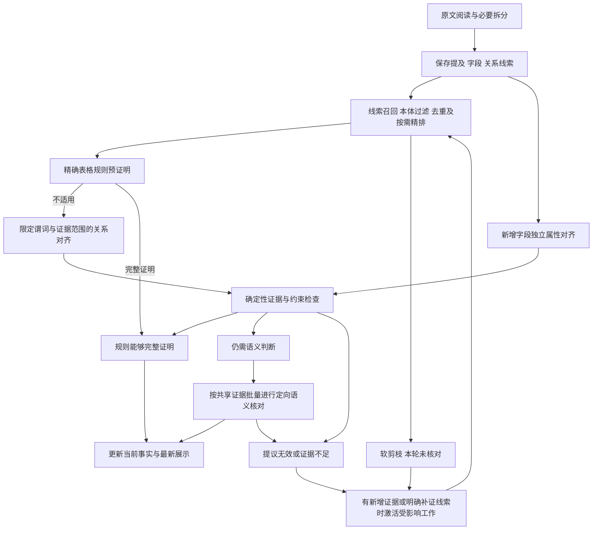

# 图谱分析性能与候选剪枝优化方案

日期：2026-09-30。状态：已按 Spec Kit 实施；工程验收见[本轮验证记录](../specs/035-independent-document-harness/validation-performance.md)。尚未部署或完成真实模型质量/加速评测。

阅读顺序：第 1—10 节说明问题、原则和验收目标；第 12—21 节固定首版的数据结构、函数接口、
事务、算法、协议和测试任务。编码以第 12—21 节的具体决定为准，不再自行选择存储方案或全量兜底策略。

适用范围：`/analysis?tab=graph-analysis` 的独立 `document_harness` 链路。本文综合运行
`b8a9e3af-2c75-4d0e-804e-8e96cbdb5652` 的耗时调查、关系候选剪枝讨论及非 LLM
证据核对设计，目标是减少无依据配对、重复核对和进度统计开销，保留原文证明及暂停/继续能力。

文档编制时工作区基线为 `bc2092b636819925f477d4fdf2cfb1fccfb90527`；该提交标识用于定位所读源码，
不代表历史运行的全部调用均使用同一版本。本文中的实测是本次会话已完成的只读调查记录，方案收益均待验证。

## 1. 目标、范围与已有契约

### 1.1 本次目标

1. 模型调用和页面刷新不再反复扫描全部历史调用及大型请求 JSON。
2. 关系候选由原文线索产生，本体负责约束合法解释；不再遍历所有类型兼容的实体组合。
3. 可以由确定性规则证明的断言免除 LLM 复核；其余断言按实际语义缺口核对。
4. 窗口拆分、继续运行和新字段登记只激活受影响工作，避免相同证据重复收费处理。
5. 阅读覆盖、候选执行、未决状态、事实采信和调用成本分别展示与验收。

### 1.2 范围限制

- 复用 `DocumentIR`、本体目录、当前业务状态、模型调用账本和现有调度器，不新增队列服务、
  向量数据库、通用自然语言规则引擎或外网依赖。
- 保持一个当前恢复入口、一份分区权威工作状态、一份最新展示缓存；精排结果与调用账本独立保存。
  不引入历史执行快照、事件回放、诊断平台或全系统故障恢复机制。
- 不修改本体来迎合识别结果，不扩展来源数据的证明权限，不将文内共指升级为全局身份。
- 本次只交付文档。后续实现直接面向当前契约的新运行，不为旧运行增加兼容转换；本文不授权中断、
  删除、重写或迁移正在执行的运行与历史制品。

### 1.3 与既有方案的关系

| 依据 | 本次保留与调整 |
|---|---|
| [035 独立 Harness 规范](../specs/035-independent-document-harness/spec.md) | 保留原文驱动发现、物理提及、分阶段职责、候选可见与暂停继续；实施前同步候选准入、分层核对及完成语义 |
| [036 分组接线契约](../specs/036-mapped-entity-query/contracts/harness-grouped-alignment.md) | 保留编号分组、参与方式、选择、时间、极性与条件；组不能为批处理方便而摊平成普通肯定边 |
| [本体指引基础方案](基于本体指引的文档结构和摘要元数据的关系图谱识别方案.md) | 保留本体约束、原文证明及实体层级；具体执行范围以独立 Harness 为准 |
| [语义精排方案](支持语义相似度精排的关系图谱识别精度提升方案.md) | 原 S03 和第 4 节以排序、完整计划为主；本次设计在独立 Harness 中加入真正的候选准入与软剪枝，不将所有低优先级组合重新加入全量兜底队列 |
| [既有新内核性能方案](关系谱图识别新内核的性能优化方案.md) | 借鉴减少重复工作、有限并发后置的原则；其中旧执行器、存储版本、实验结论不作为当前实现或验收结果 |

“独立核验”保留为候选提议之外的证明职责。对适用前提完整的结构化映射，可由独立确定性校验完成；
自由文本的关系语义不能仅凭引文存在及本体合法就通过。实施前按仓库 Spec Kit 流程更新实际受影响的
规范、计划和任务；本设计文档不标记上述规范已经完成变更。

## 2. 已核验的瓶颈与测量边界

### 2.1 调用量与阅读窗口

主采样时点为 2026-09-30 09:55:58 UTC。该运行已完成 1,639 次逻辑模型调用，含重试共 1,650 次尝试。

| 阶段 | 已完成逻辑调用 | 累计模型请求耗时（秒） | 耗时占比 |
|---|---:|---:|---:|
| 属性与关系对齐 `assertion_alignment` | 943 | 6,042.597 | 51.6% |
| 证据核对 `evidence_review` | 504 | 3,630.380 | 31.0% |
| 原文发现 `discover` | 25 | 642.565 | 5.5% |
| 类型对齐 `type_alignment` | 43 | 619.134 | 5.3% |
| 实体核对 `entity_review` | 42 | 340.847 | 2.9% |
| 指称候选 `referent_candidates` | 62 | 329.706 | 2.8% |
| 指称选择 `referent_selection` | 20 | 109.175 | 0.9% |
| 合计 | 1,639 | 11,714.404 | 100% |

累计输入为 12,178,610 Token。另有 19 次类型卡排序请求，累计约 755.9 秒；不混入上述 LLM 阶段合计。

- 阅读进度为发现 19、核对 18、总窗口 35。35 由初始 15 个窗口和追加 20 个拆分窗口组成，包含父子重叠范围。
- 第 18 个窗口约 407 字符，产生 517 次模型调用，其中对齐 301 次、证据核对 210 次；模型请求累计约 3,881 秒。
- 943 次对齐中，312 次没有产生属性映射或关系提议。它们说明任务产出稀疏，不表示全部都可以事先安全排除。
- 09:57 左右按当前状态重建第 19 个窗口的关系计划，得到约 185 个任务、681 次主体—对象配对。
- 322 次关系组核对累计约 1,764 秒；其中 226 次面对 `participation=unknown`，累计约 1,185 秒。
  当前核对输出不能修正参与方式，程序又禁止将该状态采信；这些调用无法解决采信的关键阻塞条件。
- 当时尚未进入最终全文共指核对；按现有类型兼容配对逻辑已有 621 对待处理，按每批 6 对至少需要 104 次调用。

源码依据：[关系任务生成](../backend/app/services/document_harness/planning.py)、
[控制器](../backend/app/services/document_harness/controller.py)、
[关系组核对](../backend/app/services/document_harness/work_execution.py)、
[共指配对](../backend/app/services/document_harness/coreference.py)。

### 2.2 每次调用前的统计放大

`Repository._invoke_once()` 在模型请求前调用 `progress()`，后者通过 `call_summaries()`
读取全部调用记录。状态、耗时和 Token 等字段与完整输入/Schema 位于同一个大型 JSON 中，查询逐字段提取。

| 只读计时项 | 观察耗时 |
|---|---:|
| 100 条调用摘要 | 0.71 秒 |
| 400 条调用摘要 | 2.54 秒 |
| 800 条调用摘要 | 5.10 秒 |
| 约 1,646 条调用摘要 | 9.52 秒 |
| 同批数据一次 JSON 提取后在 Python 取摘要，仅作诊断对照 | 1.94 秒 |
| 图谱完整响应 `graph_response()` | 10.19 秒 |

`EXPLAIN ANALYZE` 观察到约 9.52 秒执行时间、49,099 次共享缓冲区命中，没有物理读取；
仅增加索引不足以解决选中记录的重复 JSON 处理。诊断对照仍是全量读取，不是目标实现。

截至 10:00 的 31 次当日无重试调用中，模型请求约 371 秒，调用包围流程额外约 304 秒，
额外开销占约 45%，中位数约 9.73 秒。该比例只适用于此样本，不外推为整轮占比。
调度记录（含排序等请求）平均排队约 0.021 秒；主模型所用池容量为 8，运行控制器仍逐项同步调用。

源码依据：[调用与统计](../backend/app/services/document_harness/runtime.py)、
[图谱投影](../backend/app/services/document_harness/projection.py)、
[页面轮询与成本展示](../frontend/src/components/analysis/source-harness-panel.tsx)。

### 2.3 这些数值能证明什么

- 确认关系工作量膨胀、同步全量统计和细粒度核对开销；采样期间调用继续完成，没有发现卡死证据。
- “请求累计”是模型请求耗时，未包含全部统计、投影、暂停间隔和业务处理时间。
  该运行跨多次暂停/继续，创建时间差不能作为连续执行耗时。
- 账本和当前状态仍会变化，上述分项有明确采样边界，不能要求后续查询保持相同数值。
- 本次记录不是冻结的端到端性能基线，也没有独立金标质量评分；系统已采信结果不能充当金标。
  后续对照使用固定输入、本体、代码、模型、策略和预算的新运行。

## 3. 目标处理流程



图中的补证是按已有缺口和新证据触发的有界工作，不是自动重试至成功的循环。
单纯没有结果、队列空或存在本体合法关系，不触发全局组合扩展。

## 4. 优先消除全量进度统计与展示重算

### 4.1 轻量调用摘要与增量累计

沿用现有 `DocumentRunRequest`、`DocumentRunResult` 与运行当前状态：

- 将请求状态、阶段、尝试次数、累计耗时和 usage 可用性等统计字段放入可直接读取的轻量字段，
  不从含完整提示词/Schema 的大型 JSON 逐字段反复提取。原始输入、Schema 与回答仍按既有职责保存。
- 每个运行按阶段保存一份当前成本汇总；每次派发、完成或失败只应用本次增量。
  逻辑完成调用数与尝试次数分开；缓存复用已付费回答不增加调用、耗时或 Token。
- 原子提交付费回答、调用终态及其成本增量；重复消费同一结果不重复累计。
  重试记录中的累计值只能贡献新旧差值，不能把先前失败成本再次加总。
- Token 缺失用当前缺失计数表达，聚合结果仍显示未知；已测得的 0 与未知不同。
  后续成功重试不能把此前未测量的失败尝试补成 0。
- 候选数和采信数按受影响业务记录更新，处理新增、状态转换和删除的差值；排除文档根等既有计数例外。
  不为更新一个计数重扫全部候选。

首版确定增加调用账本的轻量列，具体列及 Alembic 范围见第 13 节；不新增独立统计服务或费用历史快照。
完整账本聚合仅用于显式诊断与测试对账，不作为模型调用、继续执行和普通 GET 的前置步骤。

### 4.2 一份最新展示缓存

- 图谱业务状态提交时更新一份最新图谱展示缓存；只有调用成本变化时只更新轻量统计。
  普通 GET 组合最新图谱、当前运行状态与成本摘要，不加载完整请求输入、回答或排序结果。
- 继续使用现有工作版本及请求版本区分图谱变化与成本变化，保证响应版本自洽；
  暂停、失败、取消以及人工解释更新也必须在页面正确反映。
- 人工解释沿用独立状态，不覆盖模型判定；基础缓存只保存问题种子，GET 批量读取当前人工答案。
- 缓存命中前仍检查运行所属用户、访问权限、删除及有效性；缓存缺失不能返回空图并冒充完整结果。
- GET、刷新和 Tab 切换不创建模型任务、不修改权威工作状态；暂停后继续直接读取当前状态。

该缓存服务于本次已明确的展示性能需求，不保存多版图谱，也不扩展成通用缓存平台。

## 5. 关系候选剪枝：从原文线索生成任务

### 5.1 候选的最小输入

在当前工作状态中，关系候选需要能够回答：哪个主体、哪些对象、哪些可能谓词、从哪里来的线索。

| 内容 | 用途 |
|---|---|
| 主体/对象的物理提及引用；必要时为完整对象组 | 防止同名替换、跨角色配对和组成员丢失 |
| 当前本体允许的候选谓词集合 | 对齐时只比较相关谓词；原文关系词不能直接成为新谓词 |
| 关系表达、字段/表头角色或跨段引用的原文位置 | 说明候选生成依据，不等于关系已经成立 |
| 极性、条件、参与方式等已知信息与未知项 | 避免把否定、选择或条件关系改写为肯定事实 |
| 当前处理结果与直接依赖内容指纹 | 复用结果、发现证据变化和解释未核对原因 |

复用已有 `hints`、`fields`、`entities` 和原文引用，必要内容放在当前业务分区。
索引从当前状态构造，不复制整份文档；不为从未生成的每个理论实体组合建立数据库记录。

### 5.2 三条召回路径

1. **明确原文表达**：发现阶段的关系线索及其端点、角色和限定。线索在任务生成前生效，
   不再只作为全量配对后的提示词附件。缺少某条 hint 不等于原文不存在关系。
2. **结构化记录**：表头、字段角色和行上下文共同定位可能关系。同一行/章节只提供召回范围；
   只有适用的确定性映射规则才能把该结构直接作为关系证明。
3. **跨段引用与缺口检索**：明确引用、作用域内编号、已证明的指代/别名，以及针对具体主体—谓词缺口的
   原文检索。检索可以覆盖全文，但只从命中证据产生候选，不遍历全部历史实体对。

没有原文线索时，不为每个本体合法谓词自动启动一次检索。未确认身份可作为隔离的候选假设召回，
不能因此采信关系，也不能因为端点暂未采信而删除已有原文候选。新增属性字段只触发属性处理，
不把主体重新加入全部历史关系配对。

### 5.3 剪枝规则与语义

| 条件 | 处理 | 不得推导的结论 |
|---|---|---|
| 已确认端点类型下，当前已解析本体约束明确不允许谓词/方向 | 硬剪枝该解释 | 不表示其他类型解释或其他谓词也不存在 |
| 引用越界、文本不匹配、端点引用无效 | 提议无效，保留必要错误原因 | 不等于原文表达了否定关系 |
| 断言及直接证据、身份和类型依赖均未改变 | 复用当前核对结果 | 不忽略后来出现的反证或条件变化 |
| 只有类型兼容、同报告共现或高名称相似度 | 不生成昂贵核对任务 | 不把同名合并或共现当关系 |
| 已生成的模糊候选，相关性低或证据连接不足 | 软剪枝，标为本轮未核对 | 不标记为模型拒绝或事实否定 |
| 类型约束未解析、身份/归属/参与方式仍有歧义 | 暂缓；有具体补证依据时定向处理 | 未知不按不合法处理 |

硬剪枝需使用当前本体真实的继承、并/交集及限制语义，不能简化为字符串类型相等。
相同名称、相邻位置、共享父节点都不是确定性身份或组成证明。

### 5.4 精排的职责和边界

先做上述便宜的线索召回、约束过滤和去重，仅对仍然过多的模糊候选复用现有本地语义排序能力。
现有类型卡排序不能直接当作关系排序；关系查询按具体主体与谓词角色构造，例如“产品 A 使用哪些生产设备”。

- 分数用于准入和顺序，不作为事实成立概率；不对全部实体组合先计算昂贵的精排分。
- 每个主体—谓词及证据范围分别选择候选；首版采用有界 Top-K，不设绝对分数阈值，配额由验证集校准。
- 明确关系表达及已知必要的否定、条件、竞争归属证据不被普通 Top-K 配额挤掉。
- 表述相似但关系方向、对象角色或阶段不同的候选仍要区分。
- 软剪枝后本轮不调用，也不在末尾恢复全量遍历；只由新证据、相关解释变化或显式扩大范围重新激活。
- 精排不可用沿用既有能力失败政策，不静默返回空候选并宣称处理完成。

预期工作量由有效线索及其有界扩展决定；不承诺所有文档都达到线性复杂度。
关系密集的原文仍可能产生大量必要候选，实际复杂度和漏召回须由第 10 节验证。

## 6. 分层证据核对：程序优先，语义判断按需

### 6.1 不调用 LLM 可以证明什么

| 核对层 | 程序能力 | 通过的含义 |
|---|---|---|
| 原文定位 | 校验文档、单元、字符范围和逐字内容 | 引用真实存在 |
| 本体及结构约束 | 检查合法类型/谓词、方向、成员、值类型等已解析约束 | 提议符合这些约束 |
| 明确映射规则 | 检查规则适用前提、主体与字段角色、完整值和限定，并执行映射 | 在该规则适用范围内证明完整断言 |
| 自由文本语义 | 通用规则不能保证隐含指代、归属、否定和条件理解正确 | 仍需语义判断或保留未决 |

前两层通过不等于第三层成立。主体与对象分别出现在引用中，也不足以证明指定关系。
单纯用否定词列表、同句共现、模型自述高置信度或高相似度，不构成免复核依据。

确定性规则首期只覆盖已有明确映射或少量经过验收的结构化契约，不建设通用语法系统。
例如表格明确规定“产品”和“该产品使用的生产设备”，且主体、行角色及适用条件均可由规则核验时，
可程序证明“使用”关系；只有“产品”“设备”两列而语义不明时只能产生候选。
规则不能由同一次待核对 LLM 输出自行宣布成立；解析或表头解释不确定时退出规则证明路径。

### 6.2 核对分流

下表是拟议内部决策语义；编码用枚举见第 17 节，不表示当前 API 已有这些枚举。

| 决策 | 行为 |
|---|---|
| 提议无效 | 不调用语义模型，保存具体校验问题；不创建否定事实 |
| 规则完整证明 | 记录使用的规则标识、当前规则版本及原文引用，经端点和依赖门控后采信 |
| 需要语义判断 | 提交关系本身或具体歧义的定向核对；证据不足则保留未决 |

规则标识及引用附在现有事实/当前核对记录中，用于解释当前结果和复用，不新增证明历史平台。
独立语义核对仍适用于规则无法证明的自由文本断言，即使第一次模型没有报告“疑点”也一样。
本方案不默认采用“第一次 LLM 对齐后只验格式便采信”的单次模型路径。
若以后选择该路径，必须明确它取消了独立语义复核，并单独验证其质量代价。

端点暂未确认时，候选与关系原文继续保留；已有语义证据可以复用，采信等待受影响端点确认。
不能为节省核对而阻断其他原文发现或属性处理。

### 6.3 关系组先处理真正的阻塞问题

`participation=unknown` 时，先判断有无足够原文可以区分 `all`、`options` 等解释：

- 有具体依据：定向核对参与方式，显式产出新候选解释，再执行适用的程序与语义门控。
- 无具体依据：保留未决，不继续调用一个只能核对旧解释、不能修正参与方式的接口。
- 时间、选择和参与方式分别判断；未知时间不补成并行或顺序，选项组不展开成多条肯定边。
- 原文有明确反证时，允许拒绝当前解释；不得把“缺少参与方式”一律当作已证明不存在关系。

人工解释保持独立保存及展示，不自动覆盖模型判定或提交业务事实。

### 6.4 按共享证据批量核对

按原文证据范围、主体角色和相关谓词组织批次，不按随机实体 ID 或逐关系组逐次请求。
同一段原文支持多个候选时，原文发送一次，每个断言独立返回结论和引用。

- 输入仅包含本批所需提及、谓词定义及证据；必须保留相关表头、单位、主体归属、桥接、否定和条件。
- 相邻范围不能只因节省 Token 就丢弃已知反证；上下文压缩不得改变证据权限。
- 完整关系组及必要共同证据作为不可拆的语义单元；超限时调整其他项或报告未完成，不改变成员语义。
- 同一证据范围内若确定性映射已完整证明，直接在该范围生成并核验，不再先构造一次 LLM 对齐请求。
- 模型超时、输出不完整或格式无效仍按技术失败处理，不能当作未发现关系或全部拒绝。

## 7. 拆分、增量复用与共指剪枝

### 7.1 发现拆分先于昂贵关系展开

当前实体输出达到 12 项等容量边界会标记范围未完成，但控制器先完成父窗口的后续阶段，再追加子窗口。
目标是保存已发现提及与字段后，优先完成必要细分，再安排受影响的关系工作。

- 复用物理提及与字段，不因为子窗口重新编号就创建新实体；保留同名但不同物理位置的独立提及。
- 未完成父范围的关系批量展开等待其必要发现补充；其他已完成范围可继续产生结果，不要求全篇等待。
- 父范围提供的表头、跨边界关系及条件仍对相关子窗口可见；拆分不能切断跨子窗口候选。
- “达到输出容量”是继续发现的信号，不证明后续关系全部需要重验；拆分终止仍沿用有界原则。
- 原文阅读覆盖按物理主范围统计，标题/表头上下文重复不增加覆盖。
  父子窗口数量可作为工作批次计数，但不能作为全文完成百分比。

### 7.2 仅重算依赖发生变化的断言

业务复用键基于当前运行、物理端点、谓词、极性、条件、组成员及参与/选择/时间解释；
依赖指纹包含直接原文范围与内容、相关身份/类型解释、本体快照以及所用证明规则或协议。
不同来源的同一断言可合并证据，但不同条件或极性不能被去重丢掉。

| 变化 | 是否重核对 |
|---|---|
| 窗口编号、显示名、候选排序或批次打包变化 | 不因此重核对 |
| 新增无关实体或无关字段 | 不重核对已有关系 |
| 新增与断言相关的证据、反证、条件 | 重新处理受影响断言 |
| 相关端点指称、类型或组成员发生变化 | 重新检查依赖及必要语义；不能沿用失效采信 |
| 暂停后继续，相同付费回答已保存 | 复用回答及已应用工作，不重复计费 |

本体使用运行冻结快照；新本体运行不能复用旧快照下的证明。缓存以当前运行为边界，不增加跨用户全局结果缓存。
所有重核对信息只保存当前必要状态，不记录完整历史版本或全量“已考虑实体对”矩阵。

### 7.3 共指也按线索生成候选

将 `candidate_pairs()` 的类型兼容全组合改为明确别名、作用域内标识、原文引用及可定位指代线索的候选召回。
名称相似可以召回，不能直接合并；名称没有共享字符也不能排除明确别名。
共同文档、同一类型、相同编号子串均不足以证明同一对象。

复用现有共指原文证明和一致性规则，未知保持未决；新线索才激活受影响配对。
不能只做前面的关系剪枝，却在结束阶段再次以全文共指全组合补回平方级工作量。

## 8. 当前状态、界面语义与并发边界

### 8.1 最小状态与展示调整

复用当前业务分区保存已实际生成的候选及当前处理原因，至少区分：待处理、已处理、
软剪枝未核对、缺证未决和技术失败。具体字段与公开枚举见第 15、19 节，不把调度原因混入事实极性。
未生成的理论配对不必逐条保存，页面也不展示虚构的“所有关系总数”。

页面分别展示阅读范围处理、候选核对、系统采信与调用成本；规则证明与模型核对结果可以解释其依据。
“本轮处理结束”只表示当前策略下已选工作处理完毕，不表示所有潜在关系均已验证。
`scope_complete` 等现有字段须明确限定为原文范围处理语义，不能借剪枝把关系召回率标为 100%。
系统采信仍不等同人工确认或业务事实提交。

### 8.2 有限并发后置

完成上述工作量缩减及统计改造后，再测量是否需要并发。若串行语义核对仍主导耗时，
可对前置输入已就绪且请求已固定的批次使用现有模型调度容量进行有限并发。

LLM 调用与业务更新解耦：共享断言、字段观察或竞争关系组不单独构成调用串行的理由；
并发结果经单一业务提交入口校验当前语义依赖后，按当前状态串行合并。
真正使用前批输出的请求等待该输出提交，其他就绪批次继续派发，不设置两批同时结束的等待屏障。
暂停停止新派发，已开始请求仍按既有付费回答保存契约处理。
不以槽位容量 8 直接推定单运行应启动 8 路请求。
并发度需实测确定，不作为前述优化的前置条件，也不额外建设分布式任务框架。

2026-10-01 对两批并行的依赖核验见
[双批次并行依赖设计核验](图谱分析双批次并行依赖设计-20261001.md)。
该文区分输入因果依赖、输出合并冲突和回答适用性，说明属性菜单分片与组核验的批次边界，
记录跨区域输出合并、输入指纹覆盖和提交前检查的缺口。
按最新讨论，首轮并行边界调整为两个阅读窗口独立发现并保存局部提及、原字段和原文线索；
窗口发现不消费其他窗口生成的实体结果，必要的类型/指称核验及统一共指、关系处理后置。
共享实体通过有原文依据的共指判断统一，字段归属及关系仍各自核验；不是直接并行两个完整图谱流程。
具体输入输出、现有实现缺口和验收条件见该文第 1.3 节与第 7 节。
可编码的独立重构方案见
[阅读窗口并行与后置共指重构方案](图谱分析阅读窗口并行与后置共指重构方案-20261001.md)，
后续并行重构以其状态契约、任务拆分和验收矩阵为准。
当前实现仍为单批串行；核验文档不表示已实施并行。

## 9. 实施顺序与代码落点

下表全部为待实施事项。每步先更新受影响的需求与契约，再改代码并验证；不把文档记录当作实施授权已执行。

| 顺序 | 改动 | 主要落点 | 完成依据 |
|---|---|---|---|
| P0 | 轻量账本、增量统计、最新展示缓存 | `runtime.py`、`projection.py`、现有运行模型与 API；涉及结构时增加迁移 | 热路径不扫描历史调用，费用与候选计数准确，读取权限不退化 |
| P1 | 线索驱动关系任务、属性解耦、发现优先拆分和依赖复用 | `planning.py`、`controller.py`、`continuation.py`、`source.py` | 无线索全局配对消失，重复窗口不重新处理未变证据，跨边界正例保留 |
| P2 | 确定性证明分流、关系组澄清、共享证据批量核对 | `controller.py`、`work_execution.py`、`protocols.py`、现有本体/引用校验 | 规则路径零 LLM 复核；自由文本不能只验格式采信；组语义完整 |
| P3 | 按需关系精排与共指候选剪枝 | 复用 `ranking.py` 相关能力、`coreference.py`，避免复用旧执行器 | Top-K 配额经召回验证；末尾不恢复全组合；无证据不合并 |
| P4 | 合同与页面完成语义、端到端性能及质量对照；必要时有限并发 | schema、API、`frontend/src/lib/api.ts`、图谱面板及当前 Harness 评测入口 | 明确工程、真实模型、质量和部署各自状态 |

界面和 schema 随实际后端改动同步，不等到 P4 才修复不一致；P4 做整体验收。
新能力完成并通过必要验收后按仓库约定默认启用；本次文档不添加长期关闭的实验分支或旧协议转换。

## 10. 验证与验收口径

### 10.1 工程行为与规模检查

| 场景 | 验收要求 |
|---|---|
| 账本由 100 增至 1,000、2,000 条 | 单次进度更新读取范围只与本次改变有关；SQL 不返回全部调用 JSON；记录实际延迟而非预设达标 |
| 成功、失败、重试、暂停继续、重复消费已付费结果 | 阶段成本与独立账本聚合一致；不重复计数；未知 Token 不变成 0 |
| 图谱 GET 与轮询 | 不加载调用正文，不启动模型；版本与状态一致；缓存仍隔离用户、删除和失效运行 |
| 增加大量无原文连接的历史实体 | 不按实体数量平方增加关系或共指模型任务 |
| 明确关系、表格角色、跨章节引用 | 必要候选可召回，跨窗口不依赖单句同时出现完整三元组 |
| 缺少关系 hint、发现达到容量或父窗口拆分 | 仍能通过适用召回路径发现正例；父范围桥接不丢失；未变证据不重复核对 |
| 低分、未评分、技术失败、软剪枝 | 各自状态可区分，不能计作关系否定或已核对 |
| 同名异物、同编号不同作用域、名称不同的明确别名 | 不错合并，不因字符串不相似漏掉有据别名 |
| 否定、条件、竞争主体、可选成员及时间未知 | 限定和反证保留，选项组不摊平，未知不补造 |
| 规则映射 | 适用前提完整时通过；错行、合并单元格歧义、语义不明表头、错误单位/归属等反例不能误过 |
| 自由文本的正确引文但错误关系解释 | 不能只凭引文和本体合法免除语义判断 |
| 新增相关反证或身份修正 | 受影响采信及时失效并重新处理，无关事实不重复核对 |

优先扩展已存在的 [规划测试](../backend/tests/test_document_harness/test_planning.py)、
[拆分测试](../backend/tests/test_document_harness/test_continuation.py)、
[控制器测试](../backend/tests/test_document_harness/test_controller.py)、
[分组测试](../backend/tests/test_document_harness/test_grouped_alignment.py)、
[共指测试](../backend/tests/test_document_harness/test_coreference.py)、
[运行仓储测试](../backend/tests/test_extraction/test_document_harness_runtime.py) 与
[前端 Harness 测试](../frontend/tests/source-harness.test.mjs)。这些是已核验存在的入口，
不是已新增或已运行的测试清单。数据库统计与锁/并发检查使用独立可销毁测试库，不指向活动业务库。

### 10.2 固定输入的真实质量与成本对照

使用当前独立 `document_harness` 的新运行，对同一原文、本体快照、根类型、模型与策略进行比较。
复用已有评分能力前须确认支持当前 Harness 的原文提及、关系组、参与方式和时间契约；
[活动评测说明](../backend/app/evaluation/README.md) 中的旧执行器命令不能直接作为当前 Harness 验收入口。
评分适配只用于评测，不让线上代码导入 `app.evaluation`。

分别报告：

- 候选召回率：独立参考中的目标关系有多少进入可核对候选集合，并区分生成遗漏与剪枝遗漏。
- 最终事实 precision/recall、实体归属/关系方向、否定/条件、关系组与完整路径；
  未决及未评分项单列，不能通过删除候选缩小评分分母。
- 各阶段逻辑调用数、尝试次数、输入/输出 Token、排队、模型、数据库及投影耗时，
  首个有效结果与连续执行总耗时；精排和补证费用纳入总成本。
- 规则证明覆盖量、语义核对量、复用量、软剪枝量和因剪枝漏掉的参考正例。

先比较统计改造，再比较候选剪枝与核对分流；精排和并发分别测量其净收益。
同时比较相同预算下的质量和相同终止口径下的成本，不能把未完成运行与完整运行直接相除得出加速比。
关键已批准正例、跨段关系及禁止断言反例必须保留；实际质量阈值和精排参数在验收集上固定后用于独立保留集，
不能用同一文档边调阈值边宣称泛化通过。没有批准参考时只报告工程结果与成本，不宣称质量达标。

本方案不预承诺调用量减少比例、总耗时上限或召回率不下降。先验证统计热路径与确定性分流的可测收益，
再以真实参考判断剪枝代价；节省调用与识别准确是两项分别验收的结果。

## 11. 本次交付状态

- 已完成：整合调查与优化方案，并细化首版字段、函数、事务、候选算法、消息协议、窗口状态机、前端契约及编码测试清单。
- 未执行：业务代码修改、数据库迁移、暂停/继续操作、真实模型调用、质量评测、部署及旧数据处理。
- 本次文档检查只核对路径、引用、数值、术语和设计一致性；不替代任何工程或模型验收。
- 已执行文档检查：21 个主章节、20 处本地链接、代码围栏、实测合计、40 条行为用例和 9 项编码任务编号，以及空白检查通过。

## 12. 编码基线与首版固定决定

以下名称、字段和默认值是**待实现契约**；代码块用于界定数据形状，不表示对应类或函数已经存在。

| 问题 | 首版决定 |
|---|---|
| 调用摘要在哪里 | `document_analysis_requests` 增加轻量列；原 `payload` 保留调用输入和 Schema；不增表 |
| 成本和业务计数在哪里 | `DocumentRunCurrentState` 的 `harness:metrics/main`，一份小型派生汇总 |
| 展示在哪里 | 同表 `harness:display/graph`，仅一份最新图谱基础投影，不含动态成本和人工答案 |
| 任务在哪里 | 同表 `harness:work/<id>`；只有实际生成的任务，无理论实体对全集 |
| 是否引入第二套 worker | 否；仍由 `Engine` 顺序派发，`Repository` 写入，既有租约负责执行所有权 |
| 初版并发 | 单运行 `1`；第 8.2 节的并发属于后续优化，不进入首版验收前置条件 |
| 排序阈值 | 首版无绝对分数阈值；固定有界 Top-K，明确证据及反证绕过普通配额 |
| 结构化关系自动证明 | 只接受运行中冻结的显式表格映射契约；缺少契约时不启用该规则，不把列名相似当契约 |
| 原文自由文本自动采信 | 仍需独立语义核对；一次提议加格式检查不能变成采信 |
| 旧运行 | 不转换或补造新字段；验收新建运行，部署期间在途任务处理另按运维授权执行 |

模块边界固定如下；新增文件均位于 `backend/app/services/document_harness/`：

| 文件 | 函数/职责 |
|---|---|
| `work.py`（新增） | 下文数据模型、任务键、依赖指纹、任务状态转换；无数据库与模型调用 |
| `accounting.py`（新增） | 调用贡献量及新旧差值、阶段汇总、业务计数；纯函数 |
| `work_execution.py`（新增） | 显式任务派发、程序门分流、属性/关系分批、共享核对、一次补证及证明失效 |
| `planning.py`（改造） | 线索索引、候选生成、谓词筛选、共享证据打包；替换旧 `alignment_jobs()` 全组合逻辑 |
| `evidence_gate.py`（新增） | 引文/约束预检、确定性规则、语义核对分流；规则不会自行调用模型 |
| `controller.py`（改造） | 窗口阶段、依赖变化传播、派发和应用付费回答 |
| `runtime.py`（改造） | 轻量调用记录、原子计费、当前状态事务及结果缓存；实现所有数据库写入 |
| `projection.py`（改造） | `build_graph_base()` 纯投影与 `graph_response()` 只读组装 |
| `protocols.py`、`work_execution.py`、`coreference.py`（改造） | 第 16—18 节的定向消息、批量核对和线索驱动共指 |

不引入通用插件注册器或动态任务类型。`WorkItem.kind` 仅允许本文列出的值，派发采用显式分支。

### 12.1 冻结参数

在 `model.freeze_policy()` 返回值增加 `execution_policy`，写入既有 source artifact：

```json
{
  "schema": "harness-pruning/1",
  "weak_candidates_per_subject_predicate_region": 4,
  "weak_candidates_per_region": 64,
  "reference_targets_per_cue": 8,
  "relation_items_per_call": 6,
  "review_judgments_per_call": 12,
  "context_expansions_per_dependency": 1,
  "reading_split_depth": 4,
  "wire_bytes_per_call": 96000,
  "table_relation_rules": []
}
```

这些是可编码的首版工程默认值，不是已验证的质量阈值。参数调整只影响新运行；评分保留集不能用于调参。
关系精排复用 `policy.card_ranking.semantic` 的启用状态与模型配置：已启用时按需调用现有语义模型，
关闭时使用第 15.4 节的确定性次序；已启用但不可用时报技术失败，不假装候选为空。

`wire_bytes_per_call` 使用现有 `request_size()` 的 UTF-8 字节估算单位，包含其固定余量；
不得把 96,000 字节标成实际输入 Token，也不改写模型计费 Token。将 Engine 当前含糊的
`max_input_tokens` 内部打包参数改名为 `max_request_bytes`，正式运行显式传入上述值，
不再由这个值除以 6 决定原文窗口长度。原始窗口仍使用 `build_windows(max_chars=4800, max_sources=40)`。
输出上限保留 16,384 Token；模型侧上下文超限属于失败，不静默截断证据。

模型消息协议统一从当前 `document-harness-v3` 更新为 `document-harness-v4`，公开图谱协议更新为
`document-harness-v2`，同时更新 `ENGINE`、schema、前端常量及适用测试。仅保留新协议执行路径，
不生成旧消息转换器，也不通过改写旧 artifact 使旧运行伪装成新运行。

## 13. 账本、汇总和原子计费契约

### 13.1 模型与迁移

在 `DocumentRunRequest` 增加下列列；仅 `domain='harness:calls'` 的新协议记录使用。
其他执行域继续使用自己的 payload。迁移文件名拟为 `harness_call_accounting_columns.py`，
revision/down_revision 由实施时真实迁移 head 决定，不在文档中虚构编号。

| 列 | 数据类型 | 新协议含义 |
|---|---|---|
| `call_stage` | String(64) | 本次逻辑调用阶段 |
| `call_status` | String(24) | `prepared/running/completed/failed`；prepared 表示批次已登记但尚未派发 |
| `call_attempts` | Integer | 已开始的尝试数 |
| `call_started_at`、`call_finished_at` | DateTime(timezone=True) | 最新尝试开始/结束时间；运行中 finished 为 null |
| `call_duration_us` | BigInteger | 已测请求耗时累计，整数微秒 |
| `call_input_tokens`、`call_output_tokens` | BigInteger | 已测 Token 累计，不含未知项 |
| `call_unknown_input`、`call_unknown_output` | Integer | 未获得对应计量的尝试数，包含在途尝试 |
| `call_unmeasured_attempts` | Integer | 已结束但未获得耗时计量的尝试数 |
| `call_error` | String(200) | 既有安全错误码；成功/在途为 null |

全部列数据库层允许 null，供其他域及原有行保留；应用层要求新 `harness:calls` 记录除时间及 error 外非空。
prepared 的 attempts/计量全部为 0，两个时间为 null；它不贡献任何调用费用。
数值列加“为 null 或非负”约束，不做旧记录成本回填、不删除原始账本。沿用现有联合主键，不增加无需求的索引。
`payload.value` 的新形状只保留 `id/payload/schema/model/model_revision/max_output_tokens` 等调用内容；
状态、attempts、usage、seconds 不再在两处同时作为权威值。

对新调用行，`content_hash` 计算对象为 `{payload, accounting: 轻量列的规范化值}`，
时间先转 UTC ISO 格式。`get_call_record()` 单独校验这个结构；原通用 `get_row()/put()`
继续处理其他 domain，不用旧 payload 校验函数错误地校验新调用行。
完整付费回答仍放在 `DocumentRunResult/harness:calls/<call_key>`，不修改已保存的回答。

### 13.2 汇总形状

`harness:metrics/main` 由仓储维护，不从 Engine 的状态拷贝覆盖：

```text
Metrics {
  completed_calls: int,
  candidate_count: int,
  fact_count: int,
  limited_scope_count: int,              # 当前有截断标志的 region/cue 数
  stages: dict[stage, StageTotals],
  work_counts: dict[WorkStatus, int],
  rule_verified_count: int,
  llm_verified_count: int
}
StageTotals {
  attempts: int, completed_calls: int,
  duration_us: int,
  input_tokens: int, output_tokens: int,
  unknown_input: int, unknown_output: int,
  unmeasured_attempts: int
}
```

初始化值均为 0/空字典。`contribution(call)` 返回这条逻辑调用对所属阶段的累计贡献：
`completed_calls = int(call_status == 'completed')`，其他值直接来自轻量列；公开 stage_costs 仅输出 attempts>0 的阶段。
每次只应用 `contribution(new) - contribution(old)`；状态从 failed 重试到 completed 也使用同一公式。
尝试进行中就计入 attempts；有未知输入或输出时，相应公开 Token 为 null，不显示部分已测和为总量。

业务贡献函数：

```text
business_contribution(domain, row):
  candidate = domain in {entities, properties, relations, relation_groups}
              and row.role != document_root
  fact = candidate and row.state == accepted
  return (int(candidate), int(fact))
```

删除 row 时新贡献为零。`rule_verified_count/llm_verified_count` 只计算已采信的属性、关系和关系组，
依据第 17 节 `verification.method`；实体类型核对不混入这两个指标。Engine 不直接修改计数。
`limited_scope_count` 对第 15.4 节 region 观察和第 16.1 节 cue 的截断标志做同样的新旧布尔差值。
公开 `candidate_scope_limited = (limited_scope_count > 0 or work_counts.pruned > 0)`，不另存第二份权威布尔值。

### 13.3 调用事务顺序

对外接口固定为：

```python
Repository.invoke(stage, payload, schema) -> dict
Repository.prepare_batch(stage, payload, schema, application_target) -> ActiveBatch
Repository.invoke_prepared(batch) -> dict
Repository.get_call_record(call_key) -> CallRecord | None
Repository.begin_attempt(call_key, stage, payload, schema, policy) -> int
Repository.finish_attempt(call_key, attempt, result, measured_us) -> None
```

`call_key` 保留“stage + 实际 payload + schema + 冻结 policy”的内容哈希；业务去重在 WorkItem 层完成。
Engine 先用 `prepare_batch()` 在一个事务中登记第 18.2 节的唯一 active_batch 和 prepared 请求行；
已有同键请求/结果时只引用，不覆盖其计量。`invoke()` 只执行该已登记批次，不在此时重新打包输入。
`invoke_prepared()` 点查请求行并核对 call_key/冻结策略，再将原输入交给 invoke；
Engine 通过注入的 prepare_batch/invoke_prepared 回调使用仓储，不在 controller 导入数据库模型。
prepare 成功返回后，同步 Engine 内存中的 cursor.active_batch 和相应 last_call_key，
否则后续 save 可能用旧内存游标覆盖数据库中的当前批次。
执行顺序如下：

1. 查询精确付费结果；已保存则返回或沿既有错误契约报错，不更新费用、不重发模型请求。
2. **开始事务**：取得现有 run fence；读取本条调用和 metrics；attempts 加 1，两个 unknown 计数加 1，
   状态设 running，保存当前输入，应用贡献差值，增加 `run.request_version`，发布轻量进度并提交。
3. **事务外**调用模型；不在等待推理时持有 run 锁。计时从完成开始事务后、调用传输前开始。
4. **结束事务**：校验 run fence 及 attempt 与当前行一致。成功获得合法完整回答则保存不可变结果，
   状态设 completed；有可保存但无效的回答按既有约定保存结果并设 failed；传输异常设 failed，未获得回答不补造结果。
5. 将本次实测微秒加到累计值。输入/输出分别校验为非负整数（排除 bool）：有值则加入累计并将对应 unknown 减 1，
   无值保留 unknown。规范化 `input_tokens/prompt_tokens` 与 `output_tokens/completion_tokens`，缺失不取 0。
6. 同事务写调用终态、metrics 差值、request_version 与进度；必要的失败观察同步更新；提交后才把回答交给 Engine。

同一 attempt 已终结的重复 `finish_attempt()` 为无修改返回；attempt 不匹配报执行冲突，不向最新尝试记账。
若继续时遇到遗留 running 尝试且没有付费结果，沿当前执行所有权重新派发时开始新的 attempt，
前一尝试的 Token 保持未知，耗时未测则增加 `call_unmeasured_attempts`，不能推算为已完成的零成本调用。
这只是原有暂停/继续计费语义，不增加自动恢复任务。

自动传输重试仍最多三次；每次进入上述 begin/finish。业务应用失败不会再次收费调用已保存回答。
将闭合 Schema、候选键集合及组 R/T 完整性检查提取为 `validate_paid_output(stage, payload, output)`，
在结束事务前执行；不等到已把调用标 completed 后才发现整批缺项。
校验失败保存原返回内容及安全错误码，终态 failed，继续时沿原有“已付费无效回答不重发”契约报告失败。
这一校验不判断语义是否成立，输出合法的 unresolved/rejected 都是完成的逻辑调用。

### 13.4 业务提交与 run head

`Repository.save(changes)` 改为一个外层事务：取得 fence → 点查受影响旧 row → 写业务差量 →
按新旧值调整计数 → 构建必要展示 → 更新 run head 和进度事件 → commit。
禁止在这个流程中调用 `call_summaries()`、`business_counts()` 或完整账本聚合。

扩展现有 `DocumentAnalysisRunStore.update_stage()` 的可选更新参数为
`work_version/request_version/ranking_version`；在同一 fence/CAS 内更新。版本只允许不变或本次加 1：
公开图谱基础投影改变增加 run.work_version，调用状态改变增加 request_version，排序结果改变增加 ranking_version。
这里的 run.work_version 是展示一致性版本；各 CurrentState row 自身的 work_version 仍按该 row 变更递增，
二者不是同一计数。只修改 active_batch、last_call_key、私有阶段游标时，不增加 run.work_version；
公开 candidate_work 的状态/原因改变则增加它，并在同事务重建 base。成本、汇总和阅读进度直接读 metrics/cursor，
只改这些小字段不重建 base，也不增加 run.work_version。
不改变既有 `revision/event_head` 的进度事件协议；沿现有 `_event()` 顺序在同一外层事务发布，
使用实际更新后的 revision，避免固定假设多个写入总是只增加一次。

`Repository.load()` 排除 `input/metrics/display`；metrics/display 由仓储按需点查，
继续时读取其余当前业务分区。进度摘要继续写入 `run.progress`，只作为小型公开摘要；其值从 metrics 和 cursor 生成。

断言：每次 begin/finish 读取调用记录数为 1、metrics 为 1，不随历史调用数增长；
每次 save 的计数读取仅覆盖 changes 中的业务键。显式测试对账可全量聚合轻量列，线上热路径不得调用该对账函数。

## 14. 最新展示缓存与 GET 契约

### 14.1 缓存内容与写入点

把原 `graph_response()` 分为：

```python
build_graph_base(state, catalog) -> GraphBase
read_graph_bundle(db, run_id, owner_id) -> GraphReadBundle
attach_interpretation_answers(db, run, task_seeds) -> list[InterpretationTask]
graph_response(db, run) -> dict
```

`GraphBase` 包含 `entities/coreferences/properties/relations/relation_groups/observations/targets`、
第 19 节的候选执行摘要列表，以及人工问题的 `task_seeds`。不含 `progress/status/stage/revision`、
人工答案或完整模型账本。`harness:display/graph` 保存 `{work_version, base}`。

- 创建运行的事务写入初始空 base 和 metrics；空 base 只表示尚未解析，不能带已完成标记。
- 原子保存影响公开业务的 changes 时构建一次 base；输入只加载投影所需的当前业务分区和冻结目录。
  同一批次的多条关系更新只构建一次。无公开变化的 work 派发、调用开始/完成不重建全图。
- 调用失败在 observations 写 `call-failure:<call_key>` 的安全错误信息后重建 base；重试成功撤销该当前失败观察，
  完整失败尝试仍保留在账本。普通 GET 不再从全部 calls 动态派生错误观察。
- 排序的大型结果、原始输入、完整字段与私有任务状态不进入 base；继续执行不从 base 恢复。

### 14.2 一致读取与人工答案

`read_graph_bundle()` 用一个数据库 SELECT 读取 run 当前 head、metrics、display、cursor 四项，
按 run_id、owner_id、有效删除状态限定；沿既有 API 先鉴权并执行 `assert_artifacts_readable()`。
与工作相关的版本要求 `display.work_version == run.work_version`；status 和成本分别取同一读取快照中的 head/metrics。
不在不同时间分别读取新 head 和旧 base 后拼成一个伪一致响应。

缓存不存在或版本不符返回 HTTP 409、`HARNESS_DISPLAY_NOT_READY`、`retryable=true`。
GET 不现场修复、不创建模型任务；不得以空图替代缓存。正常写事务必须保证不会提交这种不一致状态，测试中注入缺失验证错误路径即可。

把 `interpretations._candidates()` 的结果构建为 task_seeds，保留现有 task ID、signature 和 scope key 算法。
人工答案不进 base：GET 对当前 seeds 计算 occurrence/document/platform 三种 key，去重后一次查询
`DocumentInterpretationAnswer`，按现有优先级组装，避免每个问题三次查询。
这样平台范围答案更新不需要遍历或失效所有运行缓存，也不会覆盖模型语义状态。

API 路径保留 `/runs/{id}/harness-graph`，继续 `Cache-Control: no-store`；首版不新增 ETag/304，
因为平台级人工答案可以独立于 run revision 改变。前端继续通过 `getDocumentHarnessGraph()` 读取，保留取消信号。
`revision` 仍是 run revision，不把它宣称为包含全部人工答案的全局版本。

## 15. 候选、任务及剪枝算法的编码契约

### 15.1 稳定身份与类型

复用 `source.identity()` 生成业务 ID，复用 `run_store.content_hash()` 生成完整内容指纹。
`RefKey = (evidence_id, start, end)`，坐标按 Python Unicode 字符索引；引用正文始终从冻结 IR 还原。
以下结构拟定义在 `work.py`，使用项目已有严格数据模型风格，禁止未声明字段。

```text
WorkKind = property_alignment | relation_alignment | evidence_review
         | group_interpretation | coreference_review
WorkStatus = ready | waiting | pruned | done | failed

RelationSeed {
  subject_id: str,
  object_ids: list[str],                 # 至少 1 个且唯一；多对象只表示完整组，受整批字节预算约束
  predicate_iri: str,                   # 每项只比较一个谓词
  clue_refs: list[RefKey],
  required_context_refs: list[RefKey],
  origin_ids: list[str],                # hint/结构线索/reference cue 的 ID
  priority: explicit | structural | retrieved,
  region_id: str,
  polarity_hint: positive | negative | uncertain,
  condition_hints: list[str],
  endpoint_hypothesis: bool             # 未确认身份/类型的解释不得伪装成事实
}

WorkItem {
  id: str,
  kind: WorkKind,
  status: WorkStatus,
  input: dict,                          # 按 kind 使用下表规定的闭合结构
  dependencies: {entity_ids, field_ids, source_refs},
  dependency_hash: str,
  applied_dependency_hash: str | null,
  reason_code: str | null,
  output_ids: list[str],                # 当前结果记录 ID，不复制事实内容
  expansion_basis_hash: str,            # 自身补证前的业务依赖指纹
  expansions_used: int,                 # 本 expansion_basis_hash 下最多 1
  last_call_key: str | null,
  selection_hash: str | null,           # 弱候选桶成员及业务依赖的准入指纹
  processed_predicate_iris: list[str]   # 属性菜单分片的已处理谓词，不属于语义依赖
}
```

| kind | `input` 内容 | ID 的稳定业务部分 |
|---|---|---|
| property_alignment | `subject_id, field_id` | 主体和字段；谓词选择来自该主体当前合法属性菜单 |
| relation_alignment | 一个 `RelationSeed` | 主体、有序规范化对象集合、谓词、region_id、极性及条件线索 |
| evidence_review | `domain, assertion_id` | 原断言种类和 ID |
| group_interpretation | `group_id` | 当前关系组 ID |
| coreference_review | `left_mention_id, right_mention_id, clue_refs` | 排序后的两个物理提及 ID |

`id = identity('work', kind, 业务部分)`，不包含窗口 ID、批次 ID、临时 S/E 别名、排序分数或显示名。
不同原文区域的相同关系线索可以形成不同 alignment work；对齐后的同语义断言合并证据，
只保留一个相应 review work。没有新证据时不重复核对；增加相关证据时更新同一 work 的依赖。
组澄清改变参与/选择/时间语义时重新计算当前组 ID，合并已有同语义证据并原子重绑 output_ids，
不保留旧 unknown 组作为第二个事实。

`dependency_hash` 只取下列相关内容的规范化哈希：

- 原文引用坐标、原文内容哈希；要求的上下文引用集合。
- 端点物理 anchor、class_iri、type_evidence、identity_binding 的成员和编号归属。
- 本 work 使用的字段原值、value_evidence 和主体归属；review work 还包括断言的谓词、极性、条件、组语义及其证据。
- 冻结 ontology_snapshot_hash、执行策略和当前证明/消息协议版本。

不纳入端点仅有的采信状态变化、模型解释文字、置信分变化、未使用的字段、全部实体集合或原窗口文本。
端点采信是单独的 acceptance gate：每次相关端点状态变化都检查最终 row.state，
但 class/anchor/type_evidence/绑定等语义依赖未变时复用已有证明，不失效语义核对 work。
端点从 accepted 退出时立即撤销依赖它的事实采信；再次满足门控且语义指纹相同时可重新采信。
条件原文保留原值；
规范化仅用于排序去重，不删除否定、单位或限定。已有采信断言遇到依赖变化先改回 candidate/unresolved，
再核对；不能保留旧 accepted 状态等待新结果。

### 15.2 原文区域与内存索引

实现 `build_source_index(ir, state) -> SourceIndex`，在加载运行时构建一次，业务变更后局部更新：

| 索引 | 键与值 |
|---|---|
| `SourceIndex.by_source` | evidence_id → 物理提及 ID，区间沿实体 referent 读取 |
| `SourceIndex.by_record` | paragraph 的 block_id，或 table_path + row_index → 提及 ID |
| `SourceIndex.by_class` | 当前 class_iri → 提及 ID；仅用于已命中原文范围内的约束过滤 |
| `SourceIndex.by_text` | 保留标点的 NFKC、casefold、压缩空白检索串 → 所有匹配提及；不作为身份键 |
| `SourceIndex.by_field` | field_id → 已保存归属主体 ID；字段位置来自权威 fields 引用 |
| `SourceIndex.by_group` / `source_order` | 局部成员组 → 物理成员；evidence_id → 原文顺序 |
| `WorkIndex.by_entity/by_field/by_source` | 端点/字段/原文来源 → 直接依赖的 work ID；候选集合内再核对关系端点及线索语义 |

正文 `region_id = identity('region', document_hash, block_id)`；表格为
`identity('region', document_hash, table_path, row_index)`。跨记录候选使用排序后的主证据 region ID 集合生成组合 region_id，
不使用阅读窗口 ID。合并单元格依 `source_cell_id/grid` 还原，不能用列号猜测重复出来的物理单元。

内存索引是当前状态的可重建加速结构，不另建持久化镜像；继续时线性重建一次。
候选生成不得循环 `for subject in all_entities: for object in all_entities`。

### 15.3 候选生成函数与明确顺序

```python
collect_relation_seeds(ir, catalog, state, delta, index) -> list[RelationSeed]
resolve_predicates(catalog, subject, objects, clue) -> PredicateResolution
admit_relation_work(seeds, policy, rank_pairs) -> list[WorkItem]
invalidate_affected_work(state, delta, index) -> Changes
alignment_jobs(state, ready_work, policy) -> list[AlignmentBatch]
```

`delta` 只含本次新建/改变/删除的提及、字段、hint、reference cue 和证据引用。
`PredicateResolution` 为 `{legal_iris, unresolved_iris, incompatibility_confirmed}`：
沿用冻结 catalog 的已解析约束与 `legal_relation()`；约束 unresolved 单列，不能因返回 False 就硬剪枝。
端点类型未确认时 legal_iris 是假设菜单，不作终局不合法判定。
无可用类型但已有精确谓词命中的 seed 保存 waiting；连谓词也无法确定时保留原 hint/cue 和类型未决观察，
暂不创建要求非空 predicate_iri 的 relation work，由端点类型变化重新解析。

按如下顺序收集：

1. **显式 hint**：对本次 hint 及依赖被改变的已有 hint，解析两端物理提及。
   当前 `RelationHint` 增加允许的 `document` 主体标识；由模型明确提出根关系线索，不能因选了根类型自动连接所有正文对象。
   每个 hint 在当前合法菜单中召回谓词：先精确匹配标签/别名，匹配为空时为该明确线索保留全部合法候选谓词。
   每个谓词生成一个 seed；否定及条件 hint 同样保留。
2. **表格/字段结构线索**：从本次改变记录中的字段标签和原文表头匹配谓词标签/别名。
   只在对应记录及其已保存主体归属中找端点；主体归属不唯一时保持候选，不选“第一个实体”。
   对象从该字段值引用中实际出现的提及召回；同一行任意两列不自动配对。
3. **正文补充线索**：同一原文段落中存在谓词标签/别名的原文表达时，以出现位置连接该段落中的端点候选。
   仅有两实体共现而没有关系表达时不生成此类 seed。词匹配用于弱召回，不能决定关系方向或接受事实。
4. **跨段线索**：只消费第 16.1 节的 reference cue、已证明的 alias/reference 和定向补证命中范围。
   根据引用表达检索索引，保留最多 8 个候选目标；全部是身份假设，仍需核对。

精确标签匹配先做 NFKC/casefold/空白规范化；英文连续字母数字要求词边界，中文按完整标签/别名子串匹配。
不内置产品名、谓词 IRI、设备编号或领域关键词特例。反向提示按 cue.direction 生成受本体约束的另一个方向，
不因菜单有 inverse 就同时发出两个方向的模型任务。

一个 hint 端点在 `referents.py` 中被分组替换时，改为保留线索和原文 anchor，并记录替换后的完整成员集合：
对象被替换为多个成员时生成组 seed，不生成每个成员的肯定边；主体变成多个未确定成员时保留 waiting
及 `ambiguous_subject_members`。删除旧实体前更新依赖，禁止继续沿用当前“直接删除相关 hints”行为导致剪枝后无线索可用。

### 15.4 配额、排序和软剪枝

显式 hint、明确引用、已知反证/条件所需 seed 标为 protected，全部进入下一步；不占普通弱候选配额。
结构/正文弱候选按 `(subject_id, predicate_iri, region_id)` 分桶，先通过引用合法性及已确认本体约束过滤。

为避免在巨大的表格行或重复提及范围内构造全量矩阵，弱召回在对象索引上按以下次序取候选：
字段值内直接出现 → 与谓词原文距离最小 → 原文位置 → 提及 ID。
每个桶至多物化 `2 × weak_candidates_per_subject_predicate_region`（默认 8）个对象候选供排序，
每个 region 至多物化 64 个弱 seed；未物化部分仅记录本 region `weak_pool_truncated=true`，不创建逐对记录。
无法按对象成员拆开的组算一项，保留完整成员。被截断的范围继续标记“候选范围受限”。
桶按线索原文位置、主体 anchor、predicate_iri 排序；达到 region 配额就停止弱对象枚举，不先生成矩阵再截取。
截断标志写既有 observations 域，固定键 `identity('candidate_scope', region_id)`，kind=scope，
内部保存 region_id/weak_pool_truncated；公开仅投影安全原因与引用。重新规划该 region 时替换当前标志，
不追加历史记录。protected seed 单独消费，不能被先到的弱桶耗尽额度。

物化后，语义启用且桶超过 4 项时，使用现有 `configured_semantic_ranking(...).score_pairs()` 批量评分：

```text
query = 主体的原文指称 + 谓词标签/定义 + "哪些原文表达该关系或它的否定、条件"
candidate = 关系线索原文 + 对象指称 + 必需表头/引用上下文
排序 = (-raw_score, 原文位置, work_id)
```

精排结果只写既有独立 ranking 结果/请求域；缓存键包含 query、证据内容、候选成员、策略和排序模型身份。
不持有数据库事务等待精排。关闭语义排序时按上面的原文距离次序取前 4 项，无分数阈值。
首次准入每个桶选择最多 4 项为 ready，其余物化项为 pruned，`reason_code='weak_quota'`。
新证据使桶成员或依赖变化时重新计算该桶；同一输入不在继续时再次精排。显式证据后来加入可使原 pruned 项变 ready。
重排不撤销语义依赖未变的 done 项或已采信事实；只更新尚未处理项的准入。
4 是每次选择的配额，不是随文档增量累计只能证明 4 条关系的硬上限。

弱桶 selection_hash 包含当前成员 ID、补证前业务依赖与冻结准入策略；相同桶直接保留 ready/pruned，
不重新精排或随已完成任务轮番提升剩余候选。桶实质变化后，done 项不占新增待处理项配额。
属性任务按 processed_predicate_iris 继续未处理菜单分片，已完成分片的输出立即保存。

### 15.5 WorkItem 状态转换

| 当前状态/事件 | 下一状态 | 行为 |
|---|---|---|
| 首次生成，有足够输入且通过准入 | ready | 等待派发 |
| 缺端点类型/引用目标/参与含义 | waiting | 保存具体 reason；不进入模型循环 |
| 软配额落选 | pruned | 保存依赖指纹；不当作拒绝 |
| ready，付费结果已存或本次得到结果 | done / waiting | 原子应用结果；记录 applied_dependency_hash 和 output_ids |
| ready，技术失败 | failed | 运行沿既有失败契约停止；与语义未决区分 |
| done/waiting/pruned，直接依赖未变 | 原状态 | 零模型调用 |
| 直接依赖变化 | 重新预检后 ready/waiting/pruned | 清除旧 applied 标记，失效受影响事实；不复制旧版本 work |
| failed，用户继续 | ready | 复用已付费回答或按现有失败契约处理，不能抹掉失败账本 |

不增加独立 work lease 或 running 状态；模型在途身份由现有调用行和 run fence 表达。
派发前 work 保持 ready，在第 18.2 节 prepare 事务中保存 `last_call_key` 和 active_batch；
应用结果、改成 done/waiting 与清除 active_batch 同事务。
若提交前暂停，继续优先消费该批精确输入及付费回答，不能先按当前 ready 集合重新分批。

## 16. 模型消息与批次输入输出

### 16.1 发现阶段的跨段引用增量

现有 `relation_hints` 只能引用本批 local entity ID，不能覆盖“见前文设备”或后续窗口中的对象。
在 Discovery、DiscoveryDraft、DiscoveryRefinement 共同增加：

```text
reference_cues: list[ReferenceCue]，最多 8
ReferenceCue {
  local_subject_id: 本批实体 ID 或 document,
  reference: Quote,                     # 如“上述混合机”“表3中的A17”原串
  relation_label: str | null,           # 未明确关系时为 null，只做指代召回
  direction: outgoing | incoming,
  kind: identifier | alias | anaphora | explicit_reference,
  evidence: list[source_alias],         # 1—6，含引用表达和关系上下文
  polarity: positive | negative | uncertain,
  conditions: list[str]                 # 最多4
}
```

登记前用 `window.resolve()` 转成稳定 RefKey，持久化 `harness:reference_cues/<id>`，
ID 由主体、reference 位置、方向和关系标签生成。模型不能填写历史全局实体 ID。
检索只使用 cue 原文和已确认别名/作用域标识；每次新提及登记，重试检索词或目标记录索引命中的 waiting cue，
不每次遍历所有实体对。候选目标超过上限保留 `reference_targets_truncated`，不把首个命中当唯一对象。

指代句未提供可匹配名称时，只从同 section 的前一非导航原文记录和明确指向的表/节召回候选，
最多 8 个；没有可定位目标保持 waiting。未来补充更强语言检索可以另行扩展，首版不以任意相似实体补足空结果。
`relation_label=null` 的 cue 只生成共指候选，不额外猜一个关系谓词。
reference_cues 达到容量同样触发“发现可能未完整”，与现有 entities/hints 容量检查一起进入早拆分。

### 16.2 属性与关系分离

移除组合型 `assertion_alignment` 的调用路径，新增 `property_alignment` 和 `relation_alignment`。
原 `pending_property_subjects()` 只用于生成未处理的 `(subject, field)` work，不再追加关系主体。

`property_alignment`：同主体且共享证据的最多 32 个字段一批，输入沿现有 entity_input、原字段及合法属性菜单；
输出沿用 PropertyChoice/PropertyMapping，必须覆盖输入 field ID 集合。保留完整原值、span/lower/upper 检查和
`validate_bound_property()`；字段已对齐并不意味着独立证据核对自动通过。

`relation_alignment`：每批最多 6 个 relation work，按 `(region_id, subject_id, predicate_iri)` 分组，
按 work ID 稳定排序打包；不再按全局对象 ID 每 4 个随机切块。

```text
输入 {
  sources: 本批实际证据与必需上下文,
  entities: 本批端点及其候选/确认状态,
  predicates: 本批使用的谓词定义，按 IRI 去重,
  items: [{candidate_id, subject_id, object_ids, predicate_iri,
           clue_sources, polarity_hint, condition_hints}]
}
输出 {
  proposals: {
    candidate_id: {
      verdict: proposed | no_relation | unresolved,
      evidence: list[source_alias],
      polarity: positive | negative | uncertain,
      conditions: list[str],
      participation: all | options | unknown | null,
      selection: exactly_one | unspecified | null,
      timing: parallel | sequential | unspecified | null,
      missing_context: none | subject | object | participation | condition,
      reason: str, confidence: float
    }
  }
}
```

输出必须且仅包含输入 candidate_id。端点、谓词由输入固定，模型不重新输出可替换的 IRI 或成员。
普通单边的三个组字段为 null；组字段必须满足现有 participation/selection/timing 约束。
`no_relation` 表示这次输入没有提出该关系，work 可结束但不能创建 negative 事实；
原文明示否定应返回 `proposed + polarity=negative` 并提供证据。
proposed 必须有可定位证据，普通关系沿原有置信准入，最终采信仍由第 17 节负责。

### 16.3 共享证据核对

复用 `evidence_review` 阶段，统一普通关系、属性及关系组批处理。
每批最多 12 个 judgment 项；一个关系组的 R（参与关系）和必要的 T（时间）算两个项并保持同批。
优先合并相同 `(region_id, required_context_refs)` 的 work，再按 work ID 排序；超字节预算按完整 work 切分。
单个不可拆组超限返回 `HARNESS_EVIDENCE_CONTEXT_TOO_LARGE`，work failed，不能省略成员或证据。

每个候选获得唯一别名 `C1..Cn`；组时间项用独立候选别名并带 `kind=relation_timing`。
输出沿用 `judgments` 和 `type_concerns`，必须覆盖别名集合。关系与时间分别保存原语义结论；source_timing_verdict 保留时间核对结果，
端点门控或竞争参与解释只改变最终 state/timing_state，不重写语义证明。保留当前逐项引用覆盖、方向、角色、
极性和条件核对以及关系核对的 0.85 采信阈值；本次不顺带调整阈值。
类型疑点保存给类型处理，不能在关系结果中改端点类型。不同批次内的 confidence 不作跨批排序分。

### 16.4 有界补证与关系组澄清

关系对齐明确报告 missing_context，或关系组 participation 未知时，执行一次程序上下文扩展：
加入直接所属表头、同 section 前后各一个非导航段落、cue 明确指向的记录；去重后比较 RefKey 集合。
没有新引用时直接 waiting/`insufficient_context`，不再次调用同一输入。
每个 `expansion_basis_hash` 最多扩展一次，计入 `expansions_used`。
该指纹取主动补证前的线索、端点及原始必需证据依赖；排除本次自动加入的上下文。
补证会改变完整 dependency_hash，但不重置 expansions_used，防止“扩展→换指纹→再扩展”的循环。
只有发现阶段新增相关原文/线索或端点语义实质变化才更新 basis 并重置；单纯继续、改批次和采信状态变化不重置。

新增 `group_interpretation` 阶段，输入固定完整组、谓词、原候选及新增原文，输出：

```text
verdict: supported | rejected | unresolved
participation: all | options | unknown
selection: exactly_one | unspecified
timing: parallel | sequential | unspecified
evidence: list[source_alias]
reason: str
```

支持结论须通过现有组约束和引用校验。该调用只形成新的组解释候选，不自动完成整条关系的独立采信；
后续统一 evidence_review 核对完整断言。无新上下文仍可保留人工解释任务，人工答案不修改模型 work 或 facts。
不得用重试次数填补语义缺证；传输失败与缺证状态分别处理。

## 17. 确定性校验与规则证明的函数契约

### 17.1 GateResult

```python
precheck_assertion(ir, catalog, state, assertion) -> GateResult
try_rule_seed(ir, catalog, state, seed, frozen_rules) -> tuple[Assertion, RuleProof] | None
prove_table_relation(ir, catalog, state, assertion, frozen_rules) -> RuleProof | None
apply_judgment(state, assertion, judgment, context_hash) -> Changes
```

```text
GateResult {
  action: invalid | reuse | proven | semantic | waiting,
  reason_code: str,
  evidence_refs: list[RefKey],
  proof: RuleProof | null,
  reused_verification: Verification | null   # 第 17.3 节当前证明，仅 action=reuse 时有值
}
RuleProof {
  rule_id: str, rule_version: str, rule_hash: str,
  dependency_hash: str,
  evidence_refs: list[RefKey]
}
```

按次序执行下表，首个不满足的确定性前提结束本次分流；不得为了找到可接受规则跳过失败项。

| 次序 | 检查 | 不满足时 |
|---|---|---|
| 1 | 所有引用能从本运行 IR 精确还原，物理端点存在 | invalid/`invalid_reference` 或 `missing_endpoint` |
| 2 | group 成员唯一、至少两个，选择/时间与参与方式相容 | invalid/`invalid_group_contract` |
| 3 | 断言类型与当前已解析菜单相符 | 已确认类型不合法为 invalid/`ontology_incompatible`；缺可用类型或约束未解析为 waiting；合法的未采信类型假设继续 |
| 4 | 属性值位于原字段值内，范围组件和编号绑定未被改写 | invalid/`value_outside_field`、`bound_value_changed` |
| 5 | 已有完全相同依赖的证明 | reuse；复用原 verdict/method，不请求模型；原 rejected/unresolved 也不改成 accepted |
| 6 | 适用的确定性规则能证明完整断言 | proven，后续检查所有端点仍满足采信资格 |
| 7 | 没有规则证明时检查是否具有有效原文线索及必需上下文 | 足够则 semantic；不足则 waiting/`insufficient_context`，走第 16.4 节有界补证 |

已有未采信类型但明确原文关系候选可先完成语义核对，把语义结果保存为当前结果，采信仍等待端点确认。
因此第 3 步的 waiting 不删除候选；当其已有可用合法假设菜单、只是 `state != accepted` 时，继续第 4—7 步，
最终使用端点门控。不要把所有未采信端点一律变成永久的核对前置阻塞。

invalid 表示提议不满足结构/引用条件：work done，并写必要观察；已有断言保留 unresolved 及错误原因，
不把程序错误标为模型 rejected，更不生成 polarity=negative 的事实。

### 17.2 首版规则清单

首版只实现两种规则，不依据属性/谓词名称临时添加特例：

| rule_id | 行为 | 是否能证明新的语义 |
|---|---|---|
| `exact_dependency_reuse/1` | 相同断言、原文及语义依赖复用已有当前证明 | 否；只是省掉重复调用，保留原 verification.method |
| `exact_table_relation/1` | 严格匹配已冻结的表格映射契约后生成单边关系证明 | 可以，但只限该契约覆盖的正向单边，不覆盖可选组/隐含条件 |

`validate_bound_property()`、引文覆盖、数值解析属于预检，**不**注册成新的语义证明规则。
编号分组已选定、来源查询命中或数据类型正确，均不能单独证明完整的编号属性语义。

表格契约的具体形状如下，存于 `execution_policy.table_relation_rules`：

```text
ExactTableRule {
  rule_id: str, version: str,
  document_root_class_iri: str,
  table_path: list[str],                # 与 DocumentIR.EvidenceUnit 原字段一致
  header_rows: int,
  header_cells: list[{row: int, column: int, text: str}],
  subject_column: int, object_column: int,
  subject_class_iri: str, predicate_iri: str, object_class_iri: str,
  static_scope_hash: str,
  polarity: positive, conditions: []
}
```

配置入口固定为后端 `document_harness_table_rules_json`，默认字符串 `[]`，由 `freeze_policy()`
严格解析并复制到运行 artifact；不给前端增加上传规则或修改证明规则接口。可用本地配置文件/既有设置注入，
不访问网络。非法配置阻止新运行创建，不能忽略坏规则继续标为已启用。

`static_scope_hash` 算法：按 IR.evidence_units 顺序生成
`[ordinal, kind, table_path, row_index, column_index, text]` 列表；只把目标表数据行的 subject_column、
object_column 单元格完整正文替换为固定占位符 `<subject>`、`<object>`，其他原文逐字保留，最后 content_hash。
不使用含文档哈希的 evidence_id 或 block_id，避免动态字段导致模板指纹必然改变。
表格存在合并单元格、嵌套表、动态列、同格多段或无法唯一映射 grid 时，规则不适用。

规则必须同时满足：

1. 根类型、静态范围哈希、所有表头、表格路径和列角色精确匹配冻结契约。
2. 当前行每个目标单元格只有一个已确认类型与指称的实体，其 name/referent 覆盖去除两端空白后的整个值。
3. 两端类型、合法谓词及其方向满足冻结目录；没有要求额外适用条件而契约未提供的解释。
4. 候选是同一行的 positive 单边、conditions 为空；该区域没有已登记的相关否定、条件或竞争归属线索。
5. 证据包含具体行值、对应表头，以及规则所依赖的范围信息；规则版本与内容哈希进入 RuleProof。

任何失败均返回 None 转入普通语义核对，不能“部分匹配后默认通过”。该规则只对经过业务核验的固定结构契约有意义；
当前仓库未发现可直接用于此文档链路的通用关系表头证明契约，所以默认规则列表为空。
编码时用合成契约测试完整执行逻辑；在真实运行中没有配置合法规则，就如实报告规则新证明数为 0。
不为展示提速而编造一条生产映射；这不阻塞剪枝、预检、复用和批量核对的实施。

规则入口位于 `planning` 准入之后、打包 relation_alignment 之前：对 ready seed 调用 `try_rule_seed()`。
它只按精确表格契约构造 positive 单边候选，执行相同引用/本体预检和 `prove_table_relation()`；
成功时一次保存断言、verification、端点门控结果及 alignment work=done，既不创建 relation_alignment 调用，
也不创建待执行的 evidence_review 调用。缺任一前提返回 None，保留正常对齐路径。
门控未满足时保留 candidate/unresolved 及当前规则证明，类型语义改变仍须失效。
对齐后才满足规则前提的断言也可在 evidence gate 再尝试，但不能因此声称该条关系的对齐费用为零。

### 17.3 证明与事实状态

属性、单边、组的当前 row 增加：

```text
verification: {
  method: rule | llm | null,
  dependency_hash: str,
  semantic_verdict: accepted | rejected | unresolved | null,
  rule_id: str | null,
  rule_version: str | null,
  rule_hash: str | null
}
```

原 evidence/review_evidence 保留原文引用，不再复制另一份全文。程序 proven 设置 method=rule，
semantic_verdict=accepted；LLM 结果设置 method=llm 并保留实际结论。
最终 row.state 仍为既有 candidate/accepted/rejected/unresolved：只有语义证明及所有必要端点门控通过才 accepted。
端点后来确认且直接证据未变时，可释放已有 accepted 语义结果，无需重发核对；端点语义实质改变则指纹变化重核对。

关系组保留 participation 和 timing 两项独立判定；时间未明不阻止已经证明的参与关系，
但不能把时间项计作已接受。候选数与事实数仍按现有 row 计数，一组不会因含两个 judgment 被计为两个事实。

## 18. 窗口调度、任务消费与结束条件

### 18.1 当前窗口计划

原 `cursor.window_index + extra_windows.position` 改为当前窗口树，计划只保存坐标及小型状态：

```text
harness:windows/<window_id> = {
  plan: serialize_window_plan(window),
  parent_id: str | null,
  children: list[str],
  order: list[int],                      # 初始 [i]；子窗口 [i,0]、[i,1]
  depth: int,
  phase: discover | waiting_children | type_alignment | referent_alignment
       | entity_review | planning | drain_work | done,
  discovery_complete: bool,
  discovery_attempted: bool,
  reading_incomplete: bool
}
harness:cursor/main = {
  active_window_id: str | null,
  active_batch: ActiveBatch | null,
  stage: Stage,                         # 第 19.1 节公开枚举
  scope_complete: bool,
  reading: {total_characters, processed_characters, complete},
  windows_total: int, windows_discovered: int, windows_reviewed: int
}
```

解析完成后一次创建全部初始 plan；`extra_windows` 不再作为第二套可变计划保存。
已有 `window_entities` 继续保存本窗口发现的提及 ID。新协议仅从上述窗口树恢复，不同时解码旧游标。

### 18.2 主循环伪代码

```text
while not should_stop():
    if cursor.active_batch exists:
        resume_exact_batch_and_apply()     # 不重新选择成员或生成别名
        continue
    if active_window exists:
        execute_one_step_or_advance(active_window)
        continue
    promote parents whose children are all done
    if ready reading window exists:
        choose smallest order among ready windows
        persist active_window_id and mapped public stage; continue
    if ready work exists:
        precheck or prepare exactly one deterministic batch
        continue
    finish with current coverage and remaining waiting/pruned counts
    break
```

依赖激活在业务提交事务中完成，不在末尾无条件重新激活 waiting。ready reading window 排除 done、
waiting_children；只有 children 全部 done 才把父窗口改为 type_alignment。每个循环分支必须满足一项：
保存新的付费批次、应用现有批次、改变阶段/当前窗口、终止/暂停/失败。没有输入变化且无法推进时进入明确 waiting，
不能原阶段 continue 空转。

唯一当前批次只在 cursor 中保存以下小型描述，不复制请求正文或整份 Engine 状态：

```text
ActiveBatch {
  call_key: str,
  stage: Stage,
  window_id: str | null,
  window_phase: str | null,
  targets: list[{domain: str, id: str, dependency_hash: str}],
  alias_bindings: dict[str, str],         # C/E/F 等临时别名 → 本批稳定业务 ID
  source_bindings: dict[str, RefKey]       # S 别名 → [evidence_id, start, end]
}
```

targets 的 domain 仅为 `windows/entities/referent_work/work`：discover 指向当前窗口及冻结计划指纹；
type/entity_review 指向实际提及；referent 子步骤指向其当前任务；属性/关系/核对/共指指向 work。
实际 Window.payload() 隐去 evidence_id/offset，不能从模型请求恢复物理坐标；
source_bindings 随当前批次保存小型坐标映射，继续时核对重建上下文与原绑定一致。
alias_bindings 保存业务别名；原 payload/schema 只保存在独立调用请求行。
禁止在 targets 中保存整份业务 row。type_alignment 各分片的当前中间答复暂存 type_work，最终类型应用后清除；
实体 type_input_hash 使用物理证据/字段及本体，父子窗口不重复处理已应用的相同输入。
phase 下的模型子步骤必须按 targets 的已应用结果逐批跳过，不能继续保留阶段内
“多次收费后才一次提交全部实体”的执行方式；发现阶段已有 source lookup work 沿原契约逐步保存，不复制第二份计划。

批次事务顺序固定为：

1. 按稳定 work ID 和 RefKey 排序打包后生成别名；prepare 事务写入精确请求、active_batch、各 work.last_call_key。
   本运行 active_batch 非空时禁止准备另一批；单运行并发为 1。
2. 从调用行读取原 payload/schema/policy 并派发或读取原付费结果；完成计费事务后仍保留 active_batch。
3. 应用前检查全部 target 的当前依赖。相同则按保存的 alias_bindings 解析，业务变更、done/waiting、阶段推进和
   清空 active_batch 同事务提交。整批协议缺项则技术失败，不部分标全批完成。
4. 任一 target 依赖不同，不应用旧回答；同事务清空 active_batch，并重新预检受影响工作。原付费结果仍保留，
   不再占用恢复入口。正常串行路径和人工答案独立保存下不应产生这种变化，但必须防止过期回答采信。

prepare 后未派发、回答已存未应用、应用已提交三个暂停点分别恢复为：派发原输入、应用原答案、选择下一批。
只要目标及输入相同，第二种情况即使 ready 集合多了其他项也不能重新分批并重复收费。
这仍是一个当前恢复入口；不保存历史批次快照。

发现输出不完整或达到容量：先保存合法提及、字段和线索，再尝试现有二分，深度最多 4。
可分则原子写 children 和父 phase=waiting_children，优先处理其子窗口；不先展开父窗口关系。
子窗口都到 done 后，父窗口进入 type_alignment，只处理其原发现中尚未处理的提及，再走 planning；
对父子共同提及/字段沿业务指纹复用，父窗口跨子范围线索不得丢失。
不能继续细分则标 reading_incomplete，仍处理已经发现的有效内容一次，不宣称完整阅读。

`drain_work` 只消费当前已就绪且与当前区域直接相关的 work；waiting/pruned 不阻止进入下个原文窗口。
同一阶段因为新增属性需要补处理时，只新建对应 property work，不回跳全量 relation_alignment。

阶段推进规则固定为：discover 完成且无拆分 → type_alignment → referent_alignment → entity_review →
planning → drain_work → done。每个模型阶段只处理输入指纹尚未应用的下一批目标；没有剩余目标立即推进。
planning 消费本次 delta、尝试规则证明并生成 work 后立即进入 drain_work；drain_work 没有本区域 ready 时
原子标窗口 done、清空 active_window_id、更新阅读/批次计数。拆分时也清空 active_window_id，让子窗口获得调度。
跨区域及共指工作按稳定 ID 在相关窗口 drain 或最终 drain 执行一次；同一 work 没有重复的窗口私有副本。

### 18.3 变化传播和终止

`Engine.commit()` 在写入前计算直接依赖 delta：相同语义指纹不激活模型 work；仅端点采信状态改变则重算 acceptance gate。
语义变更时通过内存反向索引找受影响 work，
在同一个 changes 中更新其依赖、状态及受影响事实。新实体只触发自身所在记录、相关 hint、匹配 reference cue 的召回。
首版不因显示名称变化或事实数量增加重新排序全图。

新引用或新提及使 waiting cue 可解析时，也在该次 commit 中生成/激活 work；候选选择结果随业务状态一起提交。
新增 hint/cue 即使没有修改实体 row，也按其端点及来源查询 WorkIndex，再核对完整关系方向，把相关否定、条件及竞争解释的引用
并入受影响 work 的 required_context_refs，再计算指纹；不能只订阅旧引用而漏掉后来出现的反证。
不同物理端点只在已有独立共指证明时查同组键；不因同名扩散。极性或条件不同的断言仍保留各自身份，
共同核对上下文不等于删除其中一个或把条件关系合并成无条件事实。
排序模型调用先在事务外完成并保存独立排序结果，再按 fence 校验并提交该次 delta；不能在 commit 锁内调用排序模型。
继续时重建内存索引但不假造一次“所有依赖已改变”；没有未应用 delta 时不会反复唤醒 waiting/pruned。

共指候选也存为 work，替换 `coreference.candidate_pairs()` 全组合：只由明确 alias/reference cue、
同作用域的编号线索及已保存的指代候选生成，最多 8 个候选目标/线索；候选截断记录在对应 cue 上。
仍用现有独立共指证明和 clique 一致性投影，同名不合并；不同实体名有明确别名证据时可以进入核对。
首版在窗口完成时及最终 drain 阶段消费共指 work，不新增全文无差别共指轮次。

本轮结束条件固定为：所有窗口 phase=done，且没有 ready work，也没有待应用的已付费批次。
waiting、pruned 可以存在；failed 触发既有 failed 状态而非正常结束。结束时：

- `execution_status=finished` 表示策略选中的工作已处理完，不表示事实穷尽。
- `scope_complete` 只检查所有叶窗口的物理主范围是否已完成发现；有 reading_incomplete 则 false。
- `stop_reason='incomplete_scope'` 沿既有契约用于原文未完成；剪枝及语义缺证通过公开 work_counts 表达，
  不伪造模型错误或“全文无关系”。

公开阅读覆盖按每个 EvidenceUnit 的主区间并集求长度，包含未完成叶范围的总量为固定应读范围，
已完成叶范围并集为已处理范围；导航/空白单元不计。父窗口和表头上下文不重复加总。
这是字符覆盖而非识别准确率。可以在窗口阶段提交时重算小型区间集合，禁止扫描模型账本。

## 19. API、前端和错误码

### 19.1 公开响应增量

更新 `backend/app/schemas/document_harness.py` 与 `frontend/src/lib/api.ts`，端点不变。
保留候选实体、属性、普通边、组及原文定位结构，统一新 protocol。`HarnessProgress` 增加：

```text
reading: {
  total_characters: int,
  processed_characters: int,
  complete: bool
}
work_counts: {ready: int, waiting: int, pruned: int, done: int, failed: int}
candidate_scope_limited: bool
rule_verified_count: int
llm_verified_count: int
```

`candidate_scope_limited` 为存在 weak_pool/reference_targets 截断或 pruned work；不是事实真假字段。
原 windows_total/discovered/reviewed 保留为批次计数，明确包含父子批次；windows_reviewed 定义为完成该窗口所有阶段并进入 done，
不表示其所有候选已证明。scope_complete 与 reading.complete 一致。

`stage_costs` 增加 `unmeasured_attempts`，seconds 为“已测累计耗时”，Token 未知继续 null。
公开 `Stage` 与前端 `HARNESS_STAGES` 同步固定为：

```text
ingest | parse | discover | type_alignment | referent_alignment
| referent_candidates | referent_selection | entity_review | planning
| property_alignment | relation_alignment | group_interpretation
| evidence_review | coreference_review | complete
```

内部 waiting_children 映射为 discover；planning 映射为 planning；drain_work 映射为当前批次的模型阶段，
没有批次时为 planning；窗口 done 并不发布 complete，只有整轮符合第 18.3 节结束条件才发布 complete。
其余窗口阶段同名映射，referent 阶段调用期间使用 referent_candidates/referent_selection。
`stage_costs` 只包含真实发生过调用的阶段；planning 等程序阶段不补造模型调用成本。
`assertion_alignment` 退出新消息和公开协议，运行失败/暂停保留发生时的合法 Stage，不把状态混进阶段枚举。

事实对象增加第 17.3 节的 verification 公开子集：`method/rule_id/rule_version/semantic_verdict`，
不公开内部 work fingerprint 或完整模型输入。
`HarnessGraph` 增加 `candidate_work`，仅含 relation_alignment/coreference_review 的：

```text
{id, kind, subject_id, object_ids, predicate_iri|null,
 status, reason_code|null, evidence: SourceRef[]}
```

共指用 subject_id 表达左提及、object_ids 为单个右提及；它是候选执行信息，不画成正式关系边。
未知类型的线索保留在 observations，未物化的理论配对不出现在 candidate_work。
不把被剪枝的候选写入 `relations.state='rejected'`。

### 19.2 页面改动

改动范围为 `source-harness-panel.tsx`、现有观察/关系详情组件和 `src/lib/source-harness.ts`：

- 主进度显示“原文范围已处理 X/Y 字符”，旁边解释为原文阅读覆盖；窗口数字置于批次说明。
- 任务栏分别显示“已处理任务、等待条件或补证、本轮剪枝未处理”，对应 work done、waiting、pruned。
  done 含无关系提议、预检无效及对齐完成，不能称为“已核对”或“已采信”；证明结果按独立事实计数展示。
- 关系/属性详情显示“规则证明”或“模型核对”及现有原文入口；候选仍使用现有候选/未决视觉。
- 结束提示固定为“本轮选定范围已处理；仍有未核对或未决项”或“本轮选定范围已处理”，
  不显示“关系完整度 100%”。
- 图谱 GET 保持 2.5 秒轮询间隔的现有调度方式，不新增第二个轮询器；暂停和结束时沿现有逻辑停止。
- `HARNESS_DISPLAY_NOT_READY` 显示“结果暂未就绪，请刷新”，保留已有图，不清空并标完成。

### 19.3 错误/原因码的用途

| 码 | 层次 | 行为 |
|---|---|---|
| `HARNESS_DISPLAY_NOT_READY` | API 409 | 只读缓存缺失/版本不符，可重读 |
| `HARNESS_EVIDENCE_CONTEXT_TOO_LARGE` | 执行错误 | 不可拆语义组超限，失败并保留工作 |
| `invalid_reference/missing_endpoint/invalid_group_contract` | 预检原因 | 提议无效，观察可见，不生成否定事实 |
| `ontology_incompatible` | 确定性剪枝原因 | 仅在确认类型及已解析约束下使用 |
| `type_or_constraint_unresolved/ambiguous_subject_members/insufficient_context` | waiting 原因 | 待相关依赖或原文改变 |
| `weak_quota/reference_targets_truncated` | 选择原因 | 本轮未核对/候选范围受限，不当作质量失败或语义拒绝 |

技术错误沿 `HarnessError`、`StructuredModelError` 和已有运行错误封装，响应只含安全码；
不向浏览器输出 SQL、配置内容、模型凭据或完整请求正文。

## 20. 可直接落地的测试清单

下列新增测试名称是计划，不表示文件或测试已经存在。涉及真实数据库的用例使用专用可销毁测试库。

### 20.1 计费、状态和读取

新增 `backend/tests/test_document_harness/test_accounting.py`，并扩展现有 runtime/API 测试：

| 用例 ID | 输入与操作 | 必须断言 |
|---|---|---|
| A01 | 首次成功，输入 10、输出 2、耗时 1 秒 | attempts=1、completed=1、unknown=0、duration_us=1000000 |
| A02 | 首次传输失败 3 秒且无 usage，重试成功 2 秒、10/2 Token | attempts=2、completed=1、seconds=5；输入/输出公开值均 null |
| A03 | 同一付费结果消费两次，第二次 Repository/Engine 重建 | 模型只调用一次，费用/候选不重复增加 |
| A04 | finish 同 attempt 重复；旧 attempt 晚到 | 重复无修改，旧 attempt 不向新尝试计费 |
| A05 | 100、1000、2000 条大请求 JSON 后再开始/结束一条 | 读取 calls 的行数均为 1，不读取全部 payload；热路径禁止调用 call_summaries/business_counts |
| A06 | 候选从 candidate→accepted→unresolved，以及删除 | candidate/fact 差值正确，根节点始终不计 |
| A07 | 注入保存回答后、业务应用前暂停 | 继续命中已付费结果，work.done 与 output_ids 原子应用 |
| A08 | 成本更新、业务更新、GET 交错 | bundle 中展示版本等于业务版本，动态成本不要求重建图谱 |
| A09 | 缓存缺失、他人 owner、已删除运行 | 409/403或既有隐藏存在性的错误/410 符合现有权限契约，GET 零写入零模型 |
| A10 | 更新 platform 人工答案，不改 run revision | 新 GET 返回新答案，模型判定和 base 不变，无跨用户私有答案泄漏 |
| A11 | prepare 后暂停；付费后暂停且 ready 集合改变；应用后继续 | 分别派发原批、消费原答案、选择新批；prepared 不计费，alias/成员保持一致 |
| A12 | 只更新 active_batch/last_call_key；随后改变公开 work 状态 | 前者不重建 base 且 GET 版本匹配；后者同事务推进展示版本；各公开 Stage 通过 schema |

至少一个 PostgreSQL 用例覆盖 fence/CAS 与汇总同事务回滚；SQLite 通过不替代该项。
迁移验证：空测试库升到 head，新非 Harness 请求允许轻量列为 null，新 Harness 行必须完整，旧账本正文不改写。

### 20.2 剪枝与增量调度

扩展 `test_planning.py`、`test_continuation.py`、`test_coreference.py`，新增
`backend/tests/test_document_harness/test_work.py`：

| 用例 ID | 场景 | 必须断言 |
|---|---|---|
| P01 | 1000 个类型兼容但无原文连接的实体 | relation work 为 0，不构造百万级配对 |
| P02 | 一条跨窗口明确 hint；两端尚未采信但有类型假设 | 对应 candidate 可见，不因未采信消失，不自动 accepted |
| P03 | 一条 negative/conditional hint 与大量弱候选竞争 | 必要证据不被配额挤掉，极性/条件保留 |
| P04 | 弱桶 8 项，配额 4，固定分数 | 4 ready、4 pruned；继续不重新精排；无绝对分数拒绝 |
| P05 | 弱范围超 64；没有显式关系 | 有 scope_limited 标记，不物化剩余理论实体对，不补全量兜底 |
| P06 | 同输入改窗口 ID、source 别名或批次顺序 | 业务 work ID/依赖不变，已核对项零新调用 |
| P07 | 新增无关字段；随后新增相关反证 | 前者不重验关系，后者仅失效受影响关系 |
| P08 | 父窗口达到 12 实体，拆为两子窗口 | 先细分，旧提及复用，跨子 hint 保留，无父子重复昂贵工作 |
| P09 | 编号指称由整体改为两个成员 | hint 变成组线索，不丢失也不展开两条肯定边 |
| P10 | 名称不同但有显式别名；同名不同作用域 | 前者可进入共指核对，后者不自动合并 |
| P11 | 本体未解析约束与已确认不合法约束 | 前者 waiting，后者硬剪枝；保留 union/intersection 回归 |
| P12 | 新属性使 pending_property_subjects 非空 | 只新增 property work，不重新生成旧关系 |
| P13 | 仅剩 waiting/pruned，父窗口等待子窗口，最终没有新 delta | 子窗口 done 后父阶段推进；整轮能结束，不重复唤醒或原阶段空转 |
| P14 | 自动补证使完整依赖指纹变化，随后继续/重打包 | expansion_basis_hash 不变，最多补证一次；新增真实相关线索才能重置 |

现有“类型兼容即可产生全局配对”的测试需要按新需求替换；必须同时新增带真实 hint 的跨窗口正例，
不能仅删除旧正例或放宽断言。同名、未确认端点、完整关系组等原有边界继续保留。

### 20.3 证据分流和消息

新增 `backend/tests/test_document_harness/test_evidence_gate.py`，扩展固定协议、组核对与前端测试：

| 用例 ID | 场景 | 必须断言 |
|---|---|---|
| V01 | 引文真实但关系是并列项误接父子 | 程序不能 proven，仍需语义核对 |
| V02 | 冻结精确表格契约、单值端点、完整静态范围匹配 | rule proven；关系对齐/证据复核均零 LLM 调用；引用可定位 |
| V03 | V02 改表头、增加否定脚注、条件列、合并单元格或竞争端点 | None/semantic，不能沿用规则证明 |
| V04 | 无 table_relation_rules，字段标签与谓词相似 | 规则新证明数为 0，不推断已有生产契约 |
| V05 | 标识绑定与源值一致但编号语义未证明 | 只能通过预检，不能以 bound-value 检查冒充语义证明 |
| V06 | participation unknown，没有新增上下文 | waiting，零重复 group_review，不改为 all/options |
| V07 | participation unknown，有新增具体证据 | 最多一次 group_interpretation，生成候选后独立核对，仍保留完整成员 |
| V08 | 混合普通边与 R/T 项共享证据，输出漏一个 ID | 拒绝该批结果，不部分标记全批 done |
| V09 | 单个不可拆组超字节上限 | 报错，不截断、不拆成单边 |
| V10 | 模型返回 no_relation 与 proposed/negative | 前者不创建否定事实，后者保留证据进入核对 |
| V11 | 已 accepted 的相关端点解释变化 | 旧采信失效；只有确认状态释放且语义依赖不变才免重核对 |
| V12 | 前端未知 Token、未测耗时、pruned、waiting、结束 | 文案与颜色不把未知/未核对显示为零或事实拒绝 |
| V13 | 原 llm rejected/unresolved 证明命中精确复用 | 保留原 method/verdict，零新模型调用，不转换为规则 accepted |
| V14 | 类型含义和证据不变，仅端点从 candidate→accepted→unresolved | 原语义证明复用；事实按门控释放/撤销，费用不增加 |

建议的执行命令仅在对应新增文件创建后使用，当前文档任务不执行：

```bash
# backend/
.venv/bin/python -m pytest -p no:cacheprovider -q tests/test_document_harness/ tests/test_extraction/test_document_harness_runtime.py
.venv/bin/ruff check app/services/document_harness/ app/schemas/document_harness.py app/models/document_analysis.py
# frontend/
node --test tests/source-harness.test.mjs
./node_modules/.bin/tsc --noEmit
```

不因为命令列在这里就声称已通过。先跑受影响测试；只有失败或剩余风险需要时扩大范围。

## 21. 编码任务、依赖与交付检查

以下所有项均未实施；按顺序完成即可形成一条新协议主路径，不为各阶段保留多套运行策略。

| 编码任务 | 前置 | 文件与产出 | 对应测试 |
|---|---|---|---|
| T01 同步需求及数据契约 | 无 | 035 的 spec/plan/tasks、036 组契约；明确剪枝、规则证明、消息和新运行范围 | 文档引用及语义一致 |
| T02 轻量列与纯计费函数 | T01 | model、迁移、accounting.py；定义 CallRecord 的唯一权威字段 | A01—A06、迁移检查 |
| T03 原子仓储与展示读取 | T02 | runtime/run_store/projection/interpretations；移除热路径全账本扫描 | A03—A12 |
| T04 工作模型、索引和准入 | T01 | work.py、planning.py；实现稳定身份、protected 与有界弱候选 | P01—P07、P10—P12 |
| T05 早拆分与逐批落状态 | T03、T04 | controller/continuation/referents；重绑定分组线索、替换游标 | A07、A11—A12、P08—P09、P13 |
| T06 新消息及证据门 | T04 | protocols/evidence_gate/work_execution/model；实现属性/关系拆分与共享证据批次 | V01—V11、V13—V14 |
| T07 集成状态调度和共指 | T05、T06 | Engine 只消费当前 window/work；移除旧全组合和整窗口重跑路径 | P01—P14、V06—V10 |
| T08 API 与前端契约 | T03、T07 | schema/api.ts/source-harness 组件；新 protocol、覆盖/工作/证明展示 | A09—A10、V12、类型检查 |
| T09 固定输入新运行对照 | T08 | 按第 10.2 节冻结评测，不复制旧运行中途结果作为完整基线 | 成本、候选召回、最终事实质量分别报告 |

T04/T06 可以在单元测试中使用纯状态完成，但交付必须通过 T07 主链路；不能只加入辅助函数而保留实际全组合调用方。
真实运行前先检查 source artifact 的协议与 execution_policy 确实为新值，结构化规则为空时如实记录覆盖为零。

交付检查固定为：

1. 用 `rg` 和调用链核验旧 `alignment_jobs(all_entities, current_ids)` 全组合和 `coreference.candidate_pairs()` 全组合已退出新主路径。
2. 统计 SQL 或测试侦测证明每次模型派发/完成不读取全部请求正文；GET 不执行模型或持久业务写入。
3. 新窗口、hint、cue、work、规则证明和批量核对均有真实入口与对应测试；不存在仅设计未接线部分被标为已完成。
4. 新协议默认生效，旧协议没有被伪转换；正在运行的历史任务不因本次文档而被中断或改写。
5. 工程测试、PostgreSQL 检查、真实模型运行、独立质量验收和部署分别记录；没有结果的项明确为未完成。
