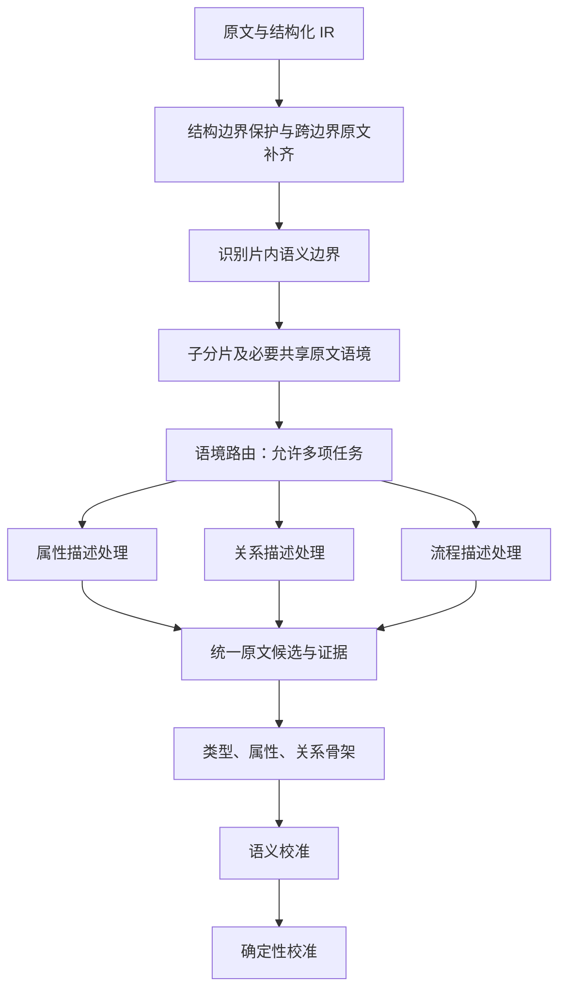

# 图谱分析语义分片与语境路由设计

日期：2026-10-04。状态：设计稿，尚未实现或进行真实模型验证。

本文承接[运行 7eb2e578 瓶颈分析](图谱分析运行7eb2e578瓶颈分析-20261004.md)，
修正“先缩减片内上下文”的优化顺序。目标是保证处理任务所需的原文语义，
再减少无关内容与重复处理；不以输入更短作为质量或效率已经改善的证明。

## 1. 用户要求与处理顺序

1. 初始分片避免截断完整表达，以及主体、条件、表头、步骤等必要上下文。
2. 分析片内的语义断裂点，将不同语境拆为可独立处理的子分片。
3. 判断分片或子分片中的语境，由语境路由分配到属性、关系、流程处理器。

“独立子分片”表示本次处理所需的语境充分，不表示只能读取该子片中的字符。
同一主体的标题、适用条件、多级表头或先行词可以由多个子片共享引用。
模型声明“语义完整”不能单独证明完整性，仍需检查边界依赖并用反例验收。

## 2. 当前实现与差距

下表依据当前工作区源码；不将本设计视为已部署行为。

| 环节 | 当前行为 | 需要补足的部分 |
|---|---|---|
| 初始窗口 | `source.build_windows()` 按章节、来源数和字符预算打包，保留部分段首与表头，同一表格行尽量成组 | 小节可因预算允许而合并；没有统一的语义边界判断 |
| 长原文单元 | 大节中的 source 按 1800 字符、1600 步长形成片段 | 200 字符重叠不能保证主体、条件或完整句子跨边界保留 |
| 超预算拆分 | `continuation.split_reading_window()` 优先按组分配；单 source 可按字符中点及有限重叠拆分 | 有结构保护，但尚不能证明分割点为语义边界 |
| 局部实体输入 | `controller.entities()`、`context_entities()` 已按当前窗口筛选相关实体和可见字段 | 不应再把“只携带当前片相关实体”当作待新增能力 |
| 类型批次 | `planning.context_window()` 从完整 `base_window.sources/fields` 构造输入，再补齐选中实体的证据 | 小批次仍可能重复完整阅读片；收窄前需要明确语义依赖 |
| 属性、关系批次 | `work_execution.work_context()` 已按任务端点、字段及证据依赖构造上下文，并补充结构信息 | 可以复用，但仍需验收复杂条件、回指与跨边界表达是否充分 |
| 语境路由 | 已有类型、属性和关系对齐阶段，本体卡排序用于指引 | 尚无完整的“语义边界分析 → 子片语境路由 → 专项发现”流程 |

源码：[source.py](../backend/app/services/document_harness/source.py)、
[continuation.py](../backend/app/services/document_harness/continuation.py)、
[controller.py](../backend/app/services/document_harness/controller.py)、
[planning.py](../backend/app/services/document_harness/planning.py)、
[work_execution.py](../backend/app/services/document_harness/work_execution.py)。

## 3. 分片完整性与语义边界

### 3.1 先保护结构与跨边界依赖

字符数用于估算请求大小，实际打包需要计入原文、指引、Schema 和回答预算。
分片边界优先落在完整句群、键值组、表格记录、步骤内完整操作等位置。
页码变化、换行、单个标点、固定字符数均不能单独证明可切分。

| 内容 | 必须一起解释的上下文 |
|---|---|
| 字段描述 | 字段名、完整原值、实际主体，以及原文给出的单位和限定 |
| 条件或否定 | 条件与其管辖的断言、否定词与被否定内容、例外条款 |
| 表格 | 表题、适用的多级表头、行主体、单位、条件列及相关脚注 |
| 工艺操作 | 步骤作用域、动作、参与物料、操作参数及其归属 |
| 回指 | “该产品”“上述中间体”“所得物”等表达及有原文依据的先行词 |

跨页表只有在结构或原文足以证明续表关系时才延续表头；不能只凭相邻页面拼接。
长步骤允许拆为多个操作子片，但每个子片仍须携带必要的步骤作用域和物料指称。
无法在预算内组成充分上下文时，保留未完成或未决原因；不能静默截断字段或标记完整。

### 3.2 再判断片内语义断裂点

标题层级、明确的新步骤、表格主体变化、独立主题转换可提出候选边界。
接受边界前检查：两侧是否仍共享未结束的条件、主体省略、回指、比较或步骤承接表达。
相似度下降只能辅助定位，不能替代这项检查。

对候选边界作三种处理：

1. 两侧各自可解释：拆为独立子片。
2. 两侧任务不同，但依赖可定位的共享上下文：拆分并携带必要原文引用。
3. 无法明确依赖范围，或拆开后语义仍不充分：保持同一处理单元，必要时补读相邻原文。

“同一主体从分子式转到分子量”不必为了字段变化而拆片；
“从中间体 A 的性质转到中间体 B 的性质”通常可提出边界，仍需检查共同条件。
“步骤1结束、步骤2开始”可分片，但步骤间显式的承接句必须保留。
语境变化不强制对应一次额外模型调用；多个小子片可以带清晰作用域一起打包。

### 3.3 区分主阅读范围与共享证据

复用 `DocumentIR` 的来源 ID、字符坐标、章节和表格坐标。
子片保存当前主阅读范围及必要上下文的引用，原文仍从同一 IR 获取。
共享上下文保留原文及精确定位，摘要只能帮助查找，不能替代事实证据。

主阅读范围负责覆盖统计；共享标题、表头和先行词不重复增加覆盖量。
同一原文位置被多个处理器读取时，复用既有提及和字段；
不同原文位置的同名提及仍分别保存，身份合并留给既有共指流程。
“辅助上下文”不降低引用权限，也不能成为忽略其中必要事实线索的理由；
每段待分析正文仍需有对应的主阅读任务，不能仅因作为上下文曝光就记为处理完成。

## 4. 语境路由与三个处理器

路由依据完整子片及共享语境，结合冻结本体选择处理任务。
路由结果包含子片范围、必要上下文引用、适用的处理类别，以及仍缺少的上下文。
这些是当前窗口计划的一部分，不另建一套原文、实体或图谱存储。

三类语境描述的是阅读任务，不能硬编码成互斥的事实类型。
例如流程片中常同时含属性和关系，应由流程处理器组织步骤语境，再分派必要子任务；
共享同一批提及、字段与线索，避免三个处理器各自完整重读、重复造候选。

| 处理器 | 主要判断 | 候选输出与边界 |
|---|---|---|
| 属性描述 | 谁的什么属性、完整原值、单位、条件、表格各维度的归属 | 原字段与候选主体；本体匹配在骨架阶段完成，单位规范化在确定性阶段完成 |
| 关系描述 | 关系参与者、方向、角色、否定、条件，表达是否真的建立联系 | 带定位证据的关系线索；目录、邻接、共现不能单独证明关系 |
| 流程描述 | 步骤、步骤内操作、投入与产出、设备、参数和明确执行顺序 | 步骤及参与者提及、原字段、关系与顺序线索；不凭相邻标题自动建立物料流 |

路由不确定时保留混合任务或沿用通用发现来覆盖未归类内容，不能将其静默跳过。
路由只组织处理和指引优先级，不提前确认实体类型或最终事实，也不因低分排除合法发现。
纯目录只用于定位正文和辅助路由；若只有标题没有正文证据，应明确尚未形成事实候选的依据。

### 4.1 属性描述示例

对于“分子式：C26H25F2N7O2S；分子量：537.18；项目名称：HRS-5592”，
先依据该段或共享标题定位实际物质主体，再保留三个原字段。
不能仅因这些字段并排出现，就把项目名当作物质名称或全局唯一身份。

当前本体的候选映射为 `slpra-drug:molecularFormula`、
`slpra-drug:molecularWeight`、`slpra-drug:projectName`，各自仍受 domain 和原文归属约束。
若项目名仅描述报告，不能自动挂到文中每个物料。
原文值照实保留，不能在发现阶段据外部知识改写数值或补造单位。

产品毒性或毒理表可以以属性阅读为主，但需把种属、给药途径、暴露周期、剂量、
终点等实际列明的维度保留下来。具体字段按本体及正文确定主体，
不能把各试验条件下的结果压成产品的无条件单值属性；涉及试验与物质等联系时可追加关系任务。

### 4.2 “得量收率、存放条件、溶解度”示例

这些栏目可以提供语境路由线索，但不是统一的“关系类型”。当前权威 TTL 中：

| 正文内容 | 已有本体定义 | 处理要求 |
|---|---|---|
| 收率范围 | `slpra-dev:yieldRangePercent`，数据属性，主体为 `SynthesisStep` | 保留范围、基准及限定，定位实际步骤 |
| 得量范围 | `slpra-dev:outputMassRange_kg`，数据属性，主体为 `SynthesisStep` | 保留原值和单位；规范化不能提前覆盖原文 |
| 溶解度／溶解性 | `slpra-drug:solubility`，数据属性，主体为 API 或药物制剂 | 保留溶剂、温度、pH 等已给条件，不能跨物质转移 |
| 存放条件 | `slpra-dev:hasStorageCondition`，对象属性，指向 `StorageCondition` | 识别条件实体及其字段，再确定有证据的归属关系 |
| 中间体与成品的其他信息 | 不是单一谓词 | 根据正文分别形成实体、属性或关系任务 |

`hasStorageCondition` 当前定义的主体为 `CMCReport`、`SynthesisStep` 或
`ProcessIntermediate`；不能为适配例子私自扩展到 API。
本体无法合法表达或主体仍不明确时，保留原字段／线索及未对齐状态，不编造谓词。

依据：[slpra-drug.ttl](../ontology/slpra/slpra-drug.ttl)、
[slpra-drug-development.ttl](../ontology/slpra/slpra-drug-development.ttl)。本设计不修改 TTL。

### 4.3 流程描述示例

“步骤1 SM5592-A14的合成”和“步骤2 SM5592-A15的合成”可作为步骤子片的候选边界。
处理器分别保留步骤标题及其管辖正文，区分步骤实体与物料实体，并识别正文中的动作、
投入、产出、设备和参数。正文明确关联时才提出 `usesMaterial`、
`producesIntermediate` 等候选；对 `hasStep`、`nextStep` 等同样核对原文依据。

仅有两个相邻标题，不能证明步骤1的产物必然投入步骤2。
正文明确“将上步所得 SM5592-A14 投入……”时，需要引用上步产物与本步投入表达，
再提出跨步骤候选。跨子片证据通过已有引用和任务依赖传递，不能因局部分片删去这项联系。

## 5. 与当前四阶段的最小整合

保留[四阶段顺序](../specs/035-independent-document-harness/contracts/four-stages.md)：
原文发现 → 骨架 → 语义校准 → 确定性校准。

1. **原文发现内部**：结构保护、语义边界判断和路由组织阅读；专项处理器统一输出
   现有 `entities`、`fields`、`hints`、`reference_cues` 与阅读进度，不提前采信事实。
2. **骨架阶段**：复用既有类型、属性与关系对齐。类型批次的上下文可在必要语义依赖
   明确后收窄，保留完整原值、主体依据、限定和回指；路由标签不能代替本体对齐。
3. **后两阶段**：继续核对身份、归属、方向、极性、条件和时间，再执行规范化与确定性检查。
   路由成功不能直接视为语义校准通过。

结构明确的边界优先用现有 IR 判断；需要模型分析时，可在同次阅读规划中给出边界和路由，
已经取得且符合现有证据契约的发现结果应复用。不强制每个子片依次新增“分片模型调用、
路由模型调用、三个处理器调用”，避免把减少上下文的收益耗在新增串行步骤上。

当前窗口的划分和路由结果复用窗口计划及权威当前状态；暂停后沿用该计划继续。
原文仍使用冻结 IR，图谱仍使用现有实体、字段、线索与候选状态，调用仍进入现有账本。
只补充完成分片与路由所需的计划信息，不引入独立调度服务、插件框架或历史快照。
若进入实现，应先将本设计中确认的需求与验收同步到 035 的规范、契约和任务。

## 6. 验收与性能比较

下列为待执行验收，不表示本次已通过：

| 场景 | 应验证的结果 |
|---|---|
| 固定字符边界落在长中文条件句中 | 条件与结论仍一起可读，不因重叠过短丢失限定 |
| 主体在上一段，下一段只有属性 | 子片携带主体原文依据；证据不足时不猜归属 |
| 分子式、分子量和项目名称并列 | 字段完整；项目名不被直接当成物质身份 |
| 跨页表、多级表头、行主体及脚注 | 延续关系有依据；每个值保留所属列、主体、单位和适用条件 |
| 毒理表中不同种属／途径／剂量 | 不将有条件结果折叠为无条件产品属性 |
| 同片从物料 A 转到物料 B | 可分子片；共同条件仍按其作用域保留 |
| “不适用于”“除……外”“仅在……” | 否定、例外和条件不因边界或路由而丢失 |
| 步骤内同时含产出、收率和存放要求 | 按需生成属性与关系任务，共享提及并避免重复候选 |
| 相邻步骤标题与明确上步产物回指 | 前者不自动造物料流，后者保留跨子片证据并可被识别 |
| 只有目录标题、或语境无法确定 | 不凭目录造事实，不把未归类正文视为已处理 |
| 最小充分上下文仍超预算 | 明确未完成，不截断原值或虚报覆盖完整 |

真实评测使用同一文档、冻结本体、模型、参考与预算，新建运行。
先检查主体归属、条件保持、字段／关系召回、误造事实和覆盖，再比较端到端时间、
分片与路由新增耗时、各阶段请求数、输入／输出 Token 和重复提及判断次数。
未决、未完成及技术失败分别计数，不能从分母移除以制造改善。

此前近 4400 秒是发现与类型对齐的累计请求耗时；输出量、重复类型比较、展示缓存处理
仍有独立成本。语义分片与路由可能减少重复任务，但不能据输入缩短比例预测加速幅度。
本次仅完成设计和源码／本体核对，没有修改处理器、启动模型评测或部署。
