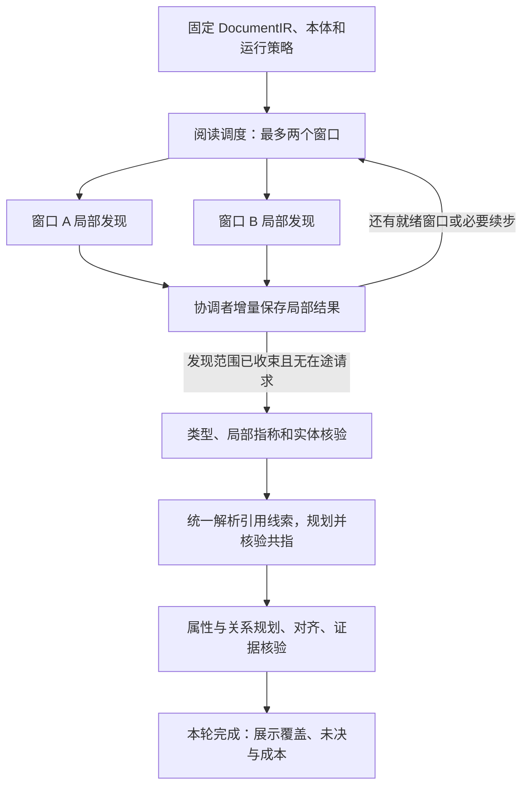

# 图谱分析阅读窗口并行与后置共指重构方案

日期：2026-10-01。状态：并行主流程已按 Spec Kit 实施并部署，工程、HTTP 与合成 API 浏览器验证通过。
后续主阅读范围、目录缓存、共享指引、免整窗重答和双进度修正及真实 GPT 阅读测量见
[阅读效率验证](../specs/035-independent-document-harness/validation-reading-efficiency.md)；并发 1/2 的完整性能和事实质量对照仍未执行。

实施与验证记录：[validation-parallel-reading.md](../specs/035-independent-document-harness/validation-parallel-reading.md)。
以下“现状”表记录重构前基线，目标契约已由新主流程替换。实际请求准备在 `Engine.discovery_input()`，
传输端口为 `Repository.submit_prepared()/collect_prepared()`；局部解码/合并在 `reading.py`。
旧运行不做状态转换，需新建运行使用默认两窗口并发。

本文独立定义本次重构的范围、状态、执行契约、代码任务和验收条件。前期调查见
[双批次依赖核验](图谱分析双批次并行依赖设计-20261001.md)；实现本方案不要求同时实施其中的属性菜单、关系对齐及证据核验并行。

## 1. 需求与固定决定

用户已明确：阅读窗口之间可以独立抽取，只保存当前窗口中的实体提及、属性原字段等；
暂不处理跨窗口共享实体和线索依赖，共享实体交由后续共指分析统一处理。

| 编号 | 本次必须实现的行为 |
|---|---|
| R1 | 同一文档最多两个阅读窗口并行发现；一个窗口完成即可补入下一个 |
| R2 | 窗口请求不消费其他窗口正在生成的提及、字段归属或身份判断 |
| R3 | 局部结果及时保存并可展示；保留原文定位、字段原值、局部归属候选和原文线索 |
| R4 | 局部发现结束后，完成必要的类型/局部指称/实体核验，再统一生成共指候选并核验 |
| R5 | 共指统一身份；属性归属、关系及关系组仍按原文分别证明 |
| R6 | 保留暂停、继续和已保存回答复用；一个当前恢复入口管理全部在途请求 |
| R7 | UI 区分阅读发现、实体核验、共指和图谱工作进度，不能把局部保存标成分析完成 |

固定实施选择：

- 首版并行范围仅为阅读发现，包括既有发现草稿/查询反馈/完整回答流程；类型、指称、共指和图谱工作先串行。
- 默认 `reading_concurrency = 2`，仅允许 `1` 或 `2`；`1` 用于同一新流程的对照验证，不保留旧串行流程。
- 两个窗口合计最多两个 GPT 在途请求，每个窗口最多一个；不会变成“两窗口各两请求”的四路调用。
- 发现阶段汇合后才开始实体处理。允许原文范围存在已标明的未完成项，但技术失败不能当作发现成功。
- 使用现有模型调度、数据库表、当前状态、付费回答账本及展示缓存；不增加任务中间件、窗口租约或历史快照。
- 仅支持新建运行。直接替换旧执行契约，不转换旧运行、不增加兼容分支、不修改活动运行。
- 完成必要验收后，新建运行默认启用两窗口并行。本文不授权现在重启服务或继续任何活动任务。

“实体”在发现阶段指有原文位置的提及候选；“属性”首先指原字段，不代表已完成本体谓词对齐或事实采信。

## 2. 已核验的现状与重构落点

| 当前实现 | 已存在的行为 | 本次修改 |
|---|---|---|
| `source.build_windows()` | 按段落、表格和预算生成窗口；可共享标题/表头等原文上下文 | 保留分窗与引用权限，不要求原文范围互斥 |
| `Engine.run()` / `advance()` | 单个 `active_window_id` 驱动一个窗口走完整阶段 | 拆成阅读、实体、共指、图谱四个执行阶段 |
| `Engine.discover()` | 从全局实体构造可见 `known_mentions`，排序类型卡后调用模型 | 去掉其他窗口结果输入，准备不可变的窗口请求 |
| `register_discovery()` | 原文校验、实体/字段登记、共享根字段更新和阶段推进混合 | 拆成局部结果解码与协调者合并；局部结束不触发全局规划 |
| `lookup.run_discovery()` | 草稿 → 一次有界本地查询 → 完整回答；通过 `lookup_work` 继续 | 改成可交错的窗口续步，保留查询能力与原字段保留规则 |
| `Repository.prepare_batch()` | 一个 `active_batch`；账本保存精确请求和回答 | 一个恢复入口中的小型 `active_batches` 映射，首版上限二 |
| `Engine.raw_call()` / `commit()` | `_call_*` 和 `_paid_ready` 是单批临时状态 | 调用上下文显式传参，提交只移除指定批次 |
| `plan_work()` | 在每个窗口内扫描全局实体、解析引用并创建属性/关系/共指工作 | 拆出全局引用解析、共指规划和图谱规划，分别执行 |
| `candidate_pairs()` | 只消费已有、带原文线索的共指工作，且要求端点已核验 | 在统一实体处理之后生成候选，保留准入要求 |
| `canonical_mentions()` / `project_coreferences()` | 依据一致的共指证明投影统一节点，保留原始提及与事实端点 | 继续复用；不把展示合并误当作共指模型核验 |

源码依据：
[controller.py](../backend/app/services/document_harness/controller.py)、
[runtime.py](../backend/app/services/document_harness/runtime.py)、
[source.py](../backend/app/services/document_harness/source.py)、
[lookup.py](../backend/app/services/document_harness/lookup.py)、
[work_execution.py](../backend/app/services/document_harness/work_execution.py)、
[coreference.py](../backend/app/services/document_harness/coreference.py)。

## 3. 目标流程与阶段边界



| `cursor.phase` | 允许的处理 | 转出条件 |
|---|---|---|
| `reading` | 窗口准备、类型卡精排、局部发现及其查询续步、拆分、局部保存 | 无待发现叶窗口、无在途/待应用批次、无技术失败 |
| `entities` | 按确定顺序处理类型对齐、局部指称/成员划分、实体核验 | 所有实际存在的提及已执行其可执行检查；缺证保留未决 |
| `coreference` | 全文引用解析、有证据的候选生成、共指核验 | 无可执行共指工作；waiting/pruned/unresolved 显式保留 |
| `graph` | 属性、关系、关系组解释及证据核验 | 无可执行工作、无在途批次、无技术失败；范围限制仍展示 |
| `done` | 只读展示 | 不自动触发模型 |

阶段处理与工作状态分开：`reading.complete` 只表示原文发现覆盖；`done` 表示当前策略下可执行流程结束，
不表示全文所有关系已穷尽或所有实体均已统一。后续属性/关系核验只报告类型疑点时沿用现有观察机制，
不为本次并行增加“回到全文发现重新执行”的循环。

## 4. 局部发现的输入与输出

### 4.1 输入冻结

拟新增 `reading.py`，由其纯准备函数构造下列输入；不复制 `Engine.state` 给模型线程。

```text
LocalReadingInput
  window_id, window_plan
  sources, fields                    # 现有 window.payload() 的本地别名
  document                           # 固定文档标签、根类型及根属性定义
  schema_guidance                    # 当前窗口已保存的精排类型卡
  lookup_capabilities?               # 当前窗口已取得的本地查询能力
  policy                             # 创建运行时冻结的模型/执行策略
```

约束：

1. 删除发现输入中的全局 `known_mentions`；不注入全图、共指结果或文档根累计字段列表。
2. 必要标题、表头和引导语仍来自固定原文，沿用当前可见来源的同等引用权限，不限制模型只能引用主范围。
3. `document` 使用创建时的文档前提；不能随另一窗口新发现的文档字段变化而变化。
4. 原文、本体和模型策略在运行内固定。精排输出继续使用独立 ranking 存储；准备工作由协调者串行完成，
   不把现有 `Repository.rank()` 直接放进模型线程共享 Session。
5. `stage_schema()` 仍同时用于模型输入和回答校验。发现提示明确要求逐物理位置登记提及，并保存
   `ReferenceCue` 的 identifier/alias/anaphora/explicit_reference，不提前判断其他窗口目标。

### 4.2 局部输出契约

复用现有 `Discovery`、`DiscoveryDraft`、`DiscoveryRefinement` 模型；不增加第二套实体 JSON 协议。
`decode_local_discovery(ir, window, answer, lookup_info)` 只做来源校验、局部别名还原和规范化，返回：

```text
LocalDiscoveryDelta
  window_id
  mentions[]                         # 原锚点、角色、名称引用、证据、局部字段关联
  fields[]                           # 标签、完整原值、缺失标记、原值引用
  document_field_ids[]
  hints[], reference_cues[]           # 原文表达及局部端点，不带跨窗口 target_ids
  observations[], source_candidates[] # 保留未归属字段及既有查询候选，不证明身份
  discovery_complete, capacity_hit   # 复用既有容量/有效性检查
```

输出不包含 `class_iri` 的最终确认、canonical entity ID、accepted 属性或关系。
实体、字段、条件/否定、局部关系线索全部带可核对原文；无效引文保留既有异常观察并影响完成判定。
未匹配字段、无主体字段及查询草稿中未被完整回答保留的字段继续保存，不因归属未决丢失。

### 4.3 查询续步

不删除现有发现查询能力。一个窗口的因果顺序仍为：

```text
plain discovery
或 draft → 本地 lookup → refine
```

- `draft` 没有查询请求时，直接把草稿中的 `Discovery` 部分作为局部结果应用。
- 查询不可用、无能力、反馈超预算等采用现有明确分支；查询不能凭空给原文添加实体事实。
- 本地查询在协调者中执行，不占 GPT 槽位；另一个模型请求可继续运行。
- 查询反馈必须先保存再准备 refine。继续时复用已保存反馈，不重新查询已完成的续步。
- `lookup_work` 改为仅保存 `draft_call_key` 和必要的查询反馈；草稿/payload/schema 从现有请求、回答账本读取，
  不在窗口行再存一份模型回答。完成局部应用时移除该窗口 `lookup_work`。
- 每个窗口一次有界查询的限制不变；不因并行增加查询轮数或查询范围。

## 5. 当前状态与确定性合并

### 5.1 存储决定

继续使用 `DocumentRunCurrentState` 的 JSON 分区、`DocumentRunRequest`、`DocumentRunResult`。
本设计不要求新数据库表或列，无须为它新建 Alembic 迁移；实施时若发现必须变更物理表，先回写设计。
只保存当前工作状态；精确请求、回答和成本仍由现有账本负责。

```text
cursor/main
  phase: reading | entities | coreference | graph | done
  stage: 现有公开模型/处理阶段
  entity_window_id: string | null
  active_batches: { batch_id: BatchRef }   # reading 最多 2；后续阶段最多 1
  reading: 当前原文区间覆盖统计
  reading_windows: 当前叶窗口统计

BatchRef
  batch_id, call_key, stage
  window_id: string | null
  step: plain | draft | refine | stage_call
  targets: [{domain, id, dependency_hash}]
  alias_bindings, source_bindings

windows/<id>
  plan, order, parent_id, children, depth  # 复用原有内容
  reading_state: pending | split | complete | incomplete
  entity_phase: type_alignment | referent_alignment | entity_review | done
  guidance_class_iris
  lookup_work?: {draft_call_key, feedback?}

window_entities/<id>
  ids: 该窗口登记的物理提及 ID 集合
```

`entity_phase` 初始为 `type_alignment`，仅在 `cursor.phase == entities` 时消费。
正在调用从 `active_batches` 判断，调用失败从账本/运行失败状态判断，不再给窗口复制 running/failed 状态。
`split` 父窗口不是待调用窗口；其覆盖由后代叶窗口决定。原有 `active_window_id`、`active_batch`、
`discovery_attempted` 等被上述当前字段替换，不建立新旧双写。

`batch_id` 表示应用目标，按窗口、续步、目标和来源绑定及 `call_key` 稳定生成；`call_key` 继续表示
精确 stage/payload/schema/policy。两窗口偶然产生相同请求正文时，允许多个应用目标引用一个已付费回答；
运行时按 `call_key` 只派发一次，不把窗口号添加到模型正文以强制制造不同收费请求。

### 5.2 稳定身份和合并规则

协调者根据当前权威状态计算增量，禁止把局部调用前捕获的整行实体覆盖回数据库。

| 对象 | 身份及合并规则 |
|---|---|
| 实体提及 | 沿用 `identity("mention", anchor, role)`；不同物理位置不因同名合并 |
| 同一提及的重复抽取 | `field_ids`、证据和窗口成员关联去重并集；处理顺序不影响结果 |
| 原字段 | 沿用 `identity("field", evidence)`；同一原文的确定性字段复用，不以标签/值字符串全局去重 |
| 文档根 | 始终只有已知的 `document`；追加字段关联取当前并集 |
| 关系/引用线索 | 沿用原文与端点身份，证据去重；引用目标在全局阶段才解析 |
| 观察 | 保留窗口来源和候选主体；同一键的证据/主体集合合并，不能覆盖已保存的子结果 |
| 来源查询候选 | 相同提及下按原来源候选身份合并，保留各自证据与身份未确认状态 |

为避免先返回的窗口决定后续执行：实体 `window_id` 作为核验归属窗口，固定取实际登记该提及的窗口中
`(order, id)` 最小者。`window_entities` 保留全部成员关联；不增加另一份实体集合。

实体当前行增加 `name_candidates`，仅保存局部发现提出的去重名称引用，不保存窗口回答副本。
每次将新名称引用与该集合求并集，再派生 `name`：无引用则为空；只有一种原文名称时按稳定坐标取引用；
有不同名称时置空，并以锚点原文作为 `label`，更新带完整候选引用的冲突观察。
名称缺省不删除已保存名称，也不能让第三个返回的回答清掉前两个回答形成的冲突。
后续 `entity_input()` 将这些引用作为名称候选交给核验，不把展示标签当作已证明的专有名称。
不同角色仍是不同提及假设，交由既有局部核验。
合并集合按稳定原文坐标/ID 排序，保证固定回答在任意返回顺序下得到相同业务状态。

### 5.3 拆分与覆盖

- 输入超预算或完整回答触发容量/有效性限制时，复用 `split_reading_window()`，最大深度沿用 4。
- 父窗口中已合法保存的提及和字段保留；子窗口使用自己的固定原文，不注入父窗口模型结果。
- 子计划、父 `split` 状态、局部结果和移除本批恢复项在同一业务事务内提交。
- 子窗口可占用下一个空闲槽位；父窗口不等待子窗口完成关系图谱才结束发现。
- 无法继续安全拆分时记 `incomplete` 并保留范围观察。技术失败不能转成 `incomplete` 伪装为缺证。
- 原文覆盖仍按根窗口主区间与已完成叶窗口主区间求并集；父子/相邻上下文重叠不重复计字符。
- 发现阶段收束要求所有叶窗口为 complete/incomplete，且没有在途或待应用请求。
  `reading.complete` 仅在所有有效叶窗口均 complete 时为真；空白/导航内容沿用现有排除规则。

## 6. 模型调用与业务提交解耦

### 6.1 最小执行结构

在 `runtime.py` 使用运行内最多两个工作线程执行现有 `call_model()`，不新增后台服务。
主协调者独占 Harness 的 `Engine`、`Repository` 和业务数据库 Session。

| 协调者职责 | 模型线程职责 |
|---|---|
| 选窗口、精排/查询、冻结请求、准备账本和当前恢复项 | 接收不可变请求，执行模型传输 |
| `begin_attempt`、收集完成事件、验证和 `finish_attempt` | 返回结果/异常、usage 和耗时 |
| 局部结果解码、读取当前状态、合并提交、阶段推进 | 不读写 Engine，不调用业务 Repository |
| 暂停/失败判断、续步和全局阶段调度 | 感知租约丢失/取消信号，沿用现有传输超时 |

工作线程须显式进入 `model_scope(run_id, stage, bind, should_stop)`；不能假设线程继承上下文变量。
`bind` 是底层连接工厂/引擎，现有全局模型调度自行开连接；不能传入协调者 Session。
普通暂停只停止新派发，不能用暂停标志立即中断已开始请求并丢失可保存回答。
租约失效仍按既有 fence 契约停止写入；不为保存晚到回答绕过运行归属校验。

### 6.2 明确的函数边界

下列是拟新增或重构的内部契约，不是已经存在的 API：

```text
reading.build_discovery_request(ir, catalog, window, document, guidance, lookup_state, policy)
    -> CallIntent(stage, payload, schema, target)
reading.decode_local_discovery(ir, window, answer, lookup_info)
    -> LocalDiscoveryDelta
reading.merge_local_discovery(state, delta, window_order)
    -> changes                         # 不执行 I/O，不推进其他窗口

Repository.prepare_batch(intent)
    -> BatchRef, updated_cursor        # 准备请求及追加恢复项，原子提交
Repository.dispatch_prepared(batch)
    -> cached_result | pending         # 协调者开始计账，线程只执行传输
Repository.collect_completed(timeout)
    -> [SavedCallOutcome]              # 返回前已完成校验、回答保存和结束计账
Engine.apply_batch(batch_id, changes)
    -> None                            # 校验目标、提交增量并仅移除本恢复项
```

`prepare_batch` 返回的 cursor 和应用后的业务增量必须同步到 Engine 内存状态，不能继续用准备前的 cursor
覆盖另一个批次。后续串行阶段也使用同一批次契约，只是容量为一；删除依赖 `_paid_ready` 自动清空入口的路径。
类型菜单、指称等现有中间状态继续在各自当前工作行保存，不能因为改调用层而失去其恢复语义。

### 6.3 调度伪代码

```text
while cursor.phase == reading:
    保存已完成请求；若允许应用，则按当前状态应用局部结果或记录窗口续步
    若暂停/运行失败：停止补位，等待已派发请求保存结束，退出
    当 GPT 请求槽位空闲：
        优先恢复已登记的批次/续步，再按 (order, id) 选择就绪窗口
        做必要的本地准备；再次检查暂停/容量
        原子准备请求和批次；已存在回答则直接复用，否则派发
    若所有叶窗口已收束，且无待应用批次：原子转入 entities
    否则短时等待任意请求完成，并继续检查控制状态
```

不按最早派发顺序阻塞收取结果；快窗口先保存先释放槽位。草稿完成后执行查询/准备 refine，
不等待另一窗口；存在相同 `call_key` 时只运行一个传输，其完成结果分别应用于对应的目标绑定。
等待模型期间不持有业务行锁。精排/本地查询仍可能耗时，必须计入性能对照，不宣称两槽一定始终占满。

### 6.4 原子性与回答适用性

1. 准备事务：检查现有 fence、窗口续步和请求大小，保存精确请求及 `BatchRef` 后再派发。
2. 调用开始事务：沿用 `begin_attempt()`；随后释放锁等待模型。
3. 回答事务：使用冻结 payload/schema 执行 `validate_paid_output()`，回答/失败信息与 usage 原子保存。
   重复完成事件不重复计费；部分未知用量仍为未知。
4. 应用事务：在当前 fence 下检查目标窗口/续步、原文/策略/绑定未变，合并局部业务增量、更新窗口，
   更新必要统计及展示，移除对应 `batch_id`，一起提交。
5. 另一窗口新增实体或文档根字段不会使本窗口回答失效，因为这些不是冻结请求的语义输入。
   整个 run revision 变化也不能作为拒绝局部回答的条件。
6. 恢复项已移除说明业务应用已完成。重复交付该结果为无修改返回，不能再次追加字段或重复拆分。

首版不派发存在输入依赖的两个发现续步；同窗口 draft 与 refine 始终有明确前后顺序。
所有局部写冲突由第 5 节的合并解决，不建立通用读写锁图或并行图谱事务框架。

## 7. 暂停、继续和失败

| 情形 | 固定行为 |
|---|---|
| 用户暂停 | 停止新窗口、查询续步及自动重试；已开始模型请求按现有超时返回并保存；不推进新业务阶段 |
| 暂停时有完整回答 | 保存回答和成本，保留待应用 BatchRef；全部已派发请求结束后完成暂停 |
| 继续 | 先加载当前状态及全部 BatchRef，复用已保存回答并应用，再补位 |
| 已准备但尚未调用 | 继续使用原 payload/schema/绑定，调用一次 |
| 调用后进程退出、回答未保存 | 结果与费用可能未知；按现有账本记录未知尝试，继续时才允许重新派发；不承诺模型端 exactly-once |
| 一批技术失败、另一批仍在调用 | 停止补位，收取并保存另一批的回答，再报告运行失败；不把另一批已付费结果清掉 |
| 应用事务失败 | 回答保留，业务与移除入口全部回滚；继续时只重做应用 |
| 传输失败 | 仅沿用既有两个可重试错误和最多三次尝试；每次均计账，暂停后不重试 |
| 完整回答格式或语义校验失败 | 保存失败回答并停止，不以继续为由重新扣费请求相同输入；修正输入契约或新建运行后另行处理 |
| 租约丢失/运行删除 | 服从现有 fence/删除契约，旧协调者不能保存或应用晚到结果；不建设额外自动恢复路径 |

协调者等待期间定期检查控制状态，不在单个 Future 上无界阻塞。租约保活继续使用现有 `LeaseKeeper`，
不为窗口单独保活。两个结果的保存和账户增量由协调者串行执行，避免共享统计最后写入覆盖。

恢复时必须验证 `batch_id → window/step → source_bindings`，不能仅按同阶段任选一个窗口应用。
后续阶段的单批请求使用相同规则；菜单分片、指称候选/选择和组解释现有恢复用例必须继续通过。

## 8. 实体处理、后置共指与图谱工作

### 8.1 实体处理

阅读阶段收束后，按窗口 `(order, id)` 执行现有类型对齐、局部指称和实体核验。
处理目标是归属该窗口的实体；同一物理提及不会在每个读到它的窗口重复支付检查。
完整输入通过 `context_window()` 从当前提及的字段与证据构建，不能因归属窗口较小而丢掉其他窗口
对同一物理提及补充的合法原文。文档根上下文继续按当前所需原文过滤，不把全文根字段塞进每次请求。

局部指称拆分产生新成员时：

- 复用 `referents.rebind_clues()` 的方向、组成员及歧义保留规则。
- 同时更新所有包含原提及的 `window_entities`、线索与现有相关工作引用，不能只修改当前窗口列表。
- 成员的归属窗口沿用产生它的确定归属；重建当前实体索引，后续全局规划从变更后的实体开始。
- 有同一锚点冲突观察时把对应原文带入实体核验，不静默丢掉另一个候选解释。
- 类型未决、原文不支持或指称未决不阻断其他实体；后续共指准入不被放宽。

### 8.2 全局引用解析和共指候选

从 `collect_relation_seeds()` 提取 `resolve_reference_cues(ir, state, index, policy)`，
只解析线索目标并记录截断/未决，不同时运行关系精排或创建属性任务。
在 `entities` 结束后，使用完整当前实体索引统一解析全部已保存引用。

新增 `plan_coreference_work()`，候选来源限定为：

1. 没有关系谓词标签的显式引用、别名和指代线索，复用当前 `ReferenceCue` 行为。
2. 已有局部身份绑定中的编号引用，且本体身份属性、编号作用域及其原文依据齐全。
   用 `(身份属性, 已有命名空间/作用域, 原值)` 倒排定位候选；字段同值本身不是身份证明。

第二类复用 `identity_binding` 和身份属性定义，不把 `source_candidates` 中尚未核验的外部记录身份
当作文档共指证明；作用域未知时不跨窗口按编号硬合并。名称相同、类型相容或同报告共现不新增无证据候选。

候选按原文位置稳定排序，每个引用/编号锚点最多取现有 `reference_targets_per_cue = 8` 个目标；
超限保留范围受限观察，不生成全实体笛卡尔积，也不通过循环轮转配额隐式跑全组合。
每对提及统一 `pair_id` 并合并 `clue_refs`，不因 A→B、B→A 两个线索重复核验。
端点不满足 `candidate_pairs()` 的已核验、类型兼容、指称明确条件时保留 waiting，不伪装成 different。

共指核验继续采用现有强证明、完整引文、置信度和一致组规则；不把 A=B、B=C 自动推成 A=C。
候选范围受限或证明不完整时，统一身份也可能保留未决，这是明确结果，不能为“全部合并”放宽证明。

### 8.3 共指决定如何使用

- `entities` 仍保存原始提及；`coreferences` 保存有证明的身份判断。
- 使用现有 `canonical_mentions()` 派生当前映射，不新存第二份 canonical 实体库。
- 展示统一节点及属性/关系端点，同时保留 subject/object mention ID 和每条断言的原始证据。
- 属性仍针对原提及及其原字段对齐、核验；不同位置给出不同值时分别保留，不选择最后一个值覆盖。
- 关系规划仍由原文线索生成，以原始提及作证据端点。无需因为共指统一就把所有字段复制到每个提及，
  也不生成统一实体间的全组合关系。
- 共指造成关系组成员数量变化时沿用未决处理，不能把完整组变成若干肯定边。
- 端点语义改变时复用现有 `invalidate_changes()` 撤销过期共指判断；映射只读取当前有效证明。
  没有新原文输入不重复全文发现。

首版“统一处理共享实体”指统一有证明的身份和图谱节点，不意味着物理删除提及或用归并后的标签
重新证明所有关系。跨窗口引用中本来带关系标签的线索进入关系规划，不能错误送入共指替代关系证明。

### 8.4 全局图谱规划及幂等

将原 `plan_work()` 拆成上面的共指规划和 `plan_graph_work()`：

- 从完整当前实体、字段、局部 hints 和解析后的 reference_cues 一次生成本轮属性/关系工作。
- 复用现有候选预检、弱候选配额、精排、规则证明及 `drain_work()` 处理函数；不增加模型阶段或扩大关系范围。
- 进入或恢复 `coreference`/`graph` 阶段时执行一次相应规划；不在每条模型回答返回时重扫全文。
- 同一工作 ID 且语义依赖未变时保留 status、output_ids、菜单进度和已付费调用绑定。
  禁止用新 `make_work()` 的 ready 默认值重置已完成工作；依赖实际变化才重建该工作的待执行状态。
- 相关输入指纹包括实际使用的名称候选、字段标签/原值/缺失标记、字段归属及局部身份绑定。
  当前工作指纹未完整覆盖标签/缺失/归属，编码时须补齐；窗口进度、账本计数及单纯采信状态仍不计作语义变化。
- 完成阶段转换与相应当前状态一起保存；规划中断时可用同一稳定输入重新计算，不依赖另一套计划快照。
- 核验创建的下游工作继续由现有业务变更触发；一次解释仍须独立证据核验，R/T 保持同请求。

## 9. UI、公开契约与策略

### 9.1 策略

在 `freeze_policy()` 的 `execution_policy` 中冻结：

```json
{
  "flow": "local_reading",
  "reading_concurrency": 2
}
```

其余策略沿用：请求预算 96000 bytes、单次输出 16384 tokens、拆分深度 4、关系每次最多 6 项、
证据核验每次最多 12 项判断、每引用最多 8 个目标。运行创建后不从环境动态改变并发度。
不调整平台全局模型槽位；单运行两路仍接受现有全局调度限额。

发现输入/指令及状态契约变更时，将当前模型协议统一更新为 `document-harness-v5`，不保留 v4 分支。
公开接口沿用现有路由与 Harness engine 标识，直接更新当前响应 schema；新执行器要求冻结策略为
`flow = local_reading`，旧策略给出明确“请新建运行”的不适用错误，不尝试转换其恢复状态。

### 9.2 进度字段

用以下字段替换 `windows_total/windows_discovered/windows_reviewed`，不维护旧计数别名：

```text
progress.phase: reading | entities | coreference | graph | done
progress.reading_windows:
  total:      当前叶窗口数，不含拆分父窗口
  saved:      reading_state 为 complete/incomplete 的叶窗口数
  complete:   reading_state 为 complete 的叶窗口数
  incomplete: reading_state 为 incomplete 的叶窗口数
  active:     active_batches 中不同阅读 window_id 的数量（0..2）
progress.reading:                       # 保留现有定义
  total_characters, processed_characters, complete
progress.scope_complete: reading.complete
```

统计满足 `saved = complete + incomplete <= total`；拆分后 total 可以增加。
父窗口已保存的候选继续展示，父窗口不重复计覆盖；active 包含已保存待应用的阅读批次，表示当前处理窗口，
不冒充正在网络传输的请求数。后续阶段 active 为零。
候选、事实、work_counts 和 stage_costs 保留；类型等非 work 阶段通过 phase/stage 表示，不伪造工作数量。

UI 文案示例：

```text
当前阶段：并行阅读
阅读窗口：局部结果已保存 8 / 12，当前处理 2，范围未完成 1
原文发现覆盖：……字符
局部候选已保存；跨窗口身份与关系将在后续核验。
```

阶段后续显示“实体核验 / 共指核验 / 属性与关系核验”。图上原始候选即时可见，不能在发现后显示统一身份已完成。
`graph.status` 未 finished 时，即使阅读覆盖 100%，也只说明原文发现结束。

同步修改：
[后端 schema](../backend/app/schemas/document_harness.py)、
[投影](../backend/app/services/document_harness/projection.py)、
[前端 API 类型](../frontend/src/lib/api.ts)、
[展示辅助函数](../frontend/src/lib/source-harness.ts)、
[进度组件](../frontend/src/components/analysis/source-harness-panel.tsx)。
GET、页面刷新及切换不启动模型；沿用鉴权、取消、no-store 和当前缓存一致性契约。
不新增窗口控制 API 或要求用户手动合并提及。

## 10. 编码文件与交付顺序

本文只交付方案。开始实现前，先把本方案需求同步至
[035 spec](../specs/035-independent-document-harness/spec.md)、
[plan](../specs/035-independent-document-harness/plan.md)、
[tasks](../specs/035-independent-document-harness/tasks.md)、
[data-model](../specs/035-independent-document-harness/data-model.md)、
[性能契约](../specs/035-independent-document-harness/contracts/performance-pruning.md) 及
[quickstart](../specs/035-independent-document-harness/quickstart.md)。
其中“一个当前批次”和“首版单运行顺序执行”须改为本方案范围；不修改本体或建立另一个引擎。

### 10.1 文件职责

所有后端相对路径均位于 `backend/app/services/document_harness/`。

| 文件 | 编码内容 |
|---|---|
| `reading.py`（拟新增） | 固定窗口请求、局部解码、确定性合并、阅读就绪/拆分判定；不导入数据库 |
| `controller.py` | 四阶段主循环、显式 BatchRef、窗口归属与实体处理；名称候选输入；移除共享 `_call_*`/`_paid_ready` 清理语义 |
| `runtime.py` | 单协调者运行内二路传输、显式模型上下文、准备/完成/应用事务、精确恢复和计账 |
| `lookup.py` | 将阻塞整条发现流程拆为 draft/query/refine 续步，账本引用取代重复保存回答 |
| `continuation.py` / `source.py` | 复用拆分与引用；必要时补齐新 reading_state 的转换，保持物理身份规则 |
| `referents.py` | 全部窗口已保存后的确定归属处理，以及跨 window_entities 的成员重绑 |
| `planning.py` | 提取引用解析；保留来源索引和配额；有作用域编号候选索引 |
| `work_execution.py` / `work.py` | 拆分共指/图谱规划；同依赖 upsert 不重置完成状态；保持字段语义依赖完整 |
| `coreference.py` | 复用准入、模型核验及映射；补齐后置调用与合并后的线索覆盖 |
| `protocols.py` / `model.py` | 新发现输入说明、协议标识、冻结并发策略；保留已有结构化输出约束 |
| `projection.py` / `accounting.py` | 新进度投影与当前增量统计；不靠 GET 扫历史账本 |
| `application.py` | 创建时冻结新策略，旧运行不适用校验；现有暂停/继续路由保持职责 |
| 后端 schema、前端上述文件 | 原子更新进度契约及文案，删除旧计数字段使用 |

### 10.2 可执行任务拆分

| 任务 | 依赖 | 可验收交付 |
|---|---|---|
| T01 契约同步 | 无 | 更新规范和本文定义的数据/UI 契约，固定并发与阶段边界 |
| T02 纯局部发现 | T01 | 抽出 reading.py；固定输入不随其他窗口 state 变化；假回答确定性合并 |
| T03 调用解耦 | T01 | prepare/dispatch/collect/apply 显式批次；模型线程不持有业务 Session；原串行阶段也使用同一契约 |
| T04 阅读调度与恢复 | T02、T03 | 二路补位、拆分、lookup 续步、暂停与失败保存；仅新流程，无旧分支 |
| T05 后置实体核验 | T04 | 确定归属、同物理提及去重处理、成员重绑，得到共指可消费的端点 |
| T06 全局共指与图谱规划 | T05 | 引用晚到仍能解析；有证据候选统一核验；恢复规划不重做已完成工作 |
| T07 UI 与读取契约 | T01、T04、T06 | 新字段、正确阶段和即时局部展示；GET 无调用、无业务写入 |
| T08 端到端验收与默认启用 | T02—T07 | 工程/专用 PostgreSQL/真实模型对照分别记录；新建运行实际并发为二 |

每个任务的测试与实现一起完成，不等 T08 才验证局部失败模式。交付删掉被替换的旧主循环和调用清理路径，
不以 feature flag 永久保留两套实现；并发参数 1 和 2 仅控制同一阅读调度器的容量。

## 11. 验收矩阵与验证方法

以下均为待实施验收，不是本次已通过的测试结果。

### 11.1 确定性工程验收

| 编号 | 场景与断言 |
|---|---|
| A01 | 至少三窗口：A/B 请求重叠；B 先结束时 C 在 A 结束前开始，峰值不超过二 |
| A02 | 改变其他窗口的提及、根字段、线索，已准备窗口 payload/schema/来源绑定不变 |
| A03 | A/B 固定回答分别以 AB、BA 顺序应用；业务结果、归属窗口、字段/证据集合相同 |
| A04 | 同锚点重复读取只保留一个物理提及；同名异位置保留两个；名称提议冲突不靠返回顺序消失 |
| A05 | 两窗口同时向 document 添加字段，全部关联保留；未归属与 missing 字段仍可展示 |
| A06 | 父窗口容量不足拆两个子窗口，局部结果保留；子窗口发现结束不等待关系处理；覆盖按区间去重 |
| A07 | 输入过大先拆分；最小范围仍不足则明确 incomplete；技术失败不计入成功发现 |
| A08 | 两窗口均 draft/query/refine，续步及来源别名不串用；已保存 feedback 继续后不重新查询 |
| A09 | prepare 后、回答保存后、应用事务中分别中断；继续复用原请求/回答，原子应用且只清理对应入口 |
| A10 | 一批失败另一批成功；暂停发生在在途调用/重试间隙；停止补位并保存另一回答，不重复计费 |
| A11 | 相同 call_key 不重复网络派发；不同 batch_id 按各自物理来源绑定应用；相同完成事件不重复计账 |
| A12 | 线索目标在后完成窗口才出现，统一解析仍能生成正确候选；关系标签线索不误作共指 |
| A13 | 有证明的同身份统一；同名无依据、作用域不明/不同的同编号不强并；候选超限明确标识 |
| A14 | 共指端点未核验时不跳过门控；A=B、B=C 且 A/C 未证明或冲突，不强并整个组 |
| A15 | 局部成员拆分重绑所有窗口及线索；不产生孤立工作目标或错误全成员关系 |
| A16 | 恢复 entities/coreference/graph 阶段不重置已完成同依赖 work、属性菜单进度或共指证明 |
| A17 | 共指后属性值各留来源，关系组成员数变化保持未决；原文否定、条件、方向和完整组规则不回退 |
| A18 | UI 局部候选可见、phase 正确；阅读已结束且 graph 仍运行时不得显示分析完成 |
| A19 | 1000 个仅同类型、无身份或关系线索的提及不生成全组合模型任务 |
| A20 | 模型线程带正确 run/stage 调度上下文，不共享业务 Session；多运行合计仍遵守全局模型限额 |

已新增 `backend/tests/test_document_harness/test_parallel_reading.py`、
`test_parallel_planning.py` 和 `test_parallel_runtime.py`，分别验证局部阅读、后置规划与数据库调用协调。
使用可控假模型和同步事件确认调用重叠，不用不稳定的固定 sleep 推定并行。
测试命令已落地；本次实际运行数量、数据库准备方式及未完成项见实施验证记录。

复用的已有测试包括：
[work_recovery](../backend/tests/test_document_harness/test_work_recovery.py)、
[lookup](../backend/tests/test_document_harness/test_lookup.py)、
[coreference](../backend/tests/test_document_harness/test_coreference.py)、
[accounting_storage](../backend/tests/test_document_harness/test_accounting_storage.py)、
[runtime](../backend/tests/test_extraction/test_document_harness_runtime.py)。
旧测试中的单 active_batch 和窗口整链顺序断言按新契约替换；来源、计账和失败反例不可删除或放宽。

### 11.2 数据库与前端验证

- 使用专用可销毁 PostgreSQL 库验证两个完成事件、暂停控制和租约操作交错时的 fence、账本增量与显示一致性；
  包括回答保存/业务应用失败后的事务回滚，普通 SQLite 通过不能替代这些验收。
- `DOCUMENT_ANALYSIS_TEST_DATABASE_URL` 仅指向测试 fixture 要求的专用库；无配置时明确报告 skipped。
- 前端 Node 测试覆盖新计数、阶段提示和阅读结束后的未决展示；类型检查必须发现旧 progress 字段残留。
- 必须至少一次真实后端读取验证：并行期间刷新图谱不触发模型，局部字段可定位原文，暂停/继续后调用不重复。

实现完成后的定向命令示例（新增文件需先落实）：

```bash
cd backend
.venv/bin/python -m pytest -p no:cacheprovider -q \
  tests/test_document_harness/test_parallel_reading.py \
  tests/test_document_harness/test_parallel_planning.py \
  tests/test_document_harness/test_parallel_runtime.py \
  tests/test_document_harness/test_work_recovery.py \
  tests/test_document_harness/test_lookup.py \
  tests/test_document_harness/test_coreference.py \
  tests/test_document_harness/test_coreference_runtime.py \
  tests/test_document_harness/test_accounting_storage.py \
  tests/test_extraction/test_document_harness_runtime.py
```

前端在 `frontend/` 执行 `node --test tests/source-harness.test.mjs` 及
`./node_modules/.bin/tsc --noEmit`；静态检查仅覆盖实际修改文件。

### 11.3 真实模型性能与质量对照

固定原件、DocumentIR、本体、模型、提示/协议、查询来源输入和所有候选预算，使用本次新流程分别新建
`reading_concurrency = 1` 和 `2` 的运行。两个实验除并发参数外保持一致；不拿旧逐窗口整链流程的结果
直接归因于并发收益，因为阶段重排和去掉 known_mentions 本身也可能影响调用数和质量。

记录并比较：

| 类别 | 最少指标 |
|---|---|
| 时间 | 阅读阶段墙钟耗时、全流程墙钟耗时、首个局部结果时间、首条关系时间 |
| 并行 | 实际在途峰值及重叠区间、现有调度排队耗时，区分请求耗时之和与墙钟时间 |
| 成本 | 各阶段请求/尝试数、Token、失败与未知用量、lookup/精排耗时 |
| 抽取 | 原文覆盖、实体提及与字段保留、归属错误、未决/缺失字段数量 |
| 身份与事实 | 固定参考上的共指误合并/漏合并、属性和关系 precision/recall、未决与未评分项 |

模型输出不能保证两次运行逐字相同；结果顺序一致性用 A03 的固定回答验证，真实模型用固定参考评估。
金标不得进入识别输入。没有独立参考时只报告可核对观察，不能宣称质量不变。

验收要求：工程反例全部满足；真实请求确有重叠，未出现新增错误采信；在存在足够独立窗口的对照样本上，
并发二的阅读阶段墙钟耗时下降。若未下降，记录模型排队、准备/提交成本，不宣称优化有效。
全流程加速不设虚构倍数；如果原耗时中可并行阅读占比为 p，忽略额外成本的理想上限约为
`1 / ((1 - p) + p / 2)`。后置共指意味着首条关系可能比旧流程更晚，必须一并报告。

## 12. 完成定义与本次交付状态

编码完成须同时满足：T01—T08 已落实；必要工程及数据库检查完成；新建运行实际启用两窗口并行；
暂停/继续与 UI 的真实后端流程验收完成；旧主循环已替换且无双状态/旧运行转换路径。
真实质量和性能结果分别记录，缺失项明确说明，不用单元测试或健康接口替代部署与模型验收。

方案形成时仅完成仓库核对和文档；后续实施、部署及真实测量状态以文首链接的验证记录为准。
文档只要求当前功能所需的输入隔离、合并、恢复和验证，
不扩展历史回放、自动容灾、审计平台或通用工作流系统。
