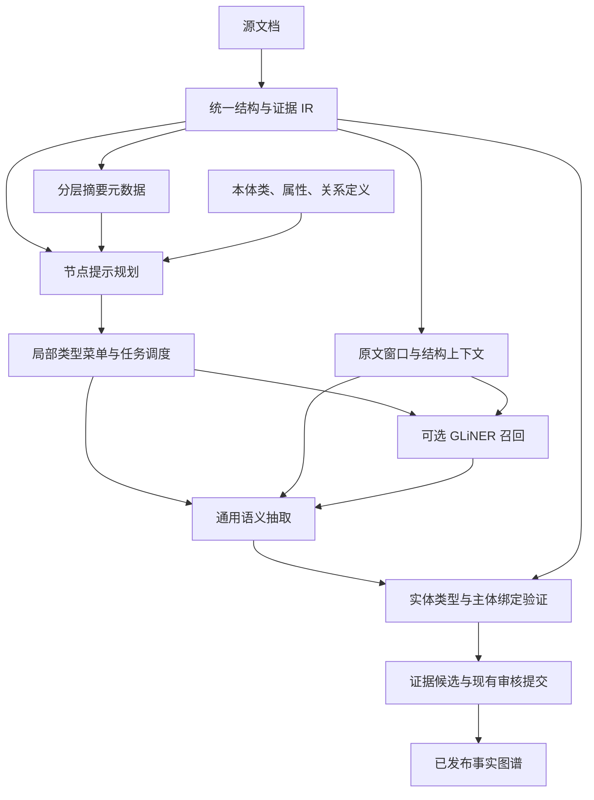

# 基于文档结构和摘要元数据的关系图谱识别方案

> 日期：2026-09-07
>
> 状态：详细设计建议；已构建独立的轻量提示与排序评测原型，尚未完整实施或接入生产。四组预算内实测见[实测报告](./CMCReport结构摘要图谱识别实测报告.md)，目前未证明全文关系图谱提速或准确性提升。
>
> 范围：Word 文档结构分析、分层摘要、节点语义提示、实体与属性召回、关系判定及证据验证。
>
> 术语：讨论中的“CliNER”按当前项目使用的 GLiNER 理解；下文新增字段、模块和策略均为拟议设计。

## 1. 方案判断与收益条件

本方案在技术上可行，有机会同时提升文档图谱识别的速度和准确性。核心机制是将文档结构、各层级摘要与本体定义结合，为文档节点生成潜在实体类型、属性目标和关系模式，再指引局部原文抽取与任务调度。

速度收益来自减少重复处理、复用元数据、改善批量执行，以及在经过评测的范围内减少无效抽取工作。准确性收益来自改善局部类型选择、补充标题主体与表格语义、减少不相关候选干扰。两类收益均存在条件，不能由“增加了摘要”直接推出。

| 关注点 | 可期待的机制 | 必须验证的限制 |
|---|---|---|
| 更早看到有效结果 | 相关节点、类型与关系任务优先执行 | 单纯排序不减少完整任务集合，可能不降低全量耗时 |
| 更快完成整篇识别 | 缓存复用、合批、减少重复窗口和无效候选 | 摘要、提示生成、GLiNER 和新增验证也有成本 |
| 实体及属性识别更准 | 局部标签、标题上下文、表格记录角色共同消歧 | 标签筛选可能遗漏长尾类型；数值被找到不等于归属正确 |
| 关系识别更准 | 限定关系模式和候选对象，独立验证主体绑定 | 类型相容、同节共现和摘要关联均不能证明关系成立 |

第一阶段建议保持当前抽取范围，仅增加提示、排序和可观测性；第二阶段独立评估 GLiNER 召回；第三阶段在完整性约束和人工金标支持下探索自适应路由。不能把“提前结束、少做任务”直接记为等质量提速。

## 2. 当前实现与可复用基础

以下结论来自 2026-09-07 对当前工作区的只读代码核查。工作区包含进行中的其他改造，后续实现时应重新核对入口；历史设计文档不能替代当前代码事实。

| 能力 | 当前实现 | 对本方案的意义 |
|---|---|---|
| 统一结构与证据 | `word_analysis.py`、`docx_structure.py`、`document_ir.py` 提供章节、块、原文证据单元和坐标 | 可以直接复用节点身份和原文范围，无需新增一套解析器 |
| 分层摘要 | `word_tree_summarizer.py::summarize_word_tree()` 自底向上生成页、章节及根摘要 | 可作为规划输入，但目前定位为展示元数据 |
| Word 实际抽取入口 | `api/extraction.py` 以 `structure_only=True` 渲染，随后调用通用 `runner.run()` | 当前 Word 主链路不是旧 GLiNER 三阶段抽取 |
| 摘要时序 | 当前 Word 抽取入口在 `runner.run()` 之后处理摘要，支持延后生成 | 要用摘要指引抽取，必须增加前置规划阶段或复用已有有效摘要 |
| 类型菜单与覆盖 | `extraction_tasks.py` 根据本体和显式文档类型构建适用类集合，按预算遍历证据窗口与类菜单 | 节点提示可调整局部优先级，不能默认删除剩余适用类型 |
| 关系任务调度 | 已有主体、竞争主体、对象范围、谓词路径及 `priority_paths` | 可增加节点相关性排序；现有排序仍会访问剩余任务 |
| 渐进关系输出 | 对显式文档根，已在实体批次间交错调度部分关系任务 | 应增强既有调度，不将“关系提前出现”全部归因于新方案 |
| 层级上下文 | `hierarchical_context.py` 已加入祖先标题及真实来源引用 | 摘要提示可作为独立辅助字段加入，不能伪造原文 anchor |
| GLiNER 封装 | `extract_text_with_spans()`、`extract_batch_with_spans()` 接受动态标签，保留偏移和分数 | 可复用为可选召回器；当前批次共用一套标签 |
| 验证与性能记录 | 已有独立类型/绑定验证、来源回放及 `performance.py` 分阶段计时 | 延续验证边界，扩展规划、摘要和召回的观测指标 |

### 2.1 与现有规格的关系

`specs/018-word-chapter-tree/spec.md` 的 FR-017 将摘要限定为展示元数据，配套研究记录明确不向 NER、关系或候选生成传递摘要。本方案需要将这一职责扩展为“摘要可参与辅助规划”，属于后续规格变更，本文不代表该变更已经实施。

`specs/019-evidence-semantic-extraction/spec.md` 对原文来源、主体归属、否定条件、完整性、缓存恢复及未完成状态的要求继续适用。摘要不得成为生产事实来源；本方案不引入业务 finder、业务正则或按具体类编写专用抽取算法。

## 3. 总体架构与职责



节点提示回答“这一范围可能需要找哪些实体、属性和关系”。GLiNER 负责提出原文中的实体或属性值片段。通用语义抽取与验证负责判断类型、主体归属、关系方向、指代、极性及条件。已有审核和提交链路决定候选是否进入已发布事实图谱。

基础约束如下：

1. 提示附着在文档章节、段落或表格记录节点上，不直接成为实体或事实边。
2. 摘要、提示和模型解释使用派生元数据身份；事实必须引用原文或既有合法来源。
3. 父节点主题可以影响子节点优先级；具体主体和属性不能无条件继承。
4. 关系模式来自本体合法定义，关系实例必须有原文支持。
5. 摘要缺少某类内容、GLiNER 没有命中或规划低分，都不等于该类事实不存在。
6. 不确定主体、类型或绑定保持歧义、待审核或未完成状态，不通过多主体复制值填补缺口。

## 4. 节点提示元数据设计

### 4.1 提示类型

| 类别 | 示例 | 消费者 | 不能据此认定的事实 |
|---|---|---|---|
| 主题提示 | 本节介绍氢化工艺及设备 | 规划器、调度器 | 本节所有实体都参与氢化 |
| 实体类型提示 | 工艺步骤、反应设备 | 类型菜单、GLiNER | 摘要提到的设备已经在原文出现 |
| 属性目标提示 | 设备编号、有效容积 | 属性召回与属性任务 | 所有数值都属于当前设备 |
| 关系模式提示 | 工艺步骤—使用设备→设备 | 关系任务规划 | 任意共现步骤和设备之间都存在使用关系 |
| 主体线索 | 标题可能命名当前工艺步骤 | 主体发现与指代验证 | 标题主体必然支配全部子树 |
| 范围建议 | 优先查看本节正文及关联表格记录 | 原文窗口规划 | 可绕过既有 scope 规则访问整个文档 |

### 4.2 建议的数据结构

以 `analysis_id + node_id` 为关联键保存独立的 `extraction_hints` 记录。避免将摘要写回证据原文、改变 `EvidenceUnit` 内容，或仅因摘要变化重建原文坐标。

| 字段 | 含义与约束 |
|---|---|
| `hint_id`、`hint_version` | 当前提示记录身份和格式版本 |
| `analysis_id`、`node_id` | 指向既有分析结果中的真实节点 |
| `status` | 拟新增状态：`ready / partial / unavailable / stale`；不代表事实验证状态 |
| `entity_type_hints[]` | 类型 IRI、自然语言标签候选、相关性分数、依据引用 |
| `property_hints[]` | 主体类型 IRI、属性 IRI、值标签、数据类型及单位约束 |
| `relationship_hints[]` | 主体类型 IRI、谓词 IRI、对象类型 IRI及可能的关系路径 |
| `subject_cues[]` | 指向原文标题或提及的线索；只有经验证的主体才可写入候选引用及版本 |
| `suggested_ranges[]` | 基于现有节点和证据 ID 的搜索范围建议；执行前由 scope 构建器校验 |
| `source_metadata_refs[]` | 摘要版本、节点、生成来源、内容哈希；这些引用不是事实证据 |
| `source_evidence_refs[]` | 规划时使用的真实标题、表头或正文引用；不自动证明候选绑定 |
| `ontology_release` | 所有类和谓词所属的本体发布版本 |
| `planner_identity`、`policy_version` | 模型、提示词、排序及继承策略版本 |
| `dependency_hash` | 节点内容、祖先相关信息、本体和摘要版本等依赖的指纹 |

提示分数只表示规划相关性。不得将其直接解释为事实正确概率，也不应把提示分数、NER 分数和验证结果简单相乘后作为统一置信度。需要统一排序时，在独立验证集上评估并校准。

### 4.3 提示生成的输出约束

规划器只能引用输入中存在的节点、本体类和谓词。程序检查节点存在性、本体版本、属性适用类型及关系 domain/range；非法项被拒绝并记录诊断。标签的自然语言表达可以变化，但最终必须映射到当前本体中的明确 IRI。

模型无法匹配本体时，可记录“未匹配主题”供后续分析，不能自动创建本体类型或生产关系。提示可以没有候选；空提示触发正常未排序流程，不标记文档无实体。

## 5. 分层规划与抽取流程

### 5.1 结构和摘要准备

复用一次 `analyze_word_core()` 的结果，保留章节树、直接内容、表格结构、段落和单元格的真实证据坐标。

摘要仍按叶节点到父节点生成。父节点使用直接内容及直接子摘要，避免在每层重复发送整个子树原文。普通浏览摘要可作为主题线索；否定、条件、数值和主体限定必须在后续原文窗口中核验。

优先使用版本有效的摘要。冷启动时可在规划预算内准备重点节点摘要，结合标题、表头和当前可用局部元数据生成初始提示。无需等待全文所有层级摘要完成才能开始首批抽取。哪些层级值得生成摘要，由实验决定，不强制每段额外调用一次模型。首期在抽取开始时冻结规划快照，之后生成的摘要供下一规划版本使用；运行内渐进更新按 §9.2 单独扩展。

当前无状态文档分析接口不会持久保存摘要；不能假设另一个抽取请求自然拥有上一次页面分析结果。第一期只在同一执行上下文或已有授权的作业存储中复用有效元数据，不因本方案隐式改变无状态接口的持久化契约。

### 5.2 本体匹配与提示继承

将节点标题、直接内容主题、局部摘要及相关祖先提示与本体类、属性和关系描述匹配。可复用语义相似度作为候选排序，再由受约束的规划步骤生成合法提示；嵌入相似度不证明实体类型或关系成立。

继承策略：

- 文档层提供宽泛业务主题，避免过早收窄类型范围。
- 章节层细化实体类型、属性目标和关系模式。
- 局部段落与表格记录决定实际优先级，局部明示内容高于祖先主题推测。
- 对比章节、不同批次及不同表格记录保留各自主体线索，不能自动跨兄弟节点传播具体实例。
- 祖先提示可随层级距离减弱；衰减方式和标签数量按验证集调整，不把固定深度或固定 Top-K 当作正确性保证。

摘要不涉及某类实体时保留剩余类型队列。发现提示与原文冲突时更新规划或触发补扫，不改写原文、不强迫类型一致。

### 5.3 局部菜单和任务调度

在当前适用的本体类集合内，为每个原文范围构建“优先菜单”和“剩余菜单”。优先级综合节点提示、原文结构、已有主体和既有模板路径偏好；模板偏好继续只影响顺序，不决定文档是否存在其他实体。

首先执行高相关菜单，再以公平轮转方式访问剩余菜单，避免低分类型无限期饥饿。已由当前调度器支持的文档根关系任务继续交错运行；依赖主体及竞争主体稳定的任务仍遵守原来的依赖关系。

第一阶段不因提示而减少必须完成的类型和范围，因此主要验收首批有效结果耗时。若达到预算上限时剩余任务未执行，保留未完成状态，不用“优先队列已空”替代全量完成判定。

### 5.4 GLiNER 动态标签召回

实体召回使用类型标签，如“反应设备”“工艺步骤”；属性值召回使用含义清晰的值标签，如“设备编号”“设备有效容积”。内部保留标签到本体 IRI 的映射，不向模型直接传递难以理解的长 IRI。

自然语言标签的长度、中文或英文表达、同义标签以及领域数值表现必须在实际 checkpoint 上测试。GLiNER 接受标签字符串不意味着它会按自然语言指令完成关系推理。

实施要求：

1. 按标签集合和策略指纹合批；现有批量封装的一次调用共用 `labels`，不能假定逐条输入已有独立标签接口。
2. 避免节点提示过度碎片化成大量单条调用；优先在标签相同或可兼容的窗口间合批，并记录批量利用率。
3. 原文窗口保留必要上下文，包括可追溯的标题或表头。对拼接、窗口重叠和合成分隔符保留源坐标映射；不得把合成内容当成可抽取的原文。
4. 使用保留 span 的接口，核验原文与引用一致。仅返回 `label → value` 的聚合接口不足以支撑逐值来源和主体绑定。
5. 保留标签、偏移、模型和分数等召回信息。若下游重新定类，将初始标签作为可审查的候选信息，不能直接当最终本体类别。
6. NER 未命中仍允许通用语义任务发现实体和值。纯数字或带单位值不得因缺少同段实体提及而被统一丢弃。

当前 `gliner_multi-v2.1` 应作为片段召回模型评估。官方新版本文档中的关系接口配合专门的关系模型使用，不能据此推断当前权重支持主体关系绑定。更换关系模型是独立实验变量，不纳入本方案首期默认变更。

### 5.5 主体条件属性抽取

主体候选先由真实原文提及或标题等依据形成，并通过类型和身份验证。属性任务携带主体候选及版本、竞争主体、目标属性、允许原文范围以及来自 GLiNER 的可选值片段。

属性验证需要同时回答：值是否在原文中、是否符合属性含义、属于哪个主体、单位和比较符是什么、是否受时间或条件限制。NER 只识别出“500 L”不能回答全部问题。

标题主体、正文只有数值的场景仍应执行主体条件属性任务；不能将属性抽取重新绑定到“该段必须存在实体 span”的旧前提。多个值分别保留来源与绑定，不压成单值字典，不将同段值复制给全部主体。

### 5.6 关系实例判定与多跳

节点关系提示用于排序主体本体定义下的谓词，以及兼容的候选对象。只有真实主体和对象候选形成后，才执行主体—谓词—对象的断言抽取与独立绑定验证。

本体类型相容仅说明关系在模式上可能成立。原文还必须支持关系方向、断言极性、适用条件及对象身份。跨句指代需要引用前文身份与当前断言，不能只按相邻距离确定归属。

多跳任务继承具体父实例、路径和版本；局部提示可建议下一跳搜索位置。跨章节扩展范围须由原文引用或已有合法 scope 机制支持，摘要中的关联描述不能独立授权范围扩大。保持循环检测、预算、恢复和未完成状态。

### 5.7 端到端示例

原文：

> 3.2 氢化工序
>
> 本工序使用反应釜 R-101，其有效容积为 500 L。备用设备 R-102 未投入使用。

| 阶段 | 预期产物 | 验证边界 |
|---|---|---|
| 节点摘要 | 本节描述氢化工序的使用设备及备用设备状态 | 用于规划，不作为事实引用 |
| 类型提示 | 工艺步骤、反应设备 | 映射实际本体定义；不存在对应类则不得编造 |
| 属性提示 | 设备编号、有效容积 | 容积是属性值目标，不是设备实例 |
| 关系提示 | 工艺步骤—使用设备→设备 | 仅为可能的关系模式 |
| NER 召回 | R-101、500 L、R-102 等原文 span | 召回结果依赖模型实际表现，不保证全部命中 |
| 主体与绑定 | 500 L 归属 R-101；R-101 与本工序的使用关系有原文支持 | 需联合引用主体、指代和完整断言 |
| 否定处理 | 保留 R-102 未投入使用的范围化否定断言 | 不生成其已被使用的肯定关系，不推广为所有场景都未使用 |

若本体没有与“未投入使用”语义一致的谓词，不强行转换为另一关系的否定。示例中的名称和标签为说明用途，生产 IRI 必须来自已发布本体。

## 6. 对速度的影响与优化策略

### 6.1 区分三种耗时

| 指标 | 定义 | 用途 |
|---|---|---|
| `T_first_valid_result` | 从抽取请求开始到首批通过必要语义和来源验证的结果可见 | 衡量用户首次得到有用内容的等待时间；提示边和未验证召回不计入 |
| `T_first_target_path` | 到目标关系路径及所需属性出现有效结果的时间 | 衡量既有模板路径优先级与新节点提示的增量收益 |
| `T_complete` | 到约定范围内抽取、验证及执行结果保存完成的时间 | 衡量整篇识别是否真正更快；不含用户人工审核等待 |

摘要与提示生成、模型加载、排队、补扫、失败重试和 checkpoint 成本均须按测试场景计入。若对照组也要生成最终展示摘要，应比较同一交付终点；可另报“事实抽取完成”和“展示摘要完成”，不能只在其中一组排除摘要耗时。

### 6.2 成本平衡

在串行近似下，令共同处理时间为 `T_common`，则：

```text
T_baseline = T_common + T_semantic_baseline + T_verify_baseline + T_io_baseline

T_proposed = T_common + T_metadata_miss + T_hint_plan + T_gliner
           + T_semantic_proposed + T_verify_proposed + T_remaining
           + T_io_proposed
```

`T_metadata_miss` 是本次实际发生的摘要等元数据生成开销；`T_remaining` 是未被前序部分计入的剩余扫描及补抽开销，避免重复计数。若存在并发，不能直接相加各阶段累计耗时，应同时测量端到端墙钟时间和资源占用。

只有节省的语义抽取、验证及重复处理时间大于新增开销，才能降低 `T_complete`。若仍保留全部原有调用，同时叠加摘要和 GLiNER，不能预期必然加速。

### 6.3 建议优先验证的优化

1. 元数据复用：复用有效摘要和提示，分别报告首次分析与重复抽取，避免把缓存命中当作冷启动提升。
2. 批量执行：相同标签集合的窗口合批；局部菜单按真实 token 预算打包，监测小批次造成的吞吐损失。
3. 减少重复工作：只合并来源范围、目标语义及全部有效依赖相同的任务。不同主体、竞争主体或版本的任务不能因原文相同就共用验证结论。
4. 改善任务成功率：减少无关类型与噪声候选，使语义任务更聚焦；统计是否真正降低拒答、重试及绑定调用数量。
5. 渐进规划：结构信息先行，已有局部摘要按需使用，避免将整棵树摘要生成串成首批结果的前置屏障。

本方案不能替代既有的重复执行、任务所有权、过度序列化、数据库写入和分词开销治理。需要先依据阶段计时确定主瓶颈；若耗时主要在这些环节，新增摘要未必带来明显净收益。

### 6.4 后续路由模式与完整性

首期只有提示排序，保留原适用范围内的完整任务队列。后续可试验“优先局部扫描＋按证据触发扩展”，但必须显式记录未访问的类型、谓词和范围。

完成优先扫描、达到抽取数量目标或模板路径暂时满足，都不证明整篇图谱识别完成。局部任务可以声明其限定范围已处理；剩余全量任务继续运行或标记未完成。未经全量对照和召回评测，不将启发式跳过包装为完整识别。

## 7. 对准确性的影响与控制

| 可能改善 | 作用机制 | 主要反向风险 | 控制方法 |
|---|---|---|---|
| 类型识别 | 局部标签减少相近类别干扰 | 错误摘要引导错误类型 | 保留候选类型及剩余菜单，依据原文独立复核 |
| 属性含义 | 标题、表头及主题帮助区分容积、温度、规格等 | 将主题相近数值硬塞进目标属性 | 验证属性语义、单位、比较符及值角色 |
| 属性归属 | 利用标题主体、记录范围和指代 | 祖先主体错误传播、跨行复制值 | 明示竞争主体和逐值绑定证据 |
| 关系精度 | 先关注适用的关系模式与对象类型 | 类型相容或共现被误作事实 | 每条关系独立验证来源和绑定 |
| 跨段召回 | 层级提示帮助定位分散信息 | 摘要合并了不同批次、时间或条件 | 保留具体实例和限定，受控扩展 scope |
| 否定与条件 | 原文断言被专门验证 | 摘要省略否定词、条件或比较对象 | 原文为准，否定/条件独立保存，不无条件物化 |

提取精度上升而召回下降，不等于整体质量提高。需要同时评估实体、属性和值归属、关系及证据；不能只报告实体 span F1 或候选总数。

为降低确认偏差，默认只向验证器提供候选断言、原文、本体定义和必要真实结构上下文，不把规划器的“高置信度”或摘要解释当成支持理由。验证器允许推翻提示或拒答；这种职责分离仍不能保证模型错误相互独立，必须用难例评测。

## 8. 集成位置与拟议改造

| 模块 | 建议改造 | 保留的边界 |
|---|---|---|
| `word_analysis.py` / `document_ir.py` | 向规划器暴露共享结构与节点—证据映射 | 原文证据身份不依赖生成摘要文本 |
| `word_tree_summarizer.py` | 复用局部摘要、明确生成状态与依赖；支持规划所需元数据准备 | 摘要仍不产生事实或修改树结构 |
| 拟新增 `node_extraction_hints.py` | 提示模型、合法性校验、层级合成及策略版本 | 不创建实体、关系事实或本体定义 |
| 拟新增 `extraction_planner.py` | 节点到窗口的映射、局部菜单、优先级与未处理范围账本 | 不因摘要缺项删除完整性要求 |
| `extraction_tasks.py` | 接入实体菜单排序、谓词和对象排序；保留公平调度和依赖 | 继续执行独立类型/绑定验证及完成状态判定 |
| `gliner_extractor.py` | 复用动态标签 span API；调用方按标签组批并维护原文映射 | 不将普通 NER 输出视为完整关系抽取 |
| `hierarchical_context.py` / `model_protocol.py` | 为抽取阶段增加有版本的辅助提示投影 | 提示不进入 `allowed_fact_regions` 或原文绑定证据列表 |
| `api/extraction.py` | 显式抽取流程增加有预算的规划准备，支持有效摘要复用 | 读取预览不启动规划、摘要或抽取任务 |
| `performance.py` / 执行记录 | 增加摘要、提示、GLiNER、排队及剩余扫描指标 | 区分阶段累计值、模型耗时与端到端墙钟时间 |

如复用现有上下文字段表达提示，应明确 `purpose=extraction_hint`、`fact_eligible=false`，并使用元数据引用。不能为了满足原字段形状给摘要创建虚假 `EvidenceAnchor`。是否进入绑定区域由真实原文证据决定，与提示是否相关无关。

旧 `document_annotator.py` 的 GLiNER 属性抽取代码不能直接恢复为 Word 主路径。当前方案围绕已存在的通用语义抽取器增加可选召回能力，保留标题主体、逐值来源和独立绑定。

## 9. 缓存、恢复及降级

### 9.1 缓存分层

结构缓存由文件内容、解析器和 IR 版本标识。摘要缓存依赖节点直接内容、子摘要及摘要模型/提示词版本。提示缓存进一步依赖本体发布版本、相关祖先信息和规划策略。抽取任务及结果缓存还必须包含模型、标签映射、主体和竞争主体版本、scope、预算与实际使用的提示版本。

不能仅以文件名、节点标题或摘要文本作为缓存键。跨文档版本即使局部文字相同，也须重新核验来源映射，不能直接复用旧 anchor。祖先摘要变化影响哪些子节点提示，由显式依赖图确定。

第一期建议将提示指纹纳入现有运行和任务身份，保证正确失效；细粒度增量复用放到后续评测。实际实现中节点 ID 或证据 ID 可能随文档修改变化，本文不预设跨版本稳定性已经具备。

### 9.2 渐进更新和断点恢复

首期一次运行使用冻结的规划快照；新摘要生成后可建立新规划版本，但不静默修改本次运行。重新规划产生新的输入身份，旧 checkpoint 仅在有效依赖校验通过时复用，不因文件相同直接恢复。

后续如支持运行内渐进更新，需扩展 checkpoint 契约，逐任务记录提示、主体、竞争主体及规划版本。新提示只调整待调度队列，不修改正在运行的请求。已完成结果能否复用由实际依赖变化判断，提示排序变化与事实内容变化分开处理。

恢复必须重建已完成、失败、未调度和需要重验的任务集合。局部高优先任务完成不清空剩余范围。暂停时保存已有结果和规划状态，不等待整棵树摘要结束。

### 9.3 降级行为

| 情况 | 处理 |
|---|---|
| 摘要关闭、超时或仅有摘录 | 采用结构信息与已有有效提示，记录来源和降级状态；继续可用的通用语义抽取 |
| 提示非法、过期或无法匹配本体 | 丢弃非法项或重建提示，进入正常未排序队列，不认定无实体 |
| GLiNER 不可用、失败或未命中 | 若通用语义能力可用，按已有能力继续；诊断区分空结果与召回器不可用 |
| 通用语义模型不可用 | 提供结构预览及可保存的中间状态，依赖任务标记未完成；NER 命中不能代替完整验证 |
| 规划预算耗尽 | 停止新增规划，保留未排序队列；不能把规划失败变为事实缺失 |
| 主体歧义或范围证据不足 | 拒答、待审核或有界补抽，不凭摘要补造事实 |

运行沿用项目本地模型与离线约束，不在失败时切换到未启用的外部服务。

## 10. 评测方案

### 10.1 数据集与对照

选取真实业务文档建立人工标注集，区分开发、验证和最终测试。按文档划分；高度相似的模板文档按模板族整体划分，避免同一文档的摘要或近重复片段泄漏到不同集合。数量由类型覆盖、难例数量和统计稳定性决定，不能把少量样例成功作为整体质量结论。

标注覆盖实体提及和身份、属性值与主体、关系端点和方向、否定条件以及来源证据。至少包含标题主体/正文数值、同段多主体、跨句指代、合并及嵌套表格、多批次同名实体、无关系共现、否定、条件、长尾类型和摘要遗漏。

区分人工标注事实缺失、文档未提及、模型拒答和任务未完成。独立金标不能由旧模型输出、摘要或当前报告结果替代。

### 10.2 消融组

| 组别 | 配置 | 主要回答的问题 |
|---|---|---|
| A | 冻结的当前通用语义链路，包括已有祖先标题与任务交错 | 新方案相对实际系统的增量效果是多少 |
| B | A＋结构驱动节点提示，仅排序，保持完整扫描 | 节点规划本身是否改善首批结果、类型和绑定质量 |
| C | B＋分层摘要提示，仍保持完整扫描 | 摘要相对已有结构带来的净收益及新增成本是多少 |
| D | C＋可选 GLiNER 召回，保留语义抽取和验证路径 | 增加 NER 召回是否值得其推理和验证成本 |
| E | 另行评测的局部路由/扩展策略 | 减少任务后速度与召回、完整性的取舍是否可接受 |

E 组已补充为独立的“文档根实例→直接谓词选章→range 定向发现→验证后递归”评测原型，详见 [CMCReport 根关系驱动实测报告](CMCReport根关系驱动图谱识别实测报告.md)。这改变了主任务生成方式，不是 A–D 的全菜单排序。原型按当前关系展开合法子类，未预展开多跳可达类型；仍保留生产类型扩展、原文引用及绑定验证。每谓词最多三个章节只是试验范围上限，未检索章节明确标记，不能据此声明全文完成。实测须同时关注章节所含原文单元数量、独立验证上下文、关系失败造成的递归中断和候选实例归并，而不只统计类型菜单长度。

每组只变化表中指定因素，其余模型、验证器、硬件、并发、预算和输入保持一致。交替或随机化组间运行次序，减少缓存预热、排队和机器负载造成的偏差；完整运行与相同固定预算实验分别统计。若 D 计划替代部分已有实体召回调用，须再设独立子组说明替代范围及未命中处理；不能把“增加召回”和“减少调用”混在一个无法解释的对照中。

固定标签与动态标签也应在相同原文窗口、相同 GLiNER 权重及阈值下做配对实验。更换权重、提高预算或改变标签语言均须作为独立变量记录。

### 10.3 指标

质量指标：

- 实体：原文 span 与类型的 precision、recall、F1，另报实例归并错误及长尾类型召回。
- 属性：正确主体、谓词、规范值、单位、比较符和条件的组合指标，逐项报告归属准确率。
- 关系：正确主体、谓词、对象、方向、极性及条件的 precision、recall、F1。
- 来源：引用可回放率及语义支持正确率分别统计；坐标正确不等于证据支持。
- 拒答与覆盖：拒答率、有效结果覆盖率、未处理范围、未完成率和漏扫率。
- 规划：人工金标类型/谓词进入优先菜单的比例、剩余扫描找回的事实比例和错误提示传播率。

性能指标：

- 三类耗时的 p50、p95，以及单位时间处理文档/原文 token 的吞吐。
- 冷模型/冷元数据、热模型/冷元数据、热模型/热元数据分别测试。
- 模型调用、输入输出 token、NER 批次数和批量大小、摘要及提示缓存命中率。
- 类型验证、绑定验证、补抽、失败重试、排队及存储耗时，CPU/GPU 和内存占用。
- 达到同等有效结果质量和覆盖范围的成本；超时与未完成样本计入结果，不只统计成功文档。

### 10.4 判断标准

实验前固定可接受的精度、召回和耗时差异，之后不能根据测试结果临时调整验收线。业务关键关系和错主体场景单独设门槛，不用总体平均值掩盖退化。

若 A→B 仅降低首批结果耗时而未降低 `T_complete`，结论应写“改善渐进输出”。若 B→C 质量提高但冷启动变慢，结论应写“摘要带来质量收益和首次处理成本”。只有配对测试在相同质量与完整性要求下显示更低 `T_complete`，才宣称全量识别提速。

对文档级配对差异给出分布和置信区间；小样本只形成试点观察。速度可报告 `T_baseline / T_proposed`，质量变化使用明确的百分点或相对比例，不混用。本文不预设“提升若干倍”或某个准确率增幅。

## 11. 实施阶段与验收产物

| 阶段 | 范围 | 验收产物 |
|---|---|---|
| P0：基线和契约 | 冻结当前链路；补足计时；定义提示、依赖、范围和状态；建立金标 | 可复现基线、指标口径、接口与规格差异清单 |
| P1：提示与排序 | 结构提示、有效摘要复用、优先/剩余菜单；默认不删除适用任务 | 提示来源可审查；无提示可正常运行；首批结果和完整性对照 |
| P2：可选 GLiNER | 动态标签、按标签合批、原文映射、召回候选接入验证 | 标签消融、数值与多主体难例、端到端净成本报告 |
| P3：效率优化 | 精确缓存、去重与批量治理；独立实验自适应路由 | 冷热性能、质量—成本曲线、未处理范围可追踪 |
| P4：验证与启用 | 固定测试集、多格式难例、暂停恢复、缓存失效与开关切换 | 同质量性能结论、分场景质量报告及可回放执行记录 |

拟新增策略开关区分 `off / priority / adaptive_experimental`；摘要提示和 GLiNER 各自可开关，以支持独立消融。首期建议默认关闭实验性裁剪。关闭新能力后回到既有通用语义链路，不恢复退役的旧业务抽取分支。

关键自动化验证应覆盖：非法 IRI/节点拒绝、摘要文本不能成为事实引用、原文偏移映射、父子提示冲突、多主体属性归属、否定条件、剩余菜单完整性、跨版本缓存失效、暂停恢复及模型不可用。真实质量和性能仍需实测，不能以这些测试通过代替。

## 12. 参考与证据边界

### 12.1 当前代码

- [Word 抽取入口](../backend/app/api/extraction.py)：结构预览、通用 runner 调用与摘要时序。
- [通用任务调度与验证](../backend/app/services/extraction/extraction_tasks.py)：适用类菜单、证据窗口、主体条件任务、交错调度、验证及缓存身份。
- [层级上下文](../backend/app/services/extraction/hierarchical_context.py)：祖先标题及可抽取/可绑定范围。
- [统一证据 IR](../backend/app/services/extraction/document_ir.py)：节点映射、原文身份和 anchor 回放。
- [分层摘要](../backend/app/services/extraction/word_tree_summarizer.py)：摘要批次、来源及降级。
- [GLiNER 封装](../backend/app/services/extraction/gliner_extractor.py)：动态标签、批量 span 输出、本地加载及中文分词适配。
- [性能记录](../backend/app/services/extraction/performance.py)：操作级墙钟时间与阶段计时。

### 12.2 既有设计及分析

- [018 章节树与摘要规格](../specs/018-word-chapter-tree/spec.md)。
- [019 统一证据与语义抽取规格](../specs/019-evidence-semantic-extraction/spec.md)及[研究记录](../specs/019-evidence-semantic-extraction/research.md)。
- [文档结构解析能力增强报告模板的关系图谱识别和 NER 能力](./文档结构解析能力增强报告模板的关系图谱识别和NER能力.md)。
- [关系图谱识别非 LLM 性能分析](./关系图谱识别非LLM性能分析.md)。
- [关系图谱识别长耗时与重复执行分析](./关系图谱识别长耗时与重复执行分析.md)。

历史报告中的现场数据仅证明对应采样时间和代码条件下的现象，不能作为本方案已获得性能收益的证据。

### 12.3 GLiNER 官方资料

通过本轮方案讨论中 Context7 获取的官方资料核对能力，查询日期 2026-09-07：

- [GLiNER 模型接口](https://github.com/urchade/gliner/blob/main/docs/api/gliner.model.md)：动态实体标签与推理接口。
- [GLiNER 使用文档](https://github.com/urchade/gliner/blob/main/docs/usage.md)：标签选择建议及需要专门权重的关系抽取示例。

官方主分支文档可能包含当前部署包和权重尚未支持的接口。实施前须锁定实际包版本、checkpoint、分词及适配器能力。本文确认的是动态标签方案的接口可行性，未进行模型下载、在线业务文档处理或真实抽取质量实验。

## 13. 质量优先修订（2026-09-08）

本阶段以准确抽取 CMCReport 的实例、属性和关系为目标，不以提速为验收条件。旧章节级根关系试验保留为历史记录；新增 `quality_guided_summary` 隔离模式，评分参考不变，不写入生产候选或事实。

### 13.1 记录级检索与范围授权

当前主体只提交其本体直接属性和直接关系菜单。规划器逐批审阅完整原文记录，标题和分层摘要只提供检索线索；不会先从全文生成全局候选类型集合。关系任务仅在该关系 range 与合法子类中发现对象。

记录基本单位为完整段落或逻辑表格行。路由请求按物理单元格成组，单元格内多个段落保留在同一 `fragments` 列表，并明确关联实际列号、对应列头及跨行合并覆盖；不使用可能错位的平行内容/表头数组。嵌套表格的父记录只作归属上下文，不升级为子记录的事实目标。文档标题作为元数据，不以标题本身替代实际计划、研究或设备实例。`document_root` 表示整份文档，描述关系不要求正文重复根标题。

检索与授权分离：原有效范围及可靠身份别名可以形成目标范围；范围外的检索记录全部标为 `reference_ranges`。其中的每条属性或关系须先通过独立绑定，再通过独立指代/主体归属验证，同时回放当前记录和主体身份证据。同名、相邻、标题先验、父根连接均不能单独授予主体归属。

路由阴性不等于“原文没有事实”：记录保留 `route_negative_not_extracted`，与实际抽取无结果、引用失败、语义拒答、依赖失效分开统计。本版不把模型筛选后的范围宣称为全文穷尽扫描。

### 13.2 验证上下文与表格引用

独立验证保留当前候选、主体、对象、所有已知竞争主体、完整逻辑行、对应列头、单位、图例、条件、范围构造证据和必要父表上下文。按结构投影，不按 token 阈值丢弃这些必要证据；超出预算须显式失败。

模型使用请求内有限的来源、类型和候选 ID。名称、属性值与关系召回断言使用 `FactSpan`，只能选择目标原文；其余身份/绑定/单位/条件引用使用 `BindingSpan`，只能选择可绑定原文。这种权限区分同时进入生成 schema 和独立解码回放，不能等模型选择背景来源后才做拒绝。

v4 中一个引用只允许指向一个原文单元，模型字段仅为 `evidence_id` 及可选 `text`；schema 与解码器都拒绝模型提供 `start/end/context`，即使坐标正确或值为 null。完整单元优先只返回 ID，由程序回放该字段权限内唯一完整允许片段；不连续片段的 ID-only 引用拒绝。若名称、身份键或属性值只是复合单元中的子串，须提供允许范围内唯一的精确子串，由程序计算原文坐标；重复匹配拒绝，不静默选第一个。整段不能当数值或标识，也不静默去除括号或拆分多值。多格关系用多个独立引用表示，不由模型拼接“整行原句”。

验证投影对每个可见表格单元格保留其对应表头，以及逻辑行列、合并覆盖和表头来源 ID 映射。不能保留整行的其他数值，却只留下候选列的一个表头。同一源区间去重时保留角色、主体和权限分配；补入的展示表头不自动获得新引用权限。

引用合法与语义正确是两道检查。裸数、单位、上下限、否定和条件仍由生产验证链路审查，不能通过简化输出协议放宽这些要求。验证投影保留已呈现的结构反例及显式标记的反证；未标记的远处反证仍是当前方案的覆盖限制。

### 13.3 可靠实例归并与递归

只按通过独立类型和身份验证的本体身份键/实例标识归并，保留所有原始 mention 与证据。不同明确实例标识、复合二选一编号、冲突身份不能按同名强行合并。无可靠身份的匿名实体不为减少重复计分而盲目合并。

身份可信状态必须贯穿验证上下文，不能只在实例注册表内检查：若 `identity_supported` 为 false 或未确认，原始提议键保留供审计，但不作为下游模型主体的可靠 `key_predicate/key_value`；同时保留独立类型/身份验证状态。初次类型验证仍须看到待验证键。项目代码、试验报告编号与产品/API唯一标识不可混用；同名、同项目和相邻字段仍需原文归属证明。此项源于 08 实测暴露的投影缺陷，修复后的真实链路有效性须另行冻结验证。

归并稳定保留既有 canonical ID，更新真实变化的版本、关系端点、依赖和范围引用，并保留映射审计。陈旧引用不能自动升级为有效事实。后续发现同范围竞争主体时，撤销受影响的旧归属及其依赖，不能继续显示为可靠多跳路径。

调度逐条完成“发现对象—验证关系—展开对象的直接菜单”。只有肯定且通过验证的关系可以驱动递归；否定、条件、拒答和冲突保留记录，但不形成可用肯定路径。

同一谓词内按记录匹配程度排序，不同直接谓词轮转。子分支与剩余根记录保持两次子记录/一次根记录的覆盖调度，避免某个长设备分支独占根菜单；暂停恢复保留轮转状态。这是覆盖策略，不是固定耗时截止。

### 13.4 验证口径

分别报告三个层面：原文引用可回放性、当前候选图的语义有效性、独立参考范围内的 precision/recall/F1。已知 CMCReport 根不计入抽取成功数；路由未选中、未展开及未评分范围不能当作正确空值。

本轮使用同一原文、IR、本体 schema、冻结摘要和既有 assistant_silver 参考，参考只在运行结束后进入评分，不进入路由、提示和抽取。单请求保留 600 秒安全超时，取消旧实验 600 秒任务边界总截止；耗时和调用数仅作为运行成本记录。真实结果与未解决分支另行报告，自动化测试通过不能替代文档实测有效性。

### 13.5 多章节分期召回与既有二跳路径（v5）

CMCReport→describes→DrugProduct→hasActiveIngredient→ActivePharmaceuticalIngredient 是本体已经声明的合法路径。API 不在根的直接 range，不影响其作为 DrugProduct 二跳对象被发现；不能据此要求新增根到 API 的直接关系。DrugProduct 与 API 的类型和实例身份仍须分别验证，不按同名合并。

新增焦点路径验证模式，保持原文、本体和摘要不变。第一跳只使用 describes 的局部 range 类及其直接属性/关系标签作为章节检索线索，不生成全文候选类型清单。第一阶段保留最多三个高相关章节，第二阶段包含所有其他非标题记录；每个阶段按章节轮转，不能只在一个错误标题附近反复尝试。类型/关系拒绝只属于该记录中的该候选，不代表文档中没有 DrugProduct，队列继续其他记录与章节。

产品名称、剂型、化学性质等常分散在同一字段块的多个段落中。实体发现/验证保留同章节完整连续段落块作 binding-only 上下文，目标 mention/value 仍须来自当前授权原文记录；表格、标题或章节边界阻断扩展。超出预算显式报错，不静默删除可能决定类型的字段。

第一跳通过后，以已验证 DrugProduct 为主体展开 hasActiveIngredient 及其数据属性。焦点关系候选与属性记录各一次轮转，防止庞大属性菜单阻断下一个关系候选；通过的边立即展开对象。跨章节 API 记录须独立证明产品—成分归属，不能靠相同项目代码、名称或父根连接直接建立关系。后续竞争主体与身份冲突仍触发归并审计及依赖撤销。

焦点模式的验收是既有两条关系、正确端点与源文引用，以及相关产品属性；其他根关系不在该实验调度范围。若出现完整路径后暂停进行独立审阅，仍应保留剩余队列并报告为局部链路验证，不声称完整图谱准确性。专门合成文档测试已覆盖先拒绝后成功、两条真实 IRI 关系、产品属性与 API 错主体/单端引用拒绝；模型响应模拟与目标文档实测分开报告。

### 13.6 拒绝处理的独立验证

拒绝只作用于当前断言与其依赖，不能将一次类型、关系或属性拒绝升级为全文否定。第一阶段拒绝后保留并继续其余记录，必要时进入第二阶段；上游关系被审核拒绝时阻断依赖分支，但不阻断独立根关系。合成执行器回归需实际遍历两阶段记录，不能只验证规划器返回了完整列表。

审计分别记录模型判定、引用/协议校验及后续调度。类型未获支持、绑定/指代不成立、模型拒答、空召回和预算/服务失败不是同一种结果；身份未获支持也不等于实体类型被拒绝。否定或条件事实按原极性保留，不能与程序拒绝混为一谈。缺失的理由标记为 missing，不补造解释；拒绝结论可能合理但解释含错误来源，须分别审阅。

后续处理必须由更晚的不同记录模型调用或真实任务尝试证明，待处理队列只能证明未删除，不能证明已执行。关系/属性可能在独立校验拒绝后未进入最终候选图，故须同时读取 trace、task 和 coverage。请求局部候选/证据别名不跨调用合并，原始审计文件保留哈希。该审计不读取参考答案，也不把续检成功、引用可回放或测试通过当作真实图谱准确率。

### 13.7 09 实测后的质量边界与下一步验收

09 已完成拒绝处理专项观察，保留未完成队列并在记录边界软暂停；原文、本体、schema 和摘要不变。实测确认第一跳拒绝后其他记录仍继续并建立 describes，API/属性拒绝后也继续了不同记录。最终程序保存了 `CMCReport→DrugProduct→API` 两跳及 Product 性状，但第二跳通过理由用报告归属代替产品成分归属，API 身份键又来自毒理试验“来源”列。故本次验证了执行链路，未证明完整路径语义准确。详见[实测报告第 7 节](CMCReport质量优先图谱识别实测报告.md)。

以下是后续改进的验收要求，不是本轮已实现或已验证的能力，也不要求更改现有本体：

| 环节 | 需要进一步验证的约束 |
|---|---|
| 谓词归属 | 分开主体身份、对象身份、两端之间的关系依据。双端分别被引用、同份报告、父 describes 或同名不能单独证明 hasActiveIngredient；须有支持该谓词的组成/配方/明确指代等原文桥接。桥接可跨记录，不限定必须在单句同时出现，但每一步须可回放。 |
| 验证目标 | 显式对齐当前 subject、predicate、object 与原文角色，根报告只作为路径来源；不能在 Product 属性核验中错误要求证明属性属于 CMCReport，也不能因根路径已建立就放宽组成判断。 |
| 身份角色 | 类型支持、文档局部共指、全局唯一身份分别判断。标识值必须引用字段角色和被标识对象，试验来源号、报告号或项目号不能仅因格式像编号就授权为 API/Product 身份。只有状态传递完整仍不够，必须检查状态本身的语义证据。 |
| 表格记录 | 合并 cell 的 mention 身份与覆盖的逻辑行分开。两行共享一个 API 名称而来源号不同，不自动产生两个 API；也不按同名强行合并。行定位引用仅用于消解记录位置，不成为实体标识或组成证明。 |
| 属性层级与缺失值 | 独立检查粉末/原料药与成品制剂的属性归属；N/A 等缺失值不能作为真实 CAS 值。缺失值、归属不支持、类型拒绝及无理由拒绝分别审计。 |

下一次冻结验证应同时保留正例和反例：同一连续字段块的合法 Product 属性、可回放的产品—API 组成桥接，以及“报告关联不能推出组成”“试验来源号不是 API 身份”“共享合并名称不按试验数复制实体”。不能为使当前文档通过而移除独立验证、扩大全局候选类型、拼接不同实验结果或修改银标。本次 API 身份响应均为 true，故已接受实体的 false-identity 下游隔离负分支尚未获得本次真实样本见证；第二阶段的实际执行目前也只有合成回归证据。
