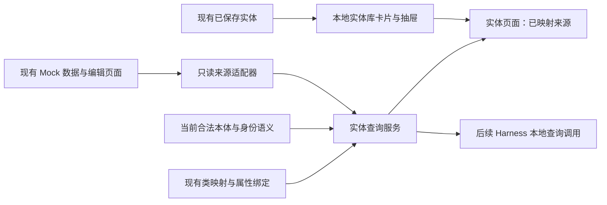

# 实体库与 Mock 系统映射查询改进方案

日期：2026-09-23。状态：基础查询已实施并完成隔离验收，已于 2026-09-23 部署并重启。
实施证据见[验收记录](调研/实体库Mock映射查询实施验收-20260923.md)。
需求与验收以 [036 规范](../specs/036-mapped-entity-query/spec.md)为准。
现状依据：[准备度分析](调研/实体库辅助文档指称识别准备度分析-20260923.md)。

## 1. 核心选择

**保留 PostgreSQL，增加基于既有映射的只读实体查询服务，直接读取 Mock 当前记录。**
实体库在本期提供统一的查询入口；Mock 原始数据仍由现有 Mock 页面维护，
已有 `EntityShadow` 继续承载其现有记录，不将 Mock 再复制成另一份权威数据。

这对应当前需求的最短路径：用户维护的 Mock 记录，经合法映射后即可查询。
查询不经过旧抽取候选确认接口，也不要求修复全部来源物化和事实发布流程。



查询服务统一数据形状和语义校验；来源适配器只知道数据表结构。
本体类型、编号属性和范围条件由映射与本体提供，不在通用查询中写 `ProductionArea`、车间后缀或编号规则。

## 2. 现状与接入范围

已实现的 [Mock 数据模型](../backend/app/models/mock_data.py) 与
[CRUD 接口](../backend/app/api/mock_sources.py)是本期真实接入对象。

| 数据集 | 原始记录身份 | 本期处理 |
|---|---|---|
| `production_areas` | 表中 UUID `id` | 首批有效配置：生产区域类型、`code` 编号、`label` 显示名、`iri` 来源实体引用 |
| `equipment` | 表中 UUID `id` | 首批有效配置：设备类型、`equipment_id` 编号、`label` 名称；显式配置类型字段后可保留已校验子类 |
| `departments` | 表中 UUID `id` | 列入目录；可配置合法类及名称查询。当前缺少可确认的编号本体属性时不假造映射 |
| `roles` | 表中 UUID `id` | 列入目录；明确是角色类别记录还是实际角色实例后才能配置，不能当作人员 |
| `team_members` | 表中 UUID `id` | 列入目录；小组成员关系与人员身份须区分，`role_code` 不作为人员唯一编号 |

上述后面三类不是默认自动启用的全局实体来源；字段目录可见不代表已完成本体映射。
已有 GxP 工艺页面按 [023 规范](../specs/023-gxp-process-mock/spec.md)仅保存浏览器会话演示，
本期不为它补建后端；设备排产属于带时间范围的业务记录，保持现有接口职责。

准备度调查当时，通用实体表只有 4 个文档实体；Mock 车间为 `642、644、646`。
这些是此前现场观测，不是本方案要播种的新数据，也不作为未来运行的硬编码。

## 3. 实体身份与数据归属

查询必须区分三个标识：

| 标识 | 用途 | 禁止推论 |
|---|---|---|
| `record_ref=(source_system,dataset,record_id)` | 稳定定位一条来源记录；记录 ID 用 UUID | 不能用裸编号替代，不能自动认为不同来源记录是不同现实对象 |
| 本体编号属性值 | 依照映射进行精确查询，参与身份核对 | 同号不证明跨组织同一实体；多个编号不自动证明多个实体 |
| `source_entity_iri` | 返回来源显式提供的实体引用 | 不因字段叫 IRI 就宣称它经过全局规范身份确认 |

同一来源记录经多个合法类型映射投影时，`record_ref` 不变，映射引用分别保留。
查询输出不生成新的全局规范实体，也不按相同 IRI 静默合并多个来源记录。
来源未提供 IRI 时返回空；仍能用 `record_ref` 查询和显示。

`identifier_namespace` 表示来源承诺的编号适用域，例如某个 Mock 数据集。
组织、厂区等真实业务范围必须由相应映射属性及数据提供，不能从来源名称或 IRI 推造。
默认样例声明的域只限 Mock 数据集，不宣称文档所属公司或场地已确定。

## 4. 复用并扩展现有映射

复用 [E6/E6b 模型](../backend/app/models/ontology_meta.py)、现有 CRUD、版本冲突检测与编辑界面。
本期最小持久化变化为：在类映射上新增可空 `query_config` JSON 列，经现有迁移流程管理。
不新增实体表、来源注册表或查询历史表。

### 4.1 来源绑定

增加 `mapping_type="mock_dataset"`：

- `source_system="builtin_mock"`：明确读取现有本地 Mock，不创建会被轮询的连接器。
- `target`：来源适配器允许的数据集 ID，不接受任意表名、URL、SQL、文件路径或代码。
- `class_id`：继续引用已有本体类。
- 此新类型按 `(class_id, source_system, target)` 防止重复；不顺带改变既有 DB/API 抽取域。
- `query_config` 指定显示名、可选来源 IRI/类型字段、来源查询键与命名空间。

示例配置（领域内容属于配置数据）：

```json
{
  "mapping_type": "mock_dataset",
  "source_system": "builtin_mock",
  "target": "production_areas",
  "query_config": {
    "label_path": "col:label",
    "entity_iri_path": "col:iri",
    "class_path": null,
    "identifier_namespace": "urn:mock:production_areas",
    "lookup_key_groups": [
      {
        "property_iris": ["https://ontology.pharma-gmp.cn/slpra/facility/areaIdentifier"],
        "scope_property_iris": []
      }
    ]
  }
}
```

`class_path=null` 时使用绑定类。配置类型字段时，其值必须是当前合法类型且为绑定类自身或子类；
无效行不能回退成父类假装成功，必须报告类型问题和受影响的查询完整性。

### 4.2 字段绑定

继续使用 `OntologyPropertyBinding.property_iri/source_path/transform_type/transform_config`。
来源目录为编辑器提供字段选择项，`source_path` 对 Mock 是一个有限的字段定位标识：

- `col:<字段名>`：适配器公开的顶层字段。
- `attr-iri:<完整 IRI>`：`data_properties` 中 `iri` 精确相同条目的值。
- `attr-label:<完整原始标签>`：`data_properties` 中 `label` 精确相同条目的值；标签由配置选择，代码不内置领域标签表。

该格式只负责定位现有数组结构，不是可执行表达式。匹配多个条目时保留多值及逐项来源；
标识键要求单个可用值时报告歧义，不能取第一项。字段不存在时报告缺失，不猜测近似标签。

首批生产区域映射以 `col:code` 为编号权威来源；不会同时把数组中的“车间编号”再映成第二份编号。
`label_path` 是显示元数据，可以在本体没有专用名称属性时使用，不伪装成文档名称属性事实。

本期查询映射消费数据属性。需要对象属性参与的本体键组保持完整展示，但在相应对象引用不能核验时
标记不可用于完整键核对；不能丢掉对象属性组件后仍声称满足原键组。
设备 `workshop_code` 不自动变成 `locatedIn` 关系，相关关系解析不属于本期。

转换只允许现有确定性能力中的 `none`、合法类型转换和显式值映射。
查询路径不得使用领域词表默认回退、可执行正则或转换失败时的原值充当成功值。
编号默认字符串原值比较，不移除前导零，不按标点拆值。转换后的精确匹配仍需返回原始值。

### 4.3 三种“键”分别处理

- `is_identifier`：已有抽取域的单属性字段提示，本期不借它自动合并来源记录。
- `lookup_key_groups`：此来源声明的完整查询键，可包含多个数据属性及必要范围属性。
- 本体 `identityKey`/`owl:hasKey`：当前类型的身份语义指引；保留注解含义和原始键组。

新查询的键结构只从 `query_config` 读取，不将若干 `is_identifier=true` 拼成复合键。
组内所有属性与范围条件共同匹配，组间分别报告；来源键不自动升级成本体公理。
来源键缺少相应本体身份语义时可用于召回，输出提示 `source_declared_only`。

### 4.4 生效与校验

映射保存沿用已有写权限、版本冲突与修改留痕。有效保存后默认参与查询；
部分配置可以保存供继续编辑，但不作为可用查询映射，界面显示缺项。
只有类与显示名映射、没有身份键时可进行名称候选查询，明确标记身份键不可用。

每次查询读取当前本体与当前映射；校验存在性、停用状态、定义域（保留并/交集语义）、类型和值域。
有效映射版本由父映射版本和排序后的全部属性绑定版本计算，不仅取父版本，避免属性修改漏失。
查询过程不修改 `health` 或其他持久化状态；返回本次诊断。无需新建失效缓存或快照架构。

## 5. 查询行为

详见 [API 契约](../specs/036-mapped-entity-query/contracts/entity-query.md)。

1. 服务端根据用户、目标类及可选映射 ID 选择合法 Mock 来源。只接收本体条件，不接受原始 SQL。
2. 每个查询内的名称与属性条件采用 AND；批内多个查询彼此独立，不把三个编号拼成一个键。
3. 精确编号匹配为默认；界面可显式选择名称包含检索，结果标记匹配方式，不能用模糊命中证明身份。
4. 来源适配器在当前请求内读取一次相应 Mock 数据。先采用有限扫描，适合当前小型来源；
   不因将来规模假设预建索引平台。可直接等值下推时仍须保持同一语义。
5. 返回本体类型、映射属性、原始字段定位、来源引用、匹配依据与完整性。
6. `identity_status` 固定为 `not_checked`；源数据查询不承担文档身份确认。

初始上限：每批 32 个查询、每项最多 50 条返回、每数据集最多处理 5,000 条原始记录，额外探测一条判断截断。
超参数上限拒绝请求；读到扫描上限之外的记录或结果截断时标记不完整，不能声称唯一命中或完整未命中。
数字是查询预算，不是领域规则；可按真实负载调整并重验。

源记录更新后新查询读取新值。批内共享一次读取结果，不承诺跨请求历史一致性。
若某来源缺少请求属性的绑定，它对该项查询是不具备判断条件，不得作为已查完且无命中。
来源字段缺失或转换失败若可能漏掉符合查询的记录，须影响该项完整性；
与条件无关的可选字段缺失可保留候选并给字段诊断，不必丢弃整条记录。

## 6. 界面改进

- 本体映射面板增加“Mock 数据集”，从来源目录选择字段，展示映射预览与缺项。
- 身份区域分别展示本体身份属性/键组、来源查询键及编号范围；不把来源键写成本体唯一性。
- 现有实体页面统一展示来源卡片，点击后在 Drawer 中浏览、筛选、分页及查看实体详情。
- “已保存实体”纳入同一卡片列表，标明本地实体库；抽屉使用原实体查询接口，保留搜索及模块筛选。
- 查询结果展开显示映射属性、原始字段、来源记录、IRI 和查询完整性；不提供自动入库或合并按钮。
- 结果详情使用该次查询返回的映射数据，不把尚未入库的来源 IRI 交给仅查 World/影子表的旧详情接口。
- GET/页面刷新不触发模型调用；浏览器继续通过 `src/lib/api.ts` 使用现有认证和错误处理。

## 7. 为文档识别准备的消费边界

2026-09-28 的具体接入选择、状态/预算边界及模型验收见
[H01/H02 方案评估](调研/Harness实体查询接入与模型验收方案评估-20260928.md)。
后续最小发现接线及真实模型试验见[实测报告](调研/Harness实体查询最小接线与可行性实测-20260928.md)；
完整 H01/H02 仍未完成，不改变基础查询的完成状态。

本期查询服务不依赖文档 IR 或 LLM，可独立验收。后续独立 Harness 可通过本地服务调用复用它，
不经 HTTP 自调用，不导入旧 `ontology_guided.ToolContext`、`ExternalCandidate` 或旧模型执行器。

建议的后续接线方式是给当前发现阶段增加有界的查询请求及结果反馈：

- 模型提出完整指称或成员编号的假设；每个值携带当前窗口原文引用，尚未确认实体也可查询。
- Harness 校验引文、类型卡和来源权限后构造查询；模型不能指定数据表、扩大来源范围或自造候选 ID。
- 同一窗口返回有限结果供发现阶段继续判断，避免要求先识别出三个实体才能查询。
- 模型输出局部提及与来源记录的关联建议，数量、编号归属、身份、关系继续分别核对。
- 查询响应只随必要模型调用保存到现有调用结果中，不存整库快照；正式确认来源关联前重新读取相关记录，
  版本变化则重新核对。没有要求确认/发布来源关联时不新增该流程。

**Harness 发现协议改造及真实模型对照作为后续独立工作，不是本期查询服务的隐式前置条件。**
本方案不宣称仅增加查询接口就能修复并列实体识别。

## 8. 对 `611/642/646车间` 的验收解释

在准备度调查所见的数据集上，四个独立查询的预期为：

| 查询值 | 预期来源查询结果 |
|---|---|
| `611/642/646` | 整体编号完整未命中；查询服务不拆字符串 |
| `611` | 完整未命中；保留文档局部候选的可能性 |
| `642` | 返回已有来源记录 |
| `646` | 返回已有来源记录 |

若完整串也是一条记录，必须返回它，与成员命中并存；若若干编号属于同一实体，不能按命中数量造实体。
只有后续原文数量与身份核验通过，才能报告“三个文档实体”；其中能关联多少库记录另行计数。

## 9. 实施和验收边界

分三步实施：扩展映射与字段目录 → 只读查询服务与接口 → 实体界面及隔离验收。
已有规范、变更位置和任务见 [计划](../specs/036-mapped-entity-query/plan.md) 与
[任务列表](../specs/036-mapped-entity-query/tasks.md)，实际验收见 [quickstart](../specs/036-mapped-entity-query/quickstart.md)。

基础查询 T01–T07 已完成代码实现及隔离验收；后端 65 项通过，前端类型检查、ESLint、真实浏览器通过。
新增 PostgreSQL 增量迁移通过；从零重放旧迁移链发现既有重复建表问题，详见验收记录。
上述基础查询部署已完成，未修改共享 Mock 记录及 TTL；当时 H01/H02 尚未实施。
2026-09-28 最小发现接线进展见第 7 节。此前准备度调查的 96 项是历史测试，未计入本次结果。
