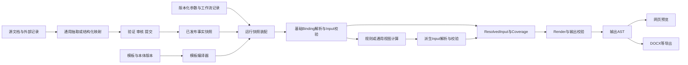

# 报告模板特性的输出语义化重构

设计日期：2026-09-05

状态：完整重构设计，待实施；本文不表示相关能力已经实现或通过验收。

业务基准：风险评估文档模板 `dea037a2-f4b5-478a-8e0e-d5471fc45cbc`。

## 1. 目标与设计结论

保留 Section/Group 的组织能力，将模板的最小内容生成单位定义为 OutputUnit。每个 OutputUnit 在作者视图中包含三个属性：

- **bindings：数据绑定。** 声明来源、主体范围、版本以及可供使用的数据对象。
- **inputs：输入项。** 声明从 Binding 投影哪些数据、引用名称、类型、数量及缺失/冲突策略。
- **render：输出呈现。** 使用已经解析和校验的输入，生成段落、表格、表单等内容。

原 Slot 中的“数据输入”职责命名为 Input；原 Slot 中的“生成一段文字或一张表”职责迁入 OutputUnit.render。Prompt 中的数据引用位置命名为 InputRef。

Input 是 Binding 与 Render 之间的类型化数据契约。模板保存 InputDefinition；运行时产生 ResolvedInput。Render 不负责查找来源、抽取事实、合并主体或判断业务风险。

本方案必须同时实现：

1. 支持源文档、Mock/外部系统、系统参数、人工工作流及确定性规则结果。
2. 业务事实强制绑定本体语义；所有输入强制类型化；技术上下文使用受约束的参数契约。
3. 精确绑定实例、完整关系路径和属性，保留逐值证据、状态及版本。
4. 预览、覆盖检查、行文和下载共享一次运行的输入快照与输出 AST。
5. 表格按记录生成；关键数值与风险结论通过确定性引用呈现。
6. 将业务选择和判断从代码移入可验证的本体、映射及规则定义，最终消除自有生产链中的正则、硬编码业务 finder、标签取值和隐式回退。
7. 有序迁移现有模板，保留原版本、原结构来源及历史报告，明确无法自动迁移的语义。

本重构承接[文档结构解析能力增强设计](文档结构解析能力增强报告模板的关系图谱识别和NER能力.md)及[评审意见](文档结构解析能力增强报告模板的关系图谱识别和NER能力-评审意见.md)，复用 [019 统一文档证据与通用语义抽取](../specs/019-evidence-semantic-extraction/spec.md) 的证据、审核、提交、实例覆盖和退役契约。本文负责模板消费与输出侧重构；上游抽取替代仍按 019 完成，两者共同构成最终退役验收范围。

## 2. 核对依据与现状

### 2.1 证据边界

本次核对基于 2026-09-05 工作区，HEAD 为 `1ae442363bc82ba5df030cb783b47f6e16b0447b`，同时存在大量未提交的 019 实现。下文区分三类依据：

- **数据库实测：** 使用只读查询读取指定 ast_templates 记录。
- **源码核对：** 说明当前工作区中的声明和调用，不等同于已部署进程加载了这些代码。
- **目标设计：** 本文新增的模型、模块、接口与验收要求，均需要后续实现。

本次仅编写设计文档，没有更新已发布模板、修改业务事实或生成业务报告。既往测试结果不作为本重构的通过证据。

### 2.2 指定模板的实际状态

| 项目 | 数据库读取结果 |
|---|---|
| 名称/文号 | 风险评估文档 / QS-A-020F05 |
| 模板版本/状态 | v18 / published |
| schema_json.revision | v1，与数据库模板版本不是同一版本轴 |
| 输入类型 iri_pattern | `https://ontology.pharma-gmp.cn/slpra/drug-development/CMCReport` |
| 更新时间 | 2026-08-31T10:17:55.377618+00:00 |
| default_source_job_id | null；不能据此推断已存在可消费的默认来源事实快照 |
| 结构 | 3 个 Section、6 个 Group、32 个 Slot；Group 均为 fields |
| Slot | 全部为 semantic，全部 required=false |
| Prompt | 29 个 Slot 没有自身 Prompt；3 个有自身 Prompt |
| Coverage | 前两个 Section 未声明；会签 Section 有两条关系，两项 Slot 显式引用 |

具体问题：

- 第一部分的章节 Prompt 同时要求对象描述、设备表、评估小组表、风险矩阵、审批表单。数据输入与内容输出没有独立边界。
- Prompt 使用了 `{{设备}}`，实际 Slot 名称为“使用设备”；依赖中文标签替换无法在结构层保证引用有效。
- 车间说明要求直接访问“抽取事实”，绕开了显式输入；正文使用的数据依赖不完整。
- 风险矩阵的七列被定义为七个独立语义 Slot，不能保证行身份、主体、风险因素与控制措施一一对应。
- Prompt 要求判断危害等级、给出风险受控结论，还要求明确“设备均在确认/校验有效期内”等表述。没有对应已验证结果时，这些要求会诱导补写事实。
- 会签关系的定义域是 RiskAssessmentReport，输入根类型却是 CMCReport。需要独立的报告工作流主体或有证据的关联，不能直接把两种对象当成同一主体。
- “评估小组”和“批准人”在正文及会签 Section 中重复出现，适合共享输入；是否重复展示属于模板布局决策。

### 2.3 当前实现基础与缺口

| 核对位置 | 当前能力/问题 | 重构要求 |
|---|---|---|
| [ast_template.py](../backend/app/services/reporting/ast_template.py)：SemanticSource、Slot、Section、Group | semantic source 保存 Prompt/coverage_refs；Slot 仍同时表示值和内容；Group 有 equipment_table/assessment_table 业务类型 | 建立 V2 的 Binding/Input/OutputUnit；Group 只组织和重复，业务表格由数据契约驱动 |
| 同文件：SnapshotSource、ReportMetadataSource | 已有本体路径与元数据投影入口；结果尚非完整的类型化输入契约 | 作为迁移输入，不能以此认定 V2 已实现 |
| [ontology_meta.py](../backend/app/models/ontology_meta.py)：OntologyClassMapping、OntologyPropertyBinding | 已有来源到本体类/属性的映射 | 复用其身份与版本，不在模板中复制一套源字段业务映射 |
| [fact_selector.py](../backend/app/services/fact_selector.py)：FactSelector | 使用已发布快照，按实例、谓词路径、目标类型筛选，保留事实与冲突信息 | 扩展为 Input 和 Coverage 共用的选择基础 |
| [template_extraction_plan.py](../backend/app/services/extraction/template_extraction_plan.py)：build_instance_coverage | 主要遍历 Section.coverage | 从 Input 依赖编译最低覆盖要求，并保留独立完整性要求 |
| [snapshot_report.py](../backend/app/services/reporting/snapshot_report.py) | 已冻结模板、事实、规则与清单；部分分支仍按 Slot 标签取值；集合投影过早拼成字符串；未实现新的行文执行器 | 保留快照机制，改为 ResolvedInput、RenderResult 和通用输出 AST |
| [extraction.py](../backend/app/api/extraction.py)：generate_risk_report、_build_and_save_report | 当前工作区的报告任务消费冻结清单 | 接入统一 V2 编译、解析和输出服务 |
| [ast_templates.py](../backend/app/api/ast_templates.py)：preview_section_narrative_endpoint | 预览读取 annotation cache，并调用旧评估/叙述链 | 改为同一快照与同一渲染服务；候选预览不得冒充报告预览 |
| [narrative_generator.py](../backend/app/services/reporting/narrative_generator.py) | 存在标签匹配、业务类分支、覆盖未命中后扩大事实范围等机制 | 退役其业务取值职责；行文只接收授权 Input |
| [docx_renderer.py](../backend/app/services/reporting/docx_renderer.py) | 渲染器识别业务 Group 类型及 RiskReport 特定字段 | 改为输出 AST 的格式适配器 |
| [template-slot-editor.tsx](../frontend/src/components/extraction/template-slot-editor.tsx) | 新增项默认 semantic，编辑器围绕 Slot Prompt 和 coverage 子集组织 | 改为 OutputUnit 的“数据绑定、输入项、输出”编辑视图 |

这些代码是可复用基础，也包含明确的替换点。不能将类名中出现 snapshot、semantic 或 declarative 作为完成本设计的证据。

## 3. 不变量与职责边界

| 编号 | 必须满足的约束 |
|---|---|
| OS-01 | Section/Group 保留结构、顺序、标题与 origin；每个 OutputUnit 只生成一次内容 |
| OS-02 | Binding 定位来源及对象，Input 投影和约束数据，Render 消费结果；运行时不越界取值 |
| OS-03 | 每个业务输入可追溯到本体语义，或已注册的规则/工作流业务契约；不存在任意 JSON 业务输入旁路 |
| OS-04 | 所有已编译输入有确定的数据类型；名字和显示标签不参与事实匹配 |
| OS-05 | 主体、关系路径、对象、适用范围、集合完备性和来源版本共同决定取值 |
| OS-06 | 非发布事实不能满足正式输入；候选可以解释缺口，但不成为输入值 |
| OS-07 | 缺失、冲突、明确不存在、条件成立与否、待审核分别处理；0、false 不作为缺失 |
| OS-08 | 表格保持记录/单元格身份；禁止将独立生成的多列字符串按位置拼成业务记录 |
| OS-09 | 风险判断来自有版本的确定性规则或已审核决定；LLM 输出不回流为事实或评估依据 |
| OS-10 | 同次运行的覆盖、计算、预览及下载引用同一输入快照；复用已保存行文不等于承诺模型重跑确定性 |
| OS-11 | 不使用示例文档、训练报告、摘要、Prompt 或格式默认值填补业务事实 |
| OS-12 | 最终产物没有自有可执行正则、业务 finder、标签兜底及按业务类选择算法的隐藏入口 |
| OS-13 | 迁移保留旧版本；无法证明等价的内容形成待处理问题，不能静默转换为已满足 |

## 4. 目标架构与存储形态

### 4.1 作者视图

```text
ReportTemplate
  Section
    Group
      OutputUnit
        bindings   数据绑定
        inputs     输入项
        render     输出呈现
```

三层在配置形态上是同一个输出单元的三个属性；运行时对应三个不同阶段。输入可以被多个输出单元复用，一个输出单元也可以使用多个来源。

### 4.2 规范存储

采用“模板级定义注册表 + 输出单元显式引用”的单一规范表示。编辑器可以在 OutputUnit 内联展开定义，但保存时不复制定义。

```text
TemplateV2
  schema_version = 2
  template_family_id / template_revision_id / revision_no
  document_revision / doc_no
  ontology_release_ref
  source_slots[]                     运行时必须装配哪些来源
  definitions
    bindings { binding_id: BindingDefinition }
    inputs   { input_id: InputDefinition }
  sections[]
    section_id / title / origin / completeness_requirements[]
    groups[]
      group_id / title / origin / layout / repeat?
      units[]
        output_id / title / origin
        bindings: BindingUse[]
        inputs: InputUse[]
        render: RenderDefinition
  style_profile_ref / publication_policy_ref
```

BindingUse 为 `{binding_ref}`；InputUse 为 `{input_ref, alias, required?}`。alias 在输出单元内唯一，供作者阅读；保存的 InputRef 始终引用稳定 input_id。

编译器校验 OutputUnit 声明了所用 Input 及其完整 Binding 依赖闭包。界面自动维护闭包，定义之外的事实不自动进入行文上下文。共享 Input 的修改影响所有消费者，发布前必须显示影响范围。

输入定义的 name 在模板内唯一，label 可重复。稳定 ID 不编码可变标题、标签或排列位置。历史 ID 通过 migration_map 关联到新的输入、字段和输出单元。

### 4.3 来源、声明、运行结果分别保存



计算依赖由编译期 DAG 排序执行；多层派生展开为有序节点，不允许循环。OutputUnit 输出不能作为上游规则输入；多个输出共享同一份解析结果。

## 5. Binding 设计

### 5.1 来源类型与语义类型正交

Mock、文档和数据库说明“数据从哪里来”；Equipment、DrugProduct、CMCReport 说明“数据表示什么”。两者必须分开。

Binding 公共属性：

| 属性 | 语义 |
|---|---|
| binding_id / label | 稳定身份及作者显示名 |
| kind | facts、context、workflow、derived 四种能力类别 |
| contract_ref | 本体发布、参数 schema、工作流 schema 或规则输出契约的版本引用 |
| scope | 来源槽位、主体选择、适用时间、重复项范围等 |
| dependencies | 依赖的 Binding/Input 稳定引用；由编译器形成 DAG |
| output_type | 编译后的类型；作者草稿可等待推导，发布编译产物必须明确 |
| provenance_policy | 所需来源类别和版本/证据要求，不能降低事实发布要求 |

使用按 kind 区分的严格模型；未知字段、未知 provider、未注册契约、循环依赖在编译时拒绝。不能使用 `class_iri: null` 配合任意 payload 作为通用业务旁路。

### 5.2 facts：已发布业务事实

来源槽位声明预期文档类型或外部数据集、允许的已注册映射版本及来源角色。运行时将槽位绑定到具体文档/作业、记录集合和已发布快照。

主体选择采用结构化 SelectorAST：

- 根：`source_root`、已确认的 `entity_ref`、另一个 Binding 的结果，或 `repeat_item`。
- 路径：有方向的完整 predicate_iri 序列。
- 类型：根类型、端点类型及已支持的类型集合。
- 限定：规范主体/对象 ID、适用时间、明确范围；不以文本或编号片段猜测范围。
- 集合：min/max、exists/all、发现状态及范围完整性证明。

Binding 定位对象/记录集合，Input 定位集合内部的属性或投影列。单个设备 Binding 可同时供设备描述和设备表使用。

对 Mock/外部系统：

1. 复用 OntologyClassMapping、OntologyPropertyBinding 的来源映射；连接器按协议读取结构化记录。
2. 外部记录产生 ExternalRecordProvenance，保留系统、数据集、记录键、字段路径、记录版本、值快照和获取时间。
3. 文档中的设备编号仅可作为身份关联证据；材质值的出处仍是外部记录。
4. 记录关联、验证、审核与提交在冻结之前完成。Render 阶段不得调用外部服务补全事实。
5. Mock 身份随来源保存并在数据追溯中展示，不伪装为真实外部系统。

结构化字段映射允许按源 schema 的明确字段路径取值；不得用字段标签模糊匹配、设备编号语法或业务类专用文本解析器替代映射。

scope.source_slot 确定起点来源，fact_source_refs 明确允许参与路径求值的来源槽位集合，省略时仅包含起点槽位。一个已发布快照内部可以同时包含文档和外部记录来源，逐值 provenance 保持原样；跨快照联合则必须显式列出所有槽位。

跨来源路径只连接已发布的规范实体身份及已验证关联。相同类、相同名称或相似编码不建立关联；身份映射未确认时，联合投影保持未完成。冻结每个来源的断言集合后，按规范主体与属性检测跨来源冲突，不能只分别验证各源就假定合并结果无冲突。

### 5.3 context：系统参数与运行上下文

只允许读取已注册 schema 的字段，并区分：

- **运行元数据：** 如本次报告生成基准时间、来源文件名、格式配置。使用明确类型，冻结取值，无需强制建立本体类。
- **领域参数：** 如阈值、评估适用条件。必须引用领域参数定义及规则参数契约，保留适用范围、来源和版本；已有本体语义时一并关联。

“生成日期”可来自本次运行时钟，“评估日期”“审批日期”须来自相应业务记录，不能互相代填。相同数值来自系统参数，也不因此自动获得业务适用性。

禁止模板随意提供业务常量；固定的标题、标点等进入 Render.text。确属业务默认参数的值必须进入版本化参数定义，其使用保留参数来源，不伪装为文档事实。

### 5.4 workflow：人工与流程记录

绑定明确的流程实例、阶段、字段及修订。人员名单、QA 意见、审核决定、签署记录分别有类型、主体和审计来源。

名单只证明成员信息，不能证明其已经签字。结构化签名/日期输入在未签署时保持 pending_review 或 missing，表单可展示待签位置。人工输入业务事实仍应进入既有审核/提交契约；工作流状态和签署证明使用版本化流程契约。

绑定当前输出报告时，使用运行前建立的报告工作流主体或关联记录，不能读取尚未生成的正文来生成本身。具体签署生命周期见 §12.4。

### 5.5 derived：规则结果与通用数据视图

支持两类已注册能力：

- **rule_result：** 引用规则集、规则版本、参数映射和输出 schema；输入取自 ResolvedInput。
- **view：** 对已声明输入执行投影、筛选、排序、分组、按键关联、范围组装及有版本的单位转换。

通用操作使用有限、结构化的操作 AST。按稳定键 join，声明连接基数和缺失/冲突行为；禁止隐式笛卡尔积、按列表位置 join 或把匹配失败解释为无记录。

业务决策、阈值及风险等级映射放入规则定义。view 不接受 Python/JavaScript 回调、任意 SQL、表达式脚本或正则。view 转换保留上游语义和逐值 lineage；新的业务推导必须有显式输出契约。

一个 Input 原则上引用一个 Binding。多来源组合先声明 derived Binding，明确关联键、优先级、冲突及适用规则；不能在 Input 中隐藏“哪个源有值就用哪个源”的逻辑。来源不可用、冲突和待审核不得触发针对“正常缺失”的自动备选策略。

## 6. 本体约束与类型系统

### 6.1 强制语义绑定的范围

| 数据 | 强制约束 |
|---|---|
| 本体对象/对象集合 | 类或类型集合、规范实例身份、选择路径 |
| 数据属性值 | 所属主体、属性 IRI、datatype、适用单位/词表 |
| 关系投影 | 完整关系路径、方向、端点类型、数量与适用范围 |
| 组合记录 | 逐列语义及类型；无需为每张报表建立一个本体类 |
| 规则结果 | 规则版本、输出契约、字段语义、输入事实与参数 lineage |
| 工作流业务值 | 版本化流程字段语义及身份/审核证明；已本体化字段引用本体 |
| 技术元数据 | 受约束的 context schema 和字段类型 |

Input 的语义从 Binding 与 projection 推导，避免作者分别填写两套可能矛盾的类/属性定义。作者可增加更严格的约束，不能声明与来源不兼容的类型以掩盖错误。

### 6.2 TypeSpec

支持以下封闭类型，并允许递归组合：

```text
string / boolean / integer / decimal / date / datetime / year_month
enum(vocabulary_ref)
quantity(decimal, dimension, unit)
range(value_type, lower_inclusive, upper_inclusive)
entity(class_constraint, identity, display_projection)
record(fields: { field_id: type + semantics + constraints })
list(item_type, cardinality, item_identity)
```

decimal 使用规范十进制表示，避免浮点误差。年月不可自动补成某日；范围保留开闭边界；布尔 false 与缺失不同。实体显示使用明确的标签属性及语言优先级，标签只用于展示。

record 保留稳定 field_id；表头可任意改名。列表项和单元格均保存独立状态及来源，不能把一行中某列缺失转化为删除整行。

### 6.3 发布编译检查

编译器针对固定 ontology_release_ref：

1. 解析实际存在的类、数据属性和对象属性，处理已支持的继承与联合类型；不靠 local-name 猜测 IRI。
2. 校验每步关系方向、适用主体及端点，校验最终数据属性属于投影对象。
3. 推导类型、单位、词表、数量约束；本体约束和模板附加约束共同生效，互相矛盾则拒绝发布。
4. 对本体没有表达清楚的单位/基数，在受版本管理的类型契约中显式补充，不能从“_kg”等名称后缀自动推断。
5. 对未支持的复杂公理、datatype facet 或需要执行正则的 pattern，返回明确诊断。不能静默略过约束后宣称通过。

这里建立的是应用输入验证契约，不把本体的开放世界语义当作完整性证明。类层面的“应存在某关系”不能替代该实例上已发布的关系和对象发现证据。

### 6.4 已核实的本体实例

以下为仓库 TTL 中实际存在的定义，具体部署还必须核对所用本体发布：

- [slpra-drug-development.ttl](../ontology/slpra/slpra-drug-development.ttl)：CMCReport — describes → DrugProduct；CMCReport — hasProductionPlan → ClinicalSampleProductionPlan；CMCReport/SynthesisStep — usesEquipment → Equipment。
- [slpra-drug.ttl](../ontology/slpra/slpra-drug.ttl)：projectCode 是 DrugProduct 的字符串属性。名称/代号不能不经确认就统一解释为一个虚构的 drugName 属性。
- [slpra-equipment.ttl](../ontology/slpra/slpra-equipment.ttl)：equipmentID、equipmentName、modelSpecification 是数据属性；constructedOf 是指向 ConstructionMaterial 的对象属性。
- [slpra-risk.ttl](../ontology/slpra/slpra-risk.ttl)：hasAssessmentTeam、hasApproverTeam 的定义域为 RiskAssessmentReport。

设备材质应通过 constructedOf 取得材料对象，再按明确展示规则呈现。不能把该对象属性当作字符串字段读取，或者把“设备编号证明其材质正确”当作来源证明。

## 7. InputDefinition 与运行时值

### 7.1 输入定义

| 属性 | 要求 |
|---|---|
| input_id / name / label | 稳定 ID、模板内唯一引用名、可变显示名 |
| binding_ref | 一个已声明 Binding |
| projection | identity、property、entity、record、list 等结构化投影；包含完整相对路径/列字段 |
| expected_type | 可选作者类型断言；编译产物的 resolved_type 必填 |
| constraints | 单位、词表、上下界、数量、记录字段及集合完备性要求 |
| required | 是否计入使用位置的最低材料要求 |
| status_policy | 分别声明缺失、不适用、明确不存在、冲突、待审核等状态的处置 |
| origin | 从模板样例导入时保留的结构定位，不是业务值来源 |

普通属性投影可使用空的关系路径，表示直接读取已定位对象的属性；关系集合选择必须声明实际路径。relation-presence 投影不得以“未找到边”直接产生 false。

InputUse 可以将共享输入提升为当前位置必需，不能降低 InputDefinition 的强制约束。语义值、约束和原始状态只计算一次；各位置可以使用不同数字格式或缺失展示文案。

条件输出声明结构化 when，引用已解析的布尔/枚举输入或适用性决定。编译器保留全部分支依赖；只有条件被可靠判为 false 的分支才免于该次运行要求。条件未知时保留相应缺口，不能通过隐藏 OutputUnit 使材料自动完备。

只对被有效输出单元、规则或独立完整性要求引用的定义编译运行依赖；未使用定义给出诊断，不能自动扩大取值范围。

### 7.2 ResolvedInput

```text
ResolvedInput
  input_id / input_definition_hash
  execution_scope_id                 根主体及重复项身份
  resolved_type / semantic_ref
  value                             类型化值；不可用时无业务值
  state                             主状态
  issues[]                          全部并存问题，不被主状态覆盖
  items / fields                    列表项和记录字段的解析结果
  subject_refs / object_refs
  fact_refs / provenance_refs
  applicable_scope / discovery_ref
  input_snapshot_id / resolver_version
  derivation                        操作、规则、参数与上游引用
```

展示值如“待补充”由 Render 产生，不写入 value。缺失状态不能被转换成字符串后重新作为合法数据参与规则。

### 7.3 状态与处置

| state | 含义 | 可用行为 |
|---|---|---|
| ready | 值及约束成立，所需审核/发布完成 | 按类型引用 |
| missing | 在声明范围内缺少所需值，尚无不存在证明 | 提示补充；必需项阻止材料完备 |
| confirmed_absent | 有范围匹配的已发布不存在证据 | 仅在契约允许时按不存在呈现；不自动满足 min_count=1 |
| not_applicable | 有明确适用性规则或审核记录支持不适用 | 保留决定及来源，按声明免除对应要求 |
| pending_review | 相关值/主体尚待审核或工作流未完成 | 显示待审核，不把候选值当成事实 |
| conflict | 多值、极性、身份或基数冲突 | 保留冲突证据，阻止依赖的确定性结论 |
| invalid | 类型、单位、路径实例或约束错误 | 显示诊断，禁止转换成有效值 |
| incomplete | 对象发现/范围处理未结束、列表被截断等 | 可预览已知部分，不声称覆盖全部 |
| unavailable | 来源、契约或必要服务不可用 | 显示不可用，不按普通缺失启用备选源 |

state 用于调度和展示，issues 保留所有问题。冲突与未审核可同时存在；不得因为挑选一个主状态而丢失另一个问题。

列表另带 discovery 状态。已知没有匹配项、范围内已证明没有项、来源根本未查完是不同情况。只依赖已知部分的预览必须标注“部分数据”；all 和完整统计依赖必须等待闭合范围。

status_policy 的动作限定为 block、annotate、omit、render_absence、render_not_applicable 及契约许可的参数默认值。策略不能修改原始状态或把材料从不完整改成完整。可选项也不能静默吞掉冲突。

否定断言本身可验证、审核和发布，但不得物化为相反的肯定事实。条件断言只有在匹配的已验证适用条件下才能支持该范围的投影，不能输出为无条件事实。

## 8. Section、Group、复用与重复

Section 保留标题、顺序、样例来源和独立完整性要求。Section 可提供语言、语气、格式等样式默认值；不再保存会被每个输入重复执行的整章 Prompt。

需要章节引言或总结时，将其建成有独立 Input 依赖的 OutputUnit。总结使用事实或规则输入，不能反向依赖其他单元生成的文字来确定业务结论。

Group 保留组织和布局，移除 equipment_table、assessment_table 等业务分支。设备表和评估表都由 Render.kind=table 加记录 schema 表达。

重复分组声明：

```text
repeat
  repeat_id
  input_ref                         已解析的对象/记录列表
  item_key                          稳定实体 ID 或已声明复合记录键
  order_by                          明确字段及稳定兜底键
  item_scope                        编译器生成的类型化当前项范围
```

重复范围中的 Binding 通过 repeat_item 定位当前项，不能按其标题重新搜索全文。驱动列表不允许反向依赖自己的重复项，嵌套重复有深度/行数预算。

运行时输出身份由 output_id 与有序重复项身份链共同决定；去重使用实体/记录身份，不能按名称去重。多个车间、药品、生产计划存在时，先确定真实关联再重复，不能把所有设备复制到每个车间。

共享定义不等于共享运行值：同一 Input 在不同主体或重复范围下产生不同 ResolvedInput。缓存必须包含 execution_scope_id。

## 9. Coverage 与输入依赖统一

最低覆盖要求从当前有效的必需 Input、规则参数与 Render 的结构化引用依赖编译产生。可选输入同样计算状态，但不默认计入材料阻断项。

Section.completeness_requirements 保留独立业务完整性要求，例如“所有参与生产的设备均具有所需验证材料”。这些要求可以超出正文展示字段；不能由 LLM 从自然语言 Prompt 临时猜测。

两类要求合并为统一 RequirementPlan：

```text
Requirement
  requirement_id
  origin_refs[]                     input/field/section/rule
  source_slot / subject_selector
  complete_predicate_path / property_refs
  object_scope / applicable_scope
  quantifier / min_count / max_count
  discovery_requirement
  required / policy_ref
```

去重依据完整结构化语义、主体范围和适用范围；不得继续使用 predicate/range 短名称拼出的 coverage_key 作为唯一身份。复用要求保留全部消费者引用，界面可回溯受影响输出。

Coverage 与 Input 使用同一选择器和事实集合。Coverage 满足不代表行文已经生成；行文生成成功也不代表材料完备。分别记录材料状态、输出执行状态和审核状态。

缺口补抽只生成/调度 019 的通用抽取任务，不能由 Input resolver 或 Render 直接补造值。补抽提交后产生新事实快照和新运行；旧快照、旧预览保持可回放。

## 10. Render 与输出 AST

### 10.1 通用渲染类型

| kind | 输入与行为 |
|---|---|
| narrative | 引用标量、对象或受约束记录，生成一个连贯行文单元 |
| table | 消费 record list；按 field_id 定义列、排序、分组及单元格格式 |
| form | 消费命名输入，输出键值、勾选项和待人工填写位置 |
| list | 对类型化集合生成有序或无序列表 |
| static | 已批准的固定标题、说明、分隔内容；不承载运行时动态事实 |

OutputUnit 表示一个可独立验证的内容单元，不强制等于一个段落。narrative 可以产生多个段落，但不包办未声明的表格或整章数据获取。表格应成为独立 OutputUnit。

### 10.2 引用使用 AST

Prompt 编辑器把输入显示为可点击标记，例如“药品代号”，保存为：

```json
{
  "kind": "input_ref",
  "input_id": "inp_product_code",
  "field_path": [],
  "format": {"kind": "text"}
}
```

PromptSpec 包含 instructions、允许的 input_refs、风格配置和生成策略。富文本指令中的引用也存为节点。运行前，编译器校验所有引用都属于 OutputUnit.inputs；列表项引用还必须声明迭代范围。

旧的 `{{字段名}}` 仅作为迁移输入，使用无正则的有限状态扫描器解析；唯一精确名称映射成功后转换为 ID。歧义、未找到、空占位符均产生迁移问题，不能自动用相似标签替代。

V2 原生保存和渲染不依赖占位符字符串替换。文本中出现字面量大括号按 Text 节点保留，不触发数据获取。

### 10.3 确定性行文与模型辅助行文

narrative 支持两个明确模式：

- **composed：** 作者配置 Text、InputRef、ClaimRef、条件与重复节点，确定性组装。条件读取已声明布尔/枚举输入，未知状态有独立分支。
- **assisted：** LLM 根据已声明输入及 Prompt 生成受约束的内容 AST，保留 InputRef/ClaimRef，关键值在输出验证后由系统插入。

ClaimRef 引用规则结果或经过审核的业务声明，不是模型自由生成一个 claim_id 就自动获得可信度。ClaimCatalog 由当前运行的已验证输入、规则和有版本声明模板构建，保存声明语义、适用范围和证据引用。

关键数值、单位、主体名称、风险等级和签署信息使用确定性引用。模型不得重算风险、推断控制措施已实施、将待评估改为可接受，或补写不存在的人员和日期。

输出校验分两部分：

1. 机器可判定检查：AST 类型、输入授权、引用存在、字段/主体范围、关键引用保留、声明范围、重复项数量和输出预算。
2. 行文语义检查：自由文字是否增加无依据判断、扩大适用范围或改变否定/条件含义。

第二部分不能仅凭 Prompt、引用存在或模型自评分证明正确。需要自动质量评测和按报告策略进行的人工复核。要求自动形成严格受控内容时，使用 composed 或受限的已批准 Claim 模板；assisted 自由文字未完成必要审核时不能标记为正式批准内容。

模型不可用或输出校验失败时，仅该单元返回 unavailable/invalid。可以启用模板预先声明并通过验证的 composed 备用呈现；不能调用旧 finder、扩大事实范围或填入示例段落。有限重试只修复输出结构，不改变事实集合。

### 10.4 表格与表单

table.columns 引用稳定 field_id，支持文本、数量、单位、日期、实体标签及状态展示。列表顺序由显式排序字段与稳定记录键决定，显示序号属于排版数据。

风险矩阵使用一份 risk_rows 记录集合，至少保留：

```text
row_id / assessment_subject / scope
rule_id / rule_version / parameter_snapshot_ref
hazid / contributing_factors
pre_control_level / post_control_level
control_measures / implementation_evidence
traceability / status
field_states / fact_refs
```

这些字段来自已注册规则输出契约，不把它们编码为通用渲染器的固定属性枚举。风险状态必须保留 unknown/待评估及不适用等真实状态；业务允许的最终枚举由规则契约决定。计划中的控制措施不能直接支持控制后风险降低。

表单的空签字栏是布局节点，不能被解析为已签署的 Input。姓名、部门、角色从结构化字段读取，不让 LLM 拆分“姓名（部门）”作为生产数据转换。

### 10.5 RenderResult

```text
RenderResult
  output_instance_id / output_definition_hash
  input_snapshot_id / consumed_input_refs[]
  output_ast
  citations[]                         节点/行/单元格到输入及证据的映射
  generation_metadata               模型、Prompt、解码、尝试次数、内容哈希
  execution_status / validation_issues / review_status
```

输出 AST 使用 paragraph、text、value、table、row、cell、list、form_field、citation 等通用节点。所有节点有稳定身份，网页与 DOCX 从同一 AST 渲染，不互相解析生成后的 Markdown 或 HTML。

来源正文和外部值始终作为数据，不能改变系统指令、输入授权或执行工具。各格式适配器按目标格式转义文本；用户可见内容不暴露实现日志。

## 11. 编译、解析与冻结运行

### 11.1 唯一服务入口

新服务按以下顺序运行：

1. **compile：** 解析模板版本、本体发布、来源/规则契约，建立类型、引用和依赖图。
2. **bind_context：** 将来源槽位绑定到具体已发布事实、文档根实例、参数修订和工作流记录。
3. **freeze_sources：** 保存不可变 SourceBundle，记录所有有效输入版本、发现与审核诊断版本。
4. **resolve：** 按 DAG 解析 Binding 和基础 Input，执行确定性规则/通用视图，再解析派生 Input。
5. **validate：** 产生 ResolvedInput、实例级 Coverage 及报告材料状态。
6. **freeze_inputs：** 保存不可变 ReportInputSnapshot。
7. **render：** 各 OutputUnit 只读取快照中的授权输入，生成并校验 RenderResult。
8. **assemble/export：** 按 Section/Group 顺序组成输出 AST，保存预览与导出工件。

来源未准备就绪时返回缺口和准备操作引用。生成报告请求不能隐式确认候选、提交事实或把 Mock 实时响应直接当成已发布证据。

现有“冻结之后进入后台渲染”的边界继续保留。若解析也放入后台，受理时先冻结 SourceBundle；后台只消费它，不读取不断变化的“最新”来源。

### 11.2 SourceBundle 与 ReportInputSnapshot

SourceBundle 至少固定：

- 模板家族、不可变修订、schema hash、编译器版本和本体发布/hash。
- 每个 source_slot 的文档/作业/实体根 ID、已发布事实快照 ID、来源角色及内容 hash。
- 外部映射版本、记录版本、规范实体映射/归并版本；来源之间已验证的身份关联。
- 参数契约及取值、工作流实例与修订、规则集定义与版本。
- 适用时间、时区、语言、发现范围和完备性决定、相关审核/冲突诊断修订。
- 样式资产、Prompt 策略、模型配置和执行预算的确定版本。

多个来源可以各自有独立快照，通过 SourceBundle 形成一次报告的固定版本向量；不虚称外部系统之间存在同一数据库事务。要求时间一致性的 Binding 还应声明有效期/允许时间差，违反时不可投影为一致事实。

ReportInputSnapshot 包含 SourceBundle、完整 ResolvedInput、规则/视图结果、Coverage、lineage 和材料状态。快照身份按规范序列化内容计算，自身 ID 字段不参与自身 hash；写入后不可修改。

底层 EvidenceSnapshot 表示已发布事实集合，ReportInputSnapshot 表示一次报告的完整输入契约结果，两者有显式引用关系，不互相替代。

候选和未完成发现任务只进入冻结诊断，用于说明 pending_review/incomplete；不进入可呈现的业务 value。不能先忽略相关未审核冲突生成“完整”报告，再在追溯界面补上提醒。

### 11.3 并发、幂等和缓存

模板编辑使用 expected_revision/hash；发布后变更创建新修订。来源在冻结过程中改变时，按版本重新读取或返回冲突，不能拼接两个版本的记录字段。

report_run 幂等键包含调用方请求键及来源/模板身份；同键不同内容返回冲突。重试复用已冻结输入与已完成单元，不能重新取最新参数或再次随机生成所有段落。

| 缓存对象 | 必须覆盖的身份 |
|---|---|
| 编译结果 | schema hash、本体/参数/工作流/规则契约、编译器及类型系统版本 |
| Binding/Input | 编译节点 hash、来源快照、主体/重复范围、适用时间、身份映射、发现和审核诊断版本、解析预算及策略 |
| 规则/视图 | 操作与规则版本、输入值/状态/证据 hash、参数、单位转换版本 |
| 模型结果 | 输入快照与授权子集、Prompt/ClaimCatalog/模型/tokenizer/解码/裁剪策略及版本 |
| 格式工件 | 输出 AST hash、样式资产 hash、格式适配器版本、语言与格式参数 |

影响状态的字段同样进入缓存键。相同 input_id 在不同药品、不同重复行或不同发现状态下不得共享值。权限上下文不能通过缓存越过来源可见性检查。

设置图遍历深度、节点/记录数、输出单元数、嵌套重复深度、模型 token/超时/重试和整体运行预算。达到上限必须标记 incomplete 或执行失败，不能静默截断后宣称 all 满足。

## 12. 预览、导出与签署一致性

### 12.1 三种预览

| 入口 | 数据边界与呈现 |
|---|---|
| 布局预览 | 不需要事实；使用类型占位节点展示结构，不填入看似真实的业务示例值 |
| 数据/缺口预览 | 展示 ResolvedInput、Coverage 和证据；未发布候选放在独立审核视图 |
| 报告预览 | 使用冻结输入、统一 Render 和输出 AST；与下载对应同一次 render attempt |

草稿模板可以针对已发布事实进行报告预览，快照记录草稿 hash，页面明确为模板草稿预览。正式报告要求已发布模板修订；来源尚未发布时保留布局/缺口预览能力。

旧 preview-section-narrative 接口过渡期将请求转换为显式临时模板修订，再调用统一服务。不能只修改一个 Prompt 却继续使用原模板 hash，也不能再读取 annotation cache 作为事实。

### 12.2 预览与下载的含义

网页与 DOCX 的业务文本、记录顺序、关键数值、缺失标注和来源引用应一致；分页、字体度量等格式差异单独验收。下载直接使用该次 AST 对应的已保存工件，不重新调用模型。

“再次生成”创建新 attempt；“重放”读取已保存输入、结果及工件。即使模型支持随机种子，也不承诺跨部署重新推理逐字相同。

示例 DOCX 只提供经识别/确认的样式、页眉页脚、静态结构及合法资产；动态样例段落、签名和结论不自动保留。样式资产按内容 hash 固定，不能仅保存可被覆盖的路径。

### 12.3 三条状态轴

- execution_status：pending、running、completed、failed、cancelled。
- material_status：ready、incomplete、conflict、invalid 等材料状态。
- review_status：draft、pending_review、approved、rejected。

生成了可下载草稿，可以是 completed + incomplete + draft。不能因为文件存在就标记为已完成评估或已经批准。

报告策略区分草稿、送审和正式工件。草稿允许缺口标注；送审要求满足配置的提交条件；正式工件须满足必需材料、适用性与审核条件。缺失策略只影响呈现，不绕过这些条件。

### 12.4 会签与报告主体

输入文档实例和输出报告工作流主体分别建模。可以使用已持久化的报告草稿主体，按实际来源关联评估/审批团队；也可以直接绑定有版本的团队分配工作流记录。二者都需要明确记录，不允许将 CMCReport 强行赋为 RiskAssessmentReport。

如果使用 hasAssessmentTeam/hasApproverTeam 路径，必须有对应 RiskAssessmentReport 主体和已发布关系。没有这些事实时返回缺口，不能通过模板声明凭空创建团队关系。

签署采用两个阶段：

1. 固定送审内容的 AST、输入快照和内容 hash。
2. 工作流签署记录引用该内容 hash，形成带签署证明的最终工件；追加签署展示不得重跑行文或修改原业务内容。

签署记录不参与被签正文自身 hash 的递归计算。内容改变后创建新内容版本并重新满足签署要求；旧签名不能自动复制到新报告。签署展示、参与人员名册和业务审核意见分别保留来源。

## 13. 持久化与版本迁移

采用现有数据库保存定义、运行状态和结构化工件索引；已有文件存储保存按内容身份固定的资产。具体新表名如下，属于目标设计：

| 对象/表 | 核心内容与约束 |
|---|---|
| ast_templates 扩展 | schema_version、template_family_id、revision_no、schema_hash；现有 id 作为 template_revision_id；已发布 schema 不可原位覆盖 |
| template_compilations | 模板修订、全部契约版本、编译器版本、编译计划、类型及引用清单、诊断与 hash；相同编译身份唯一 |
| report_runs | 请求/幂等身份、调用者、模板编译引用、冻结 SourceBundle、阶段、预算、各状态轴及最终 AST 引用；冻结字段写入后不可修改 |
| report_input_snapshots | 完整 ReportInputSnapshot，不可变；共享去重时仍校验来源访问权限 |
| report_output_results | run、output_id、execution_scope_id、attempt 的唯一组合；AST、引用、生成元数据、验证和审核记录 |
| report_artifacts | 聚合 AST/内容 hash、格式、样式版本、文件 hash/地址、工件用途及签署引用 |
| template_migration_plans | 原修订/hash、目标 schema、逐项映射、问题与变更差异、处理/执行记录 |

template_family_id 与整数 revision_no 是内容版本身份，数据库既有 version 字符串继续作为历史显示值。schema_version 表示结构协议，document_revision 表示打印在业务文档上的修订标识，三个版本轴不得混用。

旧版本分组不只按名称猜测；根据现有版本链、创建记录及显式迁移映射确定家族。无法唯一恢复的记录保持独立家族并登记问题。新家族内 revision_no 唯一，显示名变化不改变家族身份。

保留 GeneratedReport 作为兼容入口，新增 run/artifact 引用，旧字段作为投影或历史数据读取；不能同时维护两套互相独立的正文真值。EvidenceSnapshot、EvidenceAssertion、EvidenceCoverage 继续属于证据域，新报告快照引用它们，不覆盖历史 payload。

旧 SlotDismissal 只说明用户忽略了某项提示。迁移时保留历史，不能自动转成新契约的 not_applicable 或证明必需项已经满足。新的适用性决定必须带范围、理由、操作者、版本及依据。

模板 schema、解析结果和输出 AST 使用严格的按版本模型验证；客户端不支持新 schema 时拒绝编辑保存，防止旧客户端静默丢掉 bindings/inputs/render 等字段。

运行状态写入可变，输入快照和已完成 attempt 不可变。失败重试创建新 attempt 或从明确 checkpoint 恢复；工件先写临时对象，核对 hash 后原子登记。引用中的事实、样式、规则和文件受历史保留约束，逻辑删除不能破坏已有报告重放。

## 14. 服务与接口契约

### 14.1 内部服务

| 目标模块 | 职责与复用点 |
|---|---|
| reporting/template_v2.py | TemplateV2、OutputUnit、Binding、Input、Render 声明模型 |
| reporting/template_compiler.py | 类型推导、引用解析、DAG、RequirementPlan；复用本体 schema |
| reporting/binding_resolver.py | 按通用 kind 调度；facts 复用 FactSelector，来源映射复用现有映射记录 |
| reporting/input_resolver.py | 类型化投影、状态合成、单位及字段约束、lineage |
| reporting/report_snapshot.py | SourceBundle/ReportInputSnapshot 身份、冻结及恢复；承接 snapshot_report |
| reporting/output_renderer.py | composed、table、form、list、static；不包含业务类分派 |
| reporting/narrative_renderer.py | assisted 的输入封装、结构化模型调用、引用及输出检查 |
| reporting/output_ast.py | 统一内容节点、单元格引用、工件内容 hash |
| reporting/template_migration.py | V1→V2 结构转换、差异和未解决问题；承接现有升级能力 |
| docx_renderer 及网页适配器 | 仅处理通用输出 AST 与格式，不读取候选、源系统或业务规则 |

这些名称用于明确代码边界，不要求复制已有等价模块。落地时可以扩展现有文件，但必须删除旧职责并让调用关系可审计。

### 14.2 对外接口

以下路径为新增目标契约，沿用项目已有身份认证、角色与资源权限。

| 方法/路径 | 请求重点 | 返回与约束 |
|---|---|---|
| POST /api/ast-templates/{id}/compile | draft schema 或修订引用、expected_hash | 类型、依赖、Coverage 计划、逐字段诊断；不读取或生成业务事实 |
| POST /api/ast-templates/{id}/migration-plan | 原修订/hash、目标 schema_version | 目标草稿、逐项映射、差异、阻断问题；不更新原版本 |
| POST /api/ast-templates/{id}/revisions | 已校验草稿、expected_revision | 新修订；不覆盖 published 版本 |
| POST /api/ast-templates/{id}/publish | 精确草稿 hash、编译身份 | 验证契约和发布条件后冻结；不要求当时已有每次运行的数据 |
| POST /api/report-previews | layout/data/report 模式、模板草稿/hash、来源绑定、选定单元 | 预览运行 ID、状态、诊断；report 模式使用已发布事实 |
| POST /api/report-runs | 已发布模板修订、来源/主体绑定、用途、幂等键 | run_id、固定来源身份与异步进度 |
| GET /api/report-runs/{id}/inputs | 输入/范围/分页选择 | ResolvedInput、逐值来源与完整性状态 |
| GET /api/report-runs/{id}/coverage | 按 Section/Group/Input 筛选 | 完整状态及受影响消费者 |
| GET /api/report-runs/{id}/outputs | 单元/attempt 选择 | 输出 AST、引用、验证及审核状态 |
| GET /api/report-runs/{id}/artifacts/{artifact_id} | 已保存工件身份 | 同次输出的下载；不重新生成 |

请求只允许引用服务端可验证的来源对象、发布快照及参数记录。不能让客户端上传一个“已发布”payload 或“已审核”状态绕过来源校验。

原 /jobs/{job_id}/risk-report 继续作为迁移期门面，将 job_id 装配为 source_slot，调用相同 ReportRun 服务。原 AST coverage 接口转发相同 RequirementPlan 结果。旧 preview-section-narrative 的适配边界见 §12.1。

默认源文档是来源槽位的便捷选择，不是事实证明。读取模板详情不能顺便创建抽取作业；准备来源、审核、提交与生成报告分别展示状态和操作。

### 14.3 诊断协议

诊断返回 code、severity、schema_path、binding/input/output_ref、execution_scope、expected、actual、evidence_refs、remediation。代表性 code：

```text
UNKNOWN_ONTOLOGY_REFERENCE        ONTOLOGY_PATH_TYPE_MISMATCH
UNRESOLVED_INPUT_REFERENCE        INPUT_TYPE_MISMATCH
DEPENDENCY_CYCLE                  SUBJECT_AMBIGUOUS
FACT_NOT_PUBLISHED                SOURCE_VERSION_CHANGED
CARDINALITY_CONFLICT              OBJECT_UNIVERSE_OPEN
UNIT_INCOMPATIBLE                 WORKFLOW_NOT_SIGNED
UNSUPPORTED_LEGACY_EXECUTION      OUTPUT_REFERENCE_INVALID
MODEL_UNAVAILABLE                OUTPUT_REVIEW_REQUIRED
```

诊断要能定位到作者可编辑的具体项。网页分页不改变底层集合完备性；服务端因预算未读取全部记录必须另报 OBJECT_UNIVERSE_OPEN/incomplete。

## 15. 模板编辑器交互

保留现有 Section/Group 树、拖动排序和来源定位，树下的内容项改为 OutputUnit。用户编辑一个输出单元时依次看到：

1. **数据绑定：** 选择来源、对象和范围，显示实际本体类型及版本；文档样例和来源文档明确标识各自用途。
2. **输入项：** 从 Binding 的合法属性/关系菜单选择字段；自动推导类型，可编辑引用名称、显示名、必需条件和状态处置。
3. **输出：** 选择段落、表格或表单；插入输入标记；配置表格列、分组/排序和必要行文指令。

输入编辑器显示“这项输入被哪些输出使用”，Binding 变更显示影响到的输入、覆盖与输出。重新命名只修改显示，删除被引用项必须先修复依赖。类型不兼容的拖放直接提供诊断。

表格作者选择一个记录列表，再配置列；不能分别填写七个“生成这一列”的 Prompt。列表中有多个主体时，界面要求明确重复或筛选范围，不默认选择第一项。

Section 的“完整性要求”作为独立面板保留，同时展示由输入自动推导的只读最低要求。允许追加业务要求，不能通过取消显示某列删除规则所需材料。

样例导入继续复用 DocumentIR/TemplateOrigin。从表格识别出 table OutputUnit 候选，从字段表识别 form 候选，从叙述块识别 narrative 候选。结构证据不等于语义绑定；无法确认的输入显示待配置，不能默认创建一个有 Prompt 就算完成的 semantic Slot。

AI 辅助仅提出合法 ID 范围内的结构、输入投影和行文建议，服务端编译后形成可审阅差异。模型不提供来源事实，也不能发布模板、确认候选或制造未知本体属性。

预览分屏可以查看呈现内容、输入值/状态和逐值证据。普通报告阅读视图使用业务措辞，技术 IRI、版本和编译诊断放入追溯/作者面板。

## 16. 最小完整配置示例

下例展示一个 CMC 来源、两个 Binding、两个 Input 和两个 OutputUnit，包含实际存在的本体 IRI。它是目标协议示例，不是已发布业务配置；EXAMPLE 标识代表尚需替换的真实版本/资源引用。示例未提供任何业务事实，不能直接用于生成当前报告。

```json
{
  "schema_version": 2,
  "template_family_id": "EXAMPLE_TEMPLATE_FAMILY",
  "template_revision_id": "EXAMPLE_TEMPLATE_REVISION",
  "revision_no": 1,
  "document_revision": "示例",
  "doc_no": "示例",
  "ontology_release_ref": "EXAMPLE_PUBLISHED_ONTOLOGY_RELEASE",
  "style_profile_ref": "EXAMPLE_STYLE_PROFILE",
  "publication_policy_ref": "EXAMPLE_REPORT_POLICY",
  "source_slots": [
    {
      "source_slot_id": "cmc",
      "kind": "document",
      "class_iri": "https://ontology.pharma-gmp.cn/slpra/drug-development/CMCReport",
      "required": true,
      "allowed_role": "analysis_source"
    }
  ],
  "definitions": {
    "bindings": {
      "bind_product": {
        "binding_id": "bind_product",
        "label": "当前文档描述的药品",
        "kind": "facts",
        "contract_ref": {
          "kind": "ontology",
          "release_ref": "template.ontology_release_ref",
          "root_class_iri": "https://ontology.pharma-gmp.cn/slpra/drug-development/CMCReport",
          "result_class_iri": "https://ontology.pharma-gmp.cn/slpra/drug/DrugProduct"
        },
        "scope": {
          "source_slot": "cmc",
          "root": {"kind": "source_root"},
          "predicate_path": [
            {
              "predicate_iri": "https://ontology.pharma-gmp.cn/slpra/drug-development/describes",
              "direction": "forward"
            }
          ],
          "cardinality": {"min_count": 1, "max_count": 1}
        },
        "dependencies": []
      },
      "bind_equipment": {
        "binding_id": "bind_equipment",
        "label": "当前文档使用的设备",
        "kind": "facts",
        "contract_ref": {
          "kind": "ontology",
          "release_ref": "template.ontology_release_ref",
          "root_class_iri": "https://ontology.pharma-gmp.cn/slpra/drug-development/CMCReport",
          "result_class_iri": "https://ontology.pharma-gmp.cn/slpra/equipment/Equipment"
        },
        "scope": {
          "source_slot": "cmc",
          "root": {"kind": "source_root"},
          "predicate_path": [
            {
              "predicate_iri": "https://ontology.pharma-gmp.cn/slpra/drug-development/usesEquipment",
              "direction": "forward"
            }
          ]
        },
        "dependencies": []
      }
    },
    "inputs": {
      "inp_product_code": {
        "input_id": "inp_product_code",
        "name": "product_code",
        "label": "药品项目代号",
        "binding_ref": "bind_product",
        "projection": {
          "kind": "property",
          "property_iri": "https://ontology.pharma-gmp.cn/slpra/drug/projectCode"
        },
        "required": true,
        "constraints": {"min_count": 1, "max_count": 1},
        "status_policy": {"missing": "annotate", "conflict": "block"}
      },
      "inp_equipment_rows": {
        "input_id": "inp_equipment_rows",
        "name": "equipment_rows",
        "label": "设备记录",
        "binding_ref": "bind_equipment",
        "projection": {
          "kind": "records",
          "item_identity": "entity_id",
          "fields": {
            "equipment_code": {
              "value": {
                "kind": "property",
                "property_iri": "https://ontology.pharma-gmp.cn/slpra/equipment/equipmentID"
              },
              "required": true
            },
            "equipment_name": {
              "value": {
                "kind": "property",
                "property_iri": "https://ontology.pharma-gmp.cn/slpra/equipment/equipmentName"
              },
              "required": true
            },
            "specification": {
              "value": {
                "kind": "property",
                "property_iri": "https://ontology.pharma-gmp.cn/slpra/equipment/modelSpecification"
              },
              "required": false
            },
            "materials": {
              "value": {
                "kind": "entities",
                "predicate_path": [
                  {
                    "predicate_iri": "https://ontology.pharma-gmp.cn/slpra/equipment/constructedOf",
                    "direction": "forward"
                  }
                ],
                "class_iri": "https://ontology.pharma-gmp.cn/slpra/equipment/ConstructionMaterial"
              },
              "required": true
            }
          }
        },
        "required": true,
        "constraints": {
          "min_count": 1,
          "quantifier": "all",
          "require_complete_set": true
        },
        "status_policy": {
          "missing": "annotate",
          "incomplete": "annotate",
          "conflict": "block"
        }
      }
    }
  },
  "sections": [
    {
      "section_id": "sec_subject",
      "title": "评估对象",
      "completeness_requirements": [],
      "groups": [
        {
          "group_id": "grp_subject",
          "title": "对象与设备",
          "layout": "flow",
          "units": [
            {
              "output_id": "out_subject",
              "title": "对象描述",
              "bindings": [{"binding_ref": "bind_product"}],
              "inputs": [
                {"input_ref": "inp_product_code", "alias": "product_code"}
              ],
              "render": {
                "kind": "narrative",
                "mode": "composed",
                "nodes": [
                  {"kind": "text", "text": "评估对象项目代号："},
                  {"kind": "input_ref", "input_id": "inp_product_code"},
                  {"kind": "text", "text": "。"}
                ]
              }
            },
            {
              "output_id": "out_equipment",
              "title": "使用设备",
              "bindings": [{"binding_ref": "bind_equipment"}],
              "inputs": [
                {"input_ref": "inp_equipment_rows", "alias": "equipment_rows"}
              ],
              "render": {
                "kind": "table",
                "rows": {"kind": "input_ref", "input_id": "inp_equipment_rows"},
                "row_key": "entity_id",
                "columns": [
                  {"column_id": "col_no", "title": "序号", "value": {"kind": "row_number"}},
                  {"column_id": "col_code", "title": "设备编号", "field_ref": "equipment_code"},
                  {"column_id": "col_name", "title": "设备名称", "field_ref": "equipment_name"},
                  {"column_id": "col_spec", "title": "规格", "field_ref": "specification"},
                  {
                    "column_id": "col_material",
                    "title": "材质",
                    "field_ref": "materials",
                    "format": {
                      "kind": "entity_labels",
                      "label_property_iri": "http://www.w3.org/2000/01/rdf-schema#label",
                      "languages": ["zh", "en"],
                      "separator": "、"
                    }
                  }
                ],
                "order_by": [
                  {"field_ref": "equipment_code", "direction": "asc"},
                  {"kind": "entity_id", "direction": "asc"}
                ]
              }
            }
          ]
        }
      ]
    }
  ]
}
```

示例中的 output_type、resolved_type 由编译器产生。未显式列出的 status_policy 使用协议版本固定的默认值：missing/incomplete/pending_review/unavailable 显示状态，conflict/invalid 阻断该值，confirmed_absent/not_applicable 仅在契约允许时呈现；不存在业务值默认填充。

运行时：

- source_slot=cmc 必须装配具体文档根和已发布快照；单有 CMCReport 类定义不足以运行。
- 两个 DrugProduct 都满足 describes 时，bind_product 返回基数冲突；作者需增加真实主体范围或改为重复输出。
- 设备列表按实体身份保持各行，名称重复不合并。
- constructedOf 缺失时，材质单元格标注缺失；不能从设备名称、编号或样例推断材料。
- 材料标签来自被冻结的实体显示属性，并保留来源；缺标签只产生展示诊断，不能按相似名称绑定其他材料。
- 外部档案已经贡献并提交的设备属性可参与投影，仍保留 external_record 来源。当前范围是否允许某外部源，由 Binding 的来源/身份契约控制。

## 17. 指定风险模板的迁移方案

### 17.1 结构与版本

保留 v18 原记录及 3 个 Section、6 个 Group 的 ID、标题、顺序和 origin。在 Group 内建立 OutputUnit；新增稳定 ID，通过 migration_map 关联旧 Slot。迁移不要求一个旧 Slot 对应一个 OutputUnit。

数据库版本 v18、schema revision v1 均保存为 legacy 信息，不能通过字符串替换猜测 V2 版本。[019 的风险模板升级计划](../specs/019-evidence-semantic-extraction/risk-template-upgrade.json) 当前另有 v18→v19 的 Slot source 升级，属于过渡实现；本设计的 schema_version=2 是新的结构协议，不能覆盖或冒用该修订。实施时按实际最新版本和预期 hash 创建新修订。

所有输出继续归入原 Group。正文及会签中的重复名册先保留两处呈现，共享同一 Input；是否减少重复展示属于新模板修订的布局编辑，不作为数据迁移的隐式动作。

### 17.2 32 个旧 Slot 的职责迁移

下表覆盖数据库中全部 32 个 Slot。数量用于核对，不以保持 Slot 数量作为新模型成功标准。

| 原位置/字段 | 数量 | 目标 Input / 类型 | 来源及输出 |
|---|---:|---|---|
| 对象描述：药物名称/代号 | 1 | product_identity，实体/经确认的名称与项目代号投影 | CMCReport.describes；作者确认该旧字段具体语义，不能直接猜成 drugName |
| 对象描述：预计批量下限、上限 | 2 | batch_range，带 kg 单位的范围 | 同一生产计划的两个已发布属性组装；保留上下界逐值来源 |
| 对象描述：生产用途 | 1 | production_purpose，字符串 | 同一生产计划属性；对象描述单元引用 |
| 对象描述：制剂剂型、给药途径 | 2 | dosage_form、administration_route | 当前药品对应实际本体属性 |
| 对象描述：高活性、细胞毒、青霉素类、激素类四项 | 4 | 四个布尔业务输入 | 药品事实；危害判断另由规则结果提供 |
| 对象描述：工艺描述 | 1 | process_description/steps，文本或工序记录列表 | hasSynthesisRoute 及实际工序关系，保留所属药品/工艺范围 |
| 对象描述：生产区域/洁净级别 | 1 | production_area_rows，记录列表 | 生产计划关联区域及其明确属性/关系；按区域重复描述 |
| 对象描述：共线生产情况 | 1 | shared_line_context/assessment | 已发布关系、适用范围及规则结果；不由行文推定可接受 |
| 对象描述：使用设备 | 1 | equipment_rows，记录列表 | 文档/工序实际设备关系及已提交档案属性；独立设备表 |
| 对象描述：依据源文档 | 1 | source_document_ref，实体引用与文件元数据 | 来源槽位；展示名称及可追溯引用，样例文档不参与 |
| 评估小组成员：评估小组 | 1 | assessment_team_rows | 报告工作流/已发布团队关系；名册表单元 |
| 评估过程：七个风险矩阵字段 | 7 | risk_rows，一份有行身份的规则结果列表 | 一个规则 Binding、一个 table OutputUnit，保留七列及真实未知状态 |
| 审批与附件：附件情况 | 1 | attachment_inventory/status | 附件登记或工作流记录；表单展示，不以空列表猜测“否” |
| 审批与附件：风险回顾日期 | 1 | review_date，日期 | 业务计划/回顾流程记录，不以生成时间代填 |
| 审批与附件：QA 意见 | 1 | qa_opinion，审核意见记录 | 已确认人工流程来源；未完成时待填写 |
| 审批与附件：批准人信息 | 1 | approver_team_rows | 与末节审批名册共享输入；签署独立 |
| 第二部分：风险回顾情况 | 1 | review_findings，结构化回顾记录 | 已实施控制证据和回顾记录；生成受约束叙述 |
| 第二部分：结论 | 1 | review_decision，规则/已审核决定 | 引用实际决定及适用范围，无法得出结论时保持待评估 |
| 第二部分：评估人/日期 | 1 | review_signoff，工作流记录 | 姓名、角色、签名、日期分别投影；表单展示 |
| 会签：评估小组会签表 | 1 | assessment_team_rows + signature_records | 复用名册输入，按当前内容版本的签署记录展示 |
| 会签：审批人小组会签表 | 1 | approver_team_rows + signature_records | 同上，评估角色与审批角色不混用 |
| 合计 | **32** | 可合并为更少的结构化输入，也可拆分复合字段 | Input 数量与 OutputUnit 数量分别统计 |

batch_range 需要同一个计划实例的上下界，且满足单位相容和下限不大于上限；不能跨计划取最小值和最大值拼接。上下界的开闭语义来自数据契约，原数据未说明的不得自行推定。

目标风险模板的最低材料要求应覆盖评估主体、所用规则的全部必要参数、适用生产范围和必要设备材料。意见、签署等按流程阶段决定必需性；附件无记录和经确认无附件分别处理。旧模板全部 required=false 只能作为原始配置保存，不能作为新报告完整性标准。

### 17.3 Prompt 与 Coverage 的处理

章节 Prompt 分解为对象描述、车间说明、设备表、团队表、风险矩阵、附件/审批表单、回顾叙述和结论等单元。语气和版式提取为样式默认值，业务判断迁入规则/审核输入。

必须处理的迁移问题包括：

- `{{设备}}` 未引用到实际 Slot：生成 UNRESOLVED_INPUT_REFERENCE，由明确映射修复，不按相似词自动匹配。
- “不使用占位符直接读取抽取事实”：转换为明确的 production_area_rows 等输入引用。
- “设备均在确认/校验有效期内”等固定肯定句：要求对应 Claim/事实证据；无证据则从无条件正文中移除并显示缺口。
- 风险状态只允许两种结论：改为规则契约允许的状态，保留待评估/不适用。
- “姓名（部门）”拆分：由结构化来源映射提供字段；只有历史合并文本时登记数据准备问题。
- 原 coverage_refs 解析为稳定依赖 ID；空 coverage 不能迁移成“自动读取全部事实”。
- 报告会签根类型：按 §12.4 建立或选择真实工作流主体；未有来源时保持未解决，不擦掉 coverage 以取得通过。

### 17.4 默认来源的准备

实测 default_source_job_id 为 null。迁移计划需记录默认源文件是否存在、文件身份及可关联作业；只有实际完成抽取、审核、提交后才能绑定其事实快照。模板详情读取和方案生成都不自动执行这些业务准备动作。

CMC 文档、设备档案、人员名册和报告流程可以是不同来源。必须显式准备身份关联与适用范围，不能因为多个来源都出现同一个名字就拼接成报告。

### 17.5 通用 V1→V2 转换规则

| V1 来源/机制 | 可自动保留 | 必须验证或补充 |
|---|---|---|
| SnapshotSource | 完整 IRI 路径和属性引用 | 主体范围、类型/单位/数量、记录组织与状态策略 |
| ReportMetadataSource | 已知元数据字段 | 转为注册 context 字段，固定生成时取值 |
| RuleSource | 规则输出字段的历史意图 | 对应规则版本、输出 schema 与行身份，不能保留固定七字符串管线 |
| ManualSource | 人工处理意图 | 明确 workflow 字段、主体和阶段；不自动视为已填写 |
| ConstantSource | 经确认的静态排版文字 | 业务常量迁到领域参数；来源不明的旧值不作为事实 |
| ExtractionSource/LLMExtractionSource | 原定义与可识别的明确 IRI | 标签、IRI 子串、原始文本取值须重新确认，不进入 V2 运行 |
| SemanticSource | Prompt、旧 coverage_refs、origin | 拆分 Input 与 Render，确认投影；不能直接把 Prompt 塞入新的 Input |
| 业务 Group/repeat | 原结构与显示意图 | 改为通用 table、list 或 scope repeat，保留关联依据 |

迁移计划固定原 schema hash，逐项记录 old_id → new_definition/field/output_id 的一对一、一对多或多对一映射。所有自动映射仍经过目标编译器校验；不支持的语义留在草稿问题清单，不能套用 default_unmapped_source=manual 后宣称完成。

原始 schema、Prompt、origin、差异和处理记录永久保留。迁移产物先为草稿；在输入契约、行为及指定场景验收通过后发布新修订并切换默认选择。

## 18. 正则、业务 finder 与隐式回退的退役

### 18.1 最终范围

沿用已评审的完整范围：自有生产代码、前后端、配置读取、本体执行注解、来源适配、结构/分词、模板版本及文本处理、报告输出、动态入口和故障路径。不得只证明新 Input resolver 不用正则，就宣称整个项目已达到目标。

第三方库内部实现独立记录审计范围、版本与残留。本文不承诺未经审计的第三方“全栈零正则”；自有代码不能通过包装、插件、动态导入或配置表达式隐藏原有正则执行。

允许通用的字符扫描、结构解析、声明式实体/属性选择和版本化规则解释。通用实现按能力与数据类型调度；新增业务类/关系不应新增算法分支。

来源字段映射、人工确认的实体身份映射和风险规则是显式数据契约。把“命中某关键词就视为某类/某关系”的 finder 改存数据库或 Prompt，不构成职责替代。

### 18.2 本重构的初始替换清单

| 现有机制/位置 | 目标替代 |
|---|---|
| narrative_generator 的 _field_value_from_edges、_process_route_fields、_auto_group_facts 等标签/业务分组 | Input 依赖与通用投影、规则结果；渲染期不再次识别业务事实 |
| coverage 未命中后使用 all_facts_text | 明确 missing/incomplete；不扩大 Input 授权范围 |
| snapshot_report 的 labels.get(slot.label) 与字符串拼接集合 | 稳定 ID + 类型化字段/记录 + 单元格来源 |
| risk_report_generator、aps_equipment_resolver 从编码、月份、车间文本重建关系 | 读取已发布的明确属性/关系及适用时间 |
| equipment_source 中基于名称、编号或文件名推导类/材质/车间 | 结构化来源字段、真实身份/属性映射和受验证语义抽取；纯数据归入来源记录 |
| docx_renderer 的业务 Group/专用设备表分派 | 通用输出 AST 和表格列契约 |
| ast_templates._auto_version 等字符串版本正则 | 整数 revision_no；历史显示值使用无正则受限解析或原样保留 |
| placeholder 字符串替换链、正文 Markdown/HTML 反解析 | InputRef 与通用内容 AST；历史导入使用无正则 scanner |
| transforms/profile/本体注解中的可执行 pattern、method/finder 配置 | 支持的类型/单位/语义约束和通用操作 AST；不支持时拒绝加载 |
| 旧预览 annotation cache + 评估/来源富化链 | 固定来源 → Input → Render 的统一运行 |

这是一份已发现机制清单，不是最终穷尽证明。Phase 0 补齐逐符号、配置字段、生产入口、调用边和产物清单，与 019 的上游退役清单合并验收。

### 18.3 静态、动态和变更验收

静态审计覆盖语言 AST、配置/数据库可执行字段、依赖导入、打包内容和前端产物；不能只搜索函数名中的 find 或 re。通用搜索函数的名字不是业务 finder 的判据，真正要审计的是业务词/类到算法行为的分派。

动态审计覆盖模板导入、保存、发布、预览、补抽、覆盖、报告生成、导出及模型关闭/来源失败路径。旧机制调用计数必须为零，旧生产模块不可达并最终移出生产包。

变更验收使用未见业务类、字段名称、设备编码、章节名和表布局：只增加合法本体/来源/规则声明即可支持，不能补写特殊代码或隐藏样例判断。

最终加载器拒绝旧执行型配置，显示迁移诊断。历史文本可作为不可执行审计资料保留；只读历史报告使用已保存工件或通用 AST，不要求重启旧 finder 才能查看。

## 19. 实施阶段与依赖

| 阶段 | 交付 | 退出条件 |
|---|---|---|
| Phase 0：冻结基线 | 指定模板/本体/来源身份、调用与规则清单、32 项迁移台账、人工验收样本、性能工作负载和预算 | 能区分数据库/工作区/部署版本；样例和真实来源不混用；每个旧职责有替换责任 |
| Phase 1：协议和编译 | TemplateV2、类型/来源契约、稳定引用、DAG、严格校验、版本与迁移草稿模型 | 未知 IRI、错误属性类型、循环、歧义引用和旧客户端字段丢失用例全部阻断 |
| Phase 2：统一输入 | Binding/Input resolver、SourceBundle、ReportInputSnapshot、Coverage 编译、规则/工作流接入 | 多主体/多来源/单位/集合/否定/冲突测试通过；正式值全部来自合格来源 |
| Phase 3：通用呈现 | Output AST、composed/table/form/list、assisted、引用验证、网页与 DOCX | 记录对齐、关键值一致、模型失败和跨格式语义一致性测试通过 |
| Phase 4：产品接入 | 新编辑器、来源准备/缺口视图、预览与报告统一接口、历史入口适配 | 同一运行预览与下载共享输入和 AST；没有预览事实旁路 |
| Phase 5：指定模板迁移 | 32 项迁移草稿、独立报告工作流主体、真实来源准备、端到端业务验证 | 迁移问题得到明确处理；材料、来源、结论、签署按真实状态呈现，原版本可回放 |
| Phase 6：退役与发布 | 删除旧执行链、配置及开关；全链静态/动态审计、质量和性能结果 | V2 与 019 共同通过最终范围验收，才宣称消除正则和业务 finder |

Phase 1 可以与上游实现继续推进，但 Phase 2 的正式事实依赖 019 的发布快照、身份归并、外部来源和发现状态能力。上游能力缺失时继续完成类型/布局/诊断，保留运行未完成状态，不能为打通端到端绕开提交契约。

Phase 3 必须先交付确定性输出，再接入 assisted。Phase 4、5 的正式业务路径使用同一个 V2 服务；不把三套各自可运行的服务视作统一完成。

迁移期可以在登记的旧流量中暂时保留 V1，记录实际实现与来源；V2 不自动回退 V1。最终移除旧代码与执行配置后，故障处置只能回滚到满足相同退役约束的已验证版本、暂停任务或等待恢复。

上线前按运行指纹核对镜像/进程版本、schema_version、compiler/resolver/renderer 版本。本地 bind mount 中存在新代码不能证明运行服务已加载；验收必须调用实际部署入口。

## 20. 验收矩阵

### 20.1 契约与行为验收

| 编号 | 场景 | 必须结果 |
|---|---|---|
| AC-01 | 未知 IRI、错误定义域/值域、联合类型或继承路径 | 支持的类型正确验证；不支持/不存在的定义明确阻断，不做名称猜测 |
| AC-02 | 把 constructedOf 当字符串属性 | 发布编译失败；正确关系投影得到材料对象及标签来源 |
| AC-03 | 两个药品、两个计划、同名设备 | 不取第一项；不跨主体配值；明确筛选或按实例重复 |
| AC-04 | 修改中文 label、移动单元、出现重复显示名 | 稳定 InputRef 不失效，事实选择结果不变 |
| AC-05 | 设备记录乱序、风险列缺值 | 记录身份保持一致，缺失定位到单元格，不按列位置拼接 |
| AC-06 | 前置风险参数缺失、只有计划措施 | 输出 unknown/待评估，不能生成已受控/可接受结论 |
| AC-07 | 已发布否定、条件关系与正向冲突 | 保留断言和范围；不形成无条件正向事实，不把无边当 false |
| AC-08 | 空集合、发现未完成、部分分页/预算截断 | 区分 absence 和 incomplete；all 不错误满足 |
| AC-09 | 0、false、空字符串、缺失与默认值 | 按类型契约处理；格式占位和参数默认值不伪装为文档事实 |
| AC-10 | 生成日期与评估/签署日期 | 各取自身来源，不能相互代填 |
| AC-11 | 外部记录版本变化、同名不同实体、来源冲突 | 冻结时发现不一致；不跨记录/版本拼值，不静默选择权威源 |
| AC-12 | 文档设备编号 + 外部材质 | 身份关联与材质出处分别可回放，Mock 身份不丢失 |
| AC-13 | 相同 Input 在不同主体/重复项/适用时间下运行 | 缓存隔离；定义复用不导致运行值混用 |
| AC-14 | 共享输入在一处必需、一处可选 | 材料要求按依赖合并；显示策略不能降低强制要求 |
| AC-15 | Input/derived/repeat 循环依赖 | 编译失败，返回完整循环路径 |
| AC-16 | Prompt 引用未声明输入、伪造 ClaimRef | 发布或输出验证失败；不能读取其他单元事实 |
| AC-17 | annotation cache 与发布快照不同 | 报告预览、Coverage 和下载只使用固定发布事实；候选独立展示 |
| AC-18 | 排队后修改模板、参数、规则或来源 | 已有运行不变；新运行使用新版本；重试不重新读取 latest |
| AC-19 | 模型关闭、超时、结构错误或拒答 | 确定性单元仍可用；依赖模型的单元明确失败/未完成，无旧链回退 |
| AC-20 | 签署后修改内容 | 产生新内容版本，旧签名不自动迁用；原工件与签署可回放 |
| AC-21 | v18 全量迁移和不支持的旧配置 | 32 项有去向/问题记录；原 schema/hash 不变，未解决项不自动通过 |
| AC-22 | 原章节 Prompt、Slot Prompt 同时存在 | 拆分后每个输出单元只出现一次，无重复整章调用/内容 |
| AC-23 | 旧客户端保存 V2、未知字段 | 拒绝不兼容保存，不静默丢字段 |
| AC-24 | 全生产入口与最终包审计 | 自有正则/业务 finder/执行型旧配置/隐式回退零残留且不可达 |
| AC-25 | 未见业务类、字段表达、章节和设备编码 | 通过合法声明及通用语义能力处理，无新增业务算法分支 |
| AC-26 | 指定模板默认来源未关联/未提交 | 如实显示准备缺口；不借用模板样例或未经审核数据生成完备报告 |
| AC-27 | 样例资产、来源文件被替换 | 旧运行仍使用旧内容身份；来源过期可见，不能跳转到同名新文件 |
| AC-28 | 多格式预览/导出、重复下载 | 业务内容、行顺序、关键值与引用一致；重复下载不重跑 LLM |
| AC-29 | 故障、并发重试、工件保存中断 | 幂等且可恢复，不产生重复正式记录、不返回未完整写入的工件 |
| AC-30 | 仅改变发现状态或待审核冲突状态 | 旧缓存不得错误满足输入；新状态进入新快照，旧运行保留 |

测试覆盖编译器契约、选择/解析、规则/工作流、格式工件、API 和前端实际操作。使用故意错误的主体、路径、状态、版本和来源证明约束有效，不能只验证实现返回了自己刚构造的数据。

### 20.2 指定业务端到端验收

对原模板创建 V2 草稿，使用实际默认源文件或明确选择的 CMC 文档，完成真实抽取、候选验证、审核、提交与外部来源准备。依次验证：

1. 源文档身份、CMC 根实例、药品/计划/设备主体范围能够回放。
2. SourceBundle 的全部事实、参数、规则、人员/流程记录都有真实版本。
3. 对象描述、设备表、团队表、风险矩阵、附件/意见、回顾与会签均按新单元产生。
4. 任意关键数值及单元格可以追到 Input、事实/流程记录和真实来源。
5. 缺失值、否定、不适用、未完成控制和待签署均保留真实状态。
6. 网页预览和下载引用同次 AST；原 v18 及历史报告仍可查看。

当前指定模板是业务验收基准，不是已经具备真实数据、也不是独立人工标注的模型质量金标。仅使用 fixture、桩模型或人为填写完整值不能替代此验收。

### 20.3 质量与性能门禁

- 关键错主体、错路径、无来源值、伪造签名/日期和无依据风险结论，在固定验收集合中必须为零。
- 必需输入引用解析、关键值来源覆盖率和迁移项登记率为 100%；“存在一个 citation ID”不等于来源正确，必须核对指向的证据内容。
- assisted 使用独立人工审核样本，分别统计新增无依据声明、否定/条件改变、关键引用遗漏、拒答与人工修改率。阈值和样本划分在 Phase 0 冻结，未冻结或无实测不得标记发布就绪。
- 冻结短/中/长文档、多来源、记录数量和重复层级工作负载，分别报告编译、解析、规则、模型及导出的 p50/p95、峰值内存和调用量。
- 相同工作负载、来源及模型配置下，沿用上游设计的 p95 不超过基线 1.2 倍且满足部署预算的门禁。模型新增开销单列，不用确定性单元的快速结果掩盖行文超时。
- 缓存命中和冷启动分开测量；预算上限、超限状态和恢复行为一并验证。没有性能数据时不宣称架构性能已经达标。

### 20.4 需求追踪

| 不变量 | 设计位置 | 主要验收 |
|---|---|---|
| OS-01、OS-02 | §4、§7—§10、§15 | AC-04、AC-05、AC-15、AC-22 |
| OS-03、OS-04 | §5—§7 | AC-01、AC-02、AC-09、AC-10、AC-16 |
| OS-05—OS-08 | §5—§9、§11 | AC-03、AC-05、AC-07、AC-08、AC-11—AC-14、AC-30 |
| OS-09 | §5.5、§10、§12.4 | AC-06、AC-16、AC-19、AC-20 |
| OS-10 | §11—§14 | AC-17、AC-18、AC-27—AC-29 |
| OS-11 | §5、§10、§12、§17 | AC-09、AC-10、AC-12、AC-26、AC-27 |
| OS-12 | §18—§19 | AC-19、AC-24、AC-25 |
| OS-13 | §13、§17 | AC-21、AC-23、AC-26 |

## 21. 已决策事项与实施前置条件

已决策：保留 Section/Group；以 OutputUnit 为内容单元；采用 bindings/inputs/render 三属性；定义注册表为唯一规范存储；业务事实绑定本体、所有输入类型化；Input 语义继承；统一事实与报告快照；表格确定性渲染；LLM 仅承担受约束行文；最终删除旧执行机制。

实施前需要通过实际环境核对并形成记录的事项：

| 事项 | 处理要求 |
|---|---|
| 实际生效的本体、来源映射及规则发布版本 | 记录部署指纹；实例数据是否存在须另查，不能从 TTL 类定义推断 |
| 指定模板默认文件、抽取作业和已发布事实 | 补齐真实来源链；无来源时保持数据准备未完成 |
| 团队/审批工作流及输出报告主体 | 确认实际数据契约与可持久化主体；模板配置本身不能代建业务事实 |
| 名称/代号、范围开闭、复合字段的旧语义 | 在迁移台账中明确选择及依据，不用运行时 finder 猜测 |
| 参数单位、业务必需性与最终报告审核策略 | 引用版本化领域定义；缺少定义时不能通过任意默认值发布 |
| 模型质量、性能与全链退役证据 | 按 §20 实测；缺证据时区分代码完成和发布验收未完成 |

本文不依赖尚未核实的外部产品特性或新增库行为。架构依据来自已核对的项目代码、本体定义、数据库模板和已批准的证据契约；新增组件的有效性须由上述契约、业务样本和实际部署验收证明。
