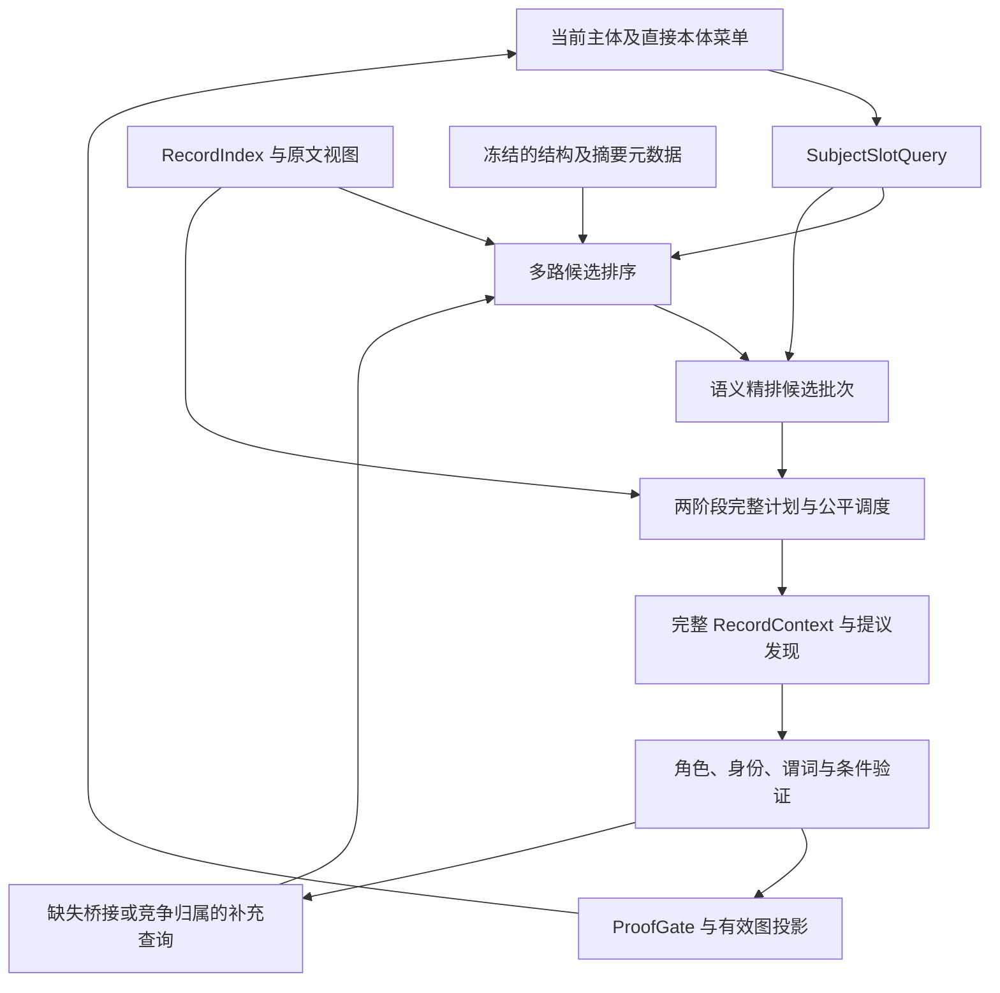

# 支持语义相似度精排的关系图谱识别精度提升方案

状态：已按 [Spec Kit 022](../specs/022-semantic-graph-closure/spec.md) 实施 P0–P4 工程能力；独立真实模型质量与成本验收待完成，P5 补充精排仍为后续范围。编制及修订日期：2026-09-08。实际验证见 [022 validation](../specs/022-semantic-graph-closure/validation.md)，当前工作区修改尚未部署。

本文承接[基于本体指引的文档结构和摘要元数据的关系图谱识别方案](基于本体指引的文档结构和摘要元数据的关系图谱识别方案.md)（下称“基础方案”），重点细化其第 7.3 节“后续语义重排仅改变顺序，不改变必保留的补充队列”。运行生命周期、实体分层、证据协议、单次切换与业务边界继续遵循基础方案。本文保留目标契约与审阅基线；字段布局以 022 契约和实际代码为准，工程实现、真实质量和部署状态分别验收。

审阅阶段收紧五项契约：候选池与排序批次的比较范围、反证闭包与普通候选配额的区别、阶段交错与完整覆盖的调度规则、计划变化与证明变化的身份隔离，以及精度/召回收益的独立验收口径。第 10.1.1–10.1.5 节保留实施前算法调查、重构优先级和历史隔离验证；第 10.1.6 节记录本次实现。历史测试数量不作为 022 的本次结果。

## 1. 目标与设计边界

在“本体直接菜单 → 结构及摘要定位 → 完整原文发现 → 独立验证 → 有效关系递归”的链路中，引入**面向当前主体和谓词的语义精排**：先从完整记录集合中选择值得优先处理的记录，再通过联合编码查询和记录的精排模型，对候选记录的语义相关性排序。

预期收益是更早找到真正涉及当前主体、关系角色和实体层级的原文，减少有限预算内无关记录占用，并使必要的桥接、否定和条件上下文更早进入验证。收益必须通过实验确认：排序本身不证明关系，不保证最终精度或召回率提高。

本文将“精度”严格定义为已接受完整断言的 precision；“识别质量”还包括召回、身份/归属正确性和路径完整性。排序带来的调用节省或有限预算召回提升不能单独支持“精度提高”的结论。全范围执行若输入上下文和验证逻辑完全不变，预期首先改善的是发现时序；如最终事实发生变化，须核查动态主体依赖、上下文补充及模型波动，不能默认变化就是优化。

| 目标 | 具体要求 |
|---|---|
| 有限预算质量 | 在相同抽取与验证调用预算下，提高有独立证据的关系、属性和完整路径召回，同时控制错误接受。 |
| 全范围质量 | 保持范围内记录完整覆盖，检验全量执行后的精度、召回及顺序敏感性，而非只看首批结果。 |
| 主体与角色区分 | 区分产品、API、批次、试验来源、工艺中间体，以及当前主体和文档根。 |
| 可解释与可复现 | 保留查询、记录视图、分项分数、模型身份、排位、调度原因和实际执行记录。 |
| 非目标 | 不自动合并实体、不推断全局身份、不增加本体谓词、不由相似度接受事实、不替换原文验证器。 |

本方案不新增根类型自动分类，不将多跳类型提前加入全文候选菜单，不自动确认或提交业务事实。也不引入旧在线算法分流、数据迁移或软件回滚；离线消融配置仅用于隔离评测。

## 2. 从基础方案的失败模式推导设计

基础方案记录的 09 实验共 52 次模型调用，仍有 242 项排队任务，两条焦点关系的真实第二阶段执行数均为 0。这说明“后续记录保留在队列”不等于“有效证据已被及时读取”；但不能据此断言延迟完全来自检索排序。

| 既有现象 | 语义精排应改善的部分 | 必须由独立机制解决的部分 |
|---|---|---|
| 首次 describes 拒绝，后续记录才建立第一跳 | 提高产品概况、剂型和描述关系相关记录的优先级 | DrugProduct 类型及 describes 原文证明 |
| 看见 API 表头，却把试验来源号当 API 身份 | 查询与记录保留完整表头、编号角色和竞争对象 | 标识对象角色、命名空间及唯一性验证 |
| 同报告产品代码和 API 名称被串成组成关系 | 优先检索配方、组成角色映射、明确指代及反证 | hasActiveIngredient 的独立谓词桥接 |
| 粉末外观挂到片剂主体 | 面向具体主体和实体层级排序，保留局部 owner | 属性归属、API/制剂层级和条件验证 |
| 零匹配或低相关记录迟迟未执行 | 阶段公平调度与低排位记录探索 | 台账守恒及真实执行完成度 |

精排无法补出原文没有表达的关系。没有组成证据时，正确输出仍可为“发现产品和 API，但组成关系未决”。关键正例必须另有真实原文见证。

## 3. 不可破坏的扩展约束

基础方案 I01—I15 全部有效，额外约束如下。

| 编号 | 约束 |
|---|---|
| S01 | 相似度、精排分、摘要和排序解释均为 retrieval_only，不得进入 PredicateEvidence 的事实来源。 |
| S02 | 精排只安排检索与上下文补充顺序，不授予 binding/claim 范围权限，不变更 allowed_output_types。 |
| S03 | 低分、负分、未评分和技术失败记录仍保留在完整计划中；Top-K 仅限制本批精排或优先执行范围。 |
| S04 | 相关性与断言极性分离；否定当前关系的记录同样可能高度相关，不能按“不支持关系”降为无关。 |
| S05 | 检索视图不能替代完整验证上下文；检索窗口须显式记录遗漏，验证必要的表头、单位、竞争 owner、否定和条件不得被静默截断。 |
| S06 | 查询仅采用当前有效主体解释、原文提及与合格证明；待验证身份必须显式隔离。 |
| S07 | 排序变化不覆盖语义判定，不重置重验额度，不将同一证据重排当作 evidence_delta。 |
| S08 | 分数与模型自述不是正确概率；排序指标和最终事实质量分别报告。 |
| S09 | 名次必须绑定查询、候选集合和排序轮次；不同查询、池或分批返回的名次不得直接比较。 |
| S10 | 已知的必要角色、条件与反证引用绕过候选配额进入验证闭包；未知反证探索不得被宣称为完整反证检查。 |

## 4. 总体架构与精排位置



设计采用一个主要精排点和一个可选补充精排点：

1. **抽取前记录精排（首期必做）**：输入当前主体—谓词查询与候选记录视图，输出本轮优先读取顺序。
2. **验证前补充上下文精排（后续实施）**：对已有提议的明确证据缺口，排序可能包含桥接、指代或竞争归属的原文记录。提议内容标为 hypothesis，仅用于提问，不成为可信主体属性。

首期不做“按精排分直接筛掉关系候选”，也不让精排模型与验证模型投票接受事实。减少无关调用依赖更好的执行顺序和已授权的预算策略，不能靠隐藏候选或省略必要验证获得。

## 5. 本体和主体感知的查询构造

### 5.1 SubjectSlotQuery 契约

每个查询绑定一个当前主体版本和一个直接谓词，不将整个可达本体或全部已知图谱拼入查询。

```text
SubjectSlotQuery:
  query_id, query_version, run_fingerprint
  subject_ref@revision, subject_class_iri
  subject_mentions[]: {text, source_refs, role, trust_state}
  accepted_qualifiers[]: {value, source_refs, proof_ref}
  predicate_iri, predicate_label, predicate_definition
  domain_range_constraint_ref, allowed_object_types | literal_spec
  retrieval_intent = discover | bridge | counterevidence | owner_disambiguation
  document_context: {root_ref, root_class_iri}
  contrast_roles[], dependency_refs[], query_policy_version
```

`subject_mentions` 和限定允许为空。用户指定的文档根以 `is_document_root=true`、运行绑定的根类型和文档身份启动，不要求先抽到根名称或身份编号；不得用文件名推定产品名称。普通子主体仍须满足基础方案的有效肯定路径和类型门禁，无全局身份不阻止文档局部主体检索。

主体类定义、谓词语义和 domain/range 来自冻结本体；检索同义词来自版本化词表或本体标签。缺少定义时记录缺项，不能调用模型临时扩写成事实性定义。角色对照只用于理解，不扩大输出菜单。

查询分别保存 `trusted_context` 和 `hypothesis_context`：已证明属于主体的名称/局部代码可作可靠局部提及，其 `identity_scope` 仍可为 document_local；角色未验证的编号和待验证对象只能进入有配额的探索查询，不能因写了“未确认”标签就算完成信任隔离。查询序列化器按字段权限过滤，输出已用/排除来源清单；主查询不含隔离字段。同名结果不自动归并。

### 5.2 关系与属性的查询差异

| 查询类型 | 必须表达的语义 | 禁止预设 |
|---|---|---|
| 根的 describes | 当前文档对合法产品对象的描述、名称及剂型等原文线索 | 文档中任一药物名称就是成品产品 |
| 产品的 hasActiveIngredient | 具体产品与 API 的组成角色、配方成员或明确指代，保留产品限定 | 同报告的 API 必属于该产品 |
| 产品的 appearance | 指定产品层级、外观字段、局部 owner 及竞争材料 | “白色粉末”一定是产品属性 |
| 步骤的 producesIntermediate | 当前步骤、产物角色、步骤标识和中间体证据 | 相邻编号顺序就是生产关系 |

中文查询可保留本体英文标签和原文代码，数值、剂量、否定词及编号不做损失性清洗。大小写或全半角规范化只作用于检索副本，原文引用保持原样。

### 5.3 多意图查询

发现查询询问“哪些记录讨论当前主体的指定关系”；反证查询询问“哪些记录明确否定、限制或改变该关系的适用对象”；归属查询询问“字段描述产品、API、批次还是试验”。

多意图结果合并去重后进入同一计划，记录各自召回原因。反证通道是一项补充措施，不代表已发现所有反证；发现查询本身也必须把关系否定视为相关内容。

每个意图单独评分和排序，不能把 discover 与 counterevidence 的原始分数视为同一量纲。先在意图内构建初排，再按冻结的意图/通道配额汇入共同候选池；增加查询改写数量不能等比例增加该意图的总融合权重。首期每意图至多一个版本化模板查询，启用 discover 和 counterevidence，owner_disambiguation 只在有明确归属竞争时启用；bridge 留到补充检索阶段。

## 6. 检索视图与多路候选排序

### 6.1 记录视图

以基础方案 SourceRecord/RecordView 为目标单位，构建 `RetrievalView`：

| 内容 | 用途与约束 |
|---|---|
| 原文记录正文 | 主要语义输入，引用实际 record_id 和原文 hash |
| 章节路径与原文标题 | 说明话题和原文上下文，不自动赋予实体角色 |
| 表格标题、完整相关表头、逻辑行、单位及脚注 | 区分“API 名称”和“试验来源”，保留合并映射 |
| 连续字段组、相邻指代段落 | 提供局部 owner/桥接线索，仍不预授权归属 |
| 摘要和元数据标签 | 独立 retrieval_only 字段，不能伪装成原文正文 |
| 缺失与截断标记 | 记录 omitted_refs、视图完整性、token 数和策略版本 |

首期建议语义精排主要读取原文和结构字段，摘要进入候选定位与独立辅助分量。这样可审计“原文相关”和“摘要声称相关”的差异。摘要直接参与联合编码作为后续消融变量。

超长记录的窗口策略属于显式版本配置。窗口须携带必要头部和 `omitted_refs`，保留原记录、物理来源及逻辑行映射；窗口数/总 tokens 设上限。只有计划窗口全部成功评分，才按同一查询下的最高窗口分形成记录排序分，并记录窗口数量及长度分层指标；最大值仍可能偏爱长记录，不能宣称已消除长度偏差。窗口缺失、闭包装不下或超过上限时标记 incomplete_view，按第 7.2 节技术策略处理，不以已返回窗口的最大值冒充完整评分。

窗口打分不表示原记录已经检查完成。更保守的首期实现可以在建池前将已知不能完整容纳的记录分入 `not_rerankable` 集合，由确定性/探索机会继续调度并统计其占比，避免每池都因同一超长记录降级；已经入池的异常仍按整池政策处理。验证仍读取完整原文闭包并遵循基础方案的超预算政策。

### 6.2 多路候选池

计算各路排序信号，再按稳定 record_id 合并；这些信号可以并行计算，但内容并非统计独立：

1. **确定性结构/词项通道**：当前谓词、合法类型、表头、章节标题、原文精确名称和代码。此通道不重复计入摘要，避免与元数据通道双重加权。
2. **稠密语义通道**：查询和记录分别编码，以向量相似度召回词形不同但语义相关的记录。
3. **元数据通道**：冻结章节摘要和 RetrievalHint 定位相关章节，再展开原文记录。
4. **保留通道**：有明确来源关联但尚待判断的交叉引用、竞争 owner 和潜在反证记录，优先获取新的目标记录。已经确定为某断言验证所必需的来源属于强制上下文依赖，直接按第 9 节装配，不受此通道名额约束。
5. **覆盖探索通道**：从未优先处理的章节和低分记录中按稳定顺序轮转取样，缓解候选池盲区。

首期可对单文档记录向量做精确相似度计算，无须以引入向量数据库为前置条件。大文档后续采用近似检索时，近似漏召回不能删除完整 RecordIndex 中的待处理项；跨文档检索和共享实体链接不属于本方案。

候选池只是“优先精排池”，完整目标集合始终是运行范围内全部合法目标记录。每轮先固定候选集合：取保留/探索各自配额，去重后以三条排序通道的配额轮转补齐；重复命中不占第二个名额，向该通道后续位置补取，通道耗尽后让出名额。意图内和通道间配额、补位次序均进入政策。未入池记录继续留在完整队列；下一轮从尚未提交的候选位置继续，不能不断重取同一批高分记录。

来源 ID 与目标 record_id 不混用。标题、表头、脚注可能仅为绑定来源，不进入 `U` 或增加覆盖分母；通过 RecordIndex 映射到合法原文目标记录，无法映射时只保留上下文引用。合并单元格在不同行的 RecordView 可以是不同检索目标，但仍共享同一物理 mention。

## 7. 语义精排、融合与排序解释

### 7.1 双编码召回与联合编码精排

稠密召回分别编码查询和记录，适合先发现语义邻近内容；精排模型联合读取 `(query, retrieval_view)`，评估记录是否涉及**当前主体、当前谓词、合法对象角色及限定条件**，更适合在有限候选池中区分词汇相近但角色不同的记录。

模型选择按中文专业术语、表格角色、否定、长上下文和吞吐能力实测，不在本方案绑定具体 SDK、服务或模型版本。模型输出必须保留原始分值及其定义；未经校准的 logit、余弦相似度和结构分不能直接相加，也不能把 0.9 展示成“90% 正确”。

评分目标是“值得用于判断该槽位的相关性”，而非“支持肯定断言的概率”。若候选模型系统性压低否定记录，必须在反例集上识别并淘汰或调整，不能仅增加提示词后假定问题解决。

### 7.2 有明确比较范围的首期融合

首期采用基于名次的融合，避免直接混合不同量纲。初排只融合结构/词项、稠密、元数据三条通道，保留与探索是配额规则，不因缺少“分数”被折价：

```text
RRF(r) = Σ[j ∈ channels] w_j / (c + rank_j(r))
```

`rank_j` 从 1 开始，绑定同一查询意图、剩余合法记录集合及该轮冻结的通道列表；配额合池后保留通道原名次，不因其他通道加入记录重新压缩名次。通道未召回记录时该项为 0。结构词项确实无匹配时不因原文位置靠前而伪造匹配命中。`c > 0`、非负权重、缺省通道及同分规则在运行前冻结；同分依次用原确定性顺序、原文位置、record_id 处理。

新增 `RankingEpoch` 固定 `query_set_hash、pool_record_ids、pool_hash、view_hashes、policy_hash、epoch_seq`。所有启用意图使用同一个池，每个 query 对池内每条记录评分；一个 64 条的池，对单意图可分 4 次、每次 16 条请求，但 **rank=1…64 在该意图整个池的响应齐备后统一计算**，不是将四个批内 rank=1 合并。模型必须返回与同批其他记录无关的逐 query-view 分值；若服务只提供依赖候选列表的名次或归一化分数，须整体评分同一池或另立评测设计，不能跨批拼接。

单意图默认采用联合编码精排名次，精排同分时使用该意图初排；多个意图再对同一池的完整精排名次作一次 RRF，意图权重归一化且冻结，得到唯一 pool_rank。这与“同一意图的初排和精排二次融合”不同，后者仅作预注册对照。候选意图配额影响入池，意图融合权重影响池内次序，两项单独记录；反证保留和必要闭包不依赖融合是否将反证排到第一。

提交后的 epoch 名次不可被后到响应改变；新增候选进入下一 epoch。对同一阶段/章节的普通机会，不拿新池 rank=1 越过旧池尚未处理的任务；章节轮转、必要依赖处理和台账探索不受此限制。也不跨主体或谓词按分数选任务。

池中任一必要分值缺失、非有限数、映射重复/缺项、窗口不完整或模型身份不符时，不能让该记录因为少一个融合项而被降权。有限技术重试后，按冻结政策暂停，或**整个 epoch**采用已有确定性完整顺序并记降级；成功分值可保留为诊断，不能与失败记录的另一套分值混排。这项取舍牺牲部分吞吐，以获得清晰的失败语义，后续更细粒度策略需独立验证。

排序不能解释为统计概率。初期不训练端到端总分分类器；后续学习融合权重只能使用开发集，校准及选择使用验证集，保留测试集不参与调参。记录 score、pool_rank 和最终 dispatch_position，三者允许不同，评测必须检查精排结果是否实际改变了原文读取顺序。

### 7.3 质量相关信号的处理

| 信号 | 用途 | 限制 |
|---|---|---|
| 主体名称、已证明别名及限定一致 | 区分同名产品/批次的排序线索 | 不能证明局部共指或全局身份 |
| 谓词语义与关系角色匹配 | 优先找配方、成员、产生、描述等语义 | 不能替代 predicate_entailment |
| 表头、owner、单位、条件完整 | 避免孤立单元格排序误导 | 完整也不等于归属成立 |
| 竞争主体或明确否定 | 纳入相关证据候选与保留队列 | 不作为统一扣分项 |
| 摘要高分、原文低分 | 标记跨来源分歧，触发探索观察 | 不让摘要覆盖原文判断 |

精排分及排序理由只进入检索审计。默认不把分值、排名或精排模型的自由文本理由传给提议/验证模型，降低“排第一所以可信”的锚定影响；验证器只读取带权限和角色的原文上下文。

## 8. 两阶段计划、Top-K 与公平调度

### 8.1 完整集合与阶段定义

令 `U` 为当前主体—谓词范围内所有合法目标记录，`P1` 为优先章节中的首阶段记录，`P2 = U − P1`。保持：

```text
P1 ∩ P2 = ∅
P1 ∪ P2 = U
U = unattempted ⊎ attempted_incomplete ⊎ examined
```

首期先用基础确定性政策冻结优先章节和 P1/P2，最多三个优先章节继续作为实验初值；没有正匹配章节时 P1 可以为空，所有记录进入 P2。之后建立语义候选池并排序，避免“靠部分池的精排选章节、再靠章节选池”的循环和样本偏差。P1/P2 只在主体或检索输入依赖变化后建立新版本，惰性评分不改变阶段成员。

首期精排调整阶段/章节内部的优先记录，跨章节顺序受公平轮转约束。让语义模型重新选择优先章节是后续独立实验因素，需要覆盖未评分章节并单独报告阶段成员变化；不与首期精排收益混算，也不声称“最高记录分”已消除长章节偏差。

**候选池规模、精排批大小和评测读取 K 是三个不同参数**，首期不再引入含义不明的“优先读取 K”停止条件。每个记录仅属于一个阶段，多路命中只追加检索观察。每次阶段/章节获调度时，普通机会从已提交 epoch 中取最早未消费池的最高排名目标，覆盖探索机会从完整台账取最早等待记录；not_rerankable 或未入池记录仍有确定性/探索机会，不把它们解释为不相关。

普通机会遇到当前池仍在 scoring 时，默认让出给其他就绪槽位，到冻结超时后才按整池政策暂停/降级，不能立即抽完该池再拿到精排分。独立的台账探索可以提前领取池内记录，但所有领取都按主体—谓词—record 及当前语义依赖的任务键幂等执行。epoch 提交时保留原池/名次审计，调度过滤已启动、完成或失效目标，不重写剩余池名次、不再次执行；用实际 dispatch_position 评估精排是否有用。

### 8.2 分支与阶段公平性

分层选择顺序固定为：根/子分支有界轮转 → 分支内主体轮转 → 关系/属性交替 → 同类直接谓词轮转 → 阶段配额 → 章节轮转 → 记录顺序。空层让出机会；新进入的主体/谓词追加到轮转尾部，不重置其他队列的等待状态。不同主体、谓词或意图的原始分数不参与全局竞争。

每个稳定主体 lineage—谓词维护独立阶段计数。两阶段都非空时，冷启动的前两个新记录机会分别来自 P1、P2，随后按 4:1 轮转；仅有 P2 时立即执行 P2。P1/P2 仍是来源集合标签，本修订显式将严格先后执行扩展为交错执行；阶段计数按实际记录任务启动更新，不按候选入队、精排完成或模型成功更新，暂停/重建计划不清零。

章节按原有稳定轮转；每阶段每五个新记录机会至少一个从完整未尝试集合取等待最久的记录，打破不断续入高分候选的垄断，其余机会使用第 8.1 节排序。等待以该阶段的调度机会计，初始化按原文位置，新任务追加尾部。若合并/拆分改变主体含义，等待状态和已用探索/重验额度按 lineage 保守继承，不能借新 revision 重新冷启动获取无限额度。

一个记录任务内部仍可能有多次调用，必须受冻结的单记录调用/token 上限和超时约束，并在可持久化的提议阶段边界让出；未完成项进续执行/技术重试队列，不冒充 examined。默认一次续执行/重验后至少给一个新记录机会；其前提依赖失效时先阻断该断言使用资格，再让其他合法任务执行。

精排准备本身也受资源调度约束：按即将获得执行机会的槽位惰性准备，不能先为根的全部谓词完成向量和精排后才开始抽取；等待模型的槽位让出给已就绪槽位。池级有限超时后遵循冻结的暂停/降级政策。

有限预算不保证所有记录执行，超限仍报告 partial 和具体未尝试集合。只有必要目标和前沿实际完成，才满足基础方案的范围内完成条件；不能因所有 Top-K 记录已执行宣告全文穷尽。

上述规则保证的是可用资源、有限活动任务集合且持续运行时的有界机会，不是任意小预算下的 P2 成功调用。分别记录 dispatch、真实提议/验证调用、因依赖/预算未调用的原因；验收夹具须给足冷启动所需预算，并验证每个受测谓词有更晚的不同 P2 记录真实调用。真实运行仍为 P2=0 时直接报告，不用配额配置代替执行证据。

### 8.3 拒绝与排名更新

一次 unsupported 结束对应提议的必要流程，继续其他记录；不将相似记录批量判为 unsupported。不通过重复采样或循环重排“刷到通过”。

区分两种修订：纯候选排序更新建立新 epoch，只影响未提交执行前缀；主体归并/拆分、可信限定或证据依赖改变则建立新 plan revision，并重建当前语义目标的完整集合。仅依赖仍有效的 examined 可继承；attempted_incomplete 保留续执行义务；已失效的完成项转入需重验状态，不允许把旧主体已读过的记录直接算成新主体已验证。

每次评分提交同时检查 lease token、subject/query/plan/epoch 精确版本和当前 head。即使 worker 仍持有效租约，旧查询的晚到响应也只能留审计，不能写入新计划。纯排序变化不构成 evidence_delta，继承基础方案 claim_lineage_id 的重验额度。

将 `ranking_dependency_hash` 与 `proof_dependency_hash` 分开：前者包含池/模型/排序政策，后者包含语义目标、允许来源、主体及证明版本。改变计划排名不能单凭 plan_id 改变就生成全新逻辑验证任务；反之，实体含义或证明发生变化也不能因 record_id 相同而跳过重验。

## 9. 补充上下文与证据闭包

首期记录精排稳定后，再支持针对明确缺口的补充检索：

| 缺口 | 补充查询 | 返回后的必要处理 |
|---|---|---|
| 产品与 API 缺桥接 | 具体产品限定 + 当前组成谓词 + 待验证 API 提及 | 回放原文，验证组成角色及方向 |
| 属性 owner 竞争 | 当前字段 + 产品/API/批次角色 + 已知上下文 | 比较竞争归属与适用层级 |
| 编号角色不明 | 字段/列头 + 原始编号 + 被标识对象 | 进行角色和唯一性验证，不直接升为 identity |
| 跨段指代不明 | 指代原文 + 候选先行对象 + 章节关系 | 形成逐步可回放的 resolved_reference_chain |

补充记录初始仅获得检索/绑定候选权限；若需要从该记录发现新事实，须另走完整记录提议流程。ContextAssembler 合并原始目标记录、两端角色、表头、条件和竞争证据，按基础方案构造证明闭包。

已有原文明确指出当前断言必需的主体/对象角色、反证、脚注或 owner 来源时，加入 `required_context_refs`，不经过精排名次、Top-K、保留通道 8 个名额或阶段等待。只有探索性引用才进入后续候选池。必要上下文不能装配时记执行未完成；已完成检查但原文无法消解歧义时记语义 undetermined，均不得生成缺失闭包的有效肯定边。

迟到的相关反证或竞争 owner 必须通过按主体 lineage、谓词、对象/值、适用域及已读范围建立的 DependencyIndex 订阅，触发已有证明重新核查；可能冲突的已接受断言先暂停使用资格并使依赖的肯定递归投影失效。是否构成矛盾仍需原文语义判定；不同批次、时间或条件不能一概互相否定。重验额度不足时保留未决/阻断，不继续使用旧通过，也不只新增一条否定候选后让旧肯定路径照常递归。

这项机制对普通检索同样必需，不能等到可选的补充精排阶段才实现。部分图展示的是当前已检查证据下的有效性，并须保留覆盖/未决状态；未知反证尚未发现不能被表示为“已确认不存在反证”。

## 10. 数据契约、模块与持久化

### 10.1 实施前算法差异与本次闭环实现

基线核对日期：2026-09-08。第 10.1.1–10.1.5 节保留原审阅快照，并补注 022 起点核验；其中“当前”不代表本次工作区或已部署版本。当时结论是：**已有完整记录保留和确定性两阶段排序，尚缺主体感知语义召回/精排、槽位公平调度、任务身份隔离和证据依赖接通。** 下文保留这些历史依据，以便核对第 10.1.6 节的实际变化。

#### 10.1.1 比较范围与当前算法

新文档分析入口 [document_analysis/execution.py](../backend/app/services/document_analysis/execution.py) 和活动评测 [quality_guided_variant.py](../backend/app/evaluation/quality_guided_variant.py) 均调用共享 `OntologyGuidedExecutor`，以下以这条调用链为主要比较对象。旧评测 [staged_retrieval.py](../backend/app/evaluation/staged_retrieval.py) / [record_retrieval.py](../backend/app/evaluation/record_retrieval.py) 仍由显式 legacy runner 使用，不能将其能力算作新核心已接通。仓库 [aligner.py](../backend/app/services/extraction/aligner.py) 的向量相似度用于候选与既有实体的对齐，也不是这里的主体—谓词—原文记录召回。

[retrieval.py](../backend/app/services/extraction/ontology_guided/retrieval.py) 当前执行以下确定性流程：

1. `_terms` 从谓词 label、IRI 尾部取词；关系额外加入合法 range 类标签及其直接字段标签。虽有 `SubjectRef` 参数，但主体只参与计划身份，不参与打分；谓词已有的 description 也未进入匹配。
2. `_match_score` 去空白并转小写，统计有多少个完整词项是文本子串；每个词项最多计一次。这是词项命中计数，没有稠密召回或联合编码精排。
3. 记录分为 `4 × 原文/表头/父表/注释命中 + 2 × 章节路径命中 + 章节摘要命中`。章节分为该章最高三个记录分的 `max + mean`；摘要分已经独立列出，后续应继续避免重复计权。
4. 最多选三个正分章节，章内**全部记录**进入 P1，包括其中的零分记录；其他章节的全部记录进入 P2。阶段内部按章节轮转，每章按记录分及原文位置排序，最后按 `P1 → P2` 拼接。
5. [executor.py](../backend/app/services/extraction/ontology_guided/executor.py) 的 `add_subject` 先遍历全部关系、再遍历属性，每个谓词的完整计划一次性入队。[scheduler.py](../backend/app/services/extraction/ontology_guided/scheduler.py) 只在根/子队列之间按 1:2 分配机会，队列内部仍是 FIFO；重试要等两个新任务队列耗尽。

因此需要区分三种“召回”：计划是否保留原文、有限预算内是否真正读到原文、原文最终是否形成有效事实。当前构造器保留了完整记录，不能据此推定后两者达标。不同主体在相同谓词、本体、IR 和元数据下会得到相同的记录分及顺序；先入队谓词也可能消耗后续谓词的整个可用预算。

#### 10.1.2 差异与影响

| 维度 | 当前工作区事实 | 本方案目标与重构影响 |
|---|---|---|
| 主体与关系语义 | `_terms` 使用本体词项，不读取主体原文名称、已证实限定或竞争角色 | 构建 SubjectSlotQuery，按来源权限使用主体提及、谓词定义、角色及条件。仅把 entity_id 拼进查询不能产生主体感知；需接通原文和合格证明 |
| 候选获取 | 单一路径对完整记录做词项计分；没有语义候选池 | 分离结构/词项、稠密、元数据信号，增加保留和探索配额。低词项命中的同义表达才有机会较早入池，但仍须实测语义收益 |
| 排序 | 固定 4/2/1 加权及章节排序 | 先在明确比较范围内初排，再对冻结池联合编码评分。余弦分不能直接加到现有 rank_score；不同批次/意图名次也不能混用 |
| 执行机会 | 同谓词 P1 排完再到 P2；同分支中整份谓词计划 FIFO | 改为主体/谓词/阶段/章节分层选下一任务，阶段冷启动 1:1 后按 4:1 交错，并让完整台账中的低排位记录获得探索机会 |
| 记录视图 | [records.py](../backend/app/services/extraction/ontology_guided/records.py) 已保存逻辑行、物理单元格、表头、父表和脚注；检索使用拼接原文。FieldGroup 已构建，但没有专用 RetrievalView/窗口完整性契约 | 复用 RecordIndex，增加角色明确的序列化视图、hash、窗口和遗漏标记；检索视图与完整验证上下文分开，避免重新解析或另建来源 ID 体系 |
| 覆盖守恒 | `plan_slot` 当前遍历全部 RecordIndex；但 [contracts.py](../backend/app/services/extraction/ontology_guided/contracts.py) 的 validator 只校验计划无重复、计划 ID 集等于 ledger ID 集 | 冻结 U 及其 hash，并从独立 RecordIndex 验证计划等于 U。当前不是已经观察到漏召回，而是同时漏记时没有外部完整性门禁 |
| 任务与排序身份 | 任务 dependency_hash 包含 plan_id、metadata.snapshot_id、menu.menu_id；plan_id 又包含有序记录 ID | 纯重排可能改变任务 ID/去重键，导致同证据重复执行。拆开 ranking_dependency_hash 与 proof_dependency_hash；排序换版不能重置逻辑任务或重验额度 |
| 必要上下文与迟到反证 | `assemble_context` 实际装配当前记录和表格上下文，端点/证明参数只存引用；executor 调用时未传这些参数。[dependencies.py](../backend/app/services/extraction/ontology_guided/dependencies.py) 已有依赖原语。022 起点补核：executor 已注册证明并向投影/checkpoint 传递索引，原审阅“索引恒为空”的描述已过时；尚缺迟到冲突订阅/通知和递归资格失效闭环 | 接通 required_context_refs 的文本解析、权限和预算；新反证影响旧断言时暂停其使用资格并传播到递归依赖。这是普通检索的质量前提，不能留到可选补充精排才处理 |
| 恢复与审计 | 已有任务结果、frontier、RecallLedger 和运行租约；当前恢复通过重放任务结果重建确定性顺序 | 新增 epoch、原始分值、提交前缀和轮转计数的持久化。恢复不能重新评分后改变已执行序列；提交还须检查 query/plan/epoch 精确版本，单有 worker 租约不足 |

现有原文引用、直接本体菜单、ProofGate、极性门禁和运行域值得复用。本方案改变的是信息到达顺序及必要上下文获取；相似度仍不能证明 API 身份、产品组成或属性归属。还要核对主体证明是否真正提供给后续提议/验证：当前模型请求中的 subject 同样是 SubjectRef，不能假设检索端知道主体名称就等于验证端已拿到主体原文。

#### 10.1.3 建议重构优先级

以下是工程优先级，不替代第 14 节的阶段验收；“优先”表示先消除耦合、建立可验收行为，不要求把整套目标一次性实现。

| 优先级 | 重点与落点 | 验收依据 |
|---|---|---|
| 最高：覆盖及身份契约 | `contracts.py` / `retrieval.py` / `executor.py` 分开完整集合、排序观察和逻辑执行任务；持久化独立 U，拆开排序/证明依赖 | 计划与 ledger 同漏一条时失败；只改顺序不重复逻辑任务、不清零额度；来源或主体证明变化仍触发相应失效。对应 SR21、SR23 |
| 最高：调度结构 | `executor.add_subject` 从“推入全部记录任务”改为“登记主体—谓词计划”；scheduler 按槽位惰性领取，保存阶段/谓词/等待计数及未完成续执行 | 多主体、多谓词且 P1 较大时，给足预算能见到不同 P2 记录的实际调用；恢复不重置公平状态。对应 SR08、SR10、SR20；不能只检查队列含 P2 |
| 第一批输入与质量前提 | 构建可信主体查询和 RetrievalView；沿用 RecordIndex；接通已知必要上下文、DependencyIndex 注册/通知/传播与 checkpoint | 不同主体能使用不同的合格原文查询；隔离编号不进主查询；表头/owner/条件不丢失；晚到反证能阻断旧肯定路径。对应 SR01—SR03、SR09、SR18、SR22 |
| 第二批语义排序 | 接入稠密候选、冻结 RankingEpoch、联合编码打分、意图内排名和融合；同步做批量/窗口预算、租约提交、缓存和恢复 | 固定池分批乱序返回仍产生同一完整池顺序；缺项按整池政策暂停/降级；记录未被过滤；实际 dispatch 能反映排序。对应 SR06、SR10、SR14、SR17、SR19、SR26 |
| 后续补充检索 | 仅针对已知证据缺口做 bridge/owner 补充查询和上下文精排 | 新原文才能触发有额度的补验；探索引用不自动升级事实权限。对应 SR12、SR13 及 E0/E1 消融 |

调度结构应先于在线接入精排完成，否则新模型仍只能优化旧 FIFO 的局部前缀；但**实验上要拆开贡献**：先冻结未调整工作区基线，再建立第 12.2 节的共同 A 基线。A/B/C 保持一致的严格阶段顺序，D 才启用阶段交错；共同的主体查询、谓词公平和必要反证闭包从 A 起固定，不能把这些基础改造的收益归给 C 的精排。

首期可以复用确定性记录文本和章节信号，缓存与主体无关的视图/记录编码，再为即将执行的槽位惰性准备查询和池。当前 `add_subject` 会为每个谓词重新遍历、拼接并评分整份记录；若原样替换为模型调用，将放大启动成本。先做单文档向量精确检索即可；向量数据库、跨文档实体链接、精排阈值删记录均不是首期前置工作。语义质量标注与成本记录从基线阶段开始，不能等接入完模型再确定成功口径。

#### 10.1.4 实施前审阅核验及其边界

当次审阅仅修改本文，未实施算法、未启动服务，也未调用真实模型。使用已有隔离环境实际执行：

```bash
# 工作目录：backend/
.venv/bin/python -m pytest -p no:cacheprovider -q \
  tests/test_extraction/test_ontology_guided_core.py \
  tests/test_extraction/test_ontology_guided_boundaries.py
```

结果：**14 passed，4 warnings**。警告为现有依赖弃用及 schema 字段遮蔽提示；这两个文件的通过不覆盖语义精排、PostgreSQL 并发或整套基础方案验收。

另外用临时合成 Word、结构元数据和不调用模型的空适配器核验四项程序行为，未写入生产数据：

| 探针 | 实际观察 |
|---|---|
| 同一 IR、同一属性谓词，换两个 SubjectRef | PlannedRecord 的分数、阶段和顺序完全相同 |
| 4 条记录、两个根关系谓词 | 前 4 次 dispatch 全属于第一个谓词，第 5 次才轮到第二个 |
| 6 条 P1、1 条 P2，任务上限为 2 | 两次 dispatch 都来自 P1；P2 尚未执行，运行正确保留 incomplete |
| 从合法计划的 records 和 ledger 同时删去一条记录 | RetrievalPlan.model_validate 仍接受，说明仅靠两者相等无法检验 U 完整性 |

这些探针证明当前输入、调度和校验行为，不证明真实关系会错判或精排会提高质量。历史 09 的 P2=0 仍只能作为历史失败观察；本次合成 dispatch 不冒充真实模型调用，也没有重新测得该历史结果。完整 tuple 的 precision/recall、路径质量及精排新增成本仍按第 12 节独立验收。

#### 10.1.5 目标模块与复用边界

在该领域核心中扩展下列职责。下表的查询、视图、语义召回、精排及融合模块为拟新增，名称可按实际布局调整；`retrieval.py` 和 `scheduler.py` 为既有模块的职责调整。

| 模块 | 输入 → 输出 |
|---|---|
| `retrieval_query.py` | SubjectRef + SlotSpec + 合格来源 → SubjectSlotQuery |
| `retrieval_views.py` | RecordIndex + 结构 + 冻结元数据 → RetrievalView |
| `semantic_retrieval.py` | Query + Views → 多路候选及初排名次 |
| `semantic_reranker.py` | Query + 候选批次 → 原始逐对分值及技术状态，不输出可跨批使用的名次 |
| `retrieval_fusion.py` | 完整 epoch 分值/通道名次 + 政策 → 意图内/池内名次及解释 |
| `retrieval.py` | 全部记录 + 基础政策 → 冻结两阶段集合；epoch 结果 → 计划排序引用 |
| `scheduler.py` | 完整计划 + 公平配额 + 预算 → 下一任务 |

模型适配层只返回分数和执行元数据，不写图谱、授权范围或运行租约。在线与评测共享上述核心，在线不得导入 evaluation 目录。

#### 10.1.6 022 已实施的闭环与待验边界

[022 任务清单](../specs/022-semantic-graph-closure/tasks.md)承接 021 的唯一文档分析运行域，实际接通以下链路：

- 查询由当前主体可回放提及和直接本体谓词构建；完整原文视图、多路候选、两个意图的整池精排及融合均保留独立记录全集。超长、负分及失败记录仍在覆盖台账中。
- 排序按槽位惰性准备；原文任务仍登记完整集合，由调度器逐次选择主体、谓词、阶段、章节及台账探索机会。异步准备允许其他就绪槽位执行，必要重验可越过排序等待。
- 每次排序及识别模型请求前预扣并持久化预算；每池提交后才应用顺序。恢复重放提交水位、临时排除槽位、缓存与累计重试额度，旧主体、旧查询及失效租约的结果不能改变当前计划。
- 候选发现与验证采用独立模型请求，冻结 candidate/target 并独立核验桥接类别；验证实际装配主体来源及全部已知必要角色、条件、反证原文。相同段落但错误子区间不能冒充反证检查；排序及摘要始终不能授予事实权限。
- 迟到冲突阻断旧断言和递归依赖。父关系在完整新证据下重验成功后，子主体重新计划并真实重验属性，旧子事实不会随父边恢复直接复活。
- 图谱 GET 及前端排序详情只读，区分阶段计划与实际执行、语义未决与排序失败、预算预留与实测用量。在线及活动评测使用同一识别核心；评分核对完整断言、可回放等价证明、连续路径和消融输入。

本次工程证据及 SR01–SR26 映射见 [validation.md](../specs/022-semantic-graph-closure/validation.md)。CPU 本地模型依赖和完整校验制品已补齐并真实验证，见 [cpu-ranking.md](../specs/022-semantic-graph-closure/cpu-ranking.md)。独立调用协议已由真实失败诊断推进到 `v4.3`：根使用程序身份绑定，七项判定与四组证据须显式返回；同一失败任务最终取得 1 条通过程序证明门的关系，见 [独立验证实测](../specs/022-semantic-graph-closure/independent-verification.md)。新建本体快照已消除声明枚举顺序造成的身份漂移，实际两次独立准备复现一致。专家独立参考与预注册质量阈值仍待提供，不能声称 precision/recall 已提升；本轮 PostgreSQL 独立库并发及真实 API/浏览器只读验收均已通过，空库历史迁移失败单列记录。P5 的桥接/归属缺口补充精排与 E0/E1、F0/F1 实验未实施，不影响本期已接通的必要上下文和反证失效机制。

### 10.2 排序观察记录

```text
RankingObservation:
  observation_id, recognition_run_id, plan_id@revision
  subject_ref@revision, predicate_iri, query_id, retrieval_intent
  model_input_hash, query_dependency_hash, ranking_dependency_hash
  ranking_epoch_id, epoch_seq, pool_hash, rank_scope
  record_id, retrieval_view_hash, source_snapshot_hash
  channel_hits[], channel_raw_scores[], channel_ranks[]
  reranker_identity, raw_rerank_score, score_semantics, window_results[]
  fusion_policy_hash, intent_rank, actual_ranking_mode
  phase, protected_reasons[]
  score_status = scored | not_selected | failed | incomplete_view
  batch_id, execution_attempt_id, latency_ms, cache_hit
  authority = retrieval_only
```

`score_status` 与 `coverage_state` 独立。精排请求成功只表示打分完成，不能把记录标为 examined。原始评分观察保存逐 query-record 分值；intent_rank 在整池 ready 的独立排名观察中追加，最终 fused_score/pool_rank 保存于 epoch 的记录排序投影。`rank_scope` 明确 query/intent/epoch/池身份，不把多个意图的最终名次复制成相互矛盾的独立决定。

`RankingEpoch` 追加 prepared/scoring/ready/degraded/committed/stale 事件并保存完整池成员；排名只在 committed 后可用。计划和调度事件另存队列位置、dispatch_position、scheduled_reason、轮转计数和实际抽取任务 ID，使“高排位未执行”“低排位已探索”均可追踪；这些迟到信息不能改写原始评分观察。

### 10.3 版本与缓存

在完整 RunFingerprint 中加入 embedding/reranker 的不可变模型身份、tokenizer、输入模板、截断/窗口政策、向量规范化、融合权重、候选配额、阶段公平政策及技术降级政策。

分开三种身份：`model_input_hash` 只散列模型实际读取的精确序列化内容及输入政策，`query_dependency_hash` 绑定主体和合格来源版本，run/query/attempt ID 属于运行审计信封，不拼入模型文本。所有缓存读取共同要求权限域校验、内容完整性检查和当前任务依赖有效；即使精确文本相同可复用原始分值，也须在当前 run 重新建立合法使用关联。

| 缓存对象 | 最低缓存键依赖 |
|---|---|
| 记录向量 | 权限域、原文/结构 hash、视图版本、编码模型/tokenizer、规范化政策 |
| 查询向量 | Query hash、主体及证明版本、本体 hash、编码配置 |
| 精排原始分值 | 精确模型输入 hash、精排模型/tokenizer、数值执行配置、输入模板、窗口策略；不缓存为跨池通用名次 |
| 池内名次/排序计划 | 完整记录集合及池 hash、意图及全部评分依赖、融合/调度政策、主体 revision |

查询、批次结果及计划水位按新运行事件协议持久化。恢复优先读取已提交排序结果，缺失批次按同一指纹重试；不能因模型别名相同就换权重重打分。浮点细微差异通过已持久化名次和稳定 ID 破同分控制，不能承诺跨硬件位级复现。

恢复水位同时保存 epoch 提交前缀、未消费池成员、各层轮转/等待计数、续执行队列与失效事件序列。只有评分产物先持久化、引用及事件批次确认后才能推动调度；崩溃重放不能凭内存里已算出的名次跳过任务。没有精排的正式新运行采用冻结的 `ranking_mode=deterministic`，它与摘要是否 structure_only 是独立字段；不在运行途中修改 fingerprint 来冒充同配置。

租约/fencing、取消、删除、权限隔离继续由 DocumentAnalysisRun 管理。过期 worker 的精排响应不得写入；删除运行时按所有权与共享引用规则清理向量和排序缓存，不因同 hash 绕过权限。

## 11. 性能预算、异常与展示

### 11.1 实验初始配置

以下数值是便于实现和评测的初值，不是部署推荐值或质量 SLO。

| 参数 | 初值 | 含义 |
|---|---:|---|
| 优先章节数 | 3 | 沿用基础方案实验起点 |
| 单主体—谓词首批精排池上限 | 64 条记录 | 多路去重后的候选池；剩余记录保留 |
| 每批精排条数 | 16 | 还须服从实际模型 token/显存限制 |
| 保留/探索最低预留 | 各 8 个池内名额 | 仅探索性目标；必要原文闭包不受配额限制 |
| 结构/稠密/元数据剩余配额 | 16/16/16 | 首池默认剩余 48 名额，去重补位与空通道让出 |
| 初排 RRF 平滑常数/通道权重 | 60 / 各 1 | 仅候选初排，验证集选型前冻结实际值 |
| 意图配额与融合权重 | 启用意图均分，权重和为 1 | 每通道内均分配额，余数按固定意图顺序分配；各意图均对完整池打分 |
| 阶段交错配额 | 冷启动 1:1，随后 4:1 | 每主体 lineage—谓词计数，空队列让出 |
| 台账探索机会 | 每阶段每 5 次至少 1 次 | 选等待最久的未尝试记录，与入池探索名额分开 |
| 补充验证次数 | 沿用基础方案最多 2 次 | 仅实质新证据可消耗此额度 |

批量推理、记录向量复用和惰性精排减少开销：只为已到达主体的直接谓词打分，不为全部可能多跳主体预计算；候选池之外的记录在后续调度窗口按需要评分。细分记录数与模型输入窗口数，避免一条长记录产生多个窗口后突破预算而不计数。

精排输入对数为 `启用意图数 × 池内窗口总数`；64 条完整记录、两个意图对应 128 对输入，不能记作仅 64 条的模型成本。候选池大小限制唯一记录数，请求批次上限限制输入对数，两者分别计量。

运行还必须显式给出 `max_query_variants、max_windows_per_record、max_tokens_per_pair、max_ranking_tokens_per_slot/run、ranking_timeout、technical_retry_limit、max_model_calls_per_record`。这些值依实际模型和资源在 P0/P2 冻结，未配置不得以无限默认值执行；消耗包含失败、重试和补充查询。召回/精排预算耗尽不等于文档任务完成，按预设确定性排序继续或暂停，覆盖状态如实保留。

### 11.2 技术失败

精排不可用时，按**运行前已冻结**的政策选择：暂停该运行，或在同一新核心内对受影响的整个 RankingEpoch 采用确定性排序并标记 `ranking_degraded`。这只是可选排序能力的技术降级，不恢复旧 runner，不改变验证政策或删除任务。

降级事件须记录作用 epoch 及请求批次、失败原因、实际排序模式、已消耗重试和水位。后续模型恢复不得静默重排已提交 epoch；切换模型版本或政策需新建运行。主验证模型不可用仍按基础方案暂停/失败规则处理，不能因精排成功而生成图谱。评测保留发生降级的运行并按预注册口径报告，不能删除失败运行后只比较成功样本。

### 11.3 用户可见信息

仍在同一文档分析运行的“分层元数据”和“关系图谱”两个 Tab 中展示。默认显示有效图、原文证据、覆盖进度和未决原因；诊断详情可以展开“为何优先处理此记录”，列出通道、排名及技术降级。

检索相关性和事实验证状态使用不同字段与文案，不在关系边上展示“相似度 0.95，因此已确认”。刷新、切换 Tab、读取排序详情均为只读，不触发向量生成或模型调用。

## 12. 评测设计：证明收益来自精排

### 12.1 独立标注与数据划分

继承基础方案的新金标要求，增加查询—记录相关性标注。可采用四级定义：0=无关，1=主题相关但不涉及当前角色，2=有助于判定当前主体/谓词，3=包含可直接判定的桥接、归属或明确反证。相关性 3 不等于肯定关系为真；每条另标 `support / counterevidence / conditional / context`。

跨记录证明以证据集合标注，允许多个等价集合，不强求某个孤立记录含有整条证明。标注需覆盖 mention、类型、owner、身份角色、关系方向、极性、条件、局部共指及完整路径。

按文档及模板族划分开发、验证、保留测试，近重复文档不能跨集合。09 及当前 CMCReport 仅作开发回归，原 assistant_silver 和冻结实验不改写。难负例包括同名异角色、试验来源号、粉末/片剂、否定组成、条件组成、错误方向、跨步骤同编号以及摘要有关系但原文无证据。

金标冻结允许的同义值、局部实体对应、等价原文证明集合和范围边界，区分“原文支持”“原文不支持”“资料不足/专家分歧”。不得只标注本轮模型返回的前 K 条再将其余记录当无关。小文档完整标注，较大集合采用预注册的多系统候选合池及尾部抽样复核，并报告未裁决率；没有充分标注覆盖时，检索召回和事实质量只能作局部观察。

### 12.2 消融组

所有组固定同一新验证核心、本体/IR/摘要内容、查询构造、记录视图、候选配额政策、提议模型、上下文和验证额度，仅表中注册因素可改变。除明确列出的摘要变体外均使用同一摘要快照。阶段集合 P1/P2 固定为同一确定性计划，F0 也不重新选章；阶段交错从 D 起启用，E/F 继承。每组 manifest 机器可比，未列出的变化视为实验无效。

| 组别 | 配置 | 回答的问题 |
|---|---|---|
| A | 确定性结构+摘要排序，采用共同的主体查询/视图与根/谓词/章节公平政策 | 精排消融基线；与未调整基础实现的差异另报 |
| B | A + 稠密召回及统一初排，公平政策同 A | 语义候选发现的增量 |
| C | B + 联合编码精排，公平政策同 A | 精排本身的增量 |
| D | C + 冷启动及阶段交错；阶段内台账探索规则各组相同 | 阶段调度改进的独立增量 |
| E0 | D + 缺口驱动检索，补充候选按确定性规则排序 | 补充检索本身的增量 |
| E1 | E0 + 补充上下文联合编码精排 | 与 E0 比较补充精排的增量 |
| F0 | D 仅移除摘要通道，固定配额补位规则 | 摘要召回通道的作用 |
| F1 | D 保留摘要通道，仅把同一摘要加入精排输入 | 摘要进入联合编码的作用 |

固定池重排是必交付子实验：B/C 使用相同 `query/model_input` 中除精排必要模板外的原文内容、pool/view hash 和记录集合，只比较名次策略；E0/E1 同样固定补充查询、候选池、上下文扩展上限和验证额度。共同的必要反证装配/失效处理从 A 起就启用，不算 E1 的精排贡献。二次 RRF 与默认纯精排的比较另冻结排序配置。

检索层使用专家建立的固定主体—谓词查询集，含尚未被执行器到达的主体，明确这是排序诊断而非在线端点发现。端到端运行从用户根重新识别，不注入金标主体、已接受边或历史成功候选，采用动态前沿；不能把验证器修改、金标扩充、本体变更或预算增加归因于精排。

### 12.3 指标

| 层面 | 必报指标及口径 |
|---|---|
| 候选召回 | 有用记录 Recall@pool；首池和累计入池分别报；至少一组完整证据集合入池、实际读取及装配的覆盖率分开 |
| 排序 | nDCG@K、首个有用记录 MRR；支持证据与反证 Recall@K 分开；无相关记录查询单列 |
| 事实质量 | 完整 tuple 的 P/R/F1，含主体、谓词、对象/值、方向、极性、条件和层级；unscored/undetermined 单列 |
| 身份与归并 | 错误全局身份、错误合并/拆分、owner 错配率，不能用节点减少作为成功 |
| 多跳 | 同一 run 中每条边均正确且有独立证明的完整路径召回与精度 |
| 覆盖 | 每谓词两阶段实际执行、低排位探索、未尝试/技术未完成、未展开前沿 |
| 成本 | 精排/向量与提议/验证调用分列；tokens、计算时间、排队时间、端到端耗时、峰值资源和缓存命中 |
| 时效 | 首个独立正确事实、首条正确完整路径出现时的调用数与耗时，不能用模型自判 supported 代替独立正确 |

必须同时报告三种视角：相同提议/验证调用预算、相同端到端时间或资源预算、范围内完整执行。第一种有利于观察上下文利用率，但不能隐藏新增精排成本；第二种反映实际使用收益；第三种检验排序在充分处理后的质量和顺序影响。

评分器采用以下冻结口径：

1. 检索单位为 query—原始 record_id，窗口和多意图命中不重复计数。有用阈值为 grade≥2；nDCG 增益初值为 `{0:0, 1:0, 2:1, 3:3}`，K 和聚合政策在测试前冻结。MRR 取首个 grade≥2 的位置；grade=3、支持、否定和条件记录另外分层。没有相关记录的查询单列，nDCG/MRR 不记作 1。
2. 证据集合覆盖以可满足的金标断言为分母：至少一组等价证明的全部必要原文引用被覆盖才算命中。目标记录与绑定-only 表头/脚注分开映射，后者不要求成为独立候选，但必须检查实际验证上下文含其原文。池内、已执行、已装配三个结果不互相代替。
3. 端到端召回分母为预先冻结的文档/本体/深度范围内金标事实和路径；未到达主体、未尝试、未决或因预算未展开的正例仍计遗漏。动态已到达查询的排序指标仅作诊断，并附主体/查询覆盖率，不能替代固定查询集或端到端召回。
4. 完整 tuple 经冻结的实体/值等价映射且有至少一组有效原文证明，才计 TP；已接受但 tuple 错误或证明不成立计 FP；未被有效输出的金标事实计 FN。事实语义匹配与证明充分率另列。预测和金标一对一匹配，重复实体/边不能多赚 TP，并单列重复率。系统的“语义未决”不计接受预测，但对应金标正例仍计 FN。
5. `P=TP/(TP+FP)`，`R=TP/(TP+FN)`；无接受预测时 P=N/A，不记 100%，正例全未输出时 R=0、F1=0。无金标正例的文档另报错误接受数，不能用无定义的召回冲高均值。报告全量微平均及文档/谓词分层，主统计单位预注册。
6. 未标注预测不能默认正确、默认错误或静默排除。由不知道实验组别的专家统一裁决各组预测合池，冻结追加评测版本后所有组重评；仍未裁决时报告 unscored 数量、占比和把它们全计错/全计对的精度上下界，不能据已裁决子集宣称通过主验收。

同调用预算同时固定提议/验证批处理方式、输入输出 token 上限及重验政策，报告实际 tokens 和计算量；对齐预注册预算检查点的有效图水位，不截断单次调用后伪造完整响应。端到端成本包含摘要、记录/查询编码、精排、技术重试及预计算摊销，后者使用冻结摊销方法。时间实验固定并发/硬件，冷缓存与暖缓存分开，共享排队单列。完整执行组未完成时报告截断，不按其部分结果计算“全量提升”。

### 12.4 验收门槛

机制测试通过之后，在保留集运行前冻结质量协议，至少填明：唯一主指标、主要比较组和预算点、最小有意义增量、非劣界限、置信水平、文档样本规模、关键错误类型、未裁决率上限、成本约束及多重比较规则。不能看完结果再在召回和完整路径中选择更有利者。

默认主张“精度提高”时，主指标是已接受完整关系/属性 tuple 的 precision：精度差置信区间下界至少达到预注册 `ΔP_min > 0`，同时召回差下界不低于 `−δR`，满足最少真阳性/关键正例门槛。若业务预注册的是“有限预算召回提高”，则主指标改为召回或完整路径召回之一，下界达到其最小增量，精度下界不低于 `−δP`；该结果不能更名为精度提高。

两种协议共同要求：关键反例无已接受错误事实，正例实际输出正确关系，覆盖守恒和必要反证闭包无失败；不仅检查最终图，还检查运行中曾接受并用于递归、后来失效的错误。数值待业务风险和标注规模确定，不在此虚构 95%/99% 准确率。样本不足、区间跨门槛或未裁决问题未解决时，结论为证据不足。

对文档级配对结果计算置信区间；重复运行按文档聚类，相关模板族必要时作为更高层聚类单元，不把同一文档的重复运行当独立样本增加统计把握。

如果只改善 nDCG 或首结果时间，而完整 tuple 质量未改善，结论只能是“检索排序/时效改善”；如果全量质量不变、同预算召回改善，结论应限定为“有限预算收益”。不能靠全部拒绝获得精度验收，也不能将不足样本的零错误解释为总体零风险。

关键正反例至少运行三个独立新 run，保存实际温度/种子（若支持）、所有结果与排队成本，不挑最好一次。未完成独立质量门槛时保持研发状态，沿用基础方案的正式切换前置要求。

## 13. 自动化验收矩阵

| 编号 | 输入场景 | 必须验证的结果 |
|---|---|---|
| SR01 | 当前产品与本体多跳菜单 | 查询只含当前直接谓词及合法 range，不能提前展开 API 后续任务 |
| SR02 | API 名称与试验来源编号同表 | 检索视图保留表头和角色；高分不创建 API 身份 |
| SR03 | 摘要声称组成、原文无组成 | 可召回但不能以摘要/精排分形成 PredicateEvidence |
| SR04 | 高相似度共现、低词项匹配真实组成 | 前者不接受假边，后者保留且实际有执行机会 |
| SR05 | 肯定、否定、条件三种近似文本 | 三者均可相关；极性及条件由独立验证保留 |
| SR06 | 全部精排负分、零命中或超时 | 完整目标集合不变；评分失败不算语义否定或 examined |
| SR07 | 多通道同一合并单元格 | 记录视图去重与物理 mention 去重分开，不生成重复实体 |
| SR08 | 单章节大量高分、其他章节低分 | 阶段/章节/根分支公平配额有真实任务日志见证 |
| SR09 | 超长表格的尾部有反证 | 不静默截断关键闭包；缺失显式记录，不虚报完整验证 |
| SR10 | 同分、不同批次、暂停恢复 | 已提交顺序稳定、计划无漏项重复，租约过期结果不写 |
| SR11 | 主体归并/拆分或身份失效 | 查询及计划缓存失效，旧版本结果不驱动新主体；重验额度不重置 |
| SR12 | 分数极高但无桥接、两端引用有效 | ProofGate 仍拒绝形成有效肯定关系 |
| SR13 | 新桥接原文与仅重新排序两种补充 | 只有真实证据变化触发相应重验，引用权限不自动升级 |
| SR14 | 跨用户同 hash、删除后晚到响应 | 无跨权限缓存泄漏、无运行删除后复写 |
| SR15 | Tab 切换/刷新/排序详情查询 | 模型调用数及候选写入数不增加 |
| SR16 | 固定候选池打分及小型真实评测 | nDCG/Recall 口径可复核；模型、融合和成本记录完整 |
| SR17 | 同一 64 条池分 4 批乱序返回、重复或缺项 | 统一池内名次且与返回顺序无关；缺项不靠少一个融合项降权，按整池政策终结 |
| SR18 | 某断言有超过保留名额的必要来源及晚到反证 | 必要原文装配不受 8 个名额限制；迟到冲突触发旧断言/递归失效，不能只添否定候选 |
| SR19 | 同 worker 有效 lease 下旧 query 响应晚到 | subject/query/plan/epoch 不匹配拒绝提交；未完成记录和有效覆盖正确继承 |
| SR20 | 多主体、多谓词，各自少量 P1，高成本任务 | 给足夹具预算时第二次槽位机会实际执行 P2；阶段/谓词轮转、续执行计数恢复后不重置 |
| SR21 | 仅更改排序 plan_id，原文/目标/证明相同 | 逻辑验证任务不重复创建，重验额度不重置；真正证据失效仍触发重验 |
| SR22 | 空名称文档根、局部无编号实体、隔离编号 | 根可启动、局部主体可检索、隔离字段不进入主查询；高分不升级身份 |
| SR23 | 计划和 ledger 同时遗漏一条低分记录 | 与冻结 RecordIndex 全集比较失败，不能仅因两者彼此相等通过守恒 |
| SR24 | 重复窗口、等价证据、全拒绝、未到达主体、未裁决预测、零相关查询 | 评分器去重/分母/未定义值符合第 12.3 节，未知项不能制造精度提升 |
| SR25 | 消融 manifest、补充查询/池及预算快照 | 仅允许注册因素变化；B/C 与 E0/E1 固定池子实验 hash 一致 |
| SR26 | 同一池的两个意图、多窗口、不同批次 | 意图内统一排名后按冻结权重融合；记录不重复计数，对数和 tokens 包含全部意图/窗口 |

确定性测试使用可控分数验证程序契约；语义区分能力必须通过真实模型及专家标注评测，不能用模拟高分/低分证明模型懂得组成或身份角色。

## 14. 分步实施与交付物

| 阶段 | 交付内容 | 进入下一阶段的条件 |
|---|---|---|
| P0：基线与标注 | 冻结当前代码差异/构建与基础契约；查询—记录及事实标注；质量/消融协议 | 明确接入缺口；独立正反例、评分器口径可复核 |
| P1：查询和视图 | SubjectSlotQuery、RetrievalView、完整来源映射、词项/结构基线 | SR01—SR03、SR07、SR09 的输入契约通过 |
| P2：语义召回与精排 | 模型适配、RankingEpoch、缓存、配额/名次融合、RankingObservation | 固定池离线排序可复现；SR17、SR22—SR23 通过 |
| P3：调度和生命周期 | 两阶段交错、公平调度、必要反证闭包/失效、恢复和技术降级 | SR04—SR15、SR18—SR21 的工程契约通过 |
| P4：端到端质量 | A—D 消融及明确组成/缺桥接/层级竞争真实样本 | 预注册质量与成本门槛达到，不只排序指标提升 |
| P5：补充精排 | 有界证据缺口检索，E0/E1、F0/F1 消融 | 新证据权限、反证闭包和额度继承通过，SR24—SR25 及相应评测完整 |

最小可交付切片是“一个已到达主体的一个直接谓词 → 多路候选 → 精排 → 完整两阶段队列 → 原验证器 → 来源可回放结果”，同时包含一个真实正例、一个高相似度假关系反例、一个低分证据实际续检用例。随后推广到全部根关系及属性，不能只优化 focus_path。

最终交付：扩展契约与实际代码差距清单、冻结模型/预算/政策 manifest、排序 epoch 和执行 trace、覆盖台账、SR01—SR26 结果、独立标注与消融报告、成本拆分、明确收益边界。SR24—SR26 的评测器/实验隔离及多意图契约应在 P4 真实评测前通过，P5 再验证扩展组。基础方案的运行域、双 Tab、原文证明、旧域清理和单次切换验收继续独立成立；本扩展文档本身不授权或执行任何数据清理。

## 15. 参考与关联设计

- [基础方案：本体指引、证据门禁、运行生命周期及完整验收](基于本体指引的文档结构和摘要元数据的关系图谱识别方案.md)。
- [原结构和摘要元数据方案](基于文档结构和摘要元数据的关系图谱识别方案.md)。
- [CMCReport 质量优先图谱识别实测报告](CMCReport质量优先图谱识别实测报告.md)。
- [09 冻结实验与使用边界](evaluations/cmc-product-api-staged-20260908-09/README.md)。

本文提供模型与存储实现无关的领域设计，不包含特定库、SDK、CLI 或云服务的调用说明。具体模型和适配技术选型进入实施阶段后，应查阅对应当前官方文档并冻结实际版本，不能从本文推定某个模型已经满足中文表格及关系角色精排要求。
