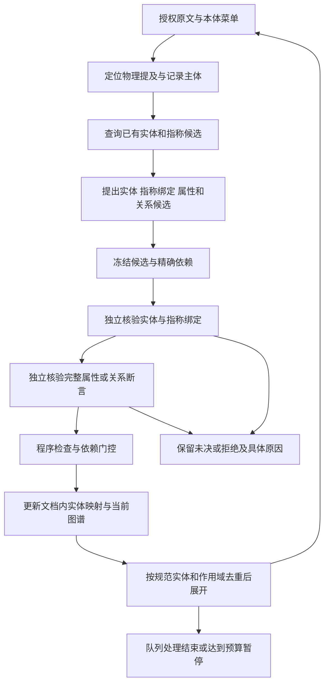

# 文档分析指代共指消解与关系证据修正方案

状态：2026-09-18 已按用户授权实施核心工程，真实模型对照与部署尚未执行。依据为 2026-09-17 对运行 `bbb6814f-97ca-4aae-bddd-a0dc23289d6a` 的只读诊断及用户确认的问题。本文细化 [027 规范](../specs/027-ontology-extraction-engine-v2/spec.md) FR-02、FR-03、FR-06、FR-08、FR-13—FR-16；规范、数据模型、Schema 和任务清单已同步。实际实施和验证范围见第 11 节。

核心方案：**先识别原文提及，再核验其指称并复用文档内实体，最后独立证明属性和关系；只有证明通过的关系才能驱动后续展开。** 同时消除等价任务的重复执行，并用明确的执行预算控制单次连续运行时长。

## 1. 已确认的问题与验收目标

### 1.1 诊断依据

以下数值是当时的观察结果，不是当前状态或修复后结果。

| 问题 | 已核验依据 | 含义 |
|---|---|---|
| 长时间运行 | 23:26 UTC 时已运行约 8 小时 5 分钟，计划 806 项，尝试 164 项，642 项未尝试；最初计划为 63 项 | 任务仍在推进，工作量随图谱展开增长 |
| 推理占主要耗时 | 前 334 次识别/验证请求累计约 7.88 小时，平均排队约 0.03 秒；精排相关请求累计约 3 分钟 | 优先减少无效识别与重复验证，不能把瓶颈归因于精排或排队 |
| 粗品重复建点 | 正文第 85 段的“HRS-9267 粗品”、得量/收率表和包装/存放条件表中的“HRS-9267粗品”产生 3 个 `CrudeProduct` 节点 | 不同提及没有统一到同一个文档内实体；空格不是唯一原因 |
| 并列试验被连接为上下级 | “热降解 → 含降解途径 → 光降解”的关系证明仅把第 139 段的光降解描述当作包含证据 | 模型将对象存在误判为主谓宾关系成立，现有程序门未拦住 |
| 错误关系继续展开 | 子级降解关系检查已产生 70 次模型调用，耗时约 91 分钟 | 错误事实同时增加后续任务和调用成本 |
| 新链路缺少共指执行流程 | 工具目录没有指称候选工具；`merge_referents()` 无调用方；协调器传入空的 `bridge_dependencies` | 基础类型及校验代码存在，但能力未接通 |

当前冻结本体中，`CrudeProduct` 继承的关系只有 `hasStorageCondition`；`ThermalDegradation` 和 `PhotoDegradation` 从 `DegradationPathway` 继承 `hasDegradationPathway`。该谓词允许“报告或父降解途径 → 降解途径”。因此上述热降解连线能通过类型检查，但没有这份原文的关系证明。方案不修改本体以迁就抽取结果。

### 1.2 本次目标

| 编号 | 目标 | 验收口径 |
|---|---|---|
| R1 | 识别同一原文提及的重复发现 | 相同物理位置、相同已核验类型在不同任务中复用同一实体 |
| R2 | 支持文档内指代与共指消解 | 正文、表格、名称变体和代词经独立证明后绑定同一实体；歧义不强选 |
| R3 | 关系必须证明具体端点和方向 | 并列项不凭共现或类型合法被连接；合法父子关系仍可被识别 |
| R4 | 归并不丢失证据和范围 | 合并展示及后续展开，保留每处原文、判定、条件和关系组范围 |
| R5 | 控制重复工作与连续运行成本 | 相同有效输入不重复收费调用；达到预算时暂停并明确未完成 |
| R6 | 可验证且通用 | 正反例同时通过，并完成固定输入下的真实模型质量与成本比较 |

## 2. 范围与复用原则

- 只处理本次运行内的物理提及、文档内指称和原文关系证明。外部身份继续走已有 `query_instances` 和标识核验，不把局部共指升级为跨文档或全局身份。
- 复用 `DocumentIR`、`RecordIndex`、`MentionRegistry`、现有模型阶段、`ProofGate`、`DependencyIndex`、当前工作状态及调用账本。GLiNER 继续提供提及线索，语义判断使用现有配置的 Qwen。
- 新增一个本地候选查询工具；模型分析及独立核验仍由现有编排器调用，工具内不隐藏模型请求。不新增独立消解服务、第三方模型或后台全量扫描任务。
- 权威本体维持原样。具体产品名称、类/谓词 IRI、章节名和本次答案只进入测试参考，不进入算法分支或词表特例。
- 继续采用一个当前恢复入口、一份权威工作状态、一份最新展示缓存，精排结果和调用账本独立保存。本文不引入执行历史快照或回放机制。
- 页面继续以图谱、证据、运行状态与暂停/继续为主；成本明细复用已有 Harness。保留现有“不在主结果展开覆盖计数”的界面约定。

## 3. 调整后的处理流程

F、G 是核验职责的顺序，允许在同一个 verification 请求中返回分别冻结的目标和判定，程序按依赖顺序接纳；不强制每个任务多增加两次请求。实体正确、同一实体判断正确和关系正确是三个独立结论。

## 4. 指代与共指消解

### 4.1 分清三个层次

| 层次 | 表示 | 判定方式 |
|---|---|---|
| 物理提及 | 文档、结构版本、物理单元及字符区间 | 同一物理位置确定性复用；复用 `physical_mention_key()` |
| 文档内指称 | 一处或多处提及指向的实际对象 | 跨位置绑定须有独立原文证明，类型和实例粒度兼容 |
| 展示名称 | 首选名称与已证明的其他写法 | 不作为实体主键；不改变原文字符或引用坐标 |

指代消解处理“本品”“该粗品”“其”“上述设备”等上下文表达；共指消解处理不同位置或不同表达是否指向同一对象。两者共享指称绑定协议，使用不同的候选召回线索。

归一化空白、字形或标点只生成检索键，原文保持不变。不得把全体名称直接去空格后用作实体 ID，也不得把产品代号默认当作全局唯一编号。

### 4.2 新增候选工具 `find_referent_candidates`（拟新增）

工具只查询当前运行的提及索引和实体映射，返回可供核验的材料，不执行归并。

| 项目 | 拟议契约 |
|---|---|
| 输入 | `mention_refs`：已登记的原文提及；`class_iris`：当前菜单内的类型候选；`scope_id`：与当前任务一致 |
| 查询范围 | 当前运行的已登记实体及原文提及；跨章节候选可以召回，跨运行候选禁止读取 |
| 输出 | 候选实体/提及精确引用、原文引用、已核验类型、检索命中原因、可见的区分信息及是否截断 |
| 服务端限制 | 初始建议最多 8 个候选、复用现有工具结果 token 上限；值在试验中校准，模型不能放大上限 |
| 无匹配 | 仅表示本次有界查询没有候选，不证明全文不存在同一实体 |
| 无权限/引用失效 | 返回现有工具错误封套及具体字段错误，不降为无匹配 |
| 副作用 | 只登记本次授权可见的候选和原文引用；不写图、不产生同一实体结论、不发起模型请求 |

候选召回顺序为：精确物理提及 → 已证明的别名/绑定 → 名称变体与本体类型 → 文档主题、语法和记录归属线索。名称、距离、章节、向量分数用于排序，不单独构成身份依据。相同候选集合直接放入初始上下文；模型需要更多候选时才调用工具，避免为每项任务固定增加一个工具往返。

相关候选原文经现有证据授权入口进入上下文，标记为绑定/核验材料。召回候选本身不赋予从其全文发现新事实的权限。工具也不能只返回实体 ID 而省略指称来源。

### 4.3 指称绑定候选与核验

在 discovery 的现有声明封套内拟增 `reference_bindings`。每项最少包含：

- 当前提及或本轮实体候选引用，以及拟绑定的已有实体/提及引用；均来自服务端登记集合。
- 绑定种类 `anaphora` 或 `coreference`，原文支持、区分对象所需上下文、适用范围。
- 原文中的身份限制，例如具体批次、工序产物、单台设备、群体或类称。没有编号时允许凭充分的文档内语义证据绑定。

引用和内容在 freeze 时固定；核验不得把“候选 A 与 B 是否同指”换成重新寻找一个更容易通过的候选。新 kind 及必需维度属于拟议契约，不能当成当前类型已支持。

独立核验至少覆盖：引用对象是否定位准确、是否同一具体对象、类型和粒度是否兼容、区分信息是否冲突、作用域是否支持复用。复用现有 `SemanticDecision` 与局部共指证明承载结果；先补齐针对这些维度的校验，不能直接把现有 `merge_referents()` 当作完整证明器。

结果沿用 `supported / unsupported / undetermined`：

- `supported`：该绑定可以复用实体，依赖声明才可继续接纳。
- `unsupported`：存在明确的不同对象或错误指代证据；拒绝绑定，不否定两实体本身。
- `undetermined`：多候选、证据不足或未完成核验；不强选最近对象。已有独立实体仍可展示，涉及歧义指代的属性/关系保持未决。

同一对象在不同段落出现不同属性值，不自动证明是不同对象；应进一步比较时间、批次、条件等范围。相反，“名称相同且暂未发现冲突”也不能单独证明同一。

### 4.4 本例的处理

“HRS-9267 粗品”与两张表中的“HRS-9267粗品”首先成为共指候选。核验材料包括工艺段落、得量/收率表的产品行、包装/存储表的产品行，以及这些表所描述的生产对象和粒度；用户对该案例的确认放入验收参考，不作为识别输入。

证明通过后的目标结果为一个 `CrudeProduct` 文档内实体，保留三处原文提及和两种名称写法。其收率、包装、存储等信息仍逐项验证，不因实体归并而自动成立。粗品与最终原料药成品保持不同实体。

## 5. 稳定实体身份与归并后的状态

### 5.1 声明身份与实体身份分离

当前 `claim_ref` 带任务 lineage，适合标识一次冻结声明，不适合直接承担跨任务实体身份。新协议保留不可变声明及其核验引用，增加最小的“提及/实体声明 → 文档内规范实体”的当前映射。

- 同一物理提及及相同已核验类型复用现有实体；使用既有物理单元映射处理重叠记录视图。仅区间相交不自动视为同一提及。
- 不同提及经共指证明后，优先复用最早已接纳的规范实体 ID；确定性平局规则冻结在新运行策略中。新建实体不以 label 为主键。
- 已存在两个局部实体时，通过有证明的映射指向选定的规范实体，保留原声明、类型证明和原始引用；不原地改写已付费模型结果。
- 仅名称、证据数量或新提及的增加不改变规范实体身份；公开名称和证据聚合从当前映射派生，不触发所有旧任务重跑。
- 本期只在类型和实例粒度可兼容的范围内归并。记录组成对象与其中的名称片段必须核验指称范围，不能凭来源重叠合并。

### 5.2 存储与恢复

拟在现有 `document_analysis_current_state` 中按业务键保存提及到实体的当前映射及其证明引用；结果复用现有 `document_analysis_results`，请求仍在调用账本。索引从这些当前行与 `DocumentIR` 派生，不另存第二份全量实体注册表。

归并提交沿用当前运行所有权、版本和事务边界，一次更新受影响的映射、工作状态及展示版本。暂停/继续直接加载当前映射；同一已保存核验结果重复应用应幂等。图谱缓存仅反映提交后的映射，不能先在浏览器按名称合并。

已有 `SourceMention / LocalReferent / SemanticDecision` 优先扩展复用，不同时建立另一套同义“实体簇”模型。当前表可以承载新增分区；是否需要索引或数据库结构变更，以实施阶段的定向查询为依据。

### 5.3 关系、属性和作用域

图谱端点投影到规范实体时保留端点原声明及共指证明依赖；缺少任一证明，不得重指向。引用映射并不修改冻结关系的 hash，也不把旧核验结果视为对另一个实际对象的证明。

- 属性和边的条件、极性、模态、组成员范围保持原样。实体相同不意味着不同 scope 的属性可以无条件汇总。
- 任务使用规范实体、谓词、原文记录、作用域和有效语义依赖去重，不能只按实体与谓词去重而漏掉其他证据记录。
- 归并后两个端点相同，需要重新检查这条关系的身份假设和原文证明。不得把“重复描述”转成包含边，也不全局禁止本体允许且原文明确的自关系。
- 如果新证据使共指判定失效，复用现有依赖失效机制，停止受影响展开并标明未决；这是当前证据更新，不是历史回退。

## 6. 关系证据修正

### 6.1 用完整断言约束核验

在现有关系证明结构中明确以下来源，避免仅提交若干互不关联的引文：

1. 原文中的关系主体如何绑定到当前规范实体；代词必须有通过核验的指称绑定。
2. 原文中的对象如何绑定到目标实体。
3. 哪个原文断言表达了当前谓词、方向及端点角色。
4. 若依赖跨句或表格，列出将端点连到该断言的归属/引用步骤。
5. 极性、模态、条件及选择组如何限定整条关系。

原文断言可以来自完整句子、明确的表头—行列归属或跨句引用链，不要求所有关系都出现在同一句或包含固定动词。证据链必须最终落到当前主谓宾断言，不能止于“对象在文中出现”。

拟在关系候选中增加最小的 `source_assertion`：主体原文引用、各对象原文引用、表达谓词的断言引用、所依赖的指称/归属绑定引用。它属于待核验声明，随关系一起冻结并进入内容 hash，不是预先通过的证明。表格和跨句表示沿用已有来源与角色结构，不能用任意解释文字替代原文引用。

### 6.2 指称证明与谓词证明分别接纳

纯指代/共指结果先作为实体绑定证明保存。现有 `BridgeDependencyView` 要求包含 `predicate_assertion`，因此不能把一条纯共指结论伪装成完整关系桥接。

核验当前关系时，输入携带其冻结的 `source_assertion`、所需指称绑定及原文；同一轮新绑定作为独立冻结目标引用，服务端按依赖拓扑接纳，不把它预先列为已支持的上下文实体。当前关系本身不得以“已通过桥接”的身份成为自己的依赖。

只有关系断言与所需绑定均核验通过后，协调器才组装现有 `referent_binding / owner_binding / predicate_assertion` 链，供后续任务的真实 `bridge_dependencies` 复用。P0 须同步调整引用闭包和证明菜单：核验中引用的同轮候选与已通过的外部依赖分别表示，防止出现“必须先有完整关系证明，才能核验该关系”的循环依赖。

`validate_graph` 继续负责本体及结构检查；语义核验须说明引文如何证明指定主体和对象之间的谓词。已有提示词已包含“工具通过不等于原文证明”，本次要补的是结构化角色绑定、完整依赖与反例验证，不能只增加一句提示词后宣称修复。

### 6.3 服务端的确定性拒绝条件

- 不合法谓词、类型或未解析的必需本体约束。
- 端点、声明 hash、作用域或所用指称证明不匹配、失效或未通过。
- 指定的原文主体/对象角色没有引用，也没有已核验的连接步骤。
- 关系证明只提供对象描述，缺少当前主体到关系断言的归属；或引用链没有匹配谓词和方向的断言步骤。
- 借模型返回 `supported` 绕过失败的结构检查；借“未找到反证”替代正向证据。

程序能验证引用、角色结构和依赖闭合，不能仅凭区间相交或字段齐全保证自然语言蕴含正确。语义误判仍须用独立核验和真实模型反例检验，不承诺确定性门消除所有误判。

### 6.4 本例的处理

第 139 段只描述光降解条件、比例和杂质；第 140 段只描述热降解。两处名称都能定位，不证明“热降解包含光降解”。该边缺少热降解主体到包含断言的有效绑定，应不予接纳和展开。

在报告内容归属成立的前提下，分别核验 `CMCReport → 含降解途径 → 各试验对象`。保留真正“父途径包含子途径”的正例，不设置“同属降解类型一律不能连线”的特例，更不将这些关系迁移到没有该谓词的 `CrudeProduct`。

## 7. 工作量收敛与运行成本

### 7.1 优先减少没有新增信息的工作

- 通过指称归并消除同一对象的重复分支；只有端点、关系证明和 scope 均通过的边才能创建后继任务。
- 等价提及不创建新的主体验证代；新增记录只加入新增候选，已有任务不因排序变化重跑。
- 请求复用必须匹配任务、原文范围、冻结本体、scope 和有效依赖。共指归并可以减少重复规划，但不同输入的核验结果不能直接互换。
- 保留现有重试/修复限额。没有新增证据、改变的有效依赖或尚未执行的合法请求时，不仅因“仍未决”重新入队。
- 原文无候选是本次记录的结果；低分、空候选、语义拒绝都不能外推成全文否定。检索截断和预算停止单列未完成，不能用大量跳过伪造收敛。

### 7.2 两层预算

每 lineage 的现有 4 次请求限额继续覆盖发现、工具续轮、指称分析、核验及修复，不另给共指工具隐形额度。优先将候选指称材料预装到同一发现请求，并在同一核验请求中批量返回相关独立目标；必要的关系工具调用仍须执行。`TurnPlan` 应为这些已知必需步骤预留额度，无法满足时明确未完成。

**单次启动/继续的连续执行预算**复用既有暂停/继续状态。初始建议的 30 分钟上限已按 2026-09-18 用户要求调整为 5 小时；每轮 32 次识别模型请求的限制保留，先到者触发暂停。这是执行边界，不是已确认的性能指标，也不是完成时限。

- 时间按本次启动/继续后的实际运行时间计；次数按既有账本的实际预留请求计，失败不退款。
- 达限后停止发起新请求。已付费请求允许在既有请求超时内完成，先保存结果，再在下一个安全边界暂停；不为精确卡住时间上限丢弃响应。暂停边界包含工具返回已保存、下一次模型请求尚未发送的位置。
- 继续只重置这一次执行段的时间/次数基线，不清空累计账本、不重置 lineage 和总任务额度、不自动延长预算并循环继续。
- 达限为 `paused` 且带明确原因，不能记成完成或技术失败。界面复用现有继续入口和状态说明，累计成本放在 Harness。
- 队列耗尽、预算耗尽、技术未完成和语义未决分别表达。停止运行不等于质量达标。

### 7.3 输出与并发

先测量上述修正后的成本，再对新运行试验较紧凑的输出预算。当前单次输出上限为 20480 tokens，不能未经评测统一削减而截断完整证明；可比较 4096/8192 等候选值，按目标数量和必要结构控制输入输出。截断响应保持未完成，不接纳半个 JSON 或缺失 facet。

第一阶段保持当前单运行串行识别，优先确认实体映射和依赖更新正确。扩大并发不列为本期完成条件；单纯提高调度并发不能消除错误展开。

## 8. 实施顺序与文件归属

下列为实施分工与验收出口；工程落地情况见第 11 节，真实模型质量验收仍单独保留。实施未部署或修改既有运行数据。

| 阶段 | 工作与验收出口 | 主要复用/修改位置 |
|---|---|---|
| P0 契约与回归 | 固定本次失败样本、反例及参考；同步 027 需求、绑定/关系证明契约、Schema 和预算语义；用失败测试确认现有缺口 | `specs/027-ontology-extraction-engine-v2/`；现有 `test_tool_engine_*`、`test_relation_validation_harness.py` |
| P1 关系接纳 | 明确源角色与完整断言，阻断并列项包含边；本体允许的真正父子关系仍通过 | `claim_protocol.py`、`verification.py`、`tool_runtime.py`、`tool_validation/evidence.py`、`tool_model_adapter.py` |
| P2 指称解析 | 新增候选工具与冻结绑定目标，接入独立核验；跨任务提供相关已有实体，精确重复提及直接复用 | `tool_contracts.py`、`tool_runtime.py`、`claim_identity.py`、`claim_freeze.py`、`mentions.py`、`context.py`、`executor.py` |
| P3 图谱与调度 | 规范实体映射、证明依赖、作用域保留、队列去重及当前状态恢复；新绑定可参与关系证据链 | `contracts.py`、`current_work.py`、`dependencies.py`、`scheduler.py`、`projection.py`、`document_analysis/current_state.py`、`execution.py`、`public_projection.py` |
| P4 成本与产品契约 | 连续执行预算及暂停原因；必要的节点名称/提及展示与前后端类型同步 | `config.py`、`schemas/document_analysis.py`、`frontend/src/lib/api.ts`、既有文档分析面板与 Harness |
| P5 质量验收 | 固定同预算对照、保留文档和改名本体测试；报告质量、耗时、token 与未完成范围 | `backend/app/evaluation/`、新的评测目录；线上模块不得反向依赖评测代码 |

P1 与 P2 的契约要在 P0 一起明确，避免设计出互相不兼容的证明结构。P1 可先验证门控，完整交付必须同时完成指称复用和调度接入。

新能力冻结在新运行的协议/策略版本中，现有 `ontology-tool-extraction-v1` 运行按原冻结契约读取和继续。本次问题运行不原地改 ID、重写证明或自动重跑；方案实施后以新运行评测修复效果。原运行的暂停或保留由既有显式操作执行，不把文档设计当作运维授权。

## 9. 验收矩阵与交付条件

| 编号 | 输入或操作 | 必须观察到的结果 |
|---|---|---|
| A01 | 同一物理提及由不同谓词任务发现 | 只有一个规范实体；原任务/证明仍可定位 |
| A02 | 同一段中的短名称与长描述，或相邻同名提及 | 仅重叠/邻接不自动归并；充分共指证据可归并 |
| A03 | 本例正文、得量表、存放表中的粗品 | 一个粗品实体、三处提及，两种名称；成品仍为另一实体 |
| A04 | 同名不同批次、两台同型号设备、粗品与成品 | 有区分证据时保持不同实体；不强制把未知身份归并 |
| A05 | “该粗品/本品/其”存在唯一受支持的先行对象 | 属性/关系绑定到已核验实体，保留代词和先行词证据 |
| A06 | 代词有两个合理先行对象，或在跨章节后切换对象 | 保留未决或核验新指向，不因最近距离/旧绑定强选 |
| A07 | 热、光、氧化等并列记录 | 不产生彼此包含边，不产生由错误边派生的任务 |
| A08 | 原文明示一个父途径包含两个子途径 | 合法关系通过；不能以拒绝所有同类连线过关 |
| A09 | 经跨句指代或表头/行列归属表达的关系 | 通过完整证据链可接纳；不要求全部端点同句出现 |
| A10 | `CrudeProduct` 被提出“含降解途径”关系 | 冻结菜单拒绝，不修改本体或偷换主体 |
| A11 | 两实体归并后出现自边、冲突属性或条件分支 | 按原文重新核对相关身份假设；条件和 scope 不丢失，不合并所有值 |
| A12 | 共指结果已保存后暂停/继续，或提交重复到达 | 映射不重复、已知结果不重复调用、端点不悬空 |
| A13 | 共指证明或组成员依赖失效 | 受影响声明停止接纳/展开，其他独立结果不被清空 |
| A14 | 请求超时、预算达限、输出截断 | 分别保持相应状态；预算暂停后可继续，无自动无限续跑 |
| A15 | 伪造候选 ID、跨运行引用、陈旧映射或原文越权 | 服务端拒绝，不返回其他运行数据，不产生绑定 |
| A16 | 本体 IRI/标签一致改名，并换用其他领域的同构案例 | 同一套算法仍工作，不依赖 HRS、粗品、降解等特例 |

工程回归覆盖公开行为、数据权限及暂停/继续；沿用现有隔离 fixture，文件制品放临时目录。涉及实际数据库事务/并发时使用专用可销毁 PostgreSQL 测试库，未运行或跳过必须报告。设计阶段只检查文档与引用，不声称这些测试已通过。

真实模型验收固定原文、本体、模型制品、参数、预算和独立参考，金标不进入识别输入。既有问题图谱不是金标。记录实体归并的正确/错误/漏归并、指代正确/错误/未决、关系 precision/recall、总任务/重复任务、实际模型调用、token、耗时及未完成原因。

对照至少包含当前版本与完整修正版；为区分贡献，可增加仅关系修正组。采用相同连续执行预算比较阶段结果，并在明确总预算内比较结束结果，不用“更早暂停”充当性能提升。开发样本之外保留未参与调参的文档；模型输出必须实际检查，不能以工具注册或工程测试代替。

交付最低条件：上述正反例符合预期，本次已定位的错误边消失、粗品三处提及正确归并、既有正确关系和条件保留；给出真实质量与成本数据后再决定预算默认值。预计通过减少重复实体与无效展开降低成本，但在评测前不承诺耗时下降比例或固定完成时间。

## 10. 当前实现依据

- [现有工具目录](../backend/app/services/extraction/ontology_guided/tool_contracts.py)：新增 `find_referent_candidates`，仅提供授权候选与原文。
- [局部共指基础](../backend/app/services/extraction/ontology_guided/mentions.py)：保留物理提及登记，实体复用经独立冻结绑定和规范实体映射完成。
- [候选身份检查](../backend/app/services/extraction/ontology_guided/claim_identity.py)及[候选冻结](../backend/app/services/extraction/ontology_guided/claim_freeze.py)：保留带 lineage 的声明身份；新能力独立生成文档内实体身份，不改写旧声明哈希。
- [协调器](../backend/app/services/extraction/ontology_guided/executor.py)：已接通已接纳实体（含孤立节点）的来源、候选与映射恢复；同轮绑定和当前谓词断言共同核验，不预造完整桥接。通过的关系按规范实体继续驱动展开。
- [证明门](../backend/app/services/extraction/ontology_guided/verification.py)及[声明协议](../backend/app/services/extraction/ontology_guided/claim_protocol.py)：本方案扩展现有入口，不建立另一套核验管线。
- [当前状态存储](../backend/app/services/document_analysis/current_state.py)及[运行执行](../backend/app/services/document_analysis/execution.py)：复用现有状态更新、账本和暂停/继续边界。
- [权威本体](../ontology/slpra/slpra-drug-development.ttl)：维持类型与谓词边界，不通过修改本体消除本次抽取反例。

## 11. 本轮实施与验证记录（2026-09-18）

新运行冻结 `reference_resolution_version=1`。发现阶段新增独立 `reference_bindings`，关系新增 `source_assertion`；新提及只可绑定已登记同类型实体，核验身份、作用域和反证后投影到规范实体。空白正规化与局部代词只用于召回。旧运行缺省字段不参与原哈希；候选引用在首次请求时冻结，继续时不可换入其他实体。

现有 current-state 表新增 `entity_origins` 和 `reference_resolutions` 业务分区，保存当前来源、物理提及到实体的映射及证明依赖。声明和核验结果仍在现有结果存储。后续调度复用规范实体与既有 scope/record 去重，声明原文、否定、条件和组成员不被重写。外部身份核验仍独立，已通过的外部身份信息在实体复用后保留。

连续执行窗口默认 18000 秒（5 小时）或 32 次识别请求，达到任一限额后使用既有暂停/继续流程。已有运行经明确授权调整时间上限时，在唯一当前预算行保存可选 max_seconds，保留冻结策略与 fingerprint；显式继续保留此上限。已预留请求完成并保存后再停；显式继续重置窗口，租约恢复不重置，总调用和每条 lineage 的四次预算继续累计。界面分别显示时间与调用额度暂停原因。该预算是可配置的运行边界，不是质量达标或耗时改善结论。

新增隔离回归入口：

- [候选工具](../backend/tests/test_extraction/test_tool_referent_candidates.py)：候选上限、权限、伪造提及、类型、名称变体及代词。
- [原文关系与绑定门控](../backend/tests/test_extraction/test_relation_source_assertions.py)：并列反例、真实父子正例、表格角色、绑定证明及上下文匹配。
- [冻结到规范实体投影](../backend/tests/test_extraction/test_reference_resolution_finalize.py)：正文和两张表、不同批次、成品、歧义、映射作用域及外部身份保留。
- [真实协调器与冷继续](../backend/tests/test_extraction/test_reference_resolution_execution.py)：三任务归并、孤立实体召回、已付费结果不重发、证明依赖恢复及子任务不重复展开。
- [冻结候选协议](../backend/tests/test_extraction/test_reference_context_protocol.py)：旧协议兼容、严格字段、候选集不可变及持久化拒绝。
- [连续执行预算](../backend/tests/test_extraction/test_document_analysis_continuous_budget.py)：不同请求边界、请求中到时、继续、租约恢复和暂停原因。

以上模型响应使用受控替身；不能代替本例原文在真实 Qwen 上的质量与成本对照。叙述属性沿用独立 `subject_binding` 核验，缺证保持未决；本轮新增的确定性 `source_assertion` 角色闭合针对关系声明。T37 的真实模型评测仍未完成。代码实施阶段没有重启后端、迁移生产数据或改写指定旧运行。

随后根据用户“请重新部署”的指令，已于 2026-09-18 00:41 UTC 完成前后端重启与健康、迁移版本、新策略及数据保留核验，见[部署记录](调研/ontology-tool-engine-20260916/deployment-20260918.md)。指定旧运行在当前调用落盘后安全暂停，保留原冻结策略和图谱；新建分析才启用冻结的新策略。

本轮实际验证：

| 检查 | 结果 |
|---|---|
| 工具引擎、工具运行时、候选/关系证明、规范实体、当前协议、关系组、调度及依赖边界定向回归 | 616 passed，9 skipped |
| 随后补充的投影/冷继续/既有预算回归 | 26 passed，包含跨 scope 同一物理提及召回边界 |
| 新连续预算 | 7 项协调器/账本用例和 2 项 worker/API 用例分别通过 |
| 前端运行、排序、模板性能和图谱 Node 回归 | 4 组通过 |
| 定向 Ruff、前端暂停文案 ESLint、差异空白检查 | 通过 |
| 设计与契约检查器 | 29 项变异自测通过，精确校验 11 个工具与 T01—T37 |

上述测试组存在覆盖重叠，不累加成唯一测试总数。9 项跳过均需专用 `DOCUMENT_ANALYSIS_TEST_DATABASE_URL`，本次未配置可销毁 PostgreSQL，SQLite 结果不代替 PostgreSQL 并发验收。把全部后端用例放在同一进程时，HTTP TestClient 在创建运行请求处出现等待，诊断栈停在 AnyIO portal 调度；该组合运行已中断，两个相同 API 用例独立进程验证通过。未据此宣称全库测试或组合运行通过，也未为测试等待修改应用业务逻辑。
