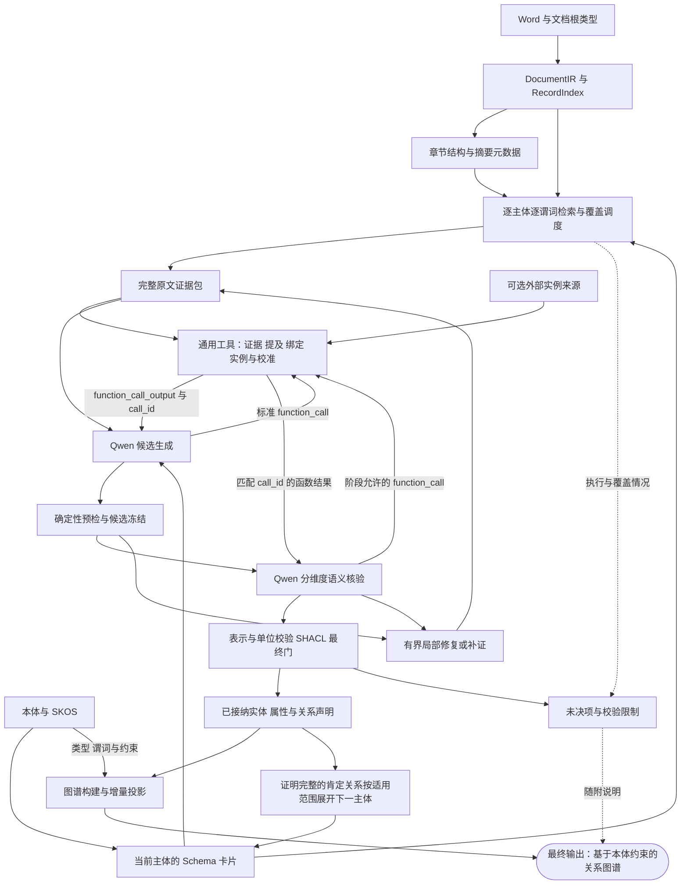

# 通用本体驱动文档抽取引擎 2.0 设计方案

日期：2026-09-16。状态：设计提案，尚未实施或进行新版模型评测。“2.0”是本方案名称，不代表已发布的 API 或软件版本。

本方案设计通用的本体驱动文档抽取引擎，最终输出**基于本体约束、带原文证据的文档实例关系图谱**，细化既有[本体指引基础方案](基于本体指引的文档结构和摘要元数据的关系图谱识别方案.md)与[语义精排方案](支持语义相似度精排的关系图谱识别精度提升方案.md)。类、谓词、标识属性及其含义由输入本体提供；引擎不内置领域类型、领域关系、章节偏好或业务字段特例。前期实测只用于发现通用失败模式，不决定实施领域或优化对象。

继续复用共享识别核心、文档分析运行和现有存储，不建立第二套抽取平台。本次交付设计及制品检查入口；历史文档中的部署、清理和迁移安排不作为本次工作内容。

可直接编码的细化见 [027 模块计划](../specs/027-ontology-extraction-engine-v2/plan.md)、[数据契约](../specs/027-ontology-extraction-engine-v2/data-model.md)与[任务清单](../specs/027-ontology-extraction-engine-v2/tasks.md)。其函数定义、阶段 Schema 和恢复/图谱字段为本文目标的具体化；状态仍为待实施。

按用户确认的 OpenAI Harness Engineering 方向，新增 [Harness 设计](../specs/027-ontology-extraction-engine-v2/harness.md)：同时明确研发代理的规范/验证环境与 Qwen 的运行环境，继续复用现有模块。具体采用依据与原文访问限制在该文列明。

## 1. 核心决策

采用以下主流程：

**文档结构与摘要定位 → 本体 Schema 卡片限定任务 → 原文提及与记录主体识别 → 属性/关系候选 → 确定性检查 → Qwen 分维度核验 → 有限修复或补证 → 最终门控 → 图谱构建 → 基于本体约束的关系图谱。**

设计重点是同时减少错误事实和可恢复的漏抽：

1. 以“当前主体—当前谓词—完整记录”为工作单位，复用全文索引；单次模型输入只包含该任务需要的卡片、原文和工具结果。
2. 区分物理提及、记录表达的局部对象、文档内共指、外部身份和关系证明。名称、编号、表格邻接与档案命中均不能跳过这些判断。
3. 工具检查失败后，依据明确错误码决定局部修复、原文补证或保留未决；不得仅通过增加拒绝提高表面精确率。
4. Qwen 负责类型、角色、归属、关系及条件的语义判断；deterministic engine 负责坐标、结构、标识、值表示、单位换算和 SHACL 校验。最终接纳权在服务端控制器。
5. GLiNER2.5 是提及建议工具；可选外部实例工具提供身份候选和外部字段；摘要和精排只负责定位。三者均不能直接证明文档事实。
6. 将实体、属性、关系的 P/R/F1 与检索覆盖、技术完成度、数值校准、调用成本分别验收。现有报告属于开发回归样本，另设未参与调参的保留文档。
7. 工具采用通用能力名称及 JSON Schema 参数，通过 OpenAI Responses API 的 `function_call/function_call_output` 协议与项目 Qwen 对接。工具实现独立于模型和领域，协议适配复用现有模型客户端与调度。

实施按通用能力组织：本体契约编译、证据绑定、主体与关系核验、修复补证、值规范化、集成评测。每阶段覆盖多种类型和谓词，不设领域专用闭环。

### 1.1 通用性边界

- **本体提供含义和约束**：合法类、谓词、定义、继承、值类型及身份约束来自输入本体。标准词表、单位表及显式字段映射属于声明式输入，不能把某篇文档的答案或领域优化规则写入配置伪装成通用能力。
- **引擎执行统一算法**：不得按具体类/谓词 IRI、行业名、章节标题或标识前缀切换识别、排序、补证或接纳逻辑。相同结构与证据条件应获得相同处理。
- **标识不是必填前提**：实体可以通过名称提及、局部指称、记录结构或合法复合标识辨认；无编号和无外部档案均不使文档实体失效。
- **缺失语义不由领域默认补齐**：本体定义或约束不足时显式保留限制/未决，不采用内置业务常识补造关系、单位或身份。没有约束也不自动等于不支持原文中已明确的事实。
- **通用不等于完整支持所有本体构造**：明确当前支持的类、属性和约束构造，不能静默丢弃无法执行的限制。扩展按构造和证明能力推进，而非按业务类型增加分支。

Qwen 与 GLiNER2.5 保留为本项目当前模型选择，源文件仍经现有 DocumentIR 进入核心；本方案不新增文件格式解析器或连接器平台。

### 1.2 Harness Engineering 的落点

上述主流程规定声明接纳所需的阶段门。阶段内采用“上下文 → 模型选择 → 工具执行 → 可定位反馈 → 下一步”的有界循环；Qwen 在授权范围内决定需要哪些工具，程序控制预算、冻结、核验及最终构图。

| 职责 | 本特性的实现方式 |
|---|---|
| 提供可理解的工作环境 | 当前任务卡片、定位目录、完整原文和工具结果按角色装配为 ModelContextView，按需读取，摘要不成为证据 |
| 工具与反馈可操作 | 10 个标准函数保持通用；错误给 code/field_path/证据或缺失维度，引用经协调器登记后可继续使用 |
| 程序控制执行边界 | TurnPlan 按当前已预留账本决定工具轮、阶段回答或停止；保留核验底额，不固定一轮工具就结束 |
| 可执行质量约束 | 参数、权限、版本、桥接、数量/单位及 SHACL 检查落实到代码和反例；通过必检门才进入图谱 |
| 研发验证闭环 | spec/plan/contracts/tasks 是短入口；契约漂移、导入边界、行为与界面分别检查，观察到的失败转为定向回归 |

本期按需选择工具仍受每 lineage 默认 4 次请求和一次恢复机会约束。工具存在、已启用及实际执行分别记录；GLiNER2.5 必需配置须通过可用性检查，评价其贡献时必须有实际执行覆盖，不能靠注册工具宣称验证完成。

## 2. 实测依据与设计响应

前期固定文档实验揭示了下列失败模式。将其归纳为通用契约，不把具体实体、属性、原文位置或章节类型变成优化规则；具体报告与模型制品见文末验证依据。

| 已验证事实或问题 | 对新版设计的约束 |
|---|---|
| E0/E1/E2 共 18 次真实 Qwen 请求，9/9 case 完成，18/18 原始 JSON Schema 通过 | 继续采用紧凑结构化协议；结构合规单独验收，不代替语义质量 |
| 外部实例实验正确关联已知标识，未用同名记录替换未知标识 | 保留按需查询、标识归属及版本核验；无外部身份不阻断文档局部实体 |
| E1 比同源 E0 多约 34.3% tokens，未证明最终质量提升 | 精简外部候选及字段；工具价值按质量与实际成本衡量 |
| 可用原文因引用错指被机械门拦截 | 增加同记录、同归属范围内的唯一引用修复，修复后重新核验 |
| 候选锚点混入另一对象的指称；多个标识被错误合并 | 独立定位对象，核验指称与标识对应；实体划分与关系选择组分别表示 |
| 检索词项覆盖增加，但最终有效实体减少 | 优化有效记录覆盖和实体绑定；不以词项密度直接提高关系可信度 |
| 某种语境中的对象被错误用作另一谓词的充分证明，独立复核仍未决 | 根据当前谓词定义核验角色和桥接，按缺失维度补证；不能把未决先验记为确定 FP |
| 关联对象的名称被用作记录主体，类型层级也有缺证 | 主体先独立验证；允许有字段组证据的无名称对象，禁止用邻接名称替代主体角色 |
| C 组 GLiNER 多标签、表头和单位错标；更多 span 未证明质量改善 | NER 输出保留类型和角色假设，单独评估；单位识别以原文及受控单位表核验 |
| D 组摘要启用/屏蔽后的实际模型输入相同；输入膨胀，完整核验 0/8 | 摘要收益必须消融证明；检查整个请求体积，完整记录分批，避免工具信息重复 |
| 区间端点因通用标量门阻断；数值 SHACL 0/3 | 新增有明确端点语义的数量表示与单位归属，不从区间任意截取数字 |
| E 组仅验证文本属性，真实数值换算未评估 | 数值/单位引擎继续纳入架构，但需要单独的真实正例和反例验证 |

这些结果证明部分协议和工具能够运行，尚未证明跨领域 F1 改善。

## 3. 输入、输出及事实边界

### 3.1 输入

| 输入 | 用途 | 权限边界 |
|---|---|---|
| 用户指定的文档根类与任务范围 | 确定根主体及待抽取谓词 | 不从一次词项命中擅自改变根类型 |
| Word 与 DocumentIR | 原文、位置、逻辑行列、合并单元格、标题和注释 | 文档事实的直接来源；解析器的 header 标记仍需核对 |
| 本体快照、Schema 卡片 | 合法类型、谓词、定义、range、datatype、已有约束 | 不从候选反推修改 T-Box；多值 range 不自动解释为 union |
| MetadataSnapshot | 章节树、摘要及来源状态 | 只用于检索；摘要不成为事实引用 |
| SKOS 与实验词表 | 类型/属性别名、描述、单位词项 | 人工补充标明来源；不写入报告具体值或评测参考 |
| 可选外部实例源 | 通过合法属性、名称或复合线索查询候选及元数据 | 分开系统、数据集、记录键、版本与字段；不证明文档关系 |
| 运行预算 | 请求、输入输出、完整记录与补证限额 | 所有模型请求计入同一预算，失败也不返还调用额度 |

外部源通过既有来源访问与字段映射提供数据，启用情况属于运行输入。没有外部源时，文档抽取主流程仍完整运行。Mock 可作为同一输入契约的测试数据提供者，不是引擎固定依赖或默认权威来源；不同数据集不得因同名而隐式同步。

### 3.2 最终输出：基于本体约束的关系图谱

引擎的主交付物是**文档实例关系图谱**：将已核验的文档实体组织为节点、属性组织为节点上的属性声明、关系组织为有方向和限定的边或关系组。输入本体约束节点类型、合法谓词、主体/对象类型及值表示；原文证据决定具体实例和声明是否成立。Qwen 的结构化 JSON 与工具返回是构图的中间协议，最终由服务端构建并输出图谱。

| 图谱组成 | 输出内容与本体约束 |
|---|---|
| 根节点与实体节点 | 稳定局部 ID、本体类 IRI、已核验的提及/记录来源；文档根类型标明“用户指定”，不计作模型识别成功 |
| 节点属性 | 主体 ID、本体属性 IRI、原值与规范化值、datatype、必要单位及限定；值归属和表示均须通过适用检查 |
| 关系边与关系组 | 主体 ID、本体关系 IRI、对象 ID/集合、方向、selection、极性、模态及条件；端点类型满足当前支持的适用约束 |
| 原文证据 | 节点类型、属性和关系声明关联可定位的原文引用及核验结果；用户指定根类型等输入来源另行标明 |
| 可选外部链接/字段 | 保留来源、记录键、身份适用域和字段映射；与文档声明区分，不因匹配成功自动生成文档关系或全局等同关系 |

图谱保留已支持的条件、备选和否定声明的原始语义；展示与序列化不得将它们降成无条件肯定边。新协议以 `verified` 投影作为完整交付和默认展示，保留独立核验的非根关联节点；`effective` 是其中根可达、实际肯定且无限定的子视图。展开 eligibility 单独判断：证明完整的肯定选择组和限定关系可带 `TraversalScope` 继续识别，不能据此提升为无条件事实。旧运行继续沿用冻结的投影规则，不为连通图谱补造边。

图谱随附执行完成情况、覆盖缺口、未决/拒绝项、未绑定原文观察和未支持约束的说明；这些说明不作为已成立关系加入有效图。预算耗尽、暂停或部分失败时，交付已得到的图谱并明确其未完成范围；空图或只有根节点不能证明全文没有其他事实。

“基于本体约束”指按输入本体及明确支持的抽取约束构图，不宣称完整 OWL 推理、全量业务图 SHACL 合规或全文抽取完备。“系统校验通过”与“业务事实提交”分开；图谱是本次文档分析产物，不自动完成业务确认或回写权威本体。

质量按三个轴解释，并映射既有状态，避免再建一套运行状态机：

- 执行是否完成：完成、失败或尚未执行；暂停沿用现有运行状态。
- 语义是否成立：supported、unsupported、undetermined、not_checked。
- 机械/表示检查是否完成：passed、failed、not_evaluated/incomplete。

`unresolved` 是缺证或未完成验证；`rejected` 不等于原文否定事实。原文明示关系不成立，可以支持一条带 negated 极性的声明。检索未命中、N/A、unknown 和数值零不可互换。

## 4. 总体架构

总体架构以**基于本体约束的关系图谱**为最终输出。已接纳声明进入图谱构建；满足展开条件的关系同时驱动后续抽取，逐步补齐图谱。未决项和覆盖说明随图谱交付。



这些是同一后端内的职责边界，不新增微服务或通用 Agent 框架。Qwen 通过标准函数调用请求当前阶段允许的工具，服务端控制器校验并分派；确定性必检项仍由控制器保证执行。工具访问同一冻结证据与本体上下文，Qwen 不能自行扩大文档范围、改预算、授予证据权限、指定任意数据源或写入事实。第 7 节定义协议与服务端职责。

### 4.1 正常路径

1. 校验文档、IR、摘要与本体身份，建立当前根主体；保留摘要部分完成/回退状态。
2. 编译当前主体直接谓词的 Schema 卡片，分别构造查询；同一谓词不因多个类菜单重复出现而重复加权。
3. 检索并组装完整记录，提供必需表头、单位、注释、父上下文和竞争归属。源记录与补充上下文角色分开。
4. 组装结构绑定与授权原文，向 Qwen 开放当前可用工具；按需调用 GLiNER2.5、引用定位和实例查询。仅在已声明的标识约束适用时执行相应标识解析，所有工具结果带来源、覆盖及可定位问题。
5. Qwen 输出实体解释和属性/关系候选。每条候选独立检查；一个无效主体只影响其依赖项。
6. 机械检查完成后冻结候选。Qwen 对固定候选 ID、内容和证据包进行分维度核验，不在核验返回中改写候选。
7. 对满足前置条件的属性执行规范化/SHACL，验证关系组和依赖，派生 accepted/unresolved/rejected。
8. 仅对明确缺口调度修复/补证；没有新证据、额度耗尽或技术失败时保留真实状态，继续其他任务。
9. 将已接纳实体、属性与关系声明构建为图谱，更新当前投影；满足条件的关系驱动后续主体任务，所有请求计入总预算。
10. 任务范围处理完毕或本轮停止时，交付当前关系图谱及执行、覆盖和约束说明，明确完整或部分完成状态。

候选生成和核验是隔离的模型阶段，仍使用项目 Qwen；每个阶段的工具调用可能增加实际请求次数。这提供协议隔离，不构成独立模型共识，也不能消除同模型的共同偏差。独立原文评审用于评测。

任务以一个主谓词限定调用目的。同包字段由当前本体菜单、共同原文证据范围和请求预算决定，不固定字段集合，不为某种类型开例外。每条声明仍是独立核验目标，预算按实际请求计；不能把所有对象字段聚合为一次无限制抽取，后续展开的任务也必须计入总预算。

### 4.2 从已核验声明到图谱输出

图谱构建复用既有实体解析、ProofGate/EligibilityPolicy 和图投影，从当前权威工作状态生成结果，不新增图数据库或另一份权威存储。构图依次完成：

1. **确定节点**：依据已核验的实体解释及共指结果确定端点；保留不同局部对象，不能仅凭同名或同一外部候选合并。
2. **挂接属性和关系**：按本体属性/关系 IRI 绑定节点，保留规范化值、关系组、条件和证据；未通过核验的声明留在随附说明中。
3. **检查投影完整性**：核对所有端点及其版本存在、属性 owner 一致、类/谓词及值表示符合已支持约束、限定与证据未在序列化中丢失。单条声明检查通过不自动等于组合后的图满足所有约束；未支持或未完成的检查显式报告，无法确定可接纳性的声明保留未决，不补造节点、属性或边来凑齐基数。
4. **交付同一语义图谱**：结构化图谱结果与页面关系图使用同一投影语义，包含实体、属性、关系、限定和证据。当前 UI 或输出契约不能保真表达的选择组等能力须在接入时补齐；不能以模型 JSON 合法或页面画出连线代替图谱验收。

## 5. Schema 卡片与声明契约

### 5.1 卡片内容

卡片以现有 `compile_local_menu`、SlotSpec/EdgeSpec 为依据，按任务裁选，不把整份本体放进每个请求。需要表达：

| 内容 | 规则 |
|---|---|
| 主体解释 | 当前实体 ID、类型假设、已核验提及、适用范围；假设与已证实字段分开 |
| 谓词 | 完整 IRI、定义、直接声明来源、合法目标/值类型、已有基数约束 |
| 角色证据要求 | 统一要求检查主体/对象、字段角色、方向、桥接、条件和否定；具体含义来自当前谓词定义，不能内置逐领域策略表 |
| 属性表示 | 字符串/日期/数量；数量允许 scalar、interval 或某一端点时必须显式声明 |
| 身份要求 | 按属性定义区分名称、标识和其他指称；保留单属性/复合标识及适用域；局部识别与外部链接要求不同 |
| 证明方式 | 沿用显式叙述、所属字段组、角色表格、已解析指代等既有 proof menu |

谓词定义决定断言含义。原文的要求、可能性、实际发生及明确否定必须分别保留，不能因相关对象出现而相互替代。若当前本体无法表达某种模态或限定，保留原文及表示缺口，不输出语义更强的普通关系。

### 5.2 主体表示

实体可以由明确提及、局部指称、合法标识，也可以由原文记录或字段组表达。对于没有专名的对象，必须定位表示该对象的组成来源并核验类型、角色与 owner，不能拿关联对象的名称单元格替代当前主体。

通用无名称记录主体是待扩展能力：现有字段组主要提供上下文和归属依据，部分特例已有多来源对象，但不等于所有合法类型已能按统一规则建立主体。实施须定义组成来源、角色及稳定局部身份，不列举特定业务类型触发对象构造。

同一类允许多个实例，禁止在新协议中按“每类一个预设槽位”强制填充；这不是对现有在线执行器实例数量的限制描述。缺少对象证据时保留未绑定属性线索，不制造实体。类型层级差异、记录对象与共享名称的差异都须依据本体和原文区分。

### 5.3 最小声明模型

| 对象 | 必需信息 |
|---|---|
| EvidenceRef | 文档/IR 身份、稳定 evidence_id、原文区间、逐字 quote、记录与来源角色 |
| EntityHypothesis | 局部 ID、类型、提及/记录组成来源、可区分的指称证据、可选标识属性声明、主体角色证据 |
| PropertyClaim | 候选 ID、主体、合法谓词、完整 raw、值/字段/单位引用、限定条件 |
| RelationClaim | 候选 ID、主体、谓词、对象集合、selection、桥接证据、极性、模态及条件/适用范围 |
| ExternalLink | system、dataset、record_key、record_version、原文对应证据、identity scope |
| Verification | 固定 target_id/content_hash、逐维度 verdict/support/counterevidence_support；缺失维度由服务端派生，不含改写后的声明 |

标识声明使用本体属性 IRI 和原文引用，不设置领域专属标识字段。条件与适用范围同样使用原文及当前本体允许的属性表达，不固定业务维度枚举。没有明确身份键时，实体可依据记录和指称证据形成局部身份，不因此推定全局唯一。

提示中可使用短引用别名，但每个别名只在当前证据包有效，服务端映射到稳定坐标。补证后不能复用旧 `uN` 的含义。后续引用优先由模型选择可定位 span，服务端回填原文；仍允许 Qwen 指出 NER 未发现的真实原文跨度。

结构约束使用白名单 IRI/工具名、拒绝额外字段、限制数组长度并逐字回放。候选变化后旧核验失效；相同候选只补充证据，也必须基于新证据包重新核验受影响维度。

### 5.4 通用选择组示例

下面的合成候选与 [discovery Schema](../specs/027-ontology-extraction-engine-v2/contracts/stage-schemas.json) 一致，**不是新版真实返回或最终图谱**；须经核验及第 4.2 节构图。`urn:example:*` 仅是测试本体 IRI。假定文档根 `s` 已登记，`ev-1` 原文为“主体S在条件C下关联类型T的对象甲或类型T的对象乙，二者恰选其一。”；类型、指称及关系仍须逐项核验。完整上下文和核验配对见 [examples.json](../specs/027-ontology-extraction-engine-v2/contracts/examples.json)。

```json
{
  "entities": [
    {
      "local_id": "e1",
      "class_iri": "urn:example:T",
      "representation": "mention",
      "mentions": [
        {
          "evidence_id": "ev-1",
          "text": "对象甲",
          "context_text": null
        }
      ],
      "record_components": [],
      "identifier_claims": []
    },
    {
      "local_id": "e2",
      "class_iri": "urn:example:T",
      "representation": "mention",
      "mentions": [
        {
          "evidence_id": "ev-1",
          "text": "对象乙",
          "context_text": null
        }
      ],
      "record_components": [],
      "identifier_claims": []
    }
  ],
  "properties": [],
  "relations": [
    {
      "local_id": "r1",
      "subject_id": "s",
      "predicate_iri": "urn:example:relatesTo",
      "object_ids": [
        "e1",
        "e2"
      ],
      "selection": "one_of",
      "bridge_support": [
        {
          "evidence_id": "ev-1",
          "text": "主体S在条件C下关联类型T的对象甲或类型T的对象乙，二者恰选其一。",
          "context_text": null
        }
      ],
      "selection_support": [
        {
          "evidence_id": "ev-1",
          "text": "类型T的对象甲或类型T的对象乙，二者恰选其一",
          "context_text": null
        }
      ],
      "qualifiers": {
        "polarity": "affirmed",
        "modality": "asserted",
        "condition_support": [
          {
            "evidence_id": "ev-1",
            "text": "在条件C下",
            "context_text": null
          }
        ],
        "scope_qualifiers": []
      },
      "bridge_kind": "explicit_assertion",
      "bridge_ref_ids": []
    }
  ],
  "external_links": [],
  "observations": []
}
```

选择语义属于声明表示，不新增本体谓词：`all` 表示组内对象均适用；`one_of` 要求原文或已声明约束支持恰选一个；`alternatives` 表示原文给出备选但未明确排他性/选择基数；选择范围本身缺证时为 `undetermined`。不能仅凭“或”就断言恰好一个。所有非单对象选择组都须包含可区分对象和原文选择范围，核验还须检查条件是否遗漏。

图投影保留组、选择语义和条件，不能导出多条无条件成立的普通边。备选对象的属性可以分别核验，后续任务也须保留其组内适用性。历史实验的备选表达不自动等于新版的排他性契约；新版参考需独立标注，旧结果不回填。

当多个对象共享某一名称跨度时，必须依据其他可区分指称、记录组成来源或合法标识及其绑定区分局部对象；缺乏这些证据时不得强制拆分。当前线上主要按物理端点锚点生成实体 ID，新版需支持经核验的组合指称证据，不能只增加 `object_ids/selection` 后仍因共享锚点而合并。局部 ID 不自行赋予全局唯一身份。

## 6. 检索与证据包

### 6.1 查询与排序

复用 `SubjectSlotQuery`、RecordIndex、现有摘要检索及已实现的排序模块，保留三个来源：本体/词表查询、文档结构/摘要线索、文档提及对应的实例线索。外部数据集的存在不能替代文档提及。

排序只优化当前任务的证据相关性和新增覆盖：

- 查询由当前主体的合格指称、谓词定义、合法目标类型和缺失证据维度生成；结构和摘要用于衡量记录能否提供相应证据。不预置章节名称、表格类别或业务字段的优先级。
- 对同一需求/同一物理记录去重，防止菜单重复谓词和同名档案重复加分。
- 分配不同完整记录及主体—谓词任务的读取机会，减少重复内容占用全部预算；不同条件或适用范围的记录不得因同一名称/标识被误去重。
- 有/无标识、有/无外部匹配的文档对象均可入选；外部词项匹配强度不代表关系可信度。
- 语义精排是排序能力，其收益需要单独消融，不能与局部修复效果混为一谈。

不在此方案中凭单篇报告确定融合权重。使用开发集选择策略，在独立测试集冻结，不按参考编号或原文位置名单回补。

### 6.2 原文完整性与预算

一次任务保留完整逻辑记录及必要表头、单位、注释、范围限定、已知反证和竞争 owner。超预算时按已有合法记录边界分批；无法保持所需语义单元时标记 deferred，不切掉否定或单位来适配模型。

同时检查 instructions、input items、Schema、工具返回和预留输出所占空间，去除重复工具内容但保留必要证据。输入/输出限额按模型服务能力与运行预算声明，发请求前预检完整请求；历史某次实验的字符或 token 上限不作为通用引擎常量。

摘要有助于定位才计收益；若启用/屏蔽后的模型输入相同，应如实报告无可测增益。历史摘要成本与新抽取成本分开。

### 6.3 补证

补证必须对应 `missing_facets`，例如 `subject_role`、`identifier_owner`、`predicate_bridge`、`condition_scope`、`unit_binding`。查询只来自当前原文提及、本体定义和明确假设；假设作为检索词不升级为事实。

从当前可定位线索检索能补足缺失维度的记录，不按具体谓词硬编码补证目的地。跨记录链接须核对主体和适用范围。补证包保留原缺口、原始证据及新证据，不能只选择有利句子。相同内容重新排序不是新证据；无新增可定位来源时不重复问模型。

## 7. 通用工具与标准模型对接

工具同时满足两个约束：**能力与领域无关，调用协议符合 OpenAI function calling**。用户已确认本项目 Qwen 服务支持 Responses API，本期新运行采用 `/responses` 及其标准工具格式；已有 Chat Completions 调用方保留原行为，新路径不自动回退。无需引入 Qwen-Agent、MCP 服务器、新公开工具 API 或独立工具平台。

工具实现接收类型化参数及服务端注入的运行上下文，返回结构化结果，不依赖 Qwen SDK 消息对象。当前任务可见的函数定义从同一份契约生成，由白名单名称直接映射既有实现；不采用接受任意工具名和自由参数的万能 `execute_tool`。本体、SKOS、单位表和外部字段映射是输入数据，不写成领域专属函数。

### 7.1 通用能力目录

下表为目标函数名和主要参数，完整参数已固定于 [tools.json](../specs/027-ontology-extraction-engine-v2/contracts/tools.json)，返回类型及错误见[工具契约](../specs/027-ontology-extraction-engine-v2/contracts/tool-contracts.md)；参数只引用当前任务已经授权、可解析的对象。相同函数随本体、文档和数据源输入变化工作，函数名和算法不按行业变化。

| 标准函数与主要参数 | 输入 → 输出 | 已有基础/待补齐 |
|---|---|---|
| `get_schema_card(subject_id, predicate_iri)` | 当前主体与谓词 → 合法菜单和约束 | 复用 `compile_local_menu`、`get_schema_card`；补充角色/数量表示策略 |
| `inspect_evidence(evidence_ids)`、`resolve_source_anchor(evidence_id, quote, context_text)` | 已授权记录/引用 → 原文、结构与坐标，或精确定位结果 | 复用原文读取与引用回放；context_text 显式可空，用于同源消歧 |
| `propose_mentions(evidence_ids, schema_card_id)` | 原文与任务卡片 → span、类型/角色候选 | 后端使用 GLiNER2.5 和本体/SKOS 标签，函数名不绑定模型品牌 |
| `check_claim_binding(claim_id)` | 已冻结声明及依赖 → 归属候选及错误码 | 复用 field bindings；补足同单元多实体对应 |
| `query_instances(mention_ref, class_iri, source_ids)` | 原文指称、合法类型和授权来源 → 候选记录、版本及匹配依据 | 复用来源访问与字段映射；身份成立仍须核验，不设置某类实例专用接口 |
| `retrieve_evidence(subject_id, predicate_iri, missing_facets)` | 当前任务与缺失维度 → 原文证据/无新证据 | 复用现有摘要检索及 EvidenceWorkQueue，保留反证与覆盖 |
| `propose_repair(claim_id, issue_code)` | 原声明、已发生的问题 → 有限修复提案 | 复用 EvidenceRepairAdapter；不自动替换已冻结声明或授予接纳状态 |
| `validate_metric(claim_id, target_unit_id)` | 已冻结属性及合法目标单位 → 规范化值与检查结果 | 复用数量解析、受控单位表；语义前置条件由服务端读取 |
| `validate_graph(claim_id, shape_profile_id)` | 当前声明的可信规范化结果与适用 profile → SHACL 报告和覆盖 | 临时构造表示图，复用固定 shapes；预期 focus 由服务端确定，不新增图引用或存储 |

运行身份、用户权限、原文/本体版本、预算、已核验语义状态、shape 适用范围由服务端上下文注入，不作为模型可改写的授权参数。`claim_id` 等引用必须解析到当前冻结内容；Qwen 不得通过 `semantic_status="supported"` 或选择不适用的宽松 profile 绕过核验。工具也不提供业务提交或本体写入能力。

十项是标准能力目录。当前协议固定 `validate_metric`、`validate_graph` 由控制器通过同一类型化契约执行必检；Qwen 的 tools 从其余八项按阶段/恢复模式和预算裁选。模型不能主动调用这两项绕过前置条件；真实必检失败可作为既有恢复流程的反馈，所有后续模型请求仍计入四次上限。注册、模型可见和实际执行分别报告。

### 7.2 OpenAI Responses 工具定义

采用 Responses 的平铺函数结构，name、description、parameters、strict 与 type 同级。工具参数不变，10 个定义见 tools.json；不要嵌套 Chat Completions 的 function 对象。以下是基础能力配置下的可发送定义：

```json
{
  "type": "function",
  "name": "inspect_evidence",
  "description": "读取当前任务授权的完整原文单元及记录角色；不自动授予事实资格。",
  "parameters": {
    "type": "object",
    "properties": {
      "evidence_ids": {
        "type": "array",
        "items": {
          "type": "string"
        }
      }
    },
    "required": [
      "evidence_ids"
    ],
    "additionalProperties": false
  },
  "strict": false
}
```

- 每个函数有具体可校验的参数，逐层 additionalProperties=false，全部属性列入 required，可空值显式含 null。数组长度、引用权限和结果体积仍由服务端限制。
- 基础定义显式 strict=false；确认项目端点支持工具严格模式后在同一顶层设置 true。Responses 的默认严格处理不同于 Chat，不能把省略 strict 当作关闭严格模式，也不能删 required 字段迁就错误返回。
- function strict 与阶段 text.format 严格输出是分别验收的能力；用户确认 Responses 支持不等于这些选项均已在本轮实测。服务端始终独立校验。
- OpenAI 定义只包含标准字段。结果类型、权限、执行器和业务状态留在本地契约；不添加 output_schema 或万能 execute_tool。

### 7.3 与 Qwen 的 Responses 调用往返

使用项目 Qwen 地址、模型名、鉴权和共享调度，通过 `/responses` 发送 instructions、input 和当前 tools。本期使用非流式、客户端维护上下文：每次 store=false，不发送 previous_response_id 或 conversation；本系统当前状态是暂停续跑的权威入口。

1. 控制器按 discovery/verification 及实际剩余额度生成 TurnPlan。工具轮使用平铺 tools，不强加阶段 JSON Schema；本轮规则通过 instructions 发送，任务和证据作为 input 数据。
2. 读取 response.status/error/incomplete_details 和完整 output 数组。工具调用是 type=function_call 的输出项，直接读取 name、arguments、call_id；id 是输出项身份，不能用它代替 call_id。不以 output_text 为空认定工具轮失败。
3. 原样确认输出项后，按静态白名单解析 arguments JSON 字符串、验证权限/版本/预算并执行本地工具。全局 incomplete/failed、拒绝或截断不执行该批工具，也不作为成功空结果。
4. 对每个合法 call_id 产生 type=function_call_output、call_id、output；output 是工具结果 JSON 字符串。阶段初始输入仅存一份，发送续轮时按当前精确结果引用追加完整 output items 和工具结果；不再持久化累积会话正文。多个调用须按原顺序全部配对。
5. 最终回答轮不开放工具，以 text.format={type:json_schema,name,schema,strict} 约束对应阶段。读取 output message 中的 output_text，检查拒绝/完成状态并按本地 Schema 校验；程序完成必检和构图。

下面是加入后续 input 的调用及结果片段，初始输入省略。完整请求、续轮请求、阶段回答和错误反馈见 [examples.json](../specs/027-ontology-extraction-engine-v2/contracts/examples.json)。它们均为合成协议示例，不是真实模型结果：

```json
[
  {
    "type": "function_call",
    "id": "fc_example_01",
    "call_id": "call_01",
    "name": "inspect_evidence",
    "arguments": "{\"evidence_ids\":[\"ev-1\"]}",
    "status": "completed"
  },
  {
    "type": "function_call_output",
    "call_id": "call_01",
    "output": "{\"status\":\"ok\",\"data\":{\"units\":[{\"evidence_id\":\"ev-1\",\"record_id\":\"record-1\",\"text\":\"主体S在条件C下关联类型T的对象甲或类型T的对象乙，二者恰选其一。\",\"span_start\":0,\"span_end\":33,\"role\":\"target\",\"fact_eligible\":true,\"table\":null}],\"omitted_ids\":[],\"coverage_complete\":true},\"evidence_refs\":[\"ev-1\"],\"issues\":[]}"
  }
]
```

完整 output 序列包含 message、function_call 及服务实际返回的 reasoning 等协议项，不能只保存函数名和最终文本。reasoning/encrypted_content 作为不解释的协议数据保留与续传，不展示为原文证据；只有端点已支持时才发送相应 include/reasoning 选项。Responses 接口存在本身不证明支持所有 OpenAI 推理参数。若启用的推理模式无法按所选无状态方式续传，应报告该模式未完成，不能静默丢弃必要项或改用服务器会话。

同一 output 中的多个调用可串行执行，但参数必须引用本轮之前已绑定的对象；后一个调用依赖前一个新返回 ID 时，先回传结果，由下一模型轮生成参数。缺失/重复 call_id 为协议失败；合法 ID 的未知函数/非法参数返回结构化错误，不执行该调用。当前批次配齐后才可发下一轮；非流式调用不能在返回 incomplete 时抢先执行“看似完整”的部分。

工具结果仍是 status/data/evidence_refs/issues，ok 仅说明执行完成；SHACL 不合格为 ok 且 conforms=false。字段定位、原文权限及检查门不因迁移协议而变化。工具参数、text.format 中的阶段 JSON 和最终图谱仍是三个独立契约。

### 7.4 GLiNER2.5 与词表

标签来源保持“本体概念/属性 + SKOS 别名 + 明示人工补充”，不从报告或外部实例名称生成类别。按当前任务选取少量相关标签；实体、字段标题、值和单位角色分别保留，减少把表头当值的机会。人工补充属于显式词表数据，不能包含参考答案或附带类型专属执行规则。

NER 与基于已声明约束的字面量/标识解析互补，不固定执行某种编号格式的扫描；Qwen 仍可提出其他原文跨度。不能把 NER 漏报变成强模型不可见。不同标签落在同一物理跨度时合并展示候选标签，不当作多个独立实体。

2.5 无固定 max_width 不表示实际窗口、候选池和输入预算无限制。标签、窗口、候选裁选与省略情况按运行配置明确报告，不能把提及数量增长当成实体召回或最终 F1 增长。
可选 NER 未启用是明确运行配置；如果实验声明必须使用 GLiNER2.5，加载失败不能记作正常零命中。

### 7.5 可选外部实例与元数据

查询键来自当前已定位指称及声明的标识/字段映射，允许单属性、复合属性或名称查询，不固定“编号优先”的领域流程。存在适用域已确认的精确身份键时可优先使用；名称或不完整复合键只提供候选，不能单独确认身份。没有找到外部记录时保留局部实体，不能改写原文求匹配。

Qwen 只看到与当前任务相关的返回，完整记录仍可按既有工具读取。外部链接失败只阻断链接及其依赖的外部字段，不自动否定有原文证明的局部实体；文档指称归属错误则影响依赖该解释的声明，两种失败不可混用。

不同来源的值分别保存，不能仅凭字符串不同认定语义矛盾或覆盖。没有声明的字段映射只作元数据，不临时扩展本体属性。源适配器只负责读取和映射记录，不得借查询结果授予文档关系证明。

### 7.6 当前实现与原生对接差距

[共享模型客户端](../backend/app/services/llm/local_client.py) 当前通过 `chat.completions.create()` 调用模型，但 `chat_with_schema()` 只构造 system/user 消息和 `response_format.json_schema`；`_response_text()` 只读取 `message.content`，纯 `tool_calls` 响应会被当成空响应。它尚未提供本节所述原生工具往返。

[早期工具实验](../backend/app/evaluation/schema_card_tools.py) 使用 `get_schema_card/inspect_evidence/propose_mentions` 三个 JSON 计划数组，由 runner 执行，再把结果写入下一次 user JSON；[外部实例实验](../backend/app/evaluation/schema_card_mock_tools.py) 预执行 NER/查询后注入候选输入。历史 E 组 18 次请求均未发送标准 `tools`，响应也没有原生 `tool_calls`，因此不能作为标准工具接口已接通的证据。

历史同轮服务制品记录模型为 `Qwen3.6-35B-A3B`、服务标识为 `llamacpp`；这不能证明当前服务版本、启动模板或 function 参数 `strict` 能力。接入时继续使用项目配置的 Qwen，不因文档示例更换模型。依据 llama.cpp 官方工具调用说明，须核对实际版本、`--jinja` 和适配该模型的工具模板/解析能力；不把 vLLM 的参数照搬到当前服务，也不在业务引擎中手写 Qwen 特有的模板解析器。

必要改动是在现有共享客户端新增 responses_create，接收 instructions/input/tools/text.format，返回完整 output、status、incomplete_details 和 usage。当前 _send 硬编码 Chat，须让同一 _http_attempt 通过代码控制的 sender 分派，复用连接工厂、调度、超时、取消和请求计数；旧 chat_with_schema 保留。OpenAI SDK 锁定及本地环境为 2.44.0，已有 Responses，无需为此升级 SDK。用户确认的接口支持作为设计前提，接入验收仍核对具体字段、严格输出与无状态续传；发生不匹配不自动改用 Chat 或 JSON 计划协议。本次未修改客户端、服务配置或执行模型请求。

## 8. 修复、补证与调用上限

沿用现有修复任务与候选 lineage，不叠加新的自治循环。修复是一项有原因、有范围、有额度的处理：

授权范围由服务端冻结任务、原始记录和已有归属证据决定，不能相信待修复候选自报的 owner。归属未成立、有竞争对象或多处匹配时转入重提/补证。引用解析器继续只做精确校验，修复策略单独产生新定位提案，不能让 `resolve_source_anchor()` 静默换 ref。

| 缺口 | 允许动作 | 禁止动作 |
|---|---|---|
| quote 与 ref 不符 | 在同一授权记录及同一 owner/字段范围内找唯一逐字对应；生成新定位并重验 | 全文取最近同名词、相似改写、改 raw 值凑引用 |
| 锚点混入其他对象指称 | 提供可区分的原文跨度与归属候选，重提实体解释 | 单靠删掉冲突文本就宣告归属成立 |
| 多对象合并或选择范围丢失 | 基于完整指称和连接词提出实体划分及 selection 组，核验对应与排他性 | 拼接指称制造身份、自动展开成 all 或排他关系 |
| 缺少角色/桥接/条件 | 根据当前谓词定义与缺口寻找原文证明，再核验 | 用外部档案、摘要、同表共现补足文档语义 |
| 数量/单位不完整 | 补充原表头/注释、保留完整数量表达；按卡片重提 | 猜单位、取区间中点、删比较符 |
| 技术失败/截断 | 标记未完成，按既有运行契约暂停或结束该任务 | 在质量实验中悄悄重复请求直到成功 |

首轮验证采用每个任务至多一个恢复周期，复用现有重提/补证能力，所有模型请求共享单任务最多 4 次的额度。无额外工具请求时的基础路径为：

- 无模型发起工具调用的路径：候选 1 次 + 核验 1 次。
- 候选不变、仅补充证据：最多再核验 1 次。
- 候选发生语义变化：最多重提 1 次 + 新候选核验 1 次。
- 同时需要补证和重提：先一次补证，再重提/核验；不能再嵌套新的恢复周期。单任务最多 4 次 Qwen。

补证后已消耗第三次核验的分支即结束本轮恢复，不能再追加“重提 + 核验”变成五次。若需要重提，应在恢复周期选择时确定；当前队列允许不同修复种类各自计数，新协议必须额外施加共享的 lineage 总上限。

上述两阶段常规调用是新版紧凑协议的目标，不代表现有所有在线谓词都只调用两次。额外类型竞争、身份核验或工具规划若调用 Qwen，也计入同一上限；不能以子任务名义规避预算，不能因额度不足跳过必要核验后接纳。

原生工具路径按 HTTP 模型请求计数：一次工具请求响应、回传工具结果后的一次候选回答、一次独立核验，共 3 次 Qwen；此时最多剩 1 次核验，不能再追加需要 2 次的重提/核验。每次工具续轮、错误纠正或继续生成都占用同一额度，本地工具执行次数及耗时另计。若实际任务需要更大上限，必须在实验开始前调整并为各对照臂冻结同一预算，不能把“两个模型阶段”计作“两次请求”。

Harness 根据工具反馈与当前账本再次决定下一步；发现工具请求前至少剩 3 次，核验工具请求前至少剩 2 次。同参同依赖的重复调用须在整批结果合并后判无进展，关闭后续可选工具；当前合法 call_id 仍须全部配对。最终回答同样计费，预算不足不能用 finalize 隐式续问。精确接口及暂停边界见 027 模块计划。

纯定位修复可以零模型完成提案，但受影响声明必须重新核验。尚未通过的实体/属性/关系不因“已修复”状态自动接纳。调度前预留完成核验所需额度，避免生成大量无预算验证的候选；额度不足则保留未执行范围。

同一补证包中已知竞争信息必须随之带入；被明确反证的原声明不重新包装为 supported。提出内容不同的新声明时，旧内容的结论不能被覆盖为它的结论。

## 9. Deterministic engine：指标、单位与 SHACL

### 9.1 职责

将**原文定位、结构归属约束、数量解析、单位受控映射、量纲检查、精确换算与 SHACL 表示校验**纳入确定性引擎，并封装为上述内部工具。当前类型、谓词和数量的含义由语义核验依据本体与原文判断；确定性引擎不从字段名或领域常识推断这些语义。

本期正式规范化及 SHACL 在 finalize 由控制器保证执行，保留标准工具参数/结果契约，不向 Qwen 开放这两个 handler，也不在 finalize 新增模型轮次。

预检查可返回解析候选和问题，但正式规范化结果要求可信调用方确认当前候选的类型/谓词/归属/单位语义已支持。工具独自返回通过不能成为业务事实。

### 9.2 数量契约

数量保留完整原文及限定，可表示：标量、区间、上/下界及明确缺失状态。单位必须绑定到同一值及 owner，可来自原单元格、合法列头或注释；外部档案的单位不能静默替代文档单位。

明确的无量纲指标、纯计数或顺序按卡片处理，可以没有物理单位；不能将“原文漏单位”与“该量无需单位”混为一谈。

对于原文区间 `[a,b]`，只有目标属性显式声明下界/上界语义且归属成立时，才可分别生成端点值；两者都保留完整区间来源、endpoint role 和单位绑定。不能凭属性名称含某个词就启用端点映射，普通标量槽位不得任取 a 或 b；“不超过 x”也不能变成“等于 x”。

含数字或单位字符的字符串仍按本体 datatype 和已证明的原文语义处理，不能自动转成数值属性；同一字面形式可能是名称、代码、日期、时长或数量，不能按领域字段清单决定其类型。

单位转换仅在受控表支持且量纲一致时执行，保留源值/源单位、目标单位和转换参数。使用精确数值表示；比较符、区间边界和精度不得因规范化丢失。未知单位、缺少必要限定的复合量或需要业务假设的换算留作未决。目标单位和数量形态来自声明约束，不能按特定谓词硬编码。

没有既定舍入政策时不得近似凑值；单位别名统一和恒等映射不能计为尺度/偏移换算成功。

### 9.3 SHACL 的位置

先通过引用与必要语义/单位前置条件，再构建声明表示图，按固定 profile 校验：合法谓词、datatype、必需表示字段和已声明的表示约束。预期 focus 非空、实际 focus 集合与预期一致、执行完成且 conforms，才计为完成的表示验证。

区分 `not_run`、执行失败、约束不合格和通过；0 个数值候选的通过率为不适用，不能记 100%。文本 SHACL、数值表示 SHACL、真实单位换算分别统计。

shapes 仅使用本地固定内容，不根据模型结果临时放宽约束。不把业务限值违反当作抽取值错误并改值；需要的业务规则判定继续由既有推理域承担。完整业务图 SHACL 不是本轮文本表示 profile 已具备的能力。

## 10. 接入现有代码与状态

| 现有位置 | 复用方式与拟修改范围 |
|---|---|
| [ontology_plan.py](../backend/app/services/extraction/ontology_guided/ontology_plan.py)、[contracts.py](../backend/app/services/extraction/ontology_guided/contracts.py) | 复用本体快照、局部菜单与类型化契约；按需增加选择组/数量表示字段 |
| [records.py](../backend/app/services/extraction/ontology_guided/records.py)、[context.py](../backend/app/services/extraction/ontology_guided/context.py)、[retrieval_query.py](../backend/app/services/extraction/ontology_guided/retrieval_query.py) | 保留记录和证据权限；扩展任务相关性、覆盖及缺口查询 |
| [source_citations.py](../backend/app/services/extraction/ontology_guided/source_citations.py)、[field_bindings.py](../backend/app/services/extraction/ontology_guided/field_bindings.py) | 复用坐标回放和局部归属；增补可修复错引用与多对象指称绑定 |
| [repair_adapter.py](../backend/app/services/extraction/ontology_guided/repair_adapter.py)、[evidence_work.py](../backend/app/services/extraction/ontology_guided/evidence_work.py) | 接入工具结果、冻结候选、逐维度核验和共享恢复预算；改进当前补证词项策略 |
| [verification.py](../backend/app/services/extraction/ontology_guided/verification.py)、[resolution.py](../backend/app/services/extraction/ontology_guided/resolution.py) | 复用 ProofGate、身份与可展开性；增加备选组和外部字段的依赖检查 |
| [projection.py](../backend/app/services/extraction/ontology_guided/projection.py)、[图谱响应契约](../backend/app/schemas/document_analysis.py) | 复用 GraphSnapshot 与 GraphArtifactResponse 的节点、属性、关系及覆盖输出；补齐选择组、限定和已核验非根关联实体的保真交付 |
| [tool_validation](../backend/app/services/extraction/tool_validation)、[gliner2_extractor.py](../backend/app/services/extraction/gliner2_extractor.py) | 复用证据、词表、NER、metric、SHACL 的通用部分；外部源访问通过既有记录契约适配 |
| [local_client.py](../backend/app/services/llm/local_client.py)、[llm](../backend/app/services/llm) | 增加 Responses 平铺 tools、input items 和完整 output/status 适配，复用当前调度与请求预算；不另建模型网关 |
| [document_analysis](../backend/app/services/document_analysis)、[current_work.py](../backend/app/services/extraction/ontology_guided/current_work.py) | 继续使用当前运行、任务、覆盖和展示投影，不创建第二份权威状态 |
| [evaluation](../backend/app/evaluation/README.md) | 冻结输入、消融和独立评分；只调用共享核心，在线代码不得导入 evaluation |

评测协议能够运行，不等于线上完整执行器已接入全部工具。必要契约与薄适配应放入共享核心，runner 只做评测编排。现有模块中的具体类型/谓词特判、特定数据集假设不能直接复用为通用算法，实施时须识别并从通用执行路径移出；本次文档修订不修改现有业务实现。

当前在线 `RelationshipAssertion` 使用单个 `object_quote`，图谱 `GraphEdge` 和公开 `GraphRelationship` 也只有单个 `object_ref`，完整选择组是共享执行器尚需接入的能力。实施时必须一起核对声明、核验、投影、序列化及实际消费方，避免在某层被降成多条普通边。现有 `condition_support` 已禁止把普通名称当条件，不能把历史候选的错误条件写法固化为新契约。

当前 `effective` 投影只保留通过现行证明门、没有 conditions/applicability 且根可达的肯定声明；其他投影也会按边和属性端点筛选节点。新版新增 `verified` 投影交付已核验的限定/否定声明及无连接边实体；`effective` 另要求 modality=asserted、空 scope，保留合格的 all 组，不展开 one_of/alternatives 普通边。公开响应增加冻结的 `extraction_protocol`，前端仅对新协议默认使用 `verified`；旧运行请求该视图返回 unsupported_projection。具体字段与旧序列化保留规则见 [027 图谱契约](../specs/027-ontology-extraction-engine-v2/data-model.md#6-图谱契约)，这些能力仍待编码。

最小改动集中为三部分：扩展现有候选、证明及图谱输出协议、扩展现有补证/修复策略、增加工具薄适配。人工拒绝属性后的 `DocumentPropertyReviewService.create_repair()` 属于现有人工审阅流程，不作为自动关系补证入口。

运行继续遵循“一个当前恢复入口、一份权威工作状态、一份最新展示缓存，精排结果和调用账本独立保存”。当前协议保存阶段初始输入、精确轮次/工具结果引用及一份当前证据授权描述；完整请求和待调用清单按引用派生，检索结果不另存累计授权副本。本设计不引入历史回放、额外 checkpoint 树、容灾服务或新审核平台；也不删除现有数据。暂停后继续加载当前状态，已核验且依赖未变的工作不重复执行；finalize 尚未确认的纯本地计算可重做，不增设中间恢复状态。

只复用本次依赖匹配的工具结果。冻结的原文/IR、本体/菜单/词表、模型/参数或外部源版本改变时，沿用当前 `FingerprintMismatch` 等不兼容恢复处理，停止沿旧指纹继续；需要重新识别时创建新运行，不能自动在原运行混用新版依赖。相同冻结依赖内的合法补证和候选变化，只使受影响的核验失效，不能复用旧内容的 supported。

## 11. 验证方案与 F1 验收

### 11.1 参考与评分单位

端到端验收以**最终交付的本体约束关系图谱**为评分对象。候选 JSON、核验中间结果及默认可视化子图可单独诊断，不能替代最终图谱的实体、属性和关系评分；已核验声明若在投影或序列化中丢失，仍按未交付计入相应漏检。

历史文档用于开发回归，现有助手参考不能直接充当完整专家金标。实施前补齐独立原文标注，覆盖正例、否定、条件、未知、有/无标识、有/无外部记录、同名异对象、复合身份、记录主体及选择组；评审者不以模型自评作为真值。

保留集跨文档类型、结构表达和本体类型/谓词划分，至少包含未用于规则设计的组合。更换本体或领域时，除合法输入本体、词表和外部字段映射外，不修改抽取算法、提示中的业务规则或阈值。若测试前需要逐领域调参，应另报适配实验，不能称为通用引擎的直接泛化成绩。

| 指标 | 匹配口径 |
|---|---|
| 提及 | 原文跨度与类型/角色；精确跨度与允许重叠口径分开 |
| 局部实体 | 类型、原文锚点/记录角色、实体划分；独立评价过合并与过拆分 |
| 外部身份 | 正确实例来源、记录键、身份适用域；无匹配样本的错误链接单列 |
| 属性事实 | 主体、谓词、值及完整限定、有效证据；归属错误不能因值相同记 TP |
| 关系事实 | 主体、谓词、对象集合、selection、方向、极性、模态、条件和有效证明 |
| 数值 | 指标/主体、数量形态、比较符/端点、量纲、规范化值；容差在评分前按属性冻结 |

`one_of {A,B}` 按一个带选择语义的关系组计分，对象顺序不影响匹配。预测 `all {A,B}` 或两个无条件单边不算命中该组；部分正确对象可另报诊断指标，不能替代严格关系 F1。

当参考只有该备选组时，预测两个无条件单边计 2 FP、1 FN；预测一个 `all {A,B}` 计 1 FP、1 FN。

跨记录重复只有在已证明的主体身份、谓词、值及完整限定（属性）或对象集合与 selection（关系），以及极性、模态、条件、适用范围都相同时才在事实层去重，多个物理提及仍保留。不同值、不同对象组、不同条件的事实不能按相同名称/标识合并；来源之间的矛盾也不能被去重抹掉。重复输出不重复增加 TP，重复率另报。

### 11.2 未决与技术缺测

P、R、F1 根据固定参考的 TP/FP/FN 计算；实体、属性、关系分别报告 micro-F1。实体按类型/角色、属性与关系按各自谓词报告宏平均，避免大量简单字段掩盖关系缺口。观察项不计事实 TP。

统计类别集合与无正例类别的处理在评分前冻结；零分母明确标记不适用，不记为满分。系统未决按弃答处理，本身不计 FP，但对应已裁决正例未交付时仍计 FN。

原文应有而检索未执行、候选未生成、验证失败未交付的事实，在端到端召回中仍计漏交付；技术原因另列。可另报“完成范围条件下的质量”，但不能删除失败范围后称为端到端 F1。

系统未决不是负事实。参考本身未决时，先独立裁决；未能裁决的样本数量和影响必须单列，不能算 TP，也不能直接当确定 FP。允许报告明确标注的已裁决子集指标或上下界，不把其冒称全量 F1。

### 11.3 分步实验

固定 Qwen、GLiNER2.5、词表、文档与本体，依次比较：

| 组 | 变化 | 要回答的问题 |
|---|---|---|
| F0 | 同一声明范围的协议基线，保留无/有外部实例工具的必要对照 | 当前可重复的端到端 P/R/F1 与成本是多少 |
| F1 | F0 + 引用/锚点/备选局部修复 | 找回多少正确事实，增加多少误修 |
| F2 | F1 + 关系角色补证与分维度门 | 是否减少证据不足的接纳，同时避免仅靠拒绝提高 P |
| F3 | F2 + 任务相关性与覆盖调度 | 在相同总预算内是否提高最终召回和 F1 |
| F4 | 单独的数值切片，接数量/单位/SHACL | 是否真实完成端点、量纲及转换的正确路径 |

F0–F2 固定相同主记录，隔离抽取/核验变化，未用完的恢复额度不能转为读取其他主记录。F2 可以补充这些任务所需的证明，但不在补证上下文另开事实发现任务；新增补证记录、tokens 和请求单列。F3 才允许主记录变化、将剩余额度用于后续记录，并采用相同总调用/输入输出预算，分别统计已读记录覆盖与最终事实召回。扩大预算的效果另作曲线，不归因于算法。

预算按运行和实际任务声明，至少包括总模型请求数、累计输入/输出 tokens、单请求空间与恢复额度。任务数由输入本体范围、当前主体及记录展开决定，不固定记录条数、业务谓词或领域字段包。同包产生多少声明不改变实际调用计数；类型核验、身份核验和多跳展开的请求均纳入总预算。各臂使用同一任务范围和总上限，单任务恢复沿用第 8 节约束；固定任务集诊断与完整多跳评测分别报告，不能用关闭某类展开的诊断结果宣称全引擎质量。

新保留集按报告/模板来源划分，避免同报告片段跨训练、调参和测试。对相同文档做成对比较，样本足够时按文档重采样估计差值区间；单文档不能支持稳定泛化收益结论。只有未达到预先定义的统计把握时，结论为收益待证，不反复调参直至过线。

增加通用性检查：对应用本体的类、属性等 IRI 作一致重命名，保留定义及 RDF/RDFS/OWL/XSD/SHACL/SKOS 等标准语义 IRI，并同步映射引用与评分参考；调换不影响语义的记录顺序，替换等价词表表达，检查结果是否仍与对应参考一致；另测新类型/谓词组合。此类检查用于发现硬编码，不能代替跨文档真实质量评测。

### 11.4 必过回归与推进条件

| 场景 | 预期行为 |
|---|---|
| 引用错指表头或其他值 | 仅在合法范围唯一匹配时恢复；不能静默换原值 |
| 多对象混合锚点、备选与排他性 | 正确划分指称并保留原文选择范围；不合并、不展开普通边、不猜排他性 |
| 对象存在但当前谓词桥接缺失 | 按缺失维度补证或未决，不因同名、共现或外部匹配直接接纳 |
| 无标识、外部无匹配或工具关闭 | 保留有原文支持的局部实体；外链不伪造，主流程可正常运行 |
| 共享名称或关联对象的名称 | 不冒充记录主体，不自动构成同一实体或全局唯一身份 |
| 外部值与原文值不同 | 分来源保留差异，不能自动覆写或判定严格矛盾 |
| 区间、上下界、数量外观的字符串 | 数量形态和限定完整；端点按显式语义映射，字符串不强转数量 |
| 未知、N/A、零、否 | 状态区分；无释义的 N/A 保留原文歧义 |
| 缺包、调用失败、截断、预算不足 | 明确未完成/未执行，不返回“抽取成功且无事实” |
| 应用本体 IRI 一致重命名或新的合法类型/谓词组合 | 相同算法处理，不新增领域分支；不支持的约束明确报告 |
| 最终图谱与结构化输出 | 端点及版本可解析、类型/谓词合法、属性归属正确、证据可定位；限定/选择组不丢失，未决不混入已成立关系 |

推进条件：工程边界与结构协议通过；已标注必留正例不因新门禁丢失，反例不误接纳；真实数值切片有非零有效覆盖；独立测试显示关系 F1 改善且属性/身份无实质回退，并同时报告 P、R、未决率和成本。具体业务质量目标应由完成标注后的验收规范固定，本方案不虚设已达到的数值门槛。

### 11.5 标准工具对接验收

原生协议接通作为 F0 的前置验收，与 F1 收益分开。先用不含报告原文的最小用例验证部署能力，再在同一项目 Qwen、冻结文档/本体及预算下完成真实工具协作；工程模拟不能替代真实服务往返。

| 验收项 | 判据 |
|---|---|
| 通用性 | 同一函数契约用于不同类、谓词与文档；GLiNER 模型名、领域词表、Mock 数据集不进入函数专属逻辑 |
| 标准往返 | 实际 `/responses` 请求含平铺 tools；output 返回 function_call，以匹配 call_id 的 function_call_output 回传；Qwen 后续回答实际使用工具内容 |
| 单次与多调用响应 | 无 output_text 的纯函数调用可处理；每个 call_id 都配对；输出项 id 与 call_id 区分，incomplete/refusal 不当空结果 |
| 参数与权限 | 合法参数执行；额外字段、错类型、未知函数、未授权/过期引用不执行；有合法 call_id 的错误通过 function_call_output 返回 |
| Schema 能力 | 分别报告顶层工具 strict、阶段 text.format/json_schema 的支持范围；请求成功或某次 JSON 合法不等于完整 strict 能力已证明 |
| 工具结果与语义 | 无命中、技术失败、前置条件不满足及执行成功可区分；`ok` 不自动成为 supported 或图谱事实 |
| 预算与最终输出 | 每次 Qwen 续轮计入总额度；保留候选冻结和独立核验，最终图谱符合第 3.2 节契约 |

工具调用、错误与用量复用既有运行记录，不新增独立审计或协议回放平台。原生函数调用是否完成、抽取质量是否改善须分别给出结论，历史 JSON 计划实验仅作比较依据。

## 12. 分期交付

1. **通用契约与基线**：[027 规范包](../specs/027-ontology-extraction-engine-v2/spec.md)已细化模块接口、主体/声明/选择组/数量契约、OpenAI 函数定义、工具结果及阶段响应 Schema；按[任务清单](../specs/027-ontology-extraction-engine-v2/tasks.md)实现，并建立多类型、多谓词、多结构样本。规范和合成协议示例完成不等于基线或真实质量验收完成。
2. **标准工具接入及证据与主体能力**：扩展共享客户端并完成真实 Qwen 原生工具往返，接入工具薄适配；完成引用回放、多对象指称、记录主体及可选外部身份绑定，分别验证有/无标识、有/无外部来源场景。
3. **声明核验与恢复能力**：完成角色/关系/条件核验、局部修复、按缺失维度补证和共享预算；以 F0–F3 隔离质量及检索收益。
4. **值表示与校准能力**：完成数量形态、端点语义、单位与 SHACL 校验，按 F4 验证真实成功、失败及未执行路径；与主体和关系核验联合检查。
5. **关系图谱交付与通用引擎集成验收**：沿用既有文档分析入口、暂停继续和投影，交付基于本体约束的关系图谱；验证节点、属性、关系、限定和证据在序列化及实际调用方中保真，对多跳和未参与优化的本体/文档组合验收，再依据结果确定切换范围。

每一期只新增直接对应上述缺口的能力；不预建通用多源融合平台、不训练新模型、不新增历史回放或维护系统。历史实验制品保持冻结，新实验使用新目录和明确版本。

## 协议依据

2026-09-16 通过 Context7 查询以下官方资料。Responses 接口支持依据用户确认；资料用于核对 wire format 与具体能力差异，本轮未执行端点验收。

- [OpenAI Responses 迁移：Items、函数定义与结构化输出](https://developers.openai.com/api/docs/guides/migrate-to-responses)
- [OpenAI Function calling：调用流程与 strict Schema 要求](https://developers.openai.com/api/docs/guides/function-calling)
- [OpenAI Structured Outputs：text.format、完成状态与拒绝处理](https://developers.openai.com/api/docs/guides/structured-outputs)
- [OpenAI 无状态推理续传说明](https://developers.openai.com/api/docs/guides/deployment-checklist)
- [llama.cpp Function Calling：Jinja、模型模板及服务端支持](https://github.com/ggml-org/llama.cpp/blob/master/docs/function-calling.md)

## 附录：历史验证依据

前期试验使用报告 `upload-23c872fb-3ab1-41de-a705-dd4b162dfa09`、447 个 IR 单元、329 张卡片及同源摘要。这些材料是开发回归证据，不是通用引擎的输入限定、业务规则来源或跨领域验收结论。

- [工具协作实验](调研/cmc-qwen-tool-assisted-validation-20260916/results/README.md)
- [GLiNER2.5/SKOS 实测](调研/cmc-gliner2-skos-validation-20260916/results-2.5/README.md)
- [摘要检索实测](调研/cmc-summary-retrieval-validation-20260916/README.md)
- [Mock 实例知识三组实测](调研/cmc-mock-entity-validation-20260916/README.md)
