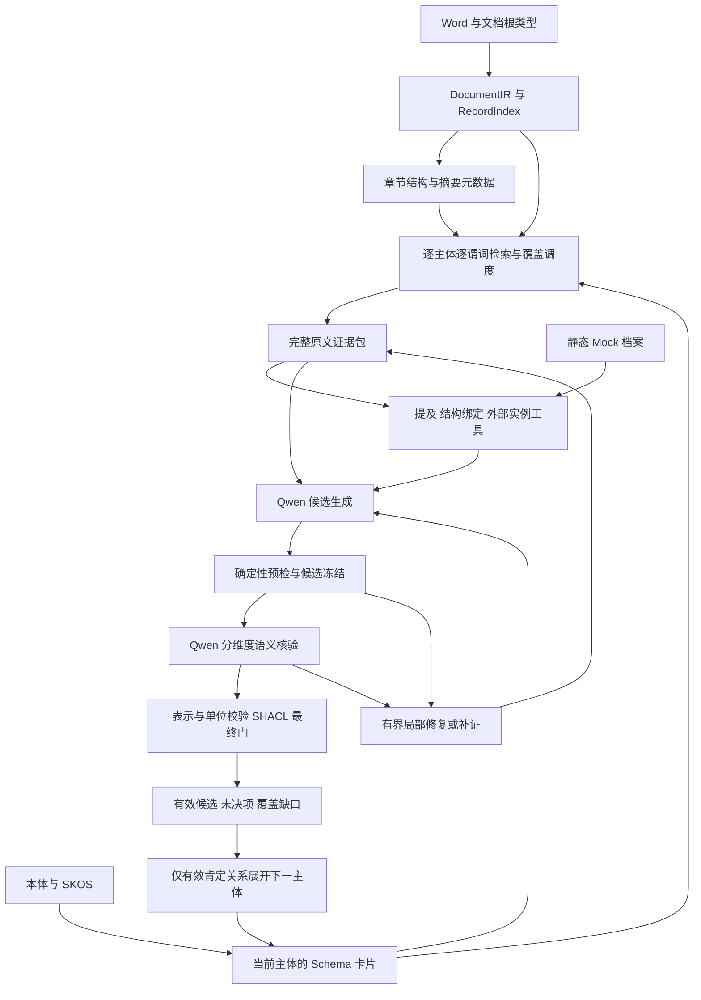

# 文档抽取引擎 2.0 设计方案

日期：2026-09-16。状态：设计提案，尚未实施或进行新版模型评测。“2.0”是本方案名称，不代表已发布的 API 或软件版本。

本方案依据 CMCReport 的 Qwen、GLiNER2.5/SKOS、摘要检索和 Mock 三组实测，细化既有[本体指引基础方案](基于本体指引的文档结构和摘要元数据的关系图谱识别方案.md)与[语义精排方案](支持语义相似度精排的关系图谱识别精度提升方案.md)。继续复用共享识别核心、文档分析运行和现有存储，不建立第二套抽取平台。本次只交付设计文档；历史文档中的部署、清理和迁移安排不作为本次工作内容。

## 1. 核心决策

采用以下主流程：

**文档结构与摘要定位 → 本体 Schema 卡片限定任务 → 原文提及与记录主体识别 → 属性/关系候选 → 确定性检查 → Qwen 分维度核验 → 有限修复或补证 → 最终门控与结果输出。**

设计重点是同时减少错误事实和可恢复的漏抽：

1. 以“当前主体—当前谓词—完整记录”为工作单位，复用全文索引；单次模型输入只包含该任务需要的卡片、原文和工具结果。
2. 区分物理提及、记录表达的局部对象、文档内共指、外部身份和关系证明。名称、编号、表格邻接与档案命中均不能跳过这些判断。
3. 工具检查失败后，依据明确错误码决定局部修复、原文补证或保留未决；不得仅通过增加拒绝提高表面精确率。
4. Qwen 负责类型、角色、归属、关系及条件的语义判断；deterministic engine 负责坐标、结构、标识、值表示、单位换算和 SHACL 校验。最终接纳权在服务端控制器。
5. GLiNER2.5 是提及建议工具；Mock 是实例候选和外部字段工具；摘要和精排只负责定位。三者均不能直接证明文档事实。
6. 将实体、属性、关系的 P/R/F1 与检索覆盖、技术完成度、数值校准、调用成本分别验收。现有报告属于开发回归样本，另设未参与调参的保留文档。

首个实施切片仍为 `CMCReport — usesEquipment → ProcessEquipment`，验证通过后再扩展到既有本体中的计划、工艺、存放、产品/API 及数值属性。总体流程支持这些对象，但设备实测结果不能证明其他领域已通过。

## 2. 实测依据与设计响应

固定报告为 `upload-23c872fb-3ab1-41de-a705-dd4b162dfa09`，使用同一 Word、447 个 IR 单元、329 张卡片和同源摘要。以下是实际结果与拟采用措施的对应关系，不把拟议收益写成已验证能力。

| 已验证事实或问题 | 对新版设计的约束 |
|---|---|
| E0/E1/E2 共 18 次真实 Qwen 请求，9/9 case 完成，18/18 原始 JSON Schema 通过 | 继续采用紧凑结构化协议；结构合规单独验收，不代替语义质量 |
| E1 正确关联 CT64610、RE64611；未知 DE64603 保留，没有替换为同名 DE64203 | 保留按需 Mock 查询、精确编号和版本核验；未知外部身份不阻断文档局部实体 |
| E1 比同源 E0 多约 34.3% tokens，未证明最终质量提升 | 精简外部候选及字段；工具价值按质量与实际成本衡量 |
| E1 “干燥”引用错误，被机械门拦截；原文有可用证据 | 增加同记录、同归属范围内的唯一引用修复，修复后重新核验 |
| E2 两个 PF 锚点混入 RE64611；另一次把两个 PF 编号合为一个实体 | 提供独立编号跨度和名称—编号对应候选；备选实体与关系组分别表示 |
| E2 检索编号覆盖 4/6，但最终仅保留本组选中编号的 2/4 | 优化有效记录覆盖和实体绑定；不以编号密度直接提高关系可信度 |
| E2 清洗 `r1` 被程序接纳，独立复核仍未决 | 明确关系所需角色和适用语境，按缺口补查需求/用途证据；不能把此项先验记为确定 FP |
| C 组将物料名作为计划/存放条件主体，产品/API 层级也有缺证 | 主体先独立验证；允许有字段组证据的无名称记录对象，禁止用物料名替代对象角色 |
| C 组 GLiNER 多标签、表头和单位错标；更多 span 未证明质量改善 | NER 输出保留类型和角色假设，单独评估；单位识别以原文及受控单位表核验 |
| D 组摘要启用/屏蔽后的实际模型输入相同；输入膨胀，完整核验 0/8 | 摘要收益必须消融证明；检查整个请求体积，完整记录分批，避免工具信息重复 |
| C 组批量区间端点因通用标量门阻断；数值 SHACL 0/3 | 新增有明确端点语义的数量表示与单位归属，不从区间任意截取数字 |
| E 组仅验证文本属性，真实数值换算未评估 | 数值/单位引擎继续纳入架构，但需要单独的真实正例和反例验证 |

依据：[工具实验](调研/cmc-qwen-tool-assisted-validation-20260916/results/README.md)、[GLiNER2.5/SKOS 实测](调研/cmc-gliner2-skos-validation-20260916/results-2.5/README.md)、[摘要检索实测](调研/cmc-summary-retrieval-validation-20260916/README.md)、[Mock 三组实测](调研/cmc-mock-entity-validation-20260916/README.md)。

## 3. 输入、输出及事实边界

### 3.1 输入

| 输入 | 用途 | 权限边界 |
|---|---|---|
| 用户指定的文档根类与任务范围 | 确定根主体及待抽取谓词 | 不从一次词项命中擅自改变根类型 |
| Word 与 DocumentIR | 原文、位置、逻辑行列、合并单元格、标题和注释 | 文档事实的直接来源；解析器的 header 标记仍需核对 |
| 本体快照、Schema 卡片 | 合法类型、谓词、定义、range、datatype、已有约束 | 不从候选反推修改 T-Box；多值 range 不自动解释为 union |
| MetadataSnapshot | 章节树、摘要及来源状态 | 只用于检索；摘要不成为事实引用 |
| SKOS 与实验词表 | 类型/属性别名、描述、单位词项 | 人工补充标明来源；不写入报告具体值或评测参考 |
| 已配置的外部实例源 | 名称/编号候选及外部元数据 | 分开系统、数据集、记录键、版本与字段；不证明报告关系 |
| 运行预算 | 请求、输入输出、完整记录与补证限额 | 所有模型请求计入同一预算，失败也不返还调用额度 |

首期外部源只接已经验证的静态 `mock_equipment/equipment_archive`。数据库 Mock、排期或其他系统需另有明确接入需求；不将同名来源视为自动同步。

### 3.2 输出

输出包含局部实体、文档属性、条件化关系组、独立外部链接/字段、原文观察和覆盖缺口，并保留可定位的原文引用。

“系统校验通过”与“业务事实提交”分开。模型、工具和本引擎的输出均不能自动完成业务确认。图上关系是否可展开，使用既有 ProofGate/EligibilityPolicy；无关系证明的局部实体可保留为待补证对象，不补造连接边。

质量按三个轴解释，并映射既有状态，避免再建一套运行状态机：

- 执行是否完成：完成、失败或尚未执行；暂停沿用现有运行状态。
- 语义是否成立：supported、unsupported、undetermined、not_checked。
- 机械/表示检查是否完成：passed、failed、not_evaluated/incomplete。

`unresolved` 是缺证或未完成验证；`rejected` 不等于原文否定事实。明确“不使用设备”的原文可以支持一条带 negated 极性的声明。检索未命中、N/A、unknown 和数值零不可互换。

## 4. 总体架构



这些是同一后端内的职责边界，不新增微服务或通用 Agent 框架。控制器可以根据 Qwen 返回的缺口调用白名单工具；Qwen 不能自行扩大文档范围、改预算、授予证据权限、指定任意数据源或写入事实。

### 4.1 正常路径

1. 校验文档、IR、摘要与本体身份，建立当前根主体；保留摘要部分完成/回退状态。
2. 编译当前主体直接谓词的 Schema 卡片，分别构造查询；同一谓词不因多个类菜单重复出现而重复加权。
3. 检索并组装完整记录，提供必需表头、单位、注释、父上下文和竞争归属。源记录与补充上下文角色分开。
4. 运行结构绑定、编号扫描、GLiNER2.5；有外部匹配需求时查询精简 Mock 候选。
5. Qwen 输出实体解释和属性/关系候选。每条候选独立检查；一个无效主体只影响其依赖项。
6. 机械检查完成后冻结候选。Qwen 对固定候选 ID、内容和证据包进行分维度核验，不在核验返回中改写候选。
7. 对满足前置条件的属性执行规范化/SHACL，验证关系组和依赖，派生 accepted/unresolved/rejected。
8. 仅对明确缺口调度修复/补证；没有新证据、额度耗尽或技术失败时保留真实状态，继续其他任务。

候选生成和核验是不同请求，仍使用项目 Qwen；这提供协议隔离，不构成独立模型共识，也不能消除同模型的共同偏差。独立原文评审用于评测。

任务以一个主谓词限定调用目的。设备首期可将目标设备的编号、名称、规格作为卡片允许的最小字段同包提出，每条仍是独立核验目标，预算按整包计；其他属性及下一跳使用新任务，不能把所有对象字段重新聚合为一次无限制抽取。

## 5. Schema 卡片与声明契约

### 5.1 卡片内容

卡片以现有 `compile_local_menu`、SlotSpec/EdgeSpec 为依据，按任务裁选，不把整份本体放进每个请求。需要表达：

| 内容 | 规则 |
|---|---|
| 主体解释 | 当前实体 ID、类型假设、已核验提及、适用范围；假设与已证实字段分开 |
| 谓词 | 完整 IRI、定义、直接声明来源、合法目标/值类型、已有基数约束 |
| 角色证据要求 | 必需的主体角色、字段角色、关系桥接、条件与否定检查；来自抽取策略，不冒称新增本体公理 |
| 属性表示 | 字符串/日期/数量；数量允许 scalar、interval 或某一端点时必须显式声明 |
| 身份要求 | 字段是名称、实例编号还是记录编号；局部识别与外部链接的要求不同 |
| 证明方式 | 沿用显式叙述、所属字段组、角色表格、已解析指代等既有 proof menu |

`usesEquipment` 当前定义表达报告/步骤所需设备，不能自动升级为某次生产实际执行事实。清洗文字可能提供设备提及或辅助证据，但必须另证其与当前主体、谓词的对应。

### 5.2 主体表示

实体可以由明确名称/编号提及，也可以由原文记录或字段组表达。后者适用于没有专名的计划、存放条件、试验记录：必须定位表示该对象的字段组并核验角色与 owner，不能拿“物料名称”单元格替代对象主体。

通用无名称记录主体是待扩展能力：现有字段组主要提供上下文和归属依据，部分特例已有多来源对象，但不等于计划/存放等类型已能按统一规则建立主体。实施须定义组成来源、角色及稳定局部身份。

同一类允许多个实例，禁止在新协议中按“每类一个预设槽位”强制填充；这不是对现有在线执行器实例数量的限制描述。缺少对象证据时保留未绑定属性线索，不制造实体。产品/API/物料、试验行/共享药名分别处理。

### 5.3 最小声明模型

| 对象 | 必需信息 |
|---|---|
| EvidenceRef | 文档/IR 身份、稳定 evidence_id、原文区间、逐字 quote、记录与来源角色 |
| EntityHypothesis | 局部 ID、类型、提及/记录锚点、独立身份锚点及编号引用（可空）、主体角色证据 |
| PropertyClaim | 候选 ID、主体、合法谓词、完整 raw、值/字段/单位引用、限定条件 |
| RelationClaim | 候选 ID、主体、谓词、对象集合、selection、桥接证据、极性、条件/适用范围 |
| ExternalLink | system、dataset、record_key、record_version、原文对应证据、identity scope |
| Verification | 固定目标及证据身份、逐维度 verdict/support、missing_facets；不含改写后的声明 |

提示中可使用短引用别名，但每个别名只在当前证据包有效，服务端映射到稳定坐标。补证后不能复用旧 `uN` 的含义。后续引用优先由模型选择可定位 span，服务端回填原文；仍允许 Qwen 指出 NER 未发现的真实原文跨度。

结构约束使用白名单 IRI/工具名、拒绝额外字段、限制数组长度并逐字回放。候选变化后旧核验失效；相同候选只补充证据，也必须基于新证据包重新核验受影响维度。

### 5.4 备选设备的候选表示示例

下面是**目标契约示意，不是新版真实返回**。`row.name`、`row.ids`、`row.purpose` 代表服务端已定位的原文引用，实际实现须附稳定坐标。两台设备共享类型名称不表示同一实例。

```json
{
  "entities": [
    {
      "id": "e_pf_1",
      "class_iri": "https://ontology.pharma-gmp.cn/slpra/equipment/ProcessEquipment",
      "anchor": {"ref": "row.name", "quote": "钛棒过滤器"},
      "equipment_id": {"ref": "row.ids", "quote": "PF64216"}
    },
    {
      "id": "e_pf_2",
      "class_iri": "https://ontology.pharma-gmp.cn/slpra/equipment/ProcessEquipment",
      "anchor": {"ref": "row.name", "quote": "钛棒过滤器"},
      "equipment_id": {"ref": "row.ids", "quote": "PF64616"}
    }
  ],
  "relations": [
    {
      "id": "r_filter_choice",
      "subject_id": "document",
      "predicate_iri": "https://ontology.pharma-gmp.cn/slpra/drug-development/usesEquipment",
      "object_ids": ["e_pf_1", "e_pf_2"],
      "selection": "one_of",
      "selection_support": [{"ref": "row.ids", "quote": "PF64216或PF64616"}],
      "bridge_kind": "role_mapped_table",
      "bridge_support_refs": ["row.name", "row.ids", "row.purpose"],
      "polarity": "affirmed",
      "condition_support": []
    }
  ]
}
```

`one_of` 是声明的选择语义，不新增本体谓词。至少两个不同、已定位对象，备选范围必须有原文支持；`all` 同样需要原文证明所有对象均适用；不确定时 `undetermined`。空条件数组仅表示没有提出额外条件，核验仍须检查原文是否遗漏条件。图投影应展示备选组，不能导出两条无条件同时使用边。

该组表达原文中的备选要求，不推断实际选择了哪台或实际投入台数。备选目标的属性可以分别核验，但后续任务必须保留选择组及其条件，不能把每个备选都作为已实际使用设备继续扩展。

示例中的 `row.name` 是共享名称证据，两个编号跨度才区分两个局部对象；须逐一证明名称与编号的对应。当前线上根据物理端点锚点生成实体 ID，直接复用同一名称锚点会发生身份合并。因此新版还需扩展局部身份构造，使用各自独立编号跨度及已核验的对应关系；仅增加 `object_ids/selection` 字段不足以实现该例。生成的局部 ID 不自行赋予全局唯一身份。

## 6. 检索与证据包

### 6.1 查询与排序

复用 `SubjectSlotQuery`、RecordIndex、现有摘要检索及已实现的排序模块，保留三个来源：本体/词表查询、文档结构/摘要线索、文档提及对应的实例线索。Mock 查询不能以整个档案的存在替代文档提及。

首期新增比较项是“任务相关性与覆盖调度”，不直接采用 E2 的编号累计加权作为默认策略：

- 对设备需求查询，需求表、用途字段和相关工艺记录优先；清洗记录仍保留，可用于提及与补证，不做章节名称硬排除。
- 对同一需求/同一物理记录去重，防止菜单重复谓词和同名档案重复加分。
- 分配不同完整记录的读取机会，减少同一设备反复占用全部预算；不同条件或阶段的记录不得因同编号被误去重。
- 文档未知编号与档案已知编号都可入选。未定位到编号的设备也不能被过滤掉。
- 语义精排是排序能力；本轮 E 实验未使用它，其收益需要单独消融，不能与局部修复效果混为一谈。

不在此方案中凭单篇报告确定融合权重。使用开发集选择策略，在独立测试集冻结，不按参考编号或原文位置名单回补。

### 6.2 原文完整性与预算

一次任务保留完整逻辑记录及必要表头、单位、注释、范围限定、已知反证和竞争 owner。超预算时按已有合法记录边界分批；无法保持所需语义单元时标记 deferred，不切掉否定或单位来适配模型。

同时检查 messages、Schema、工具返回和预留输出所占空间。沿用 E 组紧凑输入作为起点；60,000 字符门和 8,192 输出 tokens 是已运行的实验设置，不能当作所有任务的模型上下文保证。新版还需按实际服务能力预检完整请求。

摘要有助于定位才计收益；若启用/屏蔽后的模型输入相同，应如实报告无可测增益。历史摘要成本与新抽取成本分开。

### 6.3 补证

补证必须对应 `missing_facets`，例如 `subject_role`、`identifier_owner`、`predicate_bridge`、`condition_scope`、`unit_binding`。查询只来自当前原文提及、本体定义和明确假设；假设作为检索词不升级为事实。

清洗记录可据原文编号找到设备需求行，但跨记录链接须核对主体和适用范围。补证包保留原缺口、原始证据及新证据，不能只选择有利句子。相同内容重新排序不是新证据；无新增可定位来源时不重复问模型。

## 7. 工具分工

以下是内部能力契约，不要求新增公开 API 或外部工具服务器。

| 工具能力 | 输入 → 输出 | 已有基础/待补齐 |
|---|---|---|
| Schema 卡片 | 本体、当前主体/谓词 → 合法菜单和约束 | 复用 `compile_local_menu`、`get_schema_card`；补充角色/数量表示策略 |
| 原文读取与回放 | 已授权记录/引用 → 原文、结构与坐标 | 复用 `inspect_evidence`、`resolve_source_anchor` |
| 提及建议 | 原文与本体/SKOS 标签 → span、类型/角色候选 | 复用 GLiNER2.5 与 `propose_mentions`，不赋事实概率 |
| 结构绑定检查 | 主体、字段、值、单位 → 归属候选及错误码 | 复用 field bindings 与 `check_claim_binding`；补足同单元多实体对应 |
| 实例查询/链接 | 原文提及、来源范围 → 候选记录、版本、身份核验 | 复用 `FrozenEquipmentCatalog.search/validate_link`；减小模型视图 |
| 原文补证 | 冻结候选及缺失维度 → 新原文证据/无新证据 | 复用 EvidenceWorkQueue；改进任务相关性及反证覆盖 |
| 局部修复 | 原候选、错误码、授权原文 → 有限修复提案 | 复用 EvidenceRepairAdapter；新增引用/锚点/备选专项规则 |
| 指标校准 | 冻结属性、值和单位归属、可信核验 → 规范化值及检查结果 | 复用 `validate_metric`；扩展区间端点契约 |
| SHACL | 指定表示图、固定 shapes、预期 focus → 原生报告和覆盖 | 复用 `validate_graph`；有前置条件才执行 |

工具返回必须区分执行失败、正常无命中和已完成的检查结论。控制器绑定任务身份；Qwen 不得通过传入 `semantic_status="supported"` 自行绕过核验。可选 NER 未启用是明确运行配置；如果实验声明必须使用 GLiNER2.5，加载失败不能记作正常零命中。

### 7.1 GLiNER2.5 与词表

标签来源保持“本体概念/属性 + SKOS 别名 + 明示人工补充”，不从报告或 Mock 实例名称生成类别。按当前任务选取少量相关标签；实体、字段标题、值和单位角色分别保留，减少把表头当值的机会。

精确编号扫描和 NER 结果互补，Qwen 仍可提出其他原文跨度。不能把 NER 漏报变成强模型不可见。不同标签落在同一物理跨度时合并展示候选标签，不当作多个独立实体。

2.5 无固定 max_width 不表示实际窗口、候选池和输入预算无限制。本轮 48 条模型视图上限未丢失 span，故单纯调大该上限不是已知问题的针对性修复。

### 7.2 Mock 和外部元数据

先精确编号查询，再在需要时提供少量名称歧义候选。Qwen 只看到与当前身份/字段任务相关的返回，完整记录仍可按现有工具读取。没有找到外部记录时保留局部实体，不能改写编号求匹配。

外部链接失败只阻断链接及其依赖的外部字段，不自动否定有原文证明的局部实体。原文中的编号归属错误则影响该实体解释及其依赖声明；两种失败不可混用。

“不锈钢衬HALAR”与“316L不锈钢”保存为各自来源的值差异，不能仅凭字符串不同认定矛盾或覆盖。没有声明的字段映射只作元数据，不临时扩展本体属性。

## 8. 修复、补证与调用上限

沿用现有修复任务与候选 lineage，不叠加新的自治循环。修复是一项有原因、有范围、有额度的处理：

授权范围由服务端冻结任务、原始记录和已有归属证据决定，不能相信待修复候选自报的 owner。归属未成立、有竞争对象或多处匹配时转入重提/补证。引用解析器继续只做精确校验，修复策略单独产生新定位提案，不能让 `resolve_source_anchor()` 静默换 ref。

| 缺口 | 允许动作 | 禁止动作 |
|---|---|---|
| quote 与 ref 不符 | 在同一授权记录及同一 owner/字段范围内找唯一逐字对应；生成新定位并重验 | 全文取最近同名词、相似改写、改 raw 值凑引用 |
| 锚点包含竞争编号 | 提供独立原文跨度与对应候选，重提实体解释 | 单靠删掉冲突文本就宣告归属成立 |
| 多编号合并 | 基于原文连接词提出独立实体和 selection 组，核验名称对应 | 把一个编号串视为全局 ID、自动展开成 all |
| 缺少角色/桥接/条件 | 补查需求、用途、指代或适用范围证据，再核验 | 用 Mock、摘要、同表共现补足语义 |
| 数量/单位不完整 | 补充原表头/注释、保留完整数量表达；按卡片重提 | 猜单位、取区间中点、删比较符 |
| 技术失败/截断 | 标记未完成，按既有运行契约暂停或结束该任务 | 在质量实验中悄悄重复请求直到成功 |

首轮验证采用每个任务至多一个恢复周期，复用现有重提/补证能力但共享总额度：

- 正常路径：候选 1 次 + 核验 1 次。
- 候选不变、仅补充证据：最多再核验 1 次。
- 候选发生语义变化：最多重提 1 次 + 新候选核验 1 次。
- 同时需要补证和重提：先一次补证，再重提/核验；不能再嵌套新的恢复周期。单任务最多 4 次 Qwen。

补证后已消耗第三次核验的分支即结束本轮恢复，不能再追加“重提 + 核验”变成五次。若需要重提，应在恢复周期选择时确定；当前队列允许不同修复种类各自计数，新协议必须额外施加共享的 lineage 总上限。

上述两阶段常规调用是新版紧凑协议的目标，不代表现有所有在线谓词都只调用两次。额外类型竞争、身份核验或工具规划若调用 Qwen，也计入同一上限；不能以子任务名义规避预算，不能因额度不足跳过必要核验后接纳。

纯定位修复可以零模型完成提案，但受影响声明必须重新核验。尚未通过的实体/属性/关系不因“已修复”状态自动接纳。调度前预留完成核验所需额度，避免生成大量无预算验证的候选；额度不足则保留未执行范围。

同一补证包中已知竞争信息必须随之带入；被明确反证的原声明不重新包装为 supported。提出内容不同的新声明时，旧内容的结论不能被覆盖为它的结论。

## 9. Deterministic engine：指标、单位与 SHACL

### 9.1 职责

将**原文定位、结构归属约束、数量解析、单位受控映射、量纲检查、精确换算与 SHACL 表示校验**纳入确定性引擎，并封装为上述内部工具。关系角色、PDE/毒性专业含义和主体层级由语义核验负责；确定性引擎不推断这些语义。

预检查可返回解析候选和问题，但正式规范化结果要求可信调用方确认当前候选的类型/谓词/归属/单位语义已支持。工具独自返回通过不能成为业务事实。

### 9.2 数量契约

数量保留完整原文及限定，可表示：标量、区间、上/下界及明确缺失状态。单位必须绑定到同一值及 owner，可来自原单元格、合法列头或注释；外部档案的单位不能静默替代文档单位。

明确的无量纲指标、纯计数或顺序按卡片处理，可以没有物理单位；不能将“原文漏单位”与“该量无需单位”混为一谈。

`3.8–6.6 kg` 如映射到允许端点的最小/最大批量槽位，可分别生成端点值，但两者都保留完整区间来源、endpoint role 和 kg 绑定。普通标量槽位不得任取 3.8 或 6.6。“不超过25℃”保留比较符，不能变成“等于25℃”。

“200L”若处于 `modelSpecification` 字符串槽位，就保持规格文本；不能因字符串含单位而自动生成容量属性。`24M` 也只有在日期/时长语义确认后才可按相应规则解释。

单位转换仅在受控表支持且量纲一致时执行，保留源值/源单位、目标单位和转换参数。使用精确数值表示；比较符、区间边界和精度不得因规范化丢失。未知单位、缺少实验条件的复合量或需要业务假设的换算留作未决。

没有既定舍入政策时不得近似凑值；单位别名统一和恒等映射不能计为尺度/偏移换算成功。

### 9.3 SHACL 的位置

先通过引用与必要语义/单位前置条件，再构建声明表示图，按固定 profile 校验：合法谓词、datatype、必需表示字段和已声明的表示约束。预期 focus 非空、实际 focus 集合与预期一致、执行完成且 conforms，才计为完成的表示验证。

区分 `not_run`、执行失败、约束不合格和通过；0 个数值候选的通过率为不适用，不能记 100%。文本 SHACL、数值表示 SHACL、真实单位换算分别统计。

shapes 仅使用本地固定内容，不根据模型结果临时放宽约束。不把业务限值违反当作抽取值错误并改值；需要的业务规则判定继续由既有推理域承担。完整业务图 SHACL 不是本轮文本表示 profile 已具备的能力。

## 10. 接入现有代码与状态

| 现有位置 | 复用方式与拟修改范围 |
|---|---|
| [ontology_plan.py](../backend/app/services/extraction/ontology_guided/ontology_plan.py)、[contracts.py](../backend/app/services/extraction/ontology_guided/contracts.py) | 复用本体快照、局部菜单和领域对象；按需增加备选组/数量表示字段 |
| [records.py](../backend/app/services/extraction/ontology_guided/records.py)、[context.py](../backend/app/services/extraction/ontology_guided/context.py)、[retrieval_query.py](../backend/app/services/extraction/ontology_guided/retrieval_query.py) | 保留记录和证据权限；扩展任务相关性、覆盖及缺口查询 |
| [source_citations.py](../backend/app/services/extraction/ontology_guided/source_citations.py)、[field_bindings.py](../backend/app/services/extraction/ontology_guided/field_bindings.py) | 复用坐标回放和局部归属；增补可修复错引用与多设备锚点规则 |
| [repair_adapter.py](../backend/app/services/extraction/ontology_guided/repair_adapter.py)、[evidence_work.py](../backend/app/services/extraction/ontology_guided/evidence_work.py) | 接入工具结果、冻结候选、逐维度核验和共享恢复预算；改进当前补证词项策略 |
| [verification.py](../backend/app/services/extraction/ontology_guided/verification.py)、[resolution.py](../backend/app/services/extraction/ontology_guided/resolution.py) | 复用 ProofGate、身份与可展开性；增加备选组和外部字段的依赖检查 |
| [tool_validation](../backend/app/services/extraction/tool_validation)、[gliner2_extractor.py](../backend/app/services/extraction/gliner2_extractor.py) | 复用实验已运行的证据、词表、NER、Mock、metric、SHACL 核心；适配统一领域契约 |
| [document_analysis](../backend/app/services/document_analysis)、[current_work.py](../backend/app/services/extraction/ontology_guided/current_work.py) | 继续使用当前运行、任务、覆盖和展示投影，不创建第二份权威状态 |
| [evaluation](../backend/app/evaluation/README.md) | 冻结输入、消融和独立评分；只调用共享核心，在线代码不得导入 evaluation |

当前评测 runner 的 E 协议不等于线上完整执行器已接入 GLiNER2.5/Mock/SHACL；后续应将必要契约与薄适配放入共享核心，保留 runner 只做评测编排。不能通过在线导入 `schema_card_mock_*` 完成接入。

当前在线 `RelationshipAssertion` 使用单个 `object_quote`，没有完整的 `one_of` 契约；备选组是 E 实验具备、共享执行器尚需接入的能力。实施时必须一起核对领域声明、核验、投影、序列化及实际消费方，避免在某层被降成多条普通边。现有 `condition_support` 也已禁止把普通名称当条件，不能原样导入 E 实验中岗位/产品名称的 condition 写法。

最小改动集中为三部分：扩展现有候选与证明协议、扩展现有补证/修复策略、增加工具薄适配。人工拒绝属性后的 `DocumentPropertyReviewService.create_repair()` 属于现有人工审阅流程，不作为自动关系补证入口。

运行继续遵循“一个当前恢复入口、一份权威工作状态、一份最新展示缓存，精排结果和调用账本独立保存”。本设计不引入历史回放、额外 checkpoint 树、容灾服务或新审核平台；也不删除现有数据。暂停后继续加载当前状态，已核验且依赖未变的工作不重复执行。

只复用本次依赖匹配的工具结果。冻结的原文/IR、本体/菜单/词表、模型/参数或外部源版本改变时，沿用当前 `FingerprintMismatch` 等不兼容恢复处理，停止沿旧指纹继续；需要重新识别时创建新运行，不能自动在原运行混用新版依赖。相同冻结依赖内的合法补证和候选变化，只使受影响的核验失效，不能复用旧内容的 supported。

## 11. 验证方案与 F1 验收

### 11.1 参考与评分单位

指定 CMC 报告用于开发回归，现有助手参考不能直接充当完整专家金标。实施前补齐独立原文标注，覆盖正例、否定、条件、未知、无外部记录、多设备同名及备选组；评审者不以模型自评作为真值。

| 指标 | 匹配口径 |
|---|---|
| 提及 | 原文跨度与类型/角色；精确跨度与允许重叠口径分开 |
| 局部实体 | 类型、原文锚点/记录角色、实体划分；独立评价过合并与过拆分 |
| 外部身份 | 正确实例来源、记录键、身份适用域；无匹配样本的错误链接单列 |
| 属性事实 | 主体、谓词、值及完整限定、有效证据；归属错误不能因值相同记 TP |
| 关系事实 | 主体、谓词、对象集合、selection、方向、极性、条件和有效证明 |
| 数值 | 指标/主体、数量形态、比较符/端点、量纲、规范化值；容差在评分前按属性冻结 |

`one_of {A,B}` 按一个带选择语义的关系组计分，对象顺序不影响匹配。预测 `all {A,B}` 或两个无条件单边不算命中该组；部分正确对象可另报诊断指标，不能替代严格关系 F1。

当参考只有该备选组时，预测两个无条件单边计 2 FP、1 FN；预测一个 `all {A,B}` 计 1 FP、1 FN。

跨记录重复只有在已证明的主体身份、谓词、值及完整限定（属性）或对象集合与 selection（关系），以及极性、条件、适用范围都相同时才在事实层去重，多个物理提及仍保留。不同值、不同对象组、不同工艺阶段/条件的事实不能按相同编号合并；来源之间的矛盾也不能被去重抹掉。重复输出不重复增加 TP，重复率另报。

### 11.2 未决与技术缺测

P、R、F1 根据固定参考的 TP/FP/FN 计算；实体、属性、关系分别报告 micro-F1。实体按类型/角色、属性与关系按各自谓词报告宏平均，避免大量简单字段掩盖关系缺口。观察项不计事实 TP。

统计类别集合与无正例类别的处理在评分前冻结；零分母明确标记不适用，不记为满分。系统未决按弃答处理，本身不计 FP，但对应已裁决正例未交付时仍计 FN。

原文应有而检索未执行、候选未生成、验证失败未交付的事实，在端到端召回中仍计漏交付；技术原因另列。可另报“完成范围条件下的质量”，但不能删除失败范围后称为端到端 F1。

系统未决不是负事实。参考本身未决时，先独立裁决；未能裁决的样本数量和影响必须单列，不能算 TP，也不能直接当确定 FP。允许报告明确标注的已裁决子集指标或上下界，不把其冒称全量 F1。

### 11.3 分步实验

固定 Qwen、GLiNER2.5、词表、文档与本体，依次比较：

| 组 | 变化 | 要回答的问题 |
|---|---|---|
| F0 | 当前协议基线，保留无 Mock/有 Mock 的必要对照 | 当前可重复的端到端 P/R/F1 与成本是多少 |
| F1 | F0 + 引用/锚点/备选局部修复 | 找回多少正确事实，增加多少误修 |
| F2 | F1 + 关系角色补证与分维度门 | 是否减少证据不足的接纳，同时避免仅靠拒绝提高 P |
| F3 | F2 + 任务相关性与覆盖调度 | 在相同总预算内是否提高最终召回和 F1 |
| F4 | 单独的数值切片，接数量/单位/SHACL | 是否真实完成端点、量纲及转换的正确路径 |

F0–F2 固定相同主记录，隔离抽取/核验变化，未用完的恢复额度不能转为读取其他主记录。F2 可以补充这些任务所需的证明，但不在补证上下文另开事实发现任务；新增补证记录、tokens 和请求单列。F3 才允许主记录变化、将剩余额度用于后续记录，并采用相同总调用/输入输出预算，分别统计已读记录覆盖与最终事实召回。扩大预算的效果另作曲线，不归因于算法。

设备开发切片建议各臂最多 12 次 Qwen：以文档根的 `usesEquipment` 在前三条记录形成三项主谓词任务，按第 4.1 节同包协议携带设备最小字段，常规候选/核验最多 6 次；其余最多 6 次用于恢复，仅 F3 可按上段规则另用于后续主记录。该切片不启动其他属性/关系的递归任务。后续共享引擎若按字段单独展开，新增任务与请求必须计入预算，不能沿用“三条记录等于六次调用”的假设。各臂相同总上限和单任务 4 次上限，不能把恢复调用藏在工具耗时内；实际消耗不同须报告。这是新实验建议，执行前在协议中冻结，不能重算或替换旧 E 组 18 次结果。

新保留集按报告/模板来源划分，避免同报告片段跨训练、调参和测试。对相同文档做成对比较，样本足够时按文档重采样估计差值区间；单文档不能支持稳定泛化收益结论。只有未达到预先定义的统计把握时，结论为收益待证，不反复调参直至过线。

### 11.4 必过回归与推进条件

| 场景 | 预期行为 |
|---|---|
| 干燥引用错指表头 | 仅在合法范围唯一匹配时恢复；不能静默换原值 |
| PF 双编号与混合锚点 | 两个独立实体、正确名称对应、一个 one_of 组；不合并、不展开同时使用 |
| 仅有清洗对象证据 | 补证或未决，不因档案匹配直接接受需求/使用关系 |
| DE64603 档案缺失 | 保留有原文支持的局部设备，外链为空，不替换成同名设备 |
| 药名位于 owner 列 | 不把它直接当成计划、存放条件或全局唯一产品身份 |
| 不锈钢衬HALAR / 316L | 分来源保留差异，不能自动覆写或判定严格矛盾 |
| 3.8–6.6 kg / 不超过25℃ | 数量形态和限定完整；端点仅按明确卡片角色映射 |
| 未知、N/A、零、否 | 状态区分；无释义的 N/A 保留原文歧义 |
| 缺包、调用失败、截断、预算不足 | 明确未完成/未执行，不返回“抽取成功且无事实” |

推进条件：工程边界与结构协议通过；已标注必留正例不因新门禁丢失，反例不误接纳；真实数值切片有非零有效覆盖；独立测试显示关系 F1 改善且属性/身份无实质回退，并同时报告 P、R、未决率和成本。具体业务质量目标应由完成标注后的验收规范固定，本方案不虚设已达到的数值门槛。

## 12. 分期交付

1. **契约与基线**：将本设计中要实施的切片写入对应 spec/plan/tasks，固定声明/备选/数量契约、标注口径和预算。工程 tests 与真实质量评测分别记录。
2. **设备闭环**：接入已验证工具，完成局部引用修复、多设备绑定、one_of、角色补证和新预算控制；运行 F0–F3，先解决 E 组已知损失。
3. **主体与数值扩展**：覆盖计划/存放记录主体、产品/API 归属、区间端点及单位；完成 F4 的真实成功与失败路径，不把设备通过外推到这些对象。
4. **共享引擎集成验收**：沿用既有文档分析入口、暂停继续和投影，验证新声明契约的实际调用方。与既有本体指引多跳路径联合验收后，再依据结果确定线上切换范围。

每一期只新增直接对应上述缺口的能力；不预建通用多源融合平台、不训练新模型、不新增历史回放或维护系统。历史实验制品保持冻结，新实验使用新目录和明确版本。
