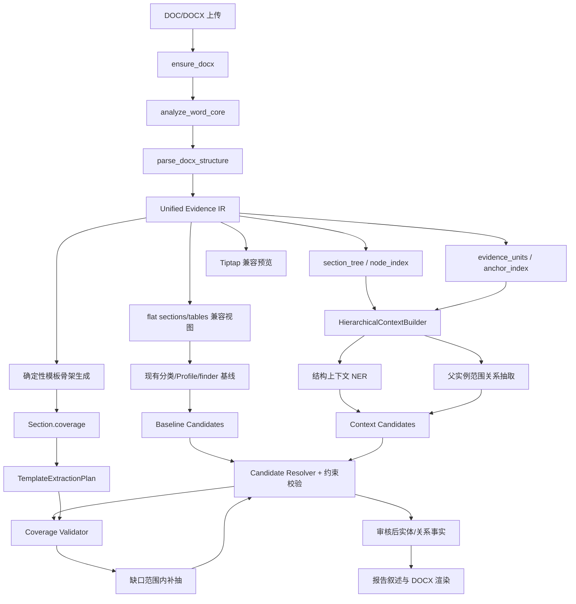

# 文档结构解析能力增强报告模板的关系图谱识别和 NER 能力

> 状态：详细设计，待评审实施  
> 日期：2026-09-05  
> 适用范围：Word 文档分析、AST 报告模板、NER、Document Profile、关系图谱抽取、覆盖校验与报告生成  
> 术语约定：本文使用 IR 作为 Intermediate Representation（中间表示）的缩写

---

## 1. 执行摘要

本方案不新建一套与现有 Word 解析并行的解析器，而是把已经存在的 `DocStructure`、`section_tree`、有序 `blocks`、表格结构、分页信息和稳定来源坐标扩展为统一证据 IR（Unified Evidence IR），并让以下能力共同消费同一份结构事实：

1. 文档分析页面的章节树和忠实预览。
2. 报告模板样例的确定性骨架生成、插槽定位和模板版本管理。
3. NER 的实体定界、实体类型判定和属性值抽取。
4. Document Profile、规则 finder 和多跳关系图谱抽取。
5. 模板覆盖缺口计算、定向补抽和报告事实追溯。

目标架构为：

```text
Word 文件
  │
  ▼
analyze_word_core：确定性结构解析唯一入口
  │
  ▼
Unified Evidence IR
  ├── DocumentIR / SectionNodeIR：文档树和父子层次
  ├── EvidenceUnit：段落、表格行、单元格等可定位证据
  ├── EvidenceAnchor：文件、块、表格、页码和字符坐标
  ├── HierarchicalContextEnvelope：当前节点 + 父链 + 树元数据
  └── Tiptap / 扁平 sections：兼容视图
       │
       ├── 报告模板确定性导入
       ├── 结构上下文 NER
       ├── 父实体范围内的关系抽取
       └── 覆盖缺口定向补抽
```

本方案有两条不可破坏的硬约束：

- **能力不回退**：现有 GLiNER 三阶段 NER、文档类型分类、Document Profile、声明式 `doc_pattern`、关系 finder、PDE 校验以及报告渲染均保留兼容路径。增强能力先影子运行、再经过金标集门禁启用，不以一次性替换方式上线。
- **层次上下文完整但事实边界严格**：NER 和关系抽取必须同时获得当前证据节点、所属章节节点、全部父节点路径和经过白名单过滤的树元数据；但只有明确标记为 `fact_eligible=true` 的原文区域可以产生实体、属性或关系事实，父标题、邻居节点和派生摘要不能被误当作当前节点的事实。

---

## 2. 背景与现状基线

### 2.1 已具备的 Word 结构能力

`backend/app/services/extraction/docx_structure.py` 已经提供较完整的统一结构基础：

- `DocStructure.sections`：扁平章节兼容视图。
- `DocStructure.blocks`：按 Word body 顺序排列的段落、表格和分页事件。
- `DocStructure.section_tree`：显式文档根和章节父子树。
- `DocTable.section_path`：表格所属章节路径。
- `ChapterNode.direct_block_ids/source_range/pages/layer_metadata`：章节内容范围、页节点和层级元数据。
- `ParagraphBlock/TableBlock`：稳定块 ID、章节节点 ID、物理页码和 body 坐标。
- `parser_version`：结构缓存失效依据。

标题识别已经综合 Word 大纲级别、Heading/标题样式、TOC/目录样式、字号、编号和 Normal+加粗语义标题，不应另起一套模板专用标题识别逻辑。

### 2.2 已实现的共享解析链路

`backend/app/api/document_analysis.py::_analyze_docx()` 已经：

1. 调用 `parse_docx_structure()` 得到结构。
2. 将同一结构传给 `annotate_word(..., structure_only=True)` 生成 Tiptap 预览。
3. 基于该结构生成章节树摘要。

`backend/app/api/extraction.py::_compute_annotation()` 已经：

1. 解析 Word 结构。
2. 使用结构进行文档分类。
3. 将相同结构传入 NER 标注。
4. 将相同结构传入关系抽取。

因此，本方案应扩展现有共享入口，而不是复制文档分析页面逻辑。

### 2.3 现有 NER 与关系抽取基线

现有 NER 是必须保持的基线：

1. Stage 1：GLiNER 使用通用种子标签批量完成 span 定界。
2. Stage 2：结合文档类型本体子图进行嵌入语义归类。
3. Stage 3：按实体类的数据属性标签再次运行 GLiNER，抽取属性三元组。
4. 表格数据行使用“表题/表头：值”的行级 segment，并把结果偏移映射回单元格。
5. 嵌套表格已经在 `document_annotator.py` 中递归收集 NER segment。
6. GLiNER 或嵌入模型不可用时可以优雅降级，不中断结构预览。

现有关系能力也必须保持：

- 全文文档类型分类，并支持用户显式文档类型覆盖。
- 从本体 `get_relation_schema()` 获取关系路径。
- Document Profile 声明式抽取以及 `doc_pattern` reader。
- DrugProduct、Equipment、Residue 和宽表毒理等已有 Profile。
- 设备、残留物表头别名和宽表毒理行配对。
- PDE 数值、单位和定义句过滤。
- 现有 finder、外部事实源富化以及覆盖验证。

### 2.4 当前真正的融合断点

| 断点 | 当前表现 | 影响 |
|---|---|---|
| 模板样例没有完整 IR | `parse-sample` 只返回 Tiptap 和纯文本 | 无法复用章节树、块 ID、页码和诊断 |
| 模板结构由 LLM 重建 | 文档被扁平化并截断后重新猜 sections/groups | 结构不稳定，长文档后半部分不可见 |
| 模板插槽丢失证据 | `evidence_span/evidence_offset` 没有进入 `SlotDef` | 前端只能按文本模糊定位 |
| NER 上下文不完整 | 普通段落主要使用自身和字符窗口；表格有行级上下文 | 缩写、数值、同名实体容易误分类 |
| NER 来源坐标不足 | 三元组主要保存 segment index 和 span offset | 无法统一定位章节、表格行列和页节点 |
| 多跳关系缺父实例范围 | 子关系 finder 只接收父类 IRI，很多策略仍扫描全文 | 多个同类实体可能跨章节错绑 |
| IR 对嵌套表格表达不足 | NER 能递归收集嵌套表格，但 `DocStructure.tables` 主要是顶层表 | 模板、NER、关系抽取的表格坐标不一致 |
| 模板覆盖未反馈抽取 | `Section.coverage` 主要用于报告覆盖校验 | 无法对缺失关系定向补抽 |

---

## 3. 目标、非目标与设计原则

### 3.1 目标

1. 建立一个有版本、可序列化、可缓存的统一证据 IR。
2. 保证文档分析、模板样例、抽取作业对同一 Word 得到相同树结构和结构哈希。
3. 报告模板骨架由确定性章节树、字段标签和表格结构生成，LLM 只做语义增强。
4. NER 使用当前节点、父节点链和树元数据消除实体类型与属性含义歧义。
5. 关系抽取将父实体实例和证据范围传入每一跳，减少跨章节、跨表格错绑。
6. 每个实体 mention、属性值和关系边都能定位到原始 Word 的章节或表格行列。
7. 模板覆盖声明能够编译成抽取计划，对真实缺口进行范围受控的补抽。
8. 通过兼容适配、影子运行、特性开关和金标门禁保证现有能力不降低。

### 3.2 非目标

- 不用 LLM 修改标题层级、章节父子关系或表格坐标。
- 不把章节摘要、文档摘要或模板生成文本写成知识图谱事实。
- 不在本方案中替换 GLiNER、嵌入模型或现有本体引擎。
- 不要求第一阶段重写所有现有 finder；先通过适配器接入统一上下文。
- 不把输出样例报告中的示例值自动当成生产输入事实。
- 不把模板 `coverage` 作为 NER 的硬过滤器，避免未声明实体永久漏检。
- 不承诺 Word 渲染引擎级精确分页；分页必须携带可信度和估计标识。

### 3.3 核心原则

#### 原则 A：结构事实唯一

`parse_docx_structure()` 继续作为确定性结构的唯一事实入口。其他模块可以生成兼容视图或样式预览，但不得重新判断章节归属。

#### 原则 B：当前节点不是孤立文本

任何 NER 或关系抽取任务都必须通过 `HierarchicalContextBuilder` 构建上下文，不允许业务调用方自行拼接标题字符串。

#### 原则 C：上下文不等于证据

上下文中的每个片段必须标记用途：

- `target`：本次任务目标，允许产生事实。
- `parent_evidence`：已明确绑定的父实体证据，关系绑定时允许引用。
- `context_only`：用于消歧，禁止产生新的实体或属性值。
- `derived_hint`：派生提示，默认不进入事实抽取模型。

#### 原则 D：增强结果不得静默覆盖基线

在迁移期，增强结果必须保留 `candidate_source`、`baseline_candidate_id` 和决策理由。没有通过回归门禁前，不允许直接删除或重写现有基线实体和关系。

#### 原则 E：选择而不是发明

模板 coverage、关系类型、实体类别和数据属性必须从当前本体允许菜单中选择。LLM 不得创建不存在的 IRI。

---

## 4. 术语定义

| 术语 | 定义 |
|---|---|
| IR | Intermediate Representation，中间表示；原始 Word 与模板、NER、图谱消费者之间的统一内部数据模型 |
| DocumentIR | 一份文档的顶层 IR，包含来源、版本、章节树、证据索引和兼容视图 |
| SectionNodeIR | 文档根或章节节点，显式保存父子关系、路径、范围和层次元数据 |
| EvidenceUnit | 最小可寻址的原文证据单元，如段落、表格行、单元格或标题 |
| EvidenceAnchor | 证据在文件、块、章节、页、表格和字符区间中的稳定坐标 |
| 当前节点 | 本次 NER 或关系抽取目标 EvidenceUnit 所属的最具体章节节点 |
| 父链 | 从当前章节的直接父节点一直到文档根的有序节点序列 |
| 树元数据 | 标题、级别、路径、父子关系、块范围、表格范围、页范围、标题识别来源等结构信息 |
| ContextEnvelope | 为单次任务构建的“目标证据 + 父链 + 树元数据 + 局部邻域”上下文包 |
| fact eligible | 允许作为实体、属性或关系事实原文来源的证据区域 |
| Candidate | 尚未最终物化的实体、属性或关系候选，携带来源、分数和验证状态 |

---

## 5. 总体架构



这里的“一次解析”表示一份确定性语义结构只生成一次。Tiptap 为还原 Word 字体、表格列宽等样式可以保留 OOXML 样式读取，但必须引用已有 block/node 坐标，不能再生成第二套结构判断。

---

## 6. 统一证据 IR 设计

### 6.1 顶层 DocumentIR

建议新增 `backend/app/services/extraction/document_ir.py`，不要把所有增强字段继续堆入 `docx_structure.py`。

```python
@dataclass
class DocumentIR:
    ir_schema_version: int
    parser_version: int
    source: DocumentSource
    root_node_id: str

    nodes: dict[str, SectionNodeIR]
    evidence_units: list[EvidenceUnit]
    evidence_index: dict[str, int]
    block_index: dict[str, BlockIR]
    tables: list[TableIR]
    pagination: PaginationMetadata

    structure_hash: str
    diagnostics: list[StructureDiagnostic]

    # 兼容视图，不作为新的结构事实源
    legacy_sections: list[DocSection]
    legacy_tables: list[DocTable]
    tiptap_content: dict | None = None
```

`DocumentSource` 至少包含：

```python
@dataclass
class DocumentSource:
    source_filename: str
    file_sha256: str
    media_type: str
    converted_from: str | None
    document_role: Literal[
        "analysis_source",
        "template_sample",
        "default_source",
        "training_source",
        "training_report",
    ]
```

`document_role` 用于防止把输出样例报告和生产事实源混用。

### 6.2 树节点 SectionNodeIR

现有 `ChapterNode` 可作为底层来源，通过适配函数构建 `SectionNodeIR`：

```python
@dataclass
class SectionNodeIR:
    node_id: str
    node_type: Literal["document", "section"]
    parent_node_id: str | None
    child_node_ids: list[str]

    heading: str
    level: int
    path: list[str]
    heading_index: int | None
    heading_source: Literal[
        "outline", "heading_style", "toc_style",
        "font_size", "numbering", "semantic_bold", "fallback"
    ]
    heading_confidence: float
    is_toc_entry: bool

    direct_evidence_ids: list[str]
    subtree_evidence_range: tuple[int, int] | None
    source_range: SourceRange
    page_ids: list[str]

    structural_metadata: NodeStructuralMetadata
    derived_metadata: NodeDerivedMetadata
```

需要明确拆分两类元数据：

- `structural_metadata`：确定性生成，可以进入层次上下文。
- `derived_metadata`：例如 LLM 章节摘要，只用于显示或检索提示，默认不能进入事实抽取。

`NodeStructuralMetadata` 建议包含：

```text
depth
ordinal_in_parent
direct_paragraph_count
direct_table_count
descendant_section_count
leaf_count
page_count
content_hash
child_headings
sibling_headings
table_captions
key_labels
```

其中 `key_labels` 只能通过确定性规则从 `字段名：值`、两列表格左列和表头抽取，不包含生成式摘要。

`subtree_evidence_range` 使用文档顺序中的 evidence ordinal 表示闭区间。子树证据通过区间索引查询，不在每个节点重复持久化全部 `descendant_evidence_ids`，避免深层长文档产生近似 `O(节点数 × 树深度)` 的重复数据。

### 6.3 EvidenceUnit

```python
@dataclass
class EvidenceUnit:
    evidence_id: str
    kind: Literal[
        "heading", "paragraph", "table", "table_row", "table_cell"
    ]
    text: str

    section_node_id: str
    ancestor_node_ids: list[str]
    section_path: list[str]
    block_ids: list[str]

    table_path: list[str] | None
    table_index: int | None
    row_index: int | None
    column_index: int | None
    headers: list[str]
    caption: str | None

    physical_page_number: int | None
    page_number_is_estimated: bool
    content_hash: str
    anchor: EvidenceAnchor
```

证据粒度规则：

| 原文结构 | EvidenceUnit 粒度 | NER 默认目标 |
|---|---|---|
| 普通段落 | paragraph | 段落正文 |
| 标题段落 | heading | 基线 NER 继续按当前行为扫描；增强路径可识别实体型标题，但禁止从标题推导无原文属性值 |
| KV 段落 | paragraph + key/value span | value 区域优先，整段为兜底 |
| 普通数据表 | table_row + table_cell | 行级上下文推理，单元格坐标落点 |
| 两列字段表 | table_row + value cell | value cell |
| 嵌套表格 | 递归 table_path | 嵌套行和单元格 |
| 空段或装饰块 | 保留 BlockIR，可不生成 EvidenceUnit | 不进入 NER |

嵌套表格坐标不能继续停留在 annotator 私有结构中，建议采用：

```text
table_path = ["table:3", "row:1", "cell:2", "nested:0"]
evidence_id = "table:3/row:1/cell:2/nested:0/row:4/cell:1"
```

### 6.4 EvidenceAnchor

```python
@dataclass
class EvidenceAnchor:
    document_hash: str
    parser_version: int
    evidence_id: str

    section_node_id: str
    block_id: str
    paragraph_index: int | None
    fragment_index: int | None

    table_path: list[str] | None
    table_index: int | None
    row_index: int | None
    column_index: int | None

    span_start: int | None
    span_end: int | None
    physical_page_number: int | None
```

禁止把 `source_ref` 继续扩展成无法校验的任意字符串。兼容期可保留：

```python
source_ref = format_evidence_anchor(anchor)  # 展示兼容
source_anchor = anchor                      # 机器权威字段
```

### 6.5 IR 标识和哈希

- `file_sha256`：原始或转换后规范文件的内容哈希，必须记录哈希对象类型。
- `structure_hash`：只由节点层级、块顺序、表格结构和原文内容哈希构成。
- 章节摘要、生成时间、模型名等派生字段不得进入 `structure_hash`。
- `evidence_id` 在相同文件和相同 parser version 下必须稳定。
- 替换模板样例后，旧 `document_hash` 的插槽锚点必须显示为失效，不能静默定位到同名文本。

---

## 7. 层次上下文设计

这是本方案提升 NER 和关系识别的核心。目标不是把整棵树简单拼入模型，而是构建一个有角色、可裁剪、可追溯的上下文包。

### 7.1 HierarchicalContextEnvelope

```python
@dataclass
class ContextFragment:
    role: Literal[
        "target", "local_context", "parent_evidence",
        "ancestor_metadata", "tree_metadata", "derived_hint"
    ]
    text: str
    anchor: EvidenceAnchor | None
    fact_eligible: bool

@dataclass
class HierarchicalContextEnvelope:
    task: Literal["ner_boundary", "entity_typing", "property", "relationship"]
    target_evidence_id: str
    current_node: NodeContext
    ancestor_chain: list[NodeContext]
    local_fragments: list[ContextFragment]
    parent_entity: ParentEndpointContext | None
    tree_metadata: TreeContext
    fragments: list[ContextFragment]
    allowed_fact_regions: list[AllowedFactRegion]
    context_hash: str
    context_policy_version: str
```

`HierarchicalContextEnvelope` 是从统一 IR 按任务实时构造的派生视图，不应把父链正文重复复制进每个 `EvidenceUnit`。对相同 `structure_hash + target_evidence_id + task + context_policy_version` 可以缓存 envelope 或其序列化结果。

### 7.2 必须整合的当前节点上下文

当前节点至少提供：

- 完整章节路径。
- 当前标题、层级、标题识别来源和置信度。
- 当前 EvidenceUnit 的正文、表题、表头、同行列名。
- 当前节点直接块范围和页范围。
- 当前节点确定性 `key_labels/table_captions/child_headings`。
- 同一章节内前后相邻 EvidenceUnit，但必须单独标记为 `local_context`。

### 7.3 必须整合的父节点上下文

父链从直接父节点到文档根，顺序固定为“最近父节点优先”。每个父节点至少提供：

```text
node_id
heading
level
path
structural role
source range
table captions
deterministic key labels
direct/descendant content statistics
```

对于关系抽取，如果已经识别了父实体，还必须传入：

```text
parent mention/entity id
parent class IRI
parent normalized identifier
parent evidence anchors
parent evidence scope
```

这样“NOAEL=5 mg/kg”不只知道自己位于“毒理参数”节点，还能知道它属于上层“原料药 A → 共线评估 → 大鼠重复给药毒性”父实体链。

### 7.4 树级元数据

允许进入抽取消歧上下文的树元数据采用白名单：

- 文档根标题和已确认文档类型。
- 当前节点深度、兄弟标题、子标题。
- 当前节点在父节点中的顺序。
- 当前节点和父链的块/页/表格范围。
- 章节是否包含表格、KV 或连续叙述。
- 标题识别信号及置信度。
- 分页模式及是否估算。

以下内容默认禁止进入事实抽取：

- LLM 章节摘要和文档摘要。
- 报告生成的叙述文本。
- 模板样例中的示例值作为生产事实。
- 未经确认的 LLM 关系推断。

如未来确需使用摘要帮助检索，只能以 `derived_hint/fact_eligible=false` 进入候选排序，并必须做摘要开关 A/B 验证；任何最终事实仍必须回链原文 EvidenceUnit。

### 7.5 上下文优先级与预算

为避免长文档上下文稀释模型注意力，按以下优先级装配：

1. 当前目标原文。
2. 同表表题、表头和同行字段。
3. 当前章节标题及章节路径。
4. 已绑定父实体证据。
5. 直接父节点结构元数据。
6. 更高层祖先标题和结构元数据。
7. 当前段落前后相邻原文。
8. 兄弟和子章节标题。

裁剪规则：

- 当前目标永不裁剪；长段落改为带重叠的 tokenizer 窗口。
- 表头、表题和直接父标题优先保留。
- 父链从近到远裁剪，但文档根标题和文档类型始终保留。
- 只传兄弟/子节点标题，不传整段兄弟正文。
- 上下文预算按模型 tokenizer 计算，不能继续只按 Python 字符数截断。
- 裁剪结果写入 `context_hash`，便于复现。

### 7.6 上下文构建算法

不同任务使用同一棵树，但允许产生事实的范围不同：

| 任务 | 当前节点 | 父节点与父实体 | 树元数据 | 允许产生事实的区域 |
|---|---|---|---|---|
| NER 边界识别 | 当前段落/行/单元格是主输入 | 父标题、路径只用于消歧 | 文档类型、层级、表题表头 | 当前目标窗口；标题本身是目标时仅限该标题 |
| 实体类型归类 | 当前 span 和左右原文 | 全部父链标题、已确认父实体类 | 兄弟/子标题、节点角色 | 不新增 span，只改变候选类排序 |
| 属性值抽取 | 当前实体和当前证据 | 明确父实体、最近父章节 | KV 标签、表头、章节范围 | 当前证据及显式登记的相邻证据 |
| 关系识别 | 当前对象候选 | 父 endpoint 及其 anchor 是必需输入 | 父子章节范围、表格记录范围 | subject/object 的有效 anchor；上下文标题不可替代 object 证据 |

```python
def build_context_envelope(
    ir: DocumentIR,
    target_evidence_id: str,
    task: ContextTask,
    *,
    parent_endpoint: EntityCandidate | None = None,
    token_budget: int,
) -> HierarchicalContextEnvelope:
    target = ir.get_evidence(target_evidence_id)
    current = ir.nodes[target.section_node_id]

    ancestors = nearest_parent_first(ir, current)
    local = local_neighbors(ir, target, task)
    parent = build_parent_context(parent_endpoint) if parent_endpoint else None
    tree_meta = build_tree_context(ir, current, ancestors)

    fragments = prioritize_and_trim(
        target=target,
        table_context=table_context(target),
        current_node=current,
        parent=parent,
        ancestors=ancestors,
        local=local,
        tree_meta=tree_meta,
        token_budget=token_budget,
    )
    return envelope_with_allowed_regions(fragments, task)
```

禁止把 `build_context_envelope()` 分散复制到 NER、Profile 和关系 finder 中。上下文策略必须集中、可版本化、可单测。

### 7.7 事实区域约束

如果模型输入被序列化为：

```text
[ANCESTOR path="产品信息/毒理学"] ...
[TABLE caption="毒性参数" headers="参数|数值|单位"] ...
[TARGET evidence_id="table:4/row:3"] NOAEL | 5 | mg/kg
```

则序列化器同时返回目标字符区间：

```python
allowed_fact_regions = [
    AllowedFactRegion(
        evidence_id="table:4/row:3",
        context_start=138,
        context_end=157,
        source_offset_map=...,
    )
]
```

模型返回结果只有完全位于允许区间内，且能映射回源 EvidenceUnit，才可成为事实候选。跨边界 span、标题中的实体、父节点上下文中的数值一律丢弃或仅作父实体引用。

---

## 8. 报告模板融合方案

### 8.1 统一模板样例解析入口

将：

```text
POST /api/ast-templates/parse-sample
  → parse_word_to_tiptap()
  → tiptap_to_text()
```

改为：

```text
POST /api/ast-templates/parse-sample
  → analyze_word_core(document_role="template_sample")
  → content_json + plain_text + analysis
```

兼容响应建议：

```json
{
  "content_json": {},
  "plain_text": "...",
  "analysis": {
    "ir_schema_version": 1,
    "parser_version": 3,
    "file_sha256": "...",
    "structure_hash": "...",
    "section_tree": {},
    "evidence_units": [],
    "pagination": {},
    "diagnostics": []
  }
}
```

旧前端继续读取前两个字段，新前端使用 `analysis`。

### 8.2 确定性模板骨架生成

新增 `template_structure_builder.py`：

```python
def build_template_skeleton(ir: DocumentIR) -> TemplateSkeleton:
    ...
```

建议映射规则：

| IR 信号 | 模板结构 |
|---|---|
| 一级/二级业务章节 | `SectionDef` |
| 更深子章节 | Section 或 Group，由配置规则决定 |
| `字段：值` 段落 | fields group 中的候选 Slot |
| 两列 KV 表 | fields group，每行一个 Slot |
| 有稳定表头的数据表 | table group 或语义化 group |
| 纯叙述段落 | semantic Slot 或章节 prompt 候选 |
| 装饰、目录、空章节 | 保留结构提示，不自动生成业务 Slot |

每个骨架元素必须携带来源：

```json
{
  "slot_id": "sec_product.fields.drug_name",
  "label": "药品名称",
  "source": {
    "kind": "semantic",
    "prompt": null,
    "coverage_refs": []
  },
  "origin": {
    "document_hash": "...",
    "evidence_id": "table:1/row:2/cell:0",
    "section_node_id": "section:8",
    "label_span": [0, 4],
    "value_span": [5, 10]
  }
}
```

`origin` 是模板作者化来源，不等同于报告运行期事实 `source`。后端 `Slot` 和前端 `SlotDef` 都必须显式声明该字段，避免被 Pydantic 或前端物化丢弃。

### 8.3 LLM 在模板中的职责收敛

LLM 不再生成一棵新的 sections/groups 树，只接收确定性骨架和本体菜单，输出增量建议：

```text
section_id → 建议显示名
group_id → 建议显示名/合并建议
slot_id → 建议标签/语义说明
section_id → 行文 Prompt
section_id → 从合法菜单选出的 coverage
```

服务端必须执行 selection-not-invention 校验：

- 只接受输入骨架中存在的 ID。
- 只接受本体关系菜单中存在的 coverage。
- LLM 不得移动或删除章节；移动/删除只能由作者在编辑器中确认。
- LLM 失败或功能关闭时，确定性骨架仍完整可用。

### 8.4 样例、默认源和训练对的边界

| 文档角色 | 用途 | 是否可直接产生生产事实 |
|---|---|---|
| `sample_docx` | 输出样式、页眉页脚、分节、字体和版式 | 否 |
| `template_sample` 的 IR | 生成模板章节和 Slot 来源 | 否 |
| `default_source` | 模板默认事实输入文档 | 是，需经过抽取和审核 |
| training source | 训练对的源事实文档 | 是，仅在训练/评测上下文 |
| training report | 期望输出结构和叙述 | 否，不作为源事实 |

训练对应该分别解析源文档和目标报告，再通过 `coverage/ontology edge/slot origin` 对齐，不能按“第 N 章对应第 N 章”硬绑定。

### 8.5 模板分析结果持久化

建议为 `ast_templates` 增加：

```text
sample_analysis_json JSON nullable
sample_structure_hash VARCHAR nullable
sample_parser_version INTEGER nullable
```

`sample_analysis_json` 保存完整可回放分析快照；单列 hash/version 用于快速判断是否需要重解析。模板版本 copy-on-write 时快照与样例文件一起继承，替换样例后生成新快照。

---

## 9. NER 增强方案

### 9.1 保留现有三阶段主干

增强后的主干仍然是：

```text
Stage 1 GLiNER 定界
  → Stage 2 嵌入归类
  → Stage 3 属性值抽取
```

不修改以下基线行为：

- 通用种子标签仍用于 Stage 1，保证广泛召回。
- 文档类型本体子图仍用于 Stage 2 候选缩窄。
- 表格行级 segment 和单元格偏移校正继续有效。
- checkpoint、暂停、批量推理和模型不可用降级继续有效。

### 9.2 IR 到 NER Segment 的统一适配

新增：

```python
@dataclass
class NerSegment:
    segment_id: str
    target_text: str
    target_evidence_ids: list[str]
    context_envelope: HierarchicalContextEnvelope
    source_offset_maps: list[OffsetMap]
```

由 `EvidenceUnit` 生成 segment：

- 段落 → 一个或多个 tokenizer 窗口。
- 表格 → 保持当前行级拼接，但统一使用 `headers/caption/table_path`。
- KV → value 为目标，key 与章节父链为上下文。
- 嵌套表格 → 使用同一套 table path 和 offset map。

Pass 2 不再通过临时数组下标猜来源，而是按 `segment_id → evidence_id → anchor` 回写 Tiptap 和三元组。

现有函数采用可选参数渐进兼容：

```python
_type_and_filter_spans(
    raw_spans,
    segment_texts,
    engine,
    class_iris=None,
    context_envelopes=None,  # None 时严格保持当前逻辑
)

_extract_property_triples(
    typed_spans,
    segment_texts,
    engine,
    context_envelopes=None,  # None 时严格保持当前逻辑
)
```

checkpoint 必须记录 `context_policy_version` 和 `structure_hash`；版本不一致时不得复用 typing/triples 中间结果，但仍可按现有机制重新执行。

### 9.3 上下文增强策略

为了不降低现有 Stage 1 的边界召回，建议分阶段启用：

#### 模式 1：基线定界 + 上下文归类

- Stage 1 仍只对当前目标文本运行，输出与现有路径一致。
- Stage 2 对每个 span 使用 `span + 当前节点 + 父链 + 树元数据` 生成语义表示。
- Stage 3 使用当前证据、同表字段和明确父实体上下文抽取属性。

这是首个生产启用模式，风险最低。

#### 模式 2：基线定界 + 上下文定界影子运行

- 基线 Stage 1 按现有输入运行。
- 增强 Stage 1 对序列化 ContextEnvelope 并行运行。
- 增强返回只保留位于 `allowed_fact_regions` 的 span。
- 两组 span 做区间并集和重叠消歧；增强独有结果先进入审核候选。

#### 模式 3：自适应上下文定界

只对以下高歧义证据运行增强定界：

- 短值、纯数值、缩写或代号。
- Stage 2 top-1/top-2 分差过小。
- 章节中存在多个候选父实体。
- 模板 coverage 指示缺少目标类型或属性。

### 9.4 实体类型消歧

实体分类上下文由以下信号组成：

```text
文档类型先验
模板 coverage 软先验
当前章节路径
最近父节点标题
表题和表头
当前 span 左右原文
已确认父实体类型
树中同级/子级标题
```

先验只能调整候选排序，不得移除类：

```python
final_score = (
    semantic_score
    + section_prior
    + table_header_prior
    + parent_class_prior
    + template_coverage_prior
)
```

各加权项必须配置化，并在候选中保存 score breakdown。`template_coverage_prior` 权重最低，防止模板定义限制源文档的真实内容。

### 9.5 属性三元组增强

现有属性三元组应扩展为：

```json
{
  "triple_id": "...",
  "entity_mention_id": "...",
  "entity_text": "吉非替尼",
  "entity_class_iri": "...DrugProduct",
  "entity_anchor": {},
  "properties": [
    {
      "property_iri": "...strength",
      "value": "250mg",
      "normalized_value": 250,
      "unit": "mg",
      "value_anchor": {},
      "context_node_ids": ["section:5", "section:2", "document"],
      "candidate_source": "hierarchical_ner",
      "validation_status": "validated"
    }
  ]
}
```

实体和属性值必须分别保存 anchor。属性抽取可读取父节点上下文消歧，但属性值必须落在当前或显式允许的相邻 EvidenceUnit 中。

### 9.6 长文本与偏移回映射

- 使用实际 tokenizer 划分窗口。
- 窗口之间保留重叠，大小配置化。
- 每个窗口维护 `window offset → EvidenceUnit offset` 映射。
- 重叠结果按 `evidence_id + span + class_iri` 去重。
- 不能用截断后文本的 offset 直接回写原文。

### 9.7 Mention 与实体归一化

```python
@dataclass
class EntityMention:
    mention_id: str
    text: str
    class_iri: str
    confidence: float
    anchor: EvidenceAnchor
    section_node_id: str
    ancestor_node_ids: list[str]
    candidate_source: str
```

mention 合并为图谱实体时依次使用：

1. 权威编码、设备编号、药品编号等唯一标识。
2. 标准化名称、别名和同一父实体范围。
3. 同章节/同表行作用域。
4. 文档级模糊匹配仅作为低置信候选。

没有唯一标识时，不得仅凭“文本相同”跨父章节合并实体。

---

## 10. 关系图谱识别增强方案

### 10.1 统一候选模型

将 Profile、现有 finder、NER 和受约束 LLM 的输出归一为：

```python
@dataclass
class EntityCandidate:
    candidate_id: str
    class_iri: str
    text: str
    normalized_identifier: str | None
    properties: list[PropertyCandidate]
    evidence_anchors: list[EvidenceAnchor]
    evidence_scope: EvidenceScope
    parent_candidate_id: str | None
    candidate_source: Literal[
        "document_profile", "legacy_finder", "ner",
        "hierarchical_ner", "constrained_llm", "external"
    ]
    confidence: float
    validation_status: Literal[
        "raw", "validated", "conflict", "review_required", "rejected"
    ]
```

```python
@dataclass
class RelationshipCandidate:
    subject_candidate_id: str
    predicate_iri: str
    object_candidate_id: str
    subject_anchor: EvidenceAnchor | None
    object_anchor: EvidenceAnchor
    binding_scope: EvidenceScope
    candidate_source: str
    confidence: float
    validation_results: list[ValidationResult]
```

### 10.2 父实体作用域 API

现有：

```python
strategy.find_endpoints(ctx, edge)
```

演进为：

```python
strategy.find_endpoints(
    ctx,
    edge,
    parent_endpoint=None,
    evidence_scope=None,
    hierarchy_context=None,
)
```

多跳递归演进为：

```python
_extract_sub_relationships(
    ctx,
    parent_endpoint,
    edges_by_domain,
    class_hierarchy,
    evidence_scope=parent_endpoint.evidence_scope,
    ...,
)
```

兼容期通过适配器检查 finder 是否支持新参数；旧 finder 继续按原签名运行，输出标记为 `legacy_finder`。

### 10.3 EvidenceScope

```python
@dataclass
class EvidenceScope:
    document_hash: str
    section_node_ids: set[str]
    block_ids: set[str]
    table_paths: set[tuple[str, ...]]
    row_ranges: list[RowRange]
    paragraph_ranges: list[ParagraphRange]
    allow_descendants: bool
    allow_document_fallback: bool
```

默认查找优先级：

1. 与父实体同一表格行。
2. 与父实体同一记录或同一 KV 组。
3. 父实体当前章节的直接块。
4. 父实体章节的子树。
5. 同一上级章节。
6. 全文兜底；只有 schema/profile 明确允许时启用，并降低置信度。

### 10.4 多实体绑定规则

当文档包含多个同类父实体时：

- 每个父实体单独构建 `HierarchicalContextEnvelope`。
- 子 finder 只能在对应 `EvidenceScope` 内优先寻找端点。
- 表格记录优先按同一 row/record 绑定。
- 章节型记录优先按最近祖先节点绑定。
- 唯一标识匹配可以突破章节范围，但必须记录跨范围原因。
- 无法唯一绑定时生成多个带分数的候选，进入审核，不得直接做笛卡尔积。

### 10.5 候选优先级和冲突

默认权威顺序：

```text
Document Profile 确定性结果
  > 已验证外部主数据
  > 结构化 NER
  > 现有规则 finder
  > 受本体约束的 LLM 补抽
```

该顺序不是简单覆盖：候选必须按实体标识和证据范围比较。不同来源值冲突时保留全部候选和冲突记录，由规则或人工裁决。已有 PDE 推导值与原文值冲突机制继续保留。

### 10.6 统一约束校验

在关系或属性物化前统一执行：

- 本体 domain/range。
- 数据属性 datatype。
- 数值和单位规范化。
- 受控词表。
- 基数约束。
- 父子 EvidenceScope。
- 文档角色限制。
- 定义句、示例句和目录项过滤。
- source anchor 完整性。

### 10.7 图谱溯源

最终图谱节点和边至少保留：

```text
source_document_hash
subject_mention_id / object_mention_id
subject_anchor / object_anchor
section_node_id / ancestor_node_ids
candidate_source
extractor/profile/model version
validation status
confidence and score breakdown
```

报告展示可以继续使用格式化后的 `source_ref`，审核和图谱物化必须使用结构化 anchor。

---

## 11. 模板覆盖驱动的抽取闭环

### 11.1 编译 TemplateExtractionPlan

现有 `Section.coverage` 编译成只读运行计划：

```python
@dataclass
class TemplateExtractionTarget:
    section_id: str
    doc_class_iri: str
    predicate_iri: str
    range_class_iri: str
    required_properties: list[str]
    required: bool
    source_section_hints: list[str]

@dataclass
class TemplateExtractionPlan:
    template_id: str
    template_version: str
    targets: list[TemplateExtractionTarget]
    ontology_release: str
```

### 11.2 闭环流程

```text
首轮现有抽取
  → 统一候选校验
  → CoverageManifest
  → 找出 missing_required
  → 从 IR 检索最相关章节/表格 EvidenceScope
  → 上下文增强 NER / Profile / 受约束 LLM 补抽
  → 再次约束校验
  → 更新 CoverageManifest
```

### 11.3 约束

- coverage 是补抽目标，不是首次 NER 的硬过滤条件。
- 补抽只能在 IR 原文证据范围内返回值。
- LLM 必须从合法属性和关系菜单选择。
- 没有原文 anchor 的补抽结果只能是建议，不能成为已验证事实。
- 报告叙述只能消费已验证事实和明确人工输入。
- 章节摘要不参与 coverage 满足判断。

---

## 12. API 与存储契约

### 12.1 文档分析 API

`POST /api/document-analysis/word` 增量增加：

```text
ir_schema_version
file_sha256
structure_hash
blocks/evidence_units（可通过 include_evidence 参数控制）
diagnostics
```

现有 `filename/content/warnings/section_tree/pagination/parser_version/summary_prompt_version` 保持不变。

### 12.2 模板 API

`POST /api/ast-templates/parse-sample` 增加 `analysis`，保留旧字段。

模板读写 API 增加：

```text
sample_structure_hash
sample_parser_version
slot.origin
section.origin
group.origin
```

### 12.3 标注文档 API

标注缓存/响应增量增加：

```json
{
  "document_ir": {
    "ir_schema_version": 1,
    "structure_hash": "...",
    "section_tree": {},
    "evidence_index": {}
  },
  "mentions": [],
  "triples": [],
  "relationships": []
}
```

为控制响应体积，可以只内嵌轻量索引，完整 IR 作为同作业缓存文件保存；但 API 和缓存必须通过 `structure_hash` 建立强关联。

### 12.4 缓存身份

缓存键至少包含：

```text
file_sha256
ir_schema_version
parser_version
annotator_version
context_policy_version
ontology_release/hash
extraction_profile_hash
template_id/version（仅覆盖补抽）
model/version（仅模型结果）
```

结构 IR 与模型派生结果分层缓存。更换摘要模型不应使确定性 IR 失效；更换 parser version 必须使所有结构坐标相关结果失效。

---

## 13. 兼容与不回归策略

### 13.1 兼容视图

统一 IR 必须继续派生：

- `DocStructure.sections/tables/paragraphs/headings`。
- 现有 Tiptap 文档结构和 entity marks。
- `parse_word()` 遗留返回契约。
- 现有 `triples` 和 `relationships` 字段。
- legacy string/dict `source_ref` 展示。

新字段全部先采用增量可选形式，不要求旧前端同时升级。

### 13.2 基线结果保护

上线迁移期执行以下规则：

1. 现有 NER 输出保存为 `baseline` 候选。
2. 上下文增强输出保存为 `enhanced` 候选。
3. 增强路径不能删除基线候选；只能补充分类解释、来源坐标或新增审核候选。
4. 现有 Document Profile 和 finder 边完整进入 baseline 关系集。
5. 新 scope 关系在影子期只做对比，不改变生产图谱。
6. 只有金标集证明实体 precision、recall 和关系 F1 均不低于基线后，才允许按文档类型逐步启用主路径。
7. 任意增强模块异常、超时或模型不可用时，立即回退现有路径。

### 13.3 特性开关

建议增加：

```text
document_ir_enabled
template_ir_import_enabled
hierarchical_ner_context_enabled
hierarchical_ner_shadow_mode
scoped_relationship_enabled
scoped_relationship_shadow_mode
coverage_gap_extraction_enabled
```

开关粒度应允许按环境和文档类型启用。关闭全部新开关时，行为必须等价于当前版本。

### 13.4 双轨比对记录

影子运行记录聚合指标，不记录完整敏感正文：

```text
baseline mention count / enhanced mention count
新增、缺失、类型变化数量
baseline edge count / scoped edge count
父子绑定变化数量
无 anchor 候选数量
处理耗时和上下文 token 数
```

具体差异明细存入受控审核数据，不打印到普通日志。

---

## 14. 分阶段实施计划

### Phase 0：基线固化和金标集

交付：

1. 固化当前 NER、Profile 和关系抽取输出作为 golden baseline。
2. 覆盖多药品、多设备、残留物、宽表毒理、PDE 定义句和单位校验。
3. 建立 precision、recall、关系边 F1、父子绑定准确率和来源完整率计算脚本。
4. 记录当前 p50/p95 处理时间和内存使用。

该阶段不改变生产逻辑。

### Phase 1：统一证据 IR

交付：

1. 新增 `DocumentIR/EvidenceUnit/EvidenceAnchor`。
2. 从现有 `DocStructure` 构建 IR，不改现有 parser 业务语义。
3. 把嵌套表格提升为统一 table path。
4. 新增标题识别来源、置信度和 `is_toc_entry` 诊断。
5. 抽出 `analyze_word_core()`。
6. 文档分析、抽取主链和模板 `parse-sample` 接入统一入口。
7. 增加 parser/tree hash 一致性测试。

生产行为仍使用兼容视图，风险最小。

### Phase 2：报告模板融合

交付：

1. 新增确定性 `template_structure_builder`。
2. `parse-sample` 返回完整 analysis。
3. `AstTemplate` 持久化 sample analysis/hash/version。
4. 前后端显式支持 `section/group/slot.origin`。
5. `slot_suggester` 改为对确定性骨架做增量增强。
6. LLM 关闭时仍可完整创建模板。
7. 样例替换时检测并提示失效 origin。

### Phase 3：层次上下文 NER

交付：

1. 新增 `HierarchicalContextBuilder` 和策略版本。
2. Stage 1 保持基线，Stage 2/3 先接入父链和树元数据。
3. 新增 `NerSegment/OffsetMap/EntityMention`。
4. 属性值保存独立 anchor。
5. 上下文 Stage 1 以影子模式运行。
6. 通过金标门禁后按文档类型灰度启用。

### Phase 4：父实体范围关系抽取

交付：

1. 新增统一 Candidate 和 EvidenceScope。
2. finder 签名兼容扩展。
3. 优先迁移 DrugProduct、Equipment、Residue、毒理参数等高价值策略。
4. `_extract_sub_relationships()` 传递真实父 endpoint 和 scope。
5. 统一 domain/range、datatype、单位、基数和词表校验。
6. 新旧关系双跑比对，通过门禁后灰度切换。

### Phase 5：覆盖闭环

交付：

1. 编译 `TemplateExtractionPlan`。
2. 根据 `missing_required` 检索目标 EvidenceScope。
3. Profile → 层次 NER → 受约束 LLM 依次补抽。
4. 补抽结果进入统一审核和来源校验。
5. 报告叙述只消费验证事实。

---

## 15. 代码改造清单

| 文件/模块 | 改造内容 |
|---|---|
| `services/extraction/docx_structure.py` | 补充标题来源/置信度/TOC 标记；输出嵌套表格结构坐标；保持现有字段兼容 |
| `services/extraction/document_ir.py` | 新增 DocumentIR、EvidenceUnit、EvidenceAnchor、序列化和哈希 |
| `services/extraction/word_analysis.py` | 新增 `analyze_word_core()`，统一结构、预览、证据和诊断入口 |
| `services/extraction/hierarchical_context.py` | 新增父链/树元数据上下文构建、预算裁剪、允许事实区域和 context hash |
| `api/document_analysis.py` | 使用统一入口并增量返回 IR 元数据 |
| `api/ast_templates.py` | `parse-sample` 返回 analysis；样例分析持久化 |
| `services/extraction/template_structure_builder.py` | 从 IR 确定性生成模板骨架 |
| `services/extraction/slot_suggester.py` | 不再从扁平文本重建树；只对现有骨架生成增量语义建议和 coverage |
| `services/reporting/ast_template.py` | Section/Group/Slot 增加可选 origin；保持旧模板可解析 |
| `services/extraction/document_annotator.py` | IR segment 适配、层次上下文分类、offset map、mention/source anchor |
| `services/extraction/document_profile.py` | 输出统一 Candidate/Anchor；旧 RowReadResult 保持适配 |
| `services/extraction/relation_extractor.py` | finder 支持 parent endpoint、EvidenceScope 和 HierarchicalContextEnvelope |
| `services/reporting/coverage_validator.py` | 输出结构化缺口和补抽目标 |
| `services/extraction/template_extraction_plan.py` | coverage 编译、目标范围检索和补抽编排 |
| `api/extraction.py` | 保存 IR 版本、结构哈希、context/profile/ontology 缓存身份 |
| `models/extraction.py` + Alembic | 增加模板样例分析快照字段 |
| `frontend/.../template-slot-editor.tsx` | 物化并保存 origin；按 anchor 精确高亮；显示锚点失效 |
| `frontend/.../word-viewer.tsx` | 优先按 evidence/block/table 坐标定位，文本搜索仅作旧数据兜底 |
| `frontend/.../relation-panel.tsx` | 展示结构化来源、父子绑定和候选验证状态 |

---

## 16. 测试方案

### 16.1 IR 单元测试

- 同一 DOCX 多次解析得到相同 `structure_hash/evidence_id`。
- 文档分析和模板 `parse-sample` 得到相同 tree hash。
- 标题父子关系、标题前正文、跨级标题均正确。
- TOC 段落与真实正文标题可区分并产生诊断。
- 手动分页、分页前、分节符和 lastRendered 标记保持现有行为。
- 普通表格、合并单元格、纵向合并和嵌套表格坐标可回放。
- LLM 摘要变化不改变 structure hash。

### 16.2 上下文构建测试

- 当前节点、直接父节点和全部祖先顺序正确。
- 表题、表头和父实体优先级高于兄弟标题。
- token 超限时按策略裁剪，目标正文永不丢失。
- `allowed_fact_regions` 只覆盖目标证据。
- 模型返回父标题或祖先文本 span 时被拒绝。
- context hash 对相同策略和输入稳定。
- `derived_metadata.content_summary` 默认不进入事实上下文。

### 16.3 NER 回归测试

- 当前全部 NER golden case 输出不减少。
- “250mg”在规格、剂量、含量不同父章节下正确归类。
- 相同缩写在设备、工艺、毒理章节下正确消歧。
- 表格行 segment 结果仍能精确回写单元格。
- 长段窗口重叠不重复 mention，offset 可回到原文。
- GLiNER、嵌入模型不可用时行为与当前降级一致。
- 模板 coverage 缺失或错误时不阻止通用实体召回。

### 16.4 关系回归测试

- 现有 Profile 和 finder 基线边不丢失。
- 两个 DrugProduct 分处不同章节时，规格、成分和毒理参数不交叉绑定。
- 多行设备表按行绑定设备编号、名称和车间。
- Residue、宽表毒理和 PDE 校验保持现有效果。
- PDE 定义句不形成数值事实。
- 自引用关系不会无限递归。
- 全文兜底边明确标记低置信和 fallback reason。

### 16.5 模板端到端测试

- LLM 关闭时可从样例生成章节、分组和 Slot。
- LLM 开关不影响确定性章节树和 origin。
- 点击模板 Slot 能定位到对应章节或表格单元格。
- 替换样例后旧 anchor 失效并提示，不误定位同名文本。
- `sample_docx` 只影响输出样式，不进入生产事实。
- default source 抽取结果能按 coverage 投影到报告章节。

### 16.6 故障测试

- 损坏 DOCX、空文档和 `.doc` 转换失败保持现有错误契约。
- IR 构建失败时按开关回退现有解析/抽取路径。
- 上下文增强超时不影响 baseline 结果。
- 模板 analysis 快照版本过旧时触发重解析或只读提示。

---

## 17. 指标与发布门禁

### 17.1 核心质量指标

| 指标 | 定义 |
|---|---|
| 章节识别 F1 | 标题边界、级别和父节点同时正确 |
| NER precision/recall/F1 | mention 边界和类 IRI 正确 |
| 属性抽取 F1 | property IRI、值、单位和实体归属正确 |
| 关系边 F1 | subject/predicate/object 三者同时正确 |
| 父子绑定准确率 | 多实体场景子实体绑定到正确父实例的比例 |
| 来源完整率 | 实体、属性、关系拥有可解析 anchor 的比例 |
| 模板骨架采纳率 | 确定性生成结构被作者保留的比例 |
| 覆盖补抽有效率 | 补抽新增且最终通过验证的 required 项比例 |
| 锚点定位成功率 | 前端可直接定位到块/表格行列的比例 |

### 17.2 不回归门禁

生产主路径启用前必须同时满足：

1. 所有基线 golden case 无未解释回归。
2. 新 NER precision 和 recall 均不低于基线。
3. 新关系边 precision、recall 和 F1 均不低于基线。
4. 多同类实体测试的父子绑定准确率高于基线。
5. 新产生事实的来源完整率为 100%；否则只能进入建议队列。
6. LLM 关闭时，确定性结构、Profile 和基线关系结果不变。
7. p95 性能和内存变化在现有生产 SLO 允许范围内；超限时启用自适应上下文，而不是全量双推理。

门禁必须按文档类型分别计算，不能用一个高频类型的提升掩盖另一个类型的下降。

---

## 18. 风险与控制

| 风险 | 控制措施 |
|---|---|
| 父链文本过长稀释 NER | 白名单元数据、最近父优先、tokenizer 预算、自适应增强 |
| 标题或父节点值被误抽 | allowed fact regions + offset 回映射 + `fact_eligible` |
| LLM 摘要污染事实 | derived metadata 默认禁止进入抽取和 coverage |
| TOC 样式误作正文标题 | heading source/confidence/is_toc_entry + 目录区域诊断 |
| 新 IR 与 Tiptap 坐标漂移 | 同一 block/evidence 索引派生、tree hash 契约测试 |
| 多实体跨章节错绑 | parent endpoint + EvidenceScope + 不允许无约束笛卡尔积 |
| 结构变化导致模板锚点失效 | document hash/parser version 校验和显式失效提示 |
| 上下文双跑成本上升 | 先只增强 typing/property，高歧义证据才双跑 Stage 1 |
| 新候选降低精确率 | 增强独有候选先进入审核，统一约束验证后再物化 |
| 历史缓存不可复现 | 缓存包含 parser/context/ontology/profile/template/model 版本 |

---

## 19. 验收场景

### 场景 A：同名数值消歧

文档多个章节均出现“250 mg”：

- “产品信息/规格”下识别为规格。
- “临床使用/剂量”下识别为给药剂量。
- “毒理/PDE”下只在满足 PDE 数值与单位规则时形成 PDE 属性。

所有结果均回链当前 EvidenceUnit，不能引用父标题字符作为值来源。

### 场景 B：多个药品父实体

同一文档存在药品 A 和药品 B 两个章节，各自包含成分、设备和毒理参数。关系抽取必须：

- 为两个药品分别建立 parent endpoint 和 EvidenceScope。
- 子关系优先从各自章节子树寻找。
- 不将药品 B 的 NOAEL 绑定到药品 A。
- 无法判断时进入审核，而不是复制到两个父实体。

### 场景 C：嵌套设备表

设备清单嵌套在说明表格的单元格中：

- 模板预览、NER 和关系图谱使用相同 `table_path`。
- 设备名称、编号和车间绑定到同一嵌套行。
- 点击图谱来源可定位到嵌套单元格。

### 场景 D：模板缺口补抽

模板声明某章节必须覆盖 `hasEquipment → Equipment`，首轮抽取缺失：

- 系统根据模板 section 和源文档 IR 检索相关章节。
- 只在相关 EvidenceScope 中进行增强抽取。
- 新结果通过 domain/range 和来源校验后满足 coverage。
- 无合法来源时继续显示 missing，不生成虚构设备。

### 场景 E：LLM 完全关闭

- 文档结构和 Tiptap 预览正常。
- 模板确定性骨架正常生成。
- 现有 NER、Profile、finder 和关系结果保持当前能力。
- 章节行文建议、摘要和补抽 LLM 优雅降级，不影响基础流程。

---

## 20. 最终决策摘要

1. 接受 IR 作为 Intermediate Representation 的统一缩写。
2. 以现有 `DocStructure` 为结构事实基础，新增可序列化的 Unified Evidence IR。
3. 当前 EvidenceUnit、所属章节、完整父链和树结构元数据必须统一构成 ContextEnvelope。
4. 父链和树元数据用于消歧，但事实只能来自明确允许的原文区域。
5. 报告模板骨架由 IR 确定性生成，LLM 只做命名、Prompt 和合法 coverage 选择。
6. 现有三阶段 NER、Document Profile 和关系 finder 作为不可回归基线保留。
7. 多跳关系传递父实体实例与 EvidenceScope，逐步消除全文扫描造成的跨章节错绑。
8. 模板 coverage 编译为抽取计划，在缺口范围内定向补抽，不作为通用 NER 的硬过滤器。
9. 所有新实体、属性和关系必须携带结构化 EvidenceAnchor；无原文 anchor 的结果不能直接入图。
10. 通过影子运行、按文档类型灰度、金标门禁和特性开关完成安全迁移。
