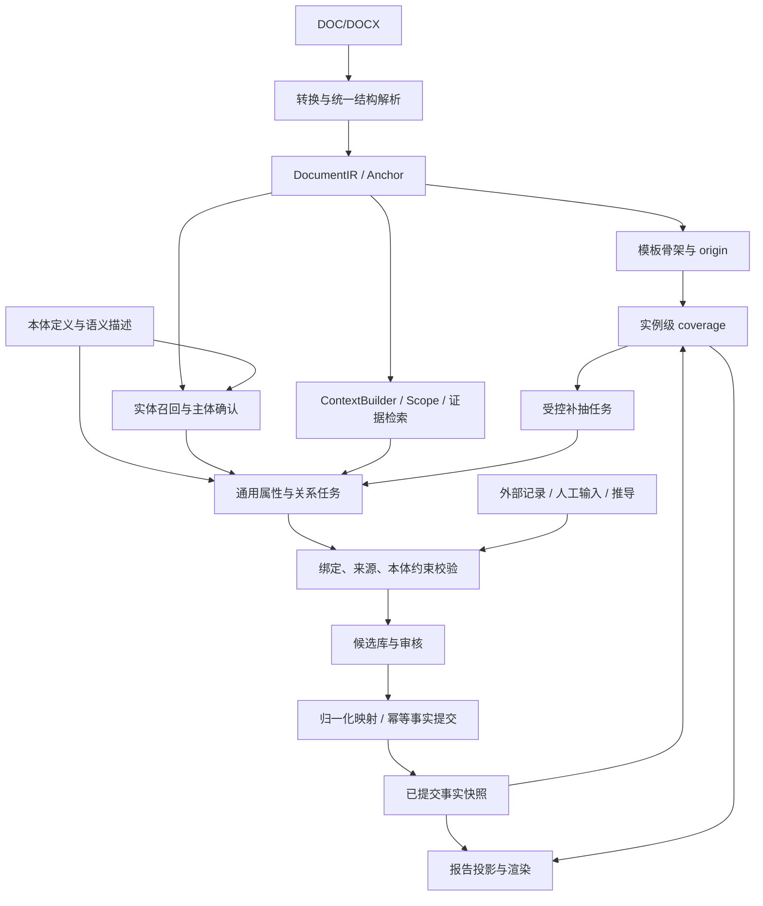

# 文档结构解析能力增强报告模板的关系图谱识别和 NER 能力

> 状态：依据两轮评审修订的详细设计，待复审；不代表相关改造已经实施
>
> 日期：2026-09-05
>
> 修订依据：[评审意见](./文档结构解析能力增强报告模板的关系图谱识别和NER能力-评审意见.md)，覆盖 R01—R08
>
> 代码核查基准：评审记录的 `bbbfa2eb9da3c53325b0e96d0b1497d200dae826`；本次修订另核对相关生产入口
>
> 适用范围：Word 文档分析、AST 报告模板、NER、属性与关系抽取、外部富化、审核入图、覆盖校验及报告生成
>
> 术语约定：IR 为 Intermediate Representation（中间表示）；下文新增类型、接口和表均为拟实施契约

## 1. 执行摘要

本方案以现有 `DocStructure` 为基础，建立统一证据 IR，使文档分析、模板、抽取和报告共享章节树、原文坐标及来源。最终生产链路采用本体驱动的通用实体召回、属性抽取和关系判定，彻底退役自有处理链路中的正则和硬编码业务 finder。

统一结构、证据定位、属性归属、关系成立和审核入图分别承担不同保证：IR 提供结构；Anchor 定位证据；Scope 限制搜索范围；主体条件和绑定证据支持事实归属；审核及提交服务负责事实持久化。任何一层通过都不能代替其余层。

最终架构为：

```text
Word → 无正则结构解析 → 统一证据 IR
  → 本体驱动的通用抽取任务
  → 实体候选召回与主体确认
  → 以主体实例为条件的属性抽取、对象召回和关系判定
  → 来源、绑定及本体约束校验
  → 候选持久化、审核、实体归一化、幂等入图
  → 已提交事实快照 → 实例级 coverage → 报告
                             │
                             └→ 有限次、范围受控的通用补抽 → 候选队列
```

本方案的硬约束：

1. 最终版本不执行专用业务 finder、按具体业务类 IRI 分派的抽取分支、可执行抽取 pattern 或其他自有生产正则。结构、分词、配置加载、来源处理和报告链路也纳入检查，详见 §3.2、§14。
2. 旧规则仅在有退出条件的迁移阶段承担基线和影子比对职责；最终删除生产调用、可执行配置与隐式回退。把规则移到 JSON、TTL、数据库或适配器不算替代完成。
3. 属性任务不依赖目标正文存在实体 mention。主体在标题、数值在正文的情况由已确认主体、属性定义及证据范围驱动。
4. 每个属性和关系候选必须提供支持其归属与断言的绑定证据；同段、同行、同章节、类型合法或实体共现都不能单独证明事实成立。
5. 文档、外部记录、人工输入和推导值按真实来源分别保存，不强制外部事实伪造 Word anchor。
6. 模型不可用时明确返回未完成任务、待审核候选或结构预览；最终版本不通过旧 finder 恢复能力。
7. 父链增强和通用抽取的质量收益均是待验证假设，必须以独立人工金标及禁用旧规则后的评测确认。

## 2. 背景、核查结果与证据边界

### 2.1 可复用基础

`services/extraction/docx_structure.py` 已有 `DocStructure.sections/blocks/section_tree`、表格章节路径、章节范围、分页元数据及 parser version。标题识别结合大纲、样式、字号、编号等信息；这些用户可见能力需迁移并验证，现有正则实现不永久保留。

`api/document_analysis.py::_analyze_docx()` 已在分析和预览间共享结构；`api/extraction.py::_compute_annotation()` 已在分类、标注和关系抽取间传递同一结构。应抽出统一入口，不复制模板专用解析器。现有行级 NER segment、嵌套表格收集、暂停、checkpoint 和批量推理也可复用其契约。

### 2.2 当前缺口

| 当前实现或行为 | 修订要求 |
|---|---|
| 模板样例只返回预览和纯文本，结构建议依赖截断文本；前端未保留建议证据 | 模板直接消费 IR 骨架，持久化 section/group/slot origin |
| NER 当前为 GLiNER 定界、嵌入归类、按实体抽属性三阶段 | 保留实体召回能力；将属性任务从“已归类 span”中解耦 |
| `ontology_typer._is_non_entity_span()` 过滤纯数字及部分带单位数值 | 数值进入独立属性候选流；移除正则过滤，不能仅增加父标题 |
| `_extract_property_triples()` 缺少显式主体条件及独立绑定输出 | 输入主体 ID、证据和竞争主体，输出逐值绑定证据 |
| `_extract_sub_relationships()` 未传真实父 endpoint | 每跳传递具体候选及其版本、路径和 scope |
| coverage 主要按对象类型、任意同类对象非空属性判断 | 按主体实例、完整谓词路径、对象实例及逐值归属计算 |
| `_persist_ner_triples()` 将属性压成字典，来源为字符串 | 节点、逐值属性、关系、绑定证据、来源分表或结构化存储 |
| `_commit_candidate()` 调用 `OntologyEngine.project_entities()` | 新增实例及对象关系写入服务；后者的元数据投影职责不能直接承接 ABox 提交 |
| Profile、finder、TTL pattern 和报告辅助处理仍执行规则 | 逐项替代并删除所有生产可达的旧入口 |

上述依据见评审意见及对应仓库代码。代码存在只能证明当前能力或风险存在，不能证明拟议方案的准确率。

### 2.3 验证边界

评审记录的现有测试为 101 passed、4 warnings；三个临时探针复现了数值过滤、同段主体输入相同及错谓词满足 coverage 的行为。本次是文档修订，未重新运行这些测试，也未完成真实模型、消融、性能或全依赖正则审计。

普通实体抽取接口输出 span，不能直接视为具备主体条件属性绑定或关系判定能力。评审通过 Context7 核查的 GLiNER 资料区分普通实体抽取与专用关系模型；仓库锁定版本为 0.2.27，实际部署模型和适配器能力还须在实施时验证。§9、§10 定义的是待实现的通用接口，不宣称当前封装已经支持。

## 3. 目标、生产边界与原则

### 3.1 目标

- 同一 Word 在文档分析、模板和抽取中使用同一份有版本的 IR、结构哈希和来源坐标。
- 从已确认结构确定性派生模板骨架，语义建议不改写原始章节树。
- 提供可访问的完整父链；模型实际消费哪些上下文由经过实验的策略决定。
- 用通用任务覆盖实体、属性、关系、否定、条件、多值和多跳，新增业务类或谓词无需修改抽取代码。
- 完成逐值来源、人工审核、实体归一化、实例与对象关系持久化和报告快照。
- 以实例级 coverage 定位缺口，受控补抽并如实呈现未完成状态。
- 在禁用并删除旧规则后达到质量、结构、性能和故障行为门禁。

### 3.2 正则消除范围

最低强制范围是本产品自有代码中从输入到报告的完整生产处理链路，包括同步 API、后台任务、共享工具、前端处理以及动态加载的配置：

| 范围 | 最终要求 |
|---|---|
| Word 原生结构、标题编号、KV、字段标签、目录和文本整理 | 使用 OOXML 结构、字符扫描、通用语法解析；不保留结构正则例外 |
| NER 分词、分句、分类前后处理、长文本窗口及偏移 | 使用无正则字符算法及经过验证的 tokenizer 适配 |
| 业务实体、属性、关系和 Profile/`doc_pattern` | 通用语义任务替代；删除可执行 pattern 和业务 finder 分派 |
| 约束转换、外部身份匹配、来源解析、coverage、模板及报告渲染 | 通用类型约束、结构化字段和 AST 处理；不在后处理重新抽取业务事实 |
| JSON、TTL、数据库、本体注解、插件及前端配置入口 | 不得配置或动态执行抽取正则、正则校验或专用 finder；旧规则只保留不可执行审计副本 |

本体 domain/range、datatype、单位维度、受控词表、基数及有版本的推导公式仍可使用。正则形式的校验也需要无正则替代；通用校验只能检查已有候选，不能借“校验”生成没有证据的事实。将某个业务 finder 逐字符改写成相同业务匹配逻辑，同样不满足消除硬编码 finder 的要求。

对仓库所有自有生产代码先全面清点，再根据调用图标记生产可达性；不能仅扫描几个抽取文件后声称达标。第三方库、模型 tokenizer、转换器和运行时内部正则另建依赖审计清单，记录版本、用途、是否可替代及未核查项。自有代码主动把正则交给第三方执行仍属于必须删除的自有依赖。依赖内部未审计或仍含正则时，只能报告“自有生产链路达标”，不得宣称全栈零正则；如验收包含第三方内部，该部分也须达标，否则整体保持未完成。

### 3.3 非目标与边界

- 不更换现有本体元数据引擎的职责；通过专门实例写入接口补齐事实层。
- 不把摘要、模型解释、模板示例值或输出报告当作源事实。
- 不以永久保留三阶段实现、Profile 或旧 finder 作为“不回归”的定义。
- 不承诺 Word 渲染引擎级精确分页；估算页码必须有标记。
- 不用 coverage 硬过滤首次实体召回；未声明实体仍可进入候选。
- 不承诺缺少可用语义模型时完整自动抽取；返回行为由 §13.3 明确规定。

### 3.4 核心原则

结构事实唯一、上下文不等于来源、来源不等于绑定、自动校验不等于人工确认、人工确认不等于提交成功。本体菜单限制合法输出，通用模型负责提出有证据的候选。无法唯一判定时拒答或待审核，不能复制事实到多个主体。

## 4. 术语与身份

| 术语 | 定义 |
|---|---|
| DocumentIR / SectionNodeIR | 文档与章节树的统一结构表示 |
| EvidenceUnit / EvidenceAnchor | 原文证据单元及其可回放坐标；anchor 只证明位置 |
| ContextEnvelope | 任务所需目标、主体、竞争主体、父链及局部上下文的派生视图 |
| EvidenceScope | 经版本化的可检索范围及扩展记录；不证明语义归属 |
| EntityMention | 原文中的一次实体提及，同名 mention 不必是同一实体 |
| EntityCandidate / SubjectRef | 待审核实体及其稳定 ID、版本、类型、身份和证据引用 |
| PropertyCandidate / RelationshipCandidate | 带主体条件、逐项来源、绑定证据及断言状态的候选 |
| BindingEvidence | 支持特定主体—属性值或主体—谓词—对象的原文或结构证据 |
| FactProvenance | 文档、外部、人工、推导四类来源的可区分联合类型 |
| FactSnapshot | 已审核、已成功提交的实例、属性和关系的不可变事实快照 |
| RuntimeCoverageTask | 从模板类型声明展开、绑定主体及对象范围的实例级覆盖任务 |

`candidate_id + revision` 标识候选版本；`mention_id` 标识提及；`instance_iri` 标识归一化后的图谱实体，三者不混用。合并候选会更新映射及依赖，不篡改历史证据。

## 5. 总体架构



旧机制不在最终架构内。迁移期仅增加隔离的基线比对通道，输出不能绕过审核进入新事实快照。

`analyze_word_core()` 是共享入口，`parse_docx_structure()` 的结构实现逐步替换为无正则实现。同一版本和输入只构建一次语义结构。Tiptap 可以读取 OOXML 样式以还原字体、列宽、页眉等，但必须引用已有 block/node 坐标，不建立第二套章节归属。

## 6. 统一证据 IR 与来源

### 6.1 DocumentIR

建议新增 `services/extraction/document_ir.py`：

```python
@dataclass
class DocumentIR:
    ir_schema_version: int
    parser_version: str
    structure_policy_version: str
    source: DocumentSource
    root_node_id: str
    nodes: dict[str, SectionNodeIR]
    evidence_units: list[EvidenceUnit]
    evidence_index: dict[str, int]
    block_index: dict[str, BlockIR]
    tables: list[TableIR]
    pagination: PaginationMetadata
    structure_hash: str
    diagnostics: list[StructureDiagnostic]
    legacy_sections: list[DocSection]
    legacy_tables: list[DocTable]
    tiptap_content: dict | None
```

`DocumentSource` 包含原文件与规范 DOCX 的各自哈希、哈希对象类型、文件名、media type、转换器版本及 `document_role`。原文件与转换产物不能共用含糊的 `file_sha256`；后续 Word anchor 统一引用规范 DOCX 的 `document_hash`。

角色至少有 `analysis_source/template_sample/default_source/training_source/training_report`。输出样例和训练目标报告不可作为生产事实源。

### 6.2 SectionNodeIR 与结构解析

`SectionNodeIR` 保留：

```text
node_id / node_type / parent_node_id / child_node_ids
heading / level / path / heading_index
heading_source / heading_confidence / is_toc_entry
direct_evidence_ids / subtree_evidence_range
source_range / page_ids
structural_metadata / derived_metadata
```

结构元数据包括深度、同级序号、段落/表格/后代数量、内容哈希、子标题、兄弟标题、表题和可定位字段标签。摘要放入 `derived_metadata`，不参与结构哈希或事实校验。子树范围采用 evidence ordinal 闭区间，避免在每个祖先重复存储全部后代证据。

无正则结构识别按以下来源推进：

1. OOXML 大纲级别、样式关系、原生编号及编号层级、表格网格、合并与嵌套关系提供主结构。
2. 对只有文本编号的文档，用通用编号语法、Unicode 字符分类和状态机解析编号及层级，不内置业务章节名称。
3. KV、空字段、样式名数字、空白整理使用明确的分隔符扫描和通用语法；任何文本规范化保留到原文的偏移映射。
4. 无原生标记时依据字号、加粗、段落位置等通用结构信号提出标题候选；冲突或低置信项保留为待确认诊断。
5. 可选结构识别模型只能提出候选，不能静默改树；确认后的结构形成新版本并统一失效下游缓存。

`key_labels` 必须来自原生结构或已确认语法区域，并有 anchor。字段的业务语义由后续语义任务判定，不能把“左列”或“冒号前文本”直接当成已确认业务属性。

### 6.3 EvidenceUnit 与嵌套表格

`EvidenceUnit` 包含 `evidence_id/kind/text/section_node_id/ancestor_node_ids/section_path/block_ids`、表格路径及行列、表头和表题引用、页码及估算标记、`content_hash/anchor`。

| 原文结构 | 证据粒度与用途 |
|---|---|
| 标题 | 独立 heading；可单独召回主体，不能从标题虚构正文属性 |
| 普通或 KV 段落 | paragraph 及可定位子 span；没有 mention 也可作为属性任务目标 |
| 数据表 | table_row + table_cell；建立记录、表头、合并单元格映射 |
| 两列字段表 | 保留字段和值单元格；绑定需确认字段语义和所属记录 |
| 嵌套表 | 递归 table_path；预览、模板与抽取共用坐标 |
| 空段、装饰块 | 保留 BlockIR；默认不进入抽取 |

嵌套路径示例：

```text
table_path = ["table:3", "row:1", "cell:2", "nested:0"]
evidence_id = "table:3/row:1/cell:2/nested:0/row:4/cell:1"
```

合并单元格引用其真实源单元格，不能复制成多个独立原文值。行级合成文本中新增的分隔符无原文坐标，不允许作为值证据。

### 6.4 EvidenceAnchor

```python
@dataclass
class EvidenceAnchor:
    document_hash: str
    parser_version: str
    structure_hash: str
    evidence_id: str
    section_node_id: str
    block_id: str
    paragraph_index: int | None
    fragment_index: int | None
    table_path: list[str] | None
    row_index: int | None
    column_index: int | None
    span_start: int | None
    span_end: int | None
    physical_page_number: int | None
```

字符区间统一采用未规范化 `EvidenceUnit.text` 的 Unicode 码点半开区间 `[start, end)`。前端使用 UTF-16 时显式转换；模型 token、序列化上下文与原文字段各自维护映射。span 缺失可表示块级结构证据，抽取文字或数值必须提供可复核 span。分页仅辅助显示，不参与唯一身份。

相同文件、parser 和结构策略下 `evidence_id` 稳定。`structure_hash` 由层级、块顺序、表格拓扑和原文内容构成，不含摘要、生成时间和模型输出。模板样例、parser 或已确认结构变化后旧 anchor 显式失效，不能静默匹配同名文本。

`source_ref = format_evidence_anchor(anchor)` 只用于兼容显示；机器校验使用结构化字段。

### 6.5 FactProvenance：事实来源与身份匹配分离

| 来源 kind | 必填信息 | 验证及回放 |
|---|---|---|
| `document` | 文档角色、哈希、一个或多个值/断言 anchor、原文片段哈希 | 原文区间可解析且支持候选；标题编号位置不能冒充别处的属性值来源 |
| `external_record` | 系统、数据集、记录键、记录版本或不可变快照哈希、字段路径、取数时间、适用时间 | 能读取同一版本字段；无版本接口需持久化响应快照 |
| `manual` | 操作者、审核记录、输入时间、原值/新值、原因、适用主体 | 人工新增值为人工来源；确认原文候选不改变其原始来源 |
| `derived` | 公式/规则 ID 与版本、输入 fact ID 与快照、参数、单位转换、结果 | 输入可回放、计算可复现，依赖图无环；不标记为原文值 |

`identity_match_evidence` 单独保存文档编号与外部记录主键如何匹配、匹配版本和审核结果。Word 中的设备编号可以支持身份匹配，外部“材质”必须引用档案的材质字段。外部记录若直接支持关系，记录键、关联字段与映射定义共同构成结构绑定证据。

推导、人工和外部候选执行同样的类型、归属、冲突与审核契约。报告必须能区分来源；来源完整率按上述各类必填项计算，Word anchor 完整率作为独立子指标。

EvidenceScope 和文档 ContextEnvelope 只约束 Word 任务。纯外部、人工或推导候选的文档 scope 字段允许为空，改为校验来源记录/字段集合、人工指定主体或推导输入快照；绑定证据和主体引用仍必填。混合来源候选分别检查文档 scope 与非文档来源范围，不为通过接口校验伪造文档哈希。

## 7. 层次上下文、作用域与缓存输入

### 7.1 ContextEnvelope

```python
@dataclass
class HierarchicalContextEnvelope:
    task_id: str
    task_kind: str
    target_evidence_ids: list[str]
    current_node_id: str
    ancestor_chain: list[NodeContext]
    subject: SubjectRef | None
    competing_subjects: list[SubjectRef]
    relationship_path: list[PathStep]
    scope_id: str
    scope_revision: int
    scope_digest: str
    effective_doc_class: str | None
    fragments: list[ContextFragment]
    allowed_fact_regions: list[AllowedFactRegion]
    allowed_binding_regions: list[AllowedFactRegion]
    context_policy_version: str
    tokenizer_identity: str
    token_budget: int
    context_hash: str
```

每个 fragment 记录文本、原文 anchor、用途和 `fact_eligible`。用途区分 `target/subject_evidence/local_context/ancestor_metadata/tree_metadata/derived_hint`。完整父链在 IR 中可访问，envelope 保存链及选择记录；序列化给模型的内容受预算和实验策略控制，不要求每次消费全部祖先信息。

envelope 的查找键必须在构建前包含主体、scope、分类、预算、tokenizer 等全部依赖，详见 §12.4。`context_hash` 是构建结果摘要，不能修复构建前的键冲突。

### 7.2 上下文装配与预算

目标窗口、明确主体及其证据、判定所需的竞争主体是任务必需输入；同表表头/表题、直接父标题、祖先标题、局部邻居及兄弟标题为可选上下文。预算按实际 tokenizer 计算。

长段落按 tokenizer 分窗并保留重叠及原文偏移，所有原文窗口必须获得处理状态；不能通过截断正文伪称任务完成。必需输入无法放入模型预算时进一步拆分或标记 `budget_exceeded`，不丢弃主体标识或竞争主体后继续绑定。父链先近后远裁剪，记录保留项、裁剪项和窗口策略。

派生摘要只能用于检索排序，不能提供值或关系证明。文档类型使用用户覆盖后的有效值；分类不确定时保留通用候选，不因模板先验永久漏检。

### 7.3 EvidenceScope 的构建、继承和扩展

```python
@dataclass
class EvidenceScope:
    scope_id: str
    revision: int
    document_hash: str
    subject_candidate_id: str
    subject_revision: int
    evidence_ranges: list[EvidenceRange]
    record_ids: list[str]
    excluded_ranges: list[EvidenceRange]
    parent_scope_id: str | None
    construction_evidence: list[BindingEvidence]
    expansion_history: list[ScopeExpansion]
    policy_version: str
    scope_digest: str
```

scope 是证据范围的规范化并集减去排除区间；章节、行列等引用最终解析为 evidence/span 区间。规则如下：

1. 表格主体从其记录身份及真实单元格集合起步。共享表头可解释字段，但其他记录默认排除；跨行合并需有明确网格映射。
2. 标题主体只有在标题实体及章节归属已确认、且无竞争主体分割该记录时，才把对应直接内容及已确认子记录纳入初始 scope。
3. 同段多个主体可共享检索区间，但各自保留独立 SubjectRef 和竞争主体；scope 不自动切成“最近词归属”。
4. 子关系从父实例的 scope 中检索；对象确认后建立对象 scope 并继承路径。不能仅因子类相同复制父范围到所有对象。
5. 新增相邻段、子树、上级章节或全文范围需要显式 `ScopeExpansion`：触发缺口、旧新范围、身份交叉引用或检索依据、冲突主体、策略、预算及审批/自动策略记录。
6. 全文检索可以召回范围扩展提案，但只有显式接纳的范围可进入抽取；即使扩展获准，每个值和关系仍须独立证明绑定。
7. 缺少主体身份支持、存在多个同等可能的主体或扩展预算耗尽时停止扩展，保持待审核/未完成，不能只降低分数后自动入图。

`scope_digest` 包含有序规范化区间、记录、排除项、构建证据、继承路径和策略版本；范围或主体版本变化均产生新身份。

### 7.4 事实区域与绑定区域

| 任务 | 值或实体来源 | 绑定所需证据 |
|---|---|---|
| 实体召回 | 当前目标窗口；标题作为独立目标时允许召回标题主体 | mention 原文及类型支持 |
| 类型判定 | 不产生新 span | 类型语义、局部语境及所选父链 |
| 属性抽取 | scope 内显式允许的目标/相邻原文 | 主体证据、字段语义、值及主体—值归属 |
| 关系判定 | 已有两端来源；新对象先独立形成候选 | 支持谓词、方向、主体和对象的原文或结构证据 |

`allowed_fact_regions` 限定新增值及 mention 的来源；`allowed_binding_regions` 允许引用已确认主体标题、表头、记录映射和谓词断言。后者不能被用来偷取未授权区域的数值。

模型结果必须完成偏移回映射及原文片段复核；跨边界 span、合成分隔符和未登记上下文值拒绝。以上校验只证明位置与范围合法，§9.4、§10.2 的绑定判定仍不可省略。

## 8. 报告模板融合

### 8.1 统一解析与骨架

`POST /api/ast-templates/parse-sample` 改为调用 `analyze_word_core(document_role="template_sample")`，保留 `content_json/plain_text`，增量返回 `analysis`：IR/parser/结构策略版本、文件与结构哈希、章节树、证据索引、分页和诊断。

新增 `template_structure_builder.py`，从已确认 IR 派生骨架：

| IR 信号 | 模板输出 |
|---|---|
| 主章节和子章节 | Section；更深层按通用深度策略映射为 Section/Group |
| 已解析 KV、两列字段表 | fields group 及候选 Slot；字段业务含义待语义确认 |
| 有表头的数据表 | table group 或待作者确认的语义分组 |
| 纯叙述段落 | semantic Slot 或章节 prompt 候选 |
| 目录、装饰及低置信结构 | 保留预览和诊断，不自动认定为业务 Slot |

不依赖生成模型也能创建结构草稿；无法确认的字段标为待处理，不承诺完整语义插槽。

### 8.2 origin 与作者化来源

后端 Section/Group/Slot 和前端 SlotDef 都显式保留 `origin`，避免建议物化或序列化时丢字段：

```json
{
  "slot_id": "sec_product.fields.drug_name",
  "label": "药品名称",
  "source": {"kind": "semantic", "prompt": null, "coverage_refs": []},
  "origin": {
    "document_hash": "...",
    "parser_version": "...",
    "structure_hash": "...",
    "evidence_id": "table:1/row:2/cell:0",
    "section_node_id": "section:8",
    "label_anchor": {},
    "value_anchor": null
  }
}
```

`origin` 是模板作者化来源；报告运行时的 `source` 来自实际事实快照，两者不混用。标签和值处于不同单元格时分别保存完整 anchor，不能用同一 span 坐标推算。

### 8.3 语义建议与角色限制

模型只对已存在的 section/group/slot ID 提出显示名、语义说明、行文 prompt 及合法 coverage。服务端校验 ID 和本体菜单；章节移动、删除、合并由作者确认。模型失败不破坏骨架。

`sample_docx` 只提供样式；`template_sample` 只用于骨架与 origin；`default_source` 必须经过抽取审核才能提供事实。训练源只在训练/评测范围内提供证据，训练目标报告不是事实源。训练对按 coverage、本体路径及 origin 对齐，不能按章节序号硬绑定。

### 8.4 模板存储

`ast_templates` 增加 `sample_analysis_json/sample_structure_hash/sample_parser_version/sample_ir_schema_version/sample_structure_policy_version`。快照随模板版本 copy-on-write；替换样例生成新快照并显式标记失效 origin。覆盖声明版本化，运行时冻结模板版本，禁止使用模板最新草稿改写历史报告。

## 9. 通用实体与属性抽取

### 9.1 通用任务与责任分工

首次抽取和 coverage 补抽使用同一任务接口，区别仅在触发来源及目标范围：

```python
@dataclass
class ExtractionTask:
    task_id: str
    task_kind: Literal["entity", "property", "relationship"]
    subject: SubjectRef | None
    predicate_iri: str | None
    predicate_definition: OntologyDefinition | None
    target_class_iris: list[str]
    datatype: str | None
    constraints: list[Constraint]
    relationship_path: list[PathStep]
    evidence_scope: EvidenceScope | None
    target_evidence_ids: list[str]
    competing_subjects: list[SubjectRef]
    ontology_release: str
    semantic_spec_version: str
    context_policy_version: str
    budget: TaskBudget
    trigger: Literal["initial", "coverage_gap", "review_revision"]
```

只有实体召回任务允许无主体。属性与关系任务必须给出 `SubjectRef(candidate_id, revision, class_iri, mention_ids, identity, evidence_refs)`。没有 Word mention 的外部或人工主体使用对应 provenance，不伪造 mention。

职责分工：

| 能力 | 通用实现及输入 | 输出与限制 |
|---|---|---|
| 实体候选召回 | 当前实体模型可用于边界召回；通用结构化语义模型可补充未知类型，输入文本、类型定义和词汇描述 | mention span、候选类及证据；禁止业务类分派 |
| 实体类型判定 | 嵌入排序及必要的语义判定，输入实体 span 和经策略选定的上下文 | 类型候选、校准分数和拒答；属性 IRI 不能当实体类 |
| 属性召回与归属 | 通用结构化语义模型，显式输入主体、竞争主体、属性定义、允许证据及断言要求 | 逐值 PropertyCandidate；无主体/证据则不通过 |
| 关系判定 | §10 通用关系判定接口，输入两端候选、谓词定义和原文/记录证据 | 有方向的关系、绑定证据、断言状态或拒答 |
| 数值、单位及类型校验 | 无正则通用字面量解析和本体约束 | 规范值或错误，不创建业务事实 |
| 外部富化、推导 | 结构化记录连接及有版本的公式执行 | 独立 provenance 和候选，不绕过审核 |

本体语义规格可包含类/谓词标签、描述、同义词、正反例、domain/range、datatype、单位和基数；不允许 pattern、可执行表达式、Python 函数名或具体业务类到 finder 的映射。语义规格只解释任务，不能自带生产事实。示例和描述版本纳入模型缓存身份。

当前 GLiNER span 封装只承担其已验证的召回职责。属性绑定和关系判定采用新的通用结构化输出适配器；普通 span 输出不能直接当作关系。若选用专用模型承担这些任务，也必须满足相同契约及金标门禁。模型选择和参数作为实施实验产物冻结，不用尚未验证的接口能力支撑上线承诺。

### 9.2 主体生成、确认与调度顺序（R01）

```text
解析 IR、确认文档角色及有效分类
  → 扫描标题、段落、表格记录，生成实体 mention 与类型候选
  → 检查 mention 来源、类型与记录身份，形成可用于任务的 SubjectRef
  → 按主体类型枚举合法属性和对象关系，检索证据并构建 scope
  → 属性任务 / 对象召回
  → 对象确认后执行关系判定；通过后才调度依赖该边的后续路径
  → 候选审核、实体归一化与提交
```

“可用于任务的主体确认”是内部候选门槛，不等于人工确认或已入图：主体必须有有效类型、独立来源、稳定候选 ID 及版本，且在本次记录范围内可唯一指称。属性不完整不妨碍形成主体；身份不确定的候选可以分别探索，但其结果保持依赖未决，不能自动合并或提交。

文档根可以由上传元数据建立为“文档实例”，业务类必须另有证据，不能仅凭文档分类造出药品或设备主体。关系对象的实体召回本身不依赖关系已经成立；只有使用该对象作为路径下一跳时依赖前一条边的绑定验证。这避免 NER 等关系端点、关系端点又等 NER 的循环。

示例：标题“药品 A”先形成主体 A，正文“规格：250 mg”进入 A 的 scope；任务以 A 和合法规格属性为输入，即使正文没有实体 mention，也直接召回 250 mg 并验证归属。若标题同时包含 A、B 且正文无法区分，生成 `ambiguous_subject` 待审核项，不把同值挂到两个主体。

主体别名、唯一标识等后续属性可以细化身份并产生新 revision。依赖旧版本的任务、候选绑定及缓存重新验证，不静默继承旧结果。

### 9.3 PropertyCandidate 与数值表示

属性候选按“一个主体、一个属性、一个值或区间”存储：

```python
@dataclass
class PropertyCandidate:
    candidate_id: str
    revision: int
    subject: SubjectRef
    property_iri: str
    raw_text: str
    literal: LiteralValue
    value_provenance: list[FactProvenance]
    binding_evidence: list[BindingEvidence]
    assertion_status: Literal[
        "affirmed", "negated", "conditional", "hypothetical", "uncertain"
    ]
    condition_refs: list[EvidenceRef]
    scope_id: str | None
    scope_revision: int | None
    confidence: ConfidenceRecord
    validation_results: list[ValidationResult]
    refusal_reasons: list[str]
```

`LiteralValue` 至少支持：

```text
kind: text | boolean | date | number | range | comparison
datatype_iri
raw_value / normalized_value（精确十进制字符串，避免二进制浮点损失）
lower / upper / lower_inclusive / upper_inclusive
operator: eq | lt | le | gt | ge | approx
raw_unit / canonical_unit / dimension
normalizer_version / conversion_record
```

每个数值、单位、范围端点、比较符和适用条件都保留证据引用；单位来自表头时引用表头单元格，不声称单位在数值 span 内。缺单位不能凭属性常见单位补成已验证值；若来源明确约定默认单位，保存对应字段定义及映射证据。

用通用 Unicode 扫描、数字/区间语法及单位注册表处理小数、符号、科学计数法、比较和范围；支持范围需写入版本化语法。不能解析的表达保留原文并拒绝规范化，禁止为了某个药品或 PDE 新增专用正则。PDE 等属性的维度、适用条件和计算依赖由本体约束与有版本的公式表达，定义句的语义判定由断言识别完成。

旧 `_NON_ENTITY_RE` 的职责拆分：实体流按类型语义判断一个 span 是否是实体，属性流独立检索数值；两流均不能用旧数值过滤器提前丢弃“250mg”“250 mg”“5”。数字也可能是实体标识，不能全局禁止数字实体。

### 9.4 主体条件绑定与拒答（R02）

属性模型输入显式列出本次主体及 mention/身份引用、同段竞争主体、属性语义和目标区域。输出必须引用输入 ID，并返回值 span、属性语义证据和归属证据。生成的解释文本或置信分数不能作为 BindingEvidence。

```python
@dataclass
class BindingEvidence:
    evidence_id: str
    method: Literal[
        "explicit_assertion", "table_record", "section_record",
        "identity_reference", "external_mapping", "manual_decision"
    ]
    subject_ref: CandidateVersionRef
    predicate_iri: str
    object_ref: CandidateVersionRef | None
    value_candidate_id: str | None
    assertion_refs: list[EvidenceRef]
    subject_refs: list[EvidenceRef]
    object_or_value_refs: list[EvidenceRef]
    record_mapping: RecordMapping | None
    polarity: str
    modality: str
    condition_refs: list[EvidenceRef]
    resolver_version: str
```

绑定步骤独立于值召回：

1. 召回原文值及可能语义，校验原文位置。
2. 以指定主体与竞争主体为条件，判定该属性断言是否成立，返回证据引用及极性、条件。
3. 对同一 scope 的所有主体联合检查，排除一个无区分证据的值被重复挂载到多个主体；真实共享值需要明确共享断言。
4. 检查来源、类型、单位、基数及候选依赖，给出通过、冲突或拒答。
5. 未通过绑定的值可以保留为未归属观察，不参与事实提交或覆盖满足。

同段“药品 A 规格 250mg，药品 B 规格 500mg”必须生成 A→250、B→500；每次调用有不同 SubjectRef，模型返回必须有对应分句证据。标题记录可通过标题主体、章节分组及“规格”字段共同支持归属，但“最近祖先”本身不足以绑定。

主要拒答/拒绝原因包括 `no_subject/ambiguous_subject/no_value_evidence/unsupported_predicate/cooccurrence_only/negated/conditional_unresolved/unit_unknown/scope_violation/conflicting_values/budget_exceeded/model_unavailable`。明确否定保留否定断言，不能提交为正向事实；条件和假设候选不满足无条件 coverage。

### 9.5 Segment、偏移、长文本与 checkpoint

保留行级推理和嵌套表格能力，统一 `NerSegment(segment_id, target_evidence_ids, context_envelope, source_offset_maps)`。表题/表头用独立片段；正文、合并及嵌套单元格按 IR 落点。窗口内偏移通过 OffsetMap 回到原文，回写依据 segment/evidence ID，不用临时数组序号猜来源。

无正则中文 word splitter 按 Unicode 字符类别扫描，保留汉字、拉丁/数字串、标点与空白边界规则及原文位置；这些规则只描述通用字符语法，不识别业务编码。窗口按实际 tokenizer 计算，重叠结果按来源区间和候选语义去重。多段绑定使用多个 span 引用，不捏造连续 span。

checkpoint 保存任务依赖图、已完成窗口、主体版本、scope、输入清单、模型/策略版本和候选 ID。只恢复依赖未变的任务；失败、预算不足、未覆盖窗口不能标记完成。

### 9.6 类型消歧、评分和实体归一化

类型、值、绑定、来源和校准置信度分别保存，不采用没有实验依据的固定加权和。文档分类、模板 coverage、标题和表头仅作候选排序信号；无法可靠分类可拒答或保留多个类型。门槛及上下文选择通过 §17 的校准集确定。

mention 合并优先使用有证据的唯一标识及外部身份映射，再考虑名称、别名、类型和记录范围。相同文本或同一章节都不足以跨主体自动合并。合并产生规范候选映射版本，保留所有 mention；对属性冲突、关系端点和 scope 重新验证，具体提交契约见 §12.3。

## 10. 通用关系判定与审核候选

### 10.1 节点及关系候选

EntityCandidate 至少包含稳定 ID/revision、类 IRI、mention 引用、身份候选、scope、真实来源、校准分数和验证结果；属性以独立 PropertyCandidate 引用主体，不压成字典。

```python
@dataclass
class RelationshipCandidate:
    candidate_id: str
    revision: int
    subject: SubjectRef
    predicate_iri: str
    object: SubjectRef
    relationship_path: list[PathStep]
    binding_scope_id: str | None
    binding_scope_revision: int | None
    binding_evidence: list[BindingEvidence]
    provenance: list[FactProvenance]
    assertion_status: str
    condition_refs: list[EvidenceRef]
    confidence: ConfidenceRecord
    validation_results: list[ValidationResult]
    refusal_reasons: list[str]
    dependency_refs: list[CandidateVersionRef]
```

节点、属性及关系共享提议来源、模型/策略/本体版本和状态字段。最终生产来源可以是通用实体召回、通用语义模型、外部、人工或推导；迁移期的 `legacy_finder/document_profile` 必须标记隔离，不能作为永久权威优先级。

### 10.2 关系成立判断

最终接口为 `propose_entities(task, envelope)`、`extract_properties(task, envelope)` 和 `judge_relationship(task, subject, object, envelope)`。按任务能力调度，不按业务类 IRI 分派到专用代码。

关系流程：

1. 从本体获取合法谓词及 range，在父实例 scope 内召回对象候选；对象先完成实体证据校验。
2. 对每个有限的主体—谓词—对象候选组合执行关系判定。组合枚举只是待判定任务，不能直接生成已验证边。
3. 叙述文本必须引用支持谓词及方向的分句；否定、条件、计划、示例及定义分别编码。类型合法、距离近和共现不算断言。
4. 表格须给出记录身份、主体字段、对象字段、解释谓词的表头/表题及网格对应关系；同一行两个名字仍不足以证明任意谓词。
5. 章节记录须给出章节主体、对应对象及字段/正文如何表达谓词的证据；仅有父子标题不足以证明 `usesEquipment` 等业务关系。
6. 返回受支持关系、拒绝或待审核原因，再执行通用约束检查。

“药品 A 与设备 E 同时出现在介绍中”没有使用关系证据；“药品 A 未使用设备 E”明确否定，二者都不能产生正向 usesEquipment。“若转产则使用 E”保留条件候选；只有条件在同一事实快照中获证实或经过明确人工决策，才生成有推导/人工来源的新断言。

### 10.3 多跳与 scope 依赖

每一跳传递真实父候选、revision、已判定路径及 scope。后续路径只在前一跳通过绑定校验时调度，最终提交仍依赖全路径需要的审核状态。没有父实例时先生成主体任务，不退回“父类 IRI + 全文扫描”。

调度维护 `subject canonical ID + predicate/path + scope digest + ontology release` 的访问记录，并限制路径深度、每节点任务数、模型 token 和作业预算。对自引用和互相递归关系检测环；图中真实循环关系可作为边候选保存，但不无限展开任务。

跨章节同一标识可支持 scope 扩展提案，扩展后仍需谓词证据。新对象 scope 和父路径都有版本；父实体合并、审核拒绝或路径变化后，后代候选依赖失效并重新验证。

### 10.4 多值、冲突与来源决策

同一属性的不同值分别保存，带适用时间、条件、单位与来源。基数允许多值时保留全部；基数为一但出现互斥值时建立冲突组。多个来源支持同一规范值时可归组，但逐来源记录不能丢失。

不再使用“Profile > 外部 > NER > finder > LLM”的全局权威顺序。来源可信度可按数据集和属性制定有版本的裁决策略，但不得凭算法名称覆盖原文。人工裁决保存选择、驳回、理由及旧新版本；冲突未决不能满足 coverage。

外部主数据与原文值冲突、PDE 推导值与观测值冲突，均保留独立候选和来源。公式推导只能使用已确认的输入事实；没有输入或条件不满足时不计算。

### 10.5 统一校验与结果

校验按层分别记录：

| 层次 | 检查 |
|---|---|
| 引用和来源 | candidate/revision 存在；原文或外部字段可回放；文档角色合法 |
| 范围 | scope 版本与允许区间合法；扩展有记录 |
| 语义绑定 | 主体、谓词/属性、对象/值归属有证据，极性与条件明确 |
| 本体与字面量 | domain/range、datatype、单位、词表、基数、必要限定条件 |
| 一致性 | 竞争主体、重复、互斥值、身份合并及路径依赖无未决冲突 |

`validation_passed` 只表示候选满足自动门槛，不等于事实为真或已审核。所有层的结论、失败原因和版本均持久化；不得用平均分掩盖来源缺失或绑定失败。

### 10.6 报告事实边界

报告事实投影只读取 §12 的已审核且提交成功的快照。待审核、失败、否定、未解条件和冲突项可在独立的审核/缺口视图显示，不混入肯定叙述。人工新增事实也须经过校验、审核记录及提交，不能仅因“人工输入”绕过快照。

## 11. 实例级 coverage 与受控补抽（R03）

### 11.1 类型声明与运行实例分离

模板可保留类型级声明，但补充完整路径、量词及对象范围：

```python
@dataclass
class TemplateExtractionTarget:
    target_id: str
    section_id: str
    root_class_iri: str
    subject_selector: SubjectSelector
    predicate_path: list[PredicateStep]
    range_class_iri: str
    object_selector: ObjectSelector
    required_properties: list[PropertyRequirement]
    quantifier: Literal["exists", "all"]
    min_count: int
    max_count: int | None
    applicability: ApplicabilityDefinition | None
    required: bool
    source_section_hints: list[str]
```

`subject_selector/object_selector/applicability` 为受限类型化声明：类型、已确认实例集合、完整关系路径、已提交属性条件和适用时间等；不得包含正则、可执行脚本或 finder 名称。量词与本体基数分开：本体 maxCardinality 是事实约束，模板 min_count 是报告完整性要求。

运行时展开：

```python
@dataclass
class RuntimeCoverageTask:
    coverage_task_id: str
    target_id: str
    template_version: str
    ontology_release: str
    subject_instance_iri: str | None
    subject_candidate_ref: CandidateVersionRef | None
    resolved_path: list[InstancePathStep]
    expected_object_refs: list[EntityRef]
    object_universe_status: Literal["complete", "open", "unresolved"]
    quantifier: str
    min_count: int
    max_count: int | None
    required_properties: list[PropertyRequirement]
    scope_digest: str
    fact_snapshot_id: str
    discovery_revision: str
    selector_version: str
```

已提交主体以 instance IRI 定位；已发现但未审核的主体使用候选引用并标记 `pending_review`，不能因主体还没入图而漏掉覆盖任务。尚未找到主体时保留 `subject_unresolved` 目标，不能按空集合判为满足。身份归一化后解析到实例 IRI，并使旧映射下的 coverage 失效。

### 11.2 精确满足语义

对主体 s、完整路径 p、对象 o 及属性 q，满足条件必须同时校验：

1. 每一步边属于同一快照，方向和完整 predicate IRI 正确，且前一对象就是下一主体；不能通过 range 类型相同替代谓词。
2. 终点属于本体允许类型及 object selector 指定的实例/范围。
3. 属性值的主体是该终点实例，属性 IRI、值、条件、单位和基数均满足要求。
4. 所有用于满足的事实已审核、提交成功，且不存在相关未决冲突。

令 U 为运行时确认的相关对象集合，Q(o) 表示该对象在正确路径下满足全部属性要求：

- `exists`：正确关系至少有 min_count 个合格对象；不能用另一主体的对象凑数。max_count 约束正确路径及 selector 下全部相关对象的数量，不能通过排除属性不完整的对象规避上限。
- `all`：U 中每个相关对象都满足 Q，同时达到 min_count。U 为空而 min_count > 0 时不满足；U 尚未封闭时返回 `incomplete`，不能仅凭已抽到的少数对象宣称“全部满足”。
- max_count 或其他完备性要求依赖集合封闭证明；当对象发现范围尚未处理完成，不能提前宣称通过。
- 对象集合由已确认记录清单、显式实例清单或经过完整范围处理并确认的发现结果确定，保存 `object_universe_status` 及证据。若新候选显示有额外对象，重新展开任务。

例如 A、B 两个药品都要求 usesEquipment：A 的设备完备只满足 A 的任务。B 只有位于另一谓词下的 Equipment 时，B 的 usesEquipment 缺口仍保留，补抽主体明确为 B。

### 11.3 CoverageManifest 状态

| 状态 | 含义及行为 |
|---|---|
| `filled` | 正确主体/路径/对象/属性满足，引用具体 fact ID |
| `missing` | 尚未获得满足事实；缺失不等于真实不存在 |
| `confirmed_absent` | 有明确否定或人工确认的不存在证据；按模板政策显示不满足或豁免，不伪造正向边 |
| `not_applicable` | 有适用性证据及决策记录，不能用空集合自动推断 |
| `pending_review` | 相关候选、主体身份或合并决策待审核 |
| `conflict` | 存在相关冲突或基数违反 |
| `incomplete` | 模型/来源不可用、预算耗尽、发现范围未完成或提交未完成 |

缺口记录包含主体、完整路径、对象、缺失属性、原因、候选引用、搜索历史及建议 scope。若上层路径边缺失，先补该边，不能直接把下游同类对象当作已有路径。

Coverage 与报告共用 `FactSelector(snapshot, subject, path, object_selector, applicability, conflict_policy)`，结果引用同一批 fact ID。界面可以另显示候选覆盖预览，但不得以预览替代正式覆盖结论。

正式报告同时冻结 fact snapshot、主体/对象发现及冲突状态的 discovery revision、CoverageManifest 和 selector 版本。新候选或审核变更触发新的 manifest/报告版本；历史报告按已冻结版本回放，不由当前候选状态反向改写。

### 11.4 有限补抽闭环

```text
首轮通用抽取 → 校验/候选库 → 审核与提交 → 快照 S1
  → 展开主体与对象范围 → CoverageManifest
  → 对可补抽缺口检索证据 / 提出 scope 扩展
  → 同一通用任务接口 → 新候选 → 审核与提交 → 快照 S2
```

补抽去重键含 target、主体版本、路径、对象范围、属性、证据/scope 摘要、模型与策略版本；另记录全作业预算。默认拟设每个缺口最多 2 轮语义补抽、每轮最多 1 次受控 scope 扩展，具体 token/延迟上限由 Phase 0 冻结，任何配置都不得允许无限重试。

相同输入不重复推理；连续一轮无新证据/候选、候选均待审核、明确不存在/不适用、预算耗尽或模型不可用时结束本次补抽并说明原因。新审核、新文档或来源版本变化可生成新任务，但仍受作业预算和去重约束。补抽不能调用 Profile/finder，也不能拿摘要或模板示例填缺口。

## 12. API、持久化、提交与缓存（R04—R06）

### 12.1 API 契约

下列为现有接口的增量字段或拟新增接口，具体路由在实施时与权限和 schema 对齐：

| 接口 | 契约 |
|---|---|
| `POST /api/document-analysis/word` | 保留现有预览/章节/分页字段；增加 IR、结构版本、哈希、诊断和证据索引，可分页加载证据 |
| `POST /api/ast-templates/parse-sample` 及模板读写 | analysis 快照、版本及 section/group/slot origin |
| 作业标注/候选查询 | candidate schema version、实体/属性/关系列表、逐项 provenance、绑定、验证/审核/提交状态和任务未完成原因 |
| `PUT /api/extraction/candidates/{id}/review` | 增量支持 expected_revision、确认/拒绝/编辑及理由；编辑产生新版本并重验，不直接报提交成功 |
| 拟新增候选批次提交 API | 接收已确认候选版本列表及 idempotency key，返回 commit ID/status，不把 accepted/pending 当成功 |
| 拟新增提交状态/重试 API | 查询错误、端点映射、图回读结果；只重试同一提交内容 |
| 拟新增事实快照/来源回放 API | 通过 snapshot/fact ID 查询真实实例、对象关系及逐值来源 |
| coverage/报告 API | 固定 snapshot、template、ontology、selector 版本，返回实例级缺口与引用 fact ID |

标注结果中的轻量 IR 索引与独立完整 IR 快照通过 source、parser、structure hash 强关联。旧 `triples/relationships/source_ref` 可以派生为展示兼容字段；旧客户端看不到结构化绑定与冲突时不能通过旧提交入口无损审核新候选。

### 12.2 数据模型与迁移

在 `models/extraction.py` 及数据库迁移中增加或拆分以下结构；名称为设计名：

| 表/集合 | 核心字段和约束 |
|---|---|
| `document_analyses` | 文件、IR/parser/结构策略版本、structure hash、完整分析快照；同一输入身份唯一 |
| `entity_candidates` | candidate_id、job_id、revision、类、身份、mention/scope 引用、三类状态 |
| `entity_mentions` | mention_id、文本、类型候选、原文 anchor；可独立存在，不要求已有属性 |
| `property_candidates` | candidate_id/revision、subject candidate/revision、property IRI、单个 LiteralValue、条件、冲突组 |
| `relationship_candidates` | candidate_id/revision、两端候选版本、完整谓词、路径、scope、断言状态 |
| `candidate_provenance / binding_evidence` | 逐候选/逐值来源、记录快照、身份匹配与绑定证据；不压成字符串 |
| `candidate_reviews` | 审核者、动作、expected_revision、旧新版本、理由、时间，追加写审计 |
| `entity_resolutions` | 候选到 canonical ID/instance IRI、归并目标、映射版本及理由 |
| `fact_commits / fact_commit_items / outbox` | 幂等键、内容哈希、候选版本、解析后的端点、状态、错误、重试计数、投影回执 |
| `fact_snapshots / fact_assertions / fact_provenance` | 不可变发布快照、节点/属性/边事实、逐断言来源及来源候选版本 |
| `runtime_coverage_tasks / coverage_manifests` | 主体、路径、对象集合状态、snapshot、缺口、搜索历史、补抽预算 |
| `ast_templates` 增量字段 | §8.4 的分析快照、版本及 origin |

候选创建幂等键由作业/输入版本、任务、输出内容、证据及主体/对象版本的规范化摘要生成，命中时复用 candidate ID。人工编辑保留稳定 ID 并新增 revision；不同值是不同候选，不通过字典覆盖。同值多个来源归组后仍保存逐来源记录。

历史 `extracted_properties/source_ref` 保留只读兼容视图。迁移只回填能真实恢复的来源；无法恢复的标记 `legacy_unverified`，不伪造 anchor、不自动标记新契约审核成功。已有报告按原存档继续只读访问；没有事实快照的历史报告不得补造一份声称符合新契约的快照，重新生成受新事实边界约束。可执行 pattern 配置归档后停用并迁移为语义规格，无法迁移的列出待处理项，不能悄悄忽略。

### 12.3 三类状态、实体归一化与幂等提交（R05）

三个状态轴分别存储：

```text
validation: pending → passed | rejected | conflict
review:     pending → confirmed | rejected
commit:     not_requested → queued → applying → succeeded | failed
```

验证通过不自动确认；确认不提前设置 `committed_iri` 或成功状态。审核依赖候选 revision，内容、来源、绑定、实体映射或必要依赖变化会使确认失效，需要重验及适用的重新审核。

提交顺序：

1. 在数据库事务内锁定待提交候选版本，检查 validation passed、review confirmed、来源和依赖有效；解析完整候选到 canonical instance IRI 映射。
2. 相同实体复用权威 IRI；新实例使用稳定映射分配 IRI。相同文本不能决定 IRI。属性与边端点统一解析映射，保留原候选引用。
3. 实体合并先处理属性冲突，再更新待提交属性主体和边端点；若产生非法自环、类型或基数冲突则退回校验。已提交事实的合并/更正通过新快照及显式替代记录处理，不篡改历史快照。
4. 写入不可变提交清单、内容哈希、暂存事实断言及 outbox。幂等键在作业内唯一；相同键同一内容返回原提交，不同内容返回冲突。
5. 专门的 `FactCommitService` / `OntologyInstanceWriter` 先写实例和类型，再写数据属性与对象关系，最后写逐断言 provenance；不能把属性字典传给元数据 `project_entities()` 代替实例写入。
6. 图写入按 commit ID 使用可重入 upsert。节点/边与事实断言 ID 稳定；断言身份包含极性、条件和适用时间，相同 SPO 且限定条件相同的多份证据作为不同来源附着，不重复造实体或边。否定或条件断言独立保存，禁止投影为无条件正向对象边。
7. 回读确认实例、属性、边及来源均存在且匹配后，在数据库事务中标记提交成功并发布快照；报告只读取已发布快照。
8. 图部分写入、超时或回读失败时记录 failed/待恢复项；重试同一清单，不吞异常。图写完而数据库未确认时，通过回读和幂等重放收敛。

数据库与图引擎不假定跨存储原子事务。使用暂存断言/提交命名空间和发布清单，使未成功提交的数据不出现在默认事实查询；图引擎若不支持隔离空间，统一查询服务必须按已发布断言 ID 过滤，且禁止报告绕过该服务。图删除或补偿只作用于该失败提交独有、未发布的断言，不能撤销其他提交共享的事实。

服务重启从 outbox 恢复。已确认但提交失败的候选仍显示失败，不能满足 coverage；成功发布快照后才能计为事实。来源回放使用不可变源快照，不依赖可变缓存。

### 12.4 分层缓存与失效规则（R04）

所有键采用规范化序列化再哈希，集合排序、空值及默认参数显式化；多主体列表、记录映射、配置和本体菜单不能依赖进程内对象身份。

| 层级 | 构建前查找键的全部依赖类别 | 失效规则 |
|---|---|---|
| 规范文档/IR | 原文件与规范文件哈希、转换器版本、IR/parser/结构策略版本、解析选项、已确认结构修订 | 文档、parser 或结构修订变化使所有依赖坐标结果失效；摘要变化不影响结构 |
| ContextEnvelope | IR 身份、目标 evidence/span/window、有序任务规格、主体及竞争主体 canonical ID/revision/身份摘要、路径、scope digest/revision、有效分类及覆盖来源、本体/语义规格版本、上下文策略、局部检索结果/版本、token 预算、tokenizer/序列化器身份及窗口参数 | 任一依赖变化重建；文档角色和候选来源许可也纳入任务身份 |
| 模型候选结果 | envelope 查找键及 context_hash、任务目标/schema/本体/语义规格、模型权重或部署版本、tokenizer、适配器/prompt/输出解析版本、解码参数、随机种子（支持时）、阈值/校准版本 | 换模型、prompt、阈值或依赖主体不可复用；同输入复用已保存结果不等于承诺服务端推理确定性 |
| 外部记录/推导结果 | 系统/记录/字段/版本、身份映射版本、输入 fact ID/snapshot、公式/单位转换版本及参数 | 外部源或输入事实变化重算；来源快照长期保存而非仅依赖缓存 |
| checkpoint | 上述各层输入清单、任务 DAG、已处理窗口/输出候选 revision、调度版本、剩余预算、模板/coverage 版本 | 只恢复输入完全匹配的节点，依赖失效向下游传播 |
| coverage/报告投影 | 已发布 snapshot、主体及对象发现修订、完整 selector/路径/量词、模板、本体、冲突/适用性/投影策略版本 | 提交、合并、审核冲突状态或对象发现范围变化重新计算 |

`context_hash` 对最终实际序列化文本、角色区间、OffsetMap 和裁剪记录取摘要，用于复现和模型层缓存；它不代替 envelope 的查找键。实现时每个 builder 必须显式声明输入并据此生成键，新增影响输出的参数必须同时更新缓存契约。

验收至少包括：同一证据用于父实体 A/B、同 ID 不同 revision、不同 scope、不同有效分类、预算、tokenizer、prompt 和模板版本均不错误命中；完全相同输入稳定命中。结构 hash 相同但文件角色不同也不得绕过来源限制。

## 13. 兼容、故障与不回归

### 13.1 兼容的是用户能力与数据契约

从 IR 派生现有 sections/tables/paragraphs/headings、Tiptap、`parse_word()`、triples/relationships 及展示用 source_ref。新字段增量提供，旧格式中的来源缺失显式标记。兼容展示不等于旧客户端可以无损编辑或审核新候选。

能力不回退按结构质量、实体和属性关系准确率、来源完整性、报告正确性、延迟及故障行为衡量。旧输出是比较资料，人工金标决定正确性；旧错误候选可以经证据审查纠正或拒绝。不得用“候选数量不减少”“所有旧 finder 边保留”作为门禁。

### 13.2 迁移开关及到期条件

| 开关/阶段 | 允许行为 | 退出条件 |
|---|---|---|
| `document_ir_enabled/template_ir_import_enabled` | 增量接入 IR 和模板；记录新旧结构差异 | 通过结构、来源和模板门禁后成为唯一实现 |
| `generic_extraction_shadow` | 同一输入双跑，旧结果只作为基线；新结果存隔离候选 | 独立金标及绑定/存储契约通过 |
| `generic_extraction_primary` | 按文档类型启用新链路，固定模型与策略 | 每类型质量和故障门禁通过 |
| `legacy_extraction_enabled`（仅迁移） | 仅在明确登记的未迁移流量/离线比对使用，记录调用量和负责阶段 | Phase 6 独立运行必须关闭；Phase 7 删除代码、配置和开关 |
| `coverage_gap_extraction_enabled` | 用同一通用任务补抽，受预算约束 | 保留为产品能力开关，关闭只暂停补抽，不启用旧机制 |

迁移回退必须显示实际使用的实现与来源，不能把回退结果作为新架构成功样本。最终版本不保留“关闭新开关即恢复全部旧行为”的承诺。退役后的故障处置是回滚到仍满足无旧规则要求的已验证版本、暂停相关自动任务或等待恢复。

### 13.3 最终版本故障矩阵

| 故障或配置 | 继续提供 | 明确停止/标记的内容 |
|---|---|---|
| 生成式模型关闭，实体模型可用 | 原生结构预览、模板结构草稿、已验证实体召回、已有事实快照 | 依赖生成模型的属性绑定/关系任务标记 model_unavailable；另有已验证通用模型时可用其能力 |
| 全部语义模型不可用 | 无正则原生结构、预览、结构草稿、已有来源和快照查询 | 新语义抽取未完成；不会调用 Profile/finder 兜底 |
| 实体模型不可用而通用语义模型可用 | 仅在通用实体召回适配器已通过门禁时继续 | 未验证替代适配器不自动接管；记录能力缺失 |
| 外部源不可用 | 继续文档任务；按策略展示已固定版本的外部快照及其时效 | 新外部富化待处理，不从 Word 附近文本伪造字段 |
| 预算超限/模型超时 | 保存已处理窗口和候选，允许之后恢复 | 未处理任务 incomplete，不以空结果表示不存在 |
| IR 失败或文档损坏 | 已有明确版本的历史预览/错误诊断；保持现有转换错误契约 | 当前作业不产生伪结构；不回退旧正则解析 |
| 图写入或来源落库失败 | 已发布旧快照继续可读，候选保持已审核但提交失败 | 新事实不满足 coverage，不把 best-effort 当成功 |
| 模板锚点过期 | 显示版本失效、允许重新解析/作者重新定位 | 不自动绑定同名文本 |

在完整抽取依赖的模型不可用时，服务的正确结果就是未完成状态。任何额外无模型通用实现必须单独设计、验证；不能重新启用旧 finder 兑现能力承诺。

### 13.4 比对和运维记录

记录任务状态、候选/边差异、绑定变化、拒答原因、无来源候选数、未完成窗口、预算、p50/p95、内存及旧机制调用数。候选数量仅用于诊断，不代表准确率。敏感正文和详细差异存受控审核资料，普通日志只保存引用及聚合统计。

## 14. 正则与硬编码 finder 退役计划（R08）

### 14.1 职责清单与替代映射

下表是根据评审和本次代码核对形成的初始清单，覆盖已发现的主要职责；不宣称已穷尽所有自有代码和第三方。Phase 0 必须补成逐符号、逐配置项及调用边的清单。

| 当前模块/机制 | 原职责 | 最终替代及验收样本 |
|---|---|---|
| `docx_structure.py` 的编号、KV、空字段、样式名正则 | 章节与字段结构识别 | OOXML + 通用编号/KV/字符语法；中文编号、跨级标题、目录、空字段及无样式文档 |
| `gliner_extractor.py::_TOKEN_PATTERN`、`ontology_typer.py::_NON_ENTITY_RE` | 中文分词和数值过滤 | Unicode scanner、OffsetMap、独立属性任务；250mg/250 mg/5、混合文字、数字标识、偏移 |
| `sentence_grouping.py`、`document_classifier.py`、`word_tree_summarizer.py` | 分句、枚举/KV、标签切词、空白整理 | 通用标点/字符解析和结构字段；小数、缩写、中文边界、摘要开关 |
| `document_profile.py` identity.pattern、number_pattern、表头/章节匹配、宽表配对 | 主体定位、字段值、表格业务绑定 | 本体语义规格 + 通用主体/属性/记录绑定；DrugProduct、Equipment、Residue、宽表毒理、未知表头 |
| `pipeline.py` 的 `doc_pattern` 分支、源绑定配置及 Profile reader | 可执行文档抽取入口 | 版本化通用 document task binding；配置迁移并拒绝旧执行规则 |
| `relation_extractor.py` 的 `_RANGE_OVERRIDES/_METHOD_STRATEGIES/_MethodStrategy/_resolve_strategy` | 按业务类/策略选择专用实现 | 按 entity/property/relationship 能力调度；未见类/关系无需改代码 |
| `find_drug_product/find_equipment/find_residue` 及编码/别名专用处理 | 药品身份、设备、残留物候选与字段 | 通用实体召回、逐值绑定、外部记录身份匹配；多主体、多记录与陌生编码 |
| `find_synthesis_route` 及工序、产率、物料、设备配对 | 多来源组合及工艺多跳 | 通用事件/实体和完整谓词路径判定；多工序、多药品、同名产物且无隐含关联 |
| `find_safety_risk/find_quality_risk/find_production_risk` | 风险记录、措施、状态 | 通用表格记录和叙述断言；风险与措施不交叉、条件/否定保留 |
| `find_cleaning/find_storage/find_degradation` | 清洗、存放、降解章节业务抽取 | 通用属性/关系任务；未知章节名、复合段落、多对象 |
| `find_shared_line`、毒理/PDE 过滤及配对 | 共线、剂量、毒理记录和派生结果 | 通用语义绑定、datatype/单位/条件校验、有版本公式；宽表、定义句、错误单位、冲突值 |
| `find_production_plan`、`_PLAN_AREA_SPAN_RE`、TTL `extractionPattern/sentence_regex` | 计划日期、批量、用途、车间 | 通用带条件/时间的属性和关系；计划/已执行区分、多车间、范围值 |
| `_generic_table_scan/_generic_section_kv/_generic_section_paragraph` 等旧 fallback | 用固定字段/章节命中生成端点 | 通用结构只提供检索与记录候选，端点及关系由语义任务验证；移除隐式 fallback |
| `equipment_source.py` 及其他外部 source | 身份富化、车间/档案来源文本解析 | 结构化记录键、关联字段与显式 provenance；外部材质回放、编号歧义、版本变化 |
| `transforms.py` 的 pattern 校验、`vocabulary.py` 条件/强制词正则 | 值校验与条件行为抽取 | 无正则通用 datatype/词表/语法约束及断言模型；否定、条件嵌套、无法解析时拒答 |
| `llm_gap_filler.py` 及模型输出文本清理 | 补抽和输出解析 | 同一通用任务、结构化输出解析器及来源校验；格式错误不得转规则兜底 |
| `reporting/aps_equipment_resolver.py`、`risk_report_generator.py`、`narrative_generator.py` 中业务匹配 | 从代码/文本重建产品、月份、车间和设备关联 | 从 FactSelector 消费已提交属性关系；缺失返回缺口，不在报告阶段创造事实 |
| `reporting/ast_template.py/placeholder_util.py/docx_renderer.py` | 模板版本、占位符及 Markdown/HTML 样式片段解析 | 类型化版本、模板/文本 AST 或无正则通用 scanner；样式及占位符渲染回归 |
| 本体注解、JSON/数据库配置、前端绑定编辑器、共享工具 | 配置及间接执行旧规则 | 删除执行型 pattern/method UI 与加载支持；静态扫描、配置扫描和运行调用验证 |

如某个旧 finder 已不被直接调用，仍需证明所有入口不可达再移出生产包。业务词汇描述和受控词表可以保留其语义，不能继续作为“命中某词就生成某业务事实”的隐式 finder。

外部系统连接器可以按系统协议读取结构化记录；记录字段到本体的声明式映射可以保留，但不能按具体业务类加载文本 finder，不能用 source_ref 展示字符串抽取字段。来源系统业务数据应进入记录字段，真实出处独立保存。

### 14.2 Profile、本体配置与历史数据迁移

Profile 重定义为非执行的语义规格：类/属性/谓词描述、词汇和例子、数据类型、单位、记录语义及来源映射。旧 identity.pattern、number_pattern、extractionPattern、sentence_regex、finders、类 IRI 分派和固定章节/表头匹配命令退役。

建立版本化配置迁移报告，逐项记录旧配置、目标语义规格、未迁移原因和适用样本。自动迁移能可靠保留的仅限数据与语义；正则不能自动等价转换成提示词后宣称覆盖职责。没有替代验证的配置阻止相应业务类型通过退役门禁。

发布后的加载器拒绝执行旧 pattern/method 配置，并提供明确迁移诊断；数据库、TTL、插件、前端保存接口和默认种子配置一并更新。旧规则及输出仅存离线、不可加载的审计归档。

### 14.3 分阶段实施与退出门禁

| 阶段 | 交付 | 进入下一阶段的条件 |
|---|---|---|
| Phase 0：盘点、金标与预算 | 固定旧版本输出为 baseline；独立金标和隔离划分；逐符号规则清单；模型候选能力表；质量、校准、token/时延/内存预算 | 所有已知 finder 职责有替代项、负责人和样本；第三方范围和未审计项可见 |
| Phase 1：统一 IR 与结构替代 | DocumentIR/Anchor、嵌套表、共享入口、无正则结构/分词算法、版本和诊断 | 结构/偏移/预览回归通过；仍未替代项登记，不提前宣称零正则 |
| Phase 2：模板与上下文基础 | 骨架/origin、Scope/ContextBuilder、完整缓存身份、模板快照 | 同输入结构一致；跨主体缓存隔离；无模型可创建结构草稿 |
| Phase 3：通用实体、属性与绑定 | 主体调度 DAG、独立数值属性流、显式竞争主体、关系判定、拒答、模型适配 | 标题主体/正文值、同段多主体、否定/条件、未见类型契约通过 |
| Phase 4：审核与事实持久化 | 候选/来源/审核表、归一化映射、实例写入服务、outbox、幂等提交及快照 | 真实图实例/边可回读，重试不重复，失败不报成功，来源可回放 |
| Phase 5：实例覆盖与闭环 | RuntimeCoverageTask、统一 FactSelector、对象集合语义、受控补抽及报告投影 | 错主体/错谓词不能满足，B 缺口不会被 A 遮盖，补抽有界 |
| Phase 6：影子与独立运行 | 固定版本新旧对比；旧机制关闭下完成抽取、补抽、审核、报告和故障验证 | 独立人工金标及全部 SLO 通过；被禁用旧入口的调用数为零 |
| Phase 7：删除与最终退役 | 删除生产 finder/正则调用、执行配置、隐式回退、旧开关；更新打包和前端入口 | 全范围静态/动态/配置审计、未见类型与版式测试、完整验收报告通过 |

旧实现可以在前期支持尚未迁移的生产流量，但只在 Phase 6 禁用条件下测量的结果可用于替代成功结论。最终删除后再次运行必要的全链路检查，不能用“已加统一适配器”作为 Phase 7 交付。

### 14.4 消除证明

交付机器可读清单，至少包含文件/符号或配置键、调用入口、用途、自有/第三方归属、替代模块、验收样本、状态和残留原因。检查包括：

- 全仓自有代码的 import/别名/动态调用分析，覆盖 Python re/regex、JavaScript RegExp/字面量、委托库的正则参数及其他可执行正则入口。
- JSON、TTL、数据库、环境配置和插件中 pattern、extractionMethod 等执行项及加载器；单靠字段名称搜索不足以证明不可执行。
- 主生产、后台任务、补抽、报告及故障路径的运行追踪；独立运行阶段将旧入口替换为调用即失败的测试桩，确保没有隐藏调用。
- 最终产物检查：旧实现和执行配置不在可加载生产包中；历史归档不被自动发现。
- 第三方依赖矩阵和未审计项；范围内仍有例外即不能签署对应零正则结论。

静态检查、运行样本与配置审计相互补充；零调用样本不能独立证明代码中没有其他可达路径。

## 15. 代码与数据库改造清单

路径相对 `backend/app`，注明新增的模块为拟建文件；实施时可按仓库约定调整命名，但不可遗漏职责。

| 文件/模块 | 改造内容 |
|---|---|
| `services/extraction/docx_structure.py` | 无正则结构解析、标题来源/置信度、TOC、嵌套表及原文坐标 |
| 新增 `document_ir.py/word_analysis.py` | IR 序列化、哈希、统一 analyze_word_core 及兼容视图 |
| 新增 `hierarchical_context.py/evidence_scope.py` | 上下文策略、预算、主体与竞争主体、scope 构建/扩展、缓存身份 |
| `document_annotator.py/gliner_extractor.py/ontology_typer.py` | 实体召回、无正则 splitter、独立属性任务、逐值 anchor、OffsetMap/checkpoint |
| 新增 `extraction_tasks.py/semantic_binding.py/literal_normalizer.py` | 通用任务 DAG、结构化模型契约、属性/关系绑定、拒答、通用数值单位语法 |
| `relation_extractor.py` | 接入真实父实例和路径；删除 finder 分派及旧 fallback，使用通用关系接口 |
| `document_profile.py/pipeline.py/transforms.py` | 迁移可执行规则为语义规格；替代并删除 doc_pattern/pattern 执行 |
| `equipment_source.py` 及其他来源模块 | 结构化身份匹配、记录版本和逐字段 provenance；去除业务文本兜底 |
| `sentence_grouping.py/document_classifier.py/vocabulary.py/word_tree_summarizer.py` | 无正则通用文本处理；条件等业务断言交语义任务 |
| `api/document_analysis.py/api/ast_templates.py` | 统一入口、analysis、origin 和版本；骨架语义建议校验 |
| 新增 `template_structure_builder.py`；`slot_suggester.py` | 已确认 IR 派生骨架，模型只做增量语义建议 |
| `services/reporting/ast_template.py` | origin、路径/量词/对象范围声明；无正则模板版本处理 |
| `services/reporting/coverage_validator.py` | 实例级精确匹配、状态和缺口，不按类型存在判断满足 |
| 新增 `template_extraction_plan.py`、共享 `fact_selector.py` | 模板编译、运行时实例展开、有界补抽、报告与 coverage 同源筛选 |
| `api/extraction.py/schemas/extraction.py` | 替换三元组字典化持久化和 best-effort 提交，新增版本化审核/提交/来源响应 |
| `models/extraction.py`、Alembic 迁移 | §12.2 全部候选、逐值来源、审核、提交、快照、coverage 和模板字段；历史数据迁移 |
| 新增 `fact_commit.py/ontology_instance_writer.py`；`ontology_engine.py` | 实例及对象关系写入、断言来源、幂等与回读；与元数据投影分离 |
| 报告事实组织、设备解析、叙述与 DOCX 渲染 | 只消费快照事实及缺口；替代报告辅助正则和硬编码事实补全 |
| `ontology/slpra/slpra-integration.ttl` 等本体/配置资产（仓库根目录） | 移除 extractionPattern/identity.pattern/number_pattern/业务 method 调度，迁移语义规格 |
| 前端 template-slot-editor/word-viewer/relation-panel | 保存 origin、按坐标定位、区分来源和绑定、展示验证/审核/提交状态 |
| 前端绑定编辑器和新审核界面 | 移除执行 pattern 配置，支持多值/冲突、端点归并和提交失败重试 |
| 审计、评测及迁移脚本 | 规则调用清单、配置迁移报告、金标评测、版本/SLO 记录和最终产物审计 |

## 16. 测试与复审验证方案

以下是实施期必须新增或调整的验证，不代表本次修订已经执行或通过。现有测试继续用于回归，但依赖旧错误输出或旧 finder 存在的断言须改为用户可见行为及独立金标。

### 16.1 IR、分词与模板

- 同输入、同版本重复解析以及分析/模板/抽取入口的结构 hash 与 evidence ID 一致。
- 标题前正文、跨级标题、中文/混合编号、目录样式、无样式标题、KV/空字段和长文档后半部分均有样本。
- 手动分页、分节、lastRendered、估算页码、合并/纵向合并/嵌套表坐标及样式回放。
- 无正则 tokenizer 适配覆盖汉字、拉丁字母、数字、标点、Unicode 非 BMP 字符；原文码点与前端 UTF-16 定位一致。
- 长窗口重叠去重且全文窗口无遗漏，不能把合成表头、分隔符当值；规范化前后偏移可回放。
- 摘要/语义建议变化不改变结构 hash，语义模型关闭可生成结构草稿。
- origin 前后端完整保留；换样例或 parser 后失效提示，不误定位同名文本；输出样例不会进入生产事实。

### 16.2 任务、绑定及关系

- “主体在标题、数值在正文”跑完整调度链；没有正文 mention 仍生成属性任务。
- 250mg/250 mg/5 不被全局丢弃；同值在规格、剂量、PDE 任务下依据语义和单位形成不同属性，不形成实体类。
- 同段 A→250、B→500；缺少可区分证据时拒答；多主体明确共享值才允许共享。
- 实体共现无关系、明确否定、条件、假设、定义和示例均不能自动变成肯定事实。
- 多值、区间、比较、未知单位、宽表毒理、PDE 推导及观测冲突保留逐值来源。
- 两个同类实体跨章节/嵌套表不互绑；每跳真实父 ID、scope、路径和版本可检查。
- 自引用、循环关系、重复补抽和父候选修改不会引发无限调度。

桩模型用于验证接口是否传递主体、是否过滤非法输出及状态机；准确率、召回率和语义绑定正确性必须另用固定真实模型测量。

### 16.3 缓存和范围

- 同证据不同父实体、竞争主体、revision、scope、分类、预算、tokenizer、prompt 或本体版本不发生错误复用。
- 完全相同输入稳定命中；上下文角色/偏移/裁剪变化改变 context_hash。
- 扩大 scope 有具体扩展记录；范围扩大不能直接证明关系；未授权区域值拒绝。
- 结构、主体合并、外部版本或校准策略变化只恢复依赖仍有效的 checkpoint。
- 来源快照不因缓存清理而丢失，历史报告仍能回放。

### 16.4 Coverage 与报告

- 目标 usesEquipment、实际另一谓词指向 Equipment 时不得 filled；关系方向和中间路径错误同样失败。
- A 完整、B 缺失时保留 B 缺口；某对象属性齐全不能掩盖另一个对象。
- exists/all、空集合、min/max、未封闭对象范围、主体待确认和条件适用性逐项验证。
- 否定不存在、不适用、未抽到、审核中、冲突和提交失败分别呈现。
- 补抽使用同一通用接口，去重/轮次/token/作业预算生效；无进展会停止。
- Coverage 与报告对同一 snapshot/selector 返回同一组事实 ID，报告不读取未发布数据。

### 16.5 持久化、审核与恢复

- 只存在 mention 的节点、属性多值、冲突组、关系边和每份来源均可保存和查询。
- 审核乐观锁阻止覆盖新 revision；编辑重验，相关端点变化使依赖失效。
- 候选归并后边端点和属性主体使用同一 instance IRI；同名不同实体不误合并。
- 使用真实图引擎查询实例、类型、属性、对象关系和逐断言来源；不能仅检查数据库 committed 字段或桩回调。
- 同一提交重复、并发重试不重复入图；幂等键复用不同内容返回冲突。
- 覆盖“写节点后失败”“写边后失败”“图完成但数据库未确认”“来源写入失败”“进程重启”等故障，最终可恢复且未发布数据不可见。
- 外部值回到真实记录字段；身份 anchor 不冒充值 anchor；推导能从输入快照复算。
- 历史来源无法恢复时标记 legacy_unverified，不伪造来源后通过。

### 16.6 独立运行与消除验证

- 旧 finder、Profile 执行器及正则调用入口被禁止时，完成结构→抽取→审核→入图→coverage→报告全链路。
- 模型关闭、超时、外部不可用、IR 失败及提交失败返回 §13.3 指定状态，旧规则调用数为零。
- 仅增加本体定义、语义词汇/示例就支持未见类及关系；抽取代码无改动。
- 使用未见章节名、字段表达、表布局和跨来源文档，测量泛化。
- 扫描最终源码、打包产物、数据库/TTL/JSON、插件和前端配置入口；第三方另出依赖审计结果。

## 17. 人工金标、消融与发布门禁（R07）

### 17.1 金标构建与数据隔离

Phase 0 建立独立人工金标，标注章节结构、mention 边界和实体类型、主体身份、属性值/单位/范围、属性归属、谓词/方向、否定/条件、来源 span、相关对象集合及 coverage 预期。两名标注者独立标注，分歧由第三人裁决，记录一致率及难例原因；不先给标注者展示旧模型输出。

按源文件、模板家族、文档来源及近重复簇分组隔离，避免同一报告不同修订或同一模板换值跨集合泄漏。拟按 60% 开发、20% 校准、20% 锁定测试划分；小类型样本不足时增加样本，不能用总体高分代替该类型验证。训练对、prompt 示例、调参数据与锁定测试完全隔离。

拟从至少 200 份文档起建，覆盖主要业务类型；标题主体/正文值、同段多主体、否定/条件、多值、宽表/嵌套、长文档各至少 50 个独立案例，可在同文档重叠。该数量是起始采样计划，不是充分性证明；根据置信区间和类型分布补样本，未达到统计把握的类型不上线。未见类型/关系和版式另设隔离测试，不用于提示词调优。

冻结数据版本及哈希、划分名单、标注规范、模型权重/部署版本、tokenizer、ontology、语义规格、prompt、策略、校准参数和评测代码。基线输出单独保存用于回归比对，不称为人工金标。

### 17.2 上下文消融

在相同数据、模型、解码及预算口径下比较：

| 配置 | 模型可消费上下文 | 用途 |
|---|---|---|
| C0 | 原始 span；实体召回使用目标文本 | 最小上下文基线 |
| C1 | 目标及局部窗口 | 测局部语境收益 |
| C2 | C1 + 直接父标题/表头 | 测最近结构信息 |
| C3 | C2 + 完整父链及树元数据（预算内） | 检验长父链是否改善或稀释 |
| C4 | 按歧义和预算自适应选择 C1—C3 | 检验质量与成本折中 |

C0 的纯 span 对比用于类型判定；属性及关系所有配置均保留必要的主体、竞争主体和待判定证据，不能为了消融撤掉绑定契约。额外比较“有/无显式主体条件”“有/无独立绑定验证”作为离线错误分析，缺失绑定的配置不得进入生产。

按文档类型、实体长度、单/多主体、表格/叙述、已见/未见类型及版式分别测量边界、类型、逐值归属、关系、拒答、延迟和峰值内存。父链不改善或明显变慢时可选择局部策略；统一提供访问能力不要求模型强制消费完整父链。

### 17.3 分数校准与资源预算

模型原始分数、类型相似度、来源合法性和绑定证据分别记录。用独立校准集评估可靠性曲线、校准误差和 precision/recall—拒答曲线，选定自动验证阈值及多候选分差门槛；阈值和方法版本随模型发布。不能把未校准加权和解释为概率。

人工确认仍独立于自动阈值。缺来源、明确否定或 scope 越界为硬失败，不能被高模型分抵消。校准集选择阈值后在锁定测试一次评估，不按测试结果反复调参。

Phase 0 冻结短/长文档桶的 p50/p95、峰值内存、单任务/单作业 token、最大窗口、并发及超时预算；实测在相同硬件、冷/热缓存口径下进行。拟定性能约束为 p95 不超过现有生产 SLO 且不超过同桶基线的 1.2 倍，峰值内存不超过部署资源预算；这是设计门禁，不是已测结果。若现有 SLO 未明确，先建立数值预算再灰度，不留到上线后决定。

### 17.4 指标与门禁

| 指标 | 定义/用途 |
|---|---|
| 章节 F1、坐标回放成功率 | 标题边界/级别/父节点、表格拓扑、原文位置正确 |
| 实体 precision/recall/F1 | mention 边界及类 IRI 正确 |
| 属性 precision/recall/F1 | 主体、property IRI、值、单位、区间及条件共同正确 |
| 关系 precision/recall/F1 | 主体、完整谓词、对象、方向及断言状态共同正确 |
| 主体绑定准确率、拒答率、自动验证覆盖率 | 防止以大量拒答掩盖召回下降，或以候选数量代替正确性 |
| 来源完整率及真实性 | 各 provenance kind 必填可回放，证据确实支持该值/断言 |
| Coverage 错误满足率 | 错主体、错谓词、漏对象、冲突被认作 filled 的比例 |
| 提交/回放正确性 | 真实图对象存在、幂等、状态一致、失败隔离及恢复 |
| 泛化及成本 | 未见类型/版式质量，p95、内存、token 和人工审核工作量 |

最终主路径发布须同时满足：

1. 所有 R01—R08 契约测试通过；错绑定、错谓词覆盖、无来源入图和失败报成功等关键确定性案例零失败。
2. 各上线文档类型的实体、属性和关系 precision/recall/F1 相对基线通过预先冻结的不回归检验。拟用按文档配对 bootstrap 的 95% 置信区间，下界不低于零；样本不足则补评，不用总体均值替代。
3. 多主体绑定相对基线改善，并报告拒答与人工审核量；若未观察到预期改善，不宣称收益已证实，需修订策略。
4. 新发布事实来源完整率为 100%，文档值 anchor 可回放；外部/人工/推导使用各自合法来源，真实性由金标和抽样审核判断。
5. Coverage 对关键错误满足案例为零，真实集另报告错误满足率及漏报率；报告与覆盖消费同一快照和 selector。
6. 完成真实图引擎提交与恢复测试，所有未成功提交事实对报告不可见。
7. 禁用旧规则条件下，未见类型/关系和版式测试、质量、延迟、内存及模型故障行为达到冻结门禁。
8. Phase 7 删除及全范围审计完成；不存在生产旧 finder、业务类分派、可执行正则或隐式回退。第三方未达标部分如实列出，不能扩大零正则结论。

## 18. 风险与控制

| 风险 | 控制措施 |
|---|---|
| 父链过长稀释短实体语义 | 独立金标消融、token 预算、保留主体必需输入、自适应上下文 |
| 合法 anchor 被误当作绑定证明 | 独立 BindingEvidence、竞争主体判定、否定/条件拒绝 |
| 标题主体与正文值依赖循环 | 先建立有证据的主体候选，再按本体调度属性；关系对象独立召回 |
| scope 扩大造成跨主体污染 | 版本化扩展记录、竞争主体、逐候选绑定重验 |
| 仅按类型 coverage 掩盖缺口 | 实例路径、量词和对象集合完备性；与报告共用选择器 |
| 同证据上下文缓存串用 | 完整构建前依赖键及主体/scope/预算变异测试 |
| 外部/推导值借用 Word anchor | 类型化 provenance、身份匹配与值来源分离、可重放源快照 |
| 审核成功但没有真实入图 | 独立提交状态、专用实例写入、outbox、图回读和发布快照 |
| 删除正则降低结构或分词质量 | 原生结构+通用语法、全场景结构/偏移金标、未达标不退役 |
| 报告或配置中藏有规则回退 | 全仓调用图、配置审计、运行追踪和打包产物检查 |
| 模型不可用时误报抽取为空 | 未完成状态、保留任务和预算，停止旧机制回退 |
| 用旧错误输出锁定新实现 | 独立人工金标、回归差异审查、分类型门禁 |

## 19. 验收场景与评审对应

| 场景 | 输入 | 必须观察到的结果 | 对应意见 |
|---|---|---|---|
| A：标题主体/正文属性 | 标题药品 A，正文仅“规格：250 mg”；其他章节出现同值剂量或 PDE | 先有主体，再有独立属性任务；值、单位、属性和归属均有证据；PDE 不满足单位/条件则拒绝 | R01、R02 |
| B：同段多主体 | “药品 A 规格 250mg，药品 B 规格 500mg” | A→250、B→500；各自主体条件及分句证据，不复制值 | R02 |
| C：多药品多跳 | A/B 各有成分、设备、毒理参数；部分对象同名 | 每跳保留父实例/路径/scope；B 的 NOAEL 不绑定 A，不按同名自动合并 | R02、R03 |
| D：嵌套/宽表记录 | 设备嵌套表、合并表头毒理宽表 | 预览/NER/图谱 table_path 一致；按确认记录及表头语义绑定，逐值可定位 | R01、R02、R08 |
| E：共现、否定、条件 | A 和 E 共现、A 未使用 E、若转产则使用 E | 无证据共现不建边，否定不建正向边，条件未决不满足无条件 coverage | R02 |
| F：实例覆盖 | A 完整，B 仅在另一谓词下有 Equipment；模板要求 usesEquipment | A/B 单独计算，B 缺口仍在；补抽指向 B 及正确谓词路径 | R03 |
| G：缓存隔离 | 同 evidence 用于 A/B 或不同 scope、预算、tokenizer | 不错误命中；完全相同输入稳定复用 | R04 |
| H：外部及推导来源 | Word 有设备编号，档案有材质；PDE 来自公式输入 | 编号只支持身份；材质引用档案字段版本；推导可复算且冲突保留 | R06 |
| I：审核与恢复 | 节点、属性、关系审核后提交；图写到一半失败再重试 | 首次不报成功、报告不可见；重试后真实实例/边存在且不重复，来源可回放 | R05 |
| J：模型关闭 | 禁用旧机制后关闭生成模型，再关闭所有语义模型 | 结构/预览/草稿仍可用；依赖任务明确未完成，旧 finder 调用为零 | R08 |
| K：未见类型与版式 | 仅增加本体类、谓词、描述及例子；陌生章节名和表布局 | 抽取代码不改、无新增规则；仍产生有证据候选或明确拒答，并在金标上达门禁 | R07、R08 |
| L：量词与发现未完成 | exists/all、多个目标对象、空/开放对象集合、未提交候选 | 不以少数完整对象或空集合误报全部满足；状态和补抽有界 | R03 |
| M：退役证明 | 删除后的生产包、数据库/TTL/JSON、前端及故障调用链 | 无自有正则、finder 分派和隐式回退；第三方审计范围单列 | R08 |

## 20. 复审交付与决策记录

### 20.1 R01—R08 回应索引

| 评审意见 | 本次设计修订落点 | 实施后复审证据 |
|---|---|---|
| R01 数值属性路径 | §9.1—§9.5：独立属性任务、主体先行、数值表示与无正则过滤替代 | 标题主体/正文值、同值不同属性的真实调用链和金标结果 |
| R02 绑定不足 | §7.3—§7.4、§9.4、§10：scope 契约、主体条件、BindingEvidence、否定/条件/拒答 | 同段不互绑、共现/否定不建正向边、表格及多跳验证 |
| R03 coverage 语义 | §11：实例展开、完整路径、对象量词/基数、状态、共享选择器 | 错谓词不满足、A 不掩盖 B、开放集合和有界补抽测试 |
| R04 缓存身份 | §7.1、§12.4：分层依赖和构建前键 | 不同主体/revision/scope/预算/tokenizer 的隔离与稳定命中 |
| R05 审核后入图 | §12.1—§12.3、§15：候选/来源/审核表、实例写入、幂等/outbox/快照 | 真实图回读、并发重试、失败恢复及来源回放 |
| R06 来源冲突 | §6.5、§10.4：四类 provenance、身份与值来源分离 | 外部字段版本、人工记录、推导输入和公式回放 |
| R07 效果依据 | §2.3、§17：收益待验证、独立金标、隔离、消融与校准 | 固定版本真实模型结果、置信区间、延迟/内存及拒答曲线 |
| R08 机制替代与退役 | §1、§3、§9—§10、§13—§16：最终边界、通用替代、故障行为、Phase 7 删除 | 完整职责清单、旧机制关闭下全链路结果、删除及依赖审计 |

### 20.2 本次修订确定的设计决策

1. 保留 IR、Anchor、ContextEnvelope、Scope 和 Candidate 作为统一基础，新增显式主体绑定和通用任务。
2. 完整父链统一可访问，模型消费策略由实验证据确定，不预设更多上下文必然更好。
3. 实体、属性、关系各有独立契约；位置和类型校验不替代谓词或归属证据。
4. 文档、外部、人工、推导分别保存真实来源；审核、归一化、提交与快照形成闭环。
5. 覆盖按主体实例和完整路径展开，与报告共享事实筛选；补抽受范围、去重、轮次和预算约束。
6. 自有生产链路中的正则及硬编码业务 finder 必须完成替代和删除；旧实现仅作阶段性迁移资料。
7. 最终无模型降级如实返回未完成，不承诺旧 finder 结果不变。
8. 本文完成详细设计修订；实现、人工金标、性能、依赖审计及最终退役验收仍是后续交付，当前不能宣称替代成功或质量提升已证实。

### 20.3 资料依据

- [本轮评审意见](./文档结构解析能力增强报告模板的关系图谱识别和NER能力-评审意见.md)：两轮问题、代码证据、现有测试与临时探针记录。
- [多实体多跳关系图谱抽取改进方案](./多实体多跳关系图谱抽取改进方案.md)：历史问题与设计参考，不把其运行状态或模型结果作为本次实测。
- [docx_structure.py](../backend/app/services/extraction/docx_structure.py)、[document_annotator.py](../backend/app/services/extraction/document_annotator.py)、[relation_extractor.py](../backend/app/services/extraction/relation_extractor.py)、[document_profile.py](../backend/app/services/extraction/document_profile.py)：结构、NER 及规则退役依据。
- [coverage_validator.py](../backend/app/services/reporting/coverage_validator.py)、[extraction API](../backend/app/api/extraction.py)、[候选数据模型](../backend/app/models/extraction.py)、[ontology_engine.py](../backend/app/services/ontology_engine.py)：覆盖、持久化、审核及实例提交缺口依据。
- 评审已引用的 GLiNER 官方[架构说明](https://github.com/urchade/gliner/blob/main/docs/architectures.md)和[实体服务接口说明](https://github.com/urchade/gliner/blob/main/docs/serving.md)：仅支撑能力边界区分，实际版本/部署兼容性以实施验证为准。
