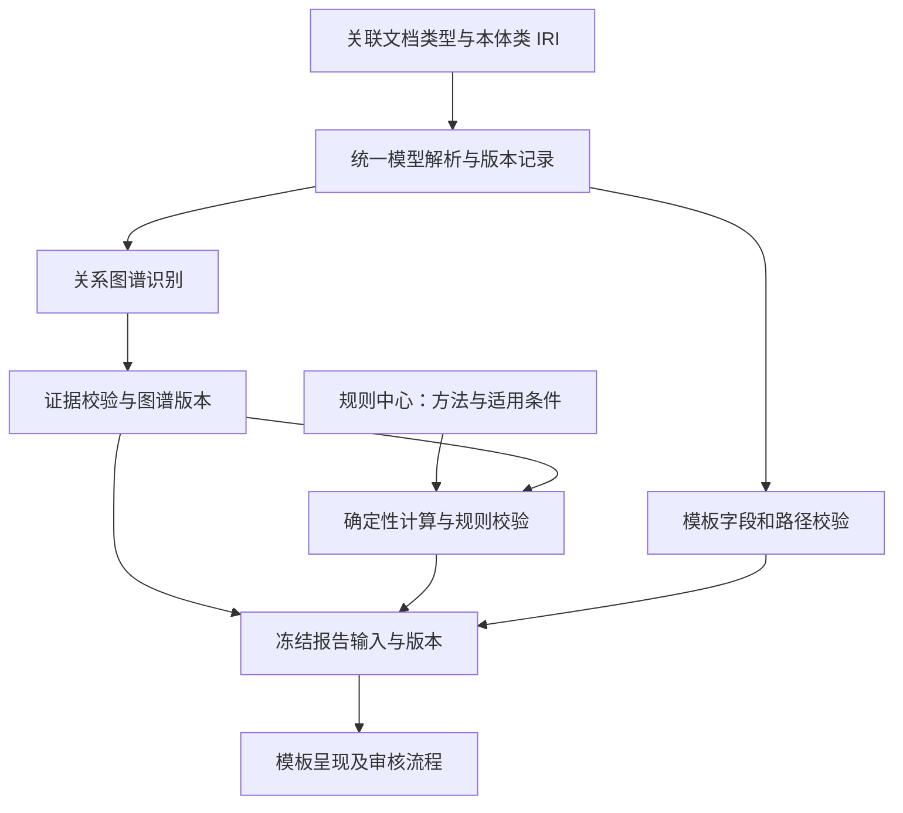

# 模板契约、本体版本与声明式规则：职责及界面分析

分析日期：2026-09-07。依据为当前工作区的实际代码；讨论对象为报告模板 V2、文档类型与本体类映射、报告契约登记页，以及 PDE 校验执行路径。本轮进行代码分析和设计建议，未变更业务配置或运行代码。

## 1. 结论

当前设计存在职责划分偏差：把后端的版本依赖、类型协议、规则方法、版式和工作流统一包装为“报告契约”，再将登记、填写引用和发布步骤交给模板作者。结果是用户已选择文档类型，仍要重复登记本体、选择版本、修正内部引用；系统内置的计算方法也表现为需要用户配置的资源。

应保留版本追溯、类型检查、规则适用性和真实业务审核，将能由系统确定的依赖改为自动解析。不能仅隐藏控件、删除校验，或把未知配置默认为已审核。

| 问题 | 判断 | 应保留的内部职责 |
| --- | --- | --- |
| 映射 CMCReport 后还要手动选本体版本吗？ | 常规模板编辑不应要求重复选择；系统应从统一模型服务解析并固定版本 | 类 IRI 标识类型，快照/发布版本标识该类型当时的定义；历史报告需要后者 |
| 各类“报告契约”都需要独立配置吗？ | 当前通用登记页不适合作为模板使用前置步骤，应按业务职责分散或自动生成 | 规则、工作流、版式、领域参数等语义不能由文档类型 IRI 自动推出 |
| PDE 应成为模板契约吗？ | PDE 应作为图谱上的计算/校验规则使用，方法描述由规则服务提供 | 计算方法、默认值、单位、适用条件及版本必须明确；模板无需重复登记它们 |

## 2. 实际代码中的职责重复

### 2.1 图谱识别与报告编译取得本体的方式不同

- [configured_generic_runner](../backend/app/services/extraction/local_semantic_model.py:115) 从当前本体引擎取得语义 schema；[识别入口](../backend/app/api/extraction.py:497) 从作业配置取得 `doc_class_iri`，作为 `effective_class`。这条链路不要求先登记报告本体契约。
- [GenericExtractionRunner](../backend/app/services/extraction/extraction_tasks.py:345) 已对 schema 计算 `ontology_release` 哈希，并将其放入候选和输入身份，说明版本追溯并非必须由模板作者手工启动。
- [ReportRunService.load_contracts](../backend/app/services/reporting/report_run_service.py:101) 另从 `template.ontology_release_ref` 加载已发布契约，再使用其中的 `definition.classes` 编译模板。
- [本体快照接口](../backend/app/api/report_runs.py:223) 所做的事情是读取同一个本体引擎的 classes，按内容哈希另存为报告契约。界面又要求对这份副本审核和发布。

因此，当前缺少的是本体身份、版本和报告依赖之间的自动衔接。已有文档类型映射没有被充分用于简化这条链路。

### 2.2 单次选择仍可能留下冲突引用

[本体版本下拉框](../frontend/src/components/reporting/output-template-editor.tsx:245) 只修改顶层 `ontology_release_ref`；已有 facts 绑定还保存各自的 `contract_ref.release_ref`。`syncBindingDependencies()` 只同步输入/绑定依赖，不同步本体版本。

目标迁移草稿中的 `equipment`、`product`、`production_plan` 三个绑定因此需要额外处理。编译器会检查引用一致性，并可能报告 `ONTOLOGY_RELEASE_MISMATCH`。

要求用户编辑三处 JSON 是当前实现的操作补救，不能作为正常产品流程。更合理的做法是让绑定继承模板的模型环境，在编译产物中解析为实际版本。

### 2.3 PDE 已自动用于图谱，又被要求在模板中声明

当前图谱列表执行路径为：

`list_evidence → job_calculations → evaluate_candidates → apply_decisions`

见 [evidence 列表](../backend/app/api/evidence.py:224)、[计算读取](../backend/app/services/reasoning/calculation_review.py:32)。读取图谱即可基于已校验、已确认的实体、关系和属性计算 PDE；不依赖用户在报告契约页创建计算契约。

报告侧则通过 `TemplateV2.calculation_checks` 再声明检查。[模板编译器](../backend/app/services/reporting/template_compiler.py:688) 对 CMC 来源强制要求该条目，缺少时提示用户去模板配置中启用。[报告解析](../backend/app/services/reporting/report_snapshot.py:27) 又调用 `execute_checks()` 执行并冻结计算校验。

图谱当前值与报告冻结快照需要分别检查，以免未发布的参数变更进入报告；这个校验职责有必要。需要消除的是模板作者对同一个内置规则的重复声明，以及计算适用性分散在界面、模板编译器和计算器中的问题。

## 3. 文档类型映射能确定什么

`CMC 报告 → https://ontology.pharma-gmp.cn/slpra/drug-development/CMCReport` 确定了语义根类型。在已经加载的本体模型中，系统可以沿关系路径取得关联类、属性、类型和约束，用于识别和模板取数。

该 IRI 本身不包含以下信息：

- 使用哪一次模型修订；同一个 IRI 的属性、范围和约束可以发生变化。
- 选择哪份源文档、哪个具体实体、哪个研究批次和适用时间。
- 报告需要展示哪些字段、以什么布局呈现。
- PDE 的默认体重、因子取值规则、差异阈值以及方法适用条件。
- 谁实际完成了审核或签署，以及该决定针对哪一个报告内容版本。

因此，建议保留“选择关联文档类型”作为用户入口，由系统自动完成模型解析。创建模板编译产物时固定模型依赖；识别任务和报告运行保存实际使用的模型与事实版本。遇到不兼容的模型升级时，展示具体受影响字段和迁移操作，而非要求作者日常复制哈希。

本体发布仍应由已有本体管理流程承担。自动生成快照表示对已确定内容建立可追溯身份，不表示将未审核模型自动认定为已发布。历史报告继续使用原快照；不同来源使用不同版本时需执行显式兼容性检查。

## 4. 各种契约应放到哪里

“契约”在后端可以表示输入类型、资源版本、输出类型和执行约束。保存这些元数据的必要性，不等于需要一个让模板作者选择十几种技术类型、手写 JSON 的通用入口。

| 当前类型 | 实际职责 | 建议的管理位置和用户体验 |
| --- | --- | --- |
| `ontology` | 本体结构快照 | 由本体模型发布/版本服务生成；模板中显示模型状态及升级影响 |
| `property_type`、`vocabulary`、`conversion` | 属性类型、词表、单位换算 | 优先复用本体和统一类型/单位定义；额外声明只处理本体尚未表达的语义，并归入模型管理 |
| `rule`、`condition`、`condition_binding`、`claim`、`calculation`、领域 `parameter` | 规则、条件绑定、参数和结果声明 | 归入规则与参数管理；输入/输出协议从同一规则版本生成，模板引用结果 |
| `view` | 投影、筛选、排序、关联等数据变换 | 通过模板取数配置表达；系统生成有类型、可追溯的执行计划 |
| `workflow`、`policy` | 流程记录、发布要求与签署策略 | 归入流程/审批配置；模板选择业务流程或继承组织默认，实际记录保持独立证据 |
| `style`、`static` | 版式与固定内容 | 归入模板编辑和模板版本管理；需要固定内容审核时在相应内容上操作 |
| `context`、`prompt`、`migration_review` | 运行元数据、模型调用配置、迁移审核记录 | 分别由运行环境、模型设置、迁移流程产生；技术引用不作为普通模板配置字段 |

源文档中的事实无法代替实际签署事件；本体定义存在也无法证明某个业务参数已获得确认。这些职责需要继续保留。存储上可以继续共享不可变资源、哈希和审核记录设施，产品界面无需按同一张注册表组织。

通用契约页可保留为管理员诊断入口；普通模板流程应提供“数据来源、取数字段、内容与版式、审核流程”，依赖版本在后台解析。

## 5. PDE 的定位及现有实现差距

### 5.1 方法应该保留，模板登记步骤应该消除

[calculation_contract()](../backend/app/services/reasoning/pde_calculation.py:20) 返回内置方法描述，包含公式、因子默认值、种属/周期查表、单位、阈值和结果类型。其身份为 `urn:calculation:pde-check:1.0.0`，`origin` 为 `bundled_executor`。

[契约列表接口](../backend/app/api/report_runs.py:184) 将它直接拼入结果。它不来自 `report_contract_revisions`，也不采用普通登记契约的审核/发布状态机。然而当前通用界面对选中项统一展示“以此修订为草稿起点”“确认语义审核”“发布该修订”等操作，生命周期与资源性质不一致。

方法 ID、版本和哈希仍有必要，可用于解释计算结果和重放历史报告。它们应成为规则执行元数据，界面显示为“PDE 校验 · 方法版本 · 输入依据”，无需要求每个模板登记或启用同一内置能力。

### 5.2 当前还不是通用声明式规则引擎执行

领域定位上，PDE 属于图谱上的确定性派生与校验规则。但当前 `evaluate_candidates()` 使用专用 Python 实现，并要求传入的方法描述与内置定义完全一致。

[现有声明式解释器](../backend/app/services/reasoning/interpreter.py:109) 支持类型判断、属性条件、比较和逻辑组合；它没有覆盖完整 PDE 所需的单位感知算式、因子查表和缺失值/默认值策略。将计算契约直接删除或改名，并不会自动让它进入声明式执行路径。

建议由规则中心维护唯一的方法版本，声明：适用范围、主体及关系路径、参数及单位、默认值的采用条件、因子取值和公式、差异判定、输出类型。执行层可通过受限表达式与版本固定的确定性计算算子实现，不需要用 LLM 计算，也不需要为每个模板复制一份规则。

### 5.3 自动应用与可追溯结果

规则应用应以经过校验的图谱为输入。图谱增量提交后，按变更依赖重新计算受影响实体；方法、参数、审核状态或关系发生变化时使旧结果失效。相同依赖版本可复用结果。

PDE 原文值、计算值、采用值及取值决定应分别保存，避免把派生值冒充抽取事实。图谱与报告调用同一规则服务；报告冻结方法版本、事实快照与决定记录，并检查当前输入是否存在未发布变化。

是否适用、是否必需应由业务规则和报告用途表达。目标风险评估需要的校验不能因尚未识别到参数而自动判为“不适用”或“通过”。这些语义应从模板中的硬编码 CMC 判断移到统一规则适用性与完成条件中。

## 6. 建议的执行结构

模板仍需要声明它要使用哪些业务字段、关系路径、源文档和流程记录。这些是有意义的报告设计选择。模型身份、依赖哈希、方法描述和编译协议则由系统维护。

## 7. 落地边界及验收

建议依次实施：

1. 统一文档类型、本体模型和模板来源的解析；自动建立版本引用，修复顶层与已有绑定引用不同步的问题。事实绑定继承统一模型环境。
2. 将本体、规则、流程、版式配置归到各自业务界面；已有不可变契约通过适配层继续读取。系统可确定的配置自动生成，真实业务缺口给出具体问题。
3. 将 PDE 方法和适用条件接入统一规则服务；图谱与报告共享执行能力。保留既有方法身份、计算结果和决定历史的兼容读取。
4. 移除模板作者必须手工声明内置 PDE 校验的前置步骤；服务端根据明确的适用性和报告要求建立执行计划，仍验证方法、输入单位、依赖修订及完成状态。

验收重点：选择 CMC 类型后无需访问契约登记页即可构建图谱与设计取数；保存新修订无需复制本体哈希；适用规则自动在图谱上计算并展示输入缺口/差异；参数变更准确失效；历史报告和审核决定可重放；普通页面不再为内置方法展示不适用的登记/发布操作。

当前 39 项迁移待确认事项需重新分类：本体引用和内部重复声明由系统迁移处理；尚未定义的数据来源、风险规则、批量边界及实际工作流不能整体标为已解决。界面简化应减少重复劳动，同时准确保留这些业务问题。

## 8. 基于已有文档类型映射的逐字段核对

本节补充实际模板、来源作业、已登记本体快照和编译函数的核对结果。数据库读取使用只读事务；类型推导在独立进程内执行，未运行 LLM、发布契约或修改模板。

### 8.1 已有映射和目标模板的事实

已有文档类型定义位于 [DOCUMENT_TYPE_GROUPS](../frontend/src/lib/api.ts:380)，共有 30 个类型选项；`DOC_TYPE_CLASS_IRI` 和显示标签均从这份数组派生。CMC 映射已经明确为 `https://ontology.pharma-gmp.cn/slpra/drug-development/CMCReport`。

上传时同一类 IRI 进入文档和抽取作业；模板默认源文件的上传也直接使用 [row.iri_pattern](../backend/app/api/ast_templates.py:597)。连接器通过 [doc_type_to_class_map](../backend/app/services/integration/connector_factory.py:39) 处理外部文档类型到本体类的映射。旧 `document_type_mappings` 表已由迁移 0015 删除，不应再为报告建立第三套文档类型映射。

核对模板 `f2ca301f-01f1-412f-a85f-59944445bb09`（v2.2 草稿）：

| 位置 | 实际值/数量 |
| --- | --- |
| `AstTemplate.iri_pattern` | CMCReport 完整 IRI |
| 默认源作业 `source_config.doc_class_iri` | 同一 CMCReport IRI |
| `source_slots[0]` | 唯一来源 `cmc`，kind=document，class_iri=同一 CMCReport IRI |
| facts 绑定 | equipment、product、production_plan，均为 `root.kind=source_root`，根类均为 CMCReport |
| 本体引用 | 顶层及三个 facts 绑定仍为 `unresolved:ontology` |
| 登记资源 | 已存在 1 个 published 本体快照，含 329 个类；引用为 `fd24c6b42710a694de9c2d0ec1832d33d6945990c135b1ec150dfe61a9220c48` |
| PDE 检查 | 存储的 `pde:cmc` 与 `default_checks(source_slots)` 的输出完全一致 |
| 输入定义 | 共 24 个；14 个 binding_ref 仍为 unresolved；所有 expected_type 均为空 |
| 迁移事项 | 35 个语义未确认、3 个旧 Prompt 审核、1 个范围边界问题，共 39 个 |

### 8.2 冗余配置清单及消除条件

这里的“冗余”主要指重复的人工配置。当前模型和编译器仍依赖这些字段；落地时应先建立系统解析与兼容读取，再简化界面和持久化模型。

| 配置 | 核对判断 | 已有依据和处理方式 |
| --- | --- | --- |
| 再次填写唯一来源的 `source_slots[0].class_iri` | 当前模板属于重复人工配置 | 已选择关联文档类型，默认来源明确；新草稿可由同一选择生成。多来源模板仍需分别声明来源角色和预期类型 |
| 每个绑定的 `contract_ref.root_class_iri` | 当前三个绑定可自动继承 | `scope.source_slot=cmc` 且根为 source_root，三者均等于来源类型。显式实体根、重复项根或有意义的子类限定需要分别解析，不能全局删除 |
| 每个绑定的 `contract_ref.result_class_iri` | 当前三个绑定可自动推导 | 已核对每条选定路径的终点范围唯一，并与存储值相同。联合范围或要求进一步缩小类型时仍需保留选择 |
| 逐项填写 `contract_ref.release_ref` | 重复维护同一模型依赖 | 继承模板/来源的模型环境，在编译结果中解析实际版本；不再要求作者逐项复制哈希 |
| 顶层手工选择 `ontology_release_ref`，以及为使用模板再次登记本体 | 属于可自动管理的技术配置 | 需要统一模型发布/快照解析，不能单凭类 IRI 生成版本结论。已有匹配快照应复用；版本升级和兼容性仍要检查 |
| 本体已有 primitive 类型时再次填写 `output_type`、`expected_type`、同义 `property_type` | 相同声明属于冗余，当前目标模板尚未发生这种重复填写 | 编译器已根据属性 range/datatype 推导类型；24 个输入的 expected_type 都为空。额外收窄约束仍有用途，无需为了“配置完整”填入同一类型 |
| 为已有 kg 语义重新登记数量类型 | 当前存在可避免的配置负担 | 快照已有 canonical_unit=kg；编译器尚未复用该元数据，应修复类型适配而不是让作者重复声明单位。见下一节 |
| 为已有单位/词表定义重复登记 conversion、vocabulary | 有条件冗余 | 相同语义应复用本体/统一注册定义；新单位、新词表或更严格业务限制不能由类 IRI 推导 |
| 每个 CMC 模板手工启用并填写 `calculation_checks` 中的 PDE 方法 | 当前属于可自动生成的配置 | 实际存储值与后端 default_checks 输出完全一致。由规则适用性生成检查计划，继续执行现有必要性、版本和输入检查 |
| 对内置 `urn:calculation:pde-check` 进行普通契约登记、审核、发布 | 不适用的人工操作 | 它由代码返回且 origin=bundled_executor；方法治理应在规则服务中完成，普通模板仅查看方法和结果 |
| 手工重复列出可从输入引用展开的绑定依赖 | 应自动维护依赖闭包 | 现有 syncBindingDependencies 已处理部分场景；内容允许引用的输入仍需明确，不能删除授权边界 |

三个关系终点的实际核对如下。这里推导的是作者已经选择的路径终点，**并不表示系统可以自动决定报告应该选择哪条路径**。

| 绑定 | 已选关系路径（起点均为 CMCReport） | 本体唯一终点 | 存储值是否一致 |
| --- | --- | --- | --- |
| equipment | usesEquipment | Equipment | 是 |
| product | describes | DrugProduct | 是 |
| production_plan | hasProductionPlan | ClinicalSampleProductionPlan | 是 |

### 8.3 已有类型信息未接入执行路径：kg 的隔离验证

当前 [本体集成定义](../ontology/slpra/slpra-integration.ttl:79) 显式声明两个批量属性的 canonicalUnit 为 kg。已发布快照也包含该字段，来源不是字段名称后缀推测。

对真实快照调用 [Compiler.projection_type](../backend/app/services/reporting/template_compiler.py:279)，得到：

| 属性 | 本体 datatype | 本体 canonical_unit | 实际推导类型 | 推导单位/量纲 |
| --- | --- | --- | --- | --- |
| plannedBatchSizeMin_kg | decimal | kg | decimal | 均为空 |
| plannedBatchSizeMax_kg | decimal | kg | decimal | 均为空 |

这两次局部类型推导没有返回诊断。原因是当前编译器从 range/datatype 构造 primitive 类型，没有把 canonical_unit 与现有单位注册表组合为 quantity 类型。

因此，“kg 数量类型重复登记”可以通过正确复用模型消除；“批量上下界是否包含、如何从同一计划取值”仍是独立语义，不能随单位问题一并默认解决。修复还需检查数量值解析、类型兼容和报告呈现，不能仅隐藏属性类型选择框。

### 8.4 不能误判为冗余的配置

| 配置 | 保留原因 |
| --- | --- |
| 实际源文档/作业、来源槽位身份、来源角色 | 类型相同不代表同一份数据；多文档、外部记录和源文件角色不能由一个类 IRI 决定 |
| 作业保存的 doc_class_iri、候选保存的 ontology_release | 属于执行记录；不能在模板改类型后自动覆写历史作业 |
| 关系路径、属性投影、显示字段 | 同一 CMC 类型存在多条关系和众多属性，报告必须选择其实际需要的内容 |
| 主体、研究/批次、时间、跨来源关联、范围与完整性要求 | 本体描述允许的结构，不能单独决定本次数据选择和报告材料要求 |
| 版式、正文、标题、列顺序、显示格式 | 属于模板表达，文档类型映射不能唯一确定 |
| 风险规则、PDE 默认值/阈值及适用条件 | 需由明确的方法和业务规则提供；应迁移管理位置，不能删除语义定义 |
| QA 意见、审核结论、实际签署记录 | 需要对应的业务记录和内容版本，本体存在该类或属性并不代表流程已完成 |
| 本体未声明的类型收窄、词表或约束 | 这是新增语义，应在模型/规则管理中明确后供模板复用 |

“IRI 匹配键”目前是 disabled/readOnly 的派生显示，没有独立编辑入口，不应计为第二份人工配置；可以改为更清晰的语义类型说明。前端标签表与 IRI 表从同一数组派生，也不是三套独立配置。连接器的外部类型映射解决外部系统编码问题，不能因为模板已有 CMC IRI 就将其全部删除。

### 8.5 实际版本差异证明：版本记录必须保留

候选读取发现目标源作业的 83 条候选并非全部记录同一模型哈希：

- 67 条记录 `1bcda9be80f290dd6816724a3a78d423ad87f7ba9543dbd81b405696c43ea9f7`。
- 16 条记录 `77512d3e8a4c81d0bd88d6cb8d37556182f5720d4a534fbcd528b2892aaedcb2`，与当前已发布快照 classes 的哈希一致。

这说明相同文档类型 IRI 与多个版本记录确实同时存在。它不能单独证明候选不兼容，但足以说明不能将“取消手工版本配置”实现成“忽略版本、全部按当前模型解释”。自动衔接需要保留原记录，并对模型依赖执行兼容检查。

隔离验证结果保存于 `/tmp/template-redundancy-audit.json`，包括两个属性的类型推导、候选版本计数，以及 PDE 存储配置与自动配置相等的结果。本轮未对 39 项迁移事项作自动审核；14 个 unresolved 输入仍需确认其字段、来源或流程语义。

## 9. 实施结果（2026-09-07）

本节记录本轮已实施内容；前八节保留分析时的现场事实，不代表实施后的界面和执行行为。

### 9.1 模型与来源统一解析

- 新增 `ontology_model_context.py`，识别任务保存实际 runner 使用的语义结构，人工补录和补充识别也记录对应模型。新增 `ontology_schema_snapshots` 不可变表，以 classes 内容哈希寻址；迁移 `0030_model_snapshots` 已在当前数据库执行，回填已有本体契约的结构内容，不创建审核决定。
- 已有 `ontology_release` 增加 `semantic_snapshot_ref`。模型发布成功投影后关联结构快照；投影失败不能将旧运行时结构误认为本次已发布内容。捕获快照显示 `captured`，仅关联真实发布批次后显示 `published`。
- 创建模板、保存修订、编译、数据预览和覆盖检查共用自动准备服务。自动引用优先复用结构相同的已发布本体契约；显式填写的错误引用仍报错。普通设计不再要求去契约页复制模型哈希；尚未发布的模型可用于设计校验，不能直接发布正式模板。
- facts 绑定继承 `template.ontology_release_ref`；source_root 可以从来源类型继承，唯一关系终点可以自动推导，编译产物记录实际版本与类型。联合范围、显式主体和子类收窄继续校验。
- “关联文档类型”和模板来源共用编辑状态，通过新修订保存；服务端拒绝只 PATCH 类型元数据造成 schema 脱节。切换主要来源类型时，新修订不继续绑定旧类型的默认源文件；原作业与原模板保持原记录。
- 报告冻结来源时核对候选保存的模型版本：相同、兼容、不兼容和未知分别记录。兼容比较包含取数及规则所用的类型、关系、单位和约束；未知历史结构不会被重新标记为当前版本，不兼容或未知来源会阻止相关取值及报告完成。

### 9.2 类型、变换与业务配置

- 编译器升级为 `output-compiler-v2.2`，将本体 numeric primitive 与 `canonical_unit` 合成为 quantity，并检查显式声明的额外类型约束。取值执行单位换算，呈现保留单位；新增用例验证 `1500 g → 1.5 kg`，覆盖实际取值、浏览器正文和 Word 输出。
- 模板的数据变换可使用自动推导协议，选择的投影、筛选、排序、分组、关联、范围与换算操作生成有类型、有哈希的执行计划，并冻结到报告。旧的 unresolved view 引用可通过这一适配层编译；显式登记的历史 view 仍兼容读取。
- 范围上下界必须由业务确认，不能随 kg 类型自动解决；界面提供“包含／不包含／待确认”。新单位换算定义、规则参数、来源范围和真实工作流仍需有效依据。
- 版式可在模板中直接编辑；提供标准版式及要求 QA 审核、材料就绪的系统流程方案。系统方案不生成 QA 意见或签署记录，历史自定义策略继续有效。

### 9.3 统一规则服务

- 新增 `reasoning/rule_service.py`，方法目录声明适用根类型、关系路径、参数、单位、默认值、公式及版本，调度固定版本的确定性 Python 算子。它是可复用的图谱规则执行入口，本轮没有将 PDE 伪装为已有比较 DSL 可以直接执行的算式。
- 图谱计算读取、证据新增／审核／合并后的依赖刷新，以及报告冻结校验，共用此服务。按实体及实际方法、参数、审核状态、绑定和证据依赖缓存数值计算；无关字段变化不会触发数值重算，关系与重复实体检查每次重新核对。
- 服务端根据来源类型自动生成必需检查，模板无需手工勾选 PDE。识别未完成、缺参数、未发布变化及未处理异议继续阻止报告完成。变更来源类型会重建标准自动计划，保留另行命名的显式检查要求供校验。
- 方法引用 `urn:calculation:pde-check:1.0.0` 及其定义哈希不变。原文值、派生值、采用值、决定历史继续分开保存；当前决定在每次读取时应用，历史报告按冻结方法和输入重放。缓存仅在进程内复用，不替代审计记录。

### 9.4 界面与目标模板

- 模板页改为“数据来源与模型”“内容与版式、审核流程”；高级来源范围和真实迁移问题继续保留。
- 新增 `/settings/graph-rules`，展示规则方法、适用条件、参数及版本依据。`/settings/report-contracts` 改为管理员依赖管理与诊断，按模型、规则参数、流程、模板及技术诊断分组。内置计算和系统方案不显示普通草稿／审核／发布操作。
- 为原目标 `f2ca301f-01f1-412f-a85f-59944445bb09` 创建新草稿 **v2.3**：`15a09e73-8b88-4b7f-a63a-9330f4285918`。已自动固定到原先真实发布的本体 `fd24c6b42710a694de9c2d0ec1832d33d6945990c135b1ec150dfe61a9220c48`，三个 facts 绑定继承此版本。
- 真实编译已能推导 `batch_bounds.lower/upper` 为 `quantity / kg / mass`，并生成范围变换协议。编译诊断中已没有本体 unresolved、版本不一致、缺少 view 契约或必须手工启用 PDE 的阻断。
- **新草稿尚不能发布。** 原有 39 项迁移事项未被自动审核；14 个未确定的输入绑定、批量边界、两个签署区域与一个实体显示属性仍需要真实配置。两种候选模型哈希保持原值；缺少历史结构的版本不能由本轮实现自动证明兼容。

### 9.5 验证与运行记录

- 后端全量回归：1192 passed、9 skipped；这 9 项 PostgreSQL 测试已在独立数据库执行并全部通过。末次边界修订另行通过报告／规则／模型发布的专项回归。
- 前端：29 项 Node 测试、TypeScript 检查及生产构建通过。浏览器用例覆盖模板保存、元数据与版本切换、图谱查看、取数菜单、报告预览及审核限制。
- 迁移已先在由当前 0029 数据库备份恢复的独立 PostgreSQL 副本上验证，再升级当前库；包括已有快照回填、并发捕获不回滚调用者事务、SQL 不能改写模型快照。历史空库迁移链的建表重复问题不通过 stamp 绕过，也不混入本次 0029→0030 升级。
- 数据库备份：`/tmp/ontology-model-responsibility-20260907.dump`；本轮源码基线：`/tmp/ontology-responsibility-before-20260907`；目标修订与真实编译结果：`/tmp/model-responsibility-target.json`。
- 部署前对正在执行的识别作业请求暂停并等待断点落盘，更新后按原断点恢复；目标模板的已暂停来源未重新调用 LLM。
