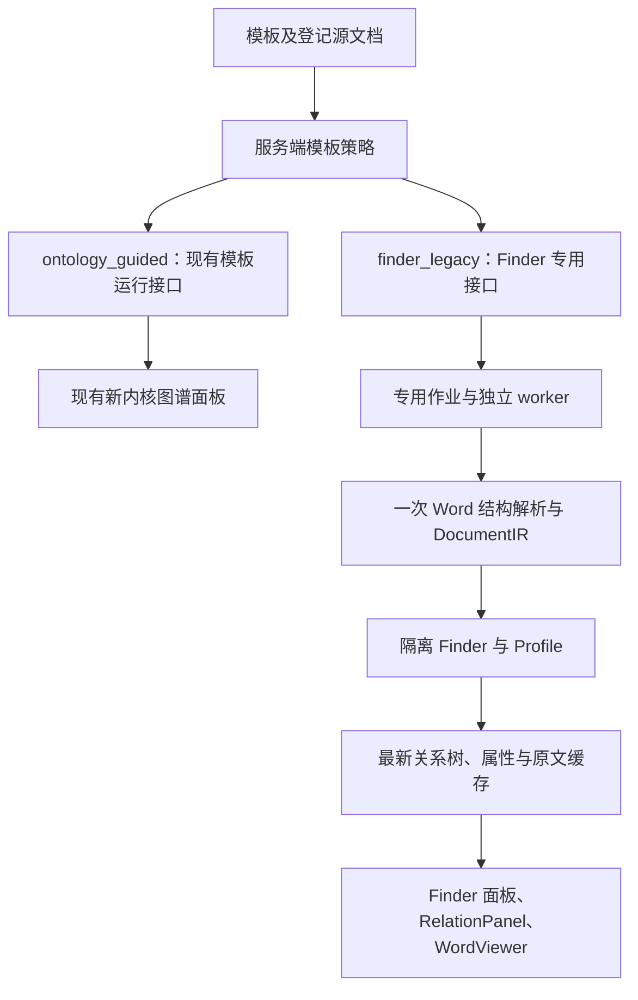

# 模板级 Finder 图谱演示实施方案

日期：2026-09-14。状态：隔离执行、模板/报告中心入口及本地工程验证已实现；实际模板绑定与原件验收待材料。详见 [025 验证记录](../specs/025-template-finder-demo/validation.md)。

2026-09-14 报告兼容补充：用户进一步提出原 Slot 语义、源图谱与外部 Mock 没有接入 V2，导致 AI 行文和报告预览不可用。核查与设计见 [Slot 语义与本体指引1.0报告结果兼容方案](Slot语义与本体指引1.0报告结果兼容方案-20260914.md)。该文为待实施扩展；下文“仅展示、不进入报告生成”仍描述本方案已实现的范围，结构分析入口恢复也不代表报告兼容已经完成。

## 1. 已确认需求与交付范围

用户已选择[可行性分析](Finder双模式演示可行性分析-20260914.md)中的隔离移植方案：**在当前应用内，对指定模板恢复真实 Finder 图谱、属性和原文展示；其他模板继续现有本体指引流程。**

本期交付包括模板级模式分流、Finder 执行、关系树与属性、端点/属性的原文定位，以及对应的创建、读取和重新识别操作。V1 模板也可使用独立的源文档展示入口，模板定义本身保持现有只读语义。

报告中心作为源文档图谱入口，同步支持上述模式分流，并与模板页复用同一个 Finder 执行和结果。V1/V2 是模板协议版本，Finder/本体指引是识别模式，不能将二者绑定为同一个版本开关。

Finder 本期处理 Word 源（`.docx`；`.doc` 沿用现有转换入口）。指定 Finder 模板上传或选择其他源类型时，在写入/执行前明确拒绝；不扩展 Excel Finder，其他业务原有 Excel 能力保持不变。

本期不恢复旧报告生成、覆盖补抽、风险计算、PDE 裁决、候选审核或事实提交，不部署第二套旧应用。Finder 结果不进入这些业务操作。指定模板 ID/修订、原件和关键展示项尚待提供；这些材料决定移植哪些 Finder，不影响本方案的接口和边界设计。

## 2. 采用的方案

| 决策 | 本期选择及需求依据 |
|---|---|
| 模式配置 | 模板详情页按当前修订保存引擎及 Finder profile；未设置时使用服务端指定模板绑定，其余默认为 `ontology_guided`。按用户补充需求增加选择界面和两个可空模板字段 |
| 分流位置 | 模板业务入口；新内核内部不增加 Finder 开关，保持非指定模板现有流程 |
| Finder 算法 | 从 `b6f9bd4e55822e20dce0a2ef0fa8f6d9fdd472c1` 移植实际需要的 Finder/Profile 和受限转换 |
| 结构与原文 | 复用同一次 `analyze_word_core` 的结构和 DocumentIR，供 Finder 取数及 WordViewer 展示 |
| 模型依赖 | 本期 Finder 路径不调用 NER、LLM、摘要或精排；指定策略以显式文档类型、Profile 和确定性 Finder 执行 |
| 执行状态 | 复用专用 `ExtractionJob + AnnotationExecution`，独立小 worker，只保存当前执行头；不创建第三套运行表 |
| 展示存储 | 复用已登记原件，每个 Finder 专用作业只保存一份最新展示缓存；执行期临时文件用于固定当次字节，不保存历史快照 |
| 交互 | 上传只登记，点击“开始本体指引1.0识别”启动；完成后可“重新识别”；复用当前流程的暂停/继续能力仅适用于当前本体指引模式 |

旧 Finder 中 `ctx.triples` 的消费位于未注册到基线策略表的 `find_drug_product`，实际 DrugProduct 入口优先采用 Profile。旧 NER 是完整历史管线的前置步骤，不是当前拟恢复策略的必要输入。实施阶段仍需按目标策略闭包核验；若目标超出此范围，应先报告缺口，不自动启动完整旧模型管线。



## 3. 模板选择与入口分流

### 3.1 模板引擎设置与部署绑定

高级分析师可在报告模板详情页的「关系图谱识别引擎」中选择「文档结构解析＋本体指引」或「本体指引1.0」，并显式保存。V1/V2 共用设置入口，与模板结构版本、发布状态无关。Finder 仅列出支持当前文档根类的内置配置；静态演示模板不提供此切换。

页面设置保存在当前模板修订的 `recognition_mode`、`finder_profile_id` 两个可空字段中，优先于下述部署绑定。未保存页面设置（字段为空）时才读取文件。保存本体指引可以覆盖原 Finder 文件绑定；不修改该文件。迁移为 `0041_template_engine`。

保存只更新引擎元数据，不启动、取消或清除识别任务/结果，不修改模板结构、hash 或发布状态。已有任务保持原执行域；模板页与报告中心刷新当前模式，切回同引擎可沿用仍有效的缓存。接口使用高级分析师权限、条件更新及现有审计，过时设置返回 409 并提示刷新。

服务端配置路径 `template_finder_config_path` 默认读取项目内的空绑定配置。文件保存确切模板 ID、预期文档根类和 profile 引用，结构如下：

```json
{
  "bindings": [
    {
      "template_id": "<待指定的模板 UUID>",
      "root_class_iri": "<该模板的文档根类 IRI>",
      "finder_profile": "<已移植的 profile ID>"
    }
  ]
}
```

profile 单独保存基线提交、版本、所需策略和本体执行提示；从基线提取，保留可核对的来源。不支持上传任意脚本、动态 Python 导入、联网下载配置或任意文件路径。旧正则及 `number_pattern` 等受限转换只在隔离模块中执行，当前本体加载器和通用 transforms 的拒绝逻辑继续生效。

模板 ID 对应具体修订：另存新修订产生新 ID 时不会自动继承 Finder，需在页面重新设置或显式加入绑定。执行时还保存当次模板内容 hash，以覆盖历史模板可能原位修改的情况。`schema_version`、`iri_pattern`、`template_default` 和 `demo_profile` 均不复用为算法开关。

配置未命中时使用当前模式；已命中的配置失效、profile 缺失或 IRI 不合法时返回配置错误，不静默切换算法。带静态 `demo_profile` 的模板与 Finder 绑定冲突时明确拒绝，不能将已有静态演示悄悄改成真实抽取。

模板响应中的 `recognition_mode` 和 `finder_profile_id` 始终返回按上述优先级解析的有效设置。引擎设置通过独立的 GET/PATCH `/{template_id}/recognition-engine` 管理，不写入 V2 输出 schema，不参加报告编译；接口详情见 [025 契约](../specs/025-template-finder-demo/contracts.md)。

### 3.2 必须覆盖的入口

- **默认源上传**：Finder 模板只保存原件和源作业，跳过当前 `_enqueue_annotation`，不将未派发作业标为正在识别。其他模板保留现有行为。
- **当前模板运行创建**：对 Finder 模板返回 `RECOGNITION_MODE_MISMATCH`，引导使用 Finder 端点，防止直接调用新接口绕过模式。
- **旧标注新增执行**：start/rerun 及尚无执行头的 continue 优先采用本次经过服务端校验的显式模板；未明确模板时才使用源登记的 `template_id`，不让之前任务写入的 `recognition_template_id` 改变路由。命中 Finder 时拒绝进入通用标注；显式正常模板不因原始源所属模板是 Finder 而被误拒绝。
- **已有任务继续**：沿用原任务已固定的执行域，不因模板新配置变为 Finder 就改写原运行或切换算法。历史执行头缺少 `recognition_mode` 时仍按既有 generic 路径处理；新增字段不能覆盖 `options.mode` 现有 start/resume 等操作语义。本期不自动取消已有任务；Finder 专用作业始终不能进入旧 resume。
- **共享源文档**：模式属于模板上下文，不修改原始源作业的全局算法属性。另一个正常模板可以继续使用同一原件；Finder 使用自己的执行作业。
- **读取**：历史新运行按原身份继续读取和控制，但 Finder 模板面板不会把它当成本次 Finder 结果。GET、刷新和切换模板均不派发任务。

## 4. 后端移植与状态保存

### 4.1 模块划分

以下模块已实现；具体行为和验收结果见 025 规范。旧词汇保存在隔离 profile 中，不建设插件框架。

| 文件/目录 | 职责 |
|---|---|
| `backend/app/services/template_finder/policy.py` | 读取模板绑定、校验 profile、解析模式 |
| `backend/app/services/template_finder/finders.py` | 移植指定策略与关系树组装，在实际取数点携带坐标 |
| `backend/app/services/template_finder/profiles.py` | 所需 Profile 定位器及受限转换，不导入退役的全局 Profile/变换入口 |
| `backend/app/services/template_finder/runner.py` | 接收 WordAnalysis、显式文档类型、只读本体视图和 profile，执行目标策略 |
| `backend/app/services/template_finder/sources.py` | 原始位置转 EvidenceAnchor，区分原文、档案、计算值及未定位出处 |
| `backend/app/services/template_finder/service.py` | 源登记校验、专用作业、当前执行状态、独立 worker 和缓存发布 |
| `backend/app/services/template_finder/profiles/` | 版本化配置及绑定；外部演示档案仅在目标展示确有需要时加入 |
| `backend/app/schemas/template_finder.py`、`backend/app/api/template_finder.py` | Finder 专用响应和端点 |

本体读取通过小范围只读适配完成：复用当前类、合法属性及关系菜单，把 profile 中的旧 hints/patterns 提供给 Finder。运行开始时在当前本体读锁保护下取得本次所需菜单和值约束，在内存中固定它们并计算 hash，避免一个任务混读变更前后的本体；无需保存整套历史本体。

不恢复旧 `ontology_engine.py` 或整份 integration TTL。当前本体不再允许的类/谓词应在运行前报错，不能为了补齐演示关系反向修改权威定义。Profile 只决定在原文何处、按何种固定算法取数，配置中的例子不作为待填属性值。

设备/车间等旧档案补充按目标清单决定是否需要；若需要，收敛在隔离目录的单一档案适配文件中。报告侧 APS、小组、风险规则及报告期富化均不属于本次移植。

基线 `extract_relationships` 尾部主动调用 `_attach_pde_conflict` 和 `enrich_equipment_facts`，不能整段照搬。新 runner 明确移除 PDE 冲突计算及 `detect_pde_conflict` 依赖；设备富化只在目标清单确有要求时调用隔离档案适配。

### 4.2 复用执行头，独立执行内容

专用 `ExtractionJob.source_config.mode = "finder_template_demo"`，保存服务端 owner、模板 ID、原始 `source_job_id` 等绑定。模板的 `default_source_job_id` 仍指向原始源，不替换成内部 Finder 作业。

内部作业 ID 按服务端固定 namespace、owner、模板 ID、源作业 ID 和 Finder 模式生成确定性 UUID，利用现有主键防止重复创建。只为这组输入维持一个当前作业；profile/原件更新后，下一次显式执行更新其当前身份，不建立历史回放。

独立 worker 仅复用 `annotation_execution.py` 的 `claim / begin_worker / WorkerLease / fence`。**不复用 `_claim_annotation` 或 `_annotation_worker`**：它们会操作旧检查点、候选与证据存储。Finder worker 只解析、运行 Finder、验证出处并发布展示缓存，绝不调用 `_persist_evidence_payload`、CandidateStore、FactCommitService 或本体写入器。

`AnnotationExecution.options` 保存当前请求的模式、profile/hash、模板/hash、源 hash、公开执行 ID 和最近请求键；`progress` 保存阶段与计数。公开 `execution_id` 与内部 fencing token 分开生成，不通过 Finder API 暴露内部令牌。

当前公开状态为 `not_started / queued / running / completed / failed / interrupted`，阶段为解析、Finder 识别、整理展示。完成仅表示此次配置的 Finder 执行结束，不表示全文完整覆盖或通过新内核核验。异常明确失败；进程中断按现有租约暴露 interrupted，用户可重新识别，本期不新增自动恢复、细粒度暂停、历史回退或请求历史账本。

### 4.3 最小存储与发布

`data/template-finder/<private-job-id>/latest.json` 包含同一次解析的正文/IR、章节树、图谱和属性出处；不再另存一份全量运行状态或永久原件副本，也不使用旧 `<source-job>.annotated.json` 或新 DocumentAnalysisRun 的制品目录。

创建执行时登记原件 hash，worker 读取原件字节并校验后写入执行期临时文件，Finder 与正文转换均使用该文件，结束后删除；临时文件由 worker 管理，不随 HTTP 请求返回而删除。若原件已变更则终止本次执行，要求重新识别；已完成结果的原文展示来自同一份最新缓存，无需再次打开可变原件。

新执行清除上次结果的“当前可用”标识；发布使用临时文件、原子替换及既有 fence，缓存头与数据库保存相同 execution ID/hash。读取发现不匹配时返回结果不可用，不能显示另一轮结果。临时文件不是历史制品。

专用作业必须从普通 `/extraction/jobs` 列表过滤，普通详情、进度、候选、标注、报告入口拒绝访问其内部作业 ID；Finder API 按当前 owner 读取。现有 `get_job` 和列表没有这项过滤，必须随复用表一起补齐。

## 5. 接口契约

复用当前鉴权依赖，写操作沿用 `senior_analyst` 门禁；源文件必须是该模板默认源或模板可选择的已登记、当前用户可读文档。客户端不能提交文件路径、owner、Finder 函数名或任意候选结果。

公共 `source_job_id` 必须指向真实源登记，拒绝用内部 `finder_template_demo` 作业再次作为源。启动和无执行的正文预览检查原件存在；匹配 execution 的 graph/source 读取只检查 owner、登记读取授权和当前缓存身份，不要求原件仍存在，也不因模式配置改变而重算结果。若授权或登记被撤销则拒绝读取，原件缺失本身不等于授权撤销。

以下接口均以 `/api/ast-templates/{template_id}/sources/{source_job_id}` 为前缀。

| 请求 | 行为 |
|---|---|
| `GET /finder` | 当前用户的当前状态；无作业返回 `not_started`；不创建作业、持久文件或模型任务 |
| `POST /finder` | `{request_key, expected_execution_id}`；首次 expected 为 null，重新识别携带刚读到的 ID；返回 202 执行回执 |
| `GET /finder/graph?execution_id=...` | 返回同一 execution 的关系树、属性及出处；执行未完成时不把空数组解释为识别成功 |
| `GET /finder/source` | 无执行时只解析登记原件供预览；携带 execution ID 时只读对应当前缓存的正文、IR、章节和分页信息 |

响应统一包含模式、模板/源作业标识、公开 execution ID 及输入身份。创建任务时对源字节计算 hash；graph 与 source 响应具有相同的 document/structure/parser 身份。Finder worker 完成前不提供增量图，页面只轮询轻量状态，完成后各取一次 graph/source。

幂等与并发在短事务中完成：确定性插入内部作业后锁定当前作业/执行头，先比较最近 `request_key + request_hash`，再检查 `expected_execution_id`，最后 claim。同请求重试返回当前回执；同键不同输入、过期执行 ID、活动任务期间的另一次启动均返回 409。最近键随新执行替换，过时请求凭旧 expected ID 拒绝，不为读取历史请求保存账本。

模板内容、源文件、profile 或当前本体身份变化后，已有结果标为过期，只有其匹配的执行来源仍可在授权范围内查看，不能冒充新输入的结果。重新识别更新当前执行。读取/启动失败采用明确的源缺失、模式冲突、配置失效、输入版本冲突和执行失败错误，不静默走其他算法。

## 6. 图谱、属性与原文展示

### 6.1 同源结构和锚点

使用 `analyze_word_core` 得到一次 WordAnalysis，再调用已有 `annotate_word` 的 `structure_only=True, rich_style=True` 分支，并传入同一 `structure` 和 `ir`。该分支允许 `engine=None`，跳过 NER。这里复用结构到展示的转换，绝不先调用完整旧标注管线。

每个端点和每个属性增加 Finder 专用 `source`，包含 `kind`、来源说明、`anchors[]`，以及适用的原始值或档案记录引用。kind 区分 `document / external / computed`；无法定位时 anchors 为空并明确显示“未定位”。不把它包装成新内核的证明/审核状态。

| 取数情况 | 定位处理 |
|---|---|
| 段落原文 | 保存实际段落、匹配偏移；通过 IR fragment 与 paragraph offset 映射成 anchor |
| 表格/合并单元格 | 保存实际 table path、原始行列及 source cell，定位单元格中的实际段落 |
| 多章节/多张表提供同一对象属性 | 每个属性独立保存来源；如工艺条件来自工艺表、收率来自收率表，不沿用对象的单一出处 |
| 多处拼接、步骤编号或生成标题 | 保留输入出处及 computed 标识，不声称生成值逐字出现在原文 |
| 设备档案等补充 | 标示档案/演示数据源，不在原件中搜索同值制造锚点 |
| 只有旧字符串“§ 简介”等 | 仅显示来源说明；不得按标题或数值全文匹配后跳到第一个命中 |

Finder 在取数处携带真实坐标，由 `DocumentIR.anchor/resolve` 校验，然后交给 `WordViewer.activeAnchor`；不使用旧 `highlightRef` 的关键词回退作为准确定位路径。多出处显示简短列表，逐项点击定位。端点出处证明“取数来自这里”，不宣称其父子关系已经通过新内核核验。

### 6.2 前端最小改动

新增 `use-template-finder.ts` 和 `finder-document-graph-panel.tsx`，处理 Finder 状态、启动、结果和来源选择。复用 `RelationPanel` 的树形布局；仅增加可选的节点/属性来源回调及来源标签，未启用 Finder 的调用方保持原行为。属性目前只有值展示，必须补来源按钮。

V2 模板源文档页按服务端模式装配对应面板：Finder 模板禁用 `useTemplateDocumentRun` 请求，使用专用 Hook；普通模板维持新面板。正文与图谱均来自同一 execution；query key 包含用户、模板、源、模式及 execution ID，切换时清空选区并取消旧请求，迟到响应不能覆盖新选择。

V1 模板保留只读定义页，增加 Finder 源文档区，复用上述 Finder 容器、源选择/上传及 WordViewer；不重新启用旧 Slot 编辑和报告操作，也不要求先迁移 V2 才能展示图谱。

Finder 面板显示“本体指引1.0”、当前阶段、节点/属性数量、“开始识别/重新识别”和出处状态。不给 Finder 结果显示“系统核验通过”“已人工确认”或全文 coverage 百分比。报告中心的源文档展示读取 Finder 缓存；报告生成服务继续使用原有契约，不消费这份图谱缓存。

### 6.3 报告中心同步分流

当前报告中心混合展示上传文档和已生成报告。上传 Word 详情先经过 `BatchDemoWorkspaceGate`，普通 Word 再进入 `ReportWordWorkspace`，后者固定调用 `useReportDocumentRun(documentIri)` 和新图谱面板，尚未携带模板上下文。其 `report-document-origin-v1` 与模板运行的 origin 不同，不能假定两个页面已经共享识别结果。

报告中心按操作区分：

| 操作 | Finder 模板上下文 | 当前本体指引上下文 |
|---|---|---|
| 正文、目录、图谱和属性 | 同次 Finder 缓存、关系树和属性出处 | 现有文档运行、图谱和 run-owned 原文 |
| 开始/重新识别 | 调用模板页同一 Finder 服务 | 现有运行创建入口 |
| 暂停/继续及新图专用复核 | 按本期 Finder 能力不提供 | 保留现有能力及角色门禁 |
| 打开、刷新和页面切换 | 只读当前结果 | 只读当前结果 |
| 历史生成报告预览/下载 | 按历史报告自身身份与制品读取，不由当前图谱模式改变 | 同左 |
| 新报告生成 | 本期不支持消费 Finder 图谱；已有其他合格来源须通过独立的现行报告流程选择 | 仍检查 V2 模板及合格报告来源，不能只凭新图可见就生成 |

V1 模板可使用 Finder 图谱展示，V2 模板也可显式配置 Finder；V2 并不意味着必须走本体指引。页面显示模板版本和识别模式两个独立信息，优先使用“本体指引1.0”“本体指引识别”等可理解的名称，不用含糊的“V1 分析/V2 分析”。

报告中心需要一个轻量只读上下文解析入口，拟为 `GET /api/ast-templates/recognition-context?document_iri=...&template_id=...`（template_id 可选）。复用文档登记解析，返回原始 source_job_id、可选择的模板上下文及服务端解析的模式，不解析模型、不创建任务，也不要求先打开原件文件：

1. 从模板页进入报告中心时携带确切 template_id；服务端核对模板、源登记和文档类型，不能信任 URL 自带的模式或源作业 ID。
2. 从报告中心直接打开时，优先采用经核验的明确登记关联。只有唯一有效关联时才自动选中；仅同类型或模板名称相近不能当成真实绑定。多个可选上下文需要用户选择，读取页面不会擅自启动其中任何一种任务。
3. 没有模板关联时保留现有普通文档分析；需要 Finder 时显式选择可用的指定模板。选择仅改变当前页面上下文，不修改源文档全局模式。
4. Finder 模板页和报告中心共用 `(owner, template_id, source_job_id)` 的专用作业及 execution ID。页面来源、document_iri 不加入新的任务身份；任一页面启动后，另一页面只需读取该结果，不能重复创建。
5. 明确选中 Finder 时，不挂载普通新运行 Hook 或静态图谱分支；已明确的静态演示上下文维持其静态行为。当前 `BatchDemoWorkspaceGate` 不能仅因原件命中静态数据就抢先覆盖已经选择的 Finder 上下文。
6. 顶部/列表操作菜单与正文工作区共用同一模板上下文和能力集合。识别、重新识别按钮发往同一入口；进入 Finder 展示不能隐式拉取风险生成计划、PDE 裁决或候选审核数据。“生成报告”不能被解释为可使用刚展示的 Finder 图谱。
7. 分享/深链携带模板上下文，刷新后仍由服务端复核；接收者按自己的 owner 读取，不因分享链接继承他人的私有执行权限。切换上下文清空原文选区并取消旧查询。
8. 报告中心现有 `POST /api/document-analysis/documents/runs` 增加可选 template_id 上下文校验；明确选中 Finder 时返回模式冲突并指向 Finder 接口，不能仅靠前端隐藏按钮。没有模板上下文的普通文档请求保持其独立执行域，本期不合并普通模板运行与报告中心运行。
9. 文档级专家意见按既有权限保留；Finder 的 execution ID 不得填入只接受 `DocumentAnalysisRun` 的 recognition_run_id。Finder 图谱本身不因此新增专家复核或报告事实绑定。

本增量同步的是报告中心的识别操作与展示入口。历史报告继续读取已保存制品，V1 报告执行器仍不恢复；报告生成能力也不能按识别模式切换算法。

## 7. 实施步骤与文件范围

| 阶段 | 任务 | 完成判据 |
|---|---|---|
| P0 材料与规格 | 固定模板/原件/关键展示项；登记该明确演示例外，按 Spec Kit 完成 spec、澄清和契约 | 目标策略清单、原件 hash、关键关系/属性/出处验收表齐全；金标不进入算法输入 |
| P1 Finder 与来源 | 移植所需策略/Profile、只读本体适配、无模型结构转换和属性锚点 | 固定文档离线运行得到目标结果；文档来源均可解析，无假锚点 |
| P2 服务端分流 | 模式配置、专用作业/worker、四个端点、上传分流和旧入口拒绝 | 一个启动只执行 Finder；读取不派发，不产生候选/事实/新内核制品 |
| P3 页面接入 | V2 源面板、V1 Finder 区和报告中心上下文分流、关系树/属性点击、状态和错误处理 | 两个入口共享同次 Finder 结果，完成源文档→识别→树/属性→原文定位，切换无串数据 |
| P4 验收交付 | 固定目标实测、非指定模板回归、并发与源替换验证，核对部署配置 | 每个目标模板逐项通过展示清单，报告工程测试与真实原件结果，模式可按配置撤销 |

直接受影响的现有文件：

- 后端：`app/config.py`、`app/main.py` 的路由注册、`schemas/extraction.py` 的只读响应、`api/ast_templates.py`、`api/extraction.py`、`services/document_analysis/template_runs.py`；`api/document_analysis.py` 补充报告中心创建时的显式模板校验，上下文解析复用 `services/document_analysis/report_documents.py` 的登记逻辑，按需抽取其中小范围只读部分。不修改新内核算法和当前权威 TTL。
- 前端：`src/lib/api.ts`、模板详情页、`output-template-editor.tsx`、`template-slot-editor.tsx`、`relation-panel.tsx`；报告详情、`report-word-workspace.tsx`、`batch-demo-workspace.tsx` 和 `document-actions-menu.tsx` 接入同一上下文。新增 Finder Hook/容器，WordViewer 优先直接复用，只有真实定位缺口才定向修改。
- 专题规范：019/020 的退役范围、021/022 的模板入口边界记录本次限定例外；现有常规路径退役约束继续成立。已有文件的历史验证记录不改写成双模式验证。

P0 后可给出按指定策略数量的工期。主要变量是 Profile 覆盖范围、手写 Finder 缺少属性坐标的数量、以及原件表格布局差异；不能按旧模块总代码行数或此前完整报告估算本期。

## 8. 必要测试与验收

已新增 API 契约测试 `test_api/test_template_finder.py`，以及 `test_template_finder_sources.py`、`test_template_finder_execution.py` 和 `test_template_finder_postgresql.py`；前端提供 `template-finder.test.mjs` 与 `template-finder-browser.mjs`。边界检查合并在上述文件与既有退役回归中，实际结果见 025 验证记录。

验收覆盖：

1. **模板分流**：名单内外、未知 profile、修订变更、静态 demo 冲突；直接 API、默认源上传和旧标注重试均不能绕过。
2. **真实算法**：指定原件的关键实体、关系、属性逐项核验，保留缺失与歧义；模型入口被禁止时仍能完成 Finder，不能靠预置整图应付测试。
3. **精准出处**：重复名称/数值/标题，多张表为同一对象提供属性，合并/嵌套表格、分页分片、中文和非 BMP 字符、数值转换、多出处；外部档案同值不冒充原文。
4. **执行隔离**：同源不同模板、不同 owner、重复 POST、过期 expected ID、过期 worker 发布均不串结果；内部 job 不能经普通详情/列表泄露。
5. **数据边界**：Finder 执行前后候选、证据、业务事实、本体和报告没有新增写入；只出现其内部作业、当前执行头及最新展示文件，执行期临时原件已删除。全局旧注解禁令和核心依赖边界继续通过。
6. **展示行为**：GET/刷新/切换不执行；失败显示失败，未运行与已完成空结果区分；点击每个有定位来源的目标项能跳到正确原文。
7. **当前模式回归**：普通模板继续当前内核，已有运行的读取和暂停/继续不因增加 Finder 改变。
8. **报告中心一致性**：同一用户/模板/源在两页面打开时 execution ID 相同；先从任一入口启动再切换，Finder 总共只执行一次。深链、无绑定、多模板选择、V2+Finder、静态图匹配以及上下文切换逐项验证；历史报告预览/下载不被当前模式改写，Finder 页面不会意外调用报告生成或 PDE 接口。

复用当前实际存在的回归入口：

- [模板运行 API 测试](../backend/tests/test_api/test_template_document_runs.py)。
- [普通 Word 退役边界](../backend/tests/test_api/test_retired_word_analysis.py)。
- [旧执行退役检查](../backend/tests/test_reporting/test_retired_execution.py)。
- [新内核依赖边界](../backend/tests/test_extraction/test_ontology_guided_boundaries.py)。
- [前端文档识别退役检查](../frontend/tests/document-analysis-retirement.test.mjs)。
- [报告中心文档运行测试](../backend/tests/test_api/test_report_document_runs.py)、[报告中心 API 前端测试](../frontend/tests/report-center-api.test.mjs)和[Word 工作区浏览器脚本](../frontend/tests/report-word-workspace-browser.mjs)。

测试使用临时原件和缓存目录，不启动业务服务验证；并发 claim/fence 要补充专用 PostgreSQL 库测试，未配置时如实报告，不能用 SQLite 替代。真实原件浏览器验收核对后端结果与点击位置，合成 API 拦截只作为界面测试。

## 9. 本次方案交付状态

已实施 Finder 模块、专用 API/worker、默认源上传分流、普通入口隔离、V1/V2 模板展示及报告中心共享上下文。第一个内置配置为 `cmc_baseline_v1`，默认绑定为空；外部档案与旧报告执行器未恢复。实际配置与复现方法见 [025 quickstart](../specs/025-template-finder-demo/quickstart.md)。

本地后端定向测试 77 项通过，2 项专用 PostgreSQL 测试因未配置测试库跳过；前端类型检查、4 个 Node 测试文件及 Finder/普通 Word 工作区浏览器脚本通过。浏览器使用合成 API，工程通过不等于真实演示原件已达标，完整边界见 [025 验证记录](../specs/025-template-finder-demo/validation.md)。

未部署、未启用实际模板、未调用真实模型。待补充目标模板 ID/修订、配套原件及必须呈现的关系/属性清单后，完成具体绑定与演示验收。
