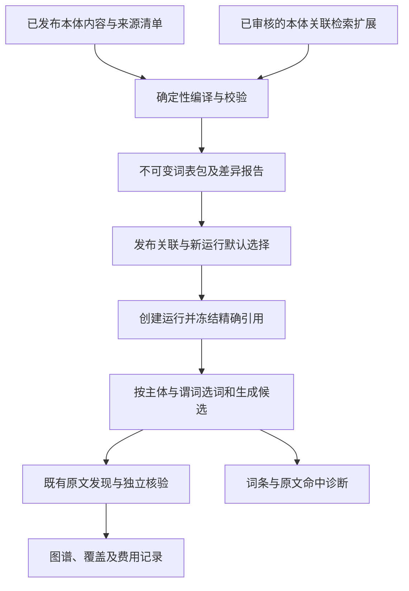

# 本体库版本化检索词表特性规划

编制日期：2026-09-13。状态：规划完成，待进入正式规格与契约阶段；本次未实现代码、修改本体、运行真实模型评测或部署。

本规划根据用户提出的“将窄领域词表作为文档分析引擎能力，从本体库出发，按版本提供对应词表”制定。调查依据为编制时的当前工作区，其中包含其他任务的未提交修改；代码引用只说明当前实现，不代表部署状态。

本文是该特性的集中规划记录。后续按[项目宪章](../../.specify/memory/constitution.md)进入 Spec Kit 流程，正式特性编号及规格路径尚未分配。本文中的字段和模块概念是待规格化的设计，不是已存在的公共接口。现有 021/022 提供调用链与兼容约束，不自动成为新特性的规格或实施授权。

## 1. 目标与关键决策

文档分析引擎提供通用的词表编译、版本解析、查询扩展和命中解释能力；不同本体库提供各自的领域词汇。领域知识成为显式、可替换、可冻结的运行输入，支持同一本体的词汇补充，以及不同本体库间的引擎复用。

采用“已发布本体内容 + 已审核检索扩展 → 不可变词表包 → 分析运行冻结引用”的方式：

1. 正式名称和明确别名来自本体；IRI 局部名及词面变体由版本化规则生成。
2. 相关表达、场景缩写等保存在本体关联的检索扩展资源中，绑定具体 IRI 和适用范围。
3. 本体内容与词表分别版本化，词表精确声明对应的本体内容；同一本体可发布多个词表版本。
4. 新运行绑定确定的本体与词表版本，恢复和回放不读取“最新词表”。
5. 词表只影响定位、候选扩展和排序。类型、谓词、主体归属、关系方向、极性、条件及事实成立仍由本体契约和原文证明决定。

收益目标是提高不同表达的检索覆盖、减少共享代码中的领域常量，并使检索偏置能够追溯和评测。版本化不保证质量改善；候选数量、模型成本和最终事实质量分别验收。

## 2. 当前依据与能力缺口

| 当前入口 | 已核验事实 | 本特性要补充的能力 |
| --- | --- | --- |
| [heuristic_search.py](../../backend/app/services/extraction/ontology_guided/heuristic_search.py) | `_ALIASES` 为七组固定词；先读取本体标签、IRI 局部名及目标字段，再按固定词组扩展；策略已包含 v1～v4 | 新策略从冻结词表读取扩展词；保留旧策略行为，补充词条及来源解释 |
| [slpra-equipment.ttl](../../ontology/slpra/slpra-equipment.ttl) | 已有 `Reactor` 标签“反应器”和别名“反应釜” | 从真实本体词汇出发编译，避免重复维护代码词典 |
| [ontology_engine.py](../../backend/app/services/ontology_engine.py) | `get_subclass_synonyms()` 读取子类标签及别名，但返回单值 `词 → IRI`，冲突保留先遇到项 | 覆盖类、属性、关系；保留语言、来源和一词多义，不把该单值结果直接作为新契约 |
| [contracts.py](../../backend/app/services/extraction/ontology_guided/contracts.py)、[ontology_plan.py](../../backend/app/services/extraction/ontology_guided/ontology_plan.py) | 分析快照包含标签、描述和声明，未完整纳入别名；`ontology_hash` 按该投影计算 | 独立冻结词汇来源及 hash，不能假定别名修改必然改变现有 `ontology_hash` |
| [ontology_meta_store.py](../../backend/app/services/ontology_meta_store.py)、[ontology_meta.py](../../backend/app/models/ontology_meta.py) | 已有发布号、生命周期和 TTL 提交记录；当前发布的投影与提交存在 best-effort 分支 | 核验不可变本体内容后才允许发布关联词表，不能仅凭 `published` 或发布号认定制品完整 |
| [application.py](../../backend/app/services/document_analysis/application.py)、[execution.py](../../backend/app/services/document_analysis/execution.py) | 创建运行时生成本体快照，执行时读取已保存快照并校验身份 | 增加发布内容与分析投影的来源对应、词表冻结、恢复校验和制品保留 |
| [retrieval_query.py](../../backend/app/services/extraction/ontology_guided/retrieval_query.py)、[semantic_reranker.py](../../backend/app/services/extraction/ontology_guided/semantic_reranker.py)、[adaptive_retrieval.py](../../backend/app/services/extraction/ontology_guided/adaptive_retrieval.py) | 已有查询依赖、缓存、精排提交及剪枝校准；校准尚未绑定词表和本体来源 | 把词表及扩展策略纳入受影响依赖；旧缓存、旧校准不能按新词表直接复用 |

文件头“Experimental、不支持恢复”描述只适用于早期启发式实验，不能用作当前整个模块的能力边界。迁出 `_ALIASES` 也不代表消除了全部启发式假设：`_GENERIC_TERMS`、身份字段识别及其他查询规则仍需显式版本化，其全面重构不属于本特性。

## 3. 用户场景与范围

| 使用者 | 操作 | 预期结果 |
| --- | --- | --- |
| 本体维护者 | 生成基础词表，查看新增、删除、冲突和来源 | 每个词可回到本体术语或受控扩展；库 A 的词不会因同名进入库 B |
| 领域维护者 | 为某个谓词添加检索表达并发布词表版本 | 不改引擎代码即可更新新运行词汇；相关表达不会变成本体等价关系 |
| 分析用户 | 选择本体及根类型，显式开始分析 | 服务端选择已发布词表并冻结，页面显示本次本体和词表版本 |
| 运行所有者 | 升级后恢复旧运行，或以新词表重新分析 | 恢复保持旧身份、队列及费用；重新分析建立新运行 |
| 评测人员 | 比较基础标签、历史固定别名和新版词表 | 分别解释候选变化、事实质量和成本，不把命中当作事实正确 |

**本期范围**：多语言词汇及审核扩展；词表编译、差异、审核发布、版本浏览；H0/H1 和运行接入；恢复、缓存、校准隔离；必要的维护与分析页面；按独立阶段接入 H2 查询扩展。库间隔离通过两个小型独立本体包验证，不同时建设通用知识库市场。

**后续范围**：模型辅助提出词条、外部术语库离线导入、跨库词条复用和更完整的维护工作台。模型提案只能进入草稿；不得从正在分析的文档或评测参考自动学习并立即生效。

**非目标**：扩大合法类型/谓词，修改身份合并、原文权限、事实提交或报告规则，替代受控属性值表、单位换算和实体对齐，改写旧抽取作业域。历史评测目录、原件及已有运行不因词表升级重写。

## 4. 功能需求与语义约束

以下编号供后续正式规格映射，尚不表示实现完成。

| 编号 | 需求 |
| --- | --- |
| LX-001 | 为确定的本体库发布内容提供类、关系、属性词汇；允许同一本体发布多个不可变词表版本。 |
| LX-002 | 词条绑定完整 IRI，保留语言、类型、来源、范围、审核状态；一词多义保留多个对应项。 |
| LX-003 | 同一冻结输入与编译规则产生稳定内容和顺序，完整性可独立核验。 |
| LX-004 | 本体和词表发布均可追溯；正式名称、明确别名与相关检索表达分开治理和使用。 |
| LX-005 | 新运行绑定精确词表，恢复拒绝漂移；升级不改变旧运行队列、覆盖、费用和有效结果。 |
| LX-006 | 按当前主体、谓词及合法目标类型启用词汇，不平铺全库词表或串用其他库。 |
| LX-007 | 命中可追溯到词条及原文位置；词条来源不是事实原文，命中不直接产生事实或已检查覆盖。 |
| LX-008 | 未命中、歧义和被抑制的泛词不等于原文否定；保留补搜、多值和反证义务。 |
| LX-009 | 词表变化改变受影响查询、候选和校准身份；旧提交只能在原冻结身份下重放。 |
| LX-010 | 维护发布遵循现有角色、乐观并发及审计；诊断遵循运行所有权；页面读取不触发编译或模型。 |
| LX-011 | 缺少可选扩展与已绑定词表损坏分别处理；离线可完成编译、加载和使用。 |
| LX-012 | 使用未见文档及表达验证质量；未决、未评分和执行失败单列，工程通过不能代替真实质量验收。 |

“项目名称／产品名称”“合成路线／工艺描述”默认作为待审核相关表达，不整组认定严格同义。七组固定别名逐条盘点，不自动提升为本体正式别名。一词多义使用 `词 → 词条集合`，不能按遍历顺序选唯一 IRI；事实核验负责进一步区分主体、层级和关系角色。

## 5. 目标流程与词表来源

本体服务负责发布内容、词条治理和来源完整性；文档分析应用层负责版本解析、制品及访问控制；共享核心消费不可变词表和当前菜单，不读取数据库、文件目录、实时本体或 `app.evaluation`。评测复用同一核心，参考答案只进入识别后的评分阶段。

| 来源 | 编译与使用规则 |
| --- | --- |
| 本体名称及明确别名 | 保留原词、语言和来源三元组，读取全部适用注释，不只保留一个展示标签 |
| IRI 局部名与规范化变体 | 标记规则派生，保存原词和规则版本；相同词面去重但保留来源 |
| 审核后的本体关联扩展 | 绑定 IRI、对象种类和范围，区分缩写与相关表达，不覆盖本体定义 |
| 定义中的短语 | 可生成待审核建议，首期不把任意描述片段自动提升为正式别名 |

编译输入为本体包、本地导入依赖清单、审核扩展及语言/匹配规则；输出为词条内容、来源、冲突/缺口报告和不可变清单。依赖从本地冻结制品读取，不解析远端地址。注释读取失败必须区别于合法本体没有额外别名，不能编译空词表后报告成功。

“名称/描述”等泛词及“酸/热”等短词按版本化规则限制范围和贡献，不能单次出现就激活所有记录。自然语言、缩写和代码分别匹配，避免统一去符号、大小写折叠混淆不同代码或化学表达。上限、权重、长度及匹配规则在正式契约中冻结；记录因上限未采用的词，不静默扩大输入。

明确别名由本体维护流程管理。涉及权威 TTL 修改时，经过三元组 diff、外科式合并和双存储一致性验证。仅用于检索的表达保存在本体关联扩展资源中，可独立发布词表；不为了迁出代码而把所有相关词写入本体别名。首期复用现有数据库、制品存储和治理模式，新增模型/迁移在正式设计确定，不引入专用词库数据库或向量服务。

## 6. 数据与版本契约

### 6.1 词条最小信息

| 字段概念 | 含义 |
| --- | --- |
| `entry_id`、`entry_revision` | 稳定条目标识和维护版本 |
| `concept_iri`、`concept_kind` | 完整 IRI 与类/关系/属性种类 |
| `term`、`language`、`term_kind` | 原词、语言及名称/明确别名/缩写/相关表达/规则派生类型 |
| `scope` | 声明类、主体或目标类型、谓词角色等约束；不表示实例身份或事实证明 |
| `source_ref`、`review_ref` | 来源三元组或扩展资源位置、审核依据与版本 |
| `matching_profile` | 匹配类别；具体权重与规则由冻结检索策略解释 |

同内容多来源可以合并匹配贡献，不能丢失出处；同词多概念保留各自约束。编译按确定性规则排序，重复来源不重复加分。

### 6.2 三类身份

| 身份 | 建议冻结内容 | 作用 |
| --- | --- | --- |
| 本体来源 | `library_id`、发布引用、`ontology_package_hash`、各模块/本地导入清单 | 发布号用于展示，内容 hash 精确绑定真实本体 |
| 词表包 | 词表发布引用、`lexicon_hash`、来源本体 hash、扩展资源 hash、完整编译配置 hash、编译和词表 schema 版本 | 同一本体下可有多个词表版本，词汇来源可复现 |
| 运行检索配置 | 分析快照 hash、词表引用、有效 scope、匹配/查询/启发式版本和预算 | 冻结本次实际检索行为 |

`library_id` 是目标概念，首期可以只注册当前库，不代表已有完整多库管理。来源清单覆盖本次使用的本地导入内容。

现有 `ontology_hash` 继续表示现有分析投影，不就地改旧算法含义。词汇来源 hash 对多语言标签、别名和来源内容单独负责。新运行的本体分析投影与词表必须从同一冻结来源导出并验证对应，不能混用实时 World 与按发布号找到的另一份 TTL。

词表 payload 包含词汇、稳定来源引用和生成配置，确定性序列化计算内容 hash；时间戳、操作日志、显示标题、hash 自身独立保存，不参与计算。每个词表精确绑定一份本体内容，首期不推断版本范围或跨版本继承。修改本体别名产生新来源和相应词表；仅更新审核扩展可保持本体身份并发布新词表。

制品先持久化、校验，再原子更新发布关联。关联失败不暴露半成品，重试按相同内容幂等。版本激活只改变新运行的默认指向，发布标记不能代替制品完整性核验。

## 7. 发布、运行与失败处理

### 7.1 发布和运行创建

词表目标生命周期为 `draft → in_review → published`；驳回回到草稿，已发布内容不可原地编辑。停用只影响新运行选择，历史引用保留。

创建运行时解析本体来源及其默认已发布词表。没有审核扩展版本时可选择同一本体生成并发布的基础词表；基础包也有完整 hash，不使用含义不明的空引用。创建操作原子冻结一个完整版本，处理发布与创建并发。

基础词表由本体发布准备或显式词表准备操作生成；如果连基础包也尚未准备，创建新策略运行应返回词表未就绪，不能把后台读取或页面刷新变成隐式编译操作。

幂等查找先于动态默认版本解析：相同请求重试返回原运行，默认词表更新不能使其换版本或无故冲突。客户端显式修改本体/词表选择时，该选择进入 `request_hash`；复用原 `request_key` 应报输入冲突，重新分析使用新请求身份。

解析后的真实词表版本/hash 进入创建时 `provisional_fingerprint`，并进入识别的最终 fingerprint；同时保存词表制品引用。只在启发式构造函数加参数不足以完成冻结契约。

### 7.2 执行、恢复及兼容

运行清单保存词表内容或可长期保留的内容寻址引用。启动、恢复及提交使用冻结引用，核验所有权、hash、schema、来源本体和策略。停用不删除已有运行依赖；保留策略覆盖检查点和审计，单个运行删除不能删除仍被引用的共享词表。

旧 v1～v4 不补填新字段、不改变原 hash 和快照形状，继续使用原固定词汇及恢复契约。新行为分配新的启发式/查询规则身份，具体编号在正式规格中确定，不能重定义 `ontology-labels-and-registered-aliases-v2`。v1 原本不支持恢复的限制保持不变。

新策略摆脱 `_ALIASES`，旧兼容分支允许保留冻结常量；删除全部固定词表不是首期验收目标。无法可靠提供历史实现或冻结内容时，明确旧运行不可继续并要求新建运行，不能猜测迁移。

### 7.3 失败语义

| 情况 | 目标行为 |
| --- | --- |
| 本体有效，未配置审核扩展 | 明确选择基础词表，保留补搜；不报告词表损坏 |
| 词条因语言、范围或上限未采用 | 记录原因，不计原文已检查或否定事实 |
| 本体发布内容/依赖缺失、注释读取失败 | 拒绝词表发布，不能当作没有别名 |
| 创建时指定词表不可用或本体不匹配 | 明确错误，不回退到外库、最新版或旧硬编码 |
| 已绑定词表缺失、hash 错误、schema 不支持 | 模型调用前拒绝执行/恢复；保留状态和费用，可修复缺失按既有可恢复失败契约处理 |
| 词表可用但无命中 | 继续冻结策略允许的检索，不声明全文不存在事实 |
| 词表与剪枝校准不匹配 | 拒绝该剪枝组合；可显式创建不剪枝的新运行，不静默沿用阈值 |
| 主识别或必需语义能力技术失败 | 沿用相应失败/暂停契约，词表命中不能包装为成功 |

## 8. 检索、缓存与剪枝校准

### 8.1 分阶段接入

第一阶段保持 H0 直接标签/IRI 定位语义，把 H1 固定别名替换为冻结词条。只选择当前谓词、合法目标类型及适用字段的词；目标类型和字段保留各自角色，不平铺全库词表。原文全集、上下文权限和覆盖账本保持独立；新策略继承多值、反证和未完成义务，不因一次命中或支持结果宣称完成。

第二阶段将词表服务接入 H2 查询构造，显式区分发现和反证意图，记录有效词集合和输入预算。相关词不得替换待核验谓词或把肯定表达注入反证查询。实际查询文本及规则变化必须同步进入 `query_dependency_hash`，使用新查询身份和独立对照。

命中诊断保存运行、谓词、词条引用、原文记录/位置、来源通道和贡献类型。标题/摘要命中标为定位线索，词表来源不作为原文断言。诊断按页或按任务提供，避免每次任务和事件重复整包词表。

### 8.2 依赖与复用

| 制品/状态 | 更新后的规则 |
| --- | --- |
| 编译缓存 | 按本体、扩展资源、schema、编译版本及完整编译配置 hash 寻址；配置包括语言、规范化和生成规则参数 |
| 查询扩展、H0/H1 候选、命中与准入 | 绑定词表、有效词集合、scope、匹配/启发式版本，新身份重算 |
| 查询向量 | 按精确查询文本、权限范围和模型缓存；新文本不能使用旧向量，相同底层输入允许复用 |
| 原文解析、记录索引、纯原文检索视图/向量 | 输入、权限、视图和模型未变时复用，不因词表变化全量清空 |
| 语义候选池、排序 epoch、门禁/组处置及重激活 | 纳入新查询/检索依赖；旧提交只在原身份重放，不复制旧软剪枝结果 |
| 逐对精排分数 | 仅精确输入对、权限和模型相同才可底层复用；新池仍须完整提交和准入校验 |
| 图谱、证明、费用、检查点 | 旧运行保持不变，不用重新检索清零成本或刷新已有证明身份 |

仅改变 H1 也会改变到达 H2 的候选分布和预算，因此同样需要新的检索和校准身份。剪枝校准精确绑定本体来源、词表、匹配/查询规则、视图和模型，不能只更新一个 `query_version` 字段。

词表更新后先在不剪枝模式评测；正式剪枝须有匹配身份的校准和质量验收。旧 trial/enforce 阈值和历史专家标注不自动成为新词表的发布证据，不推断“新增同义词不会影响分布”。

## 9. 页面、接口与权限

本体维护侧提供“检索词表”入口，查看关联本体、词表版本、条目来源、歧义和差异。编辑、提交审核、发布、停用为显式操作，复用现有角色门禁、版本冲突和审计；修改本体明确别名与修改检索扩展分别进入各自发布流程。

分析侧自动绑定对应已发布词表，普通用户无需逐词配置。运行详情显示本体/词表版本和基础或扩展模式，按需展开命中依据；原始 hash 和内部校准参数放在诊断详情，不进入开始分析的主要操作。

目标接口职责包括版本列表/详情、草稿维护、差异预览、发布/停用、运行冻结摘要和按页命中诊断。URL、请求/响应、幂等键、错误码和权限矩阵在正式 `contracts/` 确定后，再同步后端、前端共享客户端和调用方；这些路由当前尚未实现。

所有 GET、刷新和切换展示都是读取。编译由发布准备的显式写操作触发，后续模型提案采用单独显式任务。离线使用本地制品，不新增隐式外网依赖。

## 10. 实施阶段与交付条件

| 阶段 | 工作与依赖 | 交付及退出条件 |
| --- | --- | --- |
| P0：正式规格与盘点 | 按流程建立 `spec.md`、澄清、`plan.md`、数据/接口/运行契约、`tasks.md`、`quickstart.md`；盘点发布制品、七组词和评测输入 | LX 与验收映射完整；来源、兼容、校准及质量口径在实现前确定 |
| P1：编译与来源清单 | 依赖 P0；纯编译核心，多语言词汇和审核扩展，来源/歧义/规范化/hash/上限 | 确定性输出；别名变化可检测；跨库/重名/缺依赖反例通过；离线可构建 |
| P2：发布与治理 | 依赖 P1；必要迁移、草稿并发、差异审核、不可变发布和默认选择 | 先制品后关联，失败幂等，停用不伤历史，权限与发布并发通过 |
| P3：H1 与运行接入 | 依赖 P2；冻结词表、核心注入、新策略、缓存/恢复及校准隔离，保留旧版本 | 新策略无固定领域词表；旧回放不漂移；模型调用前拒绝损坏；覆盖/费用守恒 |
| P4：页面与 H2 扩展 | 页面依赖 P2/P3；H2 单独版本化，复用 P3 的有效词条接口 | GET 零模型调用；页面/API 一致；双意图、输入预算及校准依赖可核验 |
| P5：质量与受控启用 | 依赖工程能力和独立参考；消融、泛化、成本及适用数据库/浏览器集成 | 满足预登记门槛才批准新运行默认词表；部署操作另按实施授权执行 |

P1 编译和独立样本准备可并行；P2 与基于冻结 fixture 的 P3 契约测试可并行。正式运行接入等待来源和冻结契约，不先读取实时词表再补版本。

复用/修改范围主要是本体引擎与发布服务、共享 `contracts.py`/`ontology_plan.py`/`heuristic_search.py`/`retrieval_query.py`/`semantic_reranker.py`/`adaptive_retrieval.py`、分析应用/执行服务及前端 `src/lib/api.ts` 和相关页面。词表编译模块、持久化模型、迁移和专用测试为拟新增文件，路径在正式计划核定。

本特性不顺带重构整个发布服务，但无法证明本体内容完整一致时须阻止词表发布；必要前置修复列入 P0/P2，不能留给运行期猜测。

## 11. 验收矩阵与质量协议

### 11.1 工程与契约

| 验收号 | 场景 | 必须观察到的结果 | 对应需求 |
| --- | --- | --- | --- |
| AC-01 | 相同输入/配置不同枚举顺序；同编译器改变语言或生成参数 | 重排保持条目/hash 稳定，去重不丢来源、不重复加分；配置变化重新编译并产生相应新身份 | LX-002/003/009 |
| AC-02 | 只新增本体别名，逻辑投影不变 | 词汇/词表身份变化，不能因旧 `ontology_hash` 相同误用缓存 | LX-001/003/009 |
| AC-03 | A/B 库同名不同 IRI，同库一词多义 | 范围隔离且保留多解释，无首遇覆盖或跨库串词 | LX-002/006 |
| AC-04 | 新谓词“熔点”、未登记表达 | 直接标签可检索，无命中仍可补搜，不构成谓词白名单 | LX-006/008 |
| AC-05 | 相关表达命中错误角色，原文另有否定/条件 | 不绕过主体、方向、极性、条件和证明门，不直接计事实 | LX-004/007 |
| AC-06 | 泛词/短词、语言差异、代码边界冲突 | 按冻结规则限制或保留歧义，无全文无条件加分，原词可追溯 | LX-002/006/007 |
| AC-07 | 发布与创建并发，幂等请求重试 | 原子绑定完整版本；重试保持原版本；显式换版本同键冲突 | LX-004/005 |
| AC-08 | 默认升级后恢复旧 v2/v3/v4，尝试恢复旧 v1 | 可恢复版本的顺序、快照、费用、覆盖不变；v1 仍拒绝 | LX-005/009 |
| AC-09 | 词表缺失/篡改/外库替换，或仅无可选扩展 | 前者模型调用前拒绝，后者明确基础模式，诊断不同 | LX-005/010/011 |
| AC-10 | 新词表配旧缓存、候选准入或剪枝校准 | 受影响状态不能复用，底层原文依实际依赖复用，旧阈值不生效 | LX-009 |
| AC-11 | 停用词表、删除运行、跨用户读取、刷新页面 | 历史依赖保留，清理不伤共享包，访问隔离，GET 零模型调用 | LX-004/010 |
| AC-12 | 制品/发布关联/检查点提交间故障 | 重试幂等，无半发布、覆盖虚增、重复已付费任务或费用清零 | LX-003/005/011 |
| AC-13 | 首条支持后有多值尾部、低分必要来源和反证 | 新策略继续冻结义务，有界未完成不冒充全文完成 | LX-007/008 |
| AC-14 | H2 发现/反证查询超长或无新增词 | 长度/去重规则明确，失败与无新增不同，无静默截断和意图替换 | LX-006/009/011 |

沿用实际存在的启发式、排序、快照顺序、恢复及共享核心边界测试，新增词表测试覆盖上述行为。发布并发与锁验收需专用可销毁 PostgreSQL fixture；SQLite 或合成浏览器拦截不替代真实后端集成。正式 quickstart 串联词表发布、创建分析、升级、恢复、诊断及错误处理。

### 11.2 真实质量与泛化

本节对应 LX-012，质量退出条件与前述工程验收分别记账。

先冻结本体包、词表输入、模型、文档、预算、范围、参考和门槛，再执行识别。开发样本可帮助提出待审核词条，但不能改标为未见测试集。参考答案、专家金标、特定目标产品名和期望属性值不得注入词表构建或识别输入；通用本体术语与原文中自然出现的值不受此限制。

消融保持相同新搜索调度、输入、本体语义、模型和预算，只改变登记因素：

| 组别 | 词汇配置 | 目的 |
| --- | --- | --- |
| A | 基础名称/IRI，无额外别名 | 衡量基础定位 |
| B | 冻结当前固定别名的对照资源 | 分离历史词表贡献；仅作隔离对照，不自动成为审核词条 |
| C | A + 本体明确别名 | 衡量从本体直接编译的增益 |
| D | C + 已审核相关检索表达 | 衡量扩展增益及误召回成本 |

A～D 共用冻结的规范化、匹配及权重规则；B 同样保留 A 的基础名称/IRI，只替换额外词汇来源。规则派生变体的增益另登记对照，避免与新增别名混合归因。

先比较 H1；H2 扩展作为独立因素测量。词表效果测量默认不剪枝，匹配身份的剪枝组合另作实验。旧版整体运行可作历史诊断，不能与新调度下的 B 组混称同一基线。

泛化划分包含开发集之外的新文档、新模板和新表达，不能只给同一报告换数字；跨本体适配以独立本体包验证。数据量、分层最低样本数、主指标、允许的非劣界限及成本上限在 P0 预登记。样本不足时报告观察值和工程能力，不宣称泛化达标。

匹配规则与权重只用开发集调定，在未见集评测前冻结。查看未见集结果后修改词表或规则，原测试集转为开发证据，正式泛化结论须使用新的保留集；不能反复调参后仍称首次独立验收。

分别报告：

- 原始记录与完整证据组 Recall@K、未命中和无关候选占比，按谓词、语言、词条来源和文档类别分层。
- 最终关系/属性 precision、recall、完整多跳路径、主体错误挂接、极性/条件错误及独立禁止断言。
- 首个业务正确结果耗时、模型调用/token、编译/加载/检索时间、持久化与诊断体积。
- 预算耗尽、未尝试、未决、未评分和技术失败；空预测、参考不足与覆盖未完成不静默排除。

P5 满足预登记质量/成本门槛并通过关键反例后退出。工程通过、真实质量通过、默认启用和已部署分别记录。当前没有本特性的真实质量结果，不预设提升倍数或准确率百分比。

## 12. 风险、待细化项与关联依据

| 风险或待细化项 | 当前决策 | 阶段 |
| --- | --- | --- |
| 发布号与真实内容不一致、SHA 或导入缺失 | 完整内容清单/hash 为准，无法核验拒绝关联发布 | P0/P2 |
| 固定词迁成文件后继续过拟合 | 逐条绑定 IRI/范围/来源，区分词条类型，执行 A～D 消融 | P0/P1/P5 |
| 升级使校准失效，词条挤占预算 | 精确校准依赖，冻结扩展上限，先无剪枝再验剪枝组合 | P0/P3/P5 |
| 多库标识扩大产品范围 | 当前库注册加 A/B 隔离验证，不建设跨库自动合并和市场 | P0 |
| 制品和诊断膨胀 | 内容寻址、引用保留、按页诊断，不逐任务复制整包 | P2/P3 |
| 权重、语言规则、质量阈值未选定 | P0 冻结质量门槛；用开发集确定规则并在未见评测前冻结，不在 P5 保留集上调参 | P0/P1/P3/P4 |
| 维护页面与 API 形态 | 复用治理、鉴权、分析详情，契约先于实现 | P0/P4 |

关联设计与活动契约：

- [本体指引基础方案](../基于本体指引的文档结构和摘要元数据的关系图谱识别方案.md)：直接菜单、原文证明和独立运行；历史清理/切换授权不扩展到本特性。
- [语义精排扩展方案](../支持语义相似度精排的关系图谱识别精度提升方案.md)：查询意图、排序、缓存、覆盖和质量度量。
- [剪枝和增强语义检索视图方案](../剪枝和增强语义检索视图方案.md)、[022 自适应检索契约](../../specs/022-semantic-graph-closure/contracts/adaptive-retrieval.md)：搜索处置、校准、版本恢复和反证。
- [021 规格](../../specs/021-ontology-guided-doc-graph/spec.md)、[022 规格](../../specs/022-semantic-graph-closure/spec.md)：既有运行域和检索契约；新增词表特性尚未在其中实施。
- [活动评测说明](../../backend/app/evaluation/README.md)：识别与参考隔离、冻结输入、评分和真实质量证据。

后续在本节登记正式 Spec Kit 路径及各阶段真实完成证据。当前交付为集中规划和索引；P0～P5 的实现与验证尚未执行。
