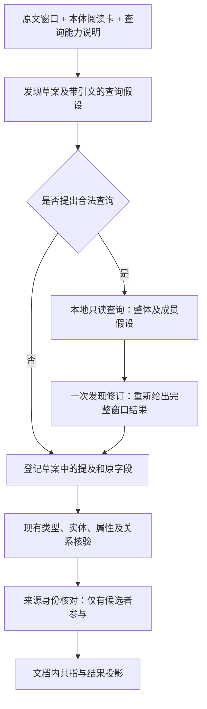

# Harness 实体查询接入与模型验收方案评估

日期：2026-09-28。本文保留实施前的方案评估，完整 H01/H02 尚未完成。
后续已实施最小发现接线并执行真实模型试验，实际范围与结果见
[最小接线与可行性实测](Harness实体查询最小接线与可行性实测-20260928.md)。
依据：[036 规范](../../specs/036-mapped-entity-query/spec.md)、[任务](../../specs/036-mapped-entity-query/tasks.md)、
[基础查询方案](../实体库与Mock系统映射查询改进方案.md)、[035 Harness 规范](../../specs/035-independent-document-harness/spec.md)。
本文编写时只修改设计文档及引用；下文为当时拟议内容，当前实现以实测报告为准。

## 1. 结论与范围

**可以复用现有查询服务完成接入；推荐“发现草案 → 一次批量查询 → 一次发现修订”，
再沿用当前类型、属性和关系核验，并独立核对文档提及与来源记录的对应。**
主要工作在 Harness 协议、发现结果登记时机和验收，而非 Mock 读取或映射层。
模型是否会主动提出成员编号假设仍是最大不确定性，不能以接线完成代替 H02。

本轮目标拆成四项，分别给出结果：

| 目标 | 本例的验收含义 |
|---|---|
| 文档对象数量 | 原文明示并列时，形成两个独立、可定位的生产区域提及，最终不被错误共指合并 |
| 编号归属 | `644`、`642` 分别属于自己的对象，成为经原文核验的编号属性 |
| 来源对应 | 分别召回正确 Mock 记录；进一步确认身份须满足本体语义及文档与来源的业务范围 |
| 生产关系 | 若原文明示共同生产，核验生产计划到两个对象的关系；备选、否定、条件分别保留 |

当前 Mock 的 `identifier_namespace` 只声明数据集编号域，`scope_property_iris=[]`。
因此仅给出“644/642车间”及两条 Mock 记录，**可以争取识别两个文档对象和两个来源候选，
不能保证两个来源身份均可确认**。正文或已授权文档上下文没有给出足够范围时，应为未决。
这不阻止数量、编号或文档生产关系被各自核验，也不要求先新增机构/场地本体或修改共享 Mock。

H01 中的身份确认仅指本次文档提及与所读来源记录的对应，不是跨文档全局合并、人工确认或事实发布。
不新增数据库、来源镜像、查询审计平台、历史回放、自动恢复机制或通用工具 Agent。

## 2. 已核验的实现依据

- [普通运行入口](../../backend/app/services/document_analysis/application.py)转入独立 Harness。
  [控制器](../../backend/app/services/document_harness/controller.py)当前把第一次发现回答直接登记为实体、字段和关系线索。
  若先登记整串，再追加拆分结果，会留下整组节点和悬挂旧边；接入必须调整这个登记时机。
- [模型传输](../../backend/app/services/document_harness/model.py)发送固定阶段 JSON Schema；
  [运行仓储](../../backend/app/services/document_harness/runtime.py)已有当前分区状态、模型请求、回答和成本。
  不需要引入旧工具协议或另建模型调用循环。
- [查询服务](../../backend/app/services/entity_query.py)可同进程调用，返回完整性、来源与映射版本、
  来源记录引用及 `identity_status=not_checked`，不会根据分隔符拆值。
  `sources()` 为页面生成字段目录，会读取各数据集；不能把它无裁剪地用于每个阅读窗口。
- [查询 API](../../backend/app/api/entities.py)在路由层认证，服务本身没有用户参数。
  现有 Mock 是共享数据；后台本地调用仍须校验运行所有权及原文权限，但不需建设数据集 ACL 平台。
- [冻结本体](../../backend/app/services/document_harness/ontology.py)与查询服务的当前本体是不同时间边界，
  仅检查相同 IRI 不足以证明定义、类型层级和身份键语义一致。
- [原有并列提及测试](../../backend/tests/test_document_harness/test_enumerated_mentions.py)预先注入成员，
  证明登记及定位能力，不证明模型自行发现。历史真实模型对照见
  [2026-09-23 验证](本体身份标识引导多实体编号识别验证-20260923.md)，其中相似并列案例未通过。

同一会话前一轮已用当前运行库、当前 TTL 和现有查询服务核对：`644`、`642` 各命中一条，
`644/642` 及 `644/642车间` 完整未命中；相关工程测试 48 项通过。
这些是查询与工程证据，本次评估未新增模型实测，也未把当前 TTL 的检查称为线上模型调用验证。

## 3. 接入方式选择

| 方式 | 判断 |
|---|---|
| 先按 `/` 拆分，再查询每一项 | 不采用；预置对象数量，无法处理单个复合编号、日期、比例、别名或改号 |
| 在发现前把 Mock 全表放进提示 | 不采用；易诱导无原文对象，扩大输入且绕过按需查询 |
| 类型及实体全部确认后才允许查询 | 不足以解决本例；错误合并的发现结果已成为后续输入 |
| 原生工具自主多轮查询 | 暂不采用；当前是固定阶段执行，先验证一次反馈是否有效再评估增加轮次 |
| 发现草案携带查询假设，一轮结果反馈后登记 | 推荐；未确认实体也能提出查询，改动集中，成本可比较 |

图中的来源身份核对处理本次文档与来源的对应，既不替代文档内共指，也不因库记录相同自动合并提及。
来源候选不能作为生产关系证据；后续属性及关系模型输入仍只把原文引用作为文档事实依据。

## 4. H01：最小可实施协议

### 4.1 查询能力与原文假设

在已选阅读卡旁提供一个有限的 `lookup_capabilities`：可查询的类型、映射引用、已绑定属性及数据类型、
完整来源查询键、编号命名空间、业务范围缺口。来源字段路径留在服务端，不提供全表记录值。
复用查询服务的映射校验与上下文构造，提取供本地调用的元数据视图；无需新增 HTTP 端点。
首期只对当前阅读卡中可合法查询的类型开放假设，卡未入选造成的漏查在 H02 单列，不静默宣称无实体。

发现回答在现有对象、字段和关系草案旁增加可为空的 `lookup_requests`。每个请求至少带：

| 内容 | 校验责任 |
|---|---|
| 请求别名、共同指称的原文范围、解释理由 | 服务端生成实际查询 ID；共同范围只分组解释，不预置对象数 |
| 待核对类型及能力引用 | 必须来自本次下发的能力集合，类型暂是假设，不等于实体类型已接受 |
| 名称条件或属性条件 | 每项附独立 `Quote`；类型合法，字符串编号逐字保留，不补后缀或去前导零 |
| 业务范围条件及引用 | 只能使用本次允许的原文上下文，不从 Mock 结果反填查询范围，不跨主体拼键 |

不要求先有已登记实体 ID；否则又回到“必须先拆对才能查询”的循环。
整体标识、各成员标识是否值得查询，由模型依据原文和本体提出。
协议以通用语言要求检查整体/成员、别名、复合编号等竞争解释，不写车间词表、示例编号或领域 IRI。
代码不能因为查不到整体而生成成员查询。在预期并列的目标用例中，模型若始终只提整体，
须如实计入成员假设遗漏；明确单个复合编号的用例则不要求成员查询。

模型不能指定 SQL、表名、路径或任意 URL；映射集合、查询上限、分页策略由服务端确定。
所有引文先经 `Window.resolve()` / `resolve_anchor()` 核验；可定位只证明字面存在，语义归属仍待模型核对。
非法项不访问来源，返回本地校验问题；有效兄弟项继续查询，不被一个坏请求全部吞掉。

### 4.2 查询与一次反馈

运行适配器向 `Engine` 注入查询端口，内部调用 `EntityQueryService`，不经 HTTP 自调用。
控制器不持有 ORM、实时 World 或旧 `ToolContext`；查询服务也不依赖 Harness、原文 IR 或评测模块。
使用独立短读取会话，避免带入运行状态的待写对象；查询前后沿用当前所有权、暂停和执行令牌检查。

服务端为返回候选分配本批短引用。模型只能引用实际返回的候选，不能自行填写 UUID/IRI。
反馈保留：请求对应、完整性/截断/来源问题、`record_ref`、记录和映射版本、类型、来源名称、
查询属性与键组件的值及字段出处、完整身份语义和范围缺口。无关展示属性可不送入模型。
“未命中”“无映射”“非法查询”“查询失败”“预算未执行”保持不同含义。

一次反馈调用读取原窗口、同一本体指引、草案和查询结果，输出**完整的新窗口发现结果**，
不能只返回拆出的成员补丁。无查询直接登记草案；有查询只登记修订后的最终结果一次。
未获来源支持但原文明确的对象、字段仍应保留；来源没有编号不能证明原文不存在对象。
不能为了返回预算只保留“最好的一条”却隐藏同号候选或整体/成员竞争。
草案中有合法引文但被修订遗漏的原字段，保留为未归属观察；不因此恢复已撤回的整组主体或旧字段归属。
无效草案引文仍按现有校验记录问题，不能借保留观察绕过来源检查。

修订结果中的成员继续以原文 anchor 保存；例如原文只有连续的 `644`，不能把 `644车间` 当作原文引文。
关系线索须由修订回答逐项重新给出，不能把草案整组节点的边复制给所有成员。

### 4.3 来源身份和显示名

建议在各窗口原文核验完成后、文档内共指前，增加有候选才执行的 `source_identity_review`，
独立处理“文档提及是否对应该来源记录”。这一步对应 FR-015 的身份要求；不能借实体类型核验或
`matched_lookup_groups` 冒充身份核验，也不需重做前面已经完成的类型/属性/关系判断。

输入为已接受的局部实体、其编号/范围原文与属性核验结果、本体身份语义，以及全部相关来源候选。
输出逐项关联 `accepted / rejected / unresolved`、选用的候选引用、理由及原文依据。
这里只允许引用现存文档实体和本批来源候选，不新增对象或关系。

程序至少约束：主体与引用有效、类型相容、作为身份依据的属性归属已核验、键组件完整、
业务范围有文档依据、查询未截断、没有未解释的来源 IRI 冲突或竞争候选。
上述是接受的必要条件，不能据条件齐全就替模型作语义判断；模型的高置信度也不能绕过这些条件。
未支持的对象属性键组件不能删除后称为完整键。只有名称相似、单一裸编号或技术命名空间时保持未决。

核对前重新执行相关条件查询，比较已选来源记录及映射版本，同时检查是否新增竞争命中。
不能只读取原记录而忽略新出现的歧义；改变则本轮关联保留未决，不自动反复查询或重试。
该结果只说明所记录读取版本下的对应，后续来源变化不靠页面 GET 自动重跑模型。

数据表达沿用当前状态表，拟增加按提及组织的 `source_links`：候选来源引用、必要匹配值、
记录/映射版本、独立判断及原文依据。查询原始 `identity_status=not_checked` 保持不变。
图谱原文 `label/name/anchor` 不被来源名称覆盖；另提供 `source_label`、来源引用和关联状态。
仅对应已核对时可优先展示来源名称；未决时显示“原文：644；候选：644车间”，不冒充正式绑定。
跨章节共指仍依据原文，来源链接按原始 mention 保存；投影后的共指组若来源判断冲突，
保留各项差异，不选择首条来源名称或 IRI 充当整组身份。

### 4.4 冻结本体、预算与暂停继续

**冻结本体。** 查询服务仍按当前合法本体/映射读取；本地适配器须从同一次当前本体副本构造可比较目录，
与运行冻结目录核对，再把同一副本交给查询校验，避免检查与查询之间换一份本体。
目录构造应沿用现有身份注解解释，不能只比类/属性 IRI。首期采用完整目录一致性检查，
代价是无关本体变更也可能使来源辅助暂不可用；此时保存依赖变化原因，文档原文分析仍按冻结目录执行。
不另存多版本 World、转换冻结卡回 RDF 或让实时查询扩充冻结的类型/谓词范围。
源映射和记录保持当前查询语义，版本单独记录，不把它们伪装成运行创建时的历史数据。

**建议初始预算。** 发现阶段每个阅读窗口最多 8 个查询、每项最多 5 条候选、最多一轮查询反馈；
来源身份核对每批最多 6 项并按真实输入大小进一步分批。参数是试验起点，不是质量保证。
身份核对前的现值检查仅重查已保存的相关条件一次，不开放第二轮发现查询或自动翻页。
最大输入、输出和总上下文仍受现有运行政策限制；能力说明、Schema、草案和反馈全部计入 `request_size()`。
发现前预留反馈空间，先减少非必要阅读卡；必需原文、本体键及冲突候选不能静默截断。
若仍超预算，标记辅助未完成，保留可用原文草案；有必要拆阅读窗口时沿用既有机制。
不得因为所有窗口执行完毕就报告来源辅助或质量达标。

相较当前流程，增量模型调用约为：**发生查询的窗口数 + 来源身份核对的实际批数**。
查询本身不调用模型；无查询能力或无查询请求的窗口不增加反馈调用。
技术失败沿已有模型失败/暂停契约处理；有查询返回但不完整时可继续原文分析，相关身份保持未决。

**当前状态。** 在 `windows` 对应的当前行中保存尚未消费的草案、查询请求、该轮有限反馈及所处步骤。
先持久化反馈，再发修订调用，使暂停后能组成相同输入，命中现有 `Repository.invoke()` 已付费回答。
最终发现登记与游标推进在一次现有 `save()` 中完成，随后清除已消费的临时草案和反馈。
来源身份核对也只保存待消费批次及当前判断；必要来源上下文随既有模型输入和选中链接保留。
精排结果、调用账本继续独立保存，不新增全量执行快照或持久化所有查询历史。

## 5. H02：先验证有效性，再扩大验收

### 5.1 两道门

1. **可行性试验。** 固定完整原段落、根类型、本体、当前本地模型和预算；接入真实查询服务与隔离映射数据。
   验证模型能否自主提出整体/成员假设，并在一轮反馈后形成正确提及及编号归属。
   不能只测人为预拆分的请求；若查询假设没有改善，保留失败结果并调整方案，不宣布 H01/H02 通过。
2. **完整链路验收。** 在同一 Harness 上完成类型、属性、身份、关系、共指及公开结果投影，
   再运行原完整文档。段落成功不能代替最终两节点及生产路径成功。

建议设置三组：A 为当前无库流程；B 为查询辅助流程；C 为与 B 同一草案再核对一次但不提供来源结果。
C 只用于评测，明确“查询未执行”，不能把无结果伪装成完整未命中；用来区分查询信息与额外模型调用的作用。
三组使用相同输入、本体、模型参数及单次/总预算上限，分别报告实际消耗，不要求实际调用次数相等。
总调用/耗时上限在评测执行器中预先固定，不由此扩建线上通用预算系统。
评测开关仅在测试注入端口使用；正常新运行在能力可用且验收通过后默认使用查询辅助。

### 5.2 最小用例矩阵

| 用例 | 必须分别检查的结果 |
|---|---|
| `644/642车间`，两个记录齐全 | 两个局部对象、两项编号正确归属、两个正确来源候选；身份按实际范围证据评分 |
| 完整生产原句与原文档 | 正确主体到两车间的合法生产边，原文依据和方向正确，最终共指不误并 |
| 缺少其中一个来源记录 | 原文仍可识别两个对象，缺失项未链接，不替换为其他库记录 |
| 明确单个对象的复合编号，成员也能命中 | 不被成员命中诱导拆分；整体记录不存在也不证明必须拆分 |
| 完整串与成员记录同时存在，原文不明 | 竞争解释未决，不按候选数确定对象数 |
| 不同业务范围的同号 | 无范围时身份未决；有合法完整范围及原文对应时只关联正确记录 |
| 同对象多个编号、改号或别名 | 以原文判断对象数量；不能按编号或记录数量复制对象，身份证据不足仍未决 |
| 备选、否定、条件及集合总量 | 不把备选写成共同生产、不造肯定边、不把集合批量复制给每个成员 |
| `0644`、全角分隔符、日期/比例/单位 | 精确原值和独立定位正确，不触发硬编码数字转换或通用分隔拆分 |
| 重复文本与跨章节提及 | 原文 occurrence 正确；最终共指分区及来源关联保持一致 |
| 非车间类型及非生产关系 | 只改本体/映射/原文，不修改协议中的领域词或运行代码 |
| 缺映射、失败、截断、越权引文、来源中途改变 | 状态真实，不冒充完整未命中、唯一身份或全文质量通过 |

同号异域等反例用现有隔离 fixture 或合法多映射来源表达，不为测试修改共享 `code` 唯一约束。
源记录是识别输入，允许进入查询；预期的对象分区、正确归属和关系是评分参考，不能进入模型请求。
Mock 标签或其他自由文本若含命令，按来源数据处理，不得改变查询范围或原文核验规则。

### 5.3 指标与通过口径

- **数量与位置**：提及召回、最终实体分区、错误合并/拆分、独立且正确的原文跨度；不能只比节点总数。
- **编号属性**：逐主体的谓词、值、归属和引文；原字段保存与属性采信分别统计。
- **身份**：来源候选召回、错误关联、正确接受、应未决但误接受，以及未决数量。
  “局部实体已接受”“命中一条”“来源身份已接受”分别计数；缺范围用例的正确结果就是未决。
- **关系**：逐条主体/谓词/对象、方向、否定/条件及证据，另核对完整生产路径。
- **成本与覆盖**：模型调用及实测 token/耗时、查询数、失败、预算未执行、阅读覆盖；技术失败计入分母。

建议核心正例与关键反例各执行三个独立新运行，完整记录所有结果，避免挑选成功轮。
核心并列正例要求 B 三次均正确形成最终两实体及对应编号；完整肯定生产原句还需两条正确关系。
具备明确业务范围和完整身份依据的正例须正确接受来源对应，不能以所有身份一律未决通过验收。
关键反例不允许错误来源身份接受、凭库造生产边或机械拆分。
这是有限回归的通过口径，不代表总体稳定率；其他用例失败或未决不得静默排除。
有专家参考时报告正式 precision/recall；只有开发参考时明确报告逐例回归匹配，不冒充专家金标。
H02“实验已执行”和“识别目标验收通过”分别记状态；目标未通过不能把 H01 接线完成宣传为功能修复。
同时比较 B 相对 A/C 的收益：若三组同样成功，或 B 只增加成本而没有可核验收益，应明确报告，
不能据此宣称查询提高了识别质量；扩大默认使用前复核是否仍值得保留该额外调用。

## 6. 实施顺序、文件与工程验收

建议将 H01/H02 交错推进：**协议与最小接线 → H02 可行性试验 → 完整核验/投影 → H02 全链路矩阵**。
这样可以在投入来源身份展示和完整回归之前，先发现“模型仍不提成员查询”的核心失败。

| 变更范围（拟议） | 对应工作 |
|---|---|
| `document_harness/protocols.py`、`controller.py` | 草案查询、一次修订、一次登记、独立来源身份判断；提取现有登记逻辑复用 |
| `document_harness/runtime.py`、`application.py`、`model.py` | 注入查询端口、冻结预算政策、当前查询步骤与现有调用记账 |
| `entity_query.py`、Harness 内局部适配模块 | 复用映射元数据与查询，核对冻结本体及来源变化；不复制 Mock 查询实现 |
| `schemas/document_harness.py`、Harness `projection.py` | 增加来源链接、名称来源和阶段成本；不计入已采信文档事实数量 |
| `frontend/src/lib/api.ts`、`source-harness.ts`、现有图谱详情/成本组件 | 同步公开契约，区分原文名称、来源候选及身份未决；不新增页面或 GET 模型调用 |
| `tests/test_document_harness/`、`test_document_harness_runtime.py` | 覆盖真实失败边界、暂停消费和权限；已有 Mock 查询测试继续复用 |
| `app/evaluation/` 内独立 Harness 评测入口 | 复用生产 Engine、call_model、查询服务；不复用旧 ontology-guided runner 或另写识别算法 |

无需新增数据库表或迁移；可直接演进开发期协议，以新运行验证，不转换旧运行。
新增文件名和评测命令在实现时确定，此处不把计划路径写成已存在入口。

工程测试至少覆盖：草案整串被两成员替换后没有旧节点/旧边；完整原字段不因修订丢失；
非法候选引用不登记；未命中不删实体；不完整结果不确认身份；不跨主体拼键；来源文字不变成文档证据；
在查询后、模型返回后、结果应用前暂停，继续时不重复模型计费或登记；本体不一致不扩大可用谓词；
服务端运行所有权与原文权限、当前查询政策、来源版本变化及共指投影冲突。
测试使用临时制品及隔离数据；不依赖共享库写入，不为文档评估启动或重启服务。

真正开始代码实现前，应将本评估选定的协议与验收项同步到 035/036 spec 及契约，
再细化 H01/H02 子任务。本文给出推荐方案及其代价，不把设计完成记作实现、质量验收或部署完成。
