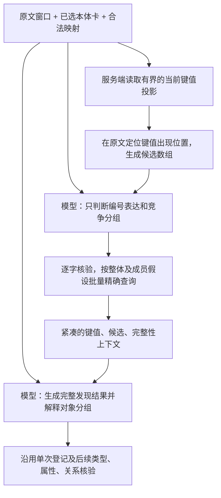

# Mock 身份键候选数组引导指称识别方案

日期：2026-09-28。状态：原因分析与后续方案；第 8 节的类型对齐后变体已完成隔离真实模型试验，核心编号归属未通过，未接入线上。
依据：[实测报告](Harness实体查询最小接线与可行性实测-20260928.md)、
[当前版本原始请求](../../backend/data/evaluations/harness-lookup-20260928-smoke-02/001-members-1-B.json)、
[原始反馈与回答](../../backend/data/evaluations/harness-lookup-20260928-smoke-02/002-members-1-B.json)。

## 1. 结论

当前瓶颈是：**模型在看到具体来源键值之前，就把整串选作一个标识；查询只检验这个解释，
没有给后续修订提供成员候选。** 再追加“注意 ID 键”的提示缺乏新信息：原输入已经包含身份属性和查询键组。

推荐把具体键值候选提前到指称分组之前，并分开两个问题：

1. 原文出现哪些可能的编号表达？由当前映射的键值召回、原文定位和专门的键表达判断共同产生。
2. 这些表达指向几个对象、是什么关系？由模型结合完整原文、整体/成员查询结果作独立判断。

准确术语是：`areaIdentifier` **一个键属性的两个候选值** `644`、`642`。
它们不是两个不同的键属性，也不是一个对象的两字段复合键；最终是否指两个对象，还要解释原文。
向模型提供候选数组可消除“先正确拆分才能查到成员”的依赖，但其实际识别收益须重新实测。

## 2. 已有证据支持哪些原因

| 证据 | 可确认的判断 | 不能据此确认 |
|---|---|---|
| 核心句 B 三次仅查 `areaIdentifier="644/642"`，完整未命中后仍登记整组 | 成员假设没有进入查询；模型未看到两条成员候选 | 查询服务把两个成员合并；具体键值数组一定无效 |
| 请求已有 ProductionArea 阅读卡、编号定义、`identityKey=true` 及来源键组 | 类型/身份提示已经进入输入 | 只要再加身份属性即可修复 |
| `lookup_requests` 可多项，但原输出仅一项，仍满足 Schema | Schema 保证格式合法，没有强制检验所有语义解释 | 把数组最小长度设为 2 就能正确发现对象 |
| 调整为先输出查询，并要求整体/成员竞争后仍失败 | 输出顺序与通用提示修改尚未解决该例 | 模型永远不能处理省略共享称谓 |
| 明写“644车间或642车间”时能提出两个编号查询 | 模型具备输出多个查询的能力，困难集中在紧缩表达的解释 | 已通过备选关系或编号属性验收 |
| 明写单个复合编号时保留一个对象 | 原文明确限定对数量解释有作用 | 已验证同时看到整体和成员命中后的竞争判断 |
| 两候选反馈上界 33,257，超过预算 32,768 | 备选例的反馈因预算没有执行 | 这是核心句三次失败的原因；模型实际 tokenizer 输入超限 |

当前第一轮还同时要求实体、字段、关系线索和查询，返回单个整串即可满足结构校验；
第二轮又输入这份整组草案。这种安排可能强化初始分组，但这是行为层面的解释，尚无独立消融证明因果。
“不能机械拆分”“复合编号保留完整”等原有约束本身有必要，不应删除来迎合一个正例。

模型配置为非思考模式、temperature=0.1；没有做思考模式对照，不能把失败归因于该开关，
也不能保证开启后即可修复。优先让待判断的编号表达和竞争解释显式可见。

## 3. 当前所谓 ID 键约束的实际含义

| 层次 | 当前事实 | 可以用来引导什么 |
|---|---|---|
| 原文业务编号 | `644`、`642` | 原文可定位的编号值，不是数据库 UUID |
| 本体属性 | `ProductionArea.areaIdentifier`，范围 `xsd:string` | 这是生产区域的编号属性，须保留字符串原值 |
| 身份注解 | `slpra-integ:identityKey true` | 该属性可作为身份核对依据，须考虑业务范围 |
| 本体身份键组 | 实测输入 `identity_key_groups=[]` | 当前没有该类的 `owl:hasKey` 组合可直接使用 |
| 来源查询键 | `lookup_key_groups=[{property_iris:[areaIdentifier], scope_property_iris:[]}]` | 按这个属性精确查询；不等于实例允许值集合 |
| 来源表约束 | MockProductionArea 的 `id` 为主键，`code` 非空且唯一，`iri` 没有唯一约束 | 在该来源表内区分记录，不能直接推出文档全局身份 |
| 具体记录 | 两行分别为 `644 → 644车间`、`642 → 642车间`，各有独立记录 ID 和 IRI | 提供两个真实来源候选，供原文解释和后续身份核对 |

依据：[编号定义](../../ontology/slpra/slpra-facility.ttl)、
[身份注解定义](../../ontology/slpra/slpra-integration.ttl)、
[Mock 模型](../../backend/app/models/mock_data.py)、
[声明式映射](../../backend/app/resources/mock_entity_mappings.json)、
[试验源记录](../../backend/data/evaluations/harness-lookup-20260928-final-01/members-source-records.json)。

`xsd:string` 允许 `644/642` 作为一个字符串；唯一约束也不禁止这样的字符串成为一个 code。
本体定义还允许不同体系/时期给同一区域使用不同标识。因此不能从“两个不同值”直接证明“两对象”。
即使另有 `owl:hasKey`，它也不负责切分文本，不等于单值/基数或字符串格式约束。
不应为强迫这个样例拆分而增添单值公理、禁用斜杠或全局唯一假设。

当前 code 直接映射到 areaIdentifier，transform 为 none；表内唯一性可以作为这条映射的来源约束。
其他映射有多值、转换或不同作用域时，需要重新核对，不能把本来源约束推广成所有编号属性的约束。

## 4. 第一步：让两个 ID 表达进入候选空间

推荐流程如下，图中新增键值召回和专门键表达调用均属拟议方案。



**服务端先提供可核验的键值线索。** 沿用类映射和属性绑定，从当前来源投影出业务键值、
记录引用、类型及必要范围。仅处理本窗口可用类型/映射，沿用来源读取上限及完整性；
在服务端按原文字面出现位置筛选，不把整张 Mock 表放入模型输入。
这是一个新的键值读取步骤，不能把已有只读元数据 `capabilities()` 描述成已经提供实例键值。

此次只读核对保存的来源和原文，按实际 code 字面定位得到：

| 原文编号 | S1 内字符位置，左闭右开 | 来源显示名 |
|---|---|---|
| `644` | `[3,6)` | `644车间` |
| `642` | `[7,10)` | `642车间` |

该候选生成不需要按 `/` 拆分，也不需要先有已登记实体；用实际来源值查找原文出现位置即可。
但字面出现不证明是完整编号：`644` 也可能出现于 `1644`、日期或更长的复合值中。
因此保持 `boundary_status=not_semantically_verified`，交给原文语义核对；不能直接生成实体或编号事实。
已有明确的标识格式约束可用于边界校验，当前未声明的格式不得由代码猜造。

只做字典召回会遗漏来源缺失的 `611` 等编号。模型必须仍能从原文提出库外编号，
其 value 用逐字 Quote 表达，不能限定为来源值 enum；只有来源候选引用受实际返回集合约束。

**模型先判断键表达，不在同次回答中提前登记实体。** 第一轮仅输出原文整体表达、
有依据的成员表达、共享称谓和需要查询的竞争解释。对目标句，期望能产生以下假设结构：

```json
{
  "expression": {"source_id": "S1", "text": "644/642车间"},
  "key_property": "areaIdentifier",
  "whole_candidate": {"source_id": "S1", "text": "644/642"},
  "member_candidates": [
    {"source_id": "S1", "text": "644", "key_hint_refs": ["K1"]},
    {"source_id": "S1", "text": "642", "key_hint_refs": ["K2"]}
  ],
  "shared_type_expression": {"source_id": "S1", "text": "车间"}
}
```

这是**拟议格式与目标示例，不是现有模型输出**；真实字段须保留既有 occurrence/定位校验。
`member_candidates` 数量由原文与候选决定，不硬编码两项；原文明示单个复合编号时可以为空。
本轮提出两项成员假设也不等于已经接受两个对象，最终判断仍在下一轮。

只把当前回答的 `lookup_requests` 改名为 `ids` 不足以改善：模型仍可能输出 `["644/642"]`。
本方案的实质是**在第一次表达判断前加入具体键值线索，并把表达判断从完整实体发现任务中分离**。

## 5. 第二步：注入键值数组，要求有依据的分组判断

当前单属性来源可以给模型一个紧凑上下文。以下为说明格式的示意，使用短别名；
后台保存别名与真实 IRI、记录 ID、映射及版本的对应。

```json
{
  "key_schema": {
    "ref": "L1",
    "class": "ProductionArea",
    "property": "areaIdentifier",
    "datatype": "string",
    "namespace": "urn:mock:production_areas",
    "business_scope": "unspecified"
  },
  "text": "计划于644/642车间完成本次临床样品的生产。",
  "id_candidates": [
    {"ref": "K1", "value": "644", "quote": "644", "source_record": "R1", "source_label": "644车间"},
    {"ref": "K2", "value": "642", "quote": "642", "source_record": "R2", "source_label": "642车间"}
  ],
  "whole_lookup": {"value": "644/642", "outcome": "no_match", "complete": true},
  "identity_status": "not_checked"
}
```

`whole_lookup` 只有在实际执行该整体查询后才能填写；只有成员召回时，整体状态应为未查询。
真实传输还须包含逐值原文引用、查询状态、截断/歧义和来源问题，不能用空列表代替这些状态。
库外成员也可进入编号表达数组，只是 `source_record` 为空并带真实的查询状态。

传入 `["644","642"]` 这样的裸数组会隐藏来源和范围，也会让模型误以为实体数量已经确定。
应区分 `id_candidates`（来源与原文支持的候选）和模型最终 `identifier_values`（当前解释采纳的值）。
若由人直接填写正确数组，实验只能验证“已给定正确编号时，后续能否解释”，不能证明模型自主识别。

给模型的任务可以压缩为以下四项：

1. 逐项核对候选是否在本段作为**完整的该类编号**使用，共享称谓是否修饰这些编号。
2. 选择并说明 `多个对象 / 同一对象 / 证据不足`；保留单个复合编号、别名/改号、不同编号体系等竞争解释。
3. 输出每个提及的原文 anchor 和独立编号字段，引用实际来源候选；不得从候选标签补造原文引文。
4. 单独判断关系的肯定、备选、否定或未明。两个编号不自动证明两个车间共同生产。

目标句中，`644`、`642` 与共享“车间”称谓形成两个局部对象的合理解释，两条来源记录增加支持。
但 `/` 本身不充分说明“两个车间都生产”，生产模式仍须结合更完整原文判断。
如果整体记录也存在而原文未区分，应保留竞争/未决；完整未命中也不能作为拆分的唯一理由。

正确的目标表现是：两个原文提及分别保留 `644`、`642` 编号字段，来源候选分别指向 R1、R2。
其中 `644车间` 在目标原文中不是连续引文；可以作为来源标签展示，原文 anchor 仍为 `644`。
正式来源身份仍为未核对，不能用来源键命中取代原文业务范围或完整身份核验。

复合键来源不能采用上述裸标量语义：键数组中每项必须是同一记录的完整元组，例如
`{"site":"A","code":"644"}`；不能把 site 和 code 当作两个对象，也不能跨记录拼接组件。
同一记录被多个假设命中时复用记录短别名；多条记录声明同一实体 IRI 时保留共同对象引用及冲突信息。

## 6. 上下文体积与最小实现范围

已有备选例反馈复制了记录 UUID、版本、映射、IRI、原始值及字段路径等信息。
发现模型通常只需类型、键值、原文定位、显示名、来源竞争及完整性；完整查询结果仍留在现有当前状态/调用上下文中。
可以把重复元数据放在共享块，将记录引用与来源对象引用分别换成服务端短别名；
保持同记录/同 IRI 的等价关系，不按数组位置推断身份。

本次对保存的反馈做了**序列化测算，没有调用模型或修改运行实现**：保留原指令、输出 Schema、
全部候选、编号值、类型、来源状态、匹配键组及记录/来源对象等价关系，省去模型不需要的逐条技术元数据后，
请求保守字节上界从 **33,257 降到 31,899**，进入原 32,768 预算，余量 869。
这只证明该例投影后能通过现有预算检查，不证明模型输出改善，也不保证更大候选集合一定放得下。
原始完整结果未覆盖，诊断与投影保存在
[analysis.json](../../backend/data/evaluations/harness-key-array-analysis-20260928/analysis.json)。

建议实施范围：

- 查询服务复用当前本体/映射/字段转换，增加本地有界键值投影；`capabilities()` 继续只返回元数据。
- Harness 在第一次指称判断前定位相关键值，保留整体及重叠候选，不做按标点的实体拆分。
- 对已选类型具有身份属性及可用映射的窗口，用“键表达判断 → 查询 → 完整发现”替换当前
  “实体草案 → 查询 → 修订”。候选数组允许为空，仍须允许发现库外编号；无合法键定义/映射时沿用普通发现。
  第二轮仍读取整个原文窗口，不能遗漏无编号对象及其他原字段。
- 保留一次完整发现登记、当前步骤状态、已有调用账本、原文权限和预算检查；不新增索引服务或来源镜像。

这改变了“首次模型只看元数据”的原接入方案，需要在实施前同步 035/036 规范与本地消费契约。
发生查询的窗口仍为两次模型调用；专门键表达阶段没有产出时也需要完整发现，可能使原本仅一次调用的窗口
增加调用。应单独测量这项代价，不能把结构化输入直接等同于节省成本。
本次仅分析，未将建议写成已生效的代码、契约或完成任务。

## 7. 如何验证是否有效

下一轮应固定同一原文、本体、来源、模型及参数，先做小范围分阶段对照：

| 条件 | 目的 |
|---|---|
| 当前流程 | 保留现有失败基线 |
| 专门键表达调用，只有键定义，没有具体键值 | 区分任务简化本身的收益 |
| 同一键表达调用，加入真实来源自动召回的候选数组 | 测候选数组对成员表达发现的收益 |
| 上一条件加实际查询和紧凑反馈，完成发现 | 测查询反馈是否改善最终提及及编号归属 |

输入候选必须从当次来源和原文自动产生，不能预填开发参考；保留所有失败和预算未完成项。
分别统计：成员表达覆盖、错误子串命中、查询覆盖、对象分组、编号原字段归属、来源建议及成本。
模型是否输出两个“ID”与最后是否保留两个正确对象分别判定；后续属性采信和生产关系仍另行验收。

关键反例包括：单个 `644/642` 复合编号且成员也在库；原文同对象旧/新编号；只存在一个成员记录；
库外编号；整体与成员同时存在且原文不明；`1644` 内含 `644`；`0644` 与 `644`；重复/同号异域；
一记录多标识；复合键；备选、否定、日期/比例。来源只支持某解释时也不能推翻原文明示的相反数量。
首次验证应要求核心例与关键反例各重复三次，再决定是否扩大完整文档和正式身份核验。

## 8. 在属性、关系对齐阶段做二次 ID 对齐是否可行

可以利用对齐阶段已有的类型与属性定义再解释编号，但必须分开“属性值重定位”和“主体指称重分组”。
前者已有部分能力；后者才是将一个整组候选纠正为两个车间所缺少的能力。

### 8.1 当前实现能做什么

[PropertyMapping](../../backend/app/services/document_harness/protocols.py) 已支持
`value_component="span"` 和 `value_quote`，
[property_value()](../../backend/app/services/document_harness/observations.py) 会验证引文位于原字段值内。
因此模型可以从 `644/642车间` 原字段中提出 `644` 或 `642` 的精确编号值候选。

但 [assertion_alignment()](../../backend/app/services/document_harness/controller.py) 的每个任务固定一个 subject，
所有属性候选都写入同一个 `subject_id`；关系的 `object_id` 也只能取既有实体集合。
该阶段的响应协议没有创建或拆分主体的字段，也未注入 Mock 查询反馈。
同一字段允许提出多个映射，两个同谓词的 span 也不自动创建两个主体。

所以只增加二次属性提取，可能得到：

```text
E0（644/642车间）— areaIdentifier → 644
E0（644/642车间）— areaIdentifier → 642
```

这仍是一个候选主体的两个属性值，不能视为已经识别出两个车间；这些属性也仍须独立核验。
前轮模型实测止于发现阶段。后续[二次复核实测](类型对齐后二次ID复核可行性实测-20260928.md)
已继续运行真实属性对齐及证据核验：能提出部分成员 span，但未稳定采信正确编号。

### 8.2 建议落点与处理顺序

可以把二次 ID 核对视为对齐阶段的准备步骤。具体执行位置建议为：

```text
发现 → 类型候选对齐 → ID 表达与指称复核 → 实体核验 → 属性/关系对齐 → 证据核验
```

类型候选使 `areaIdentifier` 的定义、数据类型、身份依据和来源映射更加明确，
比尚未选定类型时把多个类型的键全部交给模型更聚焦。但类型此时只是假设，复核仍允许指出类型或指称不符。
复核不能只处理已接受实体，否则被判为“多个对象混成一个”的整组候选可能无法进入纠正步骤。

复核输入包括当前主体 anchor、完整原文上下文、所属原字段、候选类型的完整键定义、
从 Mock 召回并定位于原文的键值数组，以及必要的整体/成员查询结果。
输出应区分：保留当前指称、提出多个成员、证据不足，并提供逐成员引文与编号归属。
是否需要复核由编号表达和指称歧义决定，不能以出现斜杠或命中两条来源记录为自动拆分条件。

若原文支持两个成员，服务端在开始属性/关系任务前处理当前状态：

1. 从当前可对齐主体/端点集合撤下整组候选，保留原文及整组字段观察；不能让旧节点继续参与关系配对。
2. 登记两成员及独立 anchor、编号原字段和来源建议。候选类型可作为核验输入，不能继承整组的接受结论。
3. 对成员重新核对类型与指称，再生成各自属性候选和关系任务；集合字段不自动分配给所有成员。
4. 关系依据原文逐条重新提出，保留备选、否定和条件；整组关系线索不能直接复制成两条肯定边。

本例的目标结构才是 `E1.areaIdentifier=644`、`E2.areaIdentifier=642`。
同对象改号、单个复合编号或范围不明等反例仍按原文保留单对象或未决。

这一做法可以作为前置键表达方案的替代实验，先验证一个插入点即可，不需同时建设两套修正循环。
只在新运行首次生成该组属性/关系候选前进行一轮有界纠正，复用当前状态和调用账本，
不扩展历史回退或通用图修复。若到属性/关系候选已经生成后才改变主体，则必须处理受影响候选，
直接追加成员会留下旧主体和错误端点，因此不建议作为首个实现位置。

本节方案已在隔离评测适配器中完成实测：接库核心句三次均分出两个车间，编号归属三次均失败。
未接入生产 Harness。逐次结果、原始产物、失败原因及最小修正建议见
[类型对齐后二次 ID 复核可行性实测](类型对齐后二次ID复核可行性实测-20260928.md)。

## 9. 保留竞争指称解释再核对生产关系的方案评估

本节评估用户后续提出的调整：实体指称/类型阶段保留 `644/642`、`644`、`642` 候选，
关系/属性阶段区分“在其中一个车间生产”和“两个车间同时生产”。
状态：用户已后续授权调整并实测；建议已在隔离单句原型中实施，未接入线上 Harness。
本轮结果见[竞争指称与生产关系分阶段实测](竞争指称与生产关系分阶段实测-20260928.md)。
此前统一绑定方案的 35 次真实调用已完成，结果见[统一绑定实测](统一成员编号绑定实测-20260928.md)。

### 9.1 判断与实测依据

阶段分工更合理：编号属性属于被提及车间，生产参与方式属于计划与车间之间的关系。
原文未确定选哪个车间，并不自动使每个备选车间的明示编号也变为未决。
前一实验的明确备选例提供了直接证据：在完全相同的绑定后状态上，带绑定上下文及新增说明的 D
接受两个正确编号；不带这组输入的 E 将两个编号都因“尚未选定车间”判未决。

不过，核心斜杠句在统一绑定试验中仍是 0/3。把第一次复核改为生成有原文依据的竞争解释，
可减少过早选定对象数量的要求，让后续利用关系上下文继续判断；
是否实际提升模型识别率仍须试验，不能把保留更多候选等同于正确识别。

### 9.2 三个字符串是表达候选，不是三个并存实体

`["644/642", "644", "642"]` 可作为原文编号表达/查询候选集合，每项带独立定位和查询状态。
对象层面至少要区分下述两种竞争解释：

| 解释 | 对象分组 | 可采信所需依据 |
|---|---|---|
| H1：整体编号 | 一个对象，编号为 `644/642` | 原文支持完整复合编号；完整键来源命中可辅助核对 |
| H2：两个成员 | 两个对象，分别编号 `644`、`642` | 原文及其编号作用域支持共享称谓下两个成员；来源记录可辅助核对 |

H1 与 H2 属于同一提及组的竞争解释，不能同时作为已接受对象加入事实图，否则会制造第三个车间。
`644` 和 `642` 是 H2 下的两个成员，不是两种互相排斥的对象解释。
原文若明确“旧编号/新编号”“又称”等，再提出同对象多编号解释；不因有两个键值就自动认定两个对象。
这是 [areaIdentifier 定义](../../ontology/slpra/slpra-facility.ttl)允许的情况：
它保留字符串、限制唯一性的解释范围，也允许同一区域在不同体系/时期具有不同编号。

第一阶段可以确认“原文中有整体表达及两个可定位的编号片段”，并给出候选类型 `ProductionArea`。
但“两个编号片段”与“已经确认两个不同车间”必须分别记录；后者依赖 H2 得到支持。
局部显示名可为“644车间”，逐字引文仍是原文里的 `644`，不能补出不连续的“644车间”作为原文证据。

不要仅在“一个编号未命中”或“两个都未命中”时才保留候选。原文有歧义时就应保留整体/成员解释，
并在映射支持与预算允许时核对三种表达；只命中一个成员、两个都命中、整体也命中均不能省略歧义判断。
完整未命中只表示该次来源查询没有记录；不可查询、截断、失败需保持各自状态。
库外提及仍可由原文支持，缺记录不等于不存在，也不能把单个成员来源绑定给整个复合字符串。

Mock 为每项候选提供真实键值、来源引用、类型、范围和完整性，不直接提供“生产方式”的答案。
原文未明范围时，命中两条独立记录可支持两个局部候选，但不自动完成全局身份核验。
来源已有其他业务事实也不能代替原文证明本计划选用这些车间。

### 9.3 关系判断需要区分参与范围和时间

当前本体已经定义
`ClinicalSampleProductionPlan — producedInArea → ProductionArea`，见
[生产计划关系定义](../../ontology/slpra/slpra-drug-development.ttl)。
因此无需为了这一方向新增一个同义谓词，但必须先发现原文支持的生产计划主体，
不能从谓词的 domain 反推生成一个无依据的计划对象。

用户提出的两种关系适合作为待核对解释，但不足以覆盖原文可能性：

| 原文支持 | 参与方式 | 时间信息及输出要求 |
|---|---|---|
| “在644或642车间之一生产，尚未确定” | 同一计划的两个备选地点，择一 | 记录选项组；不能接受为两个地点都被选用 |
| “分别在644和642车间生产” | 两个地点均在计划内 | 不说明同时，可以分批或先后；不能补成并行 |
| “同时在644和642车间并行生产” | 两个地点均在计划内 | 有明确同时/并行依据，才保留并行含义 |
| 只有“计划于644/642车间生产” | 选项或共同参与尚不明确 | 保留未决，不能强制从前两种关系中二选一 |

“同时在644车间或642车间并行生产”混用了选项和共同参与。若意图是两个车间同时生产，
应表述为“同时在644车间**和**642车间并行生产”。
单独的“或”还不必然表示排他；“之一/择一”才为本例提供明确择一依据。
即使存在两个肯定的 `producedInArea` 关系，也只能表达计划关联两个地点，不能独自编码时间重叠。
计划中的并行安排也不等于实际生产已经发生。

身份解释与关系解释应关联：H2 才具有两个车间端点；H1 下是单个完整编号端点。
后续原文证据若选定 H2，成员编号可独立采信，即使参与方式仍未决。
身份解释本身还未确定时，编号归属仍在对应解释下作为候选，不能跨解释拼接成已接受事实。
关系上下文可以帮助选择指称解释，但关系候选本身不能作为自己的证明。

### 9.4 当前实现缺口与最小落点

[RelationChoice](../../backend/app/services/document_harness/protocols.py) 和
[HarnessRelation](../../backend/app/schemas/document_harness.py) 已有逐边 `polarity`、`conditions`，
可保留否定和条件文字，但没有结构化的共同选项组或择一约束。
两条 `uncertain` 边也不能完整表达“确定从这两个地点中选择一个”；
它们缺少这两条候选之间的逻辑联系。

[assertion_alignment()](../../backend/app/services/document_harness/controller.py) 固定当前任务主体，
关系对象来自已有候选实体集合，响应不能新增/拆分主体。
所以仅改提示词、仅传三个字符串，不能完成用户设想的跨阶段候选判断。

最小设计建议为：

1. 同一原文提及组保存整体/成员表达、原文定位、候选类型、实际查询结果与竞争对象分组，
   各分组内绑定成员 anchor、编号引文和来源候选；不提前接受相互竞争的节点。
2. 在首次属性/关系候选落定前，向模型提供这些分组、计划主体及完整相关原文，
   分别回答指称解释、计划地点的选项/共同参与含义、时间依据；各项都允许未决。
   关系引用所依赖的对象分组，择一关系放在同一个候选组内。
3. 校验所选分组、编号归属和关系端点一致后，生成或核验该分组的成员及属性/关系。
   原整组观察仍保留，停止作为并存已接受主体使用；未决候选不提升为无条件事实。
   独立证据核验可以否定候选，不能只验证模型输出内部自洽。

需要的新增状态仅是当前提及的竞争分组及其关系候选联系；复用现有当前状态和调用账本，
不建设历史回退、多个运行分支或通用图修复系统。结构化选项组属于待设计的识别契约，
本节没有修改在线协议或本体。后续若需要将“并行”作为可查询事实，必须先确认既有本体能承载该语义；
当前实验可先保留原文限定和核验结果，不能用两条普通边冒充完整并行表达。

下一轮验证应分别评分：原文表达定位、竞争解释覆盖、最终成员及编号、正式来源身份状态、
计划主体发现、关系选项语义、共同参与、并行时间依据、未决与成本。
固定核心斜杠句与明确择一、双方参与但非同时、明确并行、单个复合编号、只命中一个/均不命中反例；
参考不进入候选生成。裸斜杠句的关系应允许未决，不能把它预设成择一或并行金标。
