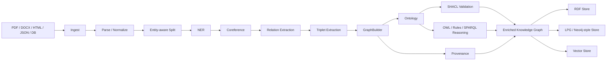
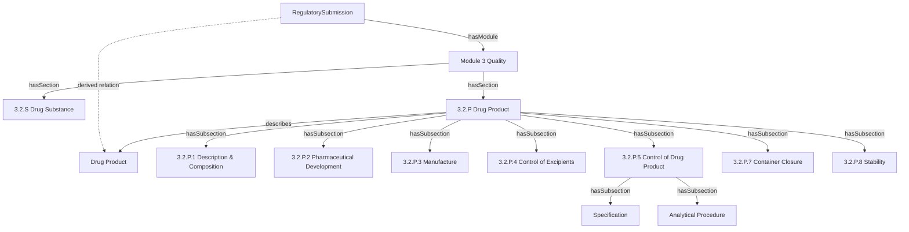
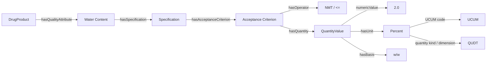
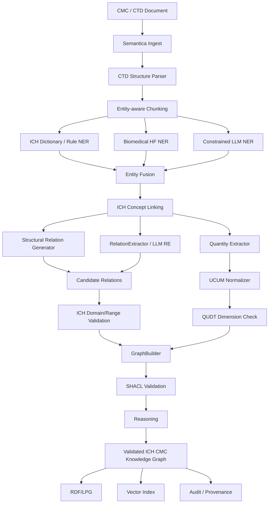

# Semantica 实体/关系抽取与 ICH 概念层集成深度评估

## 执行摘要

**结论：可行，而且 Semantica 的总体架构与“ICH 概念层 + CMC 知识图谱”这一方向高度契合；但仅仅把 ICH ontology 放进系统，并不会自动获得可靠的 CMC 实体、关系和单位识别。** Semantica 已经具备从文档摄取、切分、NER、Relation Extraction、Triplet Extraction、GraphBuilder、Ontology、SHACL、推理、Provenance 到 RDF/LPG/Vector Store 的完整骨架，因此无需重写知识图谱基础设施。真正需要补的是一个**面向 ICH/CMC 的 schema-constrained extraction layer，以及 Quantity/Unit Validation layer**。Semantica 官方架构本身就是 `Ingest → Parse → Normalize → Split → Extract → Conflict Detection → Deduplication → Knowledge Graph → Ontology/Reasoning/Provenance`，抽取阶段明确包括 NER、relations、events 和 triplets，随后可进入 RDF/LPG 图存储与向量存储。citeturn1view0turn7view0

对于你举的：

```text
CMC Report
    └── has ──> Drug Product
```

我的建议不是让模型直接生成一个模糊的 `has`，而是建立：

```text
CMCReport
  ├── hasSection ──> CTD_3_2_P_DrugProductSection
  │                      └── describes ──> DrugProduct
  │
  └── hasDrugProduct ──> DrugProduct       # 可由规则/推理导出
```

原因是 ICH M4Q 的实际信息组织形式就是 CTD Module 3 Quality，并明确包含 `3.2.P DRUG PRODUCT`；其中进一步分为 Description and Composition、Pharmaceutical Development、Manufacture、Control of Excipients、Control of Drug Product、Reference Standards、Container Closure、Stability 等部分。换言之，“CMC Report has Drug Product”在业务层是正确的，但在监管知识图谱中，**最好把它实现成“文档结构关系 + 领域语义关系 + 推导关系”三层，而不是一个未经约束的自然语言 `has`。** citeturn21view0turn23view0

需要特别指出的是，Semantica 当前默认 relation pattern 并不是 CMC-aware：内置 pattern 主要围绕 `founded_by`、`located_in`、`works_for`、`born_in` 等通用关系，并没有 `hasDrugProduct` 这样的 ICH 关系。因此，**out-of-the-box 的 Semantica 不应被期待精准识别 CMC 关系**；必须通过 `relation_types`、自定义规则、LLM/HuggingFace 模型以及 ontology domain/range/SHACL 后验证来加入领域语义。citeturn15view0turn14view4

在属性和单位方面，Semantica 当前的 `Entity` 和 `Relation` 数据结构很轻量：实体主要是 `text / label / span / confidence / metadata`，关系是 `subject / predicate / object / confidence / context / metadata`。它目前没有把 `Quantity(value, unit, dimension, comparator, basis)` 作为一等公民；现有 `ExtractionValidator` 主要检查置信度、空 subject/object、自关系等，`TripletValidator` 也主要验证结构非空和 confidence，并不是药学意义上的单位/量纲校验器。citeturn15view3turn19view0turn18view5 因此我建议新增一个独立的：

```text
ICHConceptResolver
QuantityExtractor
UnitNormalizer
QuantityKindValidator
ICHConstraintValidator
```

而不是把单位验证交给 LLM。

单位层建议采用 **UCUM 作为机器可计算的单位编码层，QUDT 作为 QuantityKind/Unit/Dimension ontology 层，SHACL 作为图级约束层**。UCUM 的目标就是无歧义地进行“quantity + unit”的电子交换，并要求完整实现能够基于单位语义判定等价表达；QUDT 则直接建模 Quantity、QuantityKind、Unit、Dimension 以及单位换算；SHACL 专门用于根据 shapes 校验 RDF graph。citeturn25search0turn25search1turn25search5turn25search2

最终推荐的是**混合架构，而不是单一模型**：

> **CTD/ICH 文档结构规则 → ICH 词表驱动 NER → constrained LLM/domain model RE → ontology entity linking → quantity parser → UCUM/QUDT validation → SHACL validation → graph reasoning → provenance**

对于高度模板化的 CTD 标题和章节结构用规则，精度最高；对于药物名称、制剂、属性、复杂上下文关系用领域 NER/LLM；对于数值、单位和合规约束使用确定性程序。这也最符合 Semantica 本身“LLM optional、deterministic infrastructure、OWL/SHACL/SKOS、provenance”的设计哲学。citeturn1view0

另一个重要的 2026 年现实因素是：截至当前日期，M4Q(R2) 仍处于修订稿/公开咨询后的工作阶段，ICH 2026 年 Assembly 材料显示 Steps 3/4 最终指南目标为 **2027 年 6 月**。因此你的 ICH ontology 不应只做一套不可版本化的“ICH Schema”；应该至少支持 `M4Q(R1)`、`M4Q(R2)-draft`、未来 `M4Q(R2)-Step4` 的版本和映射关系。citeturn27search0turn27search10


## Semantica 的实体与关系识别原理

Semantica 并不是一个单一 NER/RE 模型，而是一个**多方法语义抽取编排器 + Knowledge Graph infrastructure**。官方 README 把 `semantica.semantic_extract` 定义为 NER、relation extraction、event detection、triplet generation 等能力的集合，完整管线还包括 entity-aware splitting、GraphBuilder、ontology、reasoning、provenance、vector store 和 RDF/LPG graph store。citeturn1view0turn7view0



Semantica README 给出的总体数据流实际上非常接近上图：`Sources → Ingest → Parse → Normalize → Split → Extract → Conflict Detection → Deduplication → Knowledge Graph → Ontology/Reasoning/Provenance → Enriched KG → Vector Store + RDF/LPG Store`。citeturn1view0

### NER 不是单模型，而是多策略协调

核心 `NERExtractor` 支持 pattern、regex、rules、spaCy ML、HuggingFace transformer 和 LLM 等方法，并支持 fallback、union、consensus 等合并策略。代码中默认 spaCy 模型为 `en_core_web_sm`，默认 HuggingFace NER 模型为 `dslim/bert-base-NER`，同时支持自定义 `huggingface_model`、provider、LLM model、device、minimum confidence、method weights 和 agreement/voting 设置。citeturn11view3turn11view5

其核心配置思想可以概括为：

```python
NERExtractor(
    method=["llm", "huggingface", "regex"],
    entity_types=[...],
    min_confidence=0.75,
    merge_strategy="consensus",
    min_votes=2,
    method_weights={...},
)
```

这里非常适合 ICH，因为你的 entity type 并不会局限于传统 CoNLL 的 `PERSON / ORG / GPE`，而会变成：

```text
DRUG_PRODUCT
DRUG_SUBSTANCE
DOSAGE_FORM
STRENGTH
EXCIPIENT
SPECIFICATION
ANALYTICAL_PROCEDURE
QUALITY_ATTRIBUTE
ACCEPTANCE_CRITERION
PROCESS_PARAMETER
MANUFACTURING_STEP
CONTAINER_CLOSURE
BATCH
CTD_SECTION
ICH_GUIDELINE
```

Semantica 官方 semantic extraction 文档也明确展示了“custom labels + LLM”的方式，并给出了 biomedical HuggingFace 示例 `d4data/biomedical-ner-all`，表明它在设计上允许替换为领域模型，而不是把通用 NER label 写死。citeturn13view0

NER 的实体结果本身是轻量 dataclass：

```text
Entity
 ├── text
 ├── label
 ├── start_char
 ├── end_char
 ├── confidence
 └── metadata
```

这非常重要：**ICH Concept URI、normalization result、section ID、document ID、source span、model name 等领域信息最自然的落点就是 `metadata`，或者进入 KG 后变成正式图属性。** citeturn15view3

此外，Semantica 对多个候选实体还有 hybrid matching：可从 exact matching 逐步退化到 synonym、substring、semantic embedding/fuzzy similarity，而 confidence 计算也可结合原方法置信度和 label/content 与目标 type 的相似度。citeturn16view5turn16view6

这意味着 ICH layer 可以不仅作为“图谱 ontology”，还可以反向参与 extraction：

```text
surface text:
  "DP"
  "drug product"
  "finished product"
  "3.2.P"
      ↓
ICH concept resolver
      ↓
ich:DrugProduct / ich:DrugProductSection
```

词表部分建议使用 SKOS，因为 SKOS 正好提供 `prefLabel / altLabel / hiddenLabel` 这类 controlled-vocabulary 表达。citeturn25search3turn25search15

### Relation Extraction 的本质是“已识别实体之间的关系分类”

Semantica 的 `RelationExtractor` 并不是端到端直接从 raw text 生成任意图。它的标准接口是：

```python
extract_relations(text, entities=entities)
```

也就是先有 entities，再寻找 entity pairs 的关系。官方代码支持：

```text
pattern
regex
cooccurrence
dependency
huggingface
llm
```

并允许传入 `relation_types`、`bidirectional`、`confidence_threshold`、`max_distance`、HuggingFace model、LLM provider/model 等配置。dependency 方法依赖 spaCy；HuggingFace 路径可以使用自定义 relation classification model；LLM 路径可处理隐式或自定义关系。citeturn14view4turn15view1

它的输出是：

```text
Relation
 ├── subject: Entity
 ├── predicate: str
 ├── object: Entity
 ├── confidence
 ├── context
 └── metadata
```

而 Triplet 则进一步简化成：

```text
Triplet
 ├── subject: str
 ├── predicate: str
 ├── object: str
 ├── confidence
 └── metadata
```

citeturn15view3

一个值得高度注意的实现细节是：**当前 RE 的多 method 配置更接近 fallback chain，而不是像 NER 一样真正做 consensus ensemble。** RelationExtractor 会依次尝试方法，最终优先采用第一个成功方法的结果；全部失败时还有 pattern fallback，并可能退化到实体邻接式的最后兜底。citeturn15view1turn15view2

这对于普通知识抽取可能有利于 recall，但对于 CMC/监管场景必须谨慎：

```text
DrugProduct ------?------ Specification
```

如果系统只是因为两个实体邻近就构造了一条边，这在监管 KG 中是不够安全的。

因此 ICH integration 需要增加第二层：

```text
candidate relation
      ↓
ICH ontology domain/range check
      ↓
document-structure check
      ↓
evidence/span check
      ↓
SHACL/rule validation
      ↓
accepted relation
```

### Triplet Extraction 更适合作为输出层，而不是最终真值判断层

`TripletExtractor` 支持 pattern、rules、HuggingFace、LLM，并能够在缺少 entities/relations 时自动调用 NER 和 RelationExtractor。它也支持 temporal、provenance、RDF serialization 等功能。citeturn18view3turn19view1

但当前 `TripletValidator` 实际上主要检查：

```text
subject 非空
predicate 非空
object 非空
confidence >= threshold
```

并不是“ontology-valid triplet validator”。citeturn18view5

因此：

```text
CMC Report -> hasDrugProduct -> ABC Tablets
```

即便 TripletValidator 判定有效，也只能说明结构完整和 confidence 足够，**并不能证明 `CMCReport` 是允许的 domain、`DrugProduct` 是允许的 range，更不能验证其中的 Strength 单位是否合法。**

这正是 ICH concept layer 最应该介入的位置。


## 关键代码模块、模型和当前边界

下面是我认为实际实现时最值得优先阅读和修改的代码路径。

| 优先级 | 模块/文件 | 关键对象/函数 | 与 ICH/CMC 的关系 |
|---|---|---|---|
| P0 | `semantica/semantic_extract/ner_extractor.py` | `NERExtractor`, `extract_entities()` | ICH entity type、HF/LLM/regex、ensemble、concept linking 前置 |
| P0 | `semantica/semantic_extract/relation_extractor.py` | `RelationExtractor`, `extract_relations()` | `hasDrugProduct`、`hasSpecification` 等核心 RE |
| P0 | `semantica/semantic_extract/types.py` | `Entity`, `Relation`, `Triplet` | 决定 extraction 中间表示；Quantity 暂无一等结构 |
| P0 | `semantica/semantic_extract/methods.py` | `get_entity_method()`, `get_relation_method()`, matching/confidence helpers | 新增 `ich_rules` 或 domain-specific extraction method 的主要扩展点 |
| P0 | `semantica/ontology/ontology_generator.py` | `OntologyGenerator`, `SHACLGenerator` | ICH OWL classes/properties 与 SHACL shapes |
| P1 | `semantica/semantic_extract/triplet_extractor.py` | `TripletExtractor`, `validate_triplets()`, RDF serialization | 输出标准化 KG triples |
| P1 | `semantica/semantic_extract/extraction_validator.py` | `ExtractionValidator.validate_entities/relations()` | 应扩展 ontology/domain/unit validation |
| P1 | `semantica/semantic_extract/providers.py` | provider classes, typed generation | constrained LLM JSON schema extraction |
| P1 | `semantica/semantic_extract/__init__.py` | public exports | `NamedEntityRecognizer`、`NERExtractor`、RE、Triplet 等 API 入口 |
| P1 | `semantica/kg/graph_builder.py` | `GraphBuilder` | 将实体/关系写入知识图谱 |
| P2 | `semantica/split` | entity-aware splitting | 防止 CTD section 跨 chunk 导致关系丢失 |
| P2 | `semantica/provenance` | provenance tracking | CMC extraction 审计和可追溯 |
| P2 | `semantica/reasoning` | rules / graph reasoning | 推导 `CMCReport -> hasDrugProduct -> Product` |
| P2 | `semantica/deduplication` | entity/graph dedup | “ABC 50 mg Tablet / ABC Tablets / Drug Product”实体归一 |

这些模块的定位与 Semantica 的 public exports 和 README 模块表是一致的。`semantic_extract/__init__.py` 明确将 `NamedEntityRecognizer`、`NERExtractor`、`RelationExtractor`、`TripletExtractor`、`ExtractionValidator`、provider registry 和 method registry 暴露为公共组件。citeturn17view0turn1view0

### 外部模型与依赖

项目依赖层面，Semantica 核心包含 `rdflib`、`networkx` 等；可选模型依赖包括 `transformers`、`torch`，本地 embedding 可使用 `sentence-transformers`、`fastembed`、ONNX Runtime 和 tokenizers；spaCy 也作为可选 NLP dependency。citeturn6view0turn6view4

所以模型架构实际上是插件式的：

```text
             ┌─ spaCy model
             ├─ HuggingFace transformer
NER/RE  ─────┼─ regex/pattern
             ├─ dependency parser
             └─ LLM provider
```

LLM provider 层还实现了 typed/structured generation 和 schema validation/retry：provider 可以要求结构化 JSON，若输出无法匹配 schema，则根据 validation error 重试修复。这对于 CMC schema-constrained extraction 非常有用。citeturn19view2

因此可以让模型不是自由回答：

```json
{
  "subject": "something",
  "predicate": "something",
  "object": "something"
}
```

而是只能从：

```json
{
  "subject_type": [
    "CMCReport",
    "DrugProduct",
    "Specification",
    "QualityAttribute"
  ],
  "predicate": [
    "hasDrugProduct",
    "hasSpecification",
    "hasQualityAttribute",
    "hasAcceptanceCriterion"
  ]
}
```

这样的 schema 中选择。

### Embedding 与知识图谱不是同一层

Semantica 确实存在 embedding/vector 能力，但是需要区分两件事。

在 extraction 内部，embedding 可以参与 entity/type 的相似性匹配；而完成 graph construction 后，整个 Context Graph/KG 又可以进入 vector store，用于 semantic retrieval/GraphRAG。README 明确把 KG/ContextGraph 和 vector store 都作为后续基础设施，而不是简单把“embedding”当成知识图谱本身。citeturn1view0turn16view6

因此对 ICH 最合理的设计是：

```text
Ontology URI / exact concept
      ↑ authoritative identity

SKOS synonyms
      ↑ lexical alignment

Embedding similarity
      ↑ candidate generation only
```

即：

**embedding 负责“找可能相同的概念”，ontology URI 负责“确认它是什么”。**

对于监管知识图谱，不应反过来。

### Semantica 当前验证层仍偏技术性，而非领域语义性

`ExtractionValidator.validate_relations()` 当前主要统计低置信关系、subject/object 是否存在、subject 是否等于 object、关系类型数、平均 confidence 等，然后产生 validation score。它没有根据 ontology 检查 `rdfs:domain/range`，也没有检查 quantity/unit dimension。citeturn19view0

这意味着下面两条都有可能通过 extraction validator：

```text
CMCReport --hasDrugProduct--> ABC Tablet
CMCReport --hasTemperature--> 25 mg
```

第二条显然语义错误，但现有 extractor validation 并不会因为 `mg` 不是 temperature unit 自动拒绝。

这就是新增领域 validator 的必要性。

### Ontology/SHACL 层已经有很好的基础，但需要注意一个当前问题

`OntologyGenerator` 已实现从 entities/relationships 到 class/property、OWL class/object property/datatype property、domain/range 等 ontology representation 的 pipeline；同一文件中的 `SHACLGenerator` 还能够根据 property domain、range、datatype、required/cardinality、enumeration 和 regex pattern 构造 PropertyShape。citeturn26search5

因此 ICH layer 可以直接利用已有结构，而不需要另造 ontology framework。

但当前仓库有一个很值得在生产实施前处理的问题：GitHub issue #1082 指出 `SHACLGenerator` 对以 `#` 结尾的 namespace 进行 base URI 归一化时可能生成 `#/`，从而导致 shape 与 instance namespace 不一致、shape 实际 target 不到数据。当前代码中确实存在：

```python
self.base_uri = base_uri.rstrip("/") + "/"
```

这种处理，因此建议 ICH ontology 一开始采用 `/` namespace，或者先修复该 issue 并加入 regression test。citeturn26search0turn26search5

另外，仓库 issue #144 还记录过文档提到 `semantica.kg.KnowledgeGraph` 但实际实现不匹配的问题，所以项目实施时应以当前 `GraphBuilder`/真实 API 为准，而不要完全依赖较旧的文档示例。citeturn26search1


## ICH 概念层应该怎样设计

ICH layer 不建议做成一张只有几十个词的 taxonomy，而应该拆成**文档结构、监管领域 ontology、受控词表、quantity/unit、validation profile** 五部分。

### 首先建 CTD 文档结构，而不是直接从自然语言推断所有关系

ICH M4Q(R1) 明确把 Module 3 定义为 Quality，并在 `3.2 BODY OF DATA` 中区分 `3.2.S DRUG SUBSTANCE` 和 `3.2.P DRUG PRODUCT`。`3.2.P.1` 要求描述 drug product 和 composition，包括 dosage form、各组成成分及每单位数量、组件功能、quality standards、container/closure 等。citeturn21view0

`3.2.P.5` 又进一步是 Control of Drug Product，包括 Specification、Analytical Procedures、Validation of Analytical Procedures、Batch Analyses、Characterisation of Impurities 和 Justification of Specifications。citeturn23view0

这意味着可以建立非常稳定的 structural ontology：



其中最后：

```text
RegulatorySubmission → hasDrugProduct → DrugProduct
```

不必一定直接抽取，可以通过：

```text
Document
  hasModule Module3

Module3
  hasSection 3.2.P

3.2.P
  describes DrugProduct
```

推理出来。

这样即使正文只写：

> “3.2.P DRUG PRODUCT (ABC Tablets, 50 mg)”

也能得到稳定的领域关系。

### 建议的核心 class ontology

第一阶段不宜贪多，推荐先构造约 30–60 个核心 class，而不是把全部 ICH Q/M 指南一次性全部 ontology 化。

推荐最小核心：

```text
RegulatoryDocument
  ├─ RegulatorySubmission
  ├─ CMCReport
  ├─ CTDModule
  └─ CTDSection

Product
  ├─ DrugProduct
  └─ DrugSubstance

ProductCharacteristic
  ├─ DosageForm
  ├─ Strength
  ├─ Composition
  └─ ContainerClosureSystem

QualityConcept
  ├─ QualityAttribute
  │   └─ CriticalQualityAttribute
  ├─ Specification
  ├─ Test
  ├─ AnalyticalProcedure
  ├─ AcceptanceCriterion
  └─ Impurity

ManufacturingConcept
  ├─ ManufacturingProcess
  ├─ ManufacturingStep
  ├─ ProcessParameter
  ├─ Material
  ├─ Excipient
  └─ Batch

Measurement
  ├─ QuantityValue
  ├─ QuantityKind
  ├─ Unit
  └─ MeasurementCondition
```

这里的 `CMCReport` 我建议视为**你的应用 ontology class**，而不是宣称它是 ICH M4Q 正式定义的类；正式 alignment 应指向 `CTD Module 3 / Quality information`。M4Q 的正式结构语言是 Module 3 Quality、Drug Substance、Drug Product 等。citeturn21view0

### Relation ontology 不应只有 `has`

建议把：

```text
has
```

保留为上位 super-property，下面建立更严格的谓词：

```text
hasPart
 ├─ hasModule
 ├─ hasSection
 ├─ hasDrugProduct
 ├─ hasDrugSubstance
 ├─ hasComponent
 ├─ hasSpecification
 ├─ hasQualityAttribute
 ├─ hasAcceptanceCriterion
 ├─ hasAnalyticalProcedure
 ├─ hasManufacturingProcess
 ├─ hasProcessParameter
 ├─ hasDosageForm
 └─ hasStrength
```

例如：

```text
hasDrugProduct
    domain = CMCReport | CTDQualityModule
    range  = DrugProduct

hasSpecification
    domain = DrugProduct | DrugSubstance
    range  = Specification

hasAcceptanceCriterion
    domain = Specification | QualityAttribute
    range  = AcceptanceCriterion
```

于是模型如果提出：

```text
Temperature --hasDrugProduct--> ABC Tablet
```

ontology validator 可以直接拒绝。

### SKOS 词汇层

ICH terms 和企业术语之间最好不要简单复制成 OWL classes，而是增加 ConceptScheme：

```turtle
ichterm:DrugProduct
    a skos:Concept ;
    skos:prefLabel "Drug Product"@en ;
    skos:altLabel "DP"@en ;
    skos:altLabel "drug product"@en .

ichterm:DrugSubstance
    a skos:Concept ;
    skos:prefLabel "Drug Substance"@en ;
    skos:altLabel "DS"@en .
```

SKOS 就是 W3C 为 taxonomy、thesaurus、classification/controlled vocabulary 设计的数据模型，其 `prefLabel / altLabel / hiddenLabel` 很适合术语归一。citeturn25search3turn25search15

企业内部词汇可以再做：

```text
company:FinishedDosageForm
    skos:closeMatch ichterm:DrugProduct
```

而不是把所有近义词直接做 `owl:equivalentClass`。这样更安全。

### 必须版本化 M4Q

当前 M4Q(R2) 尚未到 Step 4；ICH 2026 年材料预计最终 Steps 3/4 在 2027 年 6 月。citeturn27search0turn27search10

因此建议：

```text
ontology/
  ich-core/
  m4q-r1/
  m4q-r2-step2/
  company-cmc/
  units/
  shacl/
```

KG 中保存：

```text
sourceGuidelineVersion = "M4Q(R1)"
ontologyVersion        = "1.3.0"
extractionProfile      = "CMC-2026Q3"
```

将来 M4Q(R2) Step 4 出来后通过 migration/alignment 更新，而不是重做整个 KG。


## “CMC Report → has → Drug Product”的具体识别方案

对于这个关系，我建议同时提供三条识别路径，并做 evidence-based fusion。

### 路径一：CTD section structure，应该作为最高可信来源

假设文档中出现：

```text
MODULE 3: QUALITY

3.2.P DRUG PRODUCT
ABC Tablets 50 mg

3.2.P.1 Description and Composition of the Drug Product
...
```

ICH M4Q 本身明确使用 `3.2.P DRUG PRODUCT` 这一结构。citeturn21view0

解析器先得到：

```json
{
  "type": "CTDSection",
  "section_code": "3.2.P",
  "section_type": "DrugProductSection",
  "title": "DRUG PRODUCT",
  "document_id": "CMC-001"
}
```

NER 再得到：

```json
{
  "text": "ABC Tablets 50 mg",
  "label": "DRUG_PRODUCT",
  "concept": "ich:DrugProduct",
  "confidence": 0.97
}
```

即可确定性构造：

```text
CMC-001
    hasSection
        CTD-3.2.P

CTD-3.2.P
    describes
        ABC_Tablets_50mg
```

然后通过规则得到：

```text
CMC-001
    hasDrugProduct
        ABC_Tablets_50mg
```

这种方式比让 relation model 猜 `has` 稳定得多。

### 路径二：基于 ontology-constrained RE

对于没有标准 CTD heading 的报告，例如：

> “This CMC report describes the commercial drug product ABC tablets, supplied as a 50 mg immediate-release tablet.”

候选实体：

```text
"This CMC report"               → CMCReport
"ABC tablets"                   → DrugProduct
"50 mg"                         → Strength
"immediate-release tablet"      → DosageForm
```

限制 RE 只能产生：

```text
CMCReport   --hasDrugProduct--> DrugProduct
DrugProduct --hasStrength-----> Strength
DrugProduct --hasDosageForm---> DosageForm
```

而不能生成开放式 predicate。

Semantica 的 RelationExtractor 已支持自定义 `relation_types` 和 LLM/HuggingFace/dependency 等 method，因此这个 constrained label space 可以直接利用其现有接口。citeturn14view4turn15view1

示意配置：

```python
from semantica.semantic_extract import NERExtractor, RelationExtractor

ner = NERExtractor(
    method=["llm", "huggingface", "regex"],
    entity_types=[
        "CMC_REPORT",
        "CTD_SECTION",
        "DRUG_PRODUCT",
        "DRUG_SUBSTANCE",
        "DOSAGE_FORM",
        "STRENGTH",
        "SPECIFICATION",
        "QUALITY_ATTRIBUTE",
        "ACCEPTANCE_CRITERION",
        "ANALYTICAL_PROCEDURE",
    ],
    min_confidence=0.75,
    merge_strategy="consensus",
)

re = RelationExtractor(
    method=["llm", "dependency", "pattern"],
    relation_types=[
        "hasDrugProduct",
        "hasDrugSubstance",
        "hasDosageForm",
        "hasStrength",
        "hasSpecification",
        "hasQualityAttribute",
        "hasAcceptanceCriterion",
        "hasAnalyticalProcedure",
    ],
    confidence_threshold=0.75,
)

entities = ner.extract_entities(text)
relations = re.extract_relations(text, entities)
```

这里应特别注意：NER 多 method 可以做 ensemble/consensus，而当前 RelationExtractor 多 method 更接近顺序 fallback；不能误以为三种 RE 方法会自动投票。citeturn11view3turn15view2

### 路径三：规则优先识别高度确定的领域表达

建立类似：

```yaml
relation_rules:

  - id: CTD_DRUG_PRODUCT_SECTION
    subject:
      type: CMC_REPORT
    trigger:
      section_code: "3.2.P"
    object:
      type: DRUG_PRODUCT
    predicate: hasDrugProduct
    confidence: 1.0

  - id: REPORT_DESCRIBES_PRODUCT
    subject:
      type: CMC_REPORT
    patterns:
      - "describes the drug product"
      - "drug product is"
      - "finished dosage form is"
    object:
      type: DRUG_PRODUCT
    predicate: hasDrugProduct
    confidence: 0.95
```

第一条是 structural evidence；第二条才是 textual evidence。

最终 confidence 可以不是单模型概率，而是：

```text
relation_score =
    model_score
  + section_evidence
  + ontology_type_compatibility
  + lexical_trigger
  + cross-reference_evidence
  - contradiction_penalty
```

这种 scoring 比单纯相信 LLM confidence 更适合 CMC。

### 推荐的模型输出不是普通 triple，而是带 evidence 的 claim

例如：

```json
{
  "subject": {
    "id": "doc:CMC-001",
    "type": "ich:CMCReport"
  },
  "predicate": "ich:hasDrugProduct",
  "object": {
    "id": "product:ABC_Tablets_50mg",
    "type": "ich:DrugProduct",
    "label": "ABC Tablets"
  },
  "confidence": 0.99,
  "evidence": {
    "document_id": "CMC-001",
    "section": "3.2.P",
    "page": 42,
    "text": "3.2.P DRUG PRODUCT - ABC Tablets 50 mg",
    "start_char": 18293,
    "end_char": 18335,
    "method": "ctd_structure+ner",
    "ontology_version": "ich-cmc-1.0"
  }
}
```

这与 Semantica 强调 provenance/traceability 的设计方向一致。citeturn1view0turn18view4

### Fine-tuning 数据应怎样定义

如果后续做 domain model，不建议直接训练 generic `subject-predicate-object`，而应该建立 typed RE dataset：

```json
{
  "text": "The drug product ABC Tablets has a strength of 50 mg.",
  "entities": [
    {
      "id": "E1",
      "text": "ABC Tablets",
      "type": "DRUG_PRODUCT"
    },
    {
      "id": "E2",
      "text": "50 mg",
      "type": "STRENGTH"
    }
  ],
  "relations": [
    {
      "subject": "E1",
      "predicate": "hasStrength",
      "object": "E2"
    }
  ]
}
```

同时一定加入 hard negatives：

```text
DrugProduct --hasStrength--> 25 °C      # negative
Temperature --hasStrength--> 50 mg      # negative
DrugSubstance --hasDosageForm--> Tablet # 通常应谨慎/negative
```

否则模型很容易学到“邻近即关系”。

### 测试集至少应该覆盖这些类型

| 输入 | 期望结果 |
|---|---|
| `3.2.P DRUG PRODUCT - ABC Tablets 50 mg` | `CMCReport → hasDrugProduct → ABC Tablets` |
| `The finished product is ABC 50 mg tablets.` | 映射 `finished product` 候选到 DrugProduct，并建立关系 |
| `3.2.S DRUG SUBSTANCE - Compound X` | 必须识别 DrugSubstance，不能识别为 DrugProduct |
| `The drug product contains Compound X.` | `DrugProduct → hasDrugSubstance/hasActiveIngredient → Compound X`，不能反向 |
| `No drug product is described in this extract.` | 不产生关系，测试 negation |
| `The previous formulation was ABC 25 mg; commercial product is ABC 50 mg.` | 区分历史/商业产品 |
| `The product was manufactured at Site A.` | 不应把 Site A 当 DrugProduct |
| `3.2.P.5 Specification` | 建立 section/specification，而非制造 DrugProduct 新实例 |
| 表格中的 `Product / Strength / Batch` | 表格列语义正确绑定 |
| 跨页标题+正文 | entity-aware chunk/section context 不丢失关系 |

### 评估指标不能只看 NER F1

建议至少有六组指标：

```text
Entity Span F1
Entity Type F1
Concept Linking Accuracy
Typed Relation F1
End-to-End Triple F1
Ontology Constraint Violation Rate
```

进一步对 quantity：

```text
Numeric Value Exact Match
Comparator Accuracy
Unit Parse Accuracy
QuantityKind Accuracy
Unit Compatibility Accuracy
Normalized Value Accuracy
Acceptance-Criterion Accuracy
```

对于关系必须使用**有方向的 typed relation F1**：

```text
CMCReport → hasDrugProduct → DrugProduct
```

与：

```text
DrugProduct → hasDrugProduct → CMCReport
```

不能算同一条关系。


## 精准属性抽取和单位校验

这是整个方案里，我认为比 NER/RE 本身更值得独立设计的一层。

### 不要把“50 mg”只建成一个普通实体

最简单的 extraction 会得到：

```text
Entity(
    text="50 mg",
    label="STRENGTH"
)
```

但监管 KG 需要：

```text
QuantityValue
 ├── rawText        = "50 mg"
 ├── numericValue   = 50
 ├── comparator     = EQ
 ├── unit           = mg
 ├── quantityKind   = Mass
 ├── basis          = per tablet
 ├── normalizedValue
 ├── normalizedUnit
 ├── lowerBound
 ├── upperBound
 ├── significantDigits
 └── provenance
```

对于：

```text
NLT 80% in 30 min
```

真正需要抽出的是：

```json
{
  "attribute": "Dissolution",
  "criterion": {
    "operator": ">=",
    "raw_operator": "NLT",
    "value": 80,
    "unit": "%",
    "time": {
      "value": 30,
      "unit": "min"
    }
  }
}
```

对于：

```text
NMT 2.0% w/w
```

则是：

```json
{
  "operator": "<=",
  "value": 2.0,
  "unit": "%",
  "basis": "w/w"
}
```

`w/w`、`w/v`、`v/v` 必须单独保存，因为“2%”本身并不足以表达相同物理语义。

### 推荐 Quantity / Unit ontology



UCUM 适合做 parser/canonical encoding，因为其目标正是提供无歧义的机器单位表示和单位语义等价判定。QUDT 则明确把 Quantity、Quantity Kind、Unit 和 Dimension 组织成 ontology，并支持单位转换和 dimensional analysis。citeturn25search0turn25search1turn25search13

### 单位验证应该至少有五级

**词法合法性：**

```text
"50 mg"      → valid
"50 mgg"     → unknown unit
"50 mg / mL" → normalize whitespace → mass/volume unit
```

**单位规范化：**

```text
mg/ml
mg / mL
milligram per milliliter
```

全部映射至一个 canonical unit code。

**量纲校验：**

```text
Temperature = 25 °C   ✓
Temperature = 25 mg   ✗

Concentration = 5 mg/mL   ✓
Concentration = 5 mg      ✗
```

**属性—单位 profile 校验：**

即便 dimension 相同，也未必业务上允许。

例如：

```yaml
attribute: tablet_strength
allowed_quantity_kinds:
  - mass
  - amount_of_substance
  - biological_activity
allowed_context:
  - per_dosage_unit
```

而：

```yaml
attribute: dissolution
allowed_units:
  - percent
requires_time_condition: true
```

**specification semantic validation：**

```text
Assay: 98.0–102.0 %
```

应识别成：

```text
lowerBound = 98.0 %
upperBound = 102.0 %
```

而不是三个独立 entity。

```text
NMT 2.0%
```

则：

```text
upperBound = 2.0%
```

```text
NLT 80%
```

则：

```text
lowerBound = 80%
```

因此 acceptance criterion parser 应与普通 NER 分开。

### SHACL 非常适合做图级 validation

W3C SHACL 的核心用途就是用 shapes 对 RDF graph 的结构和值进行校验；Semantica 当前 SHACLGenerator 已经支持 datatype、object class、min/max cardinality、enumeration、pattern 等 constraint。citeturn25search2turn26search5

例如：

```turtle
ich:CMCReportShape
    a sh:NodeShape ;
    sh:targetClass ich:CMCReport ;

    sh:property [
        sh:path ich:hasDrugProduct ;
        sh:class ich:DrugProduct ;
        sh:minCount 1 ;
    ] .
```

Drug Product Strength：

```turtle
ich:DrugProductShape
    a sh:NodeShape ;
    sh:targetClass ich:DrugProduct ;

    sh:property [
        sh:path ich:hasStrength ;
        sh:class ich:QuantityValue ;
    ] .
```

Quantity：

```turtle
ich:QuantityValueShape
    a sh:NodeShape ;
    sh:targetClass ich:QuantityValue ;

    sh:property [
        sh:path ich:numericValue ;
        sh:datatype xsd:decimal ;
        sh:minCount 1 ;
        sh:maxCount 1 ;
    ] ;

    sh:property [
        sh:path ich:unit ;
        sh:class unit:Unit ;
        sh:minCount 1 ;
        sh:maxCount 1 ;
    ] .
```

但有一个设计边界：

> **不要让 SHACL 独自承担所有单位换算。**

SHACL 非常适合检查：

```text
有没有 unit
是否允许这种 class
datatype 是否正确
cardinality 是否正确
字符串是否符合 pattern
```

复杂的：

```text
1 g/L 是否等价于 1 mg/mL
25 °C 与 298.15 K 是否一致
某 property 是否允许 mass/volume dimension
```

更适合交给 UCUM/QUDT-aware validator，然后把 validation result 写回 KG。

### 建议新增 Semantica validation stage

```text
Semantic Extraction
       ↓
ICH Concept Linking
       ↓
Quantity Parsing
       ↓
Unit Parsing
       ↓
UCUM canonicalization
       ↓
QUDT dimension / quantity-kind check
       ↓
ICH attribute-unit profile
       ↓
SHACL graph validation
       ↓
Validated KG
```

建议的数据结构：

```python
@dataclass
class QuantityValue:
    raw_text: str
    value: float | None
    lower_bound: float | None
    upper_bound: float | None
    comparator: str | None

    raw_unit: str | None
    canonical_unit: str | None
    quantity_kind: str | None

    basis: str | None
    normalized_value: float | None
    normalized_unit: str | None

    valid: bool = True
    validation_errors: list[str] = field(default_factory=list)
    metadata: dict = field(default_factory=dict)
```

而不是把所有内容都塞进：

```python
Entity.metadata
```

长期看这一点非常重要。

### 错误检测示例

输入：

```text
Storage temperature: 25 mg
```

输出：

```json
{
  "attribute": "StorageTemperature",
  "raw_value": "25 mg",
  "status": "INVALID",
  "error": "UNIT_DIMENSION_MISMATCH",
  "expected_quantity_kind": "Temperature",
  "observed_quantity_kind": "Mass"
}
```

输入：

```text
Drug concentration: 5 mg/mL
```

输出：

```json
{
  "attribute": "DrugConcentration",
  "value": 5,
  "unit": "mg/mL",
  "quantity_kind": "MassConcentration",
  "status": "VALID"
}
```

输入：

```text
Dissolution: NLT 80% in 30 min
```

输出：

```json
{
  "attribute": "Dissolution",
  "acceptance_criterion": {
    "operator": ">=",
    "value": 80,
    "unit": "%",
    "condition": {
      "time": 30,
      "time_unit": "min"
    }
  },
  "status": "VALID"
}
```

对于 `pH`、biological activity、percent basis 等特殊属性，也应该走 attribute-specific profile，而不是盲目按照普通 SI conversion 处理。


## 实现方式、准确率和性能权衡

以下准确率不是 Semantica 官方 benchmark；Semantica 并未为“ICH CMC extraction”发布这样的 benchmark。表中的数字应理解为**项目验收目标区间**，需要由你的真实 CMC gold set 验证后再确定。Semantica 官方文档本身也提醒 extraction output 并非 guaranteed truth，应该通过 confidence、deduplication 和 validation 等步骤处理。citeturn13view0

| 方案 | 原理 | 优点 | 缺点 | 工程投入 | 合理验收目标* | 最适用部分 |
|---|---|---|---|---|---|---|
| 纯规则 | CTD headings、regex、dictionary、dependency patterns | 可解释、稳定、快、无 GPU/LLM 成本 | 对自由文本/隐式关系 recall 低 | 低–中 | 固定模板 Precision 可目标化到 >95%；Recall 通常取决于模板覆盖 | CTD section、编号、数值、单位、NLT/NMT |
| ML Fine-tune | Biomedical/Transformer NER + RE fine-tune | 可离线部署，推理稳定，规模化成本低 | 需要大量领域标注；schema 变更要重训 | 高 | 成熟 gold set 上 typed NER/RE F1 可把 >90% 作为工程目标，但必须实测 | DrugProduct、Attribute、RE |
| Constrained LLM | ICH schema + typed JSON + few-shot | 对隐式关系和新术语 recall 强；迭代快 | latency/cost；模型漂移；仍可能 hallucinate | 中 | 可优先追求 >95% schema-valid output，业务 F1 单独评估 | 长句、隐式关系、复杂表述 |
| Hybrid | Rules + domain NER + LLM RE + ontology + deterministic validation | precision/recall/可解释性最平衡 | 系统复杂度最高 | 中–高 | 关键关系 Precision 建议设 >97%，E2E F1 >90% 作为目标 | **推荐整体方案** |

\*这些是建议验收目标，而非 Semantica 项目声称的现有结果。

为什么我推荐 hybrid，可以从一个例子看出来：

```text
3.2.P.5.1 Specification:
Assay: 98.0–102.0% of label claim.
Dissolution: NLT 80% in 30 minutes.
```

规则非常擅长：

```text
3.2.P.5.1
98.0–102.0%
NLT
80%
30 minutes
```

Ontology 非常擅长判断：

```text
3.2.P.5.1 → Specification
Specification → hasAcceptanceCriterion
```

LLM/domain model 更擅长理解：

```text
"of label claim"
"Dissolution ..."
```

Unit engine 擅长：

```text
%
min
range/comparator
```

强迫任何一个组件包办所有任务，效果通常都不如组合。

### 性能方面

规则、regex 和 CTD parser 的成本近似线性于文档长度，适合先跑；spaCy/本地 transformer 可以批处理；LLM 应只对**候选复杂句、关系不确定片段、表格语义解释**调用，而不是整篇 CTD 每个 chunk 都调用。

推荐：

```text
全部文档
   ↓
deterministic parser
   ↓
80%左右简单事实
   ↓
直接结构化

剩余 ambiguous candidates
   ↓
LLM/domain RE
```

这里的“80%”不是经验 benchmark，只是架构上的目标思路：尽可能让确定性结构解析承担高覆盖区域，让昂贵模型处理真正 ambiguous 的部分。

另一个性能优化是不要把整个 ICH ontology 全部塞进 prompt。建议先通过：

```text
section → candidate entity classes → candidate relations
```

做 schema pruning。

例如在 `3.2.P.5` 中，只给模型：

```text
DrugProduct
Specification
AnalyticalProcedure
AcceptanceCriterion
Impurity
BatchAnalysis
```

而不要同时传：

```text
Facility
ClinicalEndpoint
PharmacokineticParameter
ToxicologyStudy
...
```

这样既减少 token，又减少 classification ambiguity。

### Provenance 应成为准确率体系的一部分

Semantica 本身支持 provenance/traceability，因此 CMC graph 中每一条高价值事实都建议保存：

```text
document
version
section
page
table
cell
span
extractor
model
model_version
ontology_version
confidence
validation_status
review_status
```

citeturn1view0turn18view4

监管领域最好区分：

```text
EXTRACTED
INFERRED
NORMALIZED
VALIDATED
HUMAN_VERIFIED
```

例如：

```text
CMCReport --hasDrugProduct--> ABC Tablet
```

可能是 `INFERRED`：

```text
CMCReport
 → hasSection
 → 3.2.P
 → describes
 → ABC Tablet
```

这与“正文显式说 Report has Product”不是完全同一种 provenance，应保留差异。


## 推荐实施路线与样例

我建议不要一开始就 fine-tune 大模型，而是分阶段做。目标应该首先验证“Semantica + ICH schema 是否能形成一个可靠的 CMC semantic compiler”。

**最高优先级是建立一个小而严格的 ICH/CMC ontology MVP。** 第一版只覆盖 Module 3、Drug Substance、Drug Product、Composition、Manufacture、Specification、Analytical Procedure、Quality Attribute、Acceptance Criterion、Stability、Container Closure、Batch，以及常见 quantitative properties。ICH M4Q(R1) 可以作为当前稳定结构基线；M4Q(R2) 作为独立 versioned draft layer，因为截至 2026 年 9 月其最终 Step 4 仍预计在 2027 年。citeturn21view0turn27search10

第二优先级是先把 **CTD structure parser** 做好。对于标准 CMC/Module 3 文档：

```text
3.2.P
3.2.P.1
3.2.P.2
3.2.P.3
...
```

这些关系本身就提供非常强的 supervision。不要把它们浪费掉而重新让 LLM 猜。

第三优先级是 Quantity/Unit layer。Semantica 当前 pyproject 的模型/NLP依赖中包含 transformer、spaCy、embedding 等，但没有看到内置的完整 pharma unit/quantity validation subsystem，因此这个模块应视为新增的领域组件。citeturn6view0turn6view4

第四优先级才是 NER/RE 数据积累和模型微调。

一个推荐的 production pipeline 是：



推荐的 ICH extraction configuration 可以类似：

```yaml
profile:
  name: ich-cmc
  version: 0.1.0

document_structure:
  standard: ICH-CTD
  module: 3
  recognize_sections:
    - "3.2.S"
    - "3.2.P"
    - "3.2.P.1"
    - "3.2.P.2"
    - "3.2.P.3"
    - "3.2.P.4"
    - "3.2.P.5"
    - "3.2.P.6"
    - "3.2.P.7"
    - "3.2.P.8"

entities:
  - CMC_REPORT
  - CTD_SECTION
  - DRUG_PRODUCT
  - DRUG_SUBSTANCE
  - ACTIVE_INGREDIENT
  - EXCIPIENT
  - DOSAGE_FORM
  - STRENGTH
  - MANUFACTURING_PROCESS
  - PROCESS_PARAMETER
  - QUALITY_ATTRIBUTE
  - SPECIFICATION
  - ACCEPTANCE_CRITERION
  - ANALYTICAL_PROCEDURE
  - IMPURITY
  - BATCH
  - CONTAINER_CLOSURE
  - QUANTITY

relations:
  - hasSection
  - describes
  - hasDrugProduct
  - hasDrugSubstance
  - hasActiveIngredient
  - hasExcipient
  - hasDosageForm
  - hasStrength
  - hasManufacturingProcess
  - hasProcessParameter
  - hasQualityAttribute
  - hasSpecification
  - hasAcceptanceCriterion
  - hasAnalyticalProcedure
  - hasImpurity
  - hasContainerClosure

validation:
  ontology_domain_range: true
  shacl: true
  unit_validation: true
  require_evidence: true
  reject_unknown_predicates: true
```

推荐 LLM prompt 不要问：

```text
Extract all relations from this CMC text.
```

而应该做 schema-constrained extraction：

```text
You are extracting ICH CTD Module 3 quality information.

Allowed entity classes:
- DrugProduct
- DrugSubstance
- DosageForm
- Strength
- Specification
- QualityAttribute
- AcceptanceCriterion
- AnalyticalProcedure

Allowed predicates:
- hasDrugProduct
- hasDrugSubstance
- hasDosageForm
- hasStrength
- hasSpecification
- hasQualityAttribute
- hasAcceptanceCriterion
- hasAnalyticalProcedure

Rules:
1. Never invent an entity not supported by the supplied text.
2. Never invent a predicate outside the allowed predicates.
3. Preserve exact evidence spans.
4. Relation direction must follow the supplied ontology.
5. Return no relation when evidence is insufficient.
6. Quantities must preserve raw value, comparator, unit and basis.
7. Do not perform unit conversion yourself.

Return structured JSON only.
```

Semantica provider 层已经具有 typed/structured generation 与 schema validation/retry 机制，因此这种 prompt + typed schema 比完全自由文本 LLM 输出更符合现有架构。citeturn19view2

对应 schema 可以扩展为：

```python
class ExtractedRelation(BaseModel):
    subject_id: str
    predicate: Literal[
        "hasDrugProduct",
        "hasDrugSubstance",
        "hasStrength",
        "hasSpecification",
        "hasQualityAttribute",
        "hasAcceptanceCriterion",
    ]
    object_id: str

    evidence_text: str
    confidence: float
```

再加一个 ontology gate：

```python
ALLOWED_DOMAIN_RANGE = {
    "hasDrugProduct": {
        ("CMC_REPORT", "DRUG_PRODUCT"),
        ("CTD_QUALITY_MODULE", "DRUG_PRODUCT"),
    },
    "hasStrength": {
        ("DRUG_PRODUCT", "QUANTITY"),
    },
    "hasSpecification": {
        ("DRUG_PRODUCT", "SPECIFICATION"),
        ("DRUG_SUBSTANCE", "SPECIFICATION"),
    },
    "hasAcceptanceCriterion": {
        ("SPECIFICATION", "ACCEPTANCE_CRITERION"),
        ("QUALITY_ATTRIBUTE", "ACCEPTANCE_CRITERION"),
    },
}


def validate_relation(relation, entities):
    subject = entities[relation.subject_id]
    obj = entities[relation.object_id]

    allowed = ALLOWED_DOMAIN_RANGE.get(relation.predicate, set())

    return (subject.type, obj.type) in allowed
```

注意，这一层不是为了取代 OWL/SHACL，而是为了在 graph insertion **之前**做快速 fail-fast validation。

对于单位建议增加：

```python
class UnitValidationResult(BaseModel):
    valid: bool
    raw_unit: str
    canonical_unit: str | None
    expected_quantity_kind: str | None
    actual_quantity_kind: str | None
    normalized_value: float | None
    normalized_unit: str | None
    errors: list[str]
```

最终系统输出则可以从普通三元组升级成：

```json
{
  "entity": {
    "id": "dp:ABC_Tablets",
    "type": "ich:DrugProduct",
    "label": "ABC Tablets"
  },
  "relations": [
    {
      "subject": "doc:CMC_001",
      "predicate": "ich:hasDrugProduct",
      "object": "dp:ABC_Tablets",
      "confidence": 0.99,
      "validation": "VALID",
      "evidence": {
        "section": "3.2.P",
        "page": 42
      }
    }
  ],
  "attributes": [
    {
      "name": "strength",
      "raw": "50 mg per tablet",
      "value": 50,
      "unit": "mg",
      "basis": "per tablet",
      "quantity_kind": "MassPerDosageUnit",
      "validation": "VALID"
    }
  ]
}
```

从资源投入来看，一个可验证的 MVP 并不需要先准备数万条训练数据。更合理的是先准备约几百份有代表性的 CTD/CMC sections，由 CMC/RA/QA 专家定义 ontology 和约束，并人工标注一批高质量 gold sentences/tables；先测试 rules + constrained LLM + ontology validation。等 error analysis 显示 latency、成本或一致性成为瓶颈，再从真实 adjudicated data 蒸馏/微调本地 HuggingFace NER/RE 模型。这一点也符合 Semantica 当前主要提供**多后端 inference adapter 和 graph infrastructure，而非一个专门针对 ICH 的端到端训练体系**的现实。其官方 semantic extraction 文档本身就展示了根据不同领域在 regex、HuggingFace、dependency 和 LLM 之间选择不同方法。citeturn13view0turn11view3turn14view4

综合而言，我会把最终技术判断定为：

> **Semantica 很适合作为 ICH/CMC Knowledge Graph 的底层 orchestration 和 graph/ontology infrastructure；它不是现成的 ICH information extraction model。**
>
> 建立 ICH concept layer 后，`CMC Report → has → Drug Product` 不仅可以识别，而且可以比单纯的 LLM triple extraction 更可靠地识别——前提是把它设计成 `CTD structure + typed NER/RE + ontology constraints + reasoning + provenance`。  
>
> 对“精准属性识别和单位校验”，Semantica 已经具备接入位置，但目前的 `Entity/Relation/Triplet` 和 validator 还不够，需要新增正式的 Quantity/Unit semantic layer。采用 **UCUM + QUDT + ICH attribute profiles + SHACL** 后，可以把“50 mg”“5 mg/mL”“NMT 2.0% w/w”“NLT 80% in 30 min”从普通文本实体提升为可计算、可转换、可验证、可审计的监管知识图谱对象。UCUM、QUDT 和 SHACL 分别提供单位编码/等价、quantity-dimension ontology 和 RDF constraint validation 所需的标准基础。citeturn25search0turn25search5turn25search2

在工程优先级上，最值得首先投入的不是 fine-tuning，而是 **ICH/CTD ontology + CTD structural parser + Quantity/Unit layer + SHACL/domain-range validator**；在这四层稳定后，再用真实 CMC gold set 决定哪些实体和关系值得 fine-tune。这样既最大限度复用 Semantica 已有的 NER/RE/GraphBuilder/Ontology/Provenance 基础，又能避免把监管语义正确性错误地寄托在单一概率模型上。