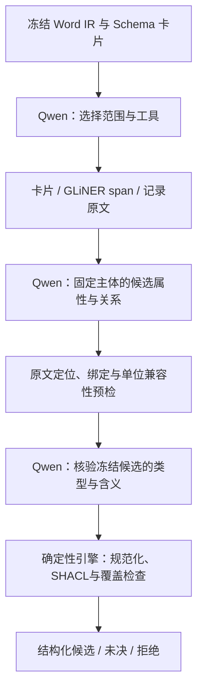

# CMCReport：Qwen 调用 NER、关系与指标单位工具的验证方案

**建议加入工具协作，优先复用项目已有 GLiNER 与证据校验模块。** GLiNER 提供实体和属性值的原文候选；Qwen 结合完整上下文判断主体、关系和指标含义；deterministic engine 统一负责引用定位、表格归属、数据类型、单位绑定/换算及拟新增的 SHACL 图约束校验，并通过薄工具接口提供给 Qwen。最终仍保留按主体生成的结构化 JSON 和 Schema 卡片。

用户已授权实施本方案。现已新增[共享工具核心](../../../backend/app/services/extraction/tool_validation/)、[独立验证入口](../../../backend/app/evaluation/schema_card_tools.py)和[规范/契约](../../../specs/026-cmc-tool-validation/spec.md)，272 项定向工程测试和 Ruff 已通过。GLiNER 已完成 8 片段真实可用性测试；Qwen A/B 共执行 47 次请求，46 次返回成功、1 次超时，结果、工程检查数量及返回样例见[实施实测记录](results/README.md)。没有重启后端或切换线上识别流程。

下列第 1—6 节保留方案形成时的设计依据；“拟议”“尚未”等描述指设计阶段，当前实施差异、完成范围及未达标项以实施实测记录为准。不能把工具实现或 SHACL 通过等同于本报告识别质量已经达标。

## 1. CliNER、GLiNER 与 GLiNER2 的选型

用户提到的 CliNER 与项目已有 GLiNER 是不同项目，不能混用其能力说明。

| 候选 | 已核实能力 | 对本项目的选择 |
|---|---|---|
| [CliNER](https://github.com/text-machine-lab/CliNER/blob/master/README.rst) | 官方仓库已归档；面向电子病历，按 i2b2 任务抽 Problem、Test、Treatment、None，提供 CRF/LSTM 路线。官方 README 未提供本项目所需中文 CMC 属性、关系及单位校准依据。 | 暂不选为默认工具。领域名称相近不足以证明适合生产设备、工艺和 PDE 表格。 |
| 项目已有 GLiNER / `gliner_multi-v2.1` | 自定义标签的实体/值 span 召回，返回 start/end/text/label/score；项目已做中文字符边界适配。 | 首选，作为局部提及和属性值候选工具；不直接决定事实和专业子类。 |
| [GLiNER2](https://github.com/fastino-ai/gliner2) | 独立包的当前文档支持实体、结构化记录和关系抽取，可返回置信度与字符位置。 | 可作为后续关系候选对照，先验证中文效果及离线模型；不作为本轮首选依赖。 |

Context7 查询命中了 GLiNER 和 GLiNER2，未命中 CliNER；CliNER 的信息另从官方 README 核实。当前 GLiNER 文档也出现了新关系模型接口，但不能据此认定项目的 `gliner_multi-v2.1` 权重支持关系抽取。GLiNER2 文档提供中文字符 splitter，同时明确默认示例 checkpoint 为英语模型、改变分词边界可能影响质量；存在中文接口选项不等于中文制药关系质量已经通过验证。

2026-09-16 的环境核查结果：

- 仓库锁文件为 `gliner==0.2.27`；运行后端容器实际为 `gliner==0.2.29`，开关开启、阈值 0.5，本地模型目录及配置存在；容器未安装 `gliner2`。版本差异应在下一轮实测记录中固定，本次不顺手升级或同步依赖。
- 宿主 `backend/.venv` 未安装 gliner；“容器可找到包”与“宿主可运行”需要分开说明。
- 本地模型配置 `max_len=384`、`max_width=12`。span 宽度按模型的 word-token 边界枚举；本项目汉字逐字分词，完整包装描述、长试验名及结晶控制条件可能超出宽度。它不是 Qwen token 上限；输入还涉及标签/子词编码，不能把 `max_len` 直接当作可完整处理的汉字数。
- 本次没有加载 GLiNER、验算权重摘要或调用 Qwen；以上是依赖、配置和源码核查，不是模型效果验证。

## 2. 工具如何解决三个问题

### 属性抽取：先返回位置，再决定属性和主体

Qwen 调用 NER 时指定当前片段和服务端允许的标签组，例如产品名称、设备编号、试验名称，或完整属性卡片中的性状、剂型、PDE。工具返回原文位置和候选标签，不直接给主体写值。

服务端再次验证 `source_text[start:end] == text`，生成已有 `SourceSpan` / `EvidenceAnchor` 和本轮可引用的 span ID。Qwen 在提交候选时引用 span ID，由代码从原文提取 raw，减少本轮 `2026年6月` 被模型改写成 `2026年06月` 的问题。标签及分数只影响召回与排序；不能用“最高分标签”把 HRS-1597 定义为 HighSensitizingDrug。

NER 漏召回不封死抽取：Qwen 仍可指向原文中的其他位置，并通过同样的坐标/上下文定位检查。长属性由证据工具展开完整单元或控制语句，保留“同时满足”的三项阈值、完整包装及条件动作。不能将最多 12 个 word-token 的候选跨度误当成完整长属性。

### 关系校准：分别证明端点、方向和连接依据

关系候选至少检查：主体及对象类型是否有原文依据，二者是否属于当前记录，谓词是否允许该方向，原文是否表达这种连接，以及是否包含否定、未知或适用条件。

NER 发现“步骤一”和“反应釜”有助于召回 `usesEquipment`，但两者共现不是关系证明。证据工具应返回包含操作动作的原句。PDE 的两个试验共享 API 单元，却不能共享数值或来源；校准器依据逻辑行和试验锚点检查，不靠产品名相同推断归属。

`check_claim_binding` 只执行确定性的引用、行归属和正式约束检查。关系含义等语义核验由控制器另行安排项目 Qwen 的受约束调用，输入冻结候选、原文、字段/本体定义及相关反证；不把首次生成理由当成证明。单独调用仍可能重复同一模型的错误，因此只能称独立核验步骤，不能声称统计独立或以两次模型同意代替原文依据。确定性引擎内部不调用 Qwen。

### 指标单位校准：先判断指标，再证明单位，最后换算

按以下顺序执行，不能只做字符串单位替换：

1. **指标含义**：确定报告给出的是 PDE、NOAEL、杂质标准还是检测限；同时核对对象、试验、方法、条件和字段角色。
2. **物理归属**：值属于哪个主体/行，单位来自值的直接表达式还是对应列头。其他列、另一试验或本体目标单位不能补作源单位。
3. **数量形态**：保留精确数、区间、比较符或未知状态。`不超过25℃` 不能成为恒温 `25℃`；`3.8–6.6 kg` 不能变成单个精确标量。
4. **归一化**：只有原单位及上述角色已证明，才调用已有别名/精确换算逻辑；保留 raw、源单位引用、目标单位和转换记录。

量纲一致是必要条件，不证明指标相同。例如 PDE 与最大日剂量可能同为 mg/day，仍不能交换；0.2% 杂质限度则既不是检测限，也不能无依据变成 μg。这里的“校准”指原文含义、归属与表达校验，不表示 NER score 已做统计概率校准。

## 3. 最小工具集合及代码复用

下列名称是拟议的工具接口，当前尚未注册为 Qwen 可调用工具。

| 工具 | Qwen 可选的输入 | 返回及职责 | 复用入口 |
|---|---|---|---|
| `get_schema_card` | 当前允许的类/主体 ID | 完整属性、关系方向/range、数据类型、源定义和目标单位；卡片不作为原文证据 | [compile_local_menu](../../../backend/app/services/extraction/ontology_guided/ontology_plan.py)；本轮冻结卡片 |
| `propose_mentions` | 当前原文范围、实体或属性标签组 | 经原文位置校验的 span、候选标签、原始分数；实体和值/单位分组调用，降低重叠消除造成的漏召回 | [GlinerExtractor](../../../backend/app/services/extraction/gliner_extractor.py) 的 span/batch 接口 |
| `inspect_evidence` | span、记录或列 ID | 完整原句、同一逻辑行、合并跨度、字段/表头候选、邻注和实际图例；可返回重复文字的多个位置供选择 | [TableRecords](../../../backend/app/services/extraction/table_records.py)、[source_citations](../../../backend/app/services/extraction/ontology_guided/source_citations.py)、[field_bindings](../../../backend/app/services/extraction/ontology_guided/field_bindings.py) |
| `check_claim_binding` | 固定候选 ID、主体/谓词/端点、各角色引用 | 返回引用、owner、字段物理归属、正式方向/range 等机械检查；应用侧另接语义核验，不把语义未查当通过 | 上述 owner/field 校验、[ProofGate](../../../backend/app/services/extraction/ontology_guided/verification.py)；外部语义核验复用 [PropertyVerification / RelationshipVerification](../../../backend/app/services/extraction/ontology_guided/repair_adapter.py) 协议 |
| `validate_metric` | 原值 span、冻结属性卡片、源单位及其绑定引用、服务端选择的约束 profile | deterministic engine 的指标校验入口：数量形态、单位归属与兼容性、规范化结果、SHACL 报告及未完成原因；不替模型猜指标含义 | [replay_unit_binding](../../../backend/app/services/extraction/ontology_guided/unit_evidence.py)、[normalize_literal](../../../backend/app/services/extraction/ontology_guided/value_constraints.py)、[底层字面量处理](../../../backend/app/services/extraction/literal_normalizer.py)；SHACL adapter 待新增 |

需要的是薄工具适配层和受限调用流程。现有代码已经包含核心原文、行列和单位检查，不再另建单位注册表或通用 agent 平台。涉及 TaskContext、RecordIndex 等输入的函数，由工具适配器从同一份 IR 构造最小上下文，不搬入整套生产作业状态管理。

### 3.1 指标、单位与 SHACL 归属 deterministic engine

**纳入统一确定性能力范围，并以工具接入强模型。** 这里的 engine 是能力组织边界，首期采用薄组合服务即可，不要求新建运行平台。项目当前的 [reasoning/engine.py](../../../backend/app/services/reasoning/engine.py) 消费已有个体开展业务风险评估；未决抽取候选的校验不应直接塞入该业务入口。单位校验、SHACL 与已确认事实上的 PDE/MACO 计算可以同属确定性能力，但保留各自输入要求和调用入口。

| 层次 | 确定性引擎负责 | 不能仅由该层裁定 |
|---|---|---|
| 原文与记录绑定 | 坐标复核、允许范围、同一逻辑行、完整数字及单位引用、表头/值物理对应 | 原文是否表达特定专业指标或关系 |
| 数量与单位 | 已登记别名、量纲、精确转换、区间/比较符、舍入政策、源单位和后缀冲突 | 缺失单位的猜测；PDE与同单位最大日剂量是否同一指标 |
| SHACL | 选定数据图对指定 shapes 的类型、基数、值域/枚举、格式及声明式跨字段约束符合性 | 原文真假、主体名称所代表的专业类型、遗漏信息是否不存在 |
| 业务计算 | 明确公式、已满足输入要求的数值计算 | 借默认体重或默认因子“修正”原报告数值，覆盖试验来源或未决条件 |

2026-09-16 核查 `backend/app`、`ontology`、依赖清单及锁文件，未发现活动 SHACL/pySHACL 接入；现有调研中的 SHACL 示例不等于项目已实现。新增部分为本地 shapes 投影/配置与验证适配，复用现有数值和证据核心。可以评估 pySHACL，但本次没有安装依赖或运行 SHACL。

**SHACL 验证与单位规范化分工：** SHACL Core 负责 `sh:datatype`、`sh:class`、`sh:minCount/maxCount`、`sh:in`、范围及格式等图约束；必要的跨字段一致性采用已有代码，或少量受控 SHACL-SPARQL 约束。标准验证器不会自动进行完整单位换算，也不会因违反约束就知道正确原值。单位算法计算规范化候选，SHACL 核验结果结构；失败返回具体问题给 Qwen 回查原文，不静默补值、改单位或删事实。

约束必须有明确来源与适用范围：

- 从冻结 Schema 卡片及**明确的验证 profile**生成/选择 shapes。OWL domain/range 是推理语义，不能不经政策声明就当作所有实例的封闭校验；没有 minCount 的字段不能擅自设必填。OWL 多 range 与显式 union 的语义也不能机械等同。
- `sh:closed` 只用于明确约定封闭的候选结构，不默认封闭整份业务图。冻结本体的既有继承如何参与 `sh:class` 检查须明确；由模型声明 `rdf:type` 后获得 conforms 不证明该类型有原文依据。
- 使用按当前候选构造的临时验证图，必要时附带同一记录及引用对象；验证不写权威 TTL 或业务事实。数量/单位若需辅助 RDF 节点，只作内部投影，不借本轮验证扩大领域本体。
- 固定 shapes/profile、单位注册表与推理选项，避免同一候选在不同隐式配置下获得不同结论。首期本地验证不启用规则自动补全、SHACL-JS 或原地改写数据；SHACL-AF 的造三元组能力不作为“校准缺值”手段。
- 约束分为**表示/抽取契约**与**业务合格标准**。例如真实检测值超过限度，表示可能完全正确但业务不合格，不能为了让 shape 通过而抹去超标事实。本期单位工具默认执行表示/抽取 profile；业务限度校验需显式 profile 并单列结果。

**不允许空校验冒充通过。** 工具记录预期候选、实际 focus nodes、已执行 shapes 和未覆盖项；空图、目标类拼错或 shape 未命中时，不能仅凭 `conforms=true` 报成功。对于局部抽取，SHACL 的 minCount 不满足可以原样报告为违反该 shape，但应用结论是“候选不完整/尚未获得证据”，不能推出原文事实为 false；不能把原 SHACL 结果偷偷改成通过。技术异常、shapes 配置错误也应和数据不符合分开。

### 3.2 工具调用与服务端强制校验使用同一个核心

`validate_metric` 替代前版拟议的单纯 `normalize_metric`，规范化保留为其内部步骤。Qwen 可提交候选 ID 进行预检，获得具体路径及原因后补充证据；最终准备保留的候选仍由服务端强制调用同一个核心。Qwen 不能提交自己的 shapes 来放宽条件，也不能用自报“已通过”跳过校验。

拟议返回至少区分：`execution_status`、`validation_status`（passed/failed/incomplete）、各项绑定/单位检查、`shacl.conforms`、`shacl.evaluated`、SHACL 的 focusNode/resultPath/value/sourceShape/sourceConstraintComponent/severity/message、规范化值及外部 `semantic_status`。SHACL 尚未运行时 `conforms=null`，不能用 true 代替。返回的原始 SHACL report 与应用层状态并存，不能压成一个含糊的 valid 标志。

确定性引擎不产生语义 supported；它接收服务端关联到同一候选与原文的外部语义核验结果。指标含义或原单位未确定时，只返回预检和未决原因，不对外提供可用于正式事实的转换值。最终输出依次满足：原文与归属检查、必要语义核验、单位规范化、目标 SHACL profile 校验及覆盖要求。Qwen 后续修改候选，应重新经过这条路径。

对本报告的预期行为：

- PDE `100` / `7.5`：分别绑定大鼠/犬试验，核对同列 `(mg/天)` 后规范化；SHACL 检查值类型、单位和记录结构，不裁决哪个值是“唯一正确 PDE”。
- NOAEL `200` / `30`：源单位不足时保持 incomplete。需要单位的 shape 可报告 minCount 问题，不能按目标卡片补 mg/kg/day。
- 杂质 `0.2%` → `detectionLimit_ug`：量纲不兼容可以确定性拒绝；即使两个候选同量纲，指标语义未证明仍不能通过。
- `不超过25℃`：保留比较关系或原字符串；shape 只接收精确标量时报告表示不匹配，不能丢弃“不超过”来满足约束。
- `HighSensitizingDrug`：即便候选图通过 `sh:class` 和关系范围检查，也须保留原文“—”的反证/未决状态；SHACL通过不替代类型证明。

复用边界必须明确：

- [hierarchy_variant._span_hints](../../../backend/app/evaluation/hierarchy_variant.py) 已有 GLiNER 提示、偏移回映和原文检查经验，但它目前只是召回提示，尚非本方案的完整工具循环。在线服务不能导入 `app.evaluation`。
- 旧 [document_annotator](../../../backend/app/services/extraction/document_annotator.py) 的窗口属性抽取会取标签首值并绑定窗口主体，不适合作为严格主体校准工具。新的适配必须保留值位置及所有竞争主体。
- GLiNER span 清理会消除重叠，提取器自身也不完成长文分块/覆盖核验。工具层需限制块长、回映偏移，明确哪些片段未尝试或被截断。若采用行拼接，只能把映射回真实单元的 span 当证据，合成表头/分隔符不能冒充原文。
- 当前 GLiNER 接口遇到加载或推理异常可返回空列表；仅调用 `is_available()` 仍不能区分后续推理失败与真实无命中。工具适配需要明确的异常通道，保留旧可选接口的默认契约；不能把吞掉异常的空列表报告为“完成且无实体”。
- `TableRecords` 的表头标记依赖解析结果；本报告 table0 首行是步骤正文。工具返回表头候选及其依据，不能把默认首行提升为已证明的字段语义。
- `ProofGate` 是结构/策略门，不能凭其返回补造语义 supported；已有 `observe_value()` 也不负责区分全部 N/A/— 图例语义。应返回原标记、字段及实际图例进行核验。

## 4. Qwen 的调用流程与结构化返回



保留现有 `chat_with_schema()` 及共享调度。该客户端目前只有受约束 JSON 接口，不能声称已经支持原生 `tools/tool_calls`。首个实验使用固定 JSON 工具计划，由服务端执行白名单中的工具，再把结果送回 Qwen；无需先更换 SDK、引入新 agent 框架或假定 llama.cpp 当前配置已验证 function calling。

服务端控制源范围、标签到 IRI 的映射、工具预算及允许的主体 ID。Qwen 选择工具和业务目标，不传文件路径、不编造原文、不决定工具是否跳过校验。各工具使用专用参数 Schema；工具名和参数受约束，不能依赖一个任意 `arguments` 对象。

以下为**拟议接口示意，非本轮模型实测输出**：

```json
{
  "tool": "check_claim_binding",
  "candidate_id": "candidate-1",
  "execution_status": "completed",
  "structural_checks": {
    "source_span": "passed",
    "table_owner": "passed",
    "predicate_domain_range": "passed"
  },
  "semantic_status": "not_checked",
  "fact_eligible": false,
  "issues": ["type_support_missing"]
}
```

工具执行完成、空 issues 或高 NER 分数都不等于事实通过。最终 JSON 由代码从已定位原文及校验结果构建，继续使用固定主体和谓词字段；未决及拒绝单独返回。语义否定与技术失败分开，`—`/N/A 的状态不由工具全局默认含义替代。

首个对照实验限定 3 次 Qwen 请求/片段：第1次只规划卡片、NER 和原文查看；第2次基于工具结果生成候选。随后由服务端强制执行原文、owner和单位来源/兼容性预检；第3次为控制器安排的冻结候选批量语义核验，不属于 deterministic engine 内部执行。指标及必要语义维度通过后，服务端执行最终数值规范化、SHACL 和覆盖检查；预检不能提前产出可信的转换值。

明确设置 `max_attempts=1`、`timeout_retries=0`、`truncation_max_tokens=None`，关闭现有客户端默认可能进行的 Schema 回退/追加尝试；每次实际 HTTP 调用都计入预算。确定性工具可以批处理，但模型不能选择跳过必要校验，也不得自动修订候选后绕过重新核验。预算内没有证明的结果保留未决，先不引入循环重试。

## 5. 用现有失败样例检验工具是否有效

| 样例 | 应发生的工具协作 | 不能接受的结果 |
|---|---|---|
| 简介漏掉 HRS-1597 主体 | NER 提供名称位置；原文工具返回药品角色；Qwen 提出有证据的 DrugProduct 和 document→describes | 因 NER 漏召回而停止检查其他原文，或从名称直接赋专业子类 |
| 日期前导零、有效期标签 | 从 source span 读取原始 `2026年6月`、`24M`，分别做适用类型规范化；完整 `有效期24M` 仍保留作字段上下文 | 让 Qwen 改写 raw 来迎合格式；将24M推成未经证明的到期日期 |
| 大鼠100、犬7.5的PDE | 定位两个试验；取各自行和同列 `(mg/天)`；校验归属后别名归一为 mg/day | 因共享API跨行单元而交换PDE、来源，或裁决一个产品唯一PDE |
| NOAEL 200/30 | 确认字段及原数；原文没有单位，返回单位待确认 | 从本体 mg/kg/day 补造原单位，或自动通过体重换算成PDE |
| 杂质0.2%和2.0% | Qwen判为质量标准，展开完整三项联合要求，使用已有 inProcessControl | 把百分比变成μg检测限；只保留其中一个阈值 |
| 高致敏药物假阳性 | 名称 span 与专业类型证据分开；读致敏性“—”及实际图例；没有高致敏肯定证据则未决 | 因类型在range中或NER高分而成立；无证据自动降为另一个确定类型 |
| ×、—和N/A | 将标记与具体字段/图例联合解释；保存unknown、negated或N/A原状态 | 把基因毒性×填成细胞毒性false，把未知当不适用或无全部毒性 |
| 两处℃及3.8–6.6 kg | 使用具体位置或唯一上下文；保留比较/区间。若绑定上下限属性，分别证明端点角色及共享单位 | 全局搜索首个℃；丢比较符；仅因抽到3.8就生成任意标量属性 |
| HPLC、温度上限被叫作conditional | 检查真正的触发语句及被修饰动作；完整质量标准保留“若不符合…则重复…” | 把检测动作、表头、单位或普通数值当条件/图例 |

本轮原始响应、修正后机械检查结果和人工语义发现分别作为反例来源。既有 PDE 及单位正例也必须保留，不能通过“全部拒绝”提高表面精确率。

## 6. 下一轮实施顺序与验收

本节是待实施验证计划，尚未启动新的真实模型实验。

1. **先做工具契约和确定性核心适配。** 复用 span/IR、行归属、字段与单位模块，加入最小 SHACL profile/adapter；针对越界、重复位置、跨行、错误指标、缺单位、单位分母、区间/比较值、shape未命中、局部必填缺失及超标事实保留分别验证。显式核验独立 SHACL 检查与工具外壳得到相同约束结果，技术失败不能冒充无命中。保持旧 API 行为，不改本体与线上流程。
2. **离线验证 GLiNER 候选质量。** 固定实际包版本、权重身份、分块和标签；在原8片段记录哪些主体/值补回、哪些长值仍需原文展开。记录加载时间和推理时间。不可用应标为实验未完成，不冒充有效的 NER 组。
3. **做两组同预算真实 Qwen 对照。** A 为本方案的确定性工具与语义核验、关闭 NER；B 仅增加 GLiNER 候选工具，其余契约、输入、Qwen设置和预算相同。每组最多24次 Qwen 请求，总计最多48次；此处是下一轮上限，并非本轮已发生费用。原16次实验只作历史参照，不直接当作同条件对照组。GLiNER2另作后续候选，不与首轮同时引入。
4. **调用前补充并冻结验收。** 保留原必留项，同时补充原清单未覆盖的专业类型假阳性、条件/图例错角色、同量纲不同指标，以及所有额外候选的语义复核。不覆盖旧参考或事后调整旧得分。

仍使用 `upload-23c872fb-3ab1-41de-a705-dd4b162dfa09`、CMCReport根、同一源文件 SHA-256 `e94822808601e73f4ba4c715c664812d4a01e42f0e4e84a6b08a3653b915daf7`、原8片段/86个不同单元和冻结卡片。原文展开限于这批片段已登记的正文、表头和图例，保持对照输入边界；若改用全文447单元，另列实验，不能混算收益。银标不进入提示、标签选择或工具输出。

评估分开报告：实体/属性候选召回、主体绑定、关系方向与语义、指标映射、单位来源与换算、未知/否定/条件保留、最终必留项、额外错误候选、模型及小模型成本。检查器拦住错误与模型首次没有犯错是两个指标。单文档对照只能回答本报告是否改善，不能声称已得到跨文档准确率。

## 依据

- 2026-09-16 查询的 [GLiNER 模型接口文档](https://github.com/urchade/gliner/blob/main/docs/api/gliner.model.md)：自定义标签、span、threshold、flat/multi-label；项目具体行为以锁定包和适配代码为准。
- [GLiNER2 官方 README](https://github.com/fastino-ai/gliner2/blob/main/README.md)及[关系抽取说明](https://github.com/fastino-ai/gliner2/blob/main/tutorial/6-relation_extraction.md)：结构化字段、关系和位置返回；不将这些接口当成旧GLiNER权重能力。
- [CliNER 官方 README](https://github.com/text-machine-lab/CliNER/blob/master/README.rst)：归档状态、临床类别和训练/预测范围。
- 经 Context7 核对的 [pySHACL 官方文档](https://github.com/RDFLib/pySHACL/blob/master/README.md)及 [W3C SHACL 验证报告定义](https://www.w3.org/TR/shacl/#validation-report)：conforms、报告结果、focus/shape选择和可选推理/规则的边界。pySHACL是拟采用的验证适配候选，尚未接入本项目。
- [上一轮收紧实测与八组返回](../cmc-qwen-schema-probe-tightened-20260916/README.md)、[冻结验收](../cmc-qwen-schema-probe-tightened-20260916/acceptance.frozen.json)和本节前列出的实际代码。
