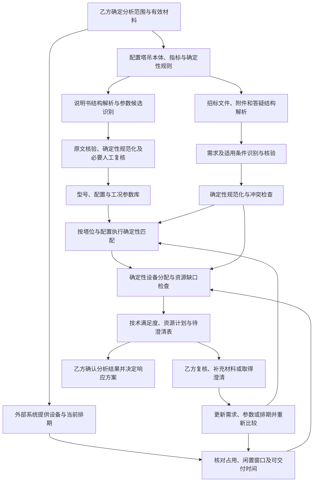

# 面向乙方的塔吊租赁招标文件 AI 辅助分析可行性报告

编制日期：2026-09-19。补充日期：2026-09-20。文档性质：可行性分析与建议实施流程。

本文依据仓库实现及本次需求讨论编制，包含对尚未提交代码的核对。第3节的识别引擎基础以2026-09-19首次评估时的核对为依据；2026-09-20补充准确性目标与外部设备排期分析，不将工作区持续开发的变动当作已验收能力。本文不表示塔吊场景已经开发、完成真实模型验收或部署；后续实施范围和验收标准应另行确认并形成特性规范。

## 1. 结论与业务定位

**该方案具备技术可行性，适合建设为面向乙方单位的 AI 辅助招标文件分析工具。** 以塔吊租赁单位、设备供应商等投标方为使用主体，复用现有文档结构分析和本体引导识别能力，提取招标文件中的技术需求，并与从塔吊技术说明书整理的参数数据库进行确定性匹配，形成有原文依据的需求满足度分析和待澄清表。

在外部系统提供具体设备的排期、预计占用区间和闲置区间后，方案进一步将技术适配与时间可用性结合，生成按塔位、设备和时间组织的**可交付资源计划**。计划说明数据时点、占用窗口、配置及未确认前提，供乙方确认可供设备；计划本身不自动锁定设备或构成对外交付承诺。

排除经独立确认的招标条款待澄清部分后，**95%～99%可以作为限定场景下的准确性验证目标，尚无塔吊实测依据将其写成当前方案的达标预测**。建议首先验证完整需求识别能否达到95%的目标，再评估高质量、规则化子集能否达到99%；确定性数值处理对正确输入和已支持规则应要求验证用例全部正确。具体分层口径、前提和统计方法见第9.3—9.6节。

本文中的“辅助招标分析”指乙方对招标文件进行理解、准备技术响应及内部决策支持，不表示系统代替甲方组织招标。

系统的核心价值在于减少检索、摘录和重复比对工作，使乙方更早发现明确偏差、资料缺口、条件歧义及需要对外澄清的问题。价值需要通过真实样本和人工基线验证，不预先承诺准确率、节省比例或中标收益。

本方案不承诺全自动完成招投标全流程。是否参与投标、采用何种设备与配置、接受何种商务条件、如何报价、如何作出技术承诺及最终递交文件，由乙方相应人员决定。系统给出的“满足”仅指在明示分析范围、有效输入和配置条件下，有证据支持某项需求得到满足，不等于整份投标文件合规、项目可实施或必然中标。

| 评估维度 | 可行性判断 | 成立条件与限制 |
| --- | --- | --- |
| 核心技术 | 有复用基础 | 本体约束识别、原文核验、数量表示及确定性规则已有实现基础，仍需塔吊领域适配。 |
| 文档数据 | 取决于实际材料 | 可读取的正文和表格较易处理；扫描件、图片载荷图、多层表头及缺页材料需额外处理或人工录入。 |
| 业务应用 | 适合辅助分析 | 输出逐条需求、配置匹配结果、偏差和待澄清事项，由乙方复核后用于响应准备。 |
| 资源计划 | 可基于外部排期建设 | 将具体设备与技术配置对应，核对整个占用窗口及多塔位分配；预计腾退和未确认条件单列。 |
| 全自动程度 | 应按条目和场景评估 | 明确数值条件可自动比较；条件归属、冲突、等效替代及材料不足可能需要人工处理。 |
| 经济性 | 尚待实测 | 需要比较材料整理、模型调用、外部数据接入、人工复核和规则维护成本，不能只看抽取速度。 |

## 2. 明确需求、输出与范围

### 2.1 本次明确需求

| 编号 | 需求 | 对应交付 |
| --- | --- | --- |
| R1 | 分析乙方收到的塔吊租赁招标文件，识别关键技术需求 | 带标段、塔位、条件和原文引用的需求清单。 |
| R2 | 利用塔吊技术说明书抽取结果构建或补充技术参数数据库 | 按制造商、型号、配置和工况组织的可比参数。 |
| R3 | 数值处理和比较由确定性引擎负责 | 数值解析、比较符解析、单位换算、查表及约束判断结果。 |
| R4 | 按实际证据反馈需求满足程度 | 逐项满足度矩阵、明确偏差、资料不足及尚未完成的分析范围。 |
| R5 | 汇总需要进一步确认的问题 | 可供乙方内部处理和准备对外询问的待澄清表。 |
| R6 | 定位为辅助分析，保留必要的人工作业与决策 | 复核入口、结论适用范围和明确的人工确认事项。 |
| R7 | 评估排除招标待澄清部分后的95%～99%准确性目标 | AI语义识别、确定性数值处理和最终判断的独立口径、前提及验证方案。 |
| R8 | 使用外部系统提供的设备排期和占用／闲置区间 | 按具体设备、塔位和占用窗口编制可交付资源计划，反馈资源缺口和未确认条件。 |

### 2.2 主要输出

1. **分析范围说明**：使用了哪些招标文件、附件、说明书、技术数据库和外部设备排期，数据时点是什么，哪些材料未提供、未解析或未纳入分析。
2. **技术需求清单**：保留原始条款及其原文位置，区分强制要求、优选要求、描述性信息及性质待确认项。
3. **需求满足度矩阵**：按“需求 × 候选型号及配置”给出结果、双方参数、适用条件、依据和差距。
4. **待澄清表**：说明问题、影响、需补充的材料、建议询问内容及建议处理方。
5. **可交付资源计划**：列出各塔位拟用的具体设备、型号配置、计划使用与实际占用窗口、排期依据、缺口及未确认前提。
6. **辅助分析摘要**：分别概括技术满足度、资源可用性、未决项和未完成范围，供乙方决定下一步处理。

原文引用用于核对当前结论，不据此建设执行历史回放或新的审计平台。以上输出可以共享同一份当前分析结果，不需要分别维护多套事实副本。

### 2.3 范围边界

当前明确范围包括技术需求识别、说明书参数整理、技术符合性比较，以及利用外部排期编制现有设备的可交付资源计划。资格、商务、合同、报价和人员等事项如果未纳入分析范围，应在报告中明确“未评估”，不能因技术参数与排期通过而推定这些条件也得到满足。

说明书描述的是型号或配置能力，不能证明某台实物设备的出厂日期、当前状态、有效证件或可租赁档期。排期和时间可用性由外部系统提供，并与具体设备关联；其他未提供的台账或检测材料仍应明确缺失，只有实际取得相应证据并配置了判断规则，才可以评价相关条款。

自动生成完整投标文件、自动报价、自动对外发函、自动作出商务或法律承诺、自动递交投标文件，以及现场布置、基础设计、群塔协同和施工方案的专业审定，不属于本方案的默认建设内容。

## 3. 当前基础与待建设能力

### 3.1 已核对的实现基础

| 能力 | 当前事实及代码依据 | 在本方案中的用途与缺口 |
| --- | --- | --- |
| 结构与表格解析 | [docx_structure.py](../backend/app/services/extraction/docx_structure.py)保留章节、段落、单元格和合并来源；[document_ir.py](../backend/app/services/extraction/document_ir.py)提供文档中间表示。 | 可复用原文定位和表格上下文；仍需验证塔吊载荷表的实际版式。 |
| 文件接入 | [artifact_store.py](../backend/app/services/document_analysis/artifact_store.py)当前在线上传白名单为 `.doc/.docx`。 | PDF、扫描件及图片载荷图尚不能视为在线链路的既有完整能力。 |
| 本体约束识别 | [ontology_plan.py](../backend/app/services/extraction/ontology_guided/ontology_plan.py)编译合法属性和关系；[claim_protocol.py](../backend/app/services/extraction/ontology_guided/claim_protocol.py)表达实体、属性、条件、否定和选择组。 | 核心可迁移，但需要塔吊本体、词汇和需求语义定义。 |
| 发现与核验 | [tool_model_adapter.py](../backend/app/services/extraction/ontology_guided/tool_model_adapter.py)分开发现与核验，约束证据和声明归属。 | 可用于检查型号、配置及参数归属；模型核验仍可能出错，需领域评测。 |
| 数量规范化 | [metric.py](../backend/app/services/extraction/tool_validation/metric.py)及[literal_normalizer.py](../backend/app/services/extraction/literal_normalizer.py)处理数值、区间、边界和单位。 | 复用确定性处理；补充吨、力、力矩等单位及中文比较表达，默认标量策略不能直接覆盖全部需求。 |
| 规则比较 | [interpreter.py](../backend/app/services/reasoning/interpreter.py)已有比较和真／假／未知逻辑。 | 可复用比较语义；需求—设备配对、配置选择和性能查表仍需实现，不照搬制药业务规则。 |
| 外部实例检索 | [external_records.py](../backend/app/services/extraction/external_records.py)已有显式来源及按名称、别名、标识查询的机制。 | 可辅助指定型号查询；尚不等同于按技术约束筛选塔吊的完整匹配器。 |
| 本体加载 | [ontology_engine.py](../backend/app/services/ontology_engine.py)当前模块和文件注册仍以制药本体为主。 | 需要接入独立塔吊领域定义，不能只更换提示词，也不应把塔吊概念硬塞入药品类型。 |
| 同主体批处理 | [recognition_batch.py](../backend/app/services/extraction/ontology_guided/recognition_batch.py)限制为同主体、同记录、同作用范围的多谓词组包。 | 可减少重复读取；不能据此宣称整张多型号表已能完整批量识别。 |
| 设备排期来源 | 2026-09-20核对的[equipment_schedule_source.py](../backend/app/services/extraction/equipment_schedule_source.py)是生产、清洗排期的Mock数据源。 | 不能当作真实塔吊排期接入完成的证据；本次明确需求仍需接入乙方外部系统并实现设备与塔位的资源分配。 |

### 3.2 正在变化的代码边界

首次评估（2026-09-19）时，[029 记录驱动识别任务](../specs/029-record-entity-discovery/tasks.md)已标记开始实施，工作区出现了[record_discovery.py](../backend/app/services/extraction/ontology_guided/record_discovery.py)等部分代码，而当时的[对应规范](../specs/029-record-entity-discovery/spec.md)仍保留“未实施”描述。这是首次核对时的状态记录，不代表后续工作区状态；不能据文件存在或任务计划认定在线闭环完成、真实模型质量通过或已部署。实施本专题时以届时已核验的新运行能力选择复用入口，不为本报告另行保留旧识别路径。

塔吊场景可以先基于当前已验证的识别路径开展样本试验。是否依赖记录驱动重构，应由多型号表格漏识别、属性归属和实际成本结果决定，不将完整重构设为未经验证的前置条件。

### 3.3 通用性的边界

当前架构具有“文档结构、输入本体、证据核验、确定性处理”分层复用的基础。跨领域迁移的主要工作是接入领域概念、参数与配置表达、数量策略和业务比较规则。

这种通用性不意味着所有文档格式、所有本体构造或所有工程问题已经受支持。尤其是多维载荷表、附图、脚注、跨文档型号归并和现场约束，需要结合具体材料单独验收。

## 4. 总体流程与职责分工

已有技术参数数据库时，可以从参数库接入环节开始；无需为每份标书重复抽取所有说明书。闭环中的补充仅针对有新材料或新判断的受影响条目，不因重复运行而自动补造缺失事实。

| 参与方或组件 | 主要职责 | 不应承担的职责 |
| --- | --- | --- |
| AI 识别模块 | 定位条款和字段，识别指标与主体，绑定型号、塔位、配置和条件，提出带逐字原文依据的语义候选。 | 不负责数值换算、计算结果和最终数值比较，不自行创造性能数据。 |
| 确定性引擎 | 从原文数值片段解析数量和比较符，校验单位与量纲，执行查表、时间区间、数量、设备分配及已定义规则比较。 | 不凭计算补齐缺失条件，不把未知当作满足或不满足。 |
| 外部设备系统 | 提供具体设备身份、配置、排期、预计占用／闲置窗口及数据时点。 | 说明书和AI不能替代其设备台账及排期事实；本方案不另建权威排期系统。 |
| 乙方技术人员 | 确认领域定义、配置归属、歧义、关键条款、设备方案和技术结论。 | 不要求逐条手算系统已能正确执行的明确计算。 |
| 乙方业务或投标人员 | 确定材料范围、组织补料和澄清、确认响应口径、作出业务决策。 | 系统不代替其作出对外承诺。 |

模型识别“这个数值属于什么指标、哪个对象、什么条件”；确定性引擎处理数值并判定已定义约束。即使计算完全正确，主体或条件绑定错误仍会导致错误结论，因此必须分别验证两类正确性。

## 5. 分步实现流程

### 5.1 确定材料与分析范围

输入包括招标正文、技术附件、设备需求表、已收到的补遗或答疑、说明书或已有参数数据库，以及外部设备清单和排期。乙方指定本次分析的标段、塔位、使用时间、数量及拟比较的设备范围。

处理要求：

- 建立本次材料清单，说明缺少的附件、无法读取的页面和未纳入的内容。
- 文件之间有明确的替代或修订关系时，按经确认的有效依据使用；不能仅按文件名或日期自动认定后者覆盖前者。
- 无法确定哪份材料有效，或者正文、附表和答疑冲突时，保留冲突及各自引用，进入待澄清表。
- 标明本次只评价技术参数还是还包含已明确授权的其他条款，避免扩大报告结论。

输出为有效材料集合、分析范围和初始缺料清单。这是业务分析输入，不要求建设招投标全生命周期管理系统。

### 5.2 建立最小塔吊领域定义

本体定义合法概念、指标和关系，提取配置定义别名及数量形式，匹配规则定义如何判定要求得到满足。三者分别承担职责，不用本体自动推定原文不存在的事实。

| 对象 | 建议的最小信息 | 用途 |
| --- | --- | --- |
| 标段／塔位需求 | 所属项目范围、塔位标识、相关要求 | 防止不同塔位需求混合。 |
| 技术要求 | 指标、原始要求、适用对象、条件、强制或优选性质、原文引用 | 表达乙方需要响应的约束。 |
| 塔吊型号 | 制造商、型号及明确变体 | 区分不同来源和产品。 |
| 设备配置 | 臂长、倍率、安装形式等实际影响性能的配置维度 | 保证比较基于能够同时成立的配置。 |
| 性能记录 | 配置、工作幅度、额定起重量或其他指标、适用条件、说明书引用 | 表达条件化能力与载荷表。 |

指标应按业务语义区分，例如最大起重量与指定幅度处额定起重量、独立起升高度与附着状态高度、起重力矩与质量。名词相似或量纲相同不意味着指标可以互换。

不预建全部土建工程本体。首轮以样本实际出现且与选型直接相关的指标为范围，再根据验证结果补充。

实物设备及排期使用外部系统的唯一编号与明确字段，关联上述型号配置和塔位需求即可；不要求为了时间区间计算而将外部全部业务数据复制到本体中。

### 5.3 说明书解析与参数库整理

1. 对每份说明书确认制造商、型号、适用变体及文本中明确给出的适用范围。缺少这些信息时保留来源记录，不随意归入同名型号。
2. 解析正文、表格、表头、脚注和配置说明。PDF或图片材料如果没有合格解析能力，明确转入人工整理或待建设解析环节；不能把图像内容当作已抽取。
3. AI 提出型号、配置、指标及原始值候选，保留数值单元格、单位表头和限定条件的各自引用。
4. 核验值属于哪个型号、配置和工况，尤其检查同一表中多型号、多倍率、多臂长及“仅适用于……”等限定。
5. 确定性引擎解析和规范化原始数值、单位与边界；不能规范化的条目保留原因和原文。
6. 对新型号、关键载荷数据和存在歧义的配置关系进行必要人工复核，形成可用于比较的参数记录；未通过核验的候选不能当成确定性能。
7. 按明确的型号与配置键对接已有数据库，保持文档来源与适用说明。不同说明书参数冲突时，不简单选择最大值或平均值。

参数库不能只保存“型号、最大起重量、最大臂长”三个字段。匹配至少需要能表达同一配置在相应工况下的能力；否则可能把不同配置的最优参数拼接成并不存在的设备方案。

载荷表宜保留为配置条件下的性能记录集合。当前数据规模能够用既有数据库表达时，不新增图数据库或独立数值服务。

### 5.4 招标文件解析与需求识别

1. 按章节、条款、表格和附件组织记录，识别塔位、编号与交叉引用。
2. 在确定的本体范围内定位技术要求，抽取原始指标、数值片段、比较表达、条件、单位来源和条款性质。
3. 对复合条款拆出可比较的子项，同时保留父条款和原始“且／或／任选”等组合逻辑，不因拆分改变满足条件。
4. 核验条件和主语归属，区分“投标设备必须具备”“建议配置”“可选配置”“现场已具备”等不同语义。
5. 检查正文与附表重复、补遗修改和互相冲突的要求；重复出现可以合并展示，但保留全部必要引用。
6. 记录未解析、未尝试和无法判定的部分。摘要和语义相似度只帮助定位，不能作为技术要求已经成立的证据。

需求清单至少包含：需求编号、标段／塔位、父条款、指标、完整原始要求、原始数量和比较词引用、单位来源、条件、组合关系、强制／优选性质、证据位置及当前可处理情况。

“是否属于强制要求”应由招标文本和已确认业务口径支持；模型不能因为某参数看起来重要就自行赋予否决性质。无法明确时标记性质待确认。

### 5.5 确定性数值处理与规则形成

**所有数值处理和比较由确定性引擎执行。模型返回原始片段和语义归属，程序根据已登记规则生成可执行约束。**

| 处理事项 | 确定性处理规则 |
| --- | --- |
| 原始值解析 | 解析数值、正负号、十进制、区间与边界；不接受模型自行改写的计算结果作为权威值。 |
| 比较词解析 | 将原文“不小于／至少／不得低于”等经登记表达映射为明确运算符；未覆盖或有歧义的表达返回未决。 |
| 单位规范化 | 根据单位表和来源绑定换算；保留原单位与原值，不凭行业习惯填单位。 |
| 量纲与指标校验 | 先检查指标相同或具有明确可比规则，再检查量纲；质量、力和力矩不得混用。 |
| 精度与边界 | 用明确精度策略处理十进制和开闭端点；不能为了通过而先四舍五入，也不擅自增加容差。 |
| 工况取值 | 按型号、配置和条件选择性能记录；条件不匹配或记录缺失时不返回可信能力值。 |
| 条件组合 | 执行已经核验的且／或、集合成员和禁止条件；复杂自然语言条件超出规则能力时保留人工判断。 |
| 结果输出 | 返回判断、所用输入、适用条件和未决原因，供满足度矩阵解释。 |

数量政策应明确允许标量、区间、下限或上限。不能将“≥2.5 t”降成无比较语义的“2.5”，也不能任意取区间某一端点代表全部能力。

对载荷图或离散表格，优先使用有明确对应条件的数据。只有制造商资料和经确认的业务规则明确允许特定插值方式时，才由确定性引擎按该规则计算；否则输出“缺少对应工况数据”。不能默认线性插值，也不能用最大起重力矩简单推导整条载荷曲线。

### 5.6 技术需求与候选配置匹配

有明确型号要求时，先查询型号及变体；只有性能要求时，按已规范化的技术约束查询候选配置。名称或语义相似度命中只表示候选相关，不能直接产生满足结论。

匹配顺序为：

1. 核对条目适用的塔位、阶段及工况。
2. 选取在同一型号、同一有效配置下可以共同使用的性能记录。
3. 对每个原子要求执行确定性比较，再按原条款组合关系聚合。
4. 明确列出强制要求中的不满足项和未决项；优选项单独评价，不能抵消强制偏差。
5. 需要改变配置才能满足时，将其作为独立候选方案，并列出仍需确认的前提；不改写当前拟投配置的结论。
6. 对各塔位分别形成候选配置清单，交给第5.7节关联外部设备与排期。多个塔位分别找到可行型号，不等于已有足够数量的实物设备，也不等于现场布置方案成立。

已知失败条件可以提前用于筛选，但被跳过的其他条目仍应显示“未完成比较”，不能因候选已淘汰就把其余项记成不满足。最终汇总保留执行情况与技术结论的区别。

### 5.7 外部设备排期接入与可交付资源计划

外部系统已具备设备排期数据，是本次补充采用的输入前提。这里设计的是其接入和分析方式，尚未核验真实数据字段、完整性或接口；输入来自结构化查询或文件时，按显式字段映射读取，不让AI重新猜测已提供的数值和日期。

#### 5.7.1 输入与数据责任

| 输入 | 必要内容 | 作用 |
| --- | --- | --- |
| 实物设备清单 | 外部唯一设备编号、型号、当前或可提供配置、设备状态。 | 以设备编号连接技术参数，防止把同型号的一台设备当成多台。 |
| 占用区间 | 设备编号、起止时间、占用性质、已确认或预计状态。 | 包含已提供的项目占用、维护、预留等不可用时间；预计结束不能当作实际腾退。 |
| 闲置区间 | 设备编号、起止时间、是否可调配、确认程度。 | 判断连续可用窗口；无占用记录不自动等于闲置。 |
| 数据范围 | 来源、更新时间或当前版本、覆盖时间范围、时间粒度、时区和端点含义。 | 确定排期可解释的范围；查询窗口之外不能推定空闲。 |
| 交付准备条件 | 已明确的拆卸、转场、检修、配置调整、运输、安装及退场所需时间，或外部系统直接给出的可交付／可释放时间。 | 从“账面闲置”判断能否按期使用；只纳入当前任务实际需要且有依据的条件。 |
| 项目资源需求 | 塔位、所需数量、技术配置要求、进场或可使用日期、预计结束时间，以及日期是否可调整。 | 定义计划对象；“进场日”“可使用日”和“开始计租日”不能直接等同。 |

只有外部系统明确提供完整覆盖窗口和占用口径时，才可在该窗口内通过区间差集派生闲置；否则采用明确提供的可用区间，缺口保持未知。占用与闲置互相冲突时，不挑选有利结果，而是要求确认有效数据。

外部系统是设备和排期的权威来源。本系统只保存当前分析所需的关联与结果，不复制建设新的排期账本，也不自动写回、预订或调拨设备。计划显示所用数据时点；乙方确认拟供方案前重新核对最新排期，变化只重算相关资源计划。

#### 5.7.2 确定性时间与数量计算

统一采用明确的时间精度和区间端点规则。例如内部可使用半开区间 `[开始, 结束)`；外部“截至某日当天”的日期必须按约定映射，不能直接当作当天零点结束。自然语言日期的语义由识别和核验确定，日期解析、偏移、交集、差集、持续时间和冲突比较均由确定性引擎执行。

假设某塔位需在 `u_start` 至 `u_end` 使用设备，且已确认的使用前准备时间为 `b_pre`、使用后释放时间为 `b_post`，所需资源占用窗口可表示为：

`W = [u_start - b_pre, u_end + b_post)`。

这只是明确输入下的计算形式，不能擅自给准备时间设零值或默认天数。如果外部可用窗口已包含这些准备时间，应明确边界并避免重复扣减。不同设备的转场条件可能不同，应分别计算；必要条件缺失时列为待核实。

对设备 `e`，只有在整个 `W` 落入已明确的连续可调配窗口、与适用的占用／不可用区间不相交，且该实物设备能够提供所需技术配置时，才可列入对应塔位的资源计划。不能把多个分散闲置段的天数相加来代替连续可用；允许中途换机时必须有明确业务依据并另列交接条件。

多个塔位或多台数量需求还须联合分配：

1. 先生成每个需求的技术合格设备候选，再比较各设备的有效占用窗口。
2. 在本次计划内，同一实物设备不能分配给占用时间重叠的两个需求；共用且已纳入约束的附件同样不能重复占用。
3. 同一设备可服务不重叠的需求，但需要计入经确认的释放和转场时间。允许的日期调整区间已知时，确定性计算可行日期；不能自行推迟招标要求。
4. 按候选集合进行整体可行分配，而不是仅统计各塔位各自有多少候选。简单选择顺序失败不能当作“无可行计划”；计算未完成时应注明未完成，不宣告资源不存在。
5. 如果完整检查后仍不足，按塔位和时间段列出所需数量、可分配数量及缺口，区别“当前候选范围无满足设备”和“数据不足无法确认”。

本期目标是生成可解释的可行资源计划及缺口，不默认增加采购、外租寻源、全局成本最优调度或其他项目的自动重排。

#### 5.7.3 计划输出与结论边界

每行计划至少包含：项目／塔位、数量、拟用设备编号、型号配置、技术判断及需求矩阵引用、要求使用区间、包含准备与退场的占用区间、外部闲置依据、计划到场／可使用／释放日期、当前可用性结论、数据时点及尚未落实的前提。

| 资源判断 | 含义 | 对计划的处理 |
| --- | --- | --- |
| 按当前排期可安排 | 技术条件明确通过，当前数据支持完整占用窗口和联合分配。 | 列入拟交付计划，乙方确认前核对最新排期。 |
| 有条件可安排 | 依赖尚未兑现的预计腾退、配置转换或其他未确认条件。 | 单列为条件方案，不计入无待确认前提的可分配数量。 |
| 当前排期不可安排 | 已明确占用、准备时间不足或设备数量不足。 | 给出冲突窗口、数量缺口和受影响塔位。 |
| 待核实／未完成 | 数据缺失、过期程度不满足约定、身份不匹配或分配尚未算完。 | 保留具体原因，补料或继续计算。 |

技术满足度与资源可用性分别展示。排期空闲不能抵消技术不满足，技术满足也不能抵消排期冲突；预计可腾退不等于已承诺按时交付。资源计划可以说明“当前数据下可安排”，不能据此自动代表设备已被锁定或未来排期一定不会变化。

### 5.8 乙方复核、补料与结果更新

乙方查看需求矩阵、可交付资源计划和待澄清表，确认关键要求、拟用设备、配置、排期及尚未解决的问题。对内可以补充型号资料、设备信息或确认腾退计划；对外可以依据待澄清表组织询问。系统生成的是问题草稿，不自动发送。

收到补充材料、正式澄清或更新排期后，确定其适用范围和有效性，更新受影响需求、配置、参数或设备窗口，再执行相关比较和资源分配。仅仅编辑待澄清表中的文字或填写“已处理”，不能自动使技术要求变为满足或使资源变为可安排。

存在无法消除的偏差时，报告应如实保留，供乙方决定调整方案、提出偏差响应或放弃该候选。是否仍参与投标及如何作出承诺，由乙方决策。

## 6. 需求满足度的表达与统计

### 6.1 逐项判断

应分别表示“技术结论”“执行是否完成”和“是否已经人工确认”。系统已核验的抽取结果、确定性比较结果与乙方已确认的响应承诺，不是同一状态。

| 展示结果 | 使用条件 | 后续处理 |
| --- | --- | --- |
| 满足 | 需求明确、归属已核验、配置一致、数据足够，确定性规则或适用的已确认语义判断支持满足。 | 保留所用配置及双方依据，供乙方确认响应。 |
| 不满足 | 在明确适用条件下，有足够证据证明候选配置不达到要求。 | 列出差距和对应条款，评估替代配置或形成偏差响应。 |
| 待核实／澄清 | 资料缺失、条件不明、来源冲突、语义归属未定或规则尚不能处理。 | 说明缺口，进入待澄清表；不提前记为满足或不满足。 |
| 不适用 | 有明确依据证明该要求不适用于当前标段、塔位或配置，并完成适用性确认。 | 展示依据；不能用来隐藏不支持的条款。 |

“未开始、处理中、解析失败、预算中止、比较未执行”等属于执行情况。即使部分需求已经得出结果，尚未处理的部分仍应单列为“未完成”，不能改写成“资料不足”或“全文无此要求”。

“更换某配置后可能满足”是方案建议，当前拟投配置仍保持原结论。如果满足取决于尚未确认的附件、安装条件或可提供配置，应显示前提尚未落实，不使用无条件的“满足”。

### 6.2 组合条款与整组要求

- 对“且”组合，只要任一必要子项明确不满足，组合条款不满足；全部子项满足才可判满足；其余情况为未决。
- 对“或”组合，满足一项是否足够，应以原文的备选语义为准；不得把“任选其一”改成全部必需，也不得把全部必需改成任选。
- 对一组强制要求，任何明确不满足项都应作为突出偏差展示；任何未决或未完成项都阻止报告“该组要求全部满足”。
- 对数值超限的判断，只有在其数据、配置和条款都有效时才成立。原文冲突尚未解决时，不能选择对乙方有利的一份数据输出通过。

单个指标的判断不能替代整组要求。多个指标分别在不同配置下通过，也不能证明存在一个能同时满足全部要求的配置。

### 6.3 满足度指标

报告优先展示条目和数量分布，百分比仅作为辅助。统计以去重后的明确需求编号为基础，父条款和拆出的子项不能在同一口径中重复计数；口径应在对比候选前确定。

对于**已识别、纳入范围且确认适用**的需求，令：

- `N`：该范围内需求总数；
- `S`：已证实满足的数量；
- `F`：已证实不满足的数量；
- `U`：已分析但仍待核实／澄清的数量；
- `X`：尚未完成分析或比较的数量。

各项互斥，`N = S + F + U + X`。可以报告：

| 指标 | 口径 | 解释 |
| --- | --- | --- |
| 已证实满足比例 | `S / N` | 未决和未完成仍在分母中，不能被隐去。 |
| 已明确判定比例 | `(S + F) / N` | 反映多少条目已有明确技术结论，不表示满足程度。 |
| 未决与未完成 | 分别列出 `U`、`X` 及原因 | 说明需要补料、澄清或继续处理的工作。 |

`N = 0` 时显示“无可统计条目”，不能显示100%。尚未确认适用性的条目单独列出数量及原因，不静默排除；确认不适用的条目也保留清单。

例如10项中6项满足、1项不满足、2项未决、1项未完成，应报告上述完整分布和60%的已证实满足比例，不能仅在7个已判定项中计算后将其称为总体满足率。强制项和优选项分别统计，不能用大量优选项通过掩盖一项强制偏差。

这些比例只描述已经识别的需求清单，不能证明全文需求已经找全。报告还应列出材料及章节处理范围；业务验收通过人工独立标注检查需求漏提。只有招标文件给出明确评分办法且确认纳入本次范围时，才按该办法计算评分，不自行创造权重或中标概率。

### 6.4 技术满足度、资源覆盖与准确率分别报告

第6.3节的比例回答“候选满足多少需求”；第9节的准确率回答“系统判断有多少是正确的”；资源覆盖回答“各时段实际能安排多少台设备”。三者不能混用，例如技术满足率99%不能证明系统准确率99%，也不能证明所需设备数量已经齐备。

资源计划按需求的并发时段列出所需数量、经联合分配后按当前排期可安排的数量、条件可安排数量及缺口。条件设备不与无待确认前提的设备合并计数，同一设备不重复计入重叠塔位。全期平均空闲台数或总闲置天数不能代替每个必需时段的资源覆盖。

## 7. 示例：从原文到满足度与待澄清表

**本节全部名称、条款、数值和定位均为虚构示例，用于说明输出形式，不是任何真实型号的性能或实际项目结论。**

假设乙方拟为1号塔位采用“示例型号A／配置C1”。说明书M1明确列出了该配置的工作幅度、55 m工况起重量和独立高度，但未提供变频起升证据，也未关联任何具体设备台账。

### 7.1 需求满足度矩阵示例

| 编号 | 招标要求及示例定位 | 候选配置依据 | 判断 | 原因与动作 |
| --- | --- | --- | --- | --- |
| T01 | 工作幅度不小于60 m；附件T表1第1行 | M1表2：配置C1工作幅度60 m | 满足 | 同一配置下 `60 ≥ 60`。 |
| T02 | 在55 m幅度处额定起重量不小于2.5 t；附件T表1第2行 | M1载荷表：配置C1在55 m处为2400 kg | 不满足 | 确定性换算要求为2500 kg，差100 kg；评估其他真实配置或替代型号。 |
| T03 | 独立安装起升高度不低于40 m；附件T表1第3行 | M1表3：配置C1独立高度42 m | 满足 | 安装形式一致，`42 ≥ 40`。 |
| T04 | 塔高不低于60 m；技术章节第4条 | 条款未说明高度基准及独立／附着条件 | 待核实／澄清 | 不能将说明书的某个最大高度直接代入，需要明确条件。 |
| T05 | 应采用变频起升；技术章节第5条 | 现有说明书材料未能证实配置C1具备该功能 | 待核实／澄清 | 未见证明不等于明确不具备，需补配置资料。 |
| T06 | 使用年限不超过5年；设备条件第2条 | 参数库只有型号资料，没有拟投实物设备及日期 | 待核实／澄清 | 需设备台账，并明确年限起算及截止日期。 |

该示例只能反馈“2项满足、1项不满足、3项待核实／澄清”。T02存在明确偏差，不能因其他项目通过而将配置C1推荐为全部满足要求。T06也不能由产品型号参数推导。

输出时，每条引用应可定位到实际原文。Word材料没有可靠页码时，使用章节、表格、行列和文字片段，不伪造页码。

### 7.2 待澄清表字段

待澄清表用于组织下一步工作。应区分向招标方确认、向制造商补料和乙方内部核实，不把内部问题全部发给甲方，也不把明确偏差伪装成文字歧义。

| 字段 | 内容 |
| --- | --- |
| 事项编号与关联需求 | 可以定位到需求及候选配置；一个问题影响多项时列出关联。 |
| 问题类型 | 条款歧义、材料缺失、来源冲突、配置待定、设备或排期信息缺失、预计腾退待确认或分析能力不足。 |
| 原文与依据 | 引用造成疑问的条款、说明书或明确缺失的材料。 |
| 当前判断及影响 | 哪些需求无法判定，是否影响选型或关键响应。 |
| 待确认问题 | 具体询问内容，不暗示对方必须接受有利解释。 |
| 所需材料或答复 | 例如载荷表、配置清单、有效补遗、设备日期和证件。 |
| 建议处理方 | 乙方技术人员、乙方设备管理人员、制造商或招标方；实际负责人由乙方确定。 |
| 处理进展与答复依据 | 未确认／已取得答复／已应用于比较；结论变化须有实际内容支撑。 |

处理进展是当前工作状态，不需要另建复杂流程平台。没有给出答复期限时保持空白；原文明确了澄清截止时间时可以引用，不能自行编造。

### 7.3 待澄清表示例

| 编号／关联需求 | 问题与当前影响 | 建议询问或补料内容 | 建议处理方 |
| --- | --- | --- | --- |
| Q01／T04 | “塔高”定义及安装条件不明，无法评价高度要求 | 请明确60 m对应的高度指标、测量基准、使用阶段及安装条件，是否允许附着。 | 乙方技术人员整理后向招标方确认。 |
| Q02／T05 | 无配置C1变频起升证明 | 请提供配置C1的起升机构配置清单或相应技术文件，并确认是否为拟供配置。 | 乙方设备部门／制造商。 |
| Q03／T06 | 未指定实物设备，缺少年限判断基础 | 确定拟投设备，补充出厂或相关日期；如果招标文件未定义年限口径，再确认起算与截止口径。 | 乙方设备部门；口径疑问由投标人员对外确认。 |
| Q04／资源计划 | 候选设备的可用窗口依赖上一项目预计退场，暂不能无条件列入计划 | 确认设备释放时间是否包含拆卸、运输和检修，计划是否已确认，以及能否支持本项目的准备窗口。 | 乙方调度／设备管理人员。 |

T02应直接进入偏差清单，不能仅通过提出“是否可以降低要求”就改判满足。如果乙方决定询问替代方案是否可接受，系统可以形成问题草稿，但必须取得有效答复后才能改变相应需求口径和匹配结论。

### 7.4 可交付资源计划示例

另设一个独立的虚构资源场景：两个塔位分别需要1台设备，使用区间均为 `[2026-10-01, 2027-02-01)`；乙方已确认使用前准备4天、使用后释放2天，因此每台设备需覆盖 `[2026-09-27, 2027-02-03)`。示例日期统一按项目本地时区零点解释，均采用半开区间。

以下四台设备均假设已通过这两个塔位的明确技术要求，与前文技术不满足的配置C1无关。数据时点假设为2026-09-20，外部已完整提供下表涉及的时间范围及不可用情况。

| 设备编号 | 外部可调配窗口 | 确定性检查 | 计划处理 |
| --- | --- | --- | --- |
| EQ-01 | `[2026-09-25, 2027-02-10)`，排期口径已确认 | 完整覆盖所需占用窗口。 | 分配给塔位1；不能再同时分配给塔位2。 |
| EQ-02 | `[2026-10-05, 2027-02-10)` | 无法覆盖开始使用日期及此前准备时间。 | 当前排期不可安排，保留时间缺口。 |
| EQ-03 | `[2026-09-25, 2026-11-01)`及`[2026-11-08, 2027-02-10)` | 中间存在不可用间隙，不能拼接为连续可用。 | 当前排期不可安排；没有换机授权不自行拆分使用期。 |
| EQ-04 | `[2026-09-27, 2027-02-03)`，但起点依赖上一项目预计腾退 | 若腾退及准备条件兑现，边界上可覆盖；条件尚未确认。 | 作为塔位2的条件候选，并关联Q04。 |

资源计划应反馈：当前可安排1台，条件候选1台，所需2台中仍有1台未落实；不能写成“2台均已确定可交付”。若EQ-04的条件得到确认并在最新排期中成立，重新检查联合分配后，才可更新为当前排期支持2台。其确认仍不代表系统已完成设备预订。

## 8. 建议实施顺序与最小建设范围

本节描述后续建设路径，不表示本报告已授权或已执行代码开发、数据库操作、模型评测及部署。进入实现时，应基于确认范围遵循 `specify → clarify → plan → tasks → implement` 流程，形成相应规范及验收制品。

| 阶段 | 主要工作 | 可审查交付物 | 进入下一阶段的依据 |
| --- | --- | --- | --- |
| A：样本与业务口径 | 收集实际标书、说明书和外部排期样本，核对指标、设备身份、时间口径及人工分析方式。 | 样本清单、分层准确性目标、独立待澄清排除清单及接口数据约定。 | 材料具备代表性；明确评测分母和资源计划边界。 |
| B：最小数据闭环 | 接入塔吊本体，整理少量型号配置，绑定需求原文、实物设备和排期。 | 可核验的需求、参数、设备及时间窗口样本。 | 数值归属、设备身份和时间语义可正确表达；缺项可明确输出。 |
| C：确定性匹配与资源计划 | 补充工程单位、比较表达、配置查表、区间计算及联合设备分配。 | 满足度矩阵、可交付资源计划和待澄清表。 | 数值、边界、数量及冲突反例通过，未决不会被隐藏为满足或可安排。 |
| D：真实项目辅助试用 | 与乙方独立人工分析和调度方案对照，记录识别、比较、分配、复核时间和成本。 | 分层准确性、自动处理覆盖率、资源计划正确性及成本报告。 | 根据第9节实测判断95%或99%目标是否达到；未覆盖范围明确。 |
| E：按证据扩展 | 根据实际瓶颈补充PDF／图像解析、更多配置或数据库接入。 | 经验证的增量能力。 | 每项扩展对应已出现的需求；不以“全自动招投标”为默认目标。 |

首轮宜选择包含不同厂商、不同版式以及多配置载荷表的样本，包含至少一种条件歧义、资料不足和明确不满足情况。样本数量由实际格式差异与验证目标确定；小样本只能证明路径可运行，不能外推全部项目质量。

最小实现优先复用现有文档运行、原文定位、本体菜单、核验、数值处理、数据库和展示组件，新增塔吊领域定义、必要解析适配、需求—配置匹配、外部排期读取、设备分配及报告输出。数值与时间计算可先作为同一后端中的确定性模块，不为模块职责独立而另建微服务；外部系统继续负责正式排期和资源预订。

既有数据库可以满足试验时，先验证需求抽取与匹配；说明书入库可以单独验证。PDF或图片是主要资料时，其解析质量应成为首轮验证重点，不能以Word样本成功代替。

## 9. 验证方法与验收口径

### 9.1 验证分层

| 层次 | 检查重点 | 报告内容 |
| --- | --- | --- |
| 文档解析 | 数值单元格、表头、脚注、配置说明和原文引用是否完整正确。 | 解析失败、缺失及错误归属，不能只报告文字识别率。 |
| 需求抽取 | 需求是否漏提，指标、塔位、强制性、比较表达和条件是否正确。 | 需求召回与精确性，关键条件错误及未决比例。 |
| 说明书抽取 | 型号、配置、工作幅度、载荷及单位是否正确绑定。 | 字段正确性及整条性能记录正确性，多型号串值数量。 |
| 数值与规则 | 单位换算、开闭边界、比较符、配置筛选和组合逻辑。 | 可重复的确定性用例结果及不支持情况。 |
| 最终匹配 | 每个需求—配置配对是否判对，特别是错误判为满足。 | 满足／不满足／未决的对照结果，漏检偏差和错误排除。 |
| 排期与资源计划 | 日期边界、准备时间、连续可用、并发数量、设备重复分配及预计状态。 | 计划是否符合所用排期与技术输入；未来实际履约另行观察，不能当作确定性计算正确率。 |
| 待澄清表 | 是否覆盖真实缺口，问题是否准确、可答、指向合适处理方。 | 关键澄清漏项、无效问题和人工修改情况。 |
| 业务效果 | 乙方是否更快完成可用分析，复核工作是否可接受。 | 包含材料整理、识别、复核、补料和修正的总时间及成本。 |

真实评测应固定文档、本体、模型、参数库、分析范围和预算，以独立人工参考评价。参考答案不进入识别输入；人工修正后的最终结果与系统首次结果分别报告，不能将修正后的正确性宣称为自动识别正确性。

没有人工参考时可以报告工程运行结果和个案问题，不能宣称真实召回率。尚未完成或无法评分的条目单独列出，不从质量统计中悄悄删除。

### 9.2 必须覆盖的反例

1. 标称最大起重量较大，但指定幅度处起重量不足。
2. 每项最大值分别合格，却来自不能同时使用的不同配置。
3. 同一表格列出多个型号，载荷值、单位或脚注被错误归属。
4. 独立高度与附着高度混淆，或“塔高”含义未明确。
5. `>`与`≥`边界不同，区间端点开闭不同，换算后数值恰好在边界。
6. 中文“不得超过／不低于／至少”及否定表达，不能丢失约束方向。
7. 说明书无对应工况数据，系统不得自行插值、补值或推定满足。
8. 标书、附表或答疑相互冲突，有效口径尚未确认。
9. 未提供某功能证明，不能据此断言功能不存在；明确写“不具备”则应保留否定事实。
10. 型号资料具备，但实际设备、年限、数量或档期材料缺失。
11. 解析失败、处理中断或某章节未覆盖，报告仍须暴露未完成范围。
12. 只满足备选分支的一项、全部必须项的一项，以及明确不适用的条目，聚合结果应符合原文逻辑。
13. 外部日期含结束日而内部采用半开区间，转换不能少算或多算一天；未提供时区和粒度时不能猜测。
14. 闲置开始晚于准备开始、闲置总天数足够但中间有占用、外部窗口不足或占用与闲置相互冲突。
15. 两个同时使用的塔位只有同一台合格设备，不能分别通过后宣称数量齐备；简单贪心分配失败也不能误报无解。
16. 预计腾退、计划维护、配置调整时间或交付准备缺少确认，不能输出无条件可交付。
17. 明确条款被系统错误标成待澄清、遗漏或技术失败，不能通过从准确性分母中删除来提高成绩。

确定性模块应通过约定规则的边界和反例测试。AI侧质量、最终误判容忍度和人工复核工作量应在试点前由乙方与实施方约定，不在缺少样本时虚设“已达到”的指标。

本报告编制阶段没有开展塔吊真实文档模型评测，也没有验证实际部署。当前机制和既有工程测试不能直接证明塔吊场景的识别质量。

### 9.3 对95%～99%准确性目标的判断

**排除招标文件自身确实待澄清的部分，可以降低语义判断难度，但不足以单独保证95%～99%。** 文档解析、指标识别、数值归属、配置关联、说明书质量和规则覆盖仍会影响结果。当前没有真实塔吊保留集测量值，不能给出有统计依据的达标概率或称“预计已经能够达到”。

建议将95%作为完整需求识别的首轮验证目标，将99%作为经过范围限定、条件优化和独立评测后再争取的较高目标。以下目标是规划判断，不是行业统计、模型性能证明或本系统已测结果。

| 评估对象 | 对95%～99%的判断 | 应如何验收 |
| --- | --- | --- |
| AI单字段识别 | 对清晰文本、稳定表格、明确词汇和单一归属，可将95%～99%作为验证目标；99%更适合严格限定的高质量子集。 | 分别检查指标、原始值引用、比较表达、单位、主体和条件；不能只用数字字符识别率代表语义准确性。 |
| AI完整需求记录 | 同时正确识别指标、数值来源、对象、条件及约束，比单字段更难；先验证95%，不据单字段99%推定完整条目99%。 | 完整条目精确率与召回率分别报告；两者均须达到所声称门槛，或明确说明只达到哪一个。 |
| 确定性数值与时间处理 | 对正确输入和已支持的规则，不应把允许1%～5%算错作为目标；约定边界和反例测试应全部正确。 | 固定输入逐例对照计算结果；不支持的语法和规则单列覆盖情况，不能猜测或静默通过。测试全对不等于证明所有未来输入零错误。 |
| 从文档到需求满足判断 | 95%可作为试点目标，是否达到99%必须直接测量，不能由上面两层的指标平均得到。 | 使用原始标书和原始参数来源，检查完整的需求—配置判断；同时报告错误判为满足、错误排除和未完成比例。 |
| 可交付资源计划 | 对准确排期和已确认条件，区间与分配是确定性问题；未来腾退是否兑现属于输入预测，不是算法精度。 | 分开验收时间／分配计算正确性、输入完整性和预计条件；不能把99%识别准确率解释为99%按期履约概率。 |

同一条目有多个必须同时正确的环节，整体正确率通常不能直接取某个字段的正确率。仅作数学示例：若5个环节各为98%且错误彼此独立，同时全对约为90.4%；实际错误可能相关，必须测量完整流程，不能将这个例子作为本项目预测值。

### 9.4 达到目标的前提条件

1. **范围明确且材料可读。** 首轮限定塔吊技术分析范围和文档类型；关键表头、脚注、数值与配置关系可读取。低清扫描、多型号复杂表和跨附件条件分别分层评价，不能拿简单正文的结果代表全部材料。
2. **待澄清部分由独立口径确认。** 依据原文本身是否存在无法确定的条件、冲突或定义，由业务人员事先形成排除清单。模型识别困难、原文漏读或工具失败不能自行成为剔除理由。
3. **领域语义定义足够清楚。** 指标、单位、型号变体、配置和时间概念已明确区分；同义词与反例覆盖实际材料，“最大起重量”不能映射为任意幅度起重量，“预计退场”不能映射为已空闲。
4. **模型和上下文经过定向验证。** 固定模型、提示、分析范围和预算，保证必要上下文完整；用实际多表头、跨记录归属、否定及条件样本检查。独立核验有助于发现问题，但同一模型重复判断并不保证错误独立或结果必然正确。
5. **确定性规则覆盖实际输入。** 数字、单位、中文比较词、开闭区间、日期端点、时区、配置查表与数量分配规则均明确，并有边界及反例验证。近似值、容差或插值无依据时保留未决，不为了提高覆盖率增加隐含假设。
6. **技术参数与资源数据可用。** 说明书配置和型号归属已核对，具体设备与配置正确连接；外部排期覆盖目标窗口，已确认与预计状态清楚，准备时间有依据。参数库或排期缺失不能靠高语义识别率弥补。
7. **评测和调优相互隔离。** 使用来自不同厂商、标书模板和项目的独立参考及保留集，调优材料不重复充当验收材料；近重复文档不冒充独立样本。关键错误和复杂版式分别报告。
8. **准确性与处理覆盖同步约束。** 不能只返回最容易的少量条目来获得99%精确率；同步验证召回、完整条目正确性、未决和未完成范围。人工修正后的质量单列，不能混入自动结果宣称模型达标。

这些条件落实后，可以通过试点确定哪些子集达到95%、哪些具备争取99%的依据；如果条件未落实，不能仅因使用了本体和确定性引擎就给出该准确率预期。

### 9.5 排除待澄清部分后的评测口径

“排除”仅用于本节限定范围的准确性评估，不删除业务报告中的待澄清表，也不改变第6节如实展示未决和未完成需求的要求。

以人工独立标注的范围内需求集合为基准，先登记其中**因招标条款本身确有歧义、冲突或缺失而需要澄清**的集合 `C`，再得到清晰需求参考集合 `G`。按具体条目或可独立判断的子项排除，不因一个段落存在疑问而删去其中其他清晰需求。报告排除数量、占比和原因，避免只展示处理较容易的部分。

模型事后将 `G` 中的清晰条目标成“待澄清”，仍计入召回或完成度缺口；解析失败、未尝试、上下文不足和预算中止同样不能从 `G` 删除。说明书或排期内部缺料也不能混入“招标待澄清”清单：它们可不影响需求语义是否识别正确，但会使对应匹配或资源计划无法完成，应在相应评价层保留。

建议至少同时报告以下指标：

| 指标 | 明确口径 |
| --- | --- |
| 完整需求精确率 | 系统输出中，与参考逐项匹配且所需语义全部正确的独立记录数，除以系统在该评价范围内输出的记录数；多报、重复和错误归属不能算正确。 |
| 完整需求召回率 | 正确找回的独立完整需求数除以参考集合 `G` 的需求数；未识别和错误弃答计入缺口。 |
| 字段正确性 | 分别报告指标、主体、原文值／单位引用、比较表达、配置和条件的正确率，说明分母；不能替代完整需求指标。 |
| 确定性模块正确性 | 在正确、规范且属于约定规则的输入上逐例比对；另列源文语法处理覆盖率和被拒绝输入，不能用人工修正输入掩盖原文解析能力不足。 |
| 最终自动判断 | 预先固定清晰需求与候选配置的评价集合，列出正确判断、错误判断、未决和未完成数量；展示全部集合上的正确完成比例及已输出判断的准确率。 |
| 危险误判与覆盖 | 分别报告实际不满足却判满足的比例，以及输出“满足”的结果中错误所占比例；与召回和未完成率共同查看，防止类别不均衡掩盖错误。 |

纯确定性测试使用正确输入，是为了单独定位计算能力；完整流程测试必须继续使用真实原文抽取的输入。需求侧与说明书侧都可能抽错，不能只验证其中一侧后声称最终匹配达到同样准确率。

### 9.6 如何证明95%或99%已达到

验收应同时给出样本量、文档和厂商分布、排除清单、各指标分子分母、点估计及置信区间。先约定“达标”是样本点估计超过阈值，还是某个置信水平下的下界达到阈值，不能在看完结果后选择较有利口径。

例如，在独立同分布且零错误等理想假设下，300次二项成功试验的成功率单侧95%精确置信下界约为99.0%。这只是说明高指标需要相应证据量，不是本项目已完成的评测，也不是固定要求“300条即可验收”。同一表格的300个数字通常不是300个独立业务样本；应按文档／项目处理相关性，并覆盖罕见但关键的反例。

试点建议先检查完整需求精确率和召回率能否分别达到95%的目标，再对足够代表目标使用范围的保留集评价99%目标。若只有某类清晰表格达到99%，结论应限定于该子集，并同时公布它占真实业务输入的比例。人工复核后的可用性另行报告，不提升为自动识别成绩。

无论总体指标如何，已发现的错误都应定位到解析、语义归属、数值规则或资源数据环节；未解决的关键错误应体现为使用范围限制或明确的人工复核要求。报告不将准确率目标转化为全自动投标、设备锁定或按期交付的保证。

## 10. 主要限制、成本因素与实施前待确认事项

### 10.1 限制及其在输出中的处理

| 实际情况 | 对结论的影响 | 建议处理 |
| --- | --- | --- |
| 说明书是低清扫描件或载荷图 | 数值、坐标和脚注可能无法可靠读取。 | 明示未解析内容；补充高质量材料或人工录入，经核对后再匹配。 |
| 参数完整但配置归属不清 | 数值比较可能准确但业务结论错误。 | 优先澄清配置，未落实前保持未决。 |
| 同型号有变体或来源参数冲突 | 无法确认某能力是否适用于拟投型号。 | 保留差异并确认适用文件，不取最大值拼接。 |
| 条款要求引用外部标准 | 标准适用性或具体条款尚无材料支持。 | 明确缺少的标准文本或确认意见，不凭模型常识宣称符合。 |
| 只有产品能力，没有库存和设备台账 | 只能评价型号配置，不能评价实际可交付设备。 | 明示评价层级，补充实际设备数据后再判断相关要求。 |
| 外部排期不完整、与闲置窗口冲突或不能代表当前状态 | 无法确认目标窗口是否可用。 | 向外部系统或设备管理人员核实，不能把未登记时段当成闲置。 |
| 设备可用依赖预计腾退或准备时间尚未明确 | 只能生成带前提的条件资源计划。 | 单列前提及数量，不自动计入已落实资源。 |
| 仅高质量子集识别准确率达标 | 不能代表其他版式、完整项目或资源履约。 | 明确适用子集、处理覆盖和独立评测结果。 |
| 资料齐全但处理未完成 | 结果只是已完成部分的分析。 | 显示未完成范围和原因，不发布“全部满足”的结论。 |
| 更换配置后技术参数可满足 | 仍可能有供应、安装或成本前提。 | 列出候选方案及未确认前提，由乙方决定是否采用。 |

原文、参数库和模型在既有内网部署方式下运行；新增解析或模型能力应按实际部署条件选择，不预设隐式外网依赖。机密材料不因辅助分析而自动发送给外部服务或外部人员。

### 10.2 工作量与经济性

主要工作量来自领域指标定义、说明书配置整理、文档格式适配、匹配规则、外部设备及排期接入、资源分配、输出交互及领域验证。图表比例、参数库现状、排期质量、文件质量和标书差异会显著影响投入，因此当前不宜给出固定工期或费用承诺。

试点应比较同一材料和资源范围下的人工总工时与辅助流程总工时。辅助流程成本包括：参数库准备与维护、解析处理、模型请求、排期读取与计划核对、人工复核、补料和修正；不能仅将模型生成摘要的时间与完整人工分析及调度核对时间相比较。

如果多数需求明确、参数库质量较好且文档结构可读，自动比较的覆盖预计更高；如果图像载荷表、配置歧义和非技术条件占主要部分，人工工作占比仍可能较高。这些是待验证的影响因素，不是已测得的收益结论。

### 10.3 实施前待确认事项

下表是建设口径的待确认事项，与每个实际项目运行产生的待澄清表不同。它不影响本可行性报告的成立，但会影响后续实施范围和验收。

| 事项 | 需要确认的内容 | 对建设的影响 |
| --- | --- | --- |
| 使用范围 | 乙方主要分析哪些类型标书、哪些塔位和哪些技术指标。 | 决定本体范围、首期规则和输出粒度。 |
| 材料形态 | Word、文本PDF、扫描PDF及图像载荷表的实际比例。 | 决定解析适配和人工整理工作量。 |
| 参数库基础 | 是否已有结构化数据库，配置维度、单位和来源是否完整。 | 决定先接库还是先建设说明书整理流程。 |
| 具体设备关联 | 资源计划已纳入实物设备，需确认外部编号、型号配置关联和可提供字段。 | 决定技术候选如何落实到真实设备，哪些附加设备条款仍缺证据。 |
| 排期数据口径 | 占用／闲置的完整范围、已确认／预计含义、时区、日期端点、更新时间和可用窗口定义。 | 决定时间匹配能否正确且完整地执行。 |
| 交付准备与数量 | 进场／可使用／计租口径、准备和退场时间、各塔位数量及是否允许日期调整或换机。 | 决定有效占用窗口与资源分配约束。 |
| 判断口径 | 强制与优选的判定方式、复合条款、等效替代和容差规则。 | 决定确定性约束及必须人工确认的情况。 |
| 输出方式 | 满足度矩阵、可交付资源计划、待澄清表的字段与使用格式。 | 决定展示及必要导出；不自动扩展为完整投标文件生成。 |
| 人员分工 | 谁确认有效文件、型号配置、关键条款及对外询问内容。 | 决定分析结果如何进入乙方现有工作。 |
| 验收样本与门槛 | 95%或99%对应的具体指标与子集、排除清单、独立参考、置信口径、关键错误及可接受复核量。 | 决定准确性目标是否达标；资源计算正确性与预计排期兑现分别评价。 |

## 11. 结论的适用条件

建议以“塔吊技术需求识别—确定性参数匹配—外部设备排期匹配与联合分配—满足度矩阵、可交付资源计划及待澄清表”为当前明确闭环，通过真实样本确定可自动处理的范围和必须人工参与的环节。

在材料、语义归属、规则和外部排期充分时，系统可以自动完成相应数值与时间比较并生成资源计划；在资料不足、口径冲突、数量不足或条件不明确时，应反馈实际缺口并提出具体澄清事项。95%～99%作为限定口径下待验证的准确性目标，不能代替实测，也不能转换为全流程自动化或资源按期履约的保证。乙方据此进行技术、排期复核和业务决策。

本方案的完成标准是提供可核验、可操作且如实反映不足的辅助分析结果。开发完成、工程测试通过、真实业务效果达标和已部署使用，应分别验收；任何一个阶段都不自动构成“招投标全流程可以全自动完成”的承诺。
