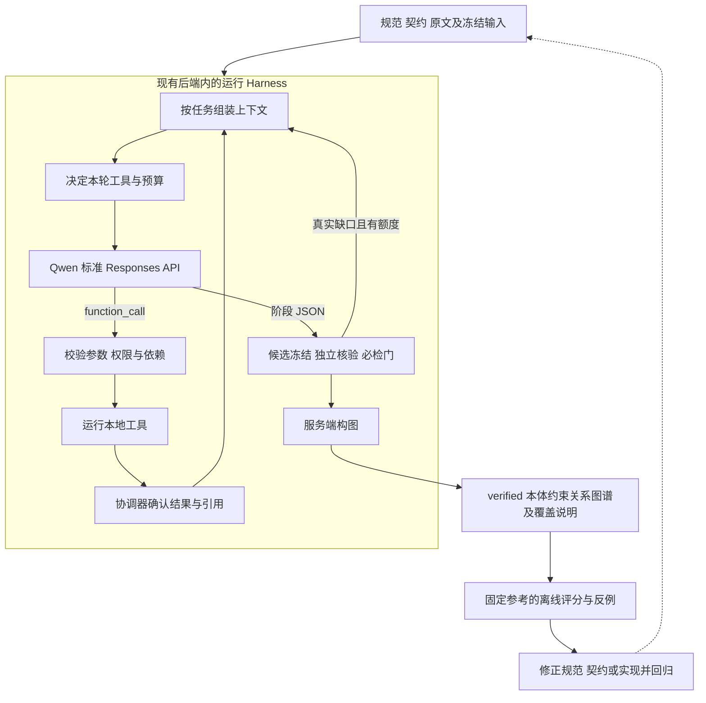

# 027 的 Harness Engineering 设计

状态：Harness 审查契约已修订，待编码。用户明确采用 OpenAI Harness Engineering 的实践。最终交付仍是本体约束关系图谱；模型仍使用项目 Qwen。本文件说明研发环境和产品运行环境如何共同支持该目标，模块文件与完整签名见 [plan.md](plan.md)，机器契约见 [contracts](contracts/tool-contracts.md)。

## 1. 采用方式与依据

Harness 在这里包含两层：**研发层让编码代理能找到规范、修改正确模块并得到可执行反馈；运行层为 Qwen 提供任务、上下文、工具和停止条件，由程序核验后构建图谱。** 两层的状态和证据各归其现有所有者。

2026-09-16 通过 Context7 检索并实际读取以下官方页面：

- [Iterating Development Workflows with Codex](https://developers.openai.com/cookbook/examples/codex/iterating-development-workflows-with-codex)：明确目标、阶段范围、验收与已观察证据的所有者；目录结构是可调整的约定，避免重复事实或把计划当完成证据。
- [Codex as a platform: build on the open agent harness](https://developers.openai.com/blog/codex-as-a-platform)：Harness 负责上下文、工具交互、执行边界及跨轮工作；应用保有业务规则、数据和用户体验。

用户所指 [Harness engineering 原文](https://openai.com/index/harness-engineering/) 本次直接访问返回 HTTP 403，Context7 未覆盖其全文；本文件不声称已逐条核对该文。以下是依据已读取官方资料、仓库约束和本特性需求作出的具体设计。官方示例中的目录、人工审批、Codex app-server 和日志安排不自动成为本项目要求。

本项目已有 Spec Kit、执行器、模型调度和当前状态；继续在这些位置实现。保留 13 个模块、4 个拟新增线上文件及 10 个标准工具，不增加通用 Agent 框架、第二个执行器或存储。

用户已确认项目 Qwen 支持 OpenAI Responses API，027 新运行据此固定 `api_protocol="responses"`，原生工具交互采用 Responses。旧 Chat 调用方仍按原契约运行；本期不增加双协议框架、不自动回退旧协议。这是明确的设计选择，不等同本轮已经运行 Responses 实测。

## 2. 目标、交付和完成判据

每个抽取任务以 `(subject_ref, predicate_iri, scope_id)` 定义目标。Harness 接收冻结本体、文档/IR、摘要、词表、可选实例源和预算，持续完成以下循环：

**组装上下文 → Qwen 选择工具或提交阶段回答 → 程序检查并执行 → 回传可定位反馈 → 下一轮或阶段门 → 构图。**

图谱包含节点、属性、单对象关系、关系组、模态、条件、继承范围和原文证据。`verified` 是新协议完整交付；`effective` 是子视图。模型说“完成”、调用成功或 JSON 合法均不是完成判据；程序根据声明证明、表示检查、任务覆盖和剩余未完成项判定。

离线评分只反馈下一次开发改动，不在线修改本体、提示、词表或阈值。金标始终与识别输入隔离。

## 3. 六项职责及现有模块归属

| Harness 职责 | 复用/扩展位置 | 本期具体交付 |
|---|---|---|
| 任务与约束 | M01/M02；ontology_plan、claim_protocol | 本体卡片、任务范围、阶段输出 Schema、必需核验维度 |
| 模型可理解的上下文 | M01/M07；context、retrieval_query | ModelContextView；原文、定位线索、实体假设和已核验状态分开 |
| 工具使用环境 | M03/M04/M08/M09 | 静态定义/分派；可解析引用、结构化结果和错误位置 |
| 有界模型循环 | M05/M06；tool_model_adapter、local_client | TurnPlan、Responses 项往返、预算预留、明确停止；不硬编码工具排列 |
| 核验与当前状态 | M02/M10/M11 | 冻结目标、确定性与语义门、唯一协调器写入、暂停继续 |
| 用户结果与反馈 | M12/M13、现有测试 | 保真图谱、证据点击、协议/质量分开评分、失败反例回归 |

### 3.1 决策权

| 决策 | 所有者 | 可执行限制 |
|---|---|---|
| 范围、来源权限、合法 IRI、预算、阶段门和接纳 | 服务端 | 由当前冻结上下文与程序规则计算，不接受模型自报状态 |
| 当前需要查看哪些授权原文、提及、实例候选 | Qwen | 在本轮工具集合内按需选择，参数仍须通过校验 |
| 类型、角色、关系、条件及反证的语义判断 | Qwen 的独立核验阶段 | 只回答冻结 target/hash/facet，不修改候选，不以自评分代替证据 |
| 数量解析、精确换算、SHACL、引用回放 | 本地确定性函数 | 输入由服务端绑定，适用检查必须执行；模型不能放宽 shape |
| 后续任务和最终图谱 | 现有执行器及协调器 | 带精确依赖和 scope 调度，输出由当前权威状态派生 |

通用模型能力不要求开放 shell、SQL、任意文件或网络工具。标准能力目录有 10 个函数，其中 validate_metric/validate_graph 本期仅供控制器调用；Qwen 的工具集合从其余 8 个函数按阶段、恢复模式和已授权引用裁选，再结合受控本体菜单和可定位原文完成语义工作。注册、模型可见与实际执行分别验收。

## 4. 上下文设计：先有地图，再按需读取

初始上下文提供当前任务的短说明、卡片、已选完整记录、原文引用目录、已知绑定和当前缺口；不把全文摘要、全部外部记录或历史聊天无差别灌入。具体内容分层：

| 内容 | 提供方式与事实权限 |
|---|---|
| 执行规则 | 每轮显式发送可信 instructions：输出目标、原文权限、阶段义务和工具约束；文档内容不能改变它 |
| 任务卡片 | subject/predicate/scope、合法 IRI、表示约束与阶段回答 Schema |
| 定位目录 | 可用记录 ID、结构/摘要线索及来源状态；帮助选择，不作为事实引用 |
| 原文 | 当前任务完整记录及其表头、单位、注释、竞争 owner 和已知反证；逐字可回放 |
| 冻结声明 | verification 专用 VerificationInput：实际端点/实体指称、原值、选择/限定/scope 及授权依赖；由 discovery_ref 派生并核对 hash |
| 工具结果 | 原始 ToolCall + 可空 parsed_arguments + 类型化 result；非法调用也能反馈和恢复，合法引用已经登记 |
| 校验反馈 | 失败 code、字段位置、目标/维度和可访问证据；解释缺口，不给出评测答案 |

`ModelContextView` 是现有 TaskContext、protocol、卡片和已确认工具结果的派生视图。只在构建请求时生成；当前 active_instructions、active_input_items 和引用映射继续承担暂停所需状态，不新增工作副本。它们保存协议内容，不承担证据授权来源职责。检索后的当前权限仅从 context_authorization_ref 指向的已确认 RetrievalData 内 ContextAuthorization 和冻结 IR/RecordIndex 重建；描述包含完整当前位置、角色、权限、绑定与 hash，不含全文，不沿历史增量链合成。引用为 null 时从冻结基础上下文构建。类型与签名见 plan M07。

输入项装配规则：

1. 摘要、NER 标签、外部元数据与原文分别标注角色；只有满足授权和回放的原文才能进入文档声明证明。
2. 所有工具均输出可解析 ID。未显示的记录须经 retrieve/inspect 的授权路径读取；摘要提到某记录不自动授予引用权限。检索结果及 context_authorization_ref 经协调器同一屏障确认后，以冻结 IR、context_policy_hash、任务/scope 和重算的 evidence_hash/context_hash 校验并重建 TaskContext；首次开放和暂停继续采用同一函数。worker 深拷贝内的修改、未确认检索、过期来源或模型输入中的 ID 都不能扩大权限。
3. 阶段内完整保留每次返回的有序 output items，再追加每个 function_call 对应的 function_call_output。配对键为 call_id，不是 output item.id；工具反馈 output 为结果 JSON 字符串。不删去半个调用批次或其他协议项省 token，重复静态说明在首次装配时消除。
4. 实际返回的 reasoning/encrypted 内容作为不透明协议项保存并在同阶段续传，不解释、不改写、不展示为证据；只在端点能力确认后发送对应 include。核验阶段按已确认 discovery_ref 构建 VerificationInput，包含完整声明 payload、目标/维度及所需实体、外部候选、桥接、scope 依赖，再结合授权原文重新建上下文；不继承生成阶段自评分和 reasoning。缺声明内容、hash 不匹配或未经授权的依赖必须阻止请求，不能只发送 opaque ID/hash 后让模型重新猜测候选。
5. 请求总量计入 instructions、完整当前阶段 input items、工具 Schema、text.format Schema 和预留输出。必需原文/反证无法保真容纳时返回 deferred/context_budget_exceeded，并保留覆盖缺口。
6. 本期不增加 LLM 摘要压缩轮次。阶段边界释放上一阶段活动 input，后续只引用已确认业务结果；禁止用压缩摘要替代原文证据。
7. 使用无服务端会话依赖的 `store=false`，每轮显式发送 instructions 与完整 active_input_items，不使用 previous_response_id/conversation。response_id 只记录响应身份；不会成为第二个恢复入口。

工具定义采用 Responses 的平铺 `{type:"function",name,description,parameters,strict}` 字段，基础配置明确 `strict=false`，经能力确认才使用 true；省略 strict 不作为关闭严格模式。最终阶段回答使用 text.format，不沿用 Chat 的 response_format。客户端只发送项目 Qwen 已确认支持的参数，不因为协议相同就携带任意 GPT reasoning/verbosity 配置。

## 5. 有界循环与停止

保留 discovery/verification/finalize 三个阶段。Harness 的灵活性体现在阶段内的工具选择和反馈，阶段门仍由程序执行。

### 5.1 本轮决策

`plan_model_turn()` 在每个模型请求前生成 TurnPlan：tools、answer 或 stop。它读取协调器已经预留的账本余量、当前阶段、可用工具和已确认结果；不反复读取 TaskContext 的初始额度快照，未知结局仍占额度。可用工具已经按模型调用者与阶段/recovery mode 筛选，不含 validate_metric/validate_graph；finalize 固定 stop。函数不发模型请求，也不持久化另一个计划。

| 当前情况 | 下一步 |
|---|---|
| 有尚未处理的已保存 function_call 项 | 先按原 call_id 完成/恢复该批次，不能提前发下一轮 |
| discovery 有可用工具，额度至少 3 | 可发工具轮；预留候选回答和独立核验各一次 |
| discovery 额度为 2 | 直接发候选回答轮，再独立核验 |
| verification 有可用工具，额度至少 2 | 可发工具轮；预留核验回答一次 |
| verification 只剩 1 次 | 直接发核验回答轮 |
| 同输入、同依赖重复请求已完成工具且没有新信息 | 当前阶段关闭可选工具，按剩余额度转 answer；缺证保持未决 |
| 无法保留必需回答/核验额度或原文上下文不完整 | stop，按已有 TaskOutcome/coverage 表达未完成 |
| 已保存阶段回答 | 不再请求同阶段生成，执行冻结/核验/最终门 |

相对原计划，取消“默认一轮工具后必须结束”的固定次数规则；Qwen 可在剩余预算内按工具结果继续选择。完整保存响应后，先检查 response_status、incomplete_details/error 和 refusal；只有可消费的 completed 才处理 function_call 或阶段回答。completed 只说明本次响应完成，不代表语义已成立。incomplete/failed/refusal 不执行其中的部分工具，也不把截断内容当阶段 JSON。

模型在工具轮返回 completed、无 function_call/拒绝且给出完全合法的阶段 JSON 时可校验后提交，否则只在额度内显式追加最终 answer 轮。answer 不提供 tools，使用 `text.format` 的阶段 json_schema。调用工具并不要求执行目录中的全部工具。

同一 lineage 仍至多 4 次模型请求，包括工具选择、错误纠正、候选、核验与恢复。第二个 discovery 工具轮只有在仍可保留两次底额时允许。依赖上一工具新 ID 的调用必须由后续模型轮生成，不能服务端改写参数拼接。参数错误等反馈可在剩余额度内处理，不能在客户端暗中重试。

“无进展”在整批合法调用都有结果后，按当前结果里的工具名、规范化参数、context/dependency 身份及是否产生新材料判定；第一次 no_match 不等于全文无事实，也不阻断其他有用工具。首个参数错误也保留预算内纠正机会。重复观察只影响可选工具继续策略；已有完整 response 和配对 function_call_output 结果、当前引用足够作判断，不增加长期循环日志或缓存平台。

### 5.2 必检和一次恢复

候选必须经过引用/菜单检查、冻结、独立核验、数量/单位/SHACL 的适用检查以及 proof/dependency 门，才能构图。validate_metric/validate_graph 本期是 controller-only，控制器在 finalize 必须运行适用检查；模型没有调用这两个函数的路径，也不能因可选工具额度耗尽而跳过它们。不满足可信前置条件时，返回真实缺口，不生成假定校准值。

evidence/reproposal 仍是共享一次恢复机会的模式：前者保留声明并补证，后者产生新候选代并重新核验。必检的真实缺口进入该既有恢复规划；若可恢复且预算足够，在原 discovery/verification 阶段提供对应反馈，不新增校准会话、阶段或免费 Qwen 轮次。计划修复不能保证补证有命中，预算不足不能降低核验要求。Qwen 不能修改 shape、可信前置条件或接纳门；声明否定、技术失败、未执行、缺证各自保留。

保存边界继续是：请求预留 → 完整 response 结果 → 每个工具结果/引用登记 → 下一轮。现有 protocol checkpoint 不能假定已检查软暂停；需由协调器在确认完整 output/每个工具结果后检查，再释放 worker 开始下一项。取消、失去执行权和持久化失败交还现有运行层处理，不包装成成功空结果。暂停继续只加载当前状态和精确结果；发最终回答前必须完成本批合法 call_id 的配对，额度不足或最终回答再次返回 function_call 不能借 finalize 免费重问。已收到 incomplete/failed 有精确响应收据，与请求结果未知分别记录；两者都不返还预留预算。

## 6. 反馈可操作，约束可执行

ToolIssue 增加必填但可空的 `field_path`，使用 JSON Pointer 定位参数字段；非字段错误为 null。`message` 描述被违反的约束和当前可行操作，例如“需先取得当前任务的 mention_ref”，不携带秘密或把正确答案灌入模型。阶段核验反馈复用 target_id、facet、reason_code 和证据引用。

ToolObservation 保留 `call:ToolCall` 的原始名称和 arguments_json，并将 parsed_arguments 设为可空；未知函数、坏 JSON 或参数失败使用 data=null 的 ToolErrorResult，不能为错误调用强造注册表项或 EvidenceModel。合法参数的执行失败仍保留 parsed_arguments。错误按原 call_id 保存/配对，暂停继续先复用已确认结果；本批全部调用 ID 配对后才可在剩余额度内纠正。非法 handler 不执行，已消耗额度不返还，注册成功调用的参数/结果契约保持严格。

例如，resolve_source_anchor 中 quote 不属于指定来源时，返回 citation_quote_not_in_source、`field_path="/quote"` 和已授权 evidence_id；模型可读取原文或提出恢复。程序不为“让测试通过”而改引用、扩大证据权限或接纳状态。

| 可执行约束 | 验证位置/失败应说明什么 |
|---|---|
| 共享核心不导入评测、持久化模型和业务提交；工具不依赖 SDK | 扩展既有 test_ontology_guided_boundaries；报告违规模块和导入路径 |
| 类型/注册表、标准函数 Schema 与实例同义 | T01/T06 的契约测试；报告工具名和字段 JSON Pointer，包含非法输入反例 |
| 本体语义不靠领域命名分支 | IRI 一致重命名、无编号/无外部源和新谓词组合的行为测试 |
| 权限、精确版本、预算和暂停边界 | 现有 coordinator/current_state/resume 测试；未预留不得发 HTTP |
| 冻结目标、范围及图输出保真 | 组、scope、投影和公开契约测试；错误事实与投影漏检分别记录 |
| 用户能看见并核对最终图 | 既有真实 API 浏览器测试扩展，检查组/限定/证据定位及 GET 不触发模型 |

本体词汇可作为声明式输入或测试数据；检查不能简单禁止所有领域词字符串。约束的是通用算法按其分支，以及事实缺证时硬编码补值。

## 7. 研发 Harness：仓库中的短入口与任务单

研发代理按 `AGENTS.md → spec.md → 本任务契约/模块 → 受影响源码和测试` 读取，全部以当前仓库证据为准。职责归属固定：

| 问题 | 唯一维护位置 |
|---|---|
| 做什么、哪些结果可验收 | spec.md |
| 采用什么 Harness 边界与工作方式 | 本文件；plan.md 链接并落实到函数和文件 |
| 字段、引用和模型可用协议 | data-model.md、contracts/，各自所有层次 |
| 哪一步改什么、依赖和未完成事项 | tasks.md，继续使用 T01—T26 |
| 怎样检查、环境条件和已实际运行结果 | quickstart.md、[check_design.py](check_design.py) 及独立评测制品 |

不复制一套 GOALS/PLANS/PROMPTS，也不在 AGENTS.md 追加整篇设计。进入具体 Txx 后，建立简短任务单：目标/相关 FR、允许修改的模块、先读契约、最小失败场景、实现后命令及通过条件。任务单写入该任务的现有说明或交付正文，不新建持续日志系统。

研发工作闭环为：**复现一个明确失败 → 判断缺口属于上下文/工具/控制/证明/展示哪一层 → 修改最小模块 → 相应反例与正例通过 → 检查实际结果 → 更新该任务完成情况。** 当前设计制品检查入口随仓库保存，不依赖临时目录或固定工作区绝对路径；按 quickstart 执行正例与变异检查。该检查不能替代未来实现类型/注册表的同义检查、工程行为或真实模型验证。局部检查通过后，仅有新改动、失败或未解决边界才扩大回归。文档中的未来文件和测试必须标明待建。

## 8. 评测反馈与实施顺序

沿用 M13 的 manifest/final-graph/coverage/calls/protocol-checks。失败记录只增加已有对象的定位字段：task/claim/target/facet、request attempt/call_id、reason_code、证据引用；缺少关联对象时为 null。它们是现有评测结果的内容，不是新的线上追踪服务。

失败转成两类输入：通用协议/算法反例进入合成工程 fixture；真实文档质量错误进入独立标注参考，评分时读取。不能把真实错误答案塞进提示或通用词表，不能在测试集上反复调参后仍称其为保留集。官方其他模型/Harness 的收益数值不代表项目 Qwen 的收益。

按现有任务顺序先做契约和单轮传输，再做上下文/工具/循环及图谱，最后完成真实 GLiNER/Qwen 和界面验收。工程通过、原生协议可用、图谱质量改善及部署分别记录。本次只交付设计和制品检查；运行代码、模型实测与环境切换均未实施。
