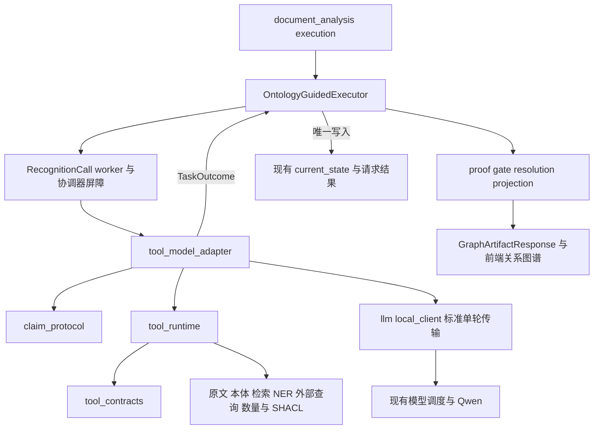

# 模块级实施计划

状态：Harness 审查契约已修订，待实现；修订依据与范围见 [Harness 相容性审查](harness-review.md)。需求见 [spec.md](spec.md)，字段见 [data-model.md](data-model.md)，依赖顺序见 [tasks.md](tasks.md)。按用户确认的 OpenAI Harness Engineering 实践，研发入口和运行边界见 [harness.md](harness.md)。以下拟新增函数签名是实施目标，不是现有接口声明。

## 1. 固定技术选择和依赖边界

- 后端 Python 3.11+，沿用 Pydantic/EvidenceModel、OpenAI 兼容客户端、rdflib、已有 pySHACL extra 和共享模型调度；不新增 Agent 框架。
- 用户已确认项目 Qwen 支持 OpenAI Responses API，027 新运行冻结 `api_protocol="responses"`，使用 `/responses`。既有 chat 调用方保留原契约；不建设双协议框架，不自动回退 Chat Completions。
- 同一 `OntologyGuidedExecutor`、`RecognitionCall` 和文档分析运行；新增适配器实现现有 RecognitionAdapter.inspect，不复制执行器。
- 仅新增四个线上源码文件：`ontology_guided/claim_protocol.py`、`tool_contracts.py`、`tool_runtime.py`、`tool_model_adapter.py`。其他变更扩展已有模块。
- 在线模块不得 import app.evaluation；共享 ontology_guided 不依赖数据库模型/Session。工具逻辑不依赖 OpenAI SDK 类型；SDK 转换限于 llm/local_client.py。
- 当前工作、模型调用结果和展示缓存复用现有存储，无新增表；模型协议与图谱内容版本进入 fingerprint，旧运行不原地升级。
- Harness 是这些已有模块的协作方式：上下文装配、模型决策、工具检查和反馈、必检接纳及当前状态。按剩余预算开放工具选择，不固定 NER/实例/检索的调用顺序；不新增 Harness 类或另一套总控。



## 2. 模块清单

路径前缀 `og` 表示 `backend/app/services/extraction/ontology_guided/`，`tv` 表示 `backend/app/services/extraction/tool_validation/`，`da` 表示 `backend/app/services/document_analysis/`。

| 模块 | 文件及变更方式 | 输入 → 输出 | 验收需求 |
|---|---|---|---|
| M01 本体卡片/词表 | 改 og/ontology_plan.py、contracts.py、ontology_lexical.py、tv/vocabulary.py | 冻结本体/主体/profile → SchemaCard、动态标签 | FR-01/02/09 |
| M02 候选/核验协议 | **新 og/claim_protocol.py**，改 mentions.py、verification.py | 模型 JSON+原文 → FrozenClaimSet、证明与 gate issues | FR-03/06/12 |
| M03 工具契约 | **新 og/tool_contracts.py** | 参数/结果类型 → 标准工具定义和本地校验、定位到字段的反馈 | FR-04/05/17/18 |
| M04 工具分派 | **新 og/tool_runtime.py** | ToolCall+ToolContext → ToolResult | FR-02/04/05/11 |
| M05 标准模型传输 | 改 services/llm/local_client.py | instructions/input/tools → 完整 output items、response status、usage | FR-04/08/14 |
| M06 阶段编排 | **新 og/tool_model_adapter.py**，改 da/execution.py | 当前协议/账本 → TurnPlan → 工具/回答反馈循环 → TaskOutcome | FR-06/07/08/17 |
| M07 上下文、检索和恢复 | 改 og/context.py、retrieval_query.py、evidence_work.py、repair_adapter.py | 主谓词/缺失维度 → ModelContextView、完整新证据/修复提案 | FR-02/07/17 |
| M08 值/单位/SHACL | 改 literal_normalizer.py、og/value_constraints.py、tv/metric.py、shacl.py | 完整原值/核验/policy → 数量表示/报告 | FR-09/10 |
| M09 外部实例 | 改 extraction/external_records.py、tv/mock_entities.py 的来源适配 | 提及+映射+冻结来源 → 候选/可核验 provenance | FR-11 |
| M10 图谱和范围 | 改 og/contracts.py、executor.py、scheduler.py、lazy_frontier.py、resolution.py、projection.py | accepted 声明+精确依赖 → 图谱与有范围任务 | FR-03/12/13/15 |
| M11 当前状态 | 改 og/current_work.py、executor.py，da/current_state.py、incremental_state.py、public_projection.py | 当前变更/精确轮次 → 可恢复当前状态和图谱 | FR-14/15 |
| M12 公开与前端 | 改 schemas/document_analysis.py、frontend api.ts 和既有图组件 | 图谱响应 → 组、限定、证据和覆盖展示 | FR-12/15 |
| M13 评测 | 新 evaluation/ontology_tool_engine.py 薄入口；复用 quality_guided_variant.py，扩展 ontology_guided_scorer.py 与 README | 固定输入/预算 → 协议、质量、成本及可定位失败 → 回归样例 | FR-16/18 |

## 3. M01：本体卡片与标签

继续调用 `compile_local_menu(snapshot,subject,...)`，不复制继承/约束合并。拟新增于 claim_protocol.py 的卡片编译接口：

```python
def compile_schema_card(
    menu: LocalMenu, *, predicate_iri: str | None,
    profile: ExtractionProfile, scope: TraversalScope,
) -> SchemaCard: ...

def compile_stage_schema(
    stage: Literal["discovery", "verification"], *, card: SchemaCard,
    evidence_ids: list[str], targets: list[VerificationTargetSpec],
) -> dict: ...
```

ExtractionProfile 仅含 data-model 的 quantity_policies/identity_keys，引用声明来源；传空 profile 可执行有明确类型和标量语义的抽取。`compile_stage_schema` 以契约模板为基础，收紧类、谓词、证据和核验 target ID，保留 additionalProperties=false；服务端仍检查成对绑定关系，不能认为多个独立 enum 自动保证 owner 正确。

**支持范围固定**：显式类/属性、已能解析的继承、明确 datatype、已声明的基数和受控数量表示。多 range 按现有本体语义处理；不支持的 union/restriction/key 组合不得一律当任选，返回 constraint_unresolved。基数下限缺项表示覆盖/证据缺口，不能补值；上限冲突不得只留下高分项。完整业务一致性不是本期 SHACL 表示验收。

词表调整为 `build_extraction_vocabulary(snapshot,class_iris,*,overlay:VocabularyOverlay|None)`：从冻结 SKOS/RDFS/定义取词；无 overlay 仍使用已有本体信息。移除 DEFAULT_OVERLAY 的领域默认和“没有人工条目就跳过概念”；overlay 缺少的语义不凭业务常识自动生成。分类标签不使用报告具体实例或外部记录名；新增 field_label 角色，与 field_value 区分。

在 tv/vocabulary.py 定义 `VocabularyOverlay={version:str,entries:list[VocabularyEntry]}`；`VocabularyEntry={iri:str,role,extraction_label:str|null,definition:str|null,labels:list[LexicalTerm],aliases:list[LexicalTerm],source_refs:list[str],canonical_unit:str|null,for_predicates:list[str],for_canonical_units:list[str]}`，`LexicalTerm={text:str,language:str|null}`。role 为 entity/record_anchor/field_label/field_value/unit；record_anchor 的 NER 输出角色映射为 entity，但描述保留记录指称要求。source_refs 标识运行输入声明的词表来源，不是可访问 URL 或文档事实证据；人工条目必须有来源。单位关联只由显式字段启用，不按原文出现单位反推。

编译输出沿用现有 entries/groups/missing/metadata 内容，entries 增加明确 role 和概念 IRI，groups 扩充为 entity/field_label/field_value/unit；无 overlay 时从合法类/属性种类生成角色候选并读取已有定义，缺少必要描述则列入 missing，不补造定义。显式 extraction_label 冲突继续报错，不合并不同 IRI；未显式提供时使用由 IRI 和角色生成的稳定内部标签，SKOS 名称/别名放入描述。同一字段允许标题和值两种角色，不以单一 IRI 字典项相互覆盖。词表类型不依赖 CMC 命名空间，历史实验自行显式提供原词表。

## 4. M02：冻结、核验和接纳

claim_protocol.py 定义 data-model 中的候选/核验类型及以下纯函数：

```python
def freeze_proposal(
    proposal: DiscoveryEnvelope, *, task: RecognitionTask, context: TaskContext,
    card: SchemaCard, index: RecordIndex, generation: int,
) -> FrozenClaimSet: ...

def build_verification_input(
    claims: FrozenClaimSet, *, discovery_ref: str,
    context: TaskContext,
    entity_dependencies: list[EntityDependencyView],
    external_candidates: list[ExternalCandidate],
    bridge_dependencies: list[BridgeDependencyView],
    scope_resolutions: list[VerificationScopeResolution],
) -> VerificationInput: ...

def validate_verification(
    response: VerificationEnvelope, *, targets: list[VerificationTargetSpec],
    context: TaskContext,
) -> VerifiedClaimSet: ...

def finalize_claims(
    claims: FrozenClaimSet, verified: VerifiedClaimSet, *,
    deterministic_results: dict[str, ClaimCheckResult], scope: TraversalScope,
) -> TaskOutcome: ...
```

冻结按三步：逐条引用回放→合法 IRI/实体指称/字段角色的机械检查→确定服务器 claim ID/hash/依赖。一个无效对象仅阻断依赖它的声明；禁止删除无效对象后把 one_of 组的另一对象当成确定单边。字段组主体经独立 referent/subject_role 核验后用 `mentions.create_record_referent()` 登记，不伪造物理 span。

独立核验输入使用 data-model §4/9 的 VerificationInput，不能只把 target ID/hash/facet 发给模型。协调器按已确认 discovery_ref 加载 FrozenClaimSet，核对声明内容和精确依赖，再由 build_verification_input 一次派生完整 targets 及所需上下文实体、外部候选、桥接和 scope 视图。每个 VerificationTargetSpec 保留实际端点/实体指称、原值和单位、selection、模态、条件及 scope；目标内容来自冻结 payload，不让模型从同一原文重新猜测正在检查哪条声明。材料缺失、hash 不符或依赖未经授权时阻止核验请求，不以摘要、历史 reasoning 或另一候选补齐。不再先建目标清单再与同义 claims 清单拼接，阶段 Schema 和响应校验直接读取 verification_input.targets；当前发现实体也不复制进 entity_dependencies。VerificationInput 不另存为权威声明，实际请求 hash 统一见 M11。

依赖视图由协调器从当前精确实体/证明及已确认工具结果加载，作为上述显式参数传入；不能假设 TaskContext 的引用列表已经携带这些对象内容。作用域视图使用 VerificationScopeResolution 的内部原文锚点，不依赖前端选区注册表。属性内容 hash 同时覆盖原值及分离表头中的单位文本，单位含义变化不能沿用旧核验。

VerifiedClaimSet 含逐目标内容 hash、facet 结论/引用和 missing_facets，不含改写后的候选。finalize_claims 复用 ProofGate，增加组和记录主体检查；受控 key/外链核验不使关系自动通过。接纳结果以 TaskOutcome 的实体/属性/边/组、证明和 decision payload 回到协调器。

`verification.py` 新增 `build_generic_proof_menu(card,context,required_facets)->dict` 和 `ProofGate.evaluate_frozen_claim(claim,decisions,*,entity_proofs,proof_menu,checks)->VerificationBundle`：复用原引用/依赖检查，但采用本协议 facet 和精确实体证明，不走旧按 describes/hasActiveIngredient 等 local name 区分的 PredicatePolicyRegistry。property/relationship 只按声明种类与实际结构决定必需角色，谓词含义交给本体定义和原文核验。保留旧 evaluate 供冻结旧协议读取/原调用方使用，不把其业务分支带入新路径。

属性和关系的桥接字段均按 data-model 的 bridge_kind/bridge_ref_ids 冻结，property 与 relation 的必需 facet 都包含 bridge；从已证明的引用链构造 BridgeStep。模型返回 supported 不能省略链的 predicate_assertion，未解析链保留未决。对象 type 与局部指称通过 node 的独立目标证明依赖检查，不能伪造同一个 target 下的 type SemanticDecision。

必须泛化 tv/evidence.py 的三处旧门：根角色不比较固定字符串；不统一禁止 self relation；条件正则只作线索而非证明。`_raw_span` 依据数量 policy 保留完整区间，不提前套 scalar 拒绝所有端点。

## 5. M03/M04：工具契约与执行

完整类型、10 个 handler 和错误表见 [工具契约](contracts/tool-contracts.md)。每个函数实现同形签名 `handler(args,ctx)->ToolResult[Data]`；静态注册表将参数类型、结果类型、model_callable/阶段白名单、处理函数连在一起，定义与执行不能各写一套。10 个函数是标准目录；`validate_metric`、`validate_graph` 的 model_callable=false，本期仅由控制器在 finalize 调用，不进入任何 Qwen 请求的 tools。该标记是本地注册元数据，不写入 OpenAI 工具定义。其余 8 个函数仍按 discovery/verification 和 recovery mode 裁选，不能把目录全集当模型可见集。调用者身份来自服务端分派入口，模型参数不能将自身改成控制器。

上下文来自当前任务的只读材料：IR、卡片、冻结声明、已有判定、来源版本、词表和额度；模型 client 仅由阶段编排器持有，工具不自行发起模型请求。工具不得捕获 owner Session、改当前图或提交业务数据。纯本地工具调用前后 `check_cancelled()`；需要新来源的 retrieve 先形成上下文增量提案，通过 `context.save_protocol()` 的协调器屏障验证/持久化后开放新引用。

模型可引用的新对象使用同一登记路径：handler 产生含确定 ID 的类型化结果，协调器核对来源/当前依赖，确认工具结果并更新当前协议 materialized_refs，然后才回传模型或给下一工具读取。登记结构与字段见工具契约第 1 节；cards/mention_index/external_candidates 都是该映射与已确认结果的只读视图。resolve_source_anchor 的 AnchorData 增加 mention_ref，NER 和手工定位采用同一物理跨度身份，查询不以 NER 命中为前置条件。SHACL 表示图仅为 finalize 内部临时计算值，不登记引用或持久化。

inspect_evidence 的类型化结果须保留逻辑行列、单元格和授权表头引用，不能从现有 sources dict 转换时只留下文本。NER 限额分别记录字符窗、字符重叠、word limit、encoder token limit、单窗口共享候选池及结果裁选上限；现有 160 字符/24 字符重叠不是 token 预算。输出具体字段及未完成/省略口径见工具契约。

tool_calls_used 仅累计模型请求且已获准分派的工具尝试，校验失败/执行失败也不退还；控制器必检独立记录本地工作量，不能因模型工具额度用尽而跳过。协调器在执行前保存计数，执行后确认结果及 materialized_refs；暂停继续直接复用已确认的 `(request_attempt,call_id)` 结果，未完成尝试若重做须再次消耗额度。定义、参数、输出及恢复测试同时覆盖这些规则。

保留原始 ToolCall 的 call_id/name/arguments_json，不先强制转换为已注册名称或参数模型。ToolObservation 同时保存该原始调用和可空 parsed_arguments：未知函数、坏 JSON 或参数校验失败使用 data=null 的 ToolErrorResult；合法参数但执行失败保留已解析参数。统一错误反馈先与原 call_id 配对并经协调器确认，再进入下一轮及恢复视图；未知名称无需注册表项也能还原。只有完成注册、权限和参数检查后才执行 handler，合法调用继续使用注册表的具体参数/结果类型，不因容纳错误而放松这些类型。

GLiNER2.5 显式注入 `Gliner2Extractor(model_path,descriptions=...,device=...,word_splitter="char",max_len=...)`，由已有 prepare_strict 与严格 span 方法执行。工具层不得回到 mentions.propose_mentions 的旧 GLiNER 默认工厂。当前 2.5 权重对应 Python 包 gliner2==2.0.0，并非 gliner2==2.5；历史固定依赖与模型清单见 [2.5 实测](../../docs/调研/cmc-gliner2-skos-validation-20260916/results-2.5/README.md)。

正式接入增加最小 `gliner2` extra，依照已有 `backend/app/evaluation/fixtures/gliner2_runtime_requirements.txt` 中 gliner2[local]==2.0.0、Transformers 4.57.6、HF Hub 0.36.2、tokenizers 0.22.2、protobuf 6.33.5 兼容组。当前 CPU/CUDA 应用锁为 Transformers 5.6.2，必须共同求解并对受影响语义模型回归，不能仅添加 extra 就宣称兼容，也不能 sys.path 混入实验 venv。锁变化限于本能力必要依赖，沿用 CPU/CUDA 环境分离。

先在已有隔离环境验收，再验证应用环境。将 evaluation 中的 `verify_model_files` 校验逻辑下沉到已有 gliner2_extractor.py 的 `verify_local_checkpoint(model_path,manifest)`，runner 反向复用；线上不导入 evaluation。权重/tokenizer 仅从本地路径加载并校验，不入 Git、不在运行时下载。准备应用启动前的两个 OFFLINE 环境项及库缓存状态；当前 CPU Dockerfile 未设置、CUDA 已设置，按受影响运行环境补齐。缺依赖不能声称 NER 完成，本轮不安装/改容器。

## 6. M05：一次原生模型请求

在 local_client.py 增加以下 Responses 单轮接口，保留 chat_with_schema 的现有调用方：

```python
@dataclass(frozen=True)
class ResponseTurn:
    response_id: str
    output_items: list[dict]       # 完整有序 output，含 message/function_call/reasoning
    response_status: str          # 预期 completed/incomplete/failed，其他值显式拒绝
    incomplete_details: dict | None
    error: dict | None
    usage: dict | None            # 保留 Responses 嵌套用量；缺报为未知

def responses_create(
    client, *, input_items: list[dict], instructions: str,
    model: str | None = None,
    tools: list[dict] | None = None,
    tool_choice: str | dict | None = None,
    text_format: dict | None = None,
    max_output_tokens: int | None = None,
    include: list[str] | None = None,
    timeout_s: float | None = None,
    total_timeout_s: float | None = None,
) -> ResponseTurn: ...

async def _send_response(client, kwargs): ...

# 仅内部受控派发点；既有 chat_with_schema 不传 send，继续走 _send。
async def _http_attempt(
    client, kwargs, ticket, deadline, request_timeout, *, send=_send,
): ...
```

当前 `_send()` 硬编码 `connection.chat.completions.create()`，不能直接发送 Responses。上述改动仅给 `_http_attempt` 增加内部 send callable：Responses 入口传 `_send_response`，后者在同一 LocalModelClient 工厂/连接生命周期内调用 `connection.responses.create()`；测试注入客户端同样调用其 responses.create。复用 RequestTicket、排队、硬总时限、取消及关闭连接，不增加客户端、调度器或公开协议选择器。一次调用最多一个 HTTP attempt，SDK retries=0，无 Schema 回退或截断补发。

已核对 CPU uv.lock、CUDA lock 和 backend/.venv 均使用 openai 2.44.0，已提供 AsyncResponses.create；此次协议接入无需升级 SDK。当前 `_usage()` 只读 Chat 的 prompt_tokens/completion_tokens/prompt_tokens_details，新 Responses 用量转换读取 input_tokens、output_tokens、total_tokens、input_tokens_details.cached_tokens、output_tokens_details.reasoning_tokens，完整嵌套结构保留在 ResponseTurn/ModelTurnResult。缓存与 reasoning 是各自总量的分项，不重复相加；缺报为 null/未知，不补 0。RequestTicket 可映射既有平面 metrics 名称，metrics JSON 无需迁表。

请求固定 `store=false`，将 input_items 映射为 `input`，instructions 每轮显式发送，text_format 映射为 `text={"format":text_format}`。不用 previous_response_id 或 conversation；response_id 仅记录这次返回身份。不沿用 Chat 的 response_format/max_tokens/enable_thinking 等参数，也不因使用 OpenAI 协议自动发送 GPT 专属 reasoning/verbosity 等选项。include 只允许冻结能力已确认的项，未确认时省略。

工具定义为平铺 `{type:"function",name,description,parameters,strict}`，基础工具明确 `strict=false`，确认 Qwen 端点相应能力才设 true；Responses 中省略 strict 不能作为“关闭严格模式”的实现。工具轮不设置阶段 text.format；answer 轮不提供 tools，使用 `text.format={type:"json_schema",name,schema,strict:已冻结能力值}`。text.format/json_schema 支持与 strict 生成约束分别验收，阶段 strict 的基线为 false，确认端点支持后才在新运行冻结为 true；始终本地完整校验，不能在运行失败后静默更改约束或退回普通文本协议。

返回的完整 output 按原序保存，不能只读 output_text 或只提取 function_call。工具项使用顶层 name、arguments、call_id，item.id 不是调用配对键；反馈为 `{type:"function_call_output",call_id,output:工具结果JSON字符串}`。实际返回的 reasoning/encrypted 内容按不透明协议项保留/续传，不展示为证据、不解释或改写。用量按上述 Responses 结构读取，既有 chat 用量转换不受影响。

传输返回后先提交完整 ResponseTurn，再按 response_status、incomplete_details/error 和 message 中 refusal 判断可消费性。completed 不等于已生成最终答案，仍可能包含 function_call；incomplete/failed、refusal、缺失/重复 call_id 或协议残缺均停止本轮消费，不执行其中部分工具。不能用 finish_reason/choices 解释 Responses。`ModelCancelled/ExecutionLost/ModelWaitFailure` 原样传播；稳定失败包括 model_response_incomplete/model_response_failed/model_refusal/model_tool_protocol_invalid，部署实际不支持为 model_tools_unsupported，不回退旧协议。

## 7. M06：有界阶段编排与预算

新增 `ToolModelRecognitionAdapter`，实现现有 `inspect(task,context,predicate,menu)->TaskOutcome`。`da/execution._configured_recognition_adapter()` 按运行冻结协议构造它；不继承整个 EvidenceRepairAdapter，否则会带入领域提示和 whole_method_fields 等逻辑。

```python
class ToolModelRecognitionAdapter:
    def inspect(self, task, context, predicate, menu) -> TaskOutcome: ...
    def _run_stage(
        self, *, stage: Literal["discovery", "verification"],
        task: RecognitionTask, context: TaskContext,
        tool_context: ToolContext, response_type: type[EvidenceModel],
        initial_input_items: list[dict], instructions: str,
    ) -> EvidenceModel: ...

def plan_model_turn(
    protocol: ToolProtocolState, *, remaining_model_calls: int,
    available_tools: list[ToolName], batch_progress: bool | None,
) -> TurnPlan: ...
```

`plan_model_turn` 是本模块纯函数，TurnPlan 字段见 data-model；remaining_model_calls 来自协调器已经预留的账本及当前 attempt，不能反复读 TaskContext 初始额度。available_tools 先从注册表按模型调用者、阶段、recovery mode 和前置引用裁选，永远不含 controller-only 的 validate_metric/validate_graph；finalize 不调用 plan_model_turn，直接由控制器执行必检；TurnPlan 仅描述 discovery/verification 的模型决策。只有待处理工具批次已经完成时才调用；batch_progress 在整批结果合并后按参数和精确依赖判定，合法调用采用规范化参数，未解析调用采用原始 name/arguments_json 与错误 code，不伪造 parsed_arguments。第一次 no_match 不直接判无进展，首个参数错误保留预算内修正机会。

精确流程：

1. 从当前 protocol 恢复 api_protocol、阶段/精确结果；已有冻结发现则不再次生成。独立 verifier 先加载并校验 discovery_ref，构建每个 target 均含完整声明及核验维度的 VerificationInput，再从授权原文和该视图生成 active_instructions/stage_input_items，不沿用发现理由、自评分或上一阶段的 reasoning 项。
2. 用 plan_model_turn 决定 tools/answer/stop；发现工具请求前至少剩 3 次，核验工具请求前至少剩 2 次。预留候选/核验底额，不足时直接进入无工具回答或保留未完成。
3. 按 M07 构建 ModelContextView，初次进入阶段时保存 stage_input_items；每轮从该初始输入、当前有序 turn_refs 和 completed_tool_results 按响应及调用顺序派生完整 input，再装配 instructions、tools 与 text.format Schema。连同预留输出计数，无法保真容纳则 deferred，不静默裁切。request_hash 覆盖这些字段及 api_protocol/store/include 等实际发送参数；不为临时核验视图再保存整包 hash。
4. 保存 pending request，经 `context.before_model_call(stage,ordinal)` 预扣并持久化后调用 responses_create；完整返回立即保存为精确 ModelTurnResult 并登记 turn_refs。先判断状态/拒绝/完整性，只有可消费的 completed 才继续；完整 output_items 只保存在该轮结果，不复制到累积会话状态。
5. 对本轮所有 function_call 逐个校验/执行/提交结果，每个合法 call_id 配对一个 function_call_output 项，output 为 JSON 字符串；未知名称、坏 JSON 和非法参数也保存原始 ToolCall 并配对 ToolErrorResult，不执行 handler。在整批结果合并前不判无进展。依赖新结果的下一调用须另一个模型轮；重复 call_id/不完整响应直接失败。关闭后续工具前仍须为本批合法调用 ID 补齐结果或 blocked 项。暂停继续时，从当前响应与 completed_tool_results 求出待处理调用，先处理它们，再装配包含全部配对项的完整 input；不单独持久化 pending_call_ids，不扫描历史或重放已确认工具。
6. 结果有新材料且仍保有底额时，按可用工具继续开放选择；不固定一轮工具后结束。同参同依赖的重复已完成请求整批无新信息时关闭可选工具，按剩余额度发 answer；未命中仍不是否定。completed 且无 function_call、无 refusal 的 message/output_text 若已通过阶段 Schema 可直接作为阶段回答；否则只在已有额度内显式追加无工具的阶段回答轮。answer 若又返回 function_call 或无法容纳上下文，记协议失败/未完成，不执行调用、不借 finalize 免费续问。
7. 保存阶段回答、冻结候选，独立核验；最后由程序运行 binding/metric/SHACL 和 proof gate，返回 TaskOutcome。validate_metric/validate_graph 的执行不取决于模型工具选择或剩余工具额度；不满足可信前置条件时返回阻断及真实缺口，不能强行规范化。规范化结果在同次 finalize 内直接交 SHACL，表示图为局部变量，不保存图或登记引用；中途暂停后可重做纯本地计算。适用必检的未决结果可交既有 recovery 规划，在共享一次恢复机会与剩余 HTTP 预算内回到 discovery/verification；finalize 自身不发 Qwen 请求，也不新增阶段或免费轮次。Qwen 不能修改 shape、可信前置条件或接纳门。

**预算**：每 lineage 初始上限 4；所有前置规划、续轮、纠错、候选、核验共用。典型工具→候选→核验=3；只剩一次时不能做需要两次的重提/核验。恢复只选 evidence 或 reproposal 一种，不分别给额度。RequestTicket 区分实际开始与排队取消，预扣预算与实测费用分口径；未知结局不返还预算。

stage 只取 discovery/verification/finalize；recovery 是由 recovery_kind/recovery_used 控制的模式。evidence 在 verification 补证重验，reproposal 回 discovery 后重新 verification；两者都不重置 request_attempt、tool_calls_used 或当前 lineage 上限。恢复模式下的工具可见集按工具契约收紧，不新增 recovery stage 或自治循环。

暂停检查需补齐真实接入点：现有 protocol checkpoint 主要确认保存，不能假定它已执行软暂停检查。协调器提交完整 response output 或每个工具结果后检查暂停/执行权，再允许 worker 开始下一项；当前协议保存精确结果引用，未处理 call_id 从这些结果派生。只停止后续工作，不撤销已经确认的工具结果。

## 8. M07：检索、补证和修复

现有 context.py 新增 ModelContextView 及派生函数：

```python
def build_model_context(
    task: RecognitionTask, context: TaskContext, card: SchemaCard,
    protocol: ToolProtocolState, *, verification_input: VerificationInput | None,
    confirmed_results: list[ToolObservation], turn: TurnPlan,
) -> ModelContextView: ...

def restore_authorized_context(
    task: RecognitionTask, base: TaskContext, *,
    authorization: ContextAuthorization, index: RecordIndex,
    expected_evidence_revision: int, expected_evidence_hash: str,
    expected_context_hash: str,
    target_seed: VerificationTarget, run_fingerprint: str,
    card: SchemaCard, profile: ExtractionProfile,
    entity_dependencies: list[EntityDependencyView], scope: TraversalScope,
) -> TaskContext: ...
```

字段见 data-model 第 9 节。固定规则进入每轮 instructions；任务卡片、定位目录、原文、完整 VerificationInput、工具结果和核验反馈分别渲染为 input 项，原文/元数据不拼成指令。verification_input 在 discovery 为 null，在 verification 必须为按 M02 构建且 hash/依赖匹配的完整视图；缺失不得发送。只包含当前 subject/predicate/scope 所需材料，保留已知反证、竞争归属和完整记录。阶段内完整续传标准 output 与 function_call_output 项，包括实际返回的不透明 reasoning；核验阶段重新组装。省略非必需目录/重复说明时可追溯到原引用，不能删必需声明内容/证据、reasoning 协议项或半个工具批次。该视图不持久化为第二份当前状态；不增加 LLM 压缩请求。

复用 RecordIndex、SubjectSlotQuery、现有摘要/精排和 EvidenceWorkQueue。`retrieve_evidence` 仍保存并返回 ToolResult[RetrievalData]；完整当前 ContextAuthorization 仅保存在 protocol.context_authorization，包含冻结 IR 身份、context_policy_hash、记录和片段位置/角色/fact_eligible、owner/必需上下文/反证绑定。evidence_revision/evidence_hash/context_hash 只使用外层 protocol 已有字段，不重复放进授权对象。每次检索只更新当前授权，不给工具结果附加累积权限快照；无额外结果包装、原文副本或增量历史链。初始授权为 null 时从冻结基础上下文构建。

协调器以当前任务/来源/策略身份校验授权描述，在同一提交屏障确认工具结果、当前授权及外层证据版本/hash 后，调用 restore_authorized_context 从 index.ir 所绑定的冻结 DocumentIR/RecordIndex 还原文本、跨度、角色、绑定与读取权限。expected_evidence_revision/expected_evidence_hash/expected_context_hash 显式取自已确认 protocol；card/profile、scope、精确实体依赖和 run_fingerprint 均由服务端冻结输入加载。target_seed 由协调器复用初次上下文组装前的目标工厂和同一冻结输入派生，尚未绑定 context_hash，不新增存储。RecognitionTask 本身没有 base_target 或 run_fingerprint 字段，不能以 task 或已返回的 base.target 隐式替代这些输入；后者已绑定 context_hash，用它计算会改变 target_id 或形成循环。按已冻结并匹配的 context/field-binding 组装版本与配置重算 context_policy_hash，不能让模型传入策略或该 hash 来决定权限。field_bindings 从索引和同一组装规则派生，subject_label 从精确 subject 依赖派生；context 哈希 payload 使用未绑定的 target_seed、record_id、context_records_version 和上述字段，不遗漏影响行为的字段。重新计算并比对预期 evidence_hash/context_hash 后再按既有流程绑定 target 并开放新增 evidence_id。RecognitionCall 的 worker 持有深拷贝，不能依赖 worker 修改 TaskContext 传播到协调器；初次提交和冷恢复均走相同重建函数。未确认结果、来源过期、scope/任务/策略不符或 hash 失配不能授予读取权，协议 input 和模型提出的 ID 也不授予权限。原文及角色保留 target/binding/counterevidence，补证范围不能转成另开事实发现任务。请求词来自主体合格指称、谓词定义、词表及真实 missing_facets，不追加领域章节/字段优先词。

拟将 EvidenceWorkQueue 的缺口选择拆成纯函数：

```python
def plan_evidence_recovery(
    task: RecognitionTask, frozen: FrozenClaimSet,
    missing_facets: list[str], *, index: RecordIndex,
    already_seen: set[str], remaining_calls: int, recovery_used: bool,
) -> EvidenceRecoveryPlan: ...
```

EvidenceRecoveryPlan 固定字段 action=none/supplement/reproposal、record_ids、reason_code、required_model_calls。quote 错指只在授权 owner/字段唯一匹配时提出新引用；语义内容变化增加 generation 并重新核验；补证增加 evidence_revision 并失效受影响验证。相同内容重排不算新证据。当前 evidence_work.py 中专属 cleaning 等 issue 和目的词不进入新协议分支；旧特性记录不清理。

## 9. M08/M09：数量校准与可选外部来源

数量最小接口置于已有 tv/metric.py。validate_metric/validate_graph 是标准函数目录中的确定性能力，本期由控制器通过相同类型化 handler 调用，Qwen 没有这两个工具的调用权限：

```python
def normalize_metric(
    raw: str, slot: SlotSpec, *, quantity_policy: QuantityPolicy,
    source_unit: str | None, target_unit: str | None, binding: BindingData,
    verified: VerifiedClaim, candidate_ref: VersionedRef,
) -> MetricData: ...
```

复用 literal_normalizer 的 number/range/comparison、Fraction/Decimal 和已支持偏移；补齐区间端点开闭表示。value_constraints 和 evidence._raw_span 同步读取 quantity policy；不再以 scalar 门拦截合法 interval/endpoint，也不能放宽普通 scalar。近似比较 approx 保留原观察，直到有明确表示契约，不假装精确值。

纯规范化函数与工具适配器复用 MetricData，包含 claim_ref、validation_status、quantity、normalized_literal、issues；handler 只包 ToolResult，不再定义同形的内部返回类型。target_unit 由 handler 校验卡片允许值后传入；null 请求优先读取 slot.canonical_unit，没有声明目标时保留源单位，不擅自选取 allowed_target_units 中某项。数值 normalized_literal 使用精确字符串，布尔使用 bool；完整区间/上下界由 quantity 表示，不挤入一个标量。

只有可信前置条件和规范化通过时，控制器才调用 validate_graph(claim_id,shape_profile_id)，以本次 MetricData 和冻结声明/slot/profile 构建临时表示图并检查。MetricData 通过只读 ToolContext.metric_result 传入该次 handler；引用及前置条件须与 claim_id 匹配，不能由工具参数提供规范化值。它是 finalize 调用内的临时变量，不增加结果注册或存储。纯计算函数不捕获 ToolContext、不持有 RDF 图注册表或隐式写状态。MetricData 的 passed 尚不包含 SHACL 通过；最终门汇总现有 ClaimCheckResult 后随 TaskOutcome 确认。中途暂停且尚未确认 outcome 时，可以重做这些纯本地计算，不重复模型、NER 或外部查询，不新增中间恢复点。

tv/shacl.py 增加 `build_quantity_graph(...)` 与固定 `quantity-representation-v2` profile；原 literal profile 保留。validate_graph 按单声明选择 profile，focus 由程序确定。规范化和 SHACL 拆分的 legacy wrapper 保留原调用语义。返回规范化值之前不执行业务阈值判定；真实超限仍是原文值。

external_records.py 增加最小读取协议，不建设连接器：

```python
class ExternalInstanceReader(Protocol):
    def search(self, query: InstanceQuery) -> InstanceSearchResult: ...
    def resolve(self, provenance: ExternalRecordProvenance) -> ResolvedRecord: ...
```

InstanceQuery 由服务端从 mention+identity_keys 生成 `{source_ids:list[str],class_iri:str,name_quotes:list[Quote],key_components:list[IdentityKeyComponent],limit:int}`，`IdentityKeyComponent={predicate_iri:str,quote:Quote,value:str}`；value 必须来自相应 quote，复合键分量还须有同一 owner/适用域依据。不接自由 SQL/URL。InstanceSearchResult 固定为 `{candidates:list[ExternalCandidate],searched_sources:list[str],incomplete_sources:list[str],excluded_count:int|null}`，来源实现必须提供完整度，不能从返回数组长度猜测；不能确定排除数的来源标记未完成，excluded_count 为 null，不能以 0 表示未知。

search 的结果由 handler 添加 identity_status=not_checked，并经协调器登记候选 ID；全部请求源完成、无排除且确无命中才为 no_match，部分失败保留候选与缺测但不称查询完整。resolve 复用现有 Registry 的来源/键/版本/字段检查，使用现有 ExternalRecordProvenance 类型；search 绑定当前来源已提供的读取函数或冻结记录列表。业务字段映射留在来源数据中。当前 configured_external_records 只注册设备 Mock，不能作为通用默认；旧 FrozenEquipmentCatalog 保留实验用途，新路径不导入其编号正则、三个字段包或编号优先规则。

## 10. M10：图谱组、局部身份和后续任务

具体新增字段及 scope 不变量见 data-model 第 6—7 节。

```python
def frontier_eligibility(
    relation: GraphEdge | GraphRelationshipGroup,
    *, member: VersionedRef, inherited_scope: TraversalScope,
    dependencies: DependencyIndex,
) -> FrontierEligibility: ...

def project_graph(
    *, nodes, edges, properties, relationship_groups=None,
    # 保留原有 recognition_run_id/root_ref/coverage/progress 等参数
    projection: str = "effective", **existing_identity,
) -> GraphSnapshot: ...
```

上方 project_graph 是变更摘要；编码时保留现有显式关键字参数，**不**用自由 `**existing_identity` 替换真实接口。新增 FrontierEligibility 返回 `{eligible,scope,reason_code}`。默认内部函数参数保持 effective 避免误改其他调用方，新协议最终交付调用明确指定 verified。

必须联动：OntologyGuidedExecutor.run 内的 `apply_outcome`、`add_subject`、子任务登记和 `advance_layer`，以及节点/组登记和依赖失效；scheduler/lazy_frontier 的作用域键；resolution 的 merge/split 精确引用。不能把旧属性复制给拆分后的所有节点，也不能把旧组证明自动提升到新成员版本。

current_work 的主体、slot、plan、coverage 键按 data-model 改为含 scope 的规范 tuple；序列化时使用规范 JSON key 编码，禁止字符串简单拼接造成碰撞。同一类型多实例不按类槽位合并，局部 ID 不自动成为全局 ID。

## 11. M11：当前状态与请求结果

复用 RecognitionCall 的输入深拷贝、模型请求/协议 checkpoint 两种队列屏障；协调器是唯一 writer。ToolProtocolState 只是一条当前 lineage 的阶段内容，模型调用账本独立保存。

关键改动是 `da/current_state.persist_calls()`：当前按 stage 找 discovery_ref/verification_ref，无法记录多个工具续轮。改为每个已收到 response 的 attempt 的 DocumentRunRequest.result_ref 指向对应 ModelTurnResult，incomplete/failed 同样保留精确结果，不能混为未知是否收到；阶段结果仍独立引用。`hydrate_protocol/restore_calls` 只加载当前 active_instructions/stage_input_items、turn_refs 和 completed_tool_results；按响应与调用顺序派生完整 input 和未处理调用，不持久化累积会话正文或遍历全部历史请求。

同时扩展 `da/execution._validate_model_call_state()` 接受新协议并校验 attempt 单调、request_hash、assertion_generation 和 evidence_revision；内部字段沿用 data-model 所列既有名称。executor 当前多个 checkpoint/reservation 路径受 self.evidence_repair 门控，改为显式识别是否有冻结阶段协议；新工具协议启用同一屏障，但不能因此进入旧领域 repair 逻辑。持久化屏障失败不得继续发 HTTP。每次工具结果提交需要复核 call ID、上下文和来源版本；未知异常不会变成成功空结果。

恢复先读取 protocol.context_authorization；为 null 时使用冻结基础上下文。按 M07 从冻结 IR/RecordIndex、同一组装策略和精确 subject 依赖重建 TaskContext，以外层 protocol 的 evidence_revision/evidence_hash/context_hash 为唯一预期值，校验任务/scope/来源/context_policy_hash 及重算结果；不能从 input 项或 worker 深拷贝反推授权，也不重新检索或遍历历史增量。随后加载 tool_calls_used 和 materialized_refs，按 result_ref 恢复当前所需卡片、物理提及和外部候选，校验 id/content_hash/context_hash 与精确依赖，不重新执行已确认工具。数量表示图仅在 finalize 的本地计算中临时构建，暂停后可重做纯本地规范化/SHACL，不登记图引用。未知名称/坏参数结果按 ToolObservation 的原始 ToolCall 与 ToolErrorResult 恢复，不要求错误调用匹配注册表。新的上下文只保留仍适用的引用。登记、当前授权和完成结果由同一协调器屏障确认，不出现已发送 ID 却未登记的状态。

组存储复用现有 JSON 域：`kind=relationship_group`、`work:relationship_groups`、`display:relationship_groups`。修改 write_work、restore_work、write_proofs、display_payload、rebuild_display、executor.current_work_changes 与恢复白名单；加 proof/selection/scope 的选区。只维护一份当前工作和最新展示缓存，按变更更新。

## 12. M12：公开契约与前端

实际文件：

- `backend/app/schemas/document_analysis.py`：GraphRelationshipGroup、verified projection、scope、modality、节点 type/referent 证明状态；grounding_kind 固定为 document_root/mention/record；RunResponse/GraphArtifactResponse 公开冻结 extraction_protocol 供客户端选择投影，旧值缺省 null。
- `backend/app/services/document_analysis/public_projection.py`：组与精确端点映射、证据 selection registry；按精确关系引用派生公开 scope_resolutions，包含限定摘要及证据 selection，使 conditional 等过滤视图即使未显示父关系也能解释当前 scope。该说明从同一权威状态计算，不另存；不把组成员画线算成事实数。
- `frontend/src/lib/api.ts`：DocumentGraphRelationshipGroup、relationship_groups、scope、modality、verified；接口仍经现有同源 API。
- `frontend/src/components/analysis/document-relationship-graph.tsx`、`template-document-graph-panel.tsx`：组卡片/成员、selection 标签、范围及原文点击；虚拟组节点仅为布局。
- `document-analysis-panel.tsx`、`use-template-document-run.ts`：仅新协议运行选择 verified 为完整结果视图，保留 effective 子视图；不得修改读取旧运行的冻结语义。GET/切换不启动模型。

图数量按实体/属性/单边/关系组分别计算。supported 的否定/条件/要求关系显示真实限定，不能标为实际无条件成立。不存在新旧两份图谱真理来源；视图是同一当前图的投影。

## 13. M13、验证与规范检查

新增离线 `app.evaluation.ontology_tool_engine` 仅负责 CLI 装配和 Responses probe；run 复用并按新协议必要扩展已有 quality_guided_variant.py 的离线评测器与 OntologyGuidedEvaluationResult，score 扩展 ontology_guided_scorer.score_evaluation 支持组、scope 和模态，不另建执行器、预测模型或评分实现。输入 manifest 与 gold 分开，识别路径不接 gold 参数。baseline/new 分别冻结协议、文档、本体、词表、外部源及预算，原生协议成功与质量改善分开报告。具体 CLI 目标契约见 quickstart，当前不存在，不可冒称已可运行。

研发 Harness 复用既有规范导航与测试。当前设计制品使用仓库内 [check_design.py](check_design.py) 检查，命令与环境见 quickstart；它只验证设计资产。实现后再扩展 AST 导入边界、类型/工具注册表与设计 Schema 同义检查；失败定位到工具/参数路径、task/claim/target/facet 及已有 request/result，不新增跟踪存储。发现的问题先归因至上下文、工具、循环、证明或展示，再进入最小通用反例；真实参考答案仅评分读取。短任务单和分层验证见 harness 与 quickstart，官方示例目录不强制复制。

宪章核对：规范→澄清→本计划→任务已形成设计链；T-Box 无修改；用原文证据和现有请求账本，不新增审计平台；契约先于代码；复用现有执行器/状态/模型调度；运行期离线。最小新依赖仅为已授权 GLiNER2.5 应用环境打包，优先复用固定版本，新增范围限于相应 extra。工程测试、真实模型与发布是不同完成条件；本计划不自动授权部署或清理。
