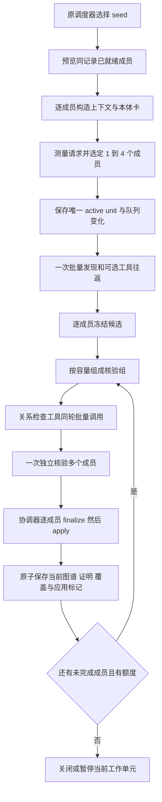

# 同主体多谓词批量识别：编码级重构方案

日期：2026-09-18。状态：**设计，未实施**。对应 [需求](spec.md)、[内部契约](data-model.md)、[实施任务](tasks.md)、[验收](quickstart.md)。下文明确区分已核实入口与拟新增接口，不把示例签名当作当前代码。

## 1. 核心方案

保留 RecognitionTask 作为一个谓词的识别、覆盖和额度单位，增加 RecognitionWorkUnit 作为模型请求单位。一个工作单元包含 1..4 个同主体版本、同记录、同 scope 的已就绪任务。

模型共享原文输入，一次输出多个成员的原 DiscoveryEnvelope；一次独立核验输出多个成员的原 VerificationEnvelope。每个成员独立执行既有 freeze、原文授权、反证、身份和最终证明门禁。模型核验完成后，由协调器按固定成员顺序进行确定性 finalize/apply，复用最新 canonical 节点，最终在既有当前状态事务内发布。



无关系的组直接从 V 到 R。缺失发现回答的成员进入剩余成员的发现组，已冻结成员不重做发现。图中循环复用现有预算，不新增无限恢复机制。

## 2. 当前代码证据与改造原因

路径前缀：`og` = `backend/app/services/extraction/ontology_guided/`，`da` = `backend/app/services/document_analysis/`。行号仅用于本次阅读定位，实施时以函数名为准。

| 已核实入口 | 当前行为 | 本期处理 |
|---|---|---|
| [scheduler.py](../../backend/app/services/extraction/ontology_guided/scheduler.py) `RecognitionTask`、`next_task` | 一个谓词一个 task；消耗队列即递增 dispatched | 保留逻辑粒度，新增预览/确认工作单元 |
| [tool_model_adapter.py](../../backend/app/services/extraction/ontology_guided/tool_model_adapter.py) `assemble_stage_input` | 一轮多个工具结果合入下一模型输入 | 复用；增加结果所属成员校验 |
| 同文件 `inspect`、`_run_stage` | 单 task/card/context；发现与核验分阶段 | 新批次编排仍复用单轮传输和阶段计划 |
| [claim_freeze.py](../../backend/app/services/extraction/ontology_guided/claim_freeze.py) `freeze_proposal` | 核验单主体、单谓词与精确证据 | 不放宽门禁，按成员调用 |
| [claim_protocol.py](../../backend/app/services/extraction/ontology_guided/claim_protocol.py) `build_verification_input`、`validate_verification` | hash、facet、反证和依赖绑定于单 Context | 成员内部不变，外层批量包装 |
| 同文件 `finalize_claims` | 同精确 mention 和类可映射 canonical entity；已有节点可保留原内容 | 每成员使用最新接纳节点，避免同 ID 不同证明触发冲突 |
| [executor.py](../../backend/app/services/extraction/ontology_guided/executor.py) `apply_outcome` | 同时处理节点、候选、调用次数、覆盖、重试和展开 | 拆分计费与成员应用，延后本次子任务展开 |
| [current_state.py](../../backend/app/services/document_analysis/current_state.py) `restore_calls` | 恢复聚合/协议，reservations 为空 | 批次预算需从已存真实请求重建成员参与额度 |
| [execution.py](../../backend/app/services/document_analysis/execution.py) `_ExecutionBudget` | 以 sum(lineage_calls) 观察实际调用 | 新版本按物理请求水位计算 |

两个不应采用的捷径：仅把卡片改成完整 menu，会扩大授权却仍卡在单任务证明；仅把多个最终 TaskOutcome 拼接，会产生同物理节点的 proof/revision 冲突和重复计费。

## 3. 范围、依赖与文件归属

不增加第三方依赖、数据库表、模型并发或新执行器。Python、EvidenceModel、当前存储、工具传输和图谱契约沿用项目锁定环境。本次为内部业务重构规划，不涉及新的第三方库用法。

| 文件 | 拟改动 | 对应需求 |
|---|---|---|
| **新** og/recognition_batch.py | 工作单元、成员包装、合批资格、容量装箱纯函数 | BFR-01/02/03/10 |
| og/scheduler.py、lazy_frontier.py | 非消费预览、精确成员消费、按成员计数、恢复当前 unit | BFR-01/13 |
| og/context.py | 成员上下文保持原样；去重模型视图；恢复成员授权 | BFR-04 |
| og/claim_protocol.py | 批量回答外层、成员解析、批量 Schema 编译；原 proof 函数复用 | BFR-03/05/06 |
| og/claim_freeze.py | 保留单成员门禁；必要时提取可复用校验，不接受整批万能 Context | BFR-04/06 |
| og/tool_contracts.py、tool_runtime.py | 工具 member_task_id 路由、成员上下文选择和结果检查 | BFR-08 |
| og/tool_model_adapter.py、recognition_execution.py | 批量发现/核验组、真实请求一次预留、worker 返回已核验制品 | BFR-02/05/09/10 |
| og/executor.py | 组包集成、成员预算、逐成员物化/应用、覆盖与依赖、当前提交 | BFR-06/07/09/13 |
| og/current_work.py | 批次协议/结果引用/验证、active_unit_ref、变更分区 | BFR-11 |
| da/current_state.py | 当前 unit、成员制品授权、物理调用账本、原子提交/冷恢复 | BFR-09/11 |
| da/execution.py、config.py | 冻结策略、fingerprint、调用预算、配置选择 | BFR-09/11/12 |
| da/harness.py | 同次调用的成员描述、当前原始请求展示；沿用缓存窗口 | BFR-12 |
| evaluation/ontology_tool_engine.py、quality_guided_variant.py | 同一引擎 max_members=1/2/4 对照和实际请求汇总 | BFR-14 |

若公开 Harness 增加可选成员描述，同步 schemas/document_analysis.py、frontend/src/lib/api.ts 和 document-harness.tsx 的必要字段；不增新页面、操作入口或覆盖统计展示。公共图谱协议值和默认 verified 投影保持不变，不必扩展前端协议判断列表。

在线核心不导入 evaluation、Session 或数据库模型；以原边界测试核验。027 的旧 EvidenceWorkQueue 是另一个执行域，新工具引擎已禁止与旧 evidence_repair 并用，不能为本特性重构整套旧修复队列。

## 4. 调度：先预览，再测量，再消费

拟增加：

```python
# scheduler.py
def peek_work_unit_candidates(self, *, excluded_slots, limit) -> list[RecognitionTask]: ...
def consume_work_unit(self, selected_task_ids: list[str]) -> RecognitionWorkUnit: ...

# recognition_batch.py
def compatible_members(seed, candidate, *, readiness) -> bool: ...
def pack_work_unit(candidates, member_inputs, *, policy, measure_request) -> list[str]: ...
```

具体算法：

1. 使用原 `_choose_task(..., commit=False)` 选 seed，保持 root/child、属性/关系、重试/新任务公平策略。
2. 首期只为**首次发现**附加成员。旧运行、技术重试、补证、人工修复、已有未完成协议不与新任务重新拼组；活动 unit 优先继续。
3. 附加成员须已入队、自己的 slot 已准入、不在 excluded_slots、共同主体/记录/scope 相同。只能取该谓词按已冻结排序当前可执行的记录，不跳过其前序记录或探索义务。
4. 独立验证每项 dependency_hash 和共同身份/范围依赖。task 的谓词 hash 不同是正常情况。
5. 调用原上下文构造逻辑得到各成员输入，按 seed 优先、原调度稳定次序尝试加入。检查 max_tasks 剩余额度、成员预算及请求容量。
6. 确认后精确消费选中成员，`dispatched += len(members)`，并对实际消费的 fresh 成员更新原轮转/phase 计数；未选成员的队列和轮转状态不变。
7. 将队列变化、唯一协议及 active_unit_ref 保存到同一安全边界，再允许第一张请求 receipt。

`peek` 不改变 LogicalRecord.pending、arrival、rank、turn 或 dispatched。lazy_frontier 只物化确认成员；若当前预览必须构造临时 task，不能提前改变其权威 pending 标记。

首期不增加持久的合批索引。必要的内存匹配索引只引用已有 LogicalRecord，恢复重建。找不到其他兼容成员就执行单成员，不等待凑批、不新建检索任务凑数。

## 5. 上下文与 Schema：共享显示，逐项授权

从 executor 当前 target/context/tool_inputs 准备逻辑提取：

```python
def prepare_member_input(task, *, nodes, menu, index, dependencies) -> MemberContext: ...

# context.py
def build_batch_model_context(unit, members, *, stage, stage_member_ids, results) -> dict: ...
```

逐成员继续调用 assemble_context、tool_dependencies、compile_schema_card(predicate_iri=task.predicate_iri)。本体菜单、reference_context、counterevidence、field_bindings、原文 role 不做无授权并集。

新增 `member_protocol_view(unit_protocol, task_id)` 只读投影。freeze_proposal 和 build_verification_input 当前读取 context.protocol_state 顶层 evidence_revision；调用前必须提供正确成员视图，禁止默认回退 1。模型/协议写 hooks 仅由 batch Context 持有；原函数对成员视图的改变若确有需要，须由统一协议更新函数应用到权威 member_states，不能偷偷写一个脱离批次的副本。

模型视图用一份 evidence_units 保存公共原文，每成员列引用、span 和用途。工具返回与证明核验仍使用成员原始 TaskContext。当前 get_schema_card 与 inspect_evidence 已有数组能力，但初始信息已经提供时提示模型无需重复获取。

拟增加 `compile_batch_stage_schema(stage, member_inputs, targets_by_member)`：沿用现有 JSON 对象/数组/enum 结构和原子候选定义，外层是 members；task_id 与成员内部类型/IRI 的精确匹配由本地解析和冻结保证，不能认为独立 enum 自动实现关联约束。优先复用子 Schema，避免每个成员复制整份 `$defs` 膨胀输入。

完整 wire request 测量包括 instructions、输入、工具定义、回答 Schema、已确认函数往返及输出预留。不得只用原文 token 数或固定“每成员字数”判断能否合批。

## 6. 阶段编排与容量控制

新批次运行增加 `ToolModelRecognitionAdapter.inspect_work_unit(unit, context, menu)`，仍使用原 responses_create、assemble_stage_input、extract_tool_calls、plan_model_turn。现有 `inspect` 留给冻结的旧协议；新策略 max_members=1 也走 inspect_work_unit，不引入单/多成员两套新算法。

RecognitionCall 增加明确的工作单元入口：复制 unit 和成员输入进入一个 worker，保留一个 in-flight 和 owner barrier。不要把多个成员同时提交不同线程或在 worker 读协调器实时 graph。

拟把 `_run_stage` 的请求/工具循环提取为组级执行，成员解析留给阶段结束处理：

```python
def run_member_group(self, *, unit, stage_member_ids, contexts, stage) -> GroupStageResult: ...
def freeze_discovery_members(answer, members) -> MemberStageResults: ...
def plan_verification_groups(frozen_members, *, measure_request, remaining) -> list[list[str]]: ...
```

成员独立 local_id、FrozenClaimSet 和 VerifiedClaimSet 的方案详见 data-model。首期不做顶层共享 entities/reference_bindings，避免为节省少量输出改变身份和证明模型。

### 6.1 调用次数和组预算

设某核验组有 R 条尚未完成 validate_graph 的关系，每轮工具上限 C=8：最低还需 `ceil(R/C) + 1` 次模型请求（工具调用生成轮次 + 独立核验回答）。属性组 R=0，最低需 1 次核验请求。实际可选工具及补证额外耗费额度。

发现前必须保留至少一个独立核验请求；包含关系成员的组预留关系工具轮和核验回答。冻结后按真实 R 重算；不可沿用 `task.predicate_kind` 判断整个组，改为实际目标种类集合。

组的每个成员都必须具备该组所需余额。必要时把纯属性、关系或较大成员分为更小核验组，已经冻结的 discovery 不动。不能用四个成员各剩一次推导为“可以给同一成员再调用四次”。

### 6.2 超限处理

| 时间点 | 处理 |
|---|---|
| 第一次发现前输入过大 | 按稳定成员顺序减小组；未选者留原队列 |
| 已冻结候选，核验输入/估计输出过大 | 按完整成员拆核验组，复用 frozen claims |
| 工具结果增长导致下一请求过大 | 只能结束该组的未完成状态或按已保存的成员结果开启更小的独立阶段组；不得删改当前 call/output 配对假装原会话可续 |
| 单成员原文/依赖/facet 仍超限 | 明确 context_budget_exceeded，保留当前结果；不增加 target/facet 分片机制 |
| 响应 incomplete/截断 | 保存响应和调用成本，不解析半截 JSON；未完成成员在原剩余额度内至多执行原恢复政策允许的缩组重试 |
| 合法外层内某成员缺项/非法 | 保留其他完整成员，错误成员按原有限恢复政策处理 |

输出长度只能估计，不能承诺绝不截断。第一版采用现有 max_output_tokens 和完整候选结构的保守估计，同时强制服务返回状态检查；不通过擅自限制值数量或关系对象数减少召回。max_members 是装箱上限而非强制数量。

容量失败不反复重新入队消耗同样输入；单成员无法改善时明确未完成。调整冻结容量需新运行，暂停继续不会偷偷更改原运行配置。

## 7. 工具循环与补证

所有工具保留原业务参数，新批次外层只增加 member_task_id，按 data-model 中 dispatch_member_tool 路由。工具调用上限仍按整次响应检查，call_id 仍全响应唯一，函数项 id 不替代 call_id。

执行同轮工具仍为原顺序循环。每完成一个工具结果即通过 owner barrier 保存；所有 pending 配对完成后才发下一模型请求。此次效率收益来自共享模型请求，不增加线程池。

`_materialize / _restore_materialized / relation_check_matches` 按成员选择 context_hash、claim_ref 和 evidence_revision。关系检查成功不代替独立语义核验；validate_metric/属性 SHACL 继续按原前置条件由控制器执行。

补证继续使用工具协议中的 plan_evidence_recovery，读取当前成员的缺口。retrieve_evidence 只改变相应成员授权和重验条件，其他成员的 frozen/verified 引用不失效。若原阶段结果需要重新提出候选，增加该成员 generation，不增加其他成员 generation。

finalize 移到协调器后，恢复决策也须跟随其 validation_feedback：运行 _final_checks/finalize_claims，产生原缺口反馈，调用 plan_evidence_recovery，保存成员恢复决定，再安排原 unit 中的单成员补证/重提组。verification_ref 存在不等于确定性检查完成；按原版本规则作废该成员需重验的引用，不能让已核验但未完成的成员被永久跳过。发布幂等标记绑定 outcome_ref，后续新结果仍可更新。

共享的模型回答导致某成员工具额度用尽时，该成员明确未完成；其他成员可形成下一组继续。额度从实际工具记录继承，不能通过关闭 unit 再开 singleton 恢复 16 次额度。

工具预算继续在 dispatch 前保存累计 tool_calls_used。没有 result 的已预留工具尝试也计入额度；同 lineage 跨新 unit 时继承既有协议成员累计值的最大值，不只数结果、更不把多个累计值相加。技术重试/补证留在原 unit，仅把 stage_member_ids 缩为一个成员；不复制或重置其 recovery_used、证据版本和已确认结果。

## 8. 协调器物化和图谱应用

这是必须改动的第二个核心，不能只改模型外层。

当前 `finalize_claims` 在相同物理来源和类下可生成同 canonical entity ID，但不同成员的 GraphNode 含不同 decision_ref/dependency_ref。若先全量 finalize 再逐项 apply，后者可能被 `adapter_node_revision_conflict` 拒绝，并丢掉正确关系。

新路径 worker 返回**已保存的成员发现/核验制品引用**，不把整组基于旧节点快照的 TaskOutcome 作为最终入图内容。提取 adapter 中确定性尾部为协调器可调用函数：

```python
def finalize_reviewed_member(member, artifacts, *, current_entities, current_resolutions):
    # 从已确认引用恢复该成员 Context/claim/verification/tool checks
    # 调原 _final_checks 和 finalize_claims；不调用模型
    ...

def apply_member_outcome(task, outcome, *, expand=False): ...
def record_member_completion(task, outcome, *, result_ref): ...
def publish_member_outcomes(unit, outcomes, *, protocol_changes): ...
```

实际顺序：

1. 在协调器确认成员依赖和版本仍有效；worker 不能直接更新 owner graph。
2. 按 unit 固定顺序，为本次已核验成员调用 finalize_reviewed_member，将当前已接受 canonical nodes / known_resolutions 传给原 finalize_claims。
3. 立即对该成员执行原精确主体、谓词、scope、revision、对象端点及证明门禁，更新协调器的当前节点视图。
4. 下一成员使用第 3 步视图。复用节点的精确内容，不拼接两套实体证明，不以相同 ID 就放行，不凭姓名合并。
5. 成员自己的 decision/proof/reference_resolution 和关系证据仍保留。A 的 supported 不代替 B 的独立核验；既有 conflicting identity 反例继续拒绝。
6. 本次所有成员应用完后，再展开满足证明的后继关系，避免过早产生依赖于随后失效节点的任务。
7. 每成员更新 coverage、search.observe、applied marker；一次当前提交保存本次成员结果及图谱。全局 model_calls 从成员 apply 中移除，只认物理请求账本。

现有稳定复用主要针对 mention 表示、精确来源和类；record 组成实体保留其既有 identity，本期不承诺跨成员自动合并 record 实体。

`entity_origins` 必须保存/解析 unit_id + member_task_id + discovery_ref；expand_tool_relations、tool_dependencies 和身份授权检查不再从 leader lineage 取整组来源。

ExecutionBatch 增加明确的 unit/member_outcomes 形态。旧 task/outcome 仅在旧冻结版本解码边界保留；新代码不能制造首成员 task + 合并 outcome 欺骗单谓词门禁。持久化 digest 覆盖实际成员顺序、结果引用和本次变更。

拟使用 `MemberOutcome(task_id, result_version, outcome_ref, outcome)`；worker 返回 `ReviewedWorkUnit(work_unit_id, member_result_refs)`，协调器以成员制品 owner 和 result_version 加载原发现/核验内容。原 TaskOutcome 内容无需加入批次事实或批次证明。应用/检索观察的幂等标识加入成员最后参与 request attempt，避免相同失败内容在真实重试中被误当同次结果。

## 9. 预算和当前状态

预算完整定义见 data-model。实施须一起修改以下入口，不能只改 adapter 的 allowance：

- executor.remaining_calls / reserve_model_call / protocol_checkpoint / attach_protocol_results。
- current_work.call_request_key / protocol_result_ref / validate_tool_protocol / validate_protocol_result。
- current_state.persist_calls / restore_calls / hydrate_protocol / _persist_tool_protocol / _tool_protocol_results。
- execution._validate_model_call_state / _persist_model_call_state / _ExecutionBudget.observe_calls / 运行窗口初始化。
- executor.apply_outcome 和公开 progress 中通过 outcome.model_calls 累加的旧逻辑。

模型请求 barrier 携带实际 stage_member_ids。预留前检查每个 member_lineage 的剩余额度，再检查全局和连续执行窗口；成功则只生成一次 sequence、request key 和调用记录。请求后无论失败或未知结局，均不能退款或清零成员参与次数。

首次保存 unit 的事务内容为：队列消费变化 + 批次协议 + active_unit_ref。当前存储分区按业务变更更新；不写整轮快照。已确认 model_turn 原样保存一次，成员 frozen/verified 结果只存各自派生制品，继续按引用加载。

连续两组核验虽然 stage 都是 verification，输入却不同，因此新增 stage_group_seq，与 stage_member_ids、成员 assertion_generation 构成阶段组身份。修改 _persist_tool_protocol 原 same_stage 判断：同组通常不能改初始输入，只追加精确结果；成功 retrieve_evidence 导致 evidence_revision 增加时，按原检索授权规则允许受控刷新初始视图，但必须保留全部原模型项和工具配对，全部 pending 配对前不发送请求。真正换组仅在无 pending 请求且工具全部配对时递增组号。pending_request、model_turn 和恢复检查同时绑定组号，不能清空 turn_refs 绕过未知请求。

新核验组从该组成员的原文、冻结目标和已确认工具 observations 重新构造独立输入；旧组原始往返留在账本，不能截取半段函数会话或留下无调用的 function_call_output。成员已持久化 relation_checks 仍可在 hash/版本匹配时使用，不因换组重新调用同一检查。

### 9.1 冷继续断点

| 暂停/中断位置 | 继续行为 |
|---|---|
| 组包前 | 按原 scheduler 选择 |
| unit 保存、请求尚未预留 | 读原 unit，发送其首个未完成组 |
| 已预留但响应结局未知 | 沿用原 unknown 契约，不假装完成或重新退款调用 |
| model_turn 保存、成员冻结未完成 | 只重做本地解析/冻结 |
| 一部分工具结果保存 | 只执行剩余 pending 工具，原 call_id 对应结果复用 |
| discovery 已冻结、核验未完成 | 只做剩余核验组，不重做发现 |
| 核验已保存、graph 尚未发布 | 只确定性 finalize/apply |
| 一组成员已发布、其余待核验 | 按 applied markers 跳过已交付成员，继续原 unit |

current_state.persist_batch 中 verified identity 的授权核对改为逐成员结果引用，不用 leader 授权全组。协调器新生成 outcome 尚未像旧 adapter 那样提前保存，因此同事务内先写带 member owner/result_version 的 calls:results，更新并核验当前协议引用，再做身份授权读取、write_proofs 和图/覆盖/标记发布；任何一步失败全部回滚。load_protocol_result 与 attach_protocol_results 同步扩展成员和版本参数，不可仅改 hash 函数而沿用旧三字段读取校验。

`active_unit_ref` 和 scheduler 的 pending 所有权唯一：活动成员不同时在普通队列。补证/技术重试直接选择原 unit 的单成员阶段组；如需回队列公平调度，只入原 unit/member 引用并在同次边界释放活动持有权，稍后重新激活原成员完整状态。禁止为修复新建空协议而重获 recovery 机会。预算耗尽或无改进时保留真实未完成，不形成无穷自动重试。

## 10. 配置、旧运行与公开契约

新增冻结策略：

```json
{"recognition_batching":{"version":"predicate-batch-v1","max_members":4},"model_call_state_version":3}
```

在现有 ontology_extraction_options 中加入经过严格校验的 batching 配置，再由 freeze_tool_engine_policy 规范化为冻结策略，避免双份可变配置。旧 run 缺该策略时严格使用原单任务协议，不从当前设置自动升级。新运行内部 state version 与策略进入 fingerprint；环境改变不能改写已启动 unit。

公开 extraction_protocol 沿用 v1；新增内部 TOOL_BATCH_PROTOCOL_VERSION，仅在当前协议验证/恢复/结果分派处按显式版本分支。不得把所有 `TOOL_PROTOCOL_VERSION` 字符串机械替换为新值，否则会破坏 verified 投影、旧恢复和协议能力判断。

现有 state_storage_version=4 对应的存储表/分区机制继续复用；model_call_state 版本区分新 receipt 形态，新增 active unit 当前分区。严格核对 current-state 验证器，不因表结构没变跳过状态版本检查。无数据库 schema 变动，无 Alembic migration。

只在 Harness 的当前请求观察中补充成员数及成员描述，原始请求仍对应同一次实际调用。前端展示可用“本轮：编号、规格、关联设备”，技术 ID 留现有折叠区；不新增合批按钮、覆盖计数或完成率产品承诺。

兼容范围仅为已有冻结运行可读/可继续和新策略的单成员/多成员；不设计一般版本迁移平台，不迁移历史执行数据。

## 11. 性能验证与预期收益

理想且无额外工具的属性任务：N 个谓词单成员需 2N 次；一个可容纳的批次需 2 次。关系任务在一个工具轮可容纳全部关系检查时，N 个单成员通常需 3N 次，批次可为 3 次。两者都是受限合成示例，实际还受工具、检索、失败、输出和成员核验拆组影响。

比较同一新执行路径 max_members=1/2/4，固定输入、本体、模型版本、参考、检索策略、总请求/tokens 上限及每成员额度。另记录与旧冻结路径的兼容回归，但不把旧/新多因素混比当作批处理收益。

同时做固定成员集合微基准和完整图谱端到端评测。前者隔离共享上下文/往返收益，后者检查调度顺序、检索观察和展开改变后最终质量。记录 eligible/actual batch size、因容量退回单成员的比例，但只写既有评测产物，不新建在线诊断平台。

报告实际请求、input/output tokens、模型/工具/总耗时、未完成率、实体/属性/关系 P/R/F1、同物理节点重复率；保留负例、未评分项和所有候选范围。每项指标标明实际执行或未执行。

## 12. 实施顺序与回退边界

1. 契约/纯组包和成员边界，固定合成 fixtures。
2. 成员上下文与批量发现/核验 Schema。
3. 工具路由及阶段组包。
4. 真实请求预算与当前状态冷继续。
5. 协调器 canonical 物化、覆盖和原子发布。
6. 调度集成、冻结配置、Harness 必要字段及评测入口。
7. 工程验收后再运行真实对照，最后决定默认启用。

步骤 3–5 必须一起通过闭环测试后才允许在线新运行启用。控制 max_members=1 可作为同路径诊断配置，但不是把已冻结多成员 unit 原地改写为单成员；停止启用只影响后续新运行，已有运行按原策略继续。

本方案的主要复杂度来自既有单任务状态/证明假设；通过成员包装复用门禁和单一当前协议控制范围。没有必要先重写检索引擎、统一所有 adapter、替换身份系统或重构整个 executor。
