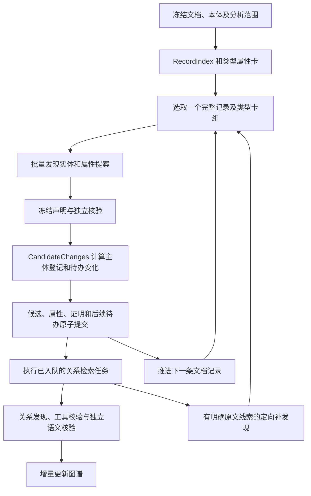

# 029 详细重构方案：记录发现、候选事件与关系识别

日期：2026-09-19。状态：**已按 Spec Kit 实施；工程验证通过，真实模型质量验收待完成，已重新部署供手工测试**。

需求依据为 [spec.md](spec.md)。本方案在保留未提交的 028 批处理及相关修复的基础上实施。下文区分重构前依据与最终实现；工作区实现与实际部署分别核验，当前部署状态见 [deployment.md](deployment.md)。实际验证、代码身份与未完成项见 [implementation.md](implementation.md)。

## 1. 核心决策

### 2026-09-19 输入与展示修正

按依赖顺序执行：章节描述共享 → 可严格推导的本体/主体重复信息消除 → Harness 分栏。新增纯模型输入投影，作用于授权验证之后、初始请求保存之前；不改变服务端 SchemaCard、VerificationInput、内容哈希、工具契约和持久化状态。

1. 顶层 `shared_context.source_sections` 按章节及描述内容共享标题、摘要和来源；`source_catalog` 保留 `record_id`、`section_ref`、`authorized_evidence_ids`。批次共享描述，但各成员目录及 `evidence_refs` 独立授权。
2. 本体卡只消除与当前主体完全相等的 `subject_ref`、与详细范围类完全一致的 `range_class_iris`。核验依赖仅在完整内容与本成员已登记依赖一致时改用 `{id, revision}` 引用；不按 ID 粗略合并，不取全批次权限并集。
3. 单任务及记录任务在序列化前投影；批次先渲染完整成员并核对原文权限，再统一投影。已保存阶段输入原样继续，不追改已发送请求。
4. Harness 兼容新旧输入，原始请求和完整消息保持原样；结构化展示将内部目录、证据及本体卡分离，并按实际阶段命名。
5. 验证真实适配器请求、成员权限负例、核验引用修订、保存响应继续和前端 SSR；字节减量与真实 token/质量评测分开报告。此次无新依赖、数据库迁移或本体写入，宪章检查沿用本特性边界并通过。

将主链路由“已知主体 → 单谓词/多谓词检索 → 发现对象 → 关系成立 → 展开对象”，改为：

**文档记录 → 批量提出实体及属性 → 独立核验 → 登记运行内候选并产生变化通知 → 调度关系识别 → 独立核验关系 → 增量更新图谱。**

采用逐批流水处理：实体发现与关系识别交错，已发现实体不等待全文结束。实体自身的准入不再依赖入边；关系与属性的具体事实仍必须分别证明。

首期一个发现任务处理一个完整记录和一组类型卡，可以输出多个实体及其多个属性。多个记录共享一次模型请求不列为首期前置要求；关系阶段保留 028 同主体、同记录多谓词组包能力。

候选事件采用执行器内的确定性变化通知，结果表现为当前候选与后续任务同事务写入。继续复用一个执行器、一个调度入口、一份权威工作状态、一份最新展示缓存，以及独立的精排结果和调用账本。

## 2. 重构前依据与实际改动边界

| 代码位置 | 重构前已核验事实 | 本次处理 |
|---|---|---|
| [scheduler.py](../../backend/app/services/extraction/ontology_guided/scheduler.py) `RecognitionTask` | 必须绑定主体、谓词、记录和 scope | 保留谓词任务，增加明确的记录发现任务类型。 |
| [recognition_batch.py](../../backend/app/services/extraction/ontology_guided/recognition_batch.py) `compatible_members` | 只合并同主体、同记录、同 scope 的不同谓词 | 继续服务关系及定向属性任务，不把增加 max_members 当成多实体发现。 |
| [ontology_plan.py](../../backend/app/services/extraction/ontology_guided/ontology_plan.py) `compile_local_menu` | 针对具体主体编译一跳菜单 | 提取按类型编译属性/关系定义的纯逻辑，实例菜单仍保留。 |
| [claim_protocol.py](../../backend/app/services/extraction/ontology_guided/claim_protocol.py) `DiscoveryEnvelope` | 已有实体、属性、关系、观察及指称绑定数组 | 复用原子声明；新增记录阶段的授权外壳和动态 Schema。 |
| [claim_freeze.py](../../backend/app/services/extraction/ontology_guided/claim_freeze.py) `freeze_proposal` | 校验属性/关系主体和谓词必须等于当前任务目标 | 原分支保留；新增记录发现冻结入口，不全局放宽门禁。 |
| [verification.py](../../backend/app/services/extraction/ontology_guided/verification.py) `build_generic_proof_menu` / `ProofGate` | 证明菜单仍依赖任务主体，根主体享有特定桥接许可 | 按每条声明的真实主体生成证明许可，不能用根伪装记录任务。 |
| [executor.py](../../backend/app/services/extraction/ontology_guided/executor.py) `expand_tool_relations` / `subject_is_active` | 关系通过后登记对象主体，主体活跃性依赖登记和证明 | 提取独立实体准入；关系展开保留范围依赖职责。 |
| 同文件 `apply_outcome` | 再次核对结果主体/谓词与任务一致 | 按任务种类校验发布授权，记录发现不能绕过最后门禁。 |
| [current_state.py](../../backend/app/services/document_analysis/current_state.py) `write_work` / `persist_batch` | 候选正文通过 candidate_ref 引用，工作变化、证明和队列可原子发布 | 加入发现进度和候选引起的队列变化，复用事务。 |
| [projection.py](../../backend/app/services/extraction/ontology_guided/projection.py) | verified 已保留独立有效实体；effective 保留根可达含义 | 复用，不造根关系；前端 tool 协议已默认 verified。 |

现有 `task_outcome`、`progress`、`graph_update` 不等于实体驱动调度。本期增加的是候选变化到任务的业务处理，不建设另一套持久事件系统。

## 3. 目标流程与分析范围



图中的通知处理逻辑在生成提交增量时完成，G 的结果随 F 在同一边界提交；检索、模型和精排在提交后执行。无模型调用发生在候选写入事务内。

### 3.1 类型范围编译

输入为现有冻结 `OntologySnapshot`、文档根类型、分析范围/焦点路径、深度限制和既有类型裁选策略。

1. 从根类的合法直接关系出发，按冻结深度逐层收集合法目标类及其适用属性，包含本体允许的继承类型。
2. 使用现有继承、range 和约束合并语义；不能把多值 range 自动改成 union，也不能把未解析 range 开放为任意类。
3. 保留关系路由及路径位置，类型集合只用于实体发现；焦点路径不能退化为“这些类型间的所有关系都可识别”。
4. 文档根属性单独绑定已知根引用。根引用是文档上下文，不是记录发现任务的假主体。
5. 编译结果随运行冻结。摘要、词面和精排可影响处理顺序，不能永久删去范围内类型后宣称完整扫描。

这里明确改变“类型只有在实例入边成立后才能参与发现”的调度规则，不改变本体事实。新管线中既有深度限制用于界定允许发现的本体路径范围；实例是否从根可达仍由已证明关系和投影计算，不以类型目录代替实例路径。新旧管线的范围语义必须在各自冻结策略中区分。

若完整类型卡目录过大，按可测容量形成稳定类卡组；任务身份包含卡组 hash。当前按 [031](../031-semantic-record-discovery/plan.md) 比较阅读组与卡片的语义视图，每组只准入有限相关卡；未入选组合未经识别，不能报告该记录全部目标类型已检查。单个类型卡仍过大时保留容量不足，不增加任意属性分片协议。

类卡组在该逻辑任务第一次付费请求前冻结；首期不在请求发送后拆组或更换卡组。后续定向补发现回到该记录/类型所属的原卡组和 lineage，仅增加具体线索，不重新领取扫描额度。这样任务身份、覆盖收据和预算归属始终一致。

### 3.2 文档记录与上下文

复用 [records.py](../../backend/app/services/extraction/ontology_guided/records.py) 的 `RecordIndex`：段落是记录，表格数据行是记录；表头、注释、父表和字段组提供带角色的上下文。

- 一批包含一个目标记录的事实来源及必要上下文，保留精确原文锚点和物理单元身份。
- 不因文本被放在同一提示中，就将辅助标题、邻段或摘要升级为事实来源。
- 合并单元格可能参与多条逻辑记录，物理 mention 身份继续由真实单元格与 span 决定。
- 记录组成实体须证明其组成及主体角色，不能把任意一行、章节或字段值自动变成实体。
- 全部类卡组在首次请求前按类型数与卡片 token 预算确定；实际请求再校验完整上下文容量。单记录或单类卡仍超限时标记未完成，不在已冻结组内删属性、拆记录或静默截断原文。

发现覆盖按“记录及类卡组”表达。正文引用可重复用于不同声明，但不因此重复计为新的源记录。

## 4. 内部任务、卡片与上下文契约

以下省略部分实现字段，完整可导入契约见 [record_discovery.py](../../backend/app/services/extraction/ontology_guided/record_discovery.py)。记录任务保留明确的 `kind`、`scope` 和记录身份，不建立通用工作流框架。

### 4.1 两种明确的任务

```python
class RecordDiscoveryTask:
    kind: Literal["record_discovery"]
    task_id: str
    claim_lineage_id: str
    record_id: str
    schema_card_id: str
    analysis_scope_ref: str
    dependency_hash: str
    # 引用运行内冻结文档、本体及源记录；不含 subject / predicate 占位值

# 保留 RecognitionTask：主体 + 谓词 + 记录 + scope。
# 新管线用它执行关系识别，以及已有明确主体的定向属性补充。
```

`RecordDiscoveryTarget` 保存 task、文档身份、本体 hash、卡片和原文授权 hash。此时尚无具体声明，不能虚构 `claim_ref` 或借用根 `subject_ref`。

发现任务稳定身份由运行身份、记录、卡片和分析范围导出；证据补充/重提沿原 lineage 增加当前版本，不生成新的免费额度。首次扫描、补发现和调用协议均使用该明确任务身份。

### 4.2 按类型保存属性约束

```python
class ClassPropertyCard:
    class_iri: str
    properties: list[SlotSpec]       # 包括合法继承属性
    quantity_policies: list[QuantityPolicy]
    identity_keys: list[IdentityKeySpec]
    unsupported_constraints: list[ConstraintIssue]

class RecordDiscoverySchemaCard:
    schema_card_id: str
    ontology_snapshot_id: str
    analysis_scope_ref: str
    class_cards: list[ClassPropertyCard]
    # 显式授权既有实体另由上下文提供；不包含关系发现权限
```

约束查找必须使用 `(真实主体 class_iri, predicate_iri)`。两个类使用同一谓词但 datatype、单位或基数不同，不能求并集后取第一个定义。

实际提取/新增纯函数 `compile_class_predicates()`、`compile_discovery_catalog()`、`compile_record_schema_card()` 和 `resolve_claim_schema()`。最后一个函数供冻结、工具、facet 选择及 finalize 共同调用，防止不同环节各自选错菜单。

### 4.3 上下文与证据授权

`TaskContext.target` 使用谓词任务目标与 `RecordDiscoveryTarget` 的明确联合；模型输入另有记录发现视图。所有读取 `target.subject_ref` 的调用点须进入对应分支，禁止用 `getattr(..., root)` 隐式兜底。

已新增 `assemble_record_discovery_context()`，复用现有 fragment、`ContextAuthorization`、字段结构、hash 和协议钩子。输入包含：

- 当前记录及其事实/辅助片段；文档、结构和本体版本。
- 逐类属性卡、数量和标识约束。
- 此次明确授权的既有实体引用及其原文证明，用于精确复用和指称绑定。
- 当前范围、必要反证和单位上下文。

授权既有实体由同物理提及、字段归属、明确引用及有限候选检索确定；不得默认传入整个运行实体集合。看见一个候选的原文，不等于获准抽取其其他属性。

## 5. 实体与属性批量发现、核验及身份

### 5.1 发现回答

复用 `DiscoveryEnvelope` 的原子结构：

| 字段 | 记录发现阶段规则 |
|---|---|
| `entities` | 零到多个 `EntityProposal`，仅允许卡片类型，支持 mention 和 record 表达。 |
| `properties` | 绑定本轮实体 local_id 或明确授权的既有实体；每项有值、字段、单位和限定证据。 |
| `reference_bindings` | 沿用当前运行内、具有独立证明的指称绑定范围。 |
| `observations` | 保存缺主体、歧义、缺证等原文观察，不表示事实成立或已覆盖全文。 |
| `relations` | 必须为空，关系在后续阶段识别。 |
| `external_links` | 初版记录发现必须为空；不扩张外部身份识别能力，既有已核验身份依赖仍可引用。 |

动态 Schema 和本地解析共同限定权限。未知类型/谓词、重复 local_id、错端点和越界引文不能通过宽松解析自动修正。

### 5.2 冻结与证明

新增 `freeze_record_proposal()`，保留原 `freeze_proposal()` 的单主体单谓词限制。只提取真正共享的原文解析、冻结引用、内容 hash 和依赖校验逻辑。

1. 先建立本轮实体 local_id → 类型/冻结引用映射，核对 mention 或 record 原文。
2. 属性主体必须是合法本轮实体或本次授权实体。属性不能引用另一个属性、其他运行节点或自行编造的全局 ID。
3. 按主体类卡检查属性权限；值必须来自事实授权来源，字段和单位证据角色保持不变。
4. 构造独立核验输入，不传发现阶段推理。实体保留 `type/referent/subject_role`；属性保留归属、字段、谓词、桥接、值、适用单位、限定及反证维度。
5. 按声明的真实主体生成 proof menu 和最终 `VerificationTarget`。普通实体不能获得根专有的 `document_subject_description` 桥接权限。
6. 沿用实体 → 指称绑定 → 属性的依赖顺序确定性接纳。可以在一个核验请求中评价多个目标，但最终发布按依赖逐项决定。

实体 E1 类型失败，只阻断依赖 E1 的属性；E2 可以成功。实体成立、某属性失败时仍保留实体。结构损坏导致回答无法可靠切分时保留技术失败，不能任意挑 JSON 片段接纳。

单条有效实体不以“全部属性齐全”为前提；具体本体的必需约束仍按其适用语义处理。未解析约束或非法值不得被模型 `supported` 覆盖。

### 5.3 身份复用

- 同类型、同物理提及按既有精确身份规则复用；同一单元格出现在多条逻辑行中不能重复生成 mention。
- 同名不同位置仅产生检索线索。跨位置同指须独立证明对象、阶段、批次、粒度及作用域。
- 当前 record 实体不具备按任意组件集合自动合并的语义。本期保留其组成证明身份；稳定任务及提交收据只解决同结果重复发布，不承担语义去重。
- 后续关系阶段优先引用已登记实体。确需补发现时先带入对应记录已登记对象作为复用候选；组成相似仍不授权自动合并。
- 本轮发现重复的精确 mention 可按原规则映射至同一实体；不能顺势引入任意“新实体之间语义合并”的机制。

补发现重提默认修复未接纳项或补充新声明，已接纳实体作为登记引用输入。record 的冻结 claim ID 含 generation，因此完全相同的已接纳 record 被再次作为新提案输出时，不能直接 finalize 为新节点：若类型、全部组件角色及物理锚点、作用域均精确匹配，返回明确的重复提案错误并要求引用已有对象；本期不自动合并或改写其 local_id。多个可能匹配对象、组件不同或归属未证时保持未决。该检查还覆盖不同类卡组中同类型重复提案的情形。

### 5.4 属性补充

初次记录扫描负责批量发现本记录支持的属性；不在每个新实体登记后无差别再启动“全部属性 × 全部文档”的第二遍扫描。

自动补充只针对原记录的 `unbound / ambiguous / unknown` 观察：后到候选同时命中允许类型与原文/已证明指称时，沿原记录任务和原 lineage 携带来源锚点重提，仍核验完整声明。人工否决后的显式属性修复使用原主体/谓词任务，主体取被审核属性的实际所属实体。两种入口均不触发全属性全文扫描；模糊同名不能触发全篇属性搬运。

同一谓词允许多个合法值，已有一个属性值不等于该谓词全文检查完成。新的记录仍正常扫描；定向任务只避免重做完全相同的声明、来源和授权。

## 6. 模型执行与工具改动

已在现有 `ToolModelRecognitionAdapter` 增加 `inspect_record()`，阶段编排位于新增 `record_model_adapter.py`。复用原模型传输、阶段回答、调用预留、精确响应保存和工具配对。不得复制一套独立模型客户端或恢复执行器。

`FrozenClaimSet`、`VerificationInput` 和 finalizer 保留原子声明/逐目标证明语义；需要显式支持记录发现卡及目标，不能宣称现有函数可不加修改直接接入。

| 工具或能力 | 记录发现阶段处理 |
|---|---|
| `inspect_evidence`、`resolve_source_anchor` | 保留证据引用参数和授权检查。 |
| `propose_mentions` | 保留 `schema_card_id`；运行时支持记录卡的类集合，结果只是候选线索。 |
| `find_referent_candidates` | 保留 mention、类和 scope 参数，按记录卡裁选允许类型与候选。 |
| `check_claim_binding` | 保留 claim_id，按冻结声明实际主体核对归属。 |
| `validate_metric`、属性确定性 SHACL | 按实际主体的类卡选属性定义和数量策略，沿用现有执行职责。 |
| `get_schema_card` | 记录卡直接随初始输入提供，本期不新增取卡工具接口。 |
| `retrieve_evidence` | 不暴露给无预定主体/谓词的初次记录发现；已有主体的定向补证继续使用现有入口。 |
| `propose_repair` | 首期记录分支不暴露；允许携具体错误在原额度内重提，定向谓词任务保留原修复能力。 |
| 关系 `validate_graph` | 保留在关系核验阶段的必需调用，结果不代替原文语义证明。 |

首期保留每个记录发现任务的完整目标集合核验，不新增 target/facet 分片协议。当前 `finalize_claims()` 要求核验结果、VerificationInput 与冻结声明目标集合一致，因此不能裁剪 FrozenClaimSet 或把缺失目标伪造为已核验。发送发现请求前按完整发现/核验容量保守组卡；冻结后若完整核验仍超限，保存冻结提案和容量不足状态，不能删目标、发空核验或假装成功。不同记录/类卡组仍可独立完成，单批内语义拒绝只影响相应依赖。

为发现请求预留必要核验额度。输出截断或未完整响应不能解析成部分成功；首期此类容量失败保持未完成，不在同任务内修改已冻结的类卡授权，也不新建替代任务重获额度。普通可定位的回答格式错误可在原授权和剩余额度内修正。无可核验目标时确定性结束本阶段，不发送空核验请求。不能静默限制实体数量来获得形式完整。

## 7. 候选事件与关系调度

### 7.1 事件的准确含义

这里的“候选实体生成事件”指**本次运行内可用候选发生变化**。模型原始提案先保存于既有调用结果中；只有实体类型、指称和必要组成通过核验后，才具有关系任务主体/端点资格。这些实体仍是待业务使用或人工审核的运行候选。

已新增轻量值对象：

```python
class CandidateChanges:
    created_entity_refs: list[VersionedRef]
    changed_entity_refs: list[VersionedRef]
    property_refs: list[VersionedRef]
    affected_record_ids: list[str]
    # 只传引用和变化范围，不复制候选正文，不持久化独立事件队列
```

实体本身 revision 未变但新指称/证据使上下文可用时，变化仍须指明受影响实体和记录；后续任务依赖 hash 包含相关证明/来源引用，不能仅看实体是否第一次出现。

`apply_candidate_changes()` 在当前执行器内确定性计算入队变化。重复提交同一批次由已有收据消解；同业务输入由 scheduler 去重。运行侧原 `progress`/观察回调可反映进度，但不承担恢复权威职责。

### 7.2 主体登记与适用范围

已提取执行器内的 `register_entity_subject()`，使已证明实体可以在没有入边时获得文档局部主体资格。`subject_is_active()` 检查节点版本、类型/指称/组成证明和当前任务范围，不以一般入边作为必需条件。

原 `expand_tool_relations()` 继续处理关系组、成员范围和依赖。例如“从 A、B 中选择一个”建立的组内属性任务仍依赖该组，不因 A、B 也在实体目录中就转成无条件事实。

本次发现事实可直接使用文档局部范围；带条件、否定、模态的属性必须保留其限定。实体被提及不证明其实际投入、存在于当前批次或具有组成关系。

### 7.3 关系候选筛选

以现有主体/谓词/记录任务为执行粒度，任务携带此次明确授权的候选端点引用。不要先为所有实体对建立持久任务。

1. 从已核验主体的合法菜单和冻结分析范围得到允许谓词。
2. 按谓词目标类型约束，从当前实体索引中筛选候选对象。
3. 用同记录的完整断言线索、字段组、明确指称和跨章节原文检索确定待处理记录与候选端点。相似度仅排序。
4. 关系模型只能引用本次已授权的实体端点；新管线关系发现回答的 `entities`、`properties` 为空。发现未登记对象时产生带原文定位的 unbound 观察，交给定向实体发现。
5. 每条关系冻结后执行现有 `validate_graph`，再独立核验完整主体—谓词—对象断言。方向、选择组、极性、条件、模态和范围全部保留。

只靠结构邻近筛选可能漏掉跨章节关系，因此继续复用当前主体感知原文检索。检索未命中、低分或本次候选集合为空，均不表示全文不存在该关系。候选端点过多时使用有界授权分页；页外候选保持未尝试，不能借缩小候选页宣称关系全集已检查。多对象关系组必须作为完整声明核验，不能因分页拆成多条普通边。

实际分页按 `endpoint_page_size=8` 保存当前页与剩余引用页。同记录/已证明指称端点，以及通过名称或别名相交形成的完整歧义组不拆开；组过大时交给容量门处理。`work:record_relation_inputs` 只保存引用、候选签名、当前任务及分页状态，不复制候选正文。同一候选签名下累积各页语义结果；后页预算不足仍保留前页已支持统计，并显示未完成。冷继续使用已付费协议冻结的端点授权。

按类型、原文位置和已证明指称建立的查找索引由当前候选内存构造；不建立第二份实体正文仓库。

**跨阶段指称证明已加入明确契约。** 重构前 [source_assertions.py](../../backend/app/services/extraction/ontology_guided/source_assertions.py) 的 `_verified_bindings()` 只接受本轮绑定目标，并要求证明匹配本轮 context。记录优先关系阶段 `entities=[]` 现通过以下窄用途变更消费前一轮已证明的“其 → A”：

- 基于既有 `reference_resolutions`、实体来源和证明记录，构造只读 `ReferenceBindingDependencyView`（定义和验证位于 `reference_dependencies.py`，原证明重建位于 `record_binding_evidence.py`），包含精确绑定/证明引用、源提及锚点、目标实体引用、原 document/scope 和源身份。
- 关系输入只授权本次相关、仍有效的绑定链；原证明按原冻结输入验证，所有要使用的原文重新进入当前上下文授权。旧 context hash 不要求等于新关系 context hash，但旧证明的身份、内容、来源及 scope 不能跳过检查。
- `SourceAssertion` 增加明确的既有绑定引用字段，区分本轮 local binding ID。冻结、核验输入和 `validate_source_assertion()` 验证引用属于上述授权依赖，并以真实源提及核对当前主体/对象角色。
- 关系的主体绑定、对象绑定与完整谓词仍在当前关系上下文独立核验；旧指称证明只证明“谁指向谁”，不能证明“谁与谁是什么关系”。失效、跨文档、范围不兼容或缺少源锚点的绑定拒绝使用。

例如记录一出现 A，记录二为“其含 B”：实体阶段证明“其”指向 A，关系阶段可引用该证明并核对记录二的角色和谓词，不能重新造一个“其”实体，也不能仅凭原 A 名称断言关系。

### 7.4 后到对象、证据变化与去重

变化处理同时考虑新实体作为主体和对象的机会。后到对象需唤醒已有主体的受影响关系槽，不能只给新实体创建出边任务。

保留原关系 lineage 作为预算归属；具体尝试的依赖 hash 加入主体版本、当前授权对象/证明引用、谓词、记录证据及 scope。只有这些相关输入改变，才重开相应工作；不使用全图 revision 导致全部关系重跑。

原调度槽通常没有对象集合维度，因此必须同步调整“槽已检查/无候选”的复用判断：相同记录在新端点授权下是新尝试，但仍继承原 lineage 额度和先前有效结果。实体发现记录已检查与关系记录已检查分开维护。

### 7.5 有限补发现与结束条件

关系任务发现范围内合法新对象的原文线索时，生成同一记录/目标类卡的定向发现请求；已有活动任务则合并提示，不另启同一源任务。新实体或新有效来源产生后才重开受影响关系。

已有扫描结果显示该范围未决时，可以在原剩余额度内携具体错误或遗漏线索重提；没有新证据、没有可操作反馈或额度耗尽时保留未完成，不能事件自激循环。相同线索的重复通知不能不断重提。

调度沿用一个协调器：有待办的记录发现与关系/定向属性任务交错取一个工作单元；某一侧无待办则继续另一侧。首期沿用顺序模型执行，不引入线程池或并发模型队列。

有限候选待办耗尽只代表当前发现调度结束。运行终止还需考虑活动协议、关系/属性待办和未决请求；未入选与未决语义分别保留，不能报告为所有事实均已证明。

## 8. 当前状态、原子提交与暂停继续

### 8.1 数据归属

复用 `state_storage_version=4` 的通用当前分区和现有候选/证明存储。增加内部 JSON 分区与协议字段本身不要求新表；若实施发现真实数据库结构变更，再补对应迁移，不能用修改 JSON 含义掩盖不兼容契约。

| 数据 | 权威位置 | 本次变化 |
|---|---|---|
| 文档、原文索引、本体和分析范围 | 现有冻结制品/运行策略 | 增加发现类型目录及其确定性身份；恢复不能从最新本体重建另一范围。 |
| 实体、属性、关系、组的当前内容 | 现有候选记录；`work:nodes/properties/edges/relationship_groups` 保存 candidate_ref | 继续通过 `write_work()` 写引用，不在发现进度再存正文。 |
| 发现调度进度 | 新增 `work:record_discovery` 及当前控制字段 | 按记录/卡组保存已准入任务的当前状态及结果引用，使用 WorkMap 增量。 |
| 关系分页进度 | 新增 `work:record_relation_inputs` | 保存候选输入签名、当前页/剩余页的引用及语义汇总，继续沿原 lineage 计费。 |
| 待执行任务 | 现有 scheduler 当前分区 | 增加记录发现分支；关系和定向属性继续复用原任务。 |
| 当前活动协议 | 现有 calls:protocols + 唯一 active_unit_ref | 明确区分记录发现与谓词批次协议；不复制整个活动上下文到工作状态。 |
| 模型响应、工具结果、调用成本 | 现有 calls:results 和请求账本 | 增加记录任务 owner/版本校验，响应仍只保存一份。 |
| 精排结果 | 现有独立精排分区/结果 | 关系检索继续复用，不把精排缓存拷入实体对象。 |
| 最新展示 | 现有 public/latest graph 缓存 | 由本次提交的变化更新，非恢复权威输入。 |
| CandidateChanges | 内存中的业务变化值 | 处理结果成为待办增量；不另存事件表、消费游标或回放队列。 |

发现任务状态采用 `pending / active / examined / incomplete`，其含义是执行状态；另引用实际提案、核验结果及原因。`examined` 只表示该授权范围获得完整可解释的处理结果，不能代表语义全部 supported。未准入的记录/卡组没有成功收据，仍为未尝试。

当前使用冻结 RecordIndex、卡组目录与 `work:record_searches` 的有限候选调度。先由本地语义模型批量编码，再每组保留达到阈值的最多 2 张卡；准入后从待办移除，明确原文缺口可有界补选。只有实际准入组合写任务行，其余组合仅记未入选计数；不使用全组合扫描游标。向量缓存复用精排分区，原文不存入每个状态行。

### 8.2 单批提交契约

当前 `ExecutionBatch` 的任务目标/结果已明确支持记录发现和谓词工作单元，公共图元素继续复用原模型。发布校验依任务种类检查：

- 谓词任务：仍必须匹配主体、谓词、记录及 scope。
- 记录任务：实体必须来自其允许类型/原文，属性绑定合法实体及相应类卡；禁止混入关系。

模型与工具调用在事务外执行。单个候选发布边界如下：

```text
已保存的精确模型响应与独立核验结果
    → 从当前节点视图完成 finalize
    → 生成候选/证明变化和 CandidateChanges
    → 确定性生成主体登记、受影响待办及发现进度变化
    → persist_batch 的一个现有事务：
        结果归属校验 + 证明 + 候选引用 + 工作/队列变化
        + 当前协议标记 + 最新展示 + 批次收据
```

跨批复用同一实体时，finalize 使用最新已接纳节点视图，避免不同任务为相同 canonical ID 发布互不一致的证明内容。已有节点引用与新声明自身的证明各守归属。

提交失败时不对外暴露“候选已写、关系未安排”的中间结果；协调器丢弃失败的暂存视图并从已提交当前状态恢复，不能继续使用已 drain 但未落库的内存队列。无需新增故障恢复平台，此为现有事务边界在新任务上的延续。

### 8.3 暂停位置与恢复行为

| 已持久化状态 | 继续行为 |
|---|---|
| 仅选中任务，尚未发模型请求 | 恢复活动任务/队列所有权，按原授权开始。 |
| 已预留调用但没有已确认响应 | 保留未知结局、成本和未完成；沿既有策略处理，不能记为空候选或自动退款。 |
| 发现响应已保存，尚未冻结/核验 | 复用原响应继续解析、冻结和独立核验，不重发发现请求。 |
| 先前记录/卡组已完成，本批核验尚未完成 | 已完成任务不重做；本批恢复原完整核验目标及已保存工具结果，不隐式增加逐目标分片。 |
| 结果已保存，候选事务未提交 | 从保存结果重新 finalize 和原子发布，不重新识别。 |
| 候选/待办事务已提交，调用方未收到确认 | 通过现有批次收据确认，不重复候选和入队。 |
| 发现已完成，关系仍待办 | 继续关系/属性任务，不重新扫描全部记录。 |

暂停在已有安全边界确认；继续只加载当前状态，不回放 CandidateChanges、progress 或历史图。对于请求已发送但结果不可确认的情形，不承诺任意中断都能保证无重复费用。

## 9. 预算、覆盖与性能

### 9.1 预算归属

- 一次实际模型请求只计一次物理调用及实际 tokens；参与目标/任务同时继承自己的既有限额。
- 记录发现使用记录/卡组稳定 lineage。产生十个实体不等于获得十份重新发现该记录的预算。
- 关系任务沿原主体/谓词/记录 lineage 继承额度；候选版本变化、加入对象、补证和重组均不清零。
- 一次核验请求可处理多个实体/属性；成本归属是本次实际参与目标的任务，不平均摊派为若干虚构物理调用。
- 在线沿用当前 `_ExecutionBudget` 的连续执行窗口、累计调用账本和 lineage/任务限额。一次显式启动或继续可以开启新窗口；累计请求与原 lineage 已用额度不返还，自动接续不重置窗口。本期不新增运行全生命周期总预算机制。

记录任务及其已有主体的定向补充任务可能不同，但都进入同一在线连续窗口和累计请求账本。反复产生相同补发现提示须被业务键和当前反馈版本去重，不能借“创建新任务”获得无限执行机会。用户另有明确总额度限制时必须遵守，不能因重构扩大授权。

真实对照的“相同总预算”由评测入口现有总物理请求限制执行。该入口目前包装 `inspect`/`inspect_work_unit`，接入 `inspect_record` 时必须同步绑定请求预留和暂停检查，否则会漏计新阶段成本；这属于评测适配，不是新增在线预算体系。

### 9.2 覆盖口径

| 口径 | 表示什么 | 不表示什么 |
|---|---|---|
| 发现覆盖 | 哪些记录/类型卡组被完整检查，哪些未尝试或未完成 | 所有实体均被召回，或所有属性成立。 |
| 属性结论 | 某主体、谓词、值、来源及范围的逐项证明 | 同谓词在全文无其他值。 |
| 关系覆盖 | 哪些主体、谓词、原文及端点授权范围实际处理 | 未进入候选集合的对象均无关系。 |
| 图谱有效性 | 当前节点/边/属性具有相应证明和有效依赖 | 已人工确认或已提交业务事实库。 |

内部必须保留这些区别以便预算和验收；本期不恢复用户已要求隐藏的覆盖计数 UI，也不增加新的运行统计面板。

### 9.3 预期收益与真实成本

收益来源是同一记录内共享实体/属性上下文、减少递归等待及重复发现对象。成本可能上升的地方包括更广的记录扫描、较大的类卡和多实体核验输出、孤立候选增加以及跨章节指称处理。

无工具且容量足够的合成例：一条记录含 3 个实体、每个 2 项属性；在已有主体条件下，028 至少按 3 个主体分别发现/核验属性，记录发现可把本记录实体及属性纳入一次发现和一次核验。两者任务内容不完全相同，该例仅说明共享请求机会，不作为真实提速倍数或正式基准。

真实对照必须同时给出：实体/属性/关系质量、完整路径、未决和未评分项、记录/类型覆盖、调用数、input/output tokens、首个可用实体/属性/关系时间及总耗时。不得只报告关系队列变短。

## 10. 接口、前端与版本切换

### 10.1 对外行为

上传、选择文档类型、启动、暂停、继续、查询和删除接口保持现有使用方式，不增加用户操作步骤。

图谱实体、属性、关系与组的公共结构优先保持不变；保持公共 `extraction_protocol="ontology-tool-extraction-v1"` 的证据和投影语义，内部管线另行版本化。现有 [前端 API 客户端](../../frontend/src/lib/api.ts) 已为该协议选择 verified 投影，已有孤立节点展示可复用。

文档分析界面继续以图谱为主。若当前观察面板需要说明执行中任务，提供“识别记录中的实体和属性”“核验关系”等业务标签，不能将无主体任务显示成某个假实体，也不暴露恢复协议细节。

`effective` 投影仍表示根可达的有效肯定子图，不能为了显示更多实体改变其语义。刷新、GET 和切换图谱投影继续为查询操作。

进入现有 API 可见字段的内部 `task` 联合，已同步后端 schema、前端类型和调用者，并验证记录任务的类卡展示；不使用占位主体适配旧形状。原 `all_candidates` 不承诺展示调用账本中尚未成功冻结的原始模型提案。

### 10.2 新旧运行

`freeze_tool_engine_policy()` 现为新运行默认冻结：

```json
{
  "recognition_pipeline": "record-entity-first-v1",
  "record_discovery": {
    "version": "record-discovery-v2",
    "max_classes_per_card": 4,
    "endpoint_page_size": 8,
    "candidate_cards_per_record": 2,
    "minimum_similarity": 0.25
  }
}
```

类型目录、组包容量、分析范围与实际既有配置共同进入运行指纹；上述为最小识别标记示意，不增加用户必须手动配置的开关。内部记录任务协议使用 `ontology-record-discovery-v1`，与原谓词批次协议显式区分。

现有状态存储版本 v4、模型调用状态版本以及任务协议版本是不同概念。增加记录任务时分别评估需要扩展的验证器，不能统一把所有版本号加一来掩盖含义变化。

新增 SourceAssertion 绑定依赖字段及任务判别字段时，旧协议继续按原形状解析/序列化。未提供的新字段不能自动写入旧冻结对象、改变内容 hash，或令旧已保存结果失去归属校验。

旧运行按自己的冻结策略继续，已有单任务/谓词批次分支只承担既有运行的执行。新运行完成必要验收后默认选择新管线；不增加新运行的自动旧管线回退，也不在本期清理历史运行和账本。

特别注意 `_recognition_fingerprint()` 当前包含 `OntologyGuidedExecutor.version` 等版本值。实施必须依据冻结管线选择对应的版本身份，避免只改一个全局常量使所有旧运行无法继续。此处只保留必要的明确版本分支，不建设通用迁移/兼容框架。

发布时核对实际新建运行的冻结策略和执行任务类型。代码存在、服务健康或环境开关配置正确，都不能单独证明新管线已实际启用。

## 11. 文件与函数改动清单

下表列出实际落点。实施前已保存当前未提交基线并保护独立修复；未重排整个 executor 或批量格式化仓库。

| 文件/区域 | 具体工作 | 对应需求 |
|---|---|---|
| **新增** `ontology_guided/record_discovery.py` | RecordDiscoveryTask/Target/Card、CandidateChanges、纯任务身份及容量/覆盖契约。 | RFR-01/02/06/10 |
| `ontology_plan.py` | 提取按类编译属性/关系的纯逻辑；编译冻结发现类型目录和类卡。 | RFR-01/02 |
| `context.py`（复用 `context_records.py`） | 记录目标联合、记录发现视图、精确原文授权；保留结构和字段角色。 | RFR-03 |
| `claim_protocol.py`、`claim_freeze.py`、`source_assertions.py` | 记录回答 schema、freeze_record_proposal、逐 claim 类卡解析；既有指称绑定依赖与关系角色证明；重复 record 提案门禁。 | RFR-02/05/07/09 |
| **新增** `reference_dependencies.py`、`record_binding_evidence.py` | 从保存的发现/核验引用重建原指称证明，验证跨阶段授权、依赖及当前角色；不存第二份上下文。 | RFR-07/09/11 |
| `verification.py` | 按实际 claim 主体生成 proof menu/VerificationTarget，消除记录任务对根主体的借用。 | RFR-04/05/07 |
| `tool_runtime.py`、`batch_model_adapter.py` | 提及/指称类集合、binding、metric、SHACL 按实际 claim 主体授权。 | RFR-03/05/09 |
| **新增** `ontology_guided/record_model_adapter.py`；原 `tool_model_adapter.py` | 新 inspect_record 阶段编排；复用传输、工具配对、预算和回答修正基础能力。 | RFR-02/05/12 |
| `recognition_execution.py` | 明确调用记录发现或原谓词工作单元，保留现有协调器钩子。 | RFR-11/12 |
| `executor.py`（复用 `scheduler.py`） | 记录惰性准入、独立实体登记、候选变化到关系任务、定向属性/补发现、任务种类发布校验。 | RFR-04/06/08/10 |
| `current_work.py` | 记录协议/当前分区及验证器；每次只 drain 真实变化键。 | RFR-11/12 |
| `document_analysis/current_state.py`、`execution.py`（复用 `batch_current_state.py`） | 协议结果归属、原子队列变化、冷继续、冻结策略和版本指纹。 | RFR-11/12 |
| 后端 schema、`harness.py`、`reviews.py`、前端 API/分析组件（复用 `projection.py`） | 原投影语义回归；仅在新内部任务进入可见字段时补类型和业务标签。 | RFR-13 |
| `app/evaluation/ontology_tool_engine.py`、`quality_guided_variant.py` | 薄适配器选择同一冻结管线；记录发现接入总请求预算钩子和指标，不实现第二套发现算法。 | RFR-12/14 |

模块间最小新增入口为：`compile_record_schema_card`、`assemble_record_discovery_context`、`freeze_record_proposal`、`resolve_claim_schema`、`inspect_record`、`register_entity_subject`、`apply_candidate_changes`。如果已有函数经小范围提取即可满足，不必为每个入口新建模块。

## 12. 实施阶段与验收门槛

1. **契约和范围**：实现任务/目标/类卡、类型目录和反例测试。先证明多实体授权不会扩大原谓词任务权限。
2. **单记录闭环**：用受控模型响应完成多实体、多属性的发现、独立核验和候选输出；覆盖不同类共享谓词、根权限、record 组成和部分失败。
3. **候选驱动关系**：加入独立主体登记、候选变化、关系端点授权与晚到对象重开；复用原关系工具及证明门。
4. **在线当前状态闭环**：原子发布发现进度/候选/待办，覆盖付费响应继续、未知请求、版本冲突和暂停后冷恢复。
5. **展示和旧运行回归**：孤立实体及属性可见；GET 无副作用；旧冻结策略继续，新运行实际使用新策略。
6. **真实模型对照及启用核验**：固定相同输入、本体、模型、参考和总预算，记录质量/覆盖/成本结果。必要验证完成后新运行默认启用，工程、模型结果与部署状态分别记录。

具体任务见 [tasks.md](tasks.md)，验证场景、实际测试入口和新增测试见 [quickstart.md](quickstart.md)。新用例覆盖真正业务失败模式，不以检查函数名或照抄实现代替验收。

## 13. 关键反例与设计代价

| 风险/代价 | 方案中的约束与验收 |
|---|---|
| 批量提取降低主体归属精度 | 属性携自己的 subject、field、value、unit 证据，逐 claim 核验；两个对象同字段的错配反例。 |
| 第一次扫描漏实体导致关系永久漏召回 | 后到候选唤醒及带原文线索的定向补发现，原 lineage 额度不重置。 |
| 类型目录扩大 prompt，整轮成本反增 | 受分析范围约束，类卡容量组包，完整覆盖与实际 tokens 一起报告，不预设提速。 |
| 共享谓词误用单位/类型约束 | 所有环节统一按主体类和谓词解析，测试相同 IRI 不同类约束。 |
| 类型分组和补发现造成重复 record 实体 | 已登记候选引用输入，精确重复 record 提案拒绝并反馈；提交收据只防重放，不冒充语义去重。 |
| 跨阶段代词绑定无法用于关系 | 显式传入仍有效的既有绑定证明与原文授权，关系角色与谓词仍独立核验。 |
| 已冻结任务因缩组获得新预算 | 首次请求前确定卡组；首期发送后不拆组，容量失败保留未完成。 |
| 晚到实体造成旧关系槽不再运行 | 槽的尝试依赖包含受影响端点/证据授权，限定重开范围。 |
| 类型允许连接被当成事实 | 关系工具只校验结构和身份，完整谓词原文仍须独立核验。 |
| 候选事件循环和队列膨胀 | 不穷举全实体对；重复输入去重；明确新线索、额度和无改进结束条件。 |
| 条件/选择组属性变成无条件事实 | 文档局部主体与关系派生 scope 分开；后者仍依赖关系及成员证明。 |
| 冷继续重复收费或丢待办 | 精确响应先保存，候选与入队原子发布，未知结局保留，复用既有收据。 |

## 14. Constitution Check 与本次交付状态

| 检查 | 结论 |
|---|---|
| 规范驱动 | 已形成需求、设计、任务及验收；用户要求按 Spec Kit 实施后完成相应代码和必要验证。 |
| 本体权威与保真 | 不修改 TTL 或推出新类型/谓词；目录只投影冻结本体。 |
| 测试与契约 | 新内部任务/授权先定义，公共字段如受影响须先同步契约；工程与真实评测分开。 |
| 最小复杂度 | 新增记录发现契约/执行与跨阶段指称依赖的四个模块，复用现有调度、证明、状态和调用账本；不新增数据库表或第三方依赖作为设计前提。 |
| 离线部署 | 继续现有本地模型和工具策略，无新增运行时外网依赖。 |
| 当前状态 | 仅暂停继续；按变化键写入，最新展示与独立调用/精排结果分开。 |

已完成上述边界的代码实现和工程验证；工程验证阶段未重启业务服务；后续已按用户授权重新部署前后端和网关，见 [deployment.md](deployment.md)。PostgreSQL 验证使用可销毁专用测试库，模型对照使用现有本地服务与新评测目录。记录源属性的人工审核保留原发现任务归属，显式修复再生成真实主体/谓词任务；空审核发布边界禁止改写候选、证明、协议和已付费结果。实际结果与限制见 [implementation.md](implementation.md)，不以历史测试数量替代本次验证。
